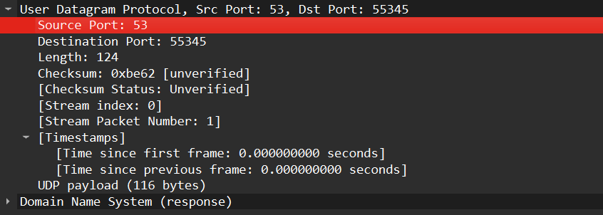
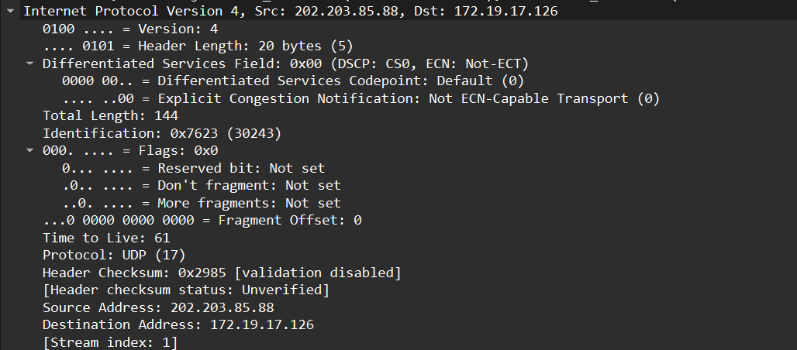
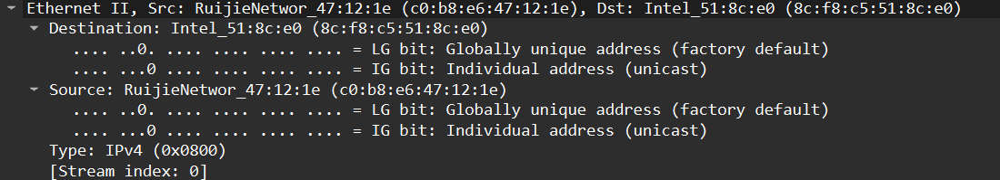
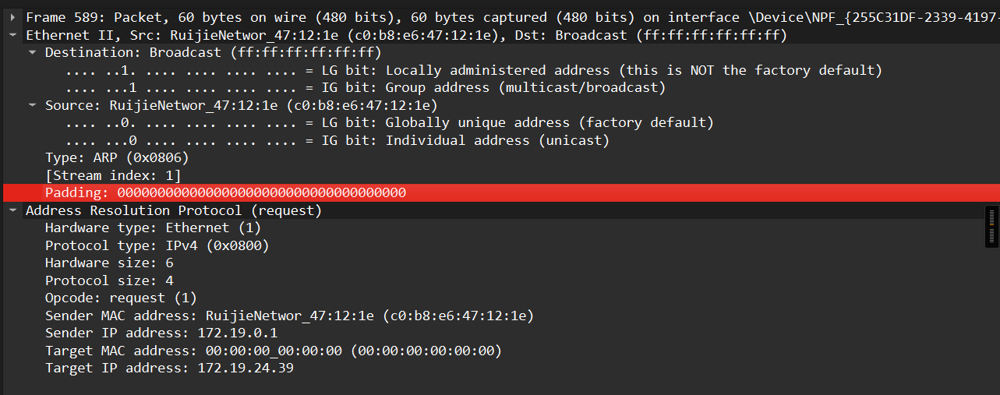
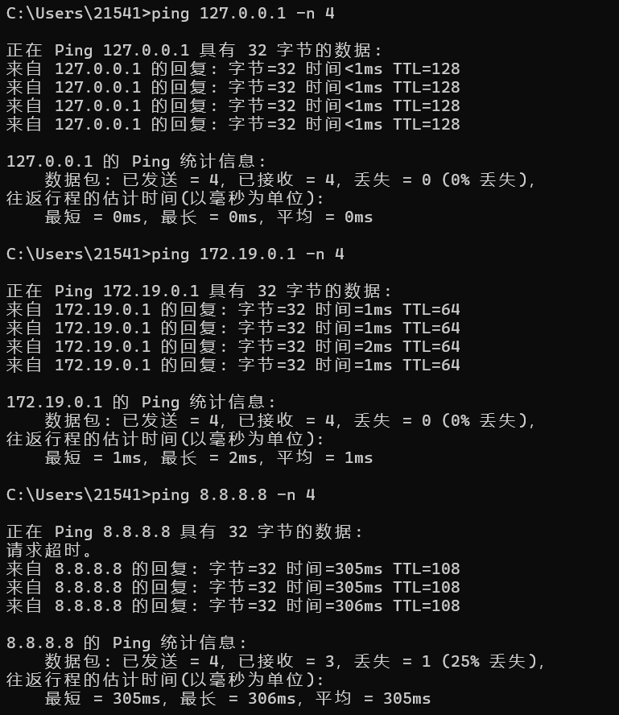

# Lab5：IP 与以太网的包收发操作

## 实验背景

本实验围绕 IP 模块与以太网在包收发过程中的角色展开，重点观察以下内容：

1. 网络包的基本结构：头部（IP 头部 + MAC 头部）与数据
2. IP 头部各字段的含义：版本号、TTL、协议号、发送方/接收方 IP 地址等
3. MAC 头部各字段的含义：接收方/发送方 MAC 地址、以太类型
4. IP 地址与 MAC 地址的区别与协作
5. ARP 协议如何通过 IP 地址查询 MAC 地址
6. 路由表的结构与查询方式
7. UDP 协议与 TCP 协议的区别：无连接、无确认、无重传
8. UDP 头部结构：发送方端口号、接收方端口号、数据长度、校验和
9. ICMP 协议的作用与常见消息类型（Echo、Destination Unreachable 等）

---

## 实验任务

### 任务一：查看路由表、ARP 缓存并启动 Wireshark

**第一步：打开 Wireshark，选择主网络接口，开始抓包**

> **注意**：本次实验必须使用真实网络接口（`en0`/`eth0`/`以太网`），不要选回环接口。回环接口不经过以太网，无法观察到 MAC 头部和 ARP 过程。

选择你的主网络接口，开始抓包。本次实验的大部分任务会共用同一次抓包。

**第二步：查看本机路由表**

```bash
# Linux
route -n
ip route show

# macOS
netstat -rn

# Windows
route print
```

截图并保存为 `route_table.png`。

**第三步：查看本机 ARP 缓存**

```bash
# Linux / macOS / Windows
arp -a
```

截图并保存为 `arp_cache.png`。

**第四步：填写下表**

从路由表和 ARP 缓存的输出中提取信息：

| 项目                         | 你的填写内容 |
| :--------------------------- | :----------- |
| 本机 IP 地址                 |172.19.17.126 |
| 本机所在子网                 |172.19.17.0/24 |
| 子网掩码                     |255.255.255.0              |
| 默认网关 IP                  |172.19.0.1              |
| 默认网关 MAC 地址            |c0-b8-e6-47-12-1e |
| 本机网卡 MAC 地址            |8c-f8-c5-51-8c-e0|

简答题：

1. 路由表的每一行包含哪些关键字段？教材中提到的 `Network Destination`、`Netmask`、`Gateway`、`Interface` 分别对应什么含义？
Network Destination：表示目标网络地址，即数据包要到达的网络段。
Netmask：子网掩码，用于判断目标 IP 是否在同一子网。
Gateway：下一跳网关地址，数据包需要转发给该设备。
Interface：本机出口网卡，数据包从该网卡发送。


2. 当目标 IP 地址不在本子网时，包会先发给谁？路由表的哪一列提供了这个信息？
当目标 IP 不在本子网时，数据包会先发送给默认网关（路由器）。该信息由路由表中的 Gateway 列提供。


3. 路由表的默认网关（`0.0.0.0`）条目的作用是什么？什么时候会匹配到这一行？
默认网关条目匹配所有未在路由表中明确列出的目标网络，即所有外网访问。当系统找不到更具体的路由时，就会使用这一条，保证设备可以访问互联网。


4. 教材提到，确定发送方 IP 地址的关键在于"判断应该使用哪块网卡"。结合你查到的本机网卡信息，说明 IP 模块是如何做出这个判断的。
IP 模块根据目标 IP 地址查询路由表，找到最长匹配的路由条目，使用该条目对应的 Interface（网卡接口） 发送数据，并使用该网卡的 IP 作为源 IP。


---

### 任务二：观察 UDP 头部

只要计算机处于联网状态，Wireshark 中就会持续出现大量 UDP 流量（DNS、mDNS、DHCP、NTP 等），无需手动生成。

**第一步：在 Wireshark 中设置过滤器**

```text
udp
```

**第二步：在包列表中找一个 UDP 包**

随便选一个即可。如果包太多，可以加上源或目的 IP 来缩小范围，例如 `udp && ip.addr == 你的IP`。如果需要 DNS 包，也可以用 `udp.port == 53` 过滤。

> **可选**：如果想明确看到一个完整的请求-响应对，可以在终端中执行 `nslookup example.com`，Wireshark 中就会出现对应的 DNS 请求包。

**第三步：点击选中的 UDP 包，在详情栏展开 `User Datagram Protocol`**

填写下表：

| 项目               | 你的填写内容 |
| :----------------- | :----------- |
| UDP 头部总长度     |8 字节|
| 源端口             |53              |
| 目的端口           |55345             |
| 长度（Length）     | 124             |
| 校验和（Checksum） | 0xbe62             |

简答题：

1. 你观察到的 UDP 头部长度是多少字节？TCP 头部至少 20 字节。UDP 省略了哪些字段？这些字段的缺失带来了什么后果？
UDP 头部固定为 8 字节。相比 TCP，UDP 省略了序号、确认号、窗口大小、标志位、数据偏移、紧急指针、选项字段等。
这些字段的缺失使 UDP 无连接、不可靠、不保证顺序、不重传，但大幅降低开销、提升传输速度。


2. UDP 头部中的"长度"字段指的是什么长度？
长度字段表示 UDP 头部 + UDP 数据载荷 的总长度，单位为字节。




---

### 任务三：观察 IP 头部字段

点击任务二中的同一个 UDP 包，在详情栏展开 `Internet Protocol Version 4`。

填写下表：

| 字段名称               | 你的填写内容 | 含义说明 |
| :--------------------- | :----------- | :------- |
| Version（版本号）      |4	              |IPv4 协议          |
| Header Length（头部长度） |20 字节	            |IP 头部长度，无选项   |
| Time to Live（TTL）    | 61             | 数据包可经过的最大路由跳数 |
| Protocol（协议号）     |17	              |上层协议为 UDP      |
| Source Address（源 IP） |202.203.85.88              |DNS 服务器地址  |
| Destination Address（目的 IP） |172.19.17.126	        | 本机地址    |

简答题：

1. 协议号字段的值是多少？它代表什么协议？如果抓一个 HTTP 请求的包，协议号会变成多少？
协议号为 17，代表 UDP 协议。若抓取 HTTP 包，HTTP 基于 TCP，协议号为 6。


2. TTL 字段的作用是什么？如果 TTL 降为 0 会发生什么？
TTL 用于防止数据包在网络中无限循环。每经过一个路由器，TTL 减 1。当 TTL 降为 0 时，路由器丢弃该包，并向源主机返回 ICMP 超时消息。


3. 有教材提到 IP 地址"实际上并不是分配给计算机的，而是分配给网卡的"。你的本机有几块网卡？每块网卡的 IP 地址分别是什么？（提示：可参考任务一中路由表的 Interface 列，或用 `ip addr`（Linux）/`ifconfig`（macOS）/`ipconfig`（Windows）查看。）
IP 地址并非分配给计算机，而是分配给网卡。本机有多块网卡：
172.19.17.126（物理网卡）
192.168.99.1、192.168.56.1、192.168.17.1（虚拟网卡）
每块网卡独立拥有 IP 地址。


4. IP 头部中的源 IP 地址和目的 IP 地址分别是谁的地址？它们与 MAC 头部中的源/目的 MAC 地址有什么区别？
源 / 目的 IP：端到端地址，从发送到接收全程不变。
源 / 目的 MAC：链路层地址，每经过一跳路由器都会改变。
IP 负责跨网寻址，MAC 负责局域网投递。




---

### 任务四：观察 MAC 头部与以太网帧

点击任务二中的同一个 UDP 包，在详情栏展开 `Ethernet II`。

填写下表：

| 字段名称               | 你的填写内容 | 含义说明 |
| :--------------------- | :----------- | :------- |
| Source（源 MAC）       |c0:b8:e6:47:12:1e	      |网关 MAC 地址      |
| Destination（目的 MAC） |8c:f8:c5:51:8c:e0	       | 本机 MAC 地址    |
| Type（以太类型）       |0x0800	              |表示 IPv4 协议   |

关于 MAC 地址格式，填写下表：

| 项目               | 你的填写内容 |
| :----------------- | :----------- |
| MAC 地址长度       | 48 比特（6 字节） |
| 本机网卡的 MAC 地址 |8c-f8-c5-51-8c-e0              |
| 目的 MAC 地址      |8c-f8-c5-51-8c-e0              |
| MAC 地址的书写格式 |十六进制，冒号分隔              |

简答题：

1. 以太类型字段的值是多少？它代表后面承载的是什么协议的包？
以太类型为 0x0800，表示以太网帧数据部分承载的是 IPv4 数据包。


2. DNS 服务器的 IP 通常是外网地址。本任务中目的 MAC 地址是 DNS 服务器的 MAC 地址还是你本机网关（路由器）的 MAC 地址？为什么？
DNS 服务器在外网，不在同一局域网。数据包由网关转发给本机，因此目的 MAC 是本机 MAC，源 MAC 是网关 MAC。


3. IP 地址和 MAC 地址在功能上有什么相似之处？又有什么本质区别？
相似：都是设备的唯一标识地址，用于定位设备。
区别：
MAC：硬件地址，出厂固定，工作在链路层，仅局域网有效。
IP：逻辑地址，可配置，工作在网络层，可跨网路由。


4. 为什么以太网帧中需要同时有 IP 地址（在 IP 头部中）和 MAC 地址？不能只用其中一种吗？
IP 负责跨网找到目标主机。
MAC 负责局域网内投递到下一跳。
缺少任何一个都无法完成完整传输。




---

### 任务五：观察 ARP 协议

ARP（Address Resolution Protocol，地址解析协议）用于根据 IP 地址查询 MAC 地址。只要计算机处于联网状态，Wireshark 中通常会持续出现 ARP 包（邻居发现、缓存刷新等），可以直接观察。如果抓包一段时间后仍未看到 ARP 包，再手动触发。

**第一步：在 Wireshark 中设置过滤器**

```text
arp
```

**第二步：在包列表中找 ARP 包**

正常联网的设备每隔几分钟就会自动发送 ARP 请求，等待即可。如果等了一会儿仍没有，可以选择以下任一方式手动触发：

- **方式 A（推荐）**：在终端中执行 `arping`

  ```bash
  # Linux（通常已预装）
  sudo arping -c 3 <网关IP>

  # macOS（如果没有，先执行：brew install arping）
  sudo arping -c 3 <网关IP>

  # Windows（可从 https://github.com/ThomasHabets/arping/releases 下载）
  arping -c 3 <网关IP>
  ```

- **方式 B**：先清除 ARP 缓存，再 ping 同网段地址

  ```bash
  # 清除 ARP 缓存
  # Linux:   sudo ip neigh flush all
  # macOS:   sudo arp -d -a
  # Windows: arp -d *

  # 然后 ping 网关
  ping <网关IP> -c 2
  ```

> **注意**：如果目标是 `127.0.0.1` 或外网地址，ARP 不会出现。回环接口不经过以太网，外网地址的 MAC 地址是路由器的（通常已缓存）。

**第三步：点击 ARP 请求包（Opcode 为 request），展开详情**

**第四步：填写下表**

| 项目                     | 你的填写内容 |
| :----------------------- | :----------- |
| ARP 请求的目的 MAC 地址 |ff:ff:ff:ff:ff:ff（广播）              |
| ARP 请求中查询的目标 IP |172.19.24.39              |
| ARP 响应中返回的 MAC 地址 | 目标设备 MAC             |
| 该 ARP 包是自动出现还是手动触发的 | 自动             |

简答题：

1. ARP 请求的目的 MAC 地址为什么是 `ff:ff:ff:ff:ff:ff`（广播地址）？
发送方不知道目标 IP 对应的 MAC，必须向整个局域网广播，让所有设备接收并判断是否回复。

2. 为什么 ARP 缓存中的条目会在几分钟后自动删除？
设备可能更换网卡或 IP，缓存条目会过期失效。自动删除可保证地址映射准确，避免通信异常。

3. 如果 ARP 缓存中的 MAC 地址已经过期（对方 IP 对应的设备已更换），会出现什么问题？如何解决？
过期会导致数据包发送到错误 MAC，无法通信。
系统会自动重新发送 ARP 请求，获取最新 MAC 并更新缓存。




---

### 任务六：使用 `ping` 命令观察 ICMP

有教材提到了 ICMP（Internet Control Message Protocol）协议，它用于在 IP 层传递错误和控制信息。`ping` 命令就是基于 ICMP 的 Echo Request（类型 8）和 Echo Reply（类型 0）实现的。

**第一步：在 Wireshark 中设置 ICMP 过滤器**

```text
icmp
```

**第二步：在终端中执行 ping 命令**

```bash
# ping 本机（回环）
ping 127.0.0.1 -c 4

# ping 局域网内的设备（如路由器网关）
ping <网关IP> -c 4

# ping 外网地址
ping 8.8.8.8 -c 4
```

**第三步：在 Wireshark 中观察 ICMP 包**

填写下表：

| 目标               | 是否收到回复 | 往返时间（ms） | TTL 值 |
| :----------------- | :----------- | :------------- | :----- |
| 127.0.0.1          |是              | <1ms      | 128       |
| 局域网设备（网关） | 是	             | 1ms           |64        |
| 8.8.8.8            |  是            |  305ms          |108       |

> **提示**：ping 回环地址（`127.0.0.1`）时数据不经过物理网卡，Wireshark 在主网络接口上可能无法捕获到包。TTL 值可从终端输出中读取（`ping` 会显示 `ttl=...`），或切换 Wireshark 至回环接口（`lo0` / `lo`）抓包。

简答题：

1. `ping` 命令发送的是什么类型的 ICMP 消息？收到的回复又是什么类型？
ping 发送 ICMP Echo Request（类型 8），接收 ICMP Echo Reply（类型 0）。


2. 为什么 ping 不同目标的 TTL 值不同？TTL 值反映了什么信息？
TTL 每经过一个路由器减 1。不同目标经过跳数不同，最终 TTL 不同。TTL 反映网络距离（跳数）。
当目标 IP 不存在、端口未开放、路由不可达时出现。
Code 1：主机不可达
Code 3：端口不可达

3. 教材表 2.4 中列出了多种 ICMP 消息类型。`Destination unreachable`（类型 3）在什么情况下会出现？请用以下方法尝试触发并观察：

   ```bash
   # 方法一（推荐）：ping 同网段内一个确认不存在的 IP
   # 例如你的本机 IP 是 192.168.1.100，子网掩码 255.255.255.0，
   # 那么可以 ping 192.168.1.250（一个大概率没有被分配的地址）
   ping <同网段不存在的IP> -c 3
   
   # 方法二：向一个关闭的端口发 UDP 包，触发 ICMP Port Unreachable
   # 先在 Wireshark 中保持 icmp 过滤器，然后执行：
   # Linux / macOS
   echo "test" | nc -u -w 1 <同网段某台设备的IP> 19999
   
   # Windows（需安装 nmap：https://nmap.org/download.html）
   nmap -sU -p 19999 <同网段某台设备的IP>
   ```

   观察到类型 3 的包后，记录其 Code 值（子类型）并说明代表什么含义。




---

## 问答题

1. 网络包由哪几部分构成？IP 头部和 MAC 头部分别的作用是什么？
网络包由 以太网头部 + IP 头部 + 传输层头部 + 数据 构成。
MAC 头部用于局域网投递；IP 头部用于路由寻址。


2. IP 协议和以太网协议在网络传输中分别承担什么职责？它们是如何分工协作的？
IP：网络层，负责跨网传输、端到端寻址。
以太网：链路层，负责同一局域网内的数据投递。
IP 确定目标，以太网负责送到下一跳。


3. ARP 协议解决的核心问题是什么？如果不使用 ARP 缓存，网络中会出现什么情况？
ARP 解决 IP 地址到 MAC 地址的映射。
无 ARP 缓存会每次都广播，网络拥塞、速度极慢。


4. 为什么 IP 和负责传输的网络（如以太网）要分开设计？这种设计带来了什么好处？
IP 与链路层分离，使 网络可替换、可扩展、易维护、易排错，支持多种物理网络统一使用 IP 协议。


5. 网卡在发送包时会额外添加哪 3 个控制数据？它们各自的作用是什么？
前导码：同步时钟
帧开始定界符：标记帧开始
FCS：帧校验序列，用于检错


6. 网卡接收到一个包后，需要经过哪些步骤才能将其交给操作系统？如果 FCS 校验失败会怎样？
校验 FCS → 匹配 MAC → 拆帧 → 上交操作系统。
FCS 错误则直接丢弃，不向上传递。


7. TCP 和 UDP 的核心区别是什么？请从连接管理、可靠性、效率、适用场景四个维度进行比较。
TCP：面向连接、可靠、有序、重传、慢，适合文件、网页。
UDP：无连接、不可靠、无序、不重传、快，适合直播、游戏。


8. UDP 适用于哪些场景？请结合教材内容解释为什么这些场景适合使用 UDP 而非 TCP。
DNS、视频直播、游戏、语音通话。
这些场景追求低延迟，可容忍少量丢包，不需要 TCP 的可靠性开销。


9. 如果一个 IP 包经过多次路由转发后 TTL 降为 0，路由器会如何处理？这与教材中提到的哪种 ICMP 消息有关？
路由器丢弃数据包，并返回 ICMP 超时消息（类型 11），防止无限循环。


---

## 截图要求

- 截图须清晰，终端文字和 Wireshark 字段可读。
- 所有截图与本 `Lab5.md` 放在同一目录下。
- 命名规范：

| 截图内容         | 文件名               |
| :--------------- | :------------------- |
| 路由表           | `route_table.png`    |
| ARP 缓存         | `arp_cache.png`      |
| UDP 头部字段     | `udp_header.png`     |
| IP 头部字段      | `ip_header.png`      |
| 以太网帧字段     | `ethernet_frame.png` |
| ARP 请求与响应   | `arp.png`            |
| ICMP ping        | `icmp.png`           |

具体要求：

1. `route_table.png`：终端截图，显示 `route -n`（Linux）、`netstat -rn`（macOS）或 `route print`（Windows）的完整输出。

2. `arp_cache.png`：终端截图，显示 `arp -a` 的完整输出。

3. `udp_header.png`：Wireshark 截图，展开 `User Datagram Protocol`，能看到 Source Port、Destination Port、Length、Checksum。

4. `ip_header.png`：Wireshark 截图，展开 `Internet Protocol Version 4`，能看到 Version、Header Length、TTL、Protocol、Source Address、Destination Address。

5. `ethernet_frame.png`：Wireshark 截图，展开 `Ethernet II`，能看到 Source、Destination、Type。

6. `arp.png`：Wireshark 截图（若能观察到），展开 ARP 包的详情，能看到发送方的 MAC 和 IP、查询的目标 IP。

7. `icmp.png`：Wireshark 截图，能看到 ICMP Echo Request 和 Echo Reply，以及 TTL 字段。

---

## 提交要求

在自己的文件夹下新建 `Lab5/` 目录，提交以下文件：

```text
学号姓名/
└── Lab5/
    ├── Lab5.md
    ├── route_table.png
    ├── arp_cache.png
    ├── udp_header.png
    ├── ip_header.png
    ├── ethernet_frame.png
    ├── arp.png
    └── icmp.png
```

---

## 截止时间

2026-05-07，届时关于 Lab5 的 PR 请求将不会被合并。