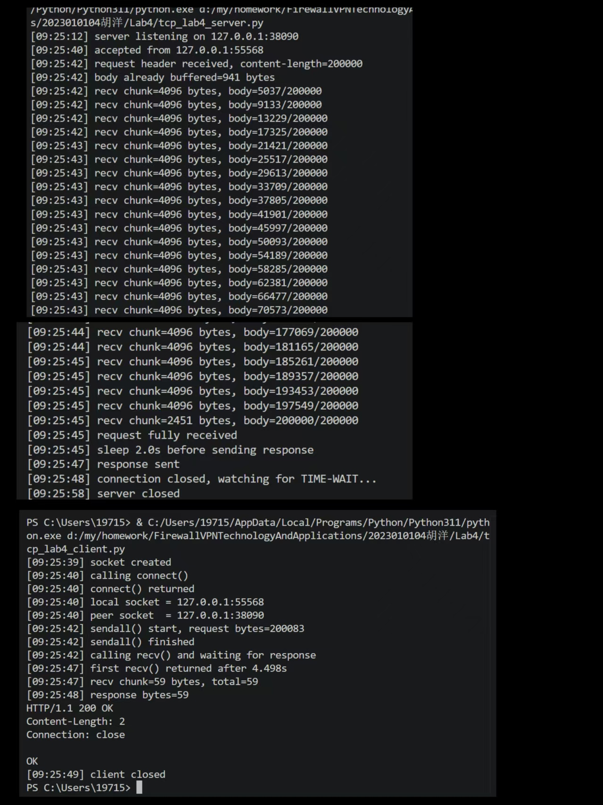
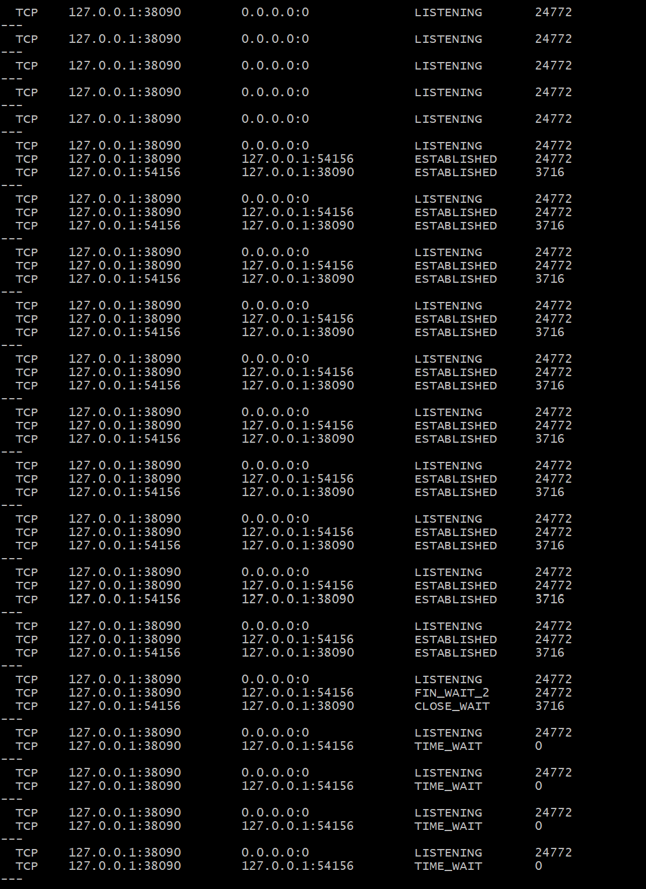
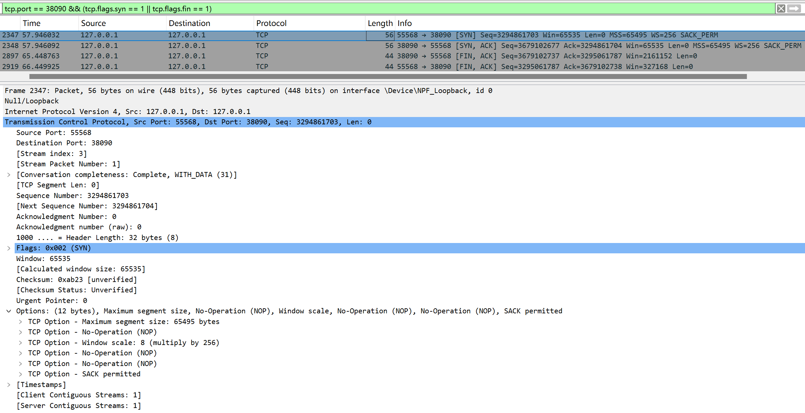
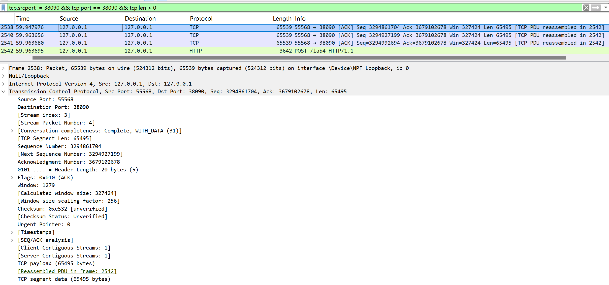
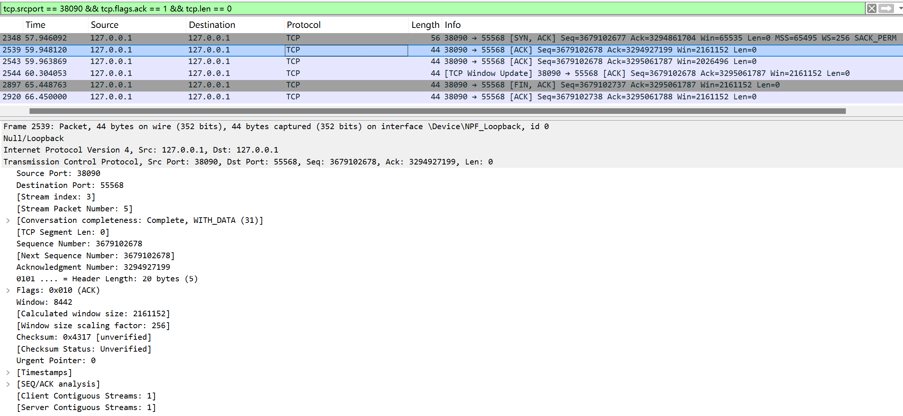
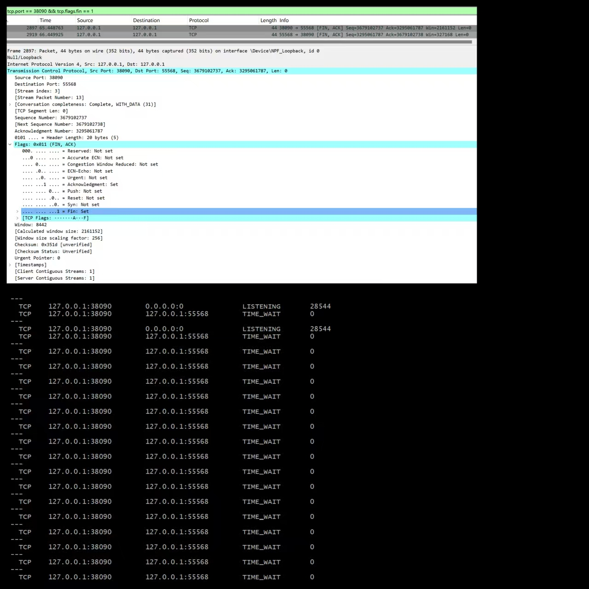

# Lab4：看见TCP 我不怕不怕啦

## 实验背景

本实验围绕一条 TCP 连接的完整生命周期展开，重点观察以下内容：

1. `socket()`、`listen()`、`accept()`、`connect()` 的职责区别
2. "连接"为什么本质上是交换控制信息而不是物理连线
3. TCP 头部中的端口号、序号、ACK 号、标志位、窗口、头部长度、可选字段
4. 三次握手如何建立收发准备
5. 应用层大块数据如何被 TCP 按 MSS 拆分
6. `Sequence Number` 与 `Acknowledgment Number` 如何配合工作
7. `recv()` 为什么会阻塞等待数据
8. 接收窗口如何反映接收方处理能力
9. ACK 与窗口更新为什么常常会被合并
10. `FIN` / `ACK` 如何完成断开
11. 为什么连接结束后套接字不会立刻删除

---

## 实验任务

### 任务一：准备实验环境并记录运行信息

**第一步：准备好四个窗口**

整个实验需要同时观察多个界面，建议在开始前把窗口布局摆好：

- **终端 A**：运行服务端
- **终端 B**：运行客户端
- **终端 C**：持续监控套接字状态（全程保持开启，不要关）
- **Wireshark**：抓包

**第二步：在终端 C 里启动持续监控**

TCP 状态变化很快，等你手动敲完 `ss` 命令再回车，状态可能已经过去了。用下面的命令让终端 C 每 0.5 秒自动刷新一次，之后只需要盯着这个窗口就行：

```bash
# Linux
watch -n 0.5 'ss -tan | grep 38090'

# macOS（没有 watch，用循环代替）
while true; do netstat -an | grep 38090; echo "---"; sleep 0.5; done

# Windows（Git Bash执行）
while true; do netstat -ano | grep 38090; echo "---"; sleep 0.5; done
```

如果你换了端口，把 `38090` 替换成实际端口。

**第三步：打开 Wireshark，选回环接口，填好过滤器，开始抓包**

回环接口在不同系统里名字不同：

| 系统 | 接口名 |
|:-----|:-------|
| Linux | `lo` |
| macOS | `lo0` |
| Windows | `Adapter for loopback traffic capture`（需提前安装 Npcap 并勾选回环支持） |

在显示过滤器里输入：

```text
tcp.port == 38090
```

然后点击开始抓包（蓝色鲨鱼鳍图标）。**先开始抓包，再运行脚本**，否则握手包会被漏掉。

**第四步：启动脚本**

```bash
# 终端 A
python3 tcp_lab4_server.py

# 终端 B（等服务端打印出 server listening on ... 后再运行）
python3 tcp_lab4_client.py
```

如果 `38090` 已被占用，两端都加环境变量换端口，同时记得把 Wireshark 过滤器和终端 C 里的端口号也改掉：

```bash
LAB4_PORT=38123 python3 tcp_lab4_server.py
LAB4_PORT=38123 python3 tcp_lab4_client.py
```

**第五步：填写下表**

| 项目                                | 你的填写内容 |
| :---------------------------------- | :----------- |
| 服务端监听地址                      |    127.0.0.1          |
| 服务端监听端口                      |   38090           |
| 客户端本地临时端口                  |    55568          |
| 客户端请求总字节数                  |      200083        |
| 服务端响应内容                      |  HTTP/1.1 200 OK,Content-Length: 2,Connection: close,响应体OK            |
| 客户端 `connect()` 返回前后的时间点 |  calling connect() 09:25:40,connect() returned 09:25:40           |
| 客户端首次收到响应前等待了多久      |      4.498s        |

各项数值均可直接从终端输出读取：服务端监听信息在 `server listening on ...`，客户端本地端口在 `local socket = ...`，请求字节数在 `sendall() start, request bytes=...`，等待时间在 `first recv() returned after ...s`。



---

### 任务二：观察套接字创建与连接建立

1. 服务端启动后，观察终端 C 出现 `LISTEN` 状态，截图留存。
2. 在终端 B 里启动客户端，观察它依次打印 `socket created`、`calling connect()`、`connect() returned`。
3. 客户端打印 `connect() returned` 之后，观察终端 C 出现 `ESTABLISHED`，截图留存。脚本在 `connect()` 返回后有 2 秒停顿，这段时间足够截图。

填写下表：

| 阶段                             | 你的填写内容 |
| :------------------------------- | :----------- |
| 服务端启动、客户端未连入时的状态 |  LISTEN     |
| `connect()` 返回后服务端状态     | ESTABLISHED             |
| `connect()` 返回后客户端状态     |     ESTABLISHED         |

简答题：

1. 服务端在客户端连接前为什么处于 `LISTEN`？
LISTEN 是服务端的被动监听状态，用于绑定端口并被动等待客户端的连接请求。
服务端必须先处于LISTEN,才能接受客户端的connect() 连接，否则连接请求会被丢弃。


2. 为什么这时还没有真正建立 TCP 连接？
服务端启动后仅处于LISTEN状态,仅完成了端口绑定和监听初始化,未收到客户端的三次握手报文。
只有当客户端与服务端完成三次握手(SYN → SYN-ACK → ACK)后，双方状态才会变为ESTABLISHED，此时才是真正的 TCP 连接建立。


3. `socket()` 与 `connect()` 的区别是什么？
socket
作用:创建一个套接字描述符,仅分配资源,不建立实际网络连接。
状态变化:调用后处于未连接状态。
核心功能:申请网络通信的 “句柄”,为后续通信准备基础对象。
connect
作用：主动发起TCP连接,触发三次握手过程。
状态变化:调用后完成三次握手，连接状态变为 ESTABLISHED。
核心功能:主动建立与服务端的网络连接,进入可收发数据的稳定状态。


4. 为什么 `connect()` 返回后才进入可稳定收发数据的状态？
connect()是阻塞式调用,会等待三次握手完成后才返回。
只有三次握手完成，双方状态才变为ESTABLISHED，此时TCP连接已建立，双方的序列号/确认号已同步，才能稳定可靠地收发数据。


5. 为什么"网线一直连着"不等于"TCP 连接已经建立"？
网线连通仅代表物理层/链路层的通路畅通,无法保证双方的IP/端口可达，也未经过TCP三次握手。
TCP连接建立需要三次握手，而网线连通只是物理硬件层面的通路，两者没有必然关联。


6. 这里的"连接"更准确地说是在做什么？
这里的“TCP连接”不是物理链路,而是指双方通过三次握手,同步了序列号、确认号等信息,并维护了连接状态的逻辑通道。




---

### 任务三：观察三次握手与 TCP 头部字段

**定位握手包**：在 Wireshark 过滤器里输入下面的条件，可以屏蔽中间的数据包，只留下握手和断开阶段的控制包：

```text
tcp.port == 38090 && (tcp.flags.syn == 1 || tcp.flags.fin == 1)
```

包列表最前面的三个包就是三次握手（SYN → SYN-ACK → ACK）。

**找到各字段的位置**：点击某个握手包，在下方详情栏展开 `Transmission Control Protocol`。源端口、目的端口、Seq、Ack、Flags、Window、Header Length 都在这里。TCP 选项在最底部的 `Options` 子项里，展开后可以看到 MSS、Window Scale、SACK Permitted，注意这三项只出现在带 SYN 标志的包里，纯 ACK 包里没有。

**关于序号显示**：Wireshark 默认开启相对序号，会把每个方向的初始序号归零显示，所以 SYN 包的 Seq 看起来是 `0`，而不是真实的随机大数。这是正常现象，实验报告按 Wireshark 显示的值填写即可。如果你想看真实值，可以去 `Edit → Preferences → Protocols → TCP` 里取消勾选 `Relative sequence numbers`。

填写下表：

| 报文       | 源端口 | 目的端口 | Seq  | Ack  | Flags | Window | Header Length |
| :--------- | :----- | :------- | :--- | :--- | :---- | :----- | :------------ |
| 第一次握手 |  55568      |     38090     |  3294861703    |   0   |   SYN    |    65535    |        32       |
| 第二次握手 |  38090    |    55568    |  3679102677   |  3294861704    |   SYN, ACK    |   65535     |       32        |
| 第三次握手 |   55568     |      38090    |  3294861704   |   3679102678   |   ACK    |   327424     |       32        |

第一次握手（SYN）的 Ack 字段在 Wireshark 里通常显示为空或 `0`，这是正常的，因为此时客户端还没有收到服务端的任何数据。Header Length 在没有选项时是 20 字节，握手包因为携带了 MSS 等选项通常是 28 或 32 字节。

| TCP 选项       | 你的填写内容 |
| :------------- | :----------- |
| MSS            |   65495 bytes           |
| Window Scale   |  8 (multiply by 256)            |
| SACK Permitted |  Yes            |

回环接口的 MSS 通常是 65495（因为回环 MTU 是 65536，比以太网的 1500 大得多），这会影响后续任务五里是否能观察到分段。

简答题：

1. 发送方和接收方端口号在连接阶段的作用是什么？
端口号用于区分同一主机上的不同进程,结合IP地址形成套接字,确保TCP报文能精准投递到对应进程，是TCP连接定位的核心标识。


2. TCP 头部如何帮助找到目标套接字？
TCP头部包含源端口、目的端口,报文到达主机后,操作系统通过解析这两个字段，结合IP地址匹配目标进程的套接字,完成数据分送。


3. 为什么初始序号不是简单固定从 1 开始？
固定从1开始易被预测导致安全风险,且无法区分重复报文ISN采用随机生成,可提高安全性、避免旧连接报文干扰,保证传输可靠性。


4. 为什么 TCP 可选字段更容易在连接阶段看到？
连接阶段通过SYN/SYN-ACK报文协商双方能力,这些能力需在连接建立时确定，可选字段仅在三次握手阶段集中传递,因此连接阶段最易看到。




---

### 任务四：区分头部中的控制信息和套接字中的控制信息

用以下过滤器分别找到两类报文：

```text
# 纯控制报文（无应用数据）
tcp.port == 38090 && tcp.len == 0

# 携带应用数据的报文
tcp.port == 38090 && tcp.len > 0
```

从纯控制报文里选一个（SYN、纯 ACK 或 FIN-ACK 都可以），从数据报文里选一个（客户端发请求或服务端发响应的包）。

填写下表：

| 项目                   | 你的填写内容 |
| :--------------------- | :----------- |
| 纯控制报文的类型       |  TCP SYN 报文            |
| 携带应用数据的报文类型 |  TCP数据报文            |
| 头部中的控制信息举例   | TCP标志位（SYN/ACK/FIN）、序列号 Seq、确认号 Ack、窗口大小 Win、校验和等             |
| 套接字中的控制信息举例 |  源 IP 127.0.0.1、目的 IP 127.0.0.1、源端口 55568、目的端口 38090            |

简答题：

1. 为什么"头部中的控制信息"和"套接字中的控制信息"不是同一件事？
两者的层级、作用和生命周期完全不同：
层级:头部控制信息属于TCP协议层;套接字控制信息属于操作系统层。
作用:头部控制单个报文的可靠传输;套接字标识连接，用于区分进程。
生命周期:头部信息随每个报文存在;套接字信息贯穿整个连接生命周期。


---

### 任务五：观察数据分段、序号与 ACK

客户端发送的请求体是 200000 字节，超过了回环接口 MSS（约 65495 字节），因此应该可以在 Wireshark 里看到多个连续的数据段。用下面的过滤器找到客户端发出的数据包：

```text
tcp.srcport != 38090 && tcp.port == 38090 && tcp.len > 0
```

在包列表里连续选几个数据段，对比它们的 Seq 值。相邻两段的关系是：后一段的 Seq = 前一段的 Seq + 前一段的 TCP Segment Len。

找服务端返回给客户端的纯 ACK 报文：

```text
tcp.srcport == 38090 && tcp.flags.ack == 1 && tcp.len == 0
```

填写下表：

| 数据段  | Seq  | Ack  | TCP Segment Len | Flags |
| :------ | :--- | :--- | :-------------- | :---- |
| 第 1 段 |  3294861704    |   3679102678  |      65495           |   ACK    |
| 第 2 段 |  3294927199   |  3679102678    |    65495            |   ACK    |
| 第 3 段 |  3294992694    |  3679102678    |     3642            |   ACK（HTTP POST）    |

| ACK 报文 | Ack Number | Flags | Window |
| :------- | :--------- | :---- | :----- |
| 第 1 个  |  3294927199          |   ACK    |    2161152    |
| 第 2 个  |     3294992694       |   ACK    |    2161152    |
| 第 3 个  |     3295061787       |   ACK   |    2161152    |

| 项目                         | 你的填写内容 |
| :--------------------------- | :----------- |
| 是否发生分段                 | 是（HTTP请求被拆分为3个TCP分段发送）             |
| 握手中观察到的 MSS           |  65495            |
| 单段长度与 MSS 的关系        |  前两段长度（65495）等于MSS，第三段（3642）小于MSS            |
| ACK 号大致确认到了第几个字节 |  每段的ACK号=上一段Seq+上一段 Len，累计确认到对应分段的末尾字节            |

简答题：

1. 应用程序是否直接决定每个网络包的数据长度？为什么？
不能。应用程序调用sendall()发送数据后，TCP协议栈会根据MSS自动拆分数据，应用程序无法直接控制每个网络包的长度。


2. 大块应用数据为什么会被拆分？
为了避免IP分片，TCP会根据MSS将大块数据拆分为多个分段，每个分段的大小不超过MSS，保证数据能顺利传输。


3. `MSS` 与 `MTU` 的关系是什么？
MSS = MTU-IP首部长度-TCP首部长度。MSS是TCP分段的最大数据部分长度，MTU是链路层的最大传输单元，MSS由 MTU决定。


4. "一次 `sendall()`"与"一个 TCP 包"之间是什么关系？
不是一一对应关系。一次sendall()发送的大块数据，会被TCP协议栈拆分为多个TCP分段发送，一个TCP包也可以包含多个send()的数据。


5. 为什么 ACK 体现的是累计确认？
ACK 号表示 “期望收到的下一个字节的序号”，即该序号之前的所有字节都已收到，因此是对前面所有数据的累计确认。


6. 如果中间某一段丢失，ACK 会出现什么变化？
接收方只会确认到已收到的连续数据的末尾序号，ACK号不会再更新到丢失段之后的序号，直到丢失段重传成功。





---

### 任务六：观察 `recv()` 阻塞与窗口字段

`recv()` 的等待时间直接从客户端终端读取，`calling recv() and waiting for response` 到 `first recv() returned after ...s` 之间就是等待时长，脚本已经帮你计算好了。

在 Wireshark 里找窗口值：用过滤器 `tcp.port == 38090 && tcp.flags.ack == 1` 列出所有 ACK 包，点击其中一个，在详情栏 `Transmission Control Protocol` 里找 `Window` 字段。如果同时显示了 `Calculated window size`，优先看这个值，它已经把 Window Scale 的缩放算进去了，是对方实际能接收的字节数。

如果包列表的 Info 列出现了 `[TCP Window Update]` 标注，说明这个包的主要目的是通知对方窗口变化，重点观察它的 `Window` 字段。

填写下表：

| 项目                                   | 你的填写内容 |
| :------------------------------------- | :----------- |
| 客户端开始调用 `recv()` 的时间         |    09:25:42          |
| 客户端第一次收到响应的时间             |   09:25:47          |
| `recv()` 是否立刻返回                  |    否          |
| 首次收到响应前等待了多久               |    4.498s          |
| `recv()` 等待期间连接是否已经建立      |      是        |
| 第 1 个 ACK 报文的窗口值               |  2161152            |
| 第 2 个 ACK 报文的窗口值               |     2026496         |
| 第 3 个 ACK 报文的窗口值               |   2161152           |
| 窗口值是否变化                         |     基本不变        |
| 若变化，变化趋势                       |   稳定无明显波动           |
| ACK 与窗口更新是否可以出现在同一个包中 |     是         |
| 是否看到 RTT 或 ACK 往返时间相关信息   |      否      |

简答题：

1. "连接建立"和"应用收到数据"之间是什么关系？
连接建立是前提，只有connect()成功返回、连接处于ESTABLISHED状态，应用才能通过recv()收到数据。


2. 为什么说 `read` / `recv` 在数据未到达时会被挂起？
它们是阻塞调用，当内核接收缓冲区无数据时，会阻塞等待，直到数据到达或超时。


3. 窗口字段反映了接收方哪方面的能力？
反映了接收方当前的接收缓冲区可用大小，代表接收方的接收能力。


4. 为什么发送方不能无限制连续发送数据？
受接收方窗口限制，超过缓冲区容量会导致数据溢出、丢包，引发传输错误。


5. 滑动窗口为什么既提高效率又避免压垮接收方？
它通过一次发送多个报文提高传输效率，同时通过接收方的窗口大小控制发送速率，防止数据量超过接收方处理能力。


---

### 任务七：观察响应返回与双向 `seq/ack`

TCP 的 Seq/Ack 是双向独立的，客户端有自己的发送序号，服务端有自己的发送序号。用下面的过滤器只看服务端发出的数据包（源端口是 38090，有应用数据）：

```text
tcp.srcport == 38090 && tcp.len > 0
```

紧跟在服务端数据包后面的、客户端发出的 ACK 包，其 Ack Number 确认的就是服务端的发送序号。

填写下表：

| 项目                     | 你的填写内容 |
| :----------------------- | :----------- |
| 服务端响应数据报文的 Seq |  3679102678            |
| 服务端响应数据报文的 Ack | 3294927199            |
| 客户端确认报文的 Ack     |  3679102678            |

简答题：

1. 为什么 TCP 的 `seq/ack` 是双向分别计算的？
双向独立计算是为了全双工通信。双方各自维护发送/接收序列号，互不干扰，保证双向数据传输的有序与可靠。


2. 为什么双方都需要各自的初始序号？
初始序列号是双方的通信起点。独立ISN能避免新旧连接报文干扰，提高安全性，并保证双向数据流的同步与区分


3. 为什么发送应用数据时报文通常仍然带 `ACK`？
为了累计确认。即使带数据，也需确认对方已收到的连续字节，同时维持连接状态，保证传输的可靠性与稳定性。


---

### 任务八：观察连接断开与套接字延迟删除

用下面的过滤器精确定位所有带 FIN 的包：

```text
tcp.port == 38090 && tcp.flags.fin == 1
```

通常会看到两个 FIN 包（双方各一个）。看第一个 FIN 包的源端口，就能判断谁先发起断开。

**关于 TIME-WAIT**：TIME-WAIT 只出现在主动发起关闭的一方（先发 FIN 的那端）。服务端脚本在 `conn.close()` 之后会继续运行 10 秒再退出，这段时间可以在终端 C 里观察 TIME-WAIT。Linux 上 TIME-WAIT 通常持续约 60 秒，macOS 上可能较短，如果没有观察到请如实说明。

填写下表：

| 项目                                    | 你的填写内容 |
| :-------------------------------------- | :----------- |
| 谁先发送 FIN                            |   端口 38090          |
| 关闭阶段共观察到几个带 FIN 的报文       |   2个           |
| 最终 ACK 是否可见                       |    是          |
| 关闭后是否观察到 `TIME-WAIT` 或等价现象 |       是       |

简答题：

1. 为什么关闭连接不能只发一个结束通知？
TCP是全双工，双方都需确认结束。四次挥手能保证双方都不再收发数据，防止数据丢失。


2. 为什么连接结束后套接字不会立刻删除？
为了等待延迟到达的旧报文，防止它们干扰新连接，同时处理对方可能重传的FIN报文。


3. 如果最后一个 ACK 丢失，而旧套接字已经立刻删除，可能带来什么问题？
对方会一直重传FIN，但套接字已不存在，无法回应，导致连接无法正常关闭，旧报文还可能干扰新连接。




---

## 问答题

1. TCP 的"连接"到底意味着什么？它为什么不是"把网线连上"？
TCP连接是逻辑通道，双方通过三次握手同步序列号、确认能力，而非物理线路连通。网线连通仅代表物理层通路，不代表TCP会话已建立。


2. 三次握手为什么能让双方进入可通信状态？
三次握手让双方都确认了对方存在，并同步了初始序列号、窗口大小等参数，为双向可靠通信建立了基础。


3. TCP 头部中的控制字段如何支撑收发数据？
序列号保证数据有序，ACK确认收到数据，标志位控制连接建立/关闭，窗口控制发送速率，校验和保证数据完整。


4. ACK、窗口、等待时间为什么会共同影响 TCP 的可靠传输？
ACK保证可靠确认，窗口控制流量避免溢出，超时重传应对丢包，三者共同实现TCP的可靠传输与流量控制。


5. 断开连接为什么仍然需要严格的控制信息交换？
TCP是全双工，需双方都确认无数据发送，避免数据丢失或半开连接，确保资源安全释放。


6. 如果服务端根本没有启动，客户端调用 `connect()` 时会看到什么现象？
客户端会多次重传SYN报文，最终超时或收到RST报文，connect()返回连接拒绝或超时错误。


7. 如果中途人为制造丢包，ACK、重传、窗口之间会出现什么变化？
丢包后ACK停留在已接收的最后序号，发送方超时重传；窗口大小不变，但传输效率下降，可能出现超时重传和拥塞控制。


8. 如果把客户端发送的数据改得更大，窗口字段和分段情况会如何变化？
数据更大时，TCP会按MSS分段发送，分段数量增加；窗口字段不变，由接收方缓冲区决定，发送方按窗口大小控制发送速率。


9. 如果把服务端读取速度改得更慢，是否更容易看到窗口更新甚至零窗口？
是的。服务端读取慢，接收缓冲区会很快被占满，窗口值持续减小，出现窗口更新报文，缓冲区满时会发送零窗口报文，通知发送方暂停发送。


---

## 截图要求

- 截图须清晰，终端文字和 Wireshark 字段可读。
- 所有截图与本 `Lab4.md` 放在同一目录下。
- 命名规范：

| 截图内容               | 文件名                  |
| :--------------------- | :---------------------- |
| 服务端与客户端运行结果 | `run.png`               |
| `ss` 状态变化          | `states.png`            |
| 三次握手与 TCP 选项    | `handshake_header.png`  |
| 大请求分段与 MSS       | `segmentation.png`      |
| ACK 与窗口观察         | `ack_window.png`        |
| 断开与最终状态         | `teardown_timewait.png` |

具体要求：

1. `run.png`：终端截图，至少能看到服务端 `server listening on ...`、客户端 `calling connect()`、`connect() returned`、`calling recv() and waiting for response`、`first recv() returned after ...s`。

2. `states.png`：终端截图，至少能看到 `LISTEN`、`ESTABLISHED`，以及 `TIME-WAIT`（若能观察到）。推荐截 `watch` 命令的持续输出画面，可以在一张截图里同时展示多个状态的变化过程。

3. `handshake_header.png`：Wireshark 截图，至少能看到三次握手中某个包的 `Source Port`、`Destination Port`、`Sequence Number`、`Acknowledgment Number`、`Flags`、`Window`，以及 `Options` 中的 `Maximum segment size`、`Window Scale`、`SACK Permitted`。

4. `segmentation.png`：Wireshark 截图，至少能看到客户端发送数据的 TCP 包的 `TCP Segment Len`、`Seq`、`Ack`。若能观察到分段，尽量截出多个连续数据段。

5. `ack_window.png`：Wireshark 截图，至少能看到一个或多个 ACK 报文的 `Acknowledgment Number`、`Window`，以及 `Calculated window size`（若显示）、`[TCP Window Update]`（若出现）。

6. `teardown_timewait.png`：Wireshark 截图或 Wireshark 与终端截图的拼图，至少能看到带 `FIN` 的包，以及 `TIME-WAIT` 状态（若能观察到）。

---

## 提交要求

在自己的文件夹下新建 `Lab4/` 目录，提交以下文件：

```text
学号姓名/
└── Lab4/
    ├── Lab4.md
    ├── tcp_lab4_server.py
    ├── tcp_lab4_client.py
    ├── run.png
    ├── states.png
    ├── handshake_header.png
    ├── segmentation.png
    ├── ack_window.png
    └── teardown_timewait.png
```

---

## 截止时间

2026-04-23，届时关于 Lab4 的 PR 请求将不会被合并。
