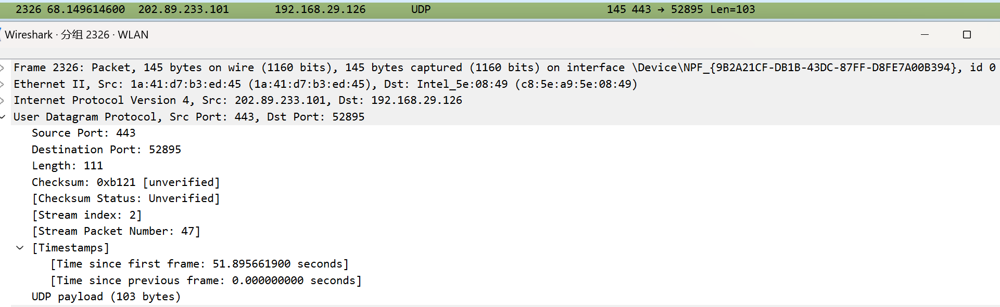
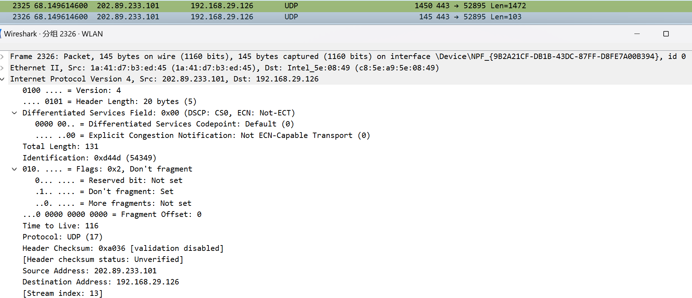
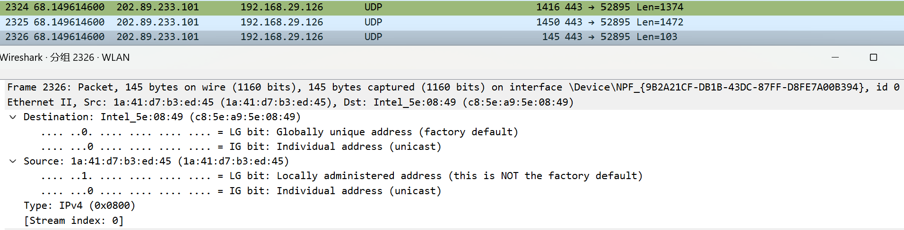
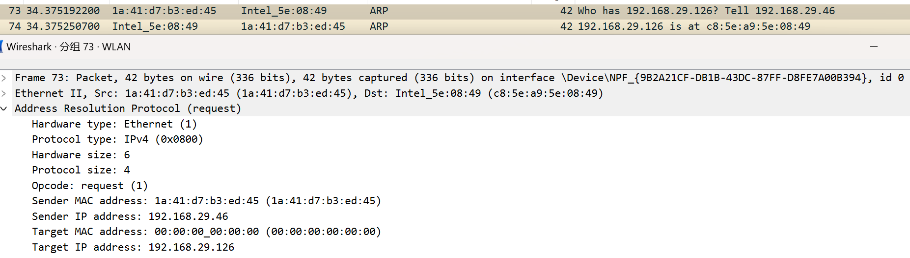
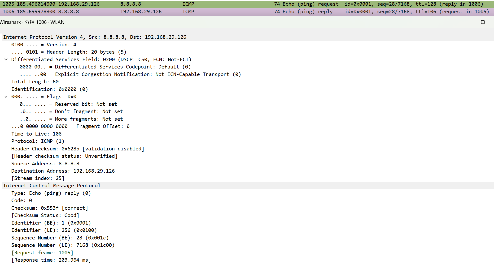

# Lab5：IP 与以太网的包收发操作

## 实验背景

本实验围绕 IP 模块与以太网在包收发过程中的角色展开，重点观察以下内容：

1. 网络包的基本结构：头部（IP 头部 + MAC 头部）与数据
2. IP 头部各字段的含义：版本号、TTL、协议号、发送方/接收方 IP 地址等
3. MAC 头部各字段的含义：接收方/发送方 MAC 地址、以太类型
4. IP 地址与 MAC 地址的区别与协作
5. ARP 协议如何通过 IP 地址查询 MAC 地址
6. 路由表的结构与查询方式
7. UDP 协议与 TCP 协议的区别：无连接、无确认、无重传
8. UDP 头部结构：发送方端口号、接收方端口号、数据长度、校验和
9. ICMP 协议的作用与常见消息类型（Echo、Destination Unreachable 等）

---

## 实验任务

### 任务一：查看路由表、ARP 缓存并启动 Wireshark

**第一步：打开 Wireshark，选择主网络接口，开始抓包**

> **注意**：本次实验必须使用真实网络接口（`en0`/`eth0`/`以太网`），不要选回环接口。回环接口不经过以太网，无法观察到 MAC 头部和 ARP 过程。

选择你的主网络接口，开始抓包。本次实验的大部分任务会共用同一次抓包。

**第二步：查看本机路由表**

```bash
# Linux
route -n
ip route show

# macOS
netstat -rn

# Windows
route print
```

截图并保存为 `route_table.jpg`。

**第三步：查看本机 ARP 缓存**

```bash
# Linux / macOS / Windows
arp -a
```

截图并保存为 `arp_cache.png`。

**第四步：填写下表**

从路由表和 ARP 缓存的输出中提取信息：

| 项目                         | 你的填写内容 |
| :--------------------------- | :----------- |
| 本机 IP 地址                 |  192.168.29.126            |
| 本机所在子网                 |   192.168.29.0/24          |
| 子网掩码                     | 255.255.255.0             |
| 默认网关 IP                  |  192.168.29.46            |
| 默认网关 MAC 地址            |  1a-41-d7-b3-ed-45            |
| 本机网卡 MAC 地址            | 13:c8:5e:a9:5e:08             |

简答题：

1. 路由表的每一行包含哪些关键字段？教材中提到的 `Network Destination`、`Netmask`、`Gateway`、`Interface` 分别对应什么含义？
Network Destination：目标网络/主机的IP地址。
Netmask：子网掩码，配合目标IP判断网段范围。
Gateway：数据包转发的下一跳IP。
Interface：本机发送该路由数据包时使用的网卡IP。


2. 当目标 IP 地址不在本子网时，包会先发给谁？路由表的哪一列提供了这个信息？
会先发给默认网关，由网关转发。路由表的Gateway列提供了这个信息。


3. 路由表的默认网关（`0.0.0.0`）条目的作用是什么？什么时候会匹配到这一行？
作用：作为所有未匹配到具体路由的数据包的 “兜底转发规则”，指定它们的下一跳网关。
匹配时机：当目标IP地址与路由表中所有其他条目都不匹配时，就会匹配到这一行，将数据包发给默认网关。


4. 教材提到，确定发送方 IP 地址的关键在于"判断应该使用哪块网卡"。结合你查到的本机网卡信息，说明 IP 模块是如何做出这个判断的。
IP模块会遍历本机所有网卡的路由条目，用目标IP地址与网卡对应的子网掩码做 “与运算”，得到目标网段。当目标网段与某网卡的直连网段匹配时，就使用该网卡发送；若都不匹配，则使用默认网关对应的网卡发送。


---

### 任务二：观察 UDP 头部

只要计算机处于联网状态，Wireshark 中就会持续出现大量 UDP 流量（DNS、mDNS、DHCP、NTP 等），无需手动生成。

**第一步：在 Wireshark 中设置过滤器**

```text
udp
```

**第二步：在包列表中找一个 UDP 包**

随便选一个即可。如果包太多，可以加上源或目的 IP 来缩小范围，例如 `udp && ip.addr == 你的IP`。如果需要 DNS 包，也可以用 `udp.port == 53` 过滤。

> **可选**：如果想明确看到一个完整的请求-响应对，可以在终端中执行 `nslookup example.com`，Wireshark 中就会出现对应的 DNS 请求包。

**第三步：点击选中的 UDP 包，在详情栏展开 `User Datagram Protocol`**

填写下表：

| 项目               | 你的填写内容 |
| :----------------- | :----------- |
| UDP 头部总长度     |    8字节          |
| 源端口             |  443            |
| 目的端口           |   52895           |
| 长度（Length）     |      111        |
| 校验和（Checksum） |  0xb212 [unverified]            |

简答题：

1. 你观察到的 UDP 头部长度是多少字节？TCP 头部至少 20 字节。UDP 省略了哪些字段？这些字段的缺失带来了什么后果？
UDP头部长度：固定为8字节。
省略的字段：UDP省略了TCP头部的序列号、确认号、窗口大小、确认标志、保留字段等。
后果：UDP无连接、不可靠、无重传机制，数据传输可能丢包、乱序，仅适用于对实时性要求高、可接受少量丢包的场景。


2. UDP 头部中的"长度"字段指的是什么长度？
指UDP数据包的总长度，单位为字节。截图中len=111即表示该UDP包总长度为111字节，其中头部8节，数据部分103字节。




---

### 任务三：观察 IP 头部字段

点击任务二中的同一个 UDP 包，在详情栏展开 `Internet Protocol Version 4`。

填写下表：

| 字段名称               | 你的填写内容 | 含义说明 |
| :--------------------- | :----------- | :------- |
| Version（版本号）      |    4          |表示 IPv4 协议          |
| Header Length（头部长度） |20 字节            |IP 头部的长度，单位为 4 字节，最小为 20 字节          |
| Time to Live（TTL）    | 116             |数据包的生存时间，每经过一个路由器减 1         |
| Protocol（协议号）     | 17             | 表示上层协议为 UDP         |
| Source Address（源 IP） | 202.89.233.101             | 发送方的 IP 地址         |
| Destination Address（目的 IP） | 192.168.29.126       | 接收方的 IP 地址        |

简答题：

1. 协议号字段的值是多少？它代表什么协议？如果抓一个 HTTP 请求的包，协议号会变成多少？
协议号是17，代表UDP协议；HTTP请求包的协议号是6


2. TTL 字段的作用是什么？如果 TTL 降为 0 会发生什么？
TTL用于限制数据包的转发次数，防止路由环路；TTL降为0时，数据包会被丢弃，并向源主机发送ICMP超时报文。


3. 有教材提到 IP 地址"实际上并不是分配给计算机的，而是分配给网卡的"。你的本机有几块网卡？每块网卡的 IP 地址分别是什么？（提示：可参考任务一中路由表的 Interface 列，或用 `ip addr`（Linux）/`ifconfig`（macOS）/`ipconfig`（Windows）查看。）
本机有4块活跃网卡，IP分别是：192.168.29.126、192.168.119.1、192.168.56.1、192.168.80.1。


4. IP 头部中的源 IP 地址和目的 IP 地址分别是谁的地址？它们与 MAC 头部中的源/目的 MAC 地址有什么区别？
源/目的IP是通信双方主机的IP地址，用于端到端寻址；源/目的MAC 是链路层设备的物理地址，用于同一网段内的直连转发，每经过一跳 MAC 地址都会改变，而IP地址全程不变。




---

### 任务四：观察 MAC 头部与以太网帧

点击任务二中的同一个 UDP 包，在详情栏展开 `Ethernet II`。

填写下表：

| 字段名称               | 你的填写内容 | 含义说明 |
| :--------------------- | :----------- | :------- |
| Source（源 MAC）       |1a:41:d7:b3:ed:45              |发送数据包的本机网卡 MAC 地址          |
| Destination（目的 MAC） | c8:5e:a9:5e:08:49             |直接接收数据的下一跳设备的 MAC地址         |
| Type（以太类型）       | 0x0800             |  标识上层承载的是 IPv4 协议        |

关于 MAC 地址格式，填写下表：

| 项目               | 你的填写内容 |
| :----------------- | :----------- |
| MAC 地址长度       | 48 比特（6 字节） |
| 本机网卡的 MAC 地址 | 1a:41:d7:b3:ed:45             |
| 目的 MAC 地址      | c8:5e:a9:5e:08:49             |
| MAC 地址的书写格式 | 6 字节（48 比特），常用 : 或 - 分隔，每字节 16 进制数（如 xx:xx:xx:xx:xx:xx）             |

简答题：

1. 以太类型字段的值是多少？它代表后面承载的是什么协议的包？
以太类型字段值为 0x0800，代表上层承载的是 IPv4 协议。


2. DNS 服务器的 IP 通常是外网地址。本任务中目的 MAC 地址是 DNS 服务器的 MAC 地址还是你本机网关（路由器）的 MAC 地址？为什么？
是本机网关（路由器）的MAC地址。因为DNS服务器是外网地址，不在本机子网，数据包需先发给网关转发，所以目的MAC是网关的。


3. IP 地址和 MAC 地址在功能上有什么相似之处？又有什么本质区别？
都用于网络中设备/节点的唯一标识，实现数据传输的寻址定位。


4. 为什么以太网帧中需要同时有 IP 地址（在 IP 头部中）和 MAC 地址？不能只用其中一种吗？
不能只用一种。IP地址负责跨网络的端到端寻址，保证数据能找到目标主机；MAC地址负责同一网段内的下一跳寻址，保证数据能在物理链路中准确传输。两者配合实现 “跨网段 + 链路层” 的完整数据转发，缺一不可。




---

### 任务五：观察 ARP 协议

ARP（Address Resolution Protocol，地址解析协议）用于根据 IP 地址查询 MAC 地址。只要计算机处于联网状态，Wireshark 中通常会持续出现 ARP 包（邻居发现、缓存刷新等），可以直接观察。如果抓包一段时间后仍未看到 ARP 包，再手动触发。

**第一步：在 Wireshark 中设置过滤器**

```text
arp
```

**第二步：在包列表中找 ARP 包**

正常联网的设备每隔几分钟就会自动发送 ARP 请求，等待即可。如果等了一会儿仍没有，可以选择以下任一方式手动触发：

- **方式 A（推荐）**：在终端中执行 `arping`

  ```bash
  # Linux（通常已预装）
  sudo arping -c 3 <网关IP>

  # macOS（如果没有，先执行：brew install arping）
  sudo arping -c 3 <网关IP>

  # Windows（可从 https://github.com/ThomasHabets/arping/releases 下载）
  arping -c 3 <网关IP>
  ```

- **方式 B**：先清除 ARP 缓存，再 ping 同网段地址

  ```bash
  # 清除 ARP 缓存
  # Linux:   sudo ip neigh flush all
  # macOS:   sudo arp -d -a
  # Windows: arp -d *

  # 然后 ping 网关
  ping <网关IP> -c 2
  ```

> **注意**：如果目标是 `127.0.0.1` 或外网地址，ARP 不会出现。回环接口不经过以太网，外网地址的 MAC 地址是路由器的（通常已缓存）。

**第三步：点击 ARP 请求包（Opcode 为 request），展开详情**

**第四步：填写下表**

| 项目                     | 你的填写内容 |
| :----------------------- | :----------- |
| ARP 请求的目的 MAC 地址 | ff:ff:ff:ff:ff:ff             |
| ARP 请求中查询的目标 IP | 192.168.29.126             |
| ARP 响应中返回的 MAC 地址 | c8:5e:a9:5e:08:49             |
| 该 ARP 包是自动出现还是手动触发的 | 自动出现             |

简答题：

1. ARP 请求的目的 MAC 地址为什么是 `ff:ff:ff:ff:ff:ff`（广播地址）？
ARP请求用广播地址，是因为发送方不知道目标设备的MAC地址，需要通过广播让同一网段内所有设备接收并响应，从而获取目标 MAC。


2. 为什么 ARP 缓存中的条目会在几分钟后自动删除？
ARP缓存条目定时删除，是为了防止设备更换IP变更导致的地址失效，避免缓存数据过时，保证通信的准确性。


3. 如果 ARP 缓存中的 MAC 地址已经过期（对方 IP 对应的设备已更换），会出现什么问题？如何解决？
会出现通信失败、数据无法送达的问题。
解决方法：等待缓存超时自动更新，或手动执行arp -d清除缓存，再重新触发 ARP 请求。




---

### 任务六：使用 `ping` 命令观察 ICMP

有教材提到了 ICMP（Internet Control Message Protocol）协议，它用于在 IP 层传递错误和控制信息。`ping` 命令就是基于 ICMP 的 Echo Request（类型 8）和 Echo Reply（类型 0）实现的。

**第一步：在 Wireshark 中设置 ICMP 过滤器**

```text
icmp
```

**第二步：在终端中执行 ping 命令**

```bash
# ping 本机（回环）
ping 127.0.0.1 -c 4

# ping 局域网内的设备（如路由器网关）
ping <网关IP> -c 4

# ping 外网地址
ping 8.8.8.8 -c 4
```

**第三步：在 Wireshark 中观察 ICMP 包**

填写下表：

| 目标               | 是否收到回复 | 往返时间（ms） | TTL 值 |
| :----------------- | :----------- | :------------- | :----- |
| 127.0.0.1          | 是            |  <1ms              |   128     |
| 局域网设备（网关） |   是           |        <1-5ms        |  64/128      |
| 8.8.8.8            |       是       |    203.964ms           |  106      |

> **提示**：ping 回环地址（`127.0.0.1`）时数据不经过物理网卡，Wireshark 在主网络接口上可能无法捕获到包。TTL 值可从终端输出中读取（`ping` 会显示 `ttl=...`），或切换 Wireshark 至回环接口（`lo0` / `lo`）抓包。

简答题：

1. `ping` 命令发送的是什么类型的 ICMP 消息？收到的回复又是什么类型？
ping发送 ICMP Echo Request（类型 8），收到的回复是 ICMP Echo Reply（类型 0）


2. 为什么 ping 不同目标的 TTL 值不同？TTL 值反映了什么信息？
不同目标的TTL值不同，是因为数据包经过的路由器跳数不同，每经过一跳TTL减 1。TTL 值反映了数据包从源到目标经过的路由器跳数。


3. 教材表 2.4 中列出了多种 ICMP 消息类型。`Destination unreachable`（类型 3）在什么情况下会出现？请用以下方法尝试触发并观察：

   ```bash
   # 方法一（推荐）：ping 同网段内一个确认不存在的 IP
   # 例如你的本机 IP 是 192.168.1.100，子网掩码 255.255.255.0，
   # 那么可以 ping 192.168.1.250（一个大概率没有被分配的地址）
   ping <同网段不存在的IP> -c 3
   
   # 方法二：向一个关闭的端口发 UDP 包，触发 ICMP Port Unreachable
   # 先在 Wireshark 中保持 icmp 过滤器，然后执行：
   # Linux / macOS
   echo "test" | nc -u -w 1 <同网段某台设备的IP> 19999
   
   # Windows（需安装 nmap：https://nmap.org/download.html）
   nmap -sU -p 19999 <同网段某台设备的IP>
   ```

   观察到类型 3 的包后，记录其 Code 值（子类型）并说明代表什么含义。
Destination unreachable出现在目标主机/网络不可达、端口关闭、协议不支持等场景：
方法一（ping 不存在 IP）：触发Code=1（主机不可达）或Code=0（网络不可达）。
方法二（访问关闭 UDP 端口）：触发Code=3（端口不可达），表示目标端口未开放。




---

## 问答题

1. 网络包由哪几部分构成？IP 头部和 MAC 头部分别的作用是什么？
网络包通常由MAC头部、IP头部、传输层头部、数据 payload、FCS 校验尾构成。
IP 头部：负责跨网段寻址（源/目的 IP）、TTL 控制、分片重组等，保证数据能路由到目标主机。
MAC 头部：负责同一网段内的链路层寻址（源 / 目的 MAC），保证数据在物理链路上准确传输。


2. IP 协议和以太网协议在网络传输中分别承担什么职责？它们是如何分工协作的？
IP协议（网络层）：负责跨网段的端到端寻址与路由，屏蔽底层链路差异。
以太网协议（数据链路层）：负责同一网段内的帧传输、差错检测与介质访问控制。
协作：IP 层决定数据包的最终目的地，以太网层负责把数据包逐跳送到下一跳设备，两者配合实现跨网络通信。


3. ARP 协议解决的核心问题是什么？如果不使用 ARP 缓存，网络中会出现什么情况？
ARP解决的核心问题：IP地址与 MAC地址的映射，即已知目标 IP，获取其对应的 MAC 地址。
无 ARP 缓存：每次通信都要广播ARP请求，网络中会充斥大量广播包，造成广播风暴，大幅降低通信效率。


4. 为什么 IP 和负责传输的网络（如以太网）要分开设计？这种设计带来了什么好处？
分开设计的原因：为了实现网络层与数据链路层的解耦，让 IP 协议可以运行在不同的底层链路上。
好处：提高了网络的灵活性和可扩展性，底层链路技术更新时，IP 协议不受影响，反之亦然。


5. 网卡在发送包时会额外添加哪 3 个控制数据？它们各自的作用是什么？
前导码（Preamble）：用于帧同步，让接收方识别帧的开始。
帧起始定界符（SFD）：标记前导码结束、数据帧开始。
FCS（帧校验序列）：用于差错检测，验证帧数据在传输中是否损坏。


6. 网卡接收到一个包后，需要经过哪些步骤才能将其交给操作系统？如果 FCS 校验失败会怎样？
过滤目的 MAC，只接收目标为自身/广播/多播的帧。
验证 FCS 校验，若失败直接丢弃。
去掉 MAC 头部，将数据提交给上层 IP 协议处理。
FCS 校验失败：网卡直接丢弃该数据包，不向上层提交。


7. TCP 和 UDP 的核心区别是什么？请从连接管理、可靠性、效率、适用场景四个维度进行比较。
TCP 是面向连接、可靠但效率较低的协议，适用于文件传输、网页浏览等对数据完整性要求高的场景；
UDP 是无连接、不可靠但高效的协议，适用于视频通话、直播、游戏等对实时性要求高、可容忍少量丢包的场景。


8. UDP 适用于哪些场景？请结合教材内容解释为什么这些场景适合使用 UDP 而非 TCP。
UDP 适用于：视频/语音通话、在线直播、网络游戏、DNS 查询等场景。
原因：这些场景对实时性要求极高，少量丢包可通过应用层补偿，而 TCP 的重传、确认机制会引入额外延迟，反而影响体验；UDP 头部开销小，传输效率更高，更适合这类场景。


9. 如果一个 IP 包经过多次路由转发后 TTL 降为 0，路由器会如何处理？这与教材中提到的哪种 ICMP 消息有关？
TTL降为0时，路由器会丢弃该IP包，并向源主机发送 ICMP 超时报文。
这与ICMP的时间超过消息有关


---

## 截图要求

- 截图须清晰，终端文字和 Wireshark 字段可读。
- 所有截图与本 `Lab5.md` 放在同一目录下。
- 命名规范：

| 截图内容         | 文件名               |
| :--------------- | :------------------- |
| 路由表           | `route_table.png`    |
| ARP 缓存         | `arp_cache.png`      |
| UDP 头部字段     | `udp_header.png`     |
| IP 头部字段      | `ip_header.png`      |
| 以太网帧字段     | `ethernet_frame.png` |
| ARP 请求与响应   | `arp.png`            |
| ICMP ping        | `icmp.png`           |

具体要求：

1. `route_table.png`：终端截图，显示 `route -n`（Linux）、`netstat -rn`（macOS）或 `route print`（Windows）的完整输出。

2. `arp_cache.png`：终端截图，显示 `arp -a` 的完整输出。

3. `udp_header.png`：Wireshark 截图，展开 `User Datagram Protocol`，能看到 Source Port、Destination Port、Length、Checksum。

4. `ip_header.png`：Wireshark 截图，展开 `Internet Protocol Version 4`，能看到 Version、Header Length、TTL、Protocol、Source Address、Destination Address。

5. `ethernet_frame.png`：Wireshark 截图，展开 `Ethernet II`，能看到 Source、Destination、Type。

6. `arp.png`：Wireshark 截图（若能观察到），展开 ARP 包的详情，能看到发送方的 MAC 和 IP、查询的目标 IP。

7. `icmp.png`：Wireshark 截图，能看到 ICMP Echo Request 和 Echo Reply，以及 TTL 字段。

---

## 提交要求

在自己的文件夹下新建 `Lab5/` 目录，提交以下文件：

```text
学号姓名/
└── Lab5/
    ├── Lab5.md
    ├── route_table.png
    ├── arp_cache.png
    ├── udp_header.png
    ├── ip_header.png
    ├── ethernet_frame.png
    ├── arp.png
    └── icmp.png
```

---

## 截止时间

2026-05-07，届时关于 Lab5 的 PR 请求将不会被合并。
