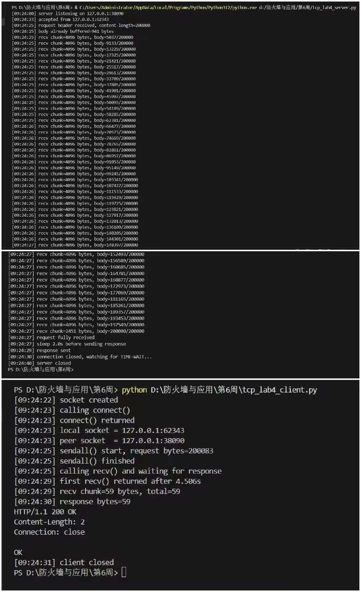
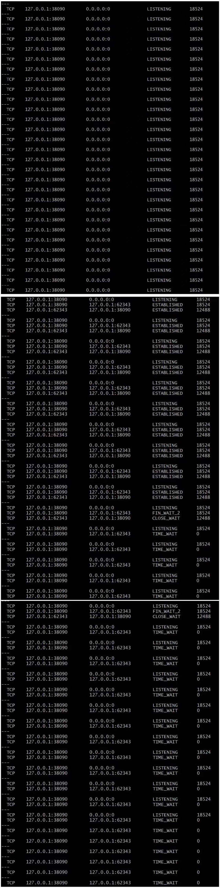
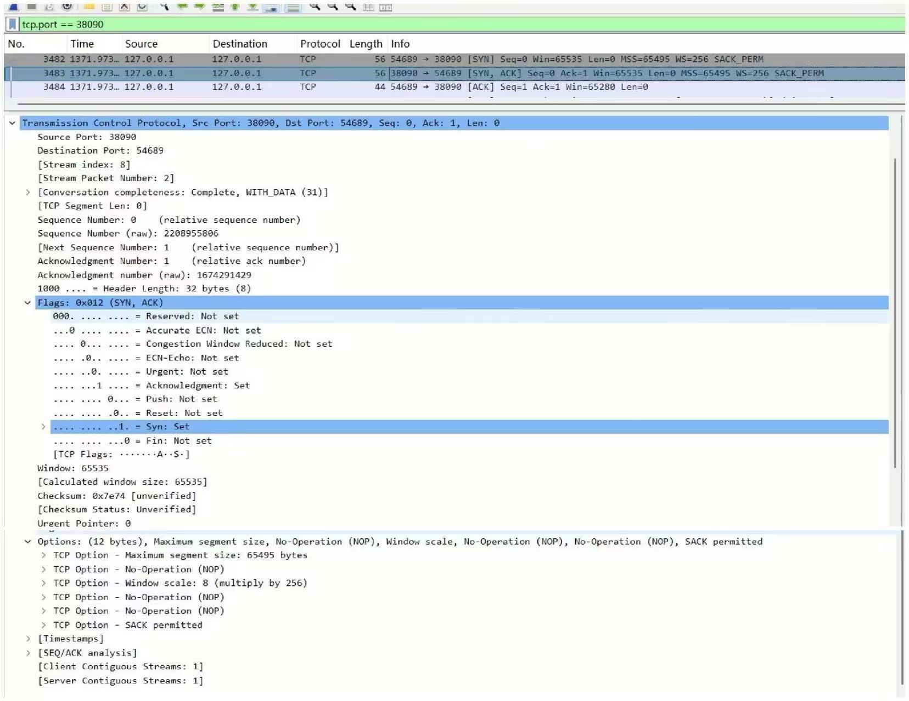
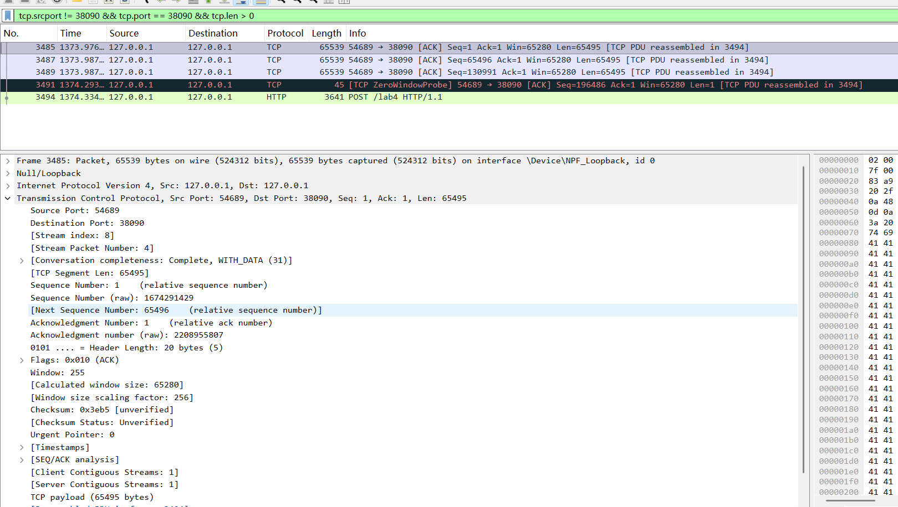
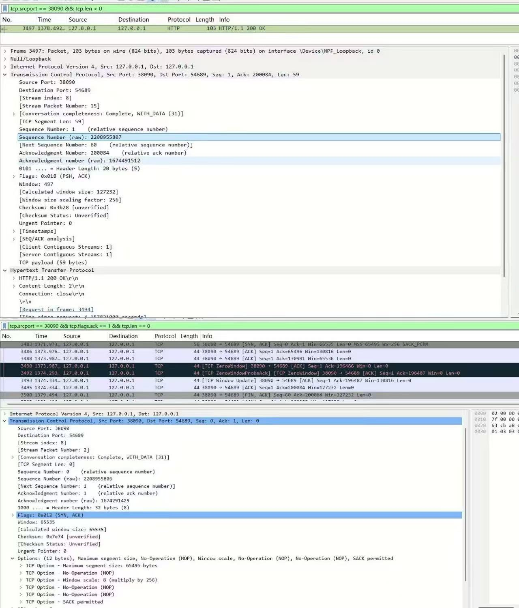
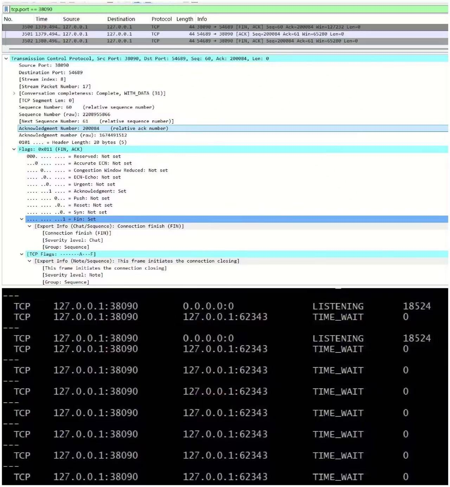

# Lab4：看见TCP 我不怕不怕啦

## 实验背景

本实验围绕一条 TCP 连接的完整生命周期展开，重点观察以下内容：

1. `socket()`、`listen()`、`accept()`、`connect()` 的职责区别
2. "连接"为什么本质上是交换控制信息而不是物理连线
3. TCP 头部中的端口号、序号、ACK 号、标志位、窗口、头部长度、可选字段
4. 三次握手如何建立收发准备
5. 应用层大块数据如何被 TCP 按 MSS 拆分
6. `Sequence Number` 与 `Acknowledgment Number` 如何配合工作
7. `recv()` 为什么会阻塞等待数据
8. 接收窗口如何反映接收方处理能力
9. ACK 与窗口更新为什么常常会被合并
10. `FIN` / `ACK` 如何完成断开
11. 为什么连接结束后套接字不会立刻删除

---

## 实验任务

### 任务一：准备实验环境并记录运行信息

**第一步：准备好四个窗口**

整个实验需要同时观察多个界面，建议在开始前把窗口布局摆好：

- **终端 A**：运行服务端
- **终端 B**：运行客户端
- **终端 C**：持续监控套接字状态（全程保持开启，不要关）
- **Wireshark**：抓包

**第二步：在终端 C 里启动持续监控**

TCP 状态变化很快，等你手动敲完 `ss` 命令再回车，状态可能已经过去了。用下面的命令让终端 C 每 0.5 秒自动刷新一次，之后只需要盯着这个窗口就行：

```bash
# Linux
watch -n 0.5 'ss -tan | grep 38090'

# macOS（没有 watch，用循环代替）
while true; do netstat -an | grep 38090; echo "---"; sleep 0.5; done

# Windows（Git Bash执行）
while true; do netstat -ano | grep 38090; echo "---"; sleep 0.5; done
```

如果你换了端口，把 `38090` 替换成实际端口。

**第三步：打开 Wireshark，选回环接口，填好过滤器，开始抓包**

回环接口在不同系统里名字不同：

| 系统 | 接口名 |
|:-----|:-------|
| Linux | `lo` |
| macOS | `lo0` |
| Windows | `Adapter for loopback traffic capture`（需提前安装 Npcap 并勾选回环支持） |

在显示过滤器里输入：

```text
tcp.port == 38090
```

然后点击开始抓包（蓝色鲨鱼鳍图标）。**先开始抓包，再运行脚本**，否则握手包会被漏掉。

**第四步：启动脚本**

```bash
# 终端 A
python3 tcp_lab4_server.py

# 终端 B（等服务端打印出 server listening on ... 后再运行）
python3 tcp_lab4_client.py
```

如果 `38090` 已被占用，两端都加环境变量换端口，同时记得把 Wireshark 过滤器和终端 C 里的端口号也改掉：

```bash
LAB4_PORT=38123 python3 tcp_lab4_server.py
LAB4_PORT=38123 python3 tcp_lab4_client.py
```

**第五步：填写下表**

| 项目                                | 你的填写内容 |
| :---------------------------------- | :----------- |
| 服务端监听地址                      |127.0.0.1|
| 服务端监听端口                      |38090|
| 客户端本地临时端口                  |62343|
| 客户端请求总字节数                  |200083|
| 服务端响应内容                      |HTTP/1.1 200 OK<br>Content-Length: 2<br>Connection: close<br><br>OK|
| 客户端 `connect()` 返回前后的时间点 |调用：[09:24:23] calling connect()返回：[09:24:23] connect() returned|
| 客户端首次收到响应前等待了多久      |4.506s|

各项数值均可直接从终端输出读取：服务端监听信息在 `server listening on ...`，客户端本地端口在 `local socket = ...`，请求字节数在 `sendall() start, request bytes=...`，等待时间在 `first recv() returned after ...s`。



---

### 任务二：观察套接字创建与连接建立

1. 服务端启动后，观察终端 C 出现 `LISTEN` 状态，截图留存。
2. 在终端 B 里启动客户端，观察它依次打印 `socket created`、`calling connect()`、`connect() returned`。
3. 客户端打印 `connect() returned` 之后，观察终端 C 出现 `ESTABLISHED`，截图留存。脚本在 `connect()` 返回后有 2 秒停顿，这段时间足够截图。

填写下表：

| 阶段                             | 你的填写内容 |
| :------------------------------- | :----------- |
| 服务端启动、客户端未连入时的状态 |LISTENING|
| `connect()` 返回后服务端状态     |ESTABLISHED|
| `connect()` 返回后客户端状态     |ESTABLISHED|

简答题：

1. 服务端在客户端连接前为什么处于 `LISTEN`？
答：服务端调用 listen() 后，端口进入 LISTENING 状态，这是被动打开模式。其核心目的有两点：
待命接收：告诉操作系统内核，该端口（如你的实验中 38090）愿意接受任何客户端的连接请求，而不是主动去连接别人。
资源预备：内核为该端口维护了半连接队列和全连接队列，预先分配内存资源，以便在收到客户端的 SYN 包时能快速响应，避免丢包。
从日志看：你在 netstat 截图中看到的大量 LISTENING 记录，正是服务端启动后持续等待连接的状态。

2. 为什么这时还没有真正建立 TCP 连接？
答：LISTEN 状态仅表示服务端准备好了听，但双方还没有进行任何网络数据包的交互。
尚未握手：TCP 连接的建立必须经过三次握手。LISTEN 是服务端的初始 “待机” 状态，此时还没收到客户端的 SYN 同步报文。
虚拟通道未创建：只有当三次握手完成，双方互发 ACK 确认后，内核才会在双方内存中创建唯一的连接会话（TCB），此时才是真正的 “已建立连接”。


3. `socket()` 与 `connect()` 的区别是什么？
答：socket()（创建端点）：
作用：在应用层与传输层之间创建一个通信端点（套接字），返回一个文件描述符。
性质：不涉及网络传输。它只是在本地申请了一块资源，定义了通信协议族（如 AF_INET）和类型（如 SOCK_STREAM），但还未指定服务器地址。
connect()（发起连接）：
作用：客户端通过指定服务端的 IP 和端口，主动发起 TCP 三次握手。
性质：触发网络通信。它将之前创建的 “空端点” 与 “远程服务器” 绑定，阻塞等待直到握手成功返回。connect() 返回后，socket 才真正进入 ESTABLISHED 状态，具备了收发数据的能力。


4. 为什么 `connect()` 返回后才进入可稳定收发数据的状态？
答：connect() 的返回意味着三次握手完成，这是连接进入稳定状态的充要条件：
内核验证：connect() 函数阻塞直到客户端收到服务端发来的 SYN+ACK 报文，并最终发回 ACK 确认。
状态确认：只有三次握手完成，双方才互相确认了对方的收发能力正常，并且同步了初始序列号（ISN）。
日志依据：你的客户端日志中 connect() returned 之后，紧接着就执行了 sendall() 发送数据，正是因为此时连接状态已变为 ESTABLISHED，可以安全传输数据。


5. 为什么"网线一直连着"不等于"TCP 连接已经建立"？
答：这是物理层与传输层的本质区别：
物理连通 不等于 逻辑连通：网线连通只代表物理层链路通了（硬件层面），IP 层能 Ping 通。
TCP 连接依赖协议栈：TCP 连接是操作系统内核通过软件协议建立的逻辑连接。即使网线插着，如果服务端程序没启动、端口没监听，或者中间防火墙拦截了 SYN 包，TCP 连接依然无法建立。
实验体现：如果你的服务端代码没运行，网线插着，客户端 connect() 依然会失败或超时，证明物理连接不代表逻辑连接成立。


6. 这里的"连接"更准确地说是在做什么？
答：这里的 “TCP 连接” 不是物理上的接线，而是双方内核建立的一条虚拟、可靠、双向的通信通道。
本质：它是内存中一个包含双方 IP / 端口、序列号、窗口大小、连接状态等信息的数据结构（TCB）。
目的：通过三次握手建立契约，为后续提供全双工（双向同时收发）、可靠（丢包重传、顺序保证）的字节流传输服务。
实验视角：在你的代码中，它就是客户端 62343 与服务端 38090 之间建立的那个稳定交互会话，确保 200000 字节的数据能完整、有序地传过去。




---

### 任务三：观察三次握手与 TCP 头部字段

**定位握手包**：在 Wireshark 过滤器里输入下面的条件，可以屏蔽中间的数据包，只留下握手和断开阶段的控制包：

```text
tcp.port == 38090 && (tcp.flags.syn == 1 || tcp.flags.fin == 1)
```

包列表最前面的三个包就是三次握手（SYN → SYN-ACK → ACK）。

**找到各字段的位置**：点击某个握手包，在下方详情栏展开 `Transmission Control Protocol`。源端口、目的端口、Seq、Ack、Flags、Window、Header Length 都在这里。TCP 选项在最底部的 `Options` 子项里，展开后可以看到 MSS、Window Scale、SACK Permitted，注意这三项只出现在带 SYN 标志的包里，纯 ACK 包里没有。

**关于序号显示**：Wireshark 默认开启相对序号，会把每个方向的初始序号归零显示，所以 SYN 包的 Seq 看起来是 `0`，而不是真实的随机大数。这是正常现象，实验报告按 Wireshark 显示的值填写即可。如果你想看真实值，可以去 `Edit → Preferences → Protocols → TCP` 里取消勾选 `Relative sequence numbers`。

填写下表：

| 报文       | 源端口 | 目的端口 | Seq  | Ack  | Flags | Window | Header Length |
| :--------- | :----- | :------- | :--- | :--- | :---- | :----- | :------------ |
| 第一次握手 |54689|38090|0|0|SYN|65535|32 字节|
| 第二次握手 |38090|54689|0|1|SYN, ACK|65535|32 字节|
| 第三次握手 |54689|38090|1|1|ACK|65280|20 字节|

第一次握手（SYN）的 Ack 字段在 Wireshark 里通常显示为空或 `0`，这是正常的，因为此时客户端还没有收到服务端的任何数据。Header Length 在没有选项时是 20 字节，握手包因为携带了 MSS 等选项通常是 28 或 32 字节。

| TCP 选项       | 你的填写内容 |
| :------------- | :----------- |
| MSS            |65495|
| Window Scale   |256|
| SACK Permitted |是（开启）|

回环接口的 MSS 通常是 65495（因为回环 MTU 是 65536，比以太网的 1500 大得多），这会影响后续任务五里是否能观察到分段。

简答题：

1. 发送方和接收方端口号在连接阶段的作用是什么？
答：端口号用于区分同一主机内的不同应用进程，是 TCP 实现 “端到端通信” 的核心标识。
定位进程：一台主机可能同时运行多个网络应用（如实验中服务端监听 38090 端口），端口号唯一绑定某个进程（如你的 tcp_lab4_server）。
构建连接四元组：TCP 连接由 **(源 IP, 源端口，目的 IP, 目的端口)** 唯一确定。
例如你的实验中：客户端随机端口 54689 与服务端固定端口 38090 组合，建立了唯一的连接会话，避免数据混淆。
连接阶段的绑定：
服务端通过 bind() 绑定知名端口 / 临时端口（如 38090）进入 LISTEN 状态，等待连接；
客户端由系统自动分配临时端口（如 54689）作为源端口，与服务端端口配对，完成三次握手。


2. TCP 头部如何帮助找到目标套接字？
答：TCP 头部通过关键字段组合，结合网络协议栈，精准定位目标套接字（Socket）：
核心依据（四元组）：
数据包从 127.0.0.1:54689 发往 127.0.0.1:38090，TCP 头部包含源 IP、源端口、目的 IP、目的端口。
操作系统内核根据这四个值，查找本地已建立的连接控制块（TCB），匹配到对应的服务端 socket 实例。
字段具体作用：
IP 地址：定位目标主机（网络层）；
端口号：定位主机内的目标进程（传输层）。
实验体现：
第二次握手包（SYN+ACK）源端口为 38090、目的端口为 54689，反向确认客户端的接收端点，实现双向匹配。


3. 为什么初始序号不是简单固定从 1 开始？
答：TCP 初始序号（ISN）不固定从 1 开始，核心目的是保证通信可靠性与安全性：
防止旧连接混淆：如果 ISN 固定为 1，当网络中存在延迟重复的旧数据包（如上一次连接的残留数据）到达时，新连接容易误认这些旧数据属于当前连接，导致数据错位。
避免序列号预测：固定 ISN 易被攻击者预测，从而伪造 TCP 连接进行劫持。
防重放攻击：ISN 由系统时钟、随机数等因素动态生成（32 位计数器递增），确保每个新连接的 ISN 唯一且不可预测。
实验验证：
抓包中第一次握手 Seq=0（相对序号），原始序号（raw）为 1674291428，证明 ISN 是动态随机的大数值，而非 1。


4. 为什么 TCP 可选字段更容易在连接阶段看到？
答：TCP 可选字段（如 MSS、Window Scale、SACK Permitted）主要用于连接协商，仅在三次握手阶段生效，因此最易被捕捉：
字段用途决定位置：
可选字段用于协商通信参数（如最大分段大小 MSS、窗口缩放因子），必须在连接建立前完成，因此只能携带在 SYN/ SYN+ACK 报文中（连接阶段）。
连接建立后禁用：
一旦三次握手完成（连接建立），双方已协商好参数，后续数据传输阶段不需要再携带可选字段（仅保留基础 20 字节头部），以减少开销。
实验直观体现：
你的抓包中，第一次（SYN）、第二次（SYN+ACK）握手包头部长度为 32 字节（20 基础 + 12 选项），包含 MSS、WS、SACK；
** 第三次握手（ACK）** 头部长度为 20 字节，无可选字段，完美印证 “连接阶段携带选项，传输阶段无选项” 的规律。




---

### 任务四：区分头部中的控制信息和套接字中的控制信息

用以下过滤器分别找到两类报文：

```text
# 纯控制报文（无应用数据）
tcp.port == 38090 && tcp.len == 0

# 携带应用数据的报文
tcp.port == 38090 && tcp.len > 0
```

从纯控制报文里选一个（SYN、纯 ACK 或 FIN-ACK 都可以），从数据报文里选一个（客户端发请求或服务端发响应的包）。

填写下表：

| 项目                   | 你的填写内容 |
| :--------------------- | :----------- |
| 纯控制报文的类型       |SYN、SYN+ACK、ACK（三次握手报文）、FIN、FIN+ACK、ZeroWindow、ZeroWindowProbe、Window Update 等|
| 携带应用数据的报文类型 |PSH+ACK（数据传输报文）|
| 头部中的控制信息举例   |源 / 目的端口、Seq/Ack 序号、Flags（SYN/ACK/PSH/FIN）、窗口大小、校验和|
| 套接字中的控制信息举例 |连接状态（LISTEN/ESTABLISHED/TIME_WAIT）、收发缓冲区大小、超时重传计时器、拥塞窗口|

简答题：

1. 为什么"头部中的控制信息"和"套接字中的控制信息"不是同一件事？
答：存储与传输属性不同：头部控制信息封装在 TCP 报文头中，随网络报文传输，对端可见；套接字控制信息存储在操作系统内核的套接字控制块中，仅本地维护，不随报文发送。
作用与目的不同：头部信息是 TCP 协议的标准化字段（如端口、序号、标志位），用于通信双方的端到端交互、协商与可靠传输；套接字信息是本地连接的管理数据（如连接状态、缓冲区、计时器），用于内核管理本端连接，不参与网络交互。
生命周期不同：头部信息仅存在于单个报文中；套接字信息伴随 TCP 连接的完整生命周期。


---

### 任务五：观察数据分段、序号与 ACK

客户端发送的请求体是 200000 字节，超过了回环接口 MSS（约 65495 字节），因此应该可以在 Wireshark 里看到多个连续的数据段。用下面的过滤器找到客户端发出的数据包：

```text
    tcp.srcport != 38090 && tcp.port == 38090 && tcp.len > 0
```

在包列表里连续选几个数据段，对比它们的 Seq 值。相邻两段的关系是：后一段的 Seq = 前一段的 Seq + 前一段的 TCP Segment Len。

找服务端返回给客户端的纯 ACK 报文：

```text
tcp.srcport == 38090 && tcp.flags.ack == 1 && tcp.len == 0
```

填写下表：

| 数据段  | Seq  | Ack  | TCP Segment Len | Flags |
| :------ | :--- | :--- | :-------------- | :---- |
| 第 1 段 |1|1|65495|ACK (0x010)|
| 第 2 段 |65496|1|65495|ACK (0x010)|
| 第 3 段 |130991|1|65495|ACK (0x010)|

| ACK 报文 | Ack Number | Flags | Window |
| :------- | :--------- | :---- | :----- |
| 第 1 个  |65496|ACK|130816|
| 第 2 个  |130991|ACK|65536|
| 第 3 个  |200084|ACK|127232|

| 项目                         | 你的填写内容 |
| :--------------------------- | :----------- |
| 是否发生分段                 |是|
| 握手中观察到的 MSS           |65495|
| 单段长度与 MSS 的关系        |单段长度等于 MSS（65495 字节），TCP 按 MSS 大小拆分大块数据|
| ACK 号大致确认到了第几个字节 |第 1 个 ACK 确认到 65496 字节，第 2 个到 130991 字节，第 3 个完整确认到 200084 字节（对应 200000 字节请求体）|

简答题：

1. 应用程序是否直接决定每个网络包的数据长度？为什么？
答：不直接决定。
因为sendall() 只是应用层的 “批量发送” 请求，并不直接参与 TCP 分段决策。
数据长度由 TCP 协议栈 根据 MSS（最大分段大小） 和 网络状况 自动拆分。
例如实验中，应用层一次性发送 200000 字节，但 TCP 会按 MSS=65495 拆成多个分段，应用程序无法控制每个包的具体长度。


2. 大块应用数据为什么会被拆分？
答：遵循 MSS 限制：TCP 最大数据段长度受 MSS 限制（由双方协商，如回环接口 MSS=65495），超过 MSS 的数据必须拆分。
保证网络传输可靠性：网络中 MTU（最大传输单元）有限，如果单个包过大，容易在路由器 / 链路中被分片，增加丢包风险和延迟。
流量控制需求：拆分后便于接收方通过窗口机制控制流速，避免缓冲区溢出。


3. `MSS` 与 `MTU` 的关系是什么？
答：MSS = MTU - IP 头部长度 (20/40) - TCP 头部长度 (20/40)
解释：
MTU：数据链路层（二层）允许通过的最大帧长度（通常以太网 MTU=1500）。
MSS：TCP 协议层（四层）允许传输的最大数据段长度（不包含 IP/TCP 头部）。
示例：回环接口 MSS=65495，说明其底层 MTU 远大于这个数值，保证了大数据段不被分片。

4. "一次 `sendall()`"与"一个 TCP 包"之间是什么关系？
答：多对一 或 一对多（无直接对应关系）
解释：
sendall() 是应用层的一次系统调用，请求发送 N 字节数据。
TCP 协议栈会根据 MSS 将这 N 字节切割成 多个 TCP 分段（Segment）。
实验中：sendall(200000) 触发了 至少 3 个 TCP 分段（Len=65495），证明 “一次发送” 不等于 “一个 TCP 包”。


5. 为什么 ACK 体现的是累计确认？
答：TCP 采用 累计确认（Cumulative ACK） 机制，ACK 号代表 **“我期望收到的下一个字节的序号”**。
只要收到了某个序号之前的所有数据，就不需要为每一段单独回复 ACK。
示例：ACK=65496 代表确认了 0~65495 字节全部收到，无需确认 1~65495 每一段，提高传输效率。


6. 如果中间某一段丢失，ACK 会出现什么变化？
答：重复 ACK（DupACK）：接收端收到后续乱序数据包时，会持续发送重复的 ACK（确认号不变），告知发送方某段丢失。
快速重传触发：发送端收到 3 个重复 ACK 后，会立即重传丢失的分段（不等待超时）。
窗口调整：接收端可能会减小通告窗口，暂停发送，等待丢失数据补齐。





---

### 任务六：观察 `recv()` 阻塞与窗口字段

`recv()` 的等待时间直接从客户端终端读取，`calling recv() and waiting for response` 到 `first recv() returned after ...s` 之间就是等待时长，脚本已经帮你计算好了。

在 Wireshark 里找窗口值：用过滤器 `tcp.port == 38090 && tcp.flags.ack == 1` 列出所有 ACK 包，点击其中一个，在详情栏 `Transmission Control Protocol` 里找 `Window` 字段。如果同时显示了 `Calculated window size`，优先看这个值，它已经把 Window Scale 的缩放算进去了，是对方实际能接收的字节数。

如果包列表的 Info 列出现了 `[TCP Window Update]` 标注，说明这个包的主要目的是通知对方窗口变化，重点观察它的 `Window` 字段。

填写下表：

| 项目                                   | 你的填写内容 |
| :------------------------------------- | :----------- |
| 客户端开始调用 `recv()` 的时间         |09:24:25|
| 客户端第一次收到响应的时间             |09:24:29|
| `recv()` 是否立刻返回                  |否|
| 首次收到响应前等待了多久               |4.506s|
| `recv()` 等待期间连接是否已经建立      |是|
| 第 1 个 ACK 报文的窗口值               |130816|
| 第 2 个 ACK 报文的窗口值               |65536|
| 第 3 个 ACK 报文的窗口值               |127232|
| 窗口值是否变化                         |是|
| 若变化，变化趋势                       |先下降，中间出现零窗口，后通过窗口更新恢复，最终稳定在 127232|
| ACK 与窗口更新是否可以出现在同一个包中 |是|
| 是否看到 RTT 或 ACK 往返时间相关信息   |是|

简答题：

1. "连接建立"和"应用收到数据"之间是什么关系？
答：连接建立是应用收到数据的必要前提。
关系：只有通过三次握手完成 连接建立（ESTABLISHED） 后，操作系统内核才会把接收到的 TCP 数据段交付给应用层的 recv()。
逻辑链：
三次握手完成 → 连接建立
服务端接收客户端数据并缓存 → 内核维护 TCP 连接
应用调用 recv() → 内核将数据交付
实验验证：客户端在 connect() 完成后才调用 recv()，且等待了 4.5s 才收到数据，证明连接必须先建立，数据才能被接收。


2. 为什么说 `read` / `recv` 在数据未到达时会被挂起？
答：阻塞机制（Blocking I/O）：默认情况下，recv() 是阻塞系统调用。
内核等待机制：当应用层调用 recv() 时，内核检查到接收缓冲区（Rcv Buffer）中没有数据，会将该进程 / 线程挂起（阻塞），放入等待队列。
唤醒条件：直到数据到达并复制到缓冲区，或者连接断开（收到 FIN/RST），内核才会唤醒该进程，recv() 才会返回。
实验体现：客户端日志显示 calling recv()... 到 first recv() returned... 间隔了 4.5s，说明这期间进程一直被挂起等待数据。


3. 窗口字段反映了接收方哪方面的能力？
答：窗口字段（Window Size）反映了接收方的流量控制能力 **，具体体现：
接收缓冲区容量：窗口大小 = 接收方当前缓冲区剩余可用空间。
实时处理能力：它代表了接收方当前能处理、能接收的字节数。
动态调整能力：
服务端读取速度慢 → 缓冲区占满 → 窗口变为 0（零窗口）。
服务端读取数据腾出空间 → 窗口增大（窗口更新）。
实验验证：Wireshark 抓包中出现 Win=0（零窗口）和 Window Update，正是服务端缓冲区状态变化的直接反映。


4. 为什么发送方不能无限制连续发送数据？
答：接收方缓冲区有限：接收方内存（Rcv Buffer）大小是固定的，无法存储无限数据。
流量控制限制：窗口字段直接限制了发送方的发送速率，不能超过接收方的接收能力。
避免网络拥塞：大数据量无限制发送会导致网络路由器队列溢出、丢包，最终降低整体效率。
TCP 流控机制：TCP 必须遵循滑动窗口协议，发送方只能发送窗口内的数据，不能超过接收方的通告窗口。


5. 滑动窗口为什么既提高效率又避免压垮接收方？
答：核心原理：滑动窗口（Sliding Window）是 动态效率与安全平衡 的机制。
（1）提高效率：
流水线传输（Pipelining）：发送方无需发一个包就等一个 ACK，可以连续发送窗口内的多个数据包，充分利用带宽。
并行确认：接收方可以一次性确认多段数据，减少 ACK 包的数量，降低网络开销。
（2）避免压垮接收方：
上限控制：窗口大小是接收方动态反馈的（Advertised Window），代表接收方缓冲区剩余空间。
背压机制（Backpressure）：
当接收方处理慢（缓冲区满）时，窗口变为 0，发送方必须停止发送。
当接收方处理完腾出空间（窗口更新）后，发送方才恢复发送。
实验体现：服务端因sleep()导致读取慢，Wireshark 抓包出现了Zero Window，客户端因此暂停发送，完美体现了滑动窗口的压垮保护机制。


---

### 任务七：观察响应返回与双向 `seq/ack`

TCP 的 Seq/Ack 是双向独立的，客户端有自己的发送序号，服务端有自己的发送序号。用下面的过滤器只看服务端发出的数据包（源端口是 38090，有应用数据）：

```text
tcp.srcport == 38090 && tcp.len > 0
```

紧跟在服务端数据包后面的、客户端发出的 ACK 包，其 Ack Number 确认的就是服务端的发送序号。

填写下表：

| 项目                     | 你的填写内容 |
| :----------------------- | :----------- |
| 服务端响应数据报文的 Seq |1 (相对序号)|
| 服务端响应数据报文的 Ack |200084|
| 客户端确认报文的 Ack     |60|

简答题：

1. 为什么 TCP 的 `seq/ack` 是双向分别计算的？
答：TCP 是全双工通信协议，连接的两个方向（客户端→服务端、服务端→客户端）是相互独立的：
两个方向的数据传输互不干扰，各自有独立的字节流
序号（seq）用于标记本端发送数据的顺序，确认号（ack）用于确认对端接收数据的进度
双向分别计算序号和确认号，才能独立保障两个方向数据传输的可靠性、有序性，实现全双工通信


2. 为什么双方都需要各自的初始序号？
答：初始序号（ISN）是三次握手的核心：双方需要通过 SYN 报文交换各自的 ISN，完成双向的初始序号同步
保障连接可靠性：独立的 ISN 可以区分不同的 TCP 连接，避免旧连接的延迟报文干扰新连接
实现双向可靠传输：双方各自的 ISN 是后续 seq/ack 计算的起点，只有各自拥有初始序号，才能分别维护两个方向的字节流顺序，支撑累计确认、重传等机制


3. 为什么发送应用数据时报文通常仍然带 `ACK`？
答：捎带确认（Delayed ACK，延迟确认）机制：TCP 为了减少网络中的报文数量，会将对端数据的 ACK 确认，和本端要发送的应用数据合并在同一个报文中发送
提升传输效率：避免单独发送 ACK 报文，减少网络开销，充分利用报文的承载空间
不影响确认逻辑：带 ACK 的数据报文依然会完成确认功能，不会破坏 TCP 的可靠传输机制，同时实现了数据传输和确认的同步


---

### 任务八：观察连接断开与套接字延迟删除

用下面的过滤器精确定位所有带 FIN 的包：

```text
tcp.port == 38090 && tcp.flags.fin == 1
```

通常会看到两个 FIN 包（双方各一个）。看第一个 FIN 包的源端口，就能判断谁先发起断开。

**关于 TIME-WAIT**：TIME-WAIT 只出现在主动发起关闭的一方（先发 FIN 的那端）。服务端脚本在 `conn.close()` 之后会继续运行 10 秒再退出，这段时间可以在终端 C 里观察 TIME-WAIT。Linux 上 TIME-WAIT 通常持续约 60 秒，macOS 上可能较短，如果没有观察到请如实说明。

填写下表：

| 项目                                    | 你的填写内容 |
| :-------------------------------------- | :----------- |
| 谁先发送 FIN                            | 服务端（端口 38090）|
| 关闭阶段共观察到几个带 FIN 的报文       |2 个|
| 最终 ACK 是否可见                       |可见|
| 关闭后是否观察到 `TIME-WAIT` 或等价现象 |是|

简答题：

1. 为什么关闭连接不能只发一个结束通知？
答：TCP 是全双工通信，连接的发送方向和接收方向相互独立。一方发送 FIN 仅表示「本方不再发送数据」，但仍可接收对方数据；因此必须由双方各自发送 FIN 并确认，才能完整关闭双向连接，仅发一个通知无法彻底终止双向通信。


2. 为什么连接结束后套接字不会立刻删除？
答：主动关闭方在发送最后一个 ACK 后，会进入 TIME-WAIT 状态（持续 2MSL，约 30~60 秒），套接字需保留该状态：
确保最后一个 ACK 能被对方收到，若 ACK 丢失，对方会重发 FIN，主动方仍可重传 ACK；
防止旧连接的延迟报文干扰后续新连接，避免数据混淆。


3. 如果最后一个 ACK 丢失，而旧套接字已经立刻删除，可能带来什么问题？
答：被动关闭方未收到 ACK，会认为连接未正常关闭，持续重发 FIN 报文；
旧套接字删除后，若同一四元组（源 / 目的 IP + 端口）建立新连接，旧连接的延迟 FIN / 数据报文会被误送到新连接，导致数据错乱、连接异常；
最终造成连接关闭不彻底、数据传输错误，破坏 TCP 可靠性。




---

## 问答题

1. TCP 的"连接"到底意味着什么？它为什么不是"把网线连上"？
答：TCP 连接的本质：是双方操作系统内核维护的一条虚拟、双向、可靠的逻辑通信通道，核心是双方通过三次握手协商好序列号、窗口、MSS 等参数，在内存中创建连接控制块（TCB），为应用层提供有序、不丢包的字节流服务。
不是 "把网线连上" 的原因：网线连通仅代表物理层 / 网络层的链路可达，是硬件层面的连通；而 TCP 连接是传输层的软件逻辑连接，即使网线插着，若服务端未启动、端口未监听、防火墙拦截 SYN 包，TCP 连接依然无法建立，二者分属不同网络层级，完全不等价。


2. 三次握手为什么能让双方进入可通信状态？
答：三次握手的核心是双向确认双方的收发能力正常：
客户端发 SYN：告知服务端 "我要建立连接，我的初始序列号是 ISNc"；
服务端发 SYN+ACK：确认收到客户端的 SYN，同时告知客户端 "我的初始序列号是 ISNs，我也准备好连接"；
客户端发 ACK：确认收到服务端的 SYN，完成双向确认。
握手完成后，双方都确认了对方的发送、接收能力正常，同步了初始序列号，因此进入稳定的可通信状态。


3. TCP 头部中的控制字段如何支撑收发数据？
答：TCP 头部的核心控制字段各司其职，共同保障可靠传输：
源 / 目的端口：定位主机内的目标应用进程，实现端到端通信；
Seq/Ack 序号：保证数据按序到达、不丢包、不重复，是可靠传输的核心；
Flags 标志位（SYN/ACK/PSH/FIN/RST）：控制连接建立、数据推送、连接关闭等状态；
窗口大小：实现流量控制，避免发送方发送过快导致接收方缓冲区溢出；
校验和：校验数据完整性，防止传输过程中数据出错；
选项字段（MSS / 窗口缩放 / SACK）：协商通信参数，优化传输效率。


4. ACK、窗口、等待时间为什么会共同影响 TCP 的可靠传输？
答：三者是 TCP 可靠传输的三大核心支柱，缺一不可：
ACK（确认）：用于确认已收到的数据，触发重传机制，保证数据不丢失；
窗口（流量控制）：控制发送方的发送速率，避免接收方缓冲区溢出，保证数据能被正常处理；
等待时间（如 TIME-WAIT 的 2MSL、重传超时 RTO）：TIME-WAIT 确保最后一个 ACK 被对方收到，防止旧连接报文干扰新连接；重传超时保证丢包后能及时重传，三者协同保障传输的可靠性、有序性和稳定性。


5. 断开连接为什么仍然需要严格的控制信息交换？
答：TCP 是全双工通信，连接的两个方向相互独立，断开连接需要双向分别关闭：
必须通过四次挥手（FIN+ACK 的双向交换），由双方各自发送 FIN 表示 "本方不再发送数据"，并确认对方的关闭请求，才能完整关闭双向连接；
严格的控制信息交换能确保双方都完成数据收发、资源释放，避免数据丢失、连接半开、旧报文干扰新连接等问题，保障连接关闭的可靠性。


6. 如果服务端根本没有启动，客户端调用 `connect()` 时会看到什么现象？
答：客户端调用connect()后，会发送 SYN 包尝试建立连接，但服务端未监听对应端口，会回复RST（复位）包；
客户端收到 RST 后，connect()会立即返回 ** 连接被拒绝（Connection refused）** 错误，连接建立失败，不会进入 ESTABLISHED 状态；
若网络不可达，客户端会持续重传 SYN，直到超时后返回连接超时错误。


7. 如果中途人为制造丢包，ACK、重传、窗口之间会出现什么变化？
答：ACK 变化：丢包后，接收方会对后续报文发送重复 ACK（DupACK），或不发送 ACK 导致发送方超时；
重传机制触发：发送方收到 3 个重复 ACK，或超时后，会触发快速重传 / 超时重传，重传丢失的报文；
窗口变化：丢包会触发拥塞控制，发送方会减小拥塞窗口（cwnd），降低发送速率，同时接收方的通告窗口也可能因缓冲区变化而调整，最终导致传输速率下降。


8. 如果把客户端发送的数据改得更大，窗口字段和分段情况会如何变化？
答：分段情况：数据大小超过 MSS（最大分段大小）时，TCP 会将数据拆分为多个分段发送，分段数量随数据增大而增加；
窗口字段变化：
若发送速率未超过接收方窗口，窗口大小保持稳定，仅分段数量增加；
若发送速率超过接收方处理能力，接收方会减小通告窗口，甚至出现零窗口，通知发送方暂停发送；
回环接口 MSS 为 65495，远大于以太网，因此大数据在回环中分段更少，但若数据超过接收方缓冲区，仍会触发窗口调整。


9. 如果把服务端读取速度改得更慢，是否更容易看到窗口更新甚至零窗口？
答：是，会更容易观察到：
服务端读取速度变慢，会导致接收缓冲区被占满，无法及时处理新数据；
此时服务端会在 ACK 报文中减小通告窗口大小，当缓冲区完全占满时，会发送 ** 零窗口（Window=0）** 报文，通知客户端暂停发送；
当服务端处理完部分数据、缓冲区腾出空间后，会发送窗口更新报文，通知客户端恢复发送，因此慢读取会显著增加窗口更新、零窗口的出现概率。


---

## 截图要求

- 截图须清晰，终端文字和 Wireshark 字段可读。
- 所有截图与本 `Lab4.md` 放在同一目录下。
- 命名规范：

| 截图内容               | 文件名                  |
| :--------------------- | :---------------------- |
| 服务端与客户端运行结果 | `run.png`               |
| `ss` 状态变化          | `states.png`            |
| 三次握手与 TCP 选项    | `handshake_header.png`  |
| 大请求分段与 MSS       | `segmentation.png`      |
| ACK 与窗口观察         | `ack_window.png`        |
| 断开与最终状态         | `teardown_timewait.png` |

具体要求：

1. `run.png`：终端截图，至少能看到服务端 `server listening on ...`、客户端 `calling connect()`、`connect() returned`、`calling recv() and waiting for response`、`first recv() returned after ...s`。

2. `states.png`：终端截图，至少能看到 `LISTEN`、`ESTABLISHED`，以及 `TIME-WAIT`（若能观察到）。推荐截 `watch` 命令的持续输出画面，可以在一张截图里同时展示多个状态的变化过程。

3. `handshake_header.png`：Wireshark 截图，至少能看到三次握手中某个包的 `Source Port`、`Destination Port`、`Sequence Number`、`Acknowledgment Number`、`Flags`、`Window`，以及 `Options` 中的 `Maximum segment size`、`Window Scale`、`SACK Permitted`。

4. `segmentation.png`：Wireshark 截图，至少能看到客户端发送数据的 TCP 包的 `TCP Segment Len`、`Seq`、`Ack`。若能观察到分段，尽量截出多个连续数据段。

5. `ack_window.png`：Wireshark 截图，至少能看到一个或多个 ACK 报文的 `Acknowledgment Number`、`Window`，以及 `Calculated window size`（若显示）、`[TCP Window Update]`（若出现）。

6. `teardown_timewait.png`：Wireshark 截图或 Wireshark 与终端截图的拼图，至少能看到带 `FIN` 的包，以及 `TIME-WAIT` 状态（若能观察到）。

---

## 提交要求

在自己的文件夹下新建 `Lab4/` 目录，提交以下文件：

```text
学号姓名/
└── Lab4/
    ├── Lab4.md
    ├── tcp_lab4_server.py
    ├── tcp_lab4_client.py
    ├── run.png
    ├── states.png
    ├── handshake_header.png
    ├── segmentation.png
    ├── ack_window.png
    └── teardown_timewait.png
```

---

## 截止时间

2026-04-23，届时关于 Lab4 的 PR 请求将不会被合并。
