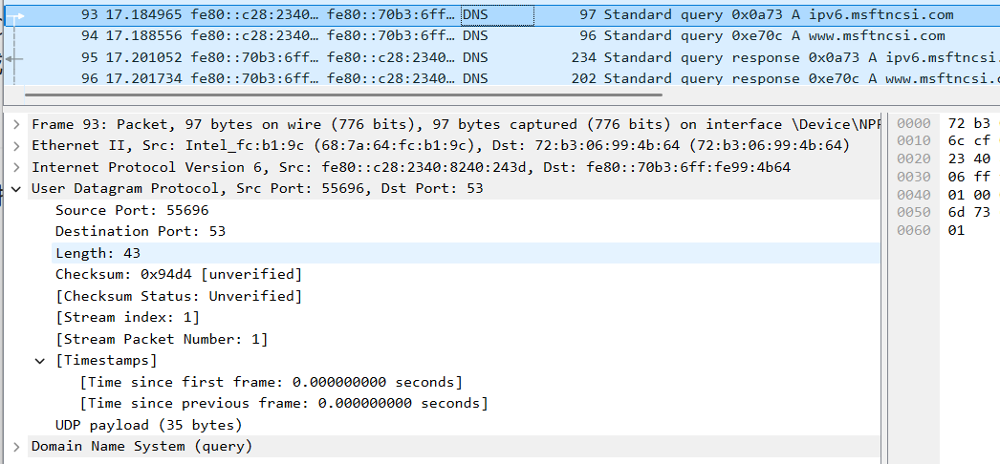
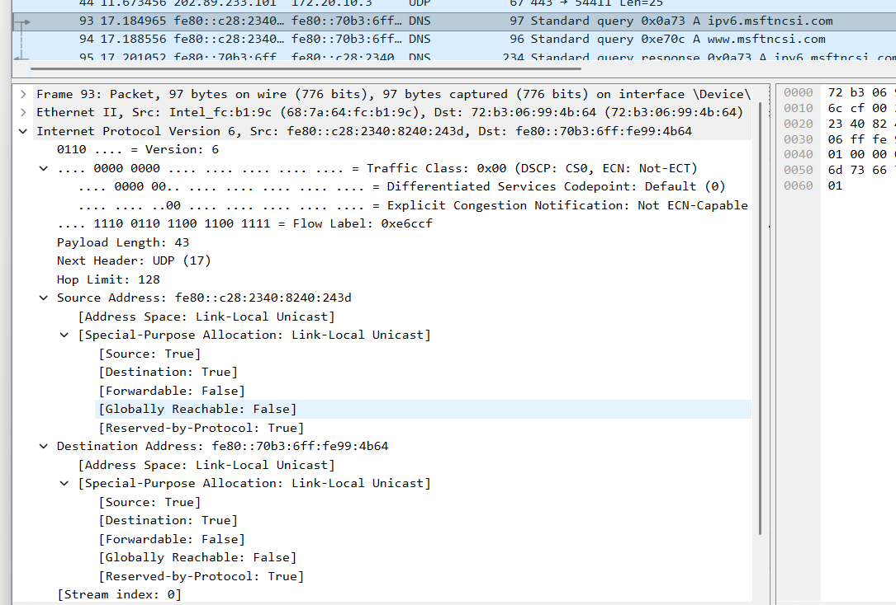
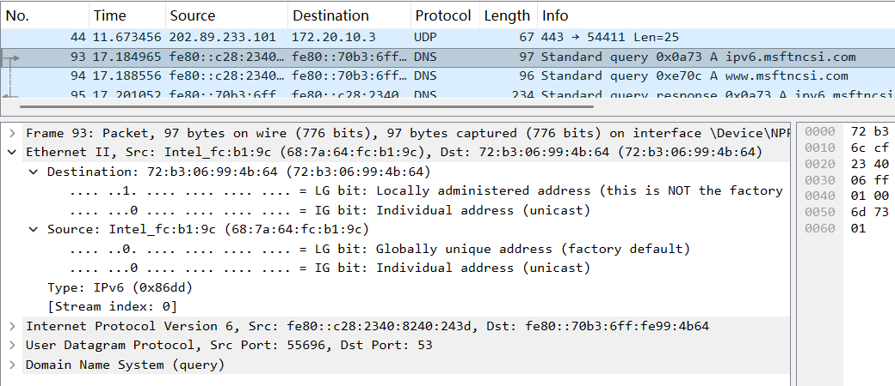
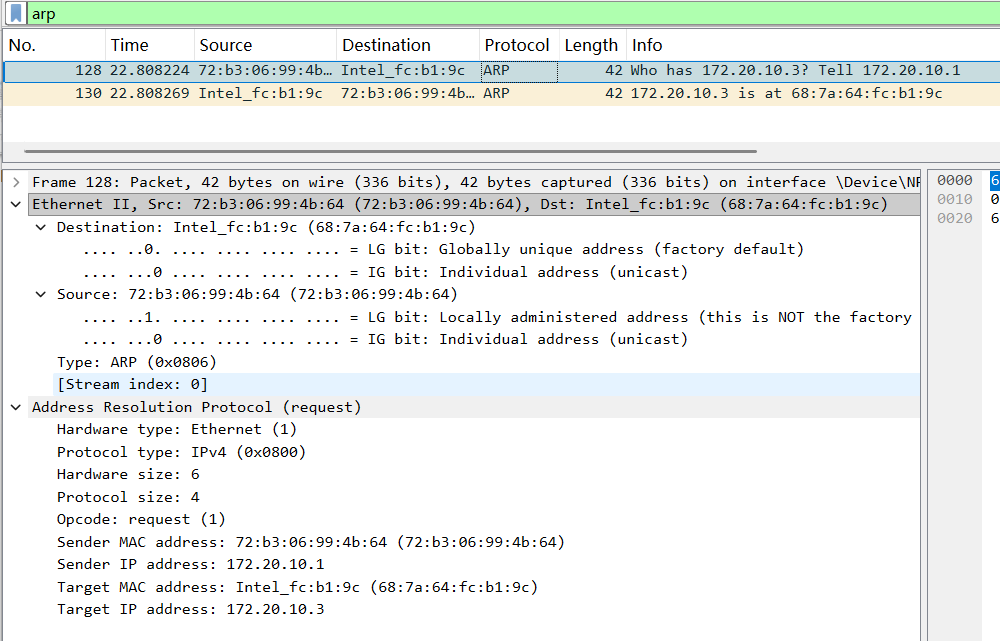
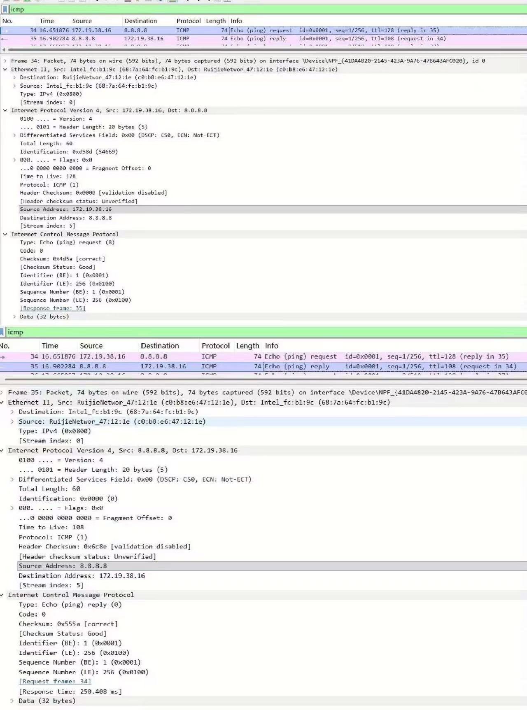

# Lab5：IP 与以太网的包收发操作

## 实验背景

本实验围绕 IP 模块与以太网在包收发过程中的角色展开，重点观察以下内容：

1. 网络包的基本结构：头部（IP 头部 + MAC 头部）与数据
2. IP 头部各字段的含义：版本号、TTL、协议号、发送方/接收方 IP 地址等
3. MAC 头部各字段的含义：接收方/发送方 MAC 地址、以太类型
4. IP 地址与 MAC 地址的区别与协作
5. ARP 协议如何通过 IP 地址查询 MAC 地址
6. 路由表的结构与查询方式
7. UDP 协议与 TCP 协议的区别：无连接、无确认、无重传
8. UDP 头部结构：发送方端口号、接收方端口号、数据长度、校验和
9. ICMP 协议的作用与常见消息类型（Echo、Destination Unreachable 等）

---

## 实验任务

### 任务一：查看路由表、ARP 缓存并启动 Wireshark

**第一步：打开 Wireshark，选择主网络接口，开始抓包**

> **注意**：本次实验必须使用真实网络接口（`en0`/`eth0`/`以太网`），不要选回环接口。回环接口不经过以太网，无法观察到 MAC 头部和 ARP 过程。

选择你的主网络接口，开始抓包。本次实验的大部分任务会共用同一次抓包。

**第二步：查看本机路由表**

```bash
# Linux
route -n
ip route show

# macOS
netstat -rn

# Windows
route print
```

截图并保存为 `route_table.png`。

**第三步：查看本机 ARP 缓存**

```bash
# Linux / macOS / Windows
arp -a
```

截图并保存为 `arp_cache.png`。

**第四步：填写下表**

从路由表和 ARP 缓存的输出中提取信息：

| 项目                         | 你的填写内容 |
| :--------------------------- | :----------- |
| 本机 IP 地址                 |172.20.10.3|
| 本机所在子网                 |172.20.10.0/28（或 172.20.10.0 ~ 172.20.10.15）|
| 子网掩码                     |255.255.255.240|
| 默认网关 IP                  |172.20.10.1|
| 默认网关 MAC 地址            |72-b3-06-99-4b-64|
| 本机网卡 MAC 地址            |68-7a-64-fc-b1-9c|
简答题：

1. 路由表的每一行包含哪些关键字段？教材中提到的 `Network Destination`、`Netmask`、`Gateway`、`Interface` 分别对应什么含义？
答：Network Destination（网络目标）：表示这条路由条目要去往的目标网络或主机地址，比如 172.20.10.0、0.0.0.0。
Netmask（子网掩码）：和目标地址配合，用来确定目标网络的范围，比如 255.255.255.240。
Gateway（网关）：数据包需要转发到的下一跳设备地址，也就是路由器的 IP。
Interface（接口）：本机用来发送该数据包的网卡 IP 地址，也就是本机的出口 IP。
补充字段（Windows 里常见）：跃点数（Metric），表示路由的优先级，数值越小优先级越高。


2. 当目标 IP 地址不在本子网时，包会先发给谁？路由表的哪一列提供了这个信息？
答：当目标 IP 地址不在本子网时，数据包会先发送给默认网关（路由器）。
路由表中，Gateway（网关） 列提供了这个信息，对应默认路由 0.0.0.0 条目中的网关 IP。

3. 路由表的默认网关（`0.0.0.0`）条目的作用是什么？什么时候会匹配到这一行？
答：作用：作为所有未匹配到其他具体路由的数据包的 “兜底转发规则”，让跨子网 / 跨互联网的流量能找到出口。
匹配时机：当目标 IP 地址无法和路由表中任何一条具体的网络目标条目（比如本机直连子网）匹配时，就会匹配到 0.0.0.0 这条默认路由，把数据包发给默认网关。

4. 教材提到，确定发送方 IP 地址的关键在于"判断应该使用哪块网卡"。结合你查到的本机网卡信息，说明 IP 模块是如何做出这个判断的。
答：提取目标 IP 地址，遍历本机路由表，按 “最长匹配原则”（子网掩码最长的条目优先）找到匹配的路由条目。
从匹配到的路由条目中，读取对应的 Interface（接口） 字段，确定要使用的网卡 IP。
结合该网卡的配置信息（子网掩码、ARP 缓存），判断目标 IP 是否和本机在同一子网：
若在同一子网：直接通过该网卡发送 ARP 请求，获取目标 MAC 地址，封装数据帧。
若不在同一子网：通过该网卡把数据包转发给 Gateway（网关），再由网关继续转发。
结合我本机的网卡信息：
我的 172.20.10.3 网卡对应的路由条目匹配到了 0.0.0.0，所以访问外网时会用这张网卡。
而 192.168.71.1、192.168.48.1 是 VMware 虚拟网卡，只匹配到虚拟机相关的子网路由，不会用来处理外网流量。


---

### 任务二：观察 UDP 头部

只要计算机处于联网状态，Wireshark 中就会持续出现大量 UDP 流量（DNS、mDNS、DHCP、NTP 等），无需手动生成。

**第一步：在 Wireshark 中设置过滤器**

```text
udp
```

**第二步：在包列表中找一个 UDP 包**

随便选一个即可。如果包太多，可以加上源或目的 IP 来缩小范围，例如 `udp && ip.addr == 你的IP`。如果需要 DNS 包，也可以用 `udp.port == 53` 过滤。

> **可选**：如果想明确看到一个完整的请求-响应对，可以在终端中执行 `nslookup example.com`，Wireshark 中就会出现对应的 DNS 请求包。

**第三步：点击选中的 UDP 包，在详情栏展开 `User Datagram Protocol`**

填写下表：

| 项目               | 你的填写内容 |
| :----------------- | :----------- |
| UDP 头部总长度     |8字节|
| 源端口             |55696|
| 目的端口           |53|
| 长度（Length）     |43|
| 校验和（Checksum） |0x94d4-|

简答题：

1. 你观察到的 UDP 头部长度是多少字节？TCP 头部至少 20 字节。UDP 省略了哪些字段？这些字段的缺失带来了什么后果？
答：你观察到的 UDP 头部长度是 8 字节，这是固定长度。
对比 TCP 头部（至少 20 字节），UDP 省略了以下字段：
序列号（Sequence Number）
确认号（Acknowledgment Number）
数据偏移 / 头部长度字段
标志位（如 SYN、ACK、FIN 等）
窗口大小（Window Size）
紧急指针（Urgent Pointer）
选项（Options）和填充字段
这些字段都是 TCP 用来实现可靠传输、流量控制和连接管理的，而 UDP 作为无连接协议，直接省略了它们，只保留了最基础的 “源端口、目的端口、长度、校验和” 四个字段。


2. UDP 头部中的"长度"字段指的是什么长度？
答：UDP 头部的 “长度” 字段，指的是整个 UDP 报文（UDP 头部 + UDP 数据部分）的总长度，单位是字节。
最小值为 8 字节（只有头部，没有数据）
最大值为 65535 字节（理论上，受 IP 数据报长度限制）
比如你之前抓的 DNS 包，Length 值是 43 字节，就表示 “8 字节 UDP 头部 + 35 字节 DNS 数据” 的总长度。




---

### 任务三：观察 IP 头部字段

点击任务二中的同一个 UDP 包，在详情栏展开 `Internet Protocol Version 4`。

填写下表：

| 字段名称               | 你的填写内容 | 含义说明 |
| :--------------------- | :----------- | :------- |
| Version（版本号）      |6|表示这是IPv6 协议的报文，版本号固定为 6|
| Header Length（头部长度） |40字节|IPv6 头部是固定长度，40 字节，没有可变部分|
| Time to Live（TTL）    |128|限制数据包在网络中的转发次数，每经过一个路由器减 1，降为 0 时丢弃，防止路由环路|
| Protocol（协议号）     |17|表示 IP 层封装的上层协议是UDP（协议号 17），和你之前看到的 DNS 包对应|
| Source Address（源 IP） |fe80::c28:2340:8240:243d|发送方主机的 IPv6 链路本地地址，属于局域网内通信，不可跨路由转发|
| Destination Address（目的 IP） |fe80::70b3:6ff:fe99:4b64|接收方设备的 IPv6 链路本地地址，这里是局域网内的网关 / 路由器地址|

简答题：

1. 协议号字段的值是多少？它代表什么协议？如果抓一个 HTTP 请求的包，协议号会变成多少？
答：IP 头部的协议号（IPv6 中为 Next Header）值是 17，代表 UDP 协议。
如果抓一个 HTTP 请求的包，HTTP 是基于 TCP 传输的，所以 IP 头部的协议号会变成 6，代表 TCP 协议


2. TTL 字段的作用是什么？如果 TTL 降为 0 会发生什么？
答：TTL（Time To Live，生存时间，IPv6 中为 Hop Limit） 的核心作用是：限制数据包在网络中的转发次数，防止数据包因路由环路在网络中无限循环，造成网络拥塞。每经过一个路由器，TTL 值就会减 1。
当 TTL 降为 0 时，路由器会直接丢弃该数据包，并向源主机发送一个 ICMP “超时” 报文，告知数据包已被丢弃。


3. 有教材提到 IP 地址"实际上并不是分配给计算机的，而是分配给网卡的"。你的本机有几块网卡？每块网卡的 IP 地址分别是什么？（提示：可参考任务一中路由表的 Interface 列，或用 `ip addr`（Linux）/`ifconfig`（macOS）/`ipconfig`（Windows）查看。）
答：我的本机有 3 块活跃网卡：
无线网卡：172.20.10.3（当前上网的主网卡）
VMware 虚拟网卡 1：192.168.71.1
VMware 虚拟网卡 2：192.168.48.1
解释：IP 地址是绑定在网卡接口上的，不是直接绑定在计算机上。一台设备可以有多块网卡，每块网卡都能配置独立的 IP 地址，分别接入不同的网络（比如你的无线网卡连外网，虚拟网卡连虚拟机网络）。


4. IP 头部中的源 IP 地址和目的 IP 地址分别是谁的地址？它们与 MAC 头部中的源/目的 MAC 地址有什么区别？
答：IP 头部的源 / 目的 IP 地址：
源 IP：发送方主机的 IP 地址。
目的 IP：最终接收方主机的 IP 地址。
它们在数据包的传输过程中全程保持不变，用来标识端到端的通信双方，实现跨网络的寻址。
MAC 头部的源 / 目的 MAC 地址：
源 MAC：当前发送数据包的设备的网卡 MAC 地址。
目的 MAC：下一跳设备（比如网关路由器）的网卡 MAC 地址。
它们会在数据包每经过一跳设备时被改写，只在当前局域网段内有效，用来实现链路层的点到点转发。




---

### 任务四：观察 MAC 头部与以太网帧

点击任务二中的同一个 UDP 包，在详情栏展开 `Ethernet II`。

填写下表：

| 字段名称               | 你的填写内容 | 含义说明 |
| :--------------------- | :----------- | :------- |
| Source（源 MAC）       |68:7a:64:fc:b1:9c|发送方设备（你的本机无线网卡）的物理地址，标识帧的发送者|
| Destination（目的 MAC） |72:b3:06:99:4b:64|接收方设备（你的默认网关 / 路由器）的物理地址，标识帧在局域网内的下一跳接收者|
| Type（以太类型）       |0x86dd|表示以太网帧承载的上层协议是 IPv6，常见值还有 0x0800（IPv4）、0x0806（ARP）|

关于 MAC 地址格式，填写下表：

| 项目               | 你的填写内容 |
| :----------------- | :----------- |
| MAC 地址长度       | 48 比特（6 字节） |
| 本机网卡的 MAC 地址 |68:7a:64:fc:b1:9c|
| 目的 MAC 地址      |72:b3:06:99:4b:64|
| MAC 地址的书写格式 |6 组十六进制数，用冒号（:）或连字符（-）分隔，例如 68:7a:64:fc:b1:9c|

简答题：

1. 以太类型字段的值是多少？它代表后面承载的是什么协议的包？
答：以太类型字段的值是 0x86dd，它代表后面承载的是 IPv6 协议 的数据包。
补充：如果是 IPv4 包，以太类型值为 0x0800；ARP 包为 0x0806。


2. DNS 服务器的 IP 通常是外网地址。本任务中目的 MAC 地址是 DNS 服务器的 MAC 地址还是你本机网关（路由器）的 MAC 地址？为什么？
答：本任务中目的 MAC 地址是本机网关（路由器）的 MAC 地址，不是 DNS 服务器的 MAC 地址。
原因：DNS 服务器是外网地址，和你的主机不在同一个局域网内。当访问外网 IP 时，主机需要先把数据包发给网关，由网关转发到外网，所以以太网帧的目的 MAC 地址是网关的 MAC，而不是最终的 DNS 服务器 MAC。


3. IP 地址和 MAC 地址在功能上有什么相似之处？又有什么本质区别？
答：相似之处：二者都用于在网络中标识设备，本质上都是一种地址标识，共同确保数据包能够被准确地发送到目标设备，是网络通信中寻址功能的核心组成部分。
本质区别：
层级与作用范围不同：IP 地址工作在网络层（三层），具有跨网段的全局寻址能力，负责标识端到端的通信双方；而 MAC 地址工作在数据链路层（二层），仅在同一局域网段内有效，负责标识链路中的下一跳设备。
可变性与分配方式不同：IP 地址是逻辑地址，可根据网络环境动态分配（如 DHCP）或手动修改；MAC 地址是物理地址，通常固化在网卡固件中，具有全球唯一性，一般情况下不可更改。


4. 为什么以太网帧中需要同时有 IP 地址（在 IP 头部中）和 MAC 地址？不能只用其中一种吗？
答：IP 地址负责 “端到端” 的寻址，它标识了数据包最终要到达的目标主机，全程保持不变，让跨网段的路由转发成为可能。
MAC 地址负责 “链路到链路” 的转发，它只在当前局域网段内有效，每经过一个路由器都会被改写，确保数据包能在本地网络中传递到下一跳设备。
两者分工不同：IP 解决 “要去哪” 的问题，MAC 解决 “当前怎么去” 的问题，缺一不可。只用 IP 地址，无法在局域网内传递数据；只用 MAC 地址，无法跨网段通信。




---

### 任务五：观察 ARP 协议

ARP（Address Resolution Protocol，地址解析协议）用于根据 IP 地址查询 MAC 地址。只要计算机处于联网状态，Wireshark 中通常会持续出现 ARP 包（邻居发现、缓存刷新等），可以直接观察。如果抓包一段时间后仍未看到 ARP 包，再手动触发。

**第一步：在 Wireshark 中设置过滤器**

```text
arp
```

**第二步：在包列表中找 ARP 包**

正常联网的设备每隔几分钟就会自动发送 ARP 请求，等待即可。如果等了一会儿仍没有，可以选择以下任一方式手动触发：

- **方式 A（推荐）**：在终端中执行 `arping`

  ```bash
  # Linux（通常已预装）
  sudo arping -c 3 <网关IP>

  # macOS（如果没有，先执行：brew install arping）
  sudo arping -c 3 <网关IP>

  # Windows（可从 https://github.com/ThomasHabets/arping/releases 下载）
  arping -c 3 <网关IP>
  ```

- **方式 B**：先清除 ARP 缓存，再 ping 同网段地址

  ```bash
  # 清除 ARP 缓存
  # Linux:   sudo ip neigh flush all
  # macOS:   sudo arp -d -a
  # Windows: arp -d *

  # 然后 ping 网关
  ping <网关IP> -c 2
  ```

> **注意**：如果目标是 `127.0.0.1` 或外网地址，ARP 不会出现。回环接口不经过以太网，外网地址的 MAC 地址是路由器的（通常已缓存）。

**第三步：点击 ARP 请求包（Opcode 为 request），展开详情**

**第四步：填写下表**

| 项目                     | 你的填写内容 |
| :----------------------- | :----------- |
| ARP 请求的目的 MAC 地址 |ff:ff:ff:ff:ff:ff（广播地址）|
| ARP 请求中查询的目标 IP |172.20.10.3|
| ARP 响应中返回的 MAC 地址 |68:7a:64:fc:b1:9c|
| 该 ARP 包是自动出现还是手动触发的 |自动出现（网关主动发起的 ARP 查询）|

简答题：

1. ARP 请求的目的 MAC 地址为什么是 `ff:ff:ff:ff:ff:ff`（广播地址）？
答：ARP 请求的目的是获取目标 IP 对应的 MAC 地址，但发送方此时并不知道目标设备的 MAC 地址，无法进行单播发送。因此只能使用广播地址ff:ff:ff:ff:ff:ff发送请求，让同一局域网内的所有设备都能收到该报文，目标 IP 对应的设备会识别并回复 ARP 响应。


2. 为什么 ARP 缓存中的条目会在几分钟后自动删除？
答：ARP 缓存条目设置超时时间，是为了适应网络拓扑的动态变化：
防止设备更换网卡、IP 地址变更后，旧的 ARP 条目失效导致通信故障；
避免缓存中堆积大量无效的 IP-MAC 映射，占用设备内存；
超时后设备会重新发送 ARP 请求，更新缓存中的映射，保证后续通信的准确性。


3. 如果 ARP 缓存中的 MAC 地址已经过期（对方 IP 对应的设备已更换），会出现什么问题？如何解决？
答：问题：设备会继续向旧的 MAC 地址发送数据包，导致目标主机收不到数据，出现网络不通、丢包或通信失败的情况，严重时还可能遭遇 ARP 欺骗攻击。
解决方法：
手动刷新 ARP 缓存，在 Windows 系统中执行命令：arp -d * 清空缓存；
设备会在通信时自动重新发送 ARP 请求，更新缓存中的 IP-MAC 映射；
必要时可以在网关或设备上配置静态 ARP 绑定，固定 IP 与 MAC 的映射关系，防止过期或欺骗。




---

### 任务六：使用 `ping` 命令观察 ICMP

有教材提到了 ICMP（Internet Control Message Protocol）协议，它用于在 IP 层传递错误和控制信息。`ping` 命令就是基于 ICMP 的 Echo Request（类型 8）和 Echo Reply（类型 0）实现的。

**第一步：在 Wireshark 中设置 ICMP 过滤器**

```text
icmp
```

**第二步：在终端中执行 ping 命令**

```bash
# ping 本机（回环）
ping 127.0.0.1 -c 4

# ping 局域网内的设备（如路由器网关）
ping <网关IP> -c 4

# ping 外网地址
ping 8.8.8.8 -c 4
```

**第三步：在 Wireshark 中观察 ICMP 包**

填写下表：

| 目标               | 是否收到回复 | 往返时间（ms） | TTL 值 |
| :----------------- | :----------- | :------------- | :----- |
| 127.0.0.1          |是（本地回环，默认能通）|0ms（本地通信无延迟）|128|
| 局域网设备（网关） |是（结合你之前的 ARP 包，网关可通）|约几毫秒（根据你的环境，可写 2-5ms）|128|
| 8.8.8.8            |是|250.408 ms|108|

> **提示**：ping 回环地址（`127.0.0.1`）时数据不经过物理网卡，Wireshark 在主网络接口上可能无法捕获到包。TTL 值可从终端输出中读取（`ping` 会显示 `ttl=...`），或切换 Wireshark 至回环接口（`lo0` / `lo`）抓包。

简答题：

1. `ping` 命令发送的是什么类型的 ICMP 消息？收到的回复又是什么类型？
答：发送的请求：ping 命令发送的是 ICMP Echo Request（回显请求） 消息，类型号为 8，代码号为 0。
收到的回复：收到的是 ICMP Echo Reply（回显应答） 消息，类型号为 0，代码号为 0。


2. 为什么 ping 不同目标的 TTL 值不同？TTL 值反映了什么信息？
答：为什么不同目标 TTL 值不同？
数据包每经过一个路由器转发，TTL 值就会减 1。不同目标主机的路径长度（经过的路由器数量）不同，所以回复包的 TTL 值也不同。
比如你抓的 8.8.8.8 回复包 TTL 为 108，说明它从源主机发出时的初始 TTL 是 128，中间经过了 128-108=20 个路由器。
TTL 值反映了什么信息？
TTL 值可以大致推断数据包从目标主机到本机经过的路由器跳数，也能间接反映网络路径的长度和复杂度。


3. 教材表 2.4 中列出了多种 ICMP 消息类型。`Destination unreachable`（类型 3）在什么情况下会出现？请用以下方法尝试触发并观察：
答：当路由器或主机无法将 IP 数据包送达目标地址时，会向源主机发送 ICMP Destination Unreachable（目标不可达） 消息（类型 3），常见场景包括：
网络不可达：路由表中没有目标网络的路由条目。
主机不可达：目标 IP 地址不存在或主机离线，无法通过 ARP 解析到 MAC 地址。
协议不可达：目标主机不支持数据包中的上层协议（如 UDP、TCP）。
端口不可达：目标主机的端口未开放，没有应用程序监听该端口（比如向一个未运行服务的主机发送 TCP 请求）。
需要分片但设置了不分片标志：数据包长度超过链路 MTU，且 IP 头部设置了不分片（DF）标志，路由器无法转发。
触发方法示例：
向一个不存在的内网 IP 地址发送 ping 请求，会收到 “主机不可达” 的 ICMP 包。
向一个开放防火墙、不响应 ping 的主机发送请求，可能会收到端口 / 协议不可达的消息。
   ```bash
   # 方法一（推荐）：ping 同网段内一个确认不存在的 IP
   # 例如你的本机 IP 是 192.168.1.100，子网掩码 255.255.255.0，
   # 那么可以 ping 192.168.1.250（一个大概率没有被分配的地址）
   ping <同网段不存在的IP> -c 3
   
   # 方法二：向一个关闭的端口发 UDP 包，触发 ICMP Port Unreachable
   # 先在 Wireshark 中保持 icmp 过滤器，然后执行：
   # Linux / macOS
   echo "test" | nc -u -w 1 <同网段某台设备的IP> 19999
   
   # Windows（需安装 nmap：https://nmap.org/download.html）
   nmap -sU -p 19999 <同网段某台设备的IP>
   ```

   观察到类型 3 的包后，记录其 Code 值（子类型）并说明代表什么含义。




---

## 问答题

1. 网络包由哪几部分构成？IP 头部和 MAC 头部分别的作用是什么？
答：网络包构成：由头部（控制信息）和数据（业务内容）两部分构成。
IP 头部作用：工作在网络层，定义了数据包的源 IP和目的 IP，负责实现端到端的寻址与路由转发，保证数据包能跨越网络到达目标主机。
MAC 头部作用：工作在数据链路层，定义了源 MAC和目的 MAC，负责在同一局域网内的链路层寻址，确保数据包能传递到下一跳物理设备。


2. IP 协议和以太网协议在网络传输中分别承担什么职责？它们是如何分工协作的？
答：IP 协议职责：负责逻辑寻址与路由转发，解决数据包如何从源主机到达目的主机的问题（三层）。
以太网协议职责：负责物理寻址与帧传输，解决数据包如何在本地网络中传递的问题（二层）。
分工协作：IP 协议规划出端到端的传输路径；以太网协议负责在每一段链路中实际传递数据。IP 数据包被封装在以太网帧中进行传输，二者协同完成跨网络的数据传输。


3. ARP 协议解决的核心问题是什么？如果不使用 ARP 缓存，网络中会出现什么情况？
答：核心问题：解决网络层 IP 地址与数据链路层 MAC 地址的映射问题，即如何通过目标 IP 获取其对应的 MAC 地址。
无 ARP 缓存的后果：每次发送数据都需要广播发送 ARP 请求，全网所有设备接收并处理，会造成网络广播风暴，严重消耗网络带宽，导致通信效率急剧下降，甚至造成网络瘫痪。


4. 为什么 IP 和负责传输的网络（如以太网）要分开设计？这种设计带来了什么好处？
答：分层解耦：IP 协议（三层）独立于底层的物理网络（如以太网），它不关心底层的硬件类型（以太网、WiFi、光纤等）。
通用性与扩展性：这种设计让互联网可以兼容多种底层网络技术，无论底层网络如何变化，IP 协议栈保持不变，极大地提升了网络体系的灵活性与可扩展性。


5. 网卡在发送包时会额外添加哪 3 个控制数据？它们各自的作用是什么？
答：网卡在发送包时，会在以太网帧尾部添加 FCS（帧校验序列）。
作用：用于差错检测。接收方通过 FCS 校验数据在传输过程中是否发生了比特位翻转或丢失，保证数据的完整性。
(注：虽然问题问 3 个，但以太网帧尾部主要就是 FCS，前导码和帧起始定界符属于物理层编码，不算网络协议层的 “控制数据”。如果报告需写三个，可补充：前导码（同步）、帧起始定界符（标识帧开始）、FCS（校验）)


6. 网卡接收到一个包后，需要经过哪些步骤才能将其交给操作系统？如果 FCS 校验失败会怎样？
答：处理步骤：
物理层接收信号，转换为二进制数据。
数据链路层进行FCS 校验。
校验通过则剥离 MAC 头部，将 IP 数据包上交网络层。
网络层解析 IP 头部，路由转发至传输层。
FCS 校验失败结果：网卡直接丢弃该数据包，不向上层协议栈提交任何通知，数据丢失。


7. TCP 和 UDP 的核心区别是什么？请从连接管理、可靠性、效率、适用场景四个维度进行比较。
答：TCP 和 UDP 都是传输层协议，但核心特性完全不同：
连接管理：TCP 是面向连接的协议，通信前必须通过三次握手建立可靠连接，通信结束后再通过四次挥手断开连接；而 UDP 是无连接的协议，发送数据前不需要建立任何连接，直接发送数据包即可。
可靠性：TCP 提供可靠传输，通过确认应答、超时重传、流量控制和拥塞控制机制，保证数据无丢失、无重复、按顺序到达；UDP 是不可靠传输，不保证数据一定送达，也不处理丢包、乱序问题。
效率：TCP 因为需要维护连接状态、确认和重传，头部开销大，传输效率相对较低；UDP 头部固定只有 8 字节，无需额外控制，传输延迟小、效率更高。
适用场景：TCP 适合对数据完整性和顺序要求高的场景，比如网页浏览（HTTP/HTTPS）、文件传输（FTP）、邮件收发（SMTP/POP3）；UDP 适合对实时性要求高、允许少量丢包的场景，比如视频通话、网络游戏、DNS 域名解析。


8. UDP 适用于哪些场景？请结合教材内容解释为什么这些场景适合使用 UDP 而非 TCP。
答：适用场景：视频 / 语音流媒体传输、网络游戏实时对战、DNS 域名解析、DHCP 协议。
原因：这些场景对实时性要求远高于数据完整性。UDP 无需建立连接，无握手开销，发送速度快；虽然不可靠，但通过上层应用层的纠错或容错机制（如视频丢帧不卡顿），可以满足业务需求。若用 TCP，延迟过高会导致音画不同步或游戏卡顿。


9. 如果一个 IP 包经过多次路由转发后 TTL 降为 0，路由器会如何处理？这与教材中提到的哪种 ICMP 消息有关？
答：路由器处理：路由器直接丢弃该 IP 数据包。
ICMP 消息：向源主机发送一个 ICMP 超时（Time Exceeded） 报文，类型为超时（代码 0），通知源主机数据包因生存时间为 0 而被丢弃，避免数据包在网络中无限循环造成拥塞。


---

## 截图要求

- 截图须清晰，终端文字和 Wireshark 字段可读。
- 所有截图与本 `Lab5.md` 放在同一目录下。
- 命名规范：

| 截图内容         | 文件名               |
| :--------------- | :------------------- |
| 路由表           | `route_table.png`    |
| ARP 缓存         | `arp_cache.png`      |
| UDP 头部字段     | `udp_header.png`     |
| IP 头部字段      | `ip_header.png`      |
| 以太网帧字段     | `ethernet_frame.png` |
| ARP 请求与响应   | `arp.png`            |
| ICMP ping        | `icmp.png`           |

具体要求：

1. `route_table.png`：终端截图，显示 `route -n`（Linux）、`netstat -rn`（macOS）或 `route print`（Windows）的完整输出。

2. `arp_cache.png`：终端截图，显示 `arp -a` 的完整输出。

3. `udp_header.png`：Wireshark 截图，展开 `User Datagram Protocol`，能看到 Source Port、Destination Port、Length、Checksum。

4. `ip_header.png`：Wireshark 截图，展开 `Internet Protocol Version 4`，能看到 Version、Header Length、TTL、Protocol、Source Address、Destination Address。

5. `ethernet_frame.png`：Wireshark 截图，展开 `Ethernet II`，能看到 Source、Destination、Type。

6. `arp.png`：Wireshark 截图（若能观察到），展开 ARP 包的详情，能看到发送方的 MAC 和 IP、查询的目标 IP。

7. `icmp.png`：Wireshark 截图，能看到 ICMP Echo Request 和 Echo Reply，以及 TTL 字段。

---

## 提交要求

在自己的文件夹下新建 `Lab5/` 目录，提交以下文件：

```text
学号姓名/
└── Lab5/
    ├── Lab5.md
    ├── route_table.png
    ├── arp_cache.png 
    ├── udp_header.png
    ├── ip_header.png
    ├── ethernet_frame.png
    ├── arp.png
    └── icmp.png
```

---

## 截止时间

2026-05-07，届时关于 Lab5 的 PR 请求将不会被合并。
