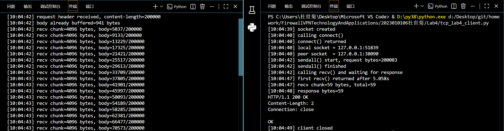
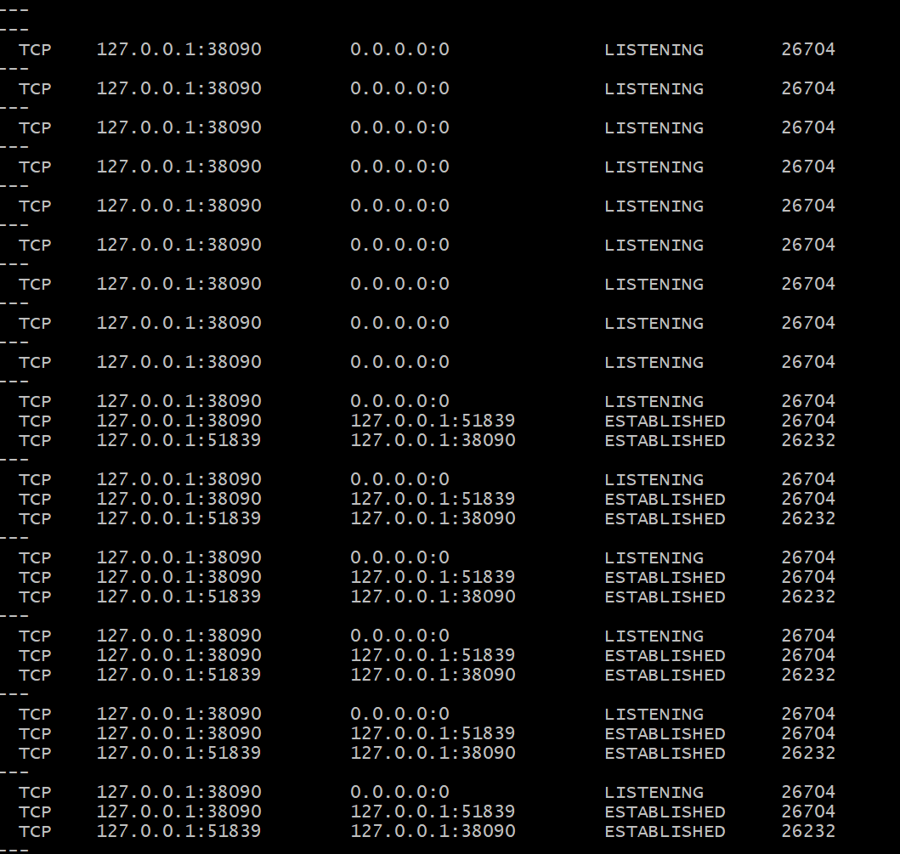
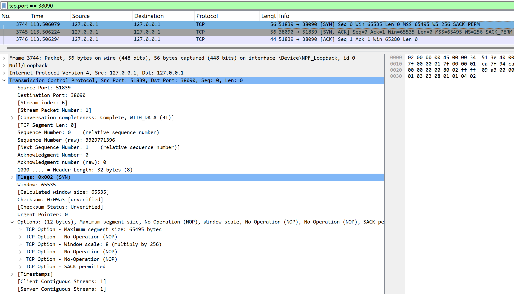
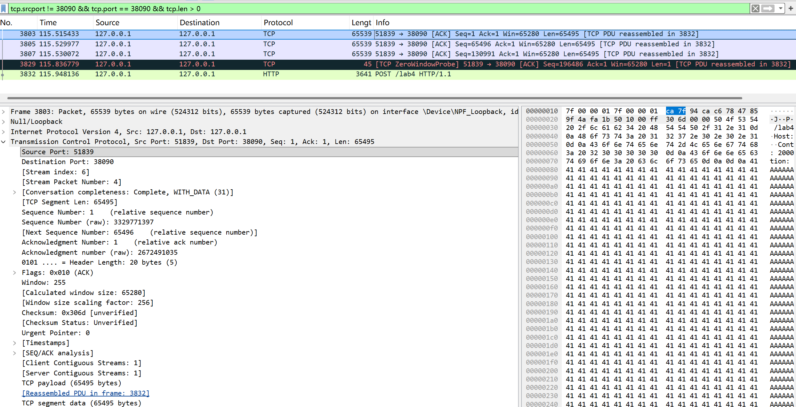
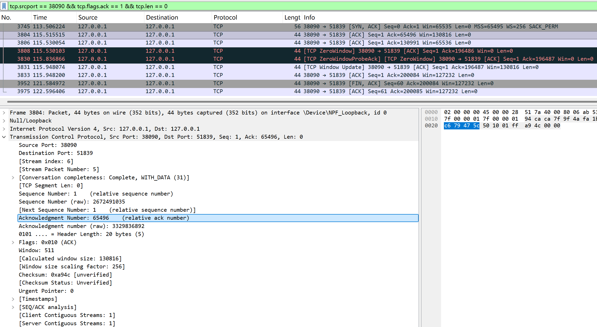
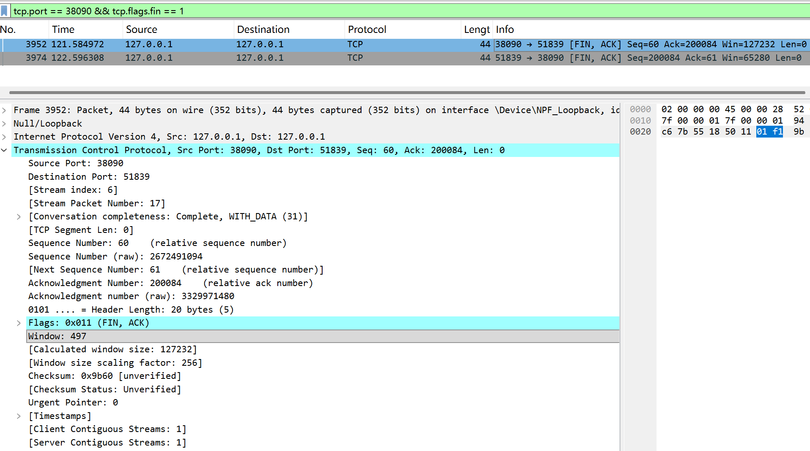

# Lab4：看见TCP 我不怕不怕啦

## 实验背景

本实验围绕一条 TCP 连接的完整生命周期展开，重点观察以下内容：

1. `socket()`、`listen()`、`accept()`、`connect()` 的职责区别
2. "连接"为什么本质上是交换控制信息而不是物理连线
3. TCP 头部中的端口号、序号、ACK 号、标志位、窗口、头部长度、可选字段
4. 三次握手如何建立收发准备
5. 应用层大块数据如何被 TCP 按 MSS 拆分
6. `Sequence Number` 与 `Acknowledgment Number` 如何配合工作
7. `recv()` 为什么会阻塞等待数据
8. 接收窗口如何反映接收方处理能力
9. ACK 与窗口更新为什么常常会被合并
10. `FIN` / `ACK` 如何完成断开
11. 为什么连接结束后套接字不会立刻删除

---

## 实验任务

### 任务一：准备实验环境并记录运行信息

**第一步：准备好四个窗口**

整个实验需要同时观察多个界面，建议在开始前把窗口布局摆好：

- **终端 A**：运行服务端
- **终端 B**：运行客户端
- **终端 C**：持续监控套接字状态（全程保持开启，不要关）
- **Wireshark**：抓包

**第二步：在终端 C 里启动持续监控**

TCP 状态变化很快，等你手动敲完 `ss` 命令再回车，状态可能已经过去了。用下面的命令让终端 C 每 0.5 秒自动刷新一次，之后只需要盯着这个窗口就行：

```bash
# Linux
watch -n 0.5 'ss -tan | grep 38090'

# macOS（没有 watch，用循环代替）
while true; do netstat -an | grep 38090; echo "---"; sleep 0.5; done

# Windows（Git Bash执行）
while true; do netstat -ano | grep 38090; echo "---"; sleep 0.5; done
```

如果你换了端口，把 `38090` 替换成实际端口。

**第三步：打开 Wireshark，选回环接口，填好过滤器，开始抓包**

回环接口在不同系统里名字不同：

| 系统 | 接口名 |
|:-----|:-------|
| Linux | `lo` |
| macOS | `lo0` |
| Windows | `Adapter for loopback traffic capture`（需提前安装 Npcap 并勾选回环支持） |

在显示过滤器里输入：

```text
tcp.port == 38090
```

然后点击开始抓包（蓝色鲨鱼鳍图标）。**先开始抓包，再运行脚本**，否则握手包会被漏掉。

**第四步：启动脚本**

```bash
# 终端 A
python3 tcp_lab4_server.py

# 终端 B（等服务端打印出 server listening on ... 后再运行）
python3 tcp_lab4_client.py
```

如果 `38090` 已被占用，两端都加环境变量换端口，同时记得把 Wireshark 过滤器和终端 C 里的端口号也改掉：

```bash
LAB4_PORT=38123 python3 tcp_lab4_server.py
LAB4_PORT=38123 python3 tcp_lab4_client.py
```

**第五步：填写下表**

| 项目                                | 你的填写内容 |
| :---------------------------------- | :----------- |
| 服务端监听地址                      |127.0.0.1|
| 服务端监听端口                      |38090|
| 客户端本地临时端口                  |51839|
| 客户端请求总字节数                  |200083 字节|
| 服务端响应内容                      |OK|
| 客户端 `connect()` 返回前后的时间点 |connet()调用前：10：04：40 ；connet()调用后：10：04：40|
| 客户端首次收到响应前等待了多久      |5.058s|

各项数值均可直接从终端输出读取：服务端监听信息在 `server listening on ...`，客户端本地端口在 `local socket = ...`，请求字节数在 `sendall() start, request bytes=...`，等待时间在 `first recv() returned after ...s`。



---

### 任务二：观察套接字创建与连接建立

1. 服务端启动后，观察终端 C 出现 `LISTEN` 状态，截图留存。
2. 在终端 B 里启动客户端，观察它依次打印 `socket created`、`calling connect()`、`connect() returned`。
3. 客户端打印 `connect() returned` 之后，观察终端 C 出现 `ESTABLISHED`，截图留存。脚本在 `connect()` 返回后有 2 秒停顿，这段时间足够截图。

填写下表：

| 阶段                             | 你的填写内容 |
| :------------------------------- | :----------- |
| 服务端启动、客户端未连入时的状态 |LISTENING（监听状态）|
| `connect()` 返回后服务端状态     |ESTABLISHED（已建立连接状态）|
| `connect()` 返回后客户端状态     |ESTABLISHED（已建立连接状态）|

简答题：

1. 服务端在客户端连接前为什么处于 `LISTEN`？
服务端通过socket()创建套接字、bind()绑定 IP 和端口后，会调用listen()系统调用，将套接字切换为被动监听模式，进入 LISTEN 状态。该状态的核心作用是让操作系统内核为对应端口维护半连接队列（SYN 队列）和全连接队列（ACCEPT 队列），持续监听来自客户端的 TCP 连接请求（SYN 包），等待客户端发起连接，这是 TCP 服务端接收连接的标准前置状态。


2. 为什么这时还没有真正建立 TCP 连接？
TCP 连接的建立必须完成三次握手的完整流程：客户端发送 SYN 请求、服务端回复 SYN+ACK 确认、客户端发送 ACK 确认。服务端仅处于 LISTEN 状态时，仅完成了 “准备好接收连接” 的步骤，还未收到客户端的 SYN 请求，更没有完成三次握手的全流程，因此 TCP 连接尚未真正建立。


3. `socket()` 与 `connect()` 的区别是什么？
socket()：作用是创建套接字对象，分配内核资源（如文件描述符、缓冲区），仅完成 “创建通信端点” 的操作，无网络交互，客户端和服务端均可调用，调用后仅创建套接字，不改变 TCP 连接状态。
connect()：作用是主动发起 TCP 连接，触发三次握手流程，仅客户端可调用，会发起网络交互，阻塞等待三次握手完成后返回，将客户端套接字从 CLOSED 状态转为 ESTABLISHED 状态，完成 TCP 连接建立。


4. 为什么 `connect()` 返回后才进入可稳定收发数据的状态？
connect()是阻塞式系统调用，会一直阻塞直到 TCP 三次握手完全成功完成后才返回。三次握手完成前，客户端和服务端的 TCP 状态未同步，序列号、窗口大小等核心传输参数未协商一致，无法保证数据传输的可靠性、顺序性和完整性；只有connect()成功返回，代表双方 TCP 连接已进入 ESTABLISHED 状态，参数协商完成，才能稳定、可靠地收发应用层数据。


5. 为什么"网线一直连着"不等于"TCP 连接已经建立"？
网线连通属于物理层 / 数据链路层的硬件连通性，仅代表物理线路、以太网链路通畅；而 TCP 连接是操作系统内核维护的逻辑连接，依赖三次握手建立的状态、序列号、窗口等参数，和物理网线是否连通没有直接对应关系。即使网线插着，若服务端未启动、未监听端口，客户端也无法建立 TCP 连接；反之，TCP 连接建立后，网线短暂断开再恢复，TCP 连接也可能因超时断开，因此物理连通不等于逻辑连接存在。


6. 这里的"连接"更准确地说是在做什么？
这里的 “TCP 连接”，本质是客户端和服务端的操作系统内核，通过三次握手协商并维护的一组逻辑状态与参数，核心包括：五元组（源 IP、源端口、目的 IP、目的端口、传输层协议）、双方的 TCP 序列号与确认号（保证数据顺序、不丢包、不重复）、滑动窗口大小（流量控制）、连接状态、超时重传等可靠性机制。它不是物理上的 “导线”，而是两个内核之间约定的通信规则和状态上下文，用于保障应用层数据的可靠、有序传输。




---

### 任务三：观察三次握手与 TCP 头部字段

**定位握手包**：在 Wireshark 过滤器里输入下面的条件，可以屏蔽中间的数据包，只留下握手和断开阶段的控制包：

```text
tcp.port == 38090 && (tcp.flags.syn == 1 || tcp.flags.fin == 1)
```

包列表最前面的三个包就是三次握手（SYN → SYN-ACK → ACK）。

**找到各字段的位置**：点击某个握手包，在下方详情栏展开 `Transmission Control Protocol`。源端口、目的端口、Seq、Ack、Flags、Window、Header Length 都在这里。TCP 选项在最底部的 `Options` 子项里，展开后可以看到 MSS、Window Scale、SACK Permitted，注意这三项只出现在带 SYN 标志的包里，纯 ACK 包里没有。

**关于序号显示**：Wireshark 默认开启相对序号，会把每个方向的初始序号归零显示，所以 SYN 包的 Seq 看起来是 `0`，而不是真实的随机大数。这是正常现象，实验报告按 Wireshark 显示的值填写即可。如果你想看真实值，可以去 `Edit → Preferences → Protocols → TCP` 里取消勾选 `Relative sequence numbers`。

填写下表：

| 报文       | 源端口 | 目的端口 | Seq  | Ack  | Flags | Window | Header Length |
| :--------- | :----- | :------- | :--- | :--- | :---- | :----- | :------------ |
| 第一次握手 |51839|38090|0|0|SYN|65535|32|
| 第二次握手 |38090|51839|0|1|SYN,ACK|65535|32|
| 第三次握手 |51839|38090|1|1|ACK|255|20|

第一次握手（SYN）的 Ack 字段在 Wireshark 里通常显示为空或 `0`，这是正常的，因为此时客户端还没有收到服务端的任何数据。Header Length 在没有选项时是 20 字节，握手包因为携带了 MSS 等选项通常是 28 或 32 字节。

| TCP 选项       | 你的填写内容 |
| :------------- | :----------- |
| MSS            |65495 bytes|
| Window Scale   |8 (multiply by 256)|
| SACK Permitted |Yes (已启用)|

回环接口的 MSS 通常是 65495（因为回环 MTU 是 65536，比以太网的 1500 大得多），这会影响后续任务五里是否能观察到分段。

简答题：

1. 发送方和接收方端口号在连接阶段的作用是什么？
端口号是传输层识别进程的唯一标识。在连接阶段，源端口（客户端随机端口，如 51839）由客户端操作系统临时分配，用于唯一标识本次客户端进程，确保服务端能精准回包；目的端口（服务端知名端口，如 38090）用于定位服务端上特定的监听进程。两者共同构成套接字（Socket）对，唯一区分一条 TCP 连接，避免不同应用通信之间的干扰。


2. TCP 头部如何帮助找到目标套接字？
TCP 头部包含源端口号、目的端口号，配合 IP 头部中的源 IP 地址、目的 IP 地址，共同构成了唯一的四元组（源 IP、源端口、目的 IP、目的端口）。操作系统内核通过解析这四个字段，精确匹配到本机的某个进程（套接字），从而将收到的数据准确交付给对应的应用程序。


3. 为什么初始序号不是简单固定从 1 开始？
初始序号（ISN）并非固定从 1 开始，而是采用32 位计数器随机生成。这主要出于两个核心目的：
安全性：防止旧连接的残留 Segment 干扰新连接。如果 ISN 固定为 1，攻击者容易伪造带有旧序号的数据包，导致数据被错误接收。
唯一性：随机化的 ISN 能确保在复杂的网络环境中，新连接的序列号空间与过往连接的序列号空间不重叠，保证数据传输的唯一性和可靠性。


4. 为什么 TCP 可选字段更容易在连接阶段看到？
TCP 可选字段（如 MSS、Window Scale）主要用于连接协商，仅在三次握手建立连接时传递双方的通信能力参数。
数据传输阶段的报文（如纯 ACK 或携带数据的报文）主要负责确认和传输数据，通常不需要携带这些协商选项，因此头部会精简为 20 字节。
只有 SYN 包（连接建立阶段）才会携带 MSS 等选项，用于双方通告最大段长度等关键配置，所以这些选项更容易在建立连接的包中看到。




---

### 任务四：区分头部中的控制信息和套接字中的控制信息

用以下过滤器分别找到两类报文：

```text
# 纯控制报文（无应用数据）
tcp.port == 38090 && tcp.len == 0

# 携带应用数据的报文
tcp.port == 38090 && tcp.len > 0
```

从纯控制报文里选一个（SYN、纯 ACK 或 FIN-ACK 都可以），从数据报文里选一个（客户端发请求或服务端发响应的包）。

填写下表：

| 项目                   | 你的填写内容 |
| :--------------------- | :----------- |
| 纯控制报文的类型       |SYN 报文|
| 携带应用数据的报文类型 |ACK 报文（携数据）|
| 头部中的控制信息举例   |Flags (SYN/ACK)、Seq、Ack、Window、Header Length|
| 套接字中的控制信息举例 |连接状态（ESTABLISHED/LISTEN）、读写缓冲区状态、错误码、超时配置|

简答题：

1. 为什么"头部中的控制信息"和"套接字中的控制信息"不是同一件事？
1）所属层级与本质不同
头部中的控制信息，是TCP 传输层协议头部（Packet Header）里的协议字段，是封装在网络数据包中的、用于网络传输的标准化信息；而套接字中的控制信息，是操作系统内核为进程维护的、属于进程通信端点（Socket）的逻辑状态信息，是系统层面的资源管理数据，和网络数据包本身是两个独立的概念。
2）功能与作用对象不同
头部控制信息的作用对象是对端的 TCP 协议栈，用于指导数据包的传输、确认与可靠性保障，比如 Flags 标志位用于握手 / 断开、Seq/Ack 用于保证数据顺序、Window 用于流量控制，是网络传输的 “语法规则”；套接字控制信息的作用对象是本地应用进程，用于管理连接状态（如 ESTABLISHED/LISTEN）、读写缓冲区状态、错误码、超时重传配置等，是进程通信的 “状态上下文”。
3）存在位置与生命周期不同
头部控制信息只存在于网络传输的数据包中，随数据包发送 / 接收，传输完成后就会被丢弃；套接字控制信息始终存储在操作系统内核的套接字结构体中，从 socket () 创建套接字开始，到 close () 关闭连接为止，全程维护连接的状态。


---

### 任务五：观察数据分段、序号与 ACK

客户端发送的请求体是 200000 字节，超过了回环接口 MSS（约 65495 字节），因此应该可以在 Wireshark 里看到多个连续的数据段。用下面的过滤器找到客户端发出的数据包：

```text
tcp.srcport != 38090 && tcp.port == 38090 && tcp.len > 0
```

在包列表里连续选几个数据段，对比它们的 Seq 值。相邻两段的关系是：后一段的 Seq = 前一段的 Seq + 前一段的 TCP Segment Len。

找服务端返回给客户端的纯 ACK 报文：

```text
tcp.srcport == 38090 && tcp.flags.ack == 1 && tcp.len == 0
```

填写下表：

| 数据段  | Seq  | Ack  | TCP Segment Len | Flags |
| :------ | :--- | :--- | :-------------- | :---- |
| 第 1 段 |1|1|65495|ACK|
| 第 2 段 |65496|1|65495|ACK|
| 第 3 段 |130991|1|65495|ACK|

| ACK 报文 | Ack Number | Flags | Window |
| :------- | :--------- | :---- | :----- |
| 第 1 个  |65496|ACK|130816|
| 第 2 个  |130991|ACK|65536|
| 第 3 个  |196486|ACK|0|

| 项目                         | 你的填写内容 |
| :--------------------------- | :----------- |
| 是否发生分段                 |是|
| 握手中观察到的 MSS           |65495|
| 单段长度与 MSS 的关系        |单段长度（65495 字节）等于 MSS为最大分段长度|
| ACK 号大致确认到了第几个字节 |第 1 个 ACK 确认到 65496 字节（第 1 段末尾），第 2 个确认到 130991 字节（第 2 段末尾），第 3 个确认到 196486 字节（第 3 段末尾）|

简答题：

1. 应用程序是否直接决定每个网络包的数据长度？为什么？
不能直接决定。应用程序仅通过sendall()等接口提交大块数据，每个网络包的实际长度由操作系统内核的 TCP 协议栈决定，而非应用程序。内核会根据 MSS、当前网络拥塞状态、滑动窗口大小等参数，自动将应用数据拆分为符合 TCP 规范的分段，应用程序无法干预单个数据包的长度。


2. 大块应用数据为什么会被拆分？
TCP 协议要求每个分段的长度不能超过最大分段大小 MSS，而 MSS 由链路 MTU 决定（回环 MTU=65535，以太网 MTU=1500）。当应用数据总长度超过 MSS 时，TCP 协议栈必须将数据拆分为多个不超过 MSS 的分段，才能封装进 IP 包进行传输，否则会因 IP 包超过 MTU 导致分片失败或丢包。


3. `MSS` 与 `MTU` 的关系是什么？
MTU（最大传输单元）是数据链路层的最大帧长度，代表链路单次可传输的最大字节数；MSS（最大分段大小）是TCP 传输层的最大数据段长度，二者关系为：
MSS = MTU - IP头部长度(20字节) - TCP头部长度(20字节)
MSS 是 TCP 为了避免 IP 分片，在传输层对数据长度做的限制，其值由 MTU 决定。


4. "一次 `sendall()`"与"一个 TCP 包"之间是什么关系？
一次sendall()对应多个 TCP 包。sendall()是应用层向内核提交数据的操作，仅代表应用一次性发送了 200000 字节的应用数据；内核的 TCP 协议栈会根据 MSS、窗口等参数，将这 200000 字节拆分为多个 TCP 分段（每个约 65495 字节），分多个 TCP 包发送。一次sendall()是应用层的一次操作，对应传输层的多个 TCP 数据包。


5. 为什么 ACK 体现的是累计确认？
TCP 的 ACK 号是累计确认，代表接收方已经成功收到了ACK号-1之前的所有字节，无论中间有多少个分段，ACK 号只确认到当前已收到的最后一个字节的下一个序号。例如 ACK=65496，代表接收方已完整收到 0~65495 字节，无需对每个分段单独确认，简化了确认流程，保证了数据的顺序性和可靠性。


6. 如果中间某一段丢失，ACK 会出现什么变化？
如果中间某一段丢失，接收方会重复发送对丢失段起始序号的 ACK（即重复 ACK），不会确认后续分段。例如第 2 段丢失，接收方会持续发送 ACK=65496（第 1 段末尾的下一个序号），直到发送方重传第 2 段，接收方收到后才会继续确认后续数据，以此保证数据不丢失、不乱序。





---

### 任务六：观察 `recv()` 阻塞与窗口字段

`recv()` 的等待时间直接从客户端终端读取，`calling recv() and waiting for response` 到 `first recv() returned after ...s` 之间就是等待时长，脚本已经帮你计算好了。

在 Wireshark 里找窗口值：用过滤器 `tcp.port == 38090 && tcp.flags.ack == 1` 列出所有 ACK 包，点击其中一个，在详情栏 `Transmission Control Protocol` 里找 `Window` 字段。如果同时显示了 `Calculated window size`，优先看这个值，它已经把 Window Scale 的缩放算进去了，是对方实际能接收的字节数。

如果包列表的 Info 列出现了 `[TCP Window Update]` 标注，说明这个包的主要目的是通知对方窗口变化，重点观察它的 `Window` 字段。

填写下表：

| 项目                                   | 你的填写内容 |
| :------------------------------------- | :----------- |
| 客户端开始调用 `recv()` 的时间         |10:04:42|
| 客户端第一次收到响应的时间             |10:04:47|
| `recv()` 是否立刻返回                  |否|
| 首次收到响应前等待了多久               |5.058s|
| `recv()` 等待期间连接是否已经建立      |是（connect () 已在 10:04:40 返回，连接已建立）|
| 第 1 个 ACK 报文的窗口值               |65280|
| 第 2 个 ACK 报文的窗口值               |130816|
| 第 3 个 ACK 报文的窗口值               |65536|
| 窗口值是否变化                         |是|
| 若变化，变化趋势                       |先增大，后回落（65280 → 130816 → 65536）|
| ACK 与窗口更新是否可以出现在同一个包中 |是|
| 是否看到 RTT 或 ACK 往返时间相关信息   |是，在[SEQ/ACK analysis]子项中，显示[The RTT to ACK the segment was: 70.000 microseconds]|

简答题：

1. "连接建立"和"应用收到数据"之间是什么关系？
连接建立是 TCP 三次握手完成、双方进入ESTABLISHED状态的传输层状态，仅代表双方可以开始收发数据；应用收到数据是应用层事件，代表数据已经完成传输、被内核交付给应用程序。
二者是先后但非同步的关系：连接建立是应用收到数据的前提，只有连接建立后数据才能开始传输，但连接建立不代表数据已经到达，应用需要等待数据完整传输、内核处理完成后，recv()才会返回数据。


2. 为什么说 `read` / `recv` 在数据未到达时会被挂起？
recv()是阻塞式系统调用，其核心逻辑是：当应用程序调用recv()时，内核会检查对应套接字的接收缓冲区中是否有可用数据。
如果缓冲区有数据，recv()会立刻读取数据并返回；
如果缓冲区没有数据，内核会将该应用进程挂起（进入阻塞状态），直到有数据到达缓冲区、被内核唤醒后，recv()才会返回。这是操作系统为了避免应用程序空转、浪费 CPU 资源的设计，保证应用只有在数据就绪时才会被调度执行。


3. 窗口字段反映了接收方哪方面的能力？
TCP 头部的窗口字段，反映了接收方当前接收缓冲区的剩余可用空间大小，也就是接收方当前能够接收的最大字节数。它是接收方对发送方的流量控制信号，告诉发送方 “我现在最多还能收这么多数据，别发超了”，直接体现了接收方的数据接收能力和处理速度。


4. 为什么发送方不能无限制连续发送数据？
发送方不能无限制发送数据，核心原因有两个：
接收方处理能力有限：接收方的接收缓冲区空间是有限的，如果发送方无限制发送，会导致接收方缓冲区溢出，数据丢失。
TCP 流量控制机制约束：滑动窗口机制通过窗口字段，强制发送方的发送量不能超过接收方通告的窗口大小，从协议层面限制了发送方的发送速率，避免压垮接收方。


5. 滑动窗口为什么既提高效率又避免压垮接收方？
滑动窗口机制通过动态调整的窗口大小，实现了效率与可靠性的平衡：
避免压垮接收方：窗口大小由接收方根据自身缓冲区剩余空间动态通告，发送方的发送量永远不会超过接收方的接收能力，从根本上避免了缓冲区溢出和数据丢失。
提高传输效率：滑动窗口允许发送方在收到 ACK 之前，连续发送多个分段（窗口内的所有数据），不需要每发一个包就等待一次 ACK，大幅提升了带宽利用率，解决了停等协议效率低的问题。同时，窗口大小会随接收方的处理速度动态变化，实现了发送方与接收方的速率匹配，既保证了传输效率，又保障了接收方的稳定性。


---

### 任务七：观察响应返回与双向 `seq/ack`

TCP 的 Seq/Ack 是双向独立的，客户端有自己的发送序号，服务端有自己的发送序号。用下面的过滤器只看服务端发出的数据包（源端口是 38090，有应用数据）：

```text
tcp.srcport == 38090 && tcp.len > 0
```

紧跟在服务端数据包后面的、客户端发出的 ACK 包，其 Ack Number 确认的就是服务端的发送序号。

填写下表：

| 项目                     | 你的填写内容 |
| :----------------------- | :----------- |
| 服务端响应数据报文的 Seq |1|
| 服务端响应数据报文的 Ack |200084|
| 客户端确认报文的 Ack     |60|

简答题：

1. 为什么 TCP 的 `seq/ack` 是双向分别计算的？
双向独立计算意味着客户端向服务端发送数据时，有一套独立的序号空间；服务端向客户端发送数据时，有另一套独立的序号空间。
如果不双向分别计算，就无法区分数据是哪个方向发来的，会导致序列号混乱，无法保证数据的有序性和不重复性。因此，双方必须在各自的发送方向上独立维护 Seq/Ack。


2. 为什么双方都需要各自的初始序号？
初始序号（ISN, Initial Sequence Number）是连接建立时双方协商的起始编号。
防止旧连接干扰：如果双方初始序号都固定从 1 开始，网络中延迟重复的旧数据包（旧连接的）可能会被新连接误认为是有效数据，造成数据混乱。随机化的 ISN 能确保新连接的序列号空间与旧连接隔离。
双向同步需求：客户端和服务端都需要独立产生自己的 ISN，通过三次握手交换这些参数，才能在各自的发送方向上准确跟踪后续的数据分段，保证通信的唯一性和可靠性。


3. 为什么发送应用数据时报文通常仍然带 `ACK`？
这是 TCP "累积确认（Cumulative Acknowledgment）"机制的体现，主要有两个原因：
捎带确认：TCP 协议设计了优化机制，当发送方发送数据时，如果此时接收方正好也有数据需要发送，接收方会把 “确认收到数据” 的 ACK 标志位（Flags）与 “发送数据” 的报文头组合在一起，在同一个报文中发送（即 PSH, ACK）。
双重职责：携带数据的报文，其头部的 ACK 字段用于确认对端之前发送的数据（保证可靠性），而 Seq 字段用于标识自己本次发送的数据（保证顺序性）。二者在同一个报文中传输，既节省了网络带宽（减少了单独的 ACK 包），又保证了协议的高效运行。


---

### 任务八：观察连接断开与套接字延迟删除

用下面的过滤器精确定位所有带 FIN 的包：

```text
tcp.port == 38090 && tcp.flags.fin == 1
```

通常会看到两个 FIN 包（双方各一个）。看第一个 FIN 包的源端口，就能判断谁先发起断开。

**关于 TIME-WAIT**：TIME-WAIT 只出现在主动发起关闭的一方（先发 FIN 的那端）。服务端脚本在 `conn.close()` 之后会继续运行 10 秒再退出，这段时间可以在终端 C 里观察 TIME-WAIT。Linux 上 TIME-WAIT 通常持续约 60 秒，macOS 上可能较短，如果没有观察到请如实说明。

填写下表：

| 项目                                    | 你的填写内容 |
| :-------------------------------------- | :----------- |
| 谁先发送 FIN                            |服务端（源端口 38090）|
| 关闭阶段共观察到几个带 FIN 的报文       |2 个|
| 最终 ACK 是否可见                       |可见|
| 关闭后是否观察到 `TIME-WAIT` 或等价现象 |是|

简答题：

1. 为什么关闭连接不能只发一个结束通知？
TCP 是全双工通信协议，连接的两个方向（客户端→服务端、服务端→客户端）是独立的，需要分别关闭。
仅发送一个 FIN 只能关闭一个方向的数据流，无法彻底终止整个连接。
完整的 TCP 连接关闭需要四次挥手：主动关闭方发 FIN（关闭本端发送）→ 被动关闭方回 ACK → 被动关闭方发 FIN（关闭本端发送）→ 主动关闭方回 ACK。
只有双方都完成 FIN+ACK 的交互，才能确保两个方向的数据流都彻底终止，避免数据丢失或残留。


2. 为什么连接结束后套接字不会立刻删除？
主动关闭方在发送最后一个 ACK 后，会进入TIME-WAIT 状态，套接字不会立刻删除，核心原因有两个：
保证最后一个 ACK 可靠送达：如果最后一个 ACK 丢失，被动关闭方会重发 FIN，主动关闭方需要在 TIME-WAIT 期间保留套接字状态，才能重发 ACK，完成连接关闭。
防止旧连接的延迟报文干扰新连接：网络中可能存在旧连接的延迟数据包，TIME-WAIT 状态（通常持续 2MSL，约 60 秒）可以确保旧连接的所有报文都在网络中失效，避免这些延迟报文被新的同端口连接误认为有效数据，造成数据混乱。


3. 如果最后一个 ACK 丢失，而旧套接字已经立刻删除，可能带来什么问题？
被动关闭方无法正常关闭连接：被动关闭方收不到 ACK，会认为自己的 FIN 丢失，持续重发 FIN，但主动关闭方的套接字已删除，无法响应，导致被动方一直处于 LAST-ACK 状态，资源无法释放。
旧连接延迟报文干扰新连接：旧套接字被删除后，该端口可被新连接复用。如果旧连接的延迟报文到达，会被新连接误认为有效数据，造成数据错乱、连接异常。
连接状态不一致：主动方认为连接已关闭，被动方认为连接仍存在，导致双方状态不一致，引发通信错误。




---

## 问答题

1. TCP 的"连接"到底意味着什么？它为什么不是"把网线连上"？
TCP 的 "连接" 本质是客户端和服务端操作系统内核，通过三次握手协商并维护的一组逻辑状态与参数，核心包括：五元组（源 IP、源端口、目的 IP、目的端口、TCP 协议）、双方的序列号 / 确认号、滑动窗口大小、超时重传机制、连接状态等。它不是物理上的 "把网线连上"，原因如下：
网线连通是物理层 / 数据链路层的硬件连通性，仅代表线路通畅；而 TCP 连接是传输层的逻辑状态，由内核维护，和物理线路无直接绑定。
网线插着但服务端未启动、未监听端口，客户端依然无法建立 TCP 连接；反之，TCP 连接建立后，网线短暂断开再恢复，连接也可能因超时断开。
物理连通是 "硬件通路"，TCP 连接是 "通信规则与状态上下文"，二者属于完全不同的网络层级。


2. 三次握手为什么能让双方进入可通信状态？
三次握手的核心作用是双向同步双方的初始序号（ISN），确认彼此的收发能力，协商通信参数：
第一次握手（客户端→服务端 SYN）：客户端告知服务端 "我要发起连接，我的初始序号是 ISN_C"，服务端确认客户端的发送能力正常。
第二次握手（服务端→客户端 SYN+ACK）：服务端告知客户端 "我收到了你的请求，我的初始序号是 ISN_S，同时确认收到你的 ISN_C"，客户端确认服务端的发送、接收能力均正常。
第三次握手（客户端→服务端 ACK）：客户端确认收到服务端的 SYN，告知服务端 "我已同步你的 ISN_S"，服务端确认客户端的接收能力正常。握手完成后，双方互相确认了彼此的收发能力、同步了序列号、协商了 MSS / 窗口缩放等参数，因此可以进入稳定、可靠的可通信状态（ESTABLISHED）。


3. TCP 头部中的控制字段如何支撑收发数据？
TCP 头部的核心控制字段从不同维度保障了数据收发的可靠性与效率：
源 / 目的端口：唯一标识通信的进程（套接字），确保数据精准交付给对应应用。
序列号（Seq）：标记每个数据段的顺序，保证接收方按序重组，避免乱序、重复。
确认号（Ack）：累计确认已收到的数据，通知发送方 "哪些数据已成功接收"，支撑重传机制。
标志位（Flags）：SYN（建立连接）、ACK（确认）、PSH（推送数据）、FIN（关闭连接）等，控制连接生命周期与数据传输。
窗口大小（Window）：实现滑动窗口流量控制，告知发送方 "我当前最多能接收多少数据"，避免压垮接收方。
校验和（Checksum）：校验数据在传输中是否损坏，保障数据完整性。
紧急指针（URG）：标记紧急数据，让接收方优先处理。这些字段协同工作，实现了 TCP 的可靠、有序、流量控制等核心特性，支撑稳定的数据收发。


4. ACK、窗口、等待时间为什么会共同影响 TCP 的可靠传输？
三者从不同维度保障了 TCP 的可靠性，缺一不可：
ACK（确认号）：实现累计确认与重传触发。发送方通过 ACK 确认已发送的数据是否被接收，若超时未收到对应 ACK，则触发重传，保证数据不丢失。
窗口（Window）：实现流量控制。接收方通过窗口大小告知发送方自身的接收能力，发送方的发送量永远不超过窗口大小，避免接收方缓冲区溢出、数据丢失，同时提升传输效率。
等待时间（超时重传时间 RTO）：实现丢包检测与重传时机控制。发送方为每个数据段设置超时计时器，若在 RTO 内未收到 ACK，则判定数据丢失并触发重传，平衡了重传及时性与网络带宽利用率。三者协同：ACK 保证数据不丢，窗口保证接收方不被压垮，等待时间保证重传的合理性，共同支撑 TCP 的可靠传输。


5. 断开连接为什么仍然需要严格的控制信息交换？
TCP 是全双工通信协议，两个方向的数据流（客户端→服务端、服务端→客户端）是独立的，断开连接需要四次挥手的严格控制信息交换，核心原因：
双向独立关闭：仅发送一个 FIN 只能关闭一个方向的数据流，无法彻底终止整个连接。必须双方都发送 FIN+ACK，才能确保两个方向的数据流都完全终止，避免残留数据丢失。
保证数据完整交付：断开前需要确认所有未处理的数据都已完成传输、确认，避免数据在连接关闭时丢失。
TIME-WAIT 状态的必要性：主动关闭方在发送最后一个 ACK 后，需要进入 TIME-WAIT 状态（2MSL 时长），确保最后一个 ACK 可靠送达，同时防止旧连接的延迟报文干扰新连接。
状态同步：通过 FIN/ACK 的交互，双方同步连接关闭状态，避免出现 "一方认为已关闭、另一方认为仍连接" 的状态不一致问题。


6. 如果服务端根本没有启动，客户端调用 `connect()` 时会看到什么现象？
客户端调用connect()时，会向服务端端口发送 SYN 包发起连接，但服务端未启动、未监听该端口，因此：
服务端内核会回复 RST（复位）包，拒绝连接请求；
客户端的connect()系统调用会阻塞超时，最终返回 "连接被拒绝（Connection refused）" 错误；
客户端套接字不会进入 ESTABLISHED 状态，连接建立失败，应用程序会收到连接错误的提示。


7. 如果中途人为制造丢包，ACK、重传、窗口之间会出现什么变化？
丢包后，TCP 会触发一系列可靠性机制，三者的变化如下：
ACK 的变化：接收方会重复发送对丢失段起始序号的 ACK（重复 ACK），不会确认后续分段。例如第 2 段丢失，接收方会持续发送 ACK=65496（第 1 段末尾的下一个序号），直到丢失段被重传。
重传的变化：发送方收到 3 个重复 ACK，或超时未收到对应 ACK 后，会触发快速重传 / 超时重传，重新发送丢失的数据段。
窗口的变化：若丢包导致接收方接收乱序，接收方会临时减小窗口大小，限制发送方发送速率，避免更多丢包；丢包恢复后，窗口会逐步恢复。


8. 如果把客户端发送的数据改得更大，窗口字段和分段情况会如何变化？
分段情况：数据总长度超过 MSS（最大分段大小）时，TCP 协议栈会将数据拆分为更多个不超过 MSS 的分段，分段数量随数据总长度增加而增加，单段长度仍等于 MSS（回环接口约 65495 字节）。
窗口字段变化：发送方的发送量受接收方窗口大小限制，若数据量超过当前窗口，发送方会暂停发送，等待接收方的 ACK 和窗口更新；接收方会根据自身缓冲区剩余空间，动态调整窗口大小，若处理速度跟不上发送速度，窗口会逐步减小，甚至出现零窗口。


9. 如果把服务端读取速度改得更慢，是否更容易看到窗口更新甚至零窗口？
是，更容易看到窗口更新甚至零窗口。服务端读取速度变慢，会导致接收缓冲区的剩余空间快速耗尽：
服务端会通过 ACK 包中的窗口字段，逐步减小通告窗口大小，通知发送方降低发送速率；
当接收缓冲区被占满时，服务端会发送窗口为 0 的 ACK 包（零窗口），通知发送方停止发送；
当服务端从缓冲区读取数据、释放空间后，会发送窗口更新包（TCP Window Update），通知发送方可以继续发送数据。因此服务端读取速度越慢，越容易观察到窗口动态更新、零窗口探测等现象。


---

## 截图要求

- 截图须清晰，终端文字和 Wireshark 字段可读。
- 所有截图与本 `Lab4.md` 放在同一目录下。
- 命名规范：

| 截图内容               | 文件名                  |
| :--------------------- | :---------------------- |
| 服务端与客户端运行结果 | `run.png`               |
| `ss` 状态变化          | `states.png`            |
| 三次握手与 TCP 选项    | `handshake_header.png`  |
| 大请求分段与 MSS       | `segmentation.png`      |
| ACK 与窗口观察         | `ack_window.png`        |
| 断开与最终状态         | `teardown_timewait.png` |

具体要求：

1. `run.png`：终端截图，至少能看到服务端 `server listening on ...`、客户端 `calling connect()`、`connect() returned`、`calling recv() and waiting for response`、`first recv() returned after ...s`。

2. `states.png`：终端截图，至少能看到 `LISTEN`、`ESTABLISHED`，以及 `TIME-WAIT`（若能观察到）。推荐截 `watch` 命令的持续输出画面，可以在一张截图里同时展示多个状态的变化过程。

3. `handshake_header.png`：Wireshark 截图，至少能看到三次握手中某个包的 `Source Port`、`Destination Port`、`Sequence Number`、`Acknowledgment Number`、`Flags`、`Window`，以及 `Options` 中的 `Maximum segment size`、`Window Scale`、`SACK Permitted`。

4. `segmentation.png`：Wireshark 截图，至少能看到客户端发送数据的 TCP 包的 `TCP Segment Len`、`Seq`、`Ack`。若能观察到分段，尽量截出多个连续数据段。

5. `ack_window.png`：Wireshark 截图，至少能看到一个或多个 ACK 报文的 `Acknowledgment Number`、`Window`，以及 `Calculated window size`（若显示）、`[TCP Window Update]`（若出现）。

6. `teardown_timewait.png`：Wireshark 截图或 Wireshark 与终端截图的拼图，至少能看到带 `FIN` 的包，以及 `TIME-WAIT` 状态（若能观察到）。

---

## 提交要求

在自己的文件夹下新建 `Lab4/` 目录，提交以下文件：

```text
学号姓名/
└── Lab4/
    ├── Lab4.md
    ├── tcp_lab4_server.py
    ├── tcp_lab4_client.py
    ├── run.png
    ├── states.png
    ├── handshake_header.png
    ├── segmentation.png
    ├── ack_window.png
    └── teardown_timewait.png
```

---

## 截止时间

2026-04-23，届时关于 Lab4 的 PR 请求将不会被合并。
