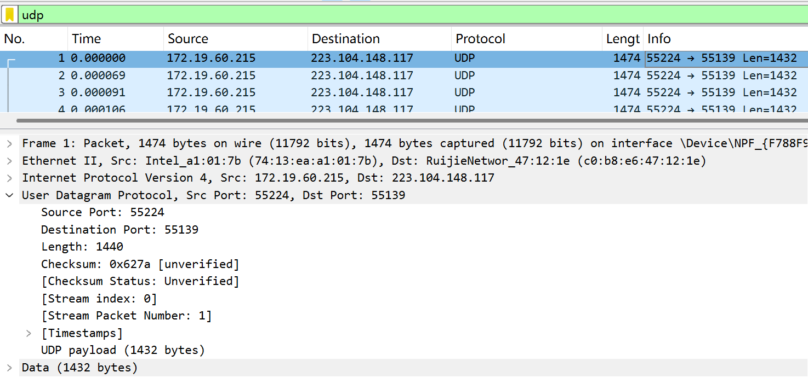
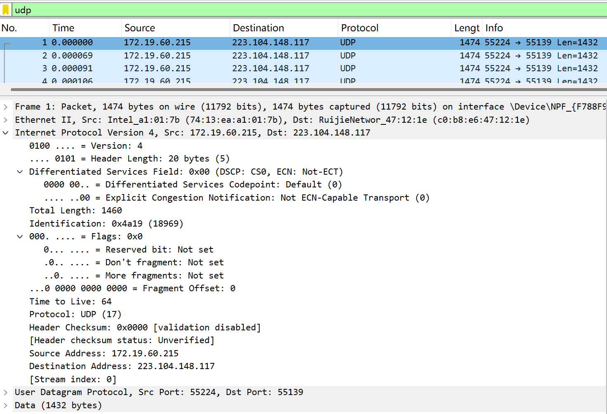
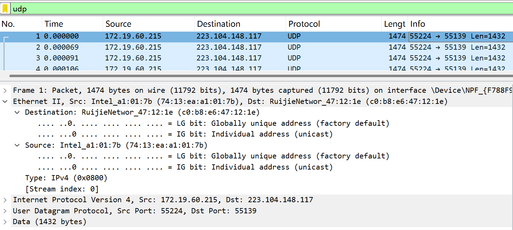
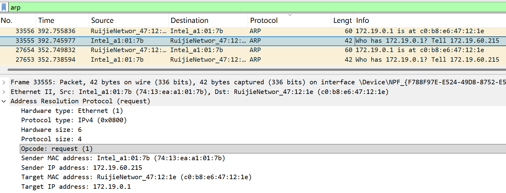
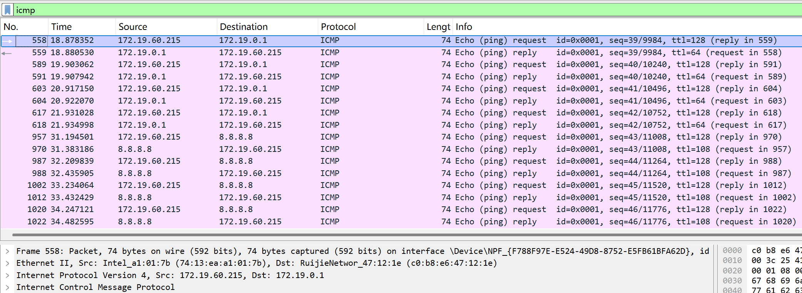

# Lab5：IP 与以太网的包收发操作

## 实验背景

本实验围绕 IP 模块与以太网在包收发过程中的角色展开，重点观察以下内容：

1. 网络包的基本结构：头部（IP 头部 + MAC 头部）与数据
2. IP 头部各字段的含义：版本号、TTL、协议号、发送方/接收方 IP 地址等
3. MAC 头部各字段的含义：接收方/发送方 MAC 地址、以太类型
4. IP 地址与 MAC 地址的区别与协作
5. ARP 协议如何通过 IP 地址查询 MAC 地址
6. 路由表的结构与查询方式
7. UDP 协议与 TCP 协议的区别：无连接、无确认、无重传
8. UDP 头部结构：发送方端口号、接收方端口号、数据长度、校验和
9. ICMP 协议的作用与常见消息类型（Echo、Destination Unreachable 等）

---

## 实验任务

### 任务一：查看路由表、ARP 缓存并启动 Wireshark

**第一步：打开 Wireshark，选择主网络接口，开始抓包**

> **注意**：本次实验必须使用真实网络接口（`en0`/`eth0`/`以太网`），不要选回环接口。回环接口不经过以太网，无法观察到 MAC 头部和 ARP 过程。

选择你的主网络接口，开始抓包。本次实验的大部分任务会共用同一次抓包。

**第二步：查看本机路由表**

```bash
# Linux
route -n
ip route show

# macOS
netstat -rn

# Windows
route print
```

截图并保存为 `route_table.png`。

**第三步：查看本机 ARP 缓存**

```bash
# Linux / macOS / Windows
arp -a
```

截图并保存为 `arp_cache.png`。

**第四步：填写下表**

从路由表和 ARP 缓存的输出中提取信息：

| 项目                         | 你的填写内容 |
| :--------------------------- | :----------- |
| 本机 IP 地址                 |172.19.60.215|
| 本机所在子网                 |172.19.0.0/16|
| 子网掩码                     |255.255.0.0|
| 默认网关 IP                  |172.19.0.1|
| 默认网关 MAC 地址            |c0-b8-e6-47-12-1e|
| 本机网卡 MAC 地址            |74-13-ea-a1-01-7b|

简答题：

1. 路由表的每一行包含哪些关键字段？教材中提到的 `Network Destination`、`Netmask`、`Gateway`、`Interface` 分别对应什么含义？
Windows IPv4 路由表每一行关键字段包含：网络目标 (Network Destination)、网络掩码 (Netmask)、网关 (Gateway)、接口 (Interface)、跃点数 (Metric)。
Network Destination（网络目标）：本条路由对应的目的网络 / 目标 IP 地址。
Netmask（网络掩码）：子网掩码，用于匹配目的 IP 地址，判断目标地址是否属于该路由对应的网段。
Gateway（网关）：当前数据包需要转发的下一跳 IP 地址；若为在链路上，代表目标网段可直连，无需跨网关转发。
Interface（接口）：本机发出该数据包时，所使用的本机网卡 IP 地址。


2. 当目标 IP 地址不在本子网时，包会先发给谁？路由表的哪一列提供了这个信息？
当目标 IP 地址不在本机子网时，数据包会优先发送给默认网关。路由表中 Gateway（网关）列 提供了该下一跳地址信息。


3. 路由表的默认网关（`0.0.0.0`）条目的作用是什么？什么时候会匹配到这一行？
默认网关条目（网络目标0.0.0.0、子网掩码0.0.0.0）作用：路由表所有其他明细路由都无法匹配目标 IP 时的兜底转发规则，将所有无专属路由的外网跨网段流量，统一转发至默认网关，实现访问本网段以外的所有网络。匹配时机：当数据包的目的 IP 地址，无法匹配路由表中其他所有明细路由条目时，就会匹配这条默认网关路由。


4. 教材提到，确定发送方 IP 地址的关键在于"判断应该使用哪块网卡"。结合你查到的本机网卡信息，说明 IP 模块是如何做出这个判断的。
首先 IP 模块根据数据包的目的 IP 地址，遍历本机路由表，匹配对应的路由条目。
匹配到对应路由行后，读取该行的 Interface（接口）字段，该字段记录了本条路由对应的本机网卡 IP 地址，以此确定本次发包要使用的物理网卡。
最终就使用该网卡绑定的 IP 地址，作为数据包的发送方源 IP 地址。结合你的本机信息：访问外网流量匹配0.0.0.0默认路由，该行 Interface 接口为172.19.60.215，对应你的 Intel 无线网卡，因此系统始终使用该网卡、该 IP 作为对外发包的源地址。


---

### 任务二：观察 UDP 头部

只要计算机处于联网状态，Wireshark 中就会持续出现大量 UDP 流量（DNS、mDNS、DHCP、NTP 等），无需手动生成。

**第一步：在 Wireshark 中设置过滤器**

```text
udp
```

**第二步：在包列表中找一个 UDP 包**

随便选一个即可。如果包太多，可以加上源或目的 IP 来缩小范围，例如 `udp && ip.addr == 你的IP`。如果需要 DNS 包，也可以用 `udp.port == 53` 过滤。

> **可选**：如果想明确看到一个完整的请求-响应对，可以在终端中执行 `nslookup example.com`，Wireshark 中就会出现对应的 DNS 请求包。

**第三步：点击选中的 UDP 包，在详情栏展开 `User Datagram Protocol`**

填写下表：

| 项目               | 你的填写内容 |
| :----------------- | :----------- |
| UDP 头部总长度     |8 字节|
| 源端口             |55224|
| 目的端口           |55139|
| 长度（Length）     |1440|
| 校验和（Checksum） |0x627a [unverified]|

简答题：

1. 你观察到的 UDP 头部长度是多少字节？TCP 头部至少 20 字节。UDP 省略了哪些字段？这些字段的缺失带来了什么后果？
本次观察到 UDP 头部长度为8 字节。对比至少 20 字节的 TCP 头部，UDP 省略的字段：序号（序列号）字段、确认号字段、滑动窗口字段、标志位字段、紧急指针字段。
缺失带来的后果：
UDP 无法实现数据包的顺序重组、丢包重传机制，不保障数据可靠交付；
没有窗口流量控制机制，无法根据网络拥堵情况调节发送速率；
没有连接管理相关字段，是无连接协议，无法建立可靠会话、没有三次握手与断开连接的过程；
无法支持数据分段、优先级传输等复杂传输控制功能。


2. UDP 头部中的"长度"字段指的是什么长度？
UDP 头部内的长度（Length） 字段，指代整个 UDP 数据报的总字节长度，包含了UDP 头部本身（固定 8 字节） + UDP 数据载荷（应用层数据） 两部分的总大小。




---

### 任务三：观察 IP 头部字段

点击任务二中的同一个 UDP 包，在详情栏展开 `Internet Protocol Version 4`。

填写下表：

| 字段名称               | 你的填写内容 | 含义说明 |
| :--------------------- | :----------- | :------- |
| Version（版本号）      |4|代表当前使用的是 IPv4 网际协议版本|
| Header Length（头部长度） |20 字节|代表该 IP 数据报的 IP 首部长度为 20 字节，为 IPv4 无额外选项字段时的最小首部长度|
| Time to Live（TTL）    |64|IP 数据包的生存时间，每经过一个路由转发，该数值就会减 1|
| Protocol（协议号）     |17|标识 IP 数据报载荷所封装的上层传输层协议类型|
| Source Address（源 IP） |172.19.60.215|发送该 IP 数据包的主机 IP 地址|
| Destination Address（目的 IP） |223.104.148.117	|该 IP 数据包要送达的目标主机 IP 地址|

简答题：

1. 协议号字段的值是多少？它代表什么协议？如果抓一个 HTTP 请求的包，协议号会变成多少？
本次截图里协议号字段值为17，该数字代表上层封装的是 UDP 用户数据报协议。HTTP 请求基于 TCP 协议传输，TCP 协议对应的 IP 协议号为6，因此 HTTP 请求包的该字段值会变为 6。


2. TTL 字段的作用是什么？如果 TTL 降为 0 会发生什么？
TTL（生存时间）作用：限制 IP 数据包在网络路由转发的最大跳数，防止数据包在网络路由环路中无限循环转发，耗尽网络带宽资源。数据包每经过一台路由器转发，TTL 值就会自动减 1。当 TTL 数值递减为 0 时，路由器会直接丢弃该数据包，同时会向数据包的源主机回送 ICMP 超时差错报文。


3. 有教材提到 IP 地址"实际上并不是分配给计算机的，而是分配给网卡的"。你的本机有几块网卡？每块网卡的 IP 地址分别是什么？（提示：可参考任务一中路由表的 Interface 列，或用 `ip addr`（Linux）/`ifconfig`（macOS）/`ipconfig`（Windows）查看。）
本机一共有4 块网卡（网络接口），各网卡与对应 IP 地址如下：
Microsoft Wi-Fi Direct Virtual Adapter #3 虚拟网卡：无可用公网 / 局域网 IPv4 地址
Microsoft Wi-Fi Direct Virtual Adapter #4 虚拟网卡：无可用公网 / 局域网 IPv4 地址
Intel (R) Wi-Fi 6 AX201 160MHz 物理无线网卡（本机联网主网卡）：172.19.60.215
Software Loopback Interface 1 本地回环虚拟网卡：127.0.0.1


4. IP 头部中的源 IP 地址和目的 IP 地址分别是谁的地址？它们与 MAC 头部中的源/目的 MAC 地址有什么区别？
源 IP 地址：数据包发送端主机的网络层 IP 地址（本次为172.19.60.215）
目的 IP 地址：数据包最终要到达的目标主机的网络层 IP 地址（本次为223.104.148.117）
二者与 MAC 地址的区别：
所属层次不同：IP 地址属于网络层地址，用于跨网段的全球端到端寻址；MAC 地址属于数据链路层（以太网帧头部）地址，仅用于同一个局域网内相邻设备之间的链路寻址。
作用范围不同：IP 地址可以跨越多个路由器、多个网段传输；MAC 地址无法跨网段传输，只在本地局域网内有效。
变化规则不同：数据包跨路由器转发时，源、目的 IP 地址全程保持不变；而每经过一跳路由器，帧头部的源、目的 MAC 地址都会发生更换（更换为当前出 / 入路由器的接口 MAC）。
分配方式不同：IP 地址由网络配置动态 / 静态分配；MAC 地址是网卡出厂固化的物理硬件地址。




---

### 任务四：观察 MAC 头部与以太网帧

点击任务二中的同一个 UDP 包，在详情栏展开 `Ethernet II`。

填写下表：

| 字段名称               | 你的填写内容 | 含义说明 |
| :--------------------- | :----------- | :------- |
| Source（源 MAC）       |74:13:ea:a1:01:7b|发送该以太网帧的本机网卡硬件物理地址|
| Destination（目的 MAC） |c0:b8:e6:47:12:1e|该数据帧下一跳接收设备的硬件物理地址|
| Type（以太类型）       |IPv4 (0x0800)|标识以太网帧载荷部分封装的上层网络层协议类型|

关于 MAC 地址格式，填写下表：

| 项目               | 你的填写内容 |
| :----------------- | :----------- |
| MAC 地址长度       | 48 比特（6 字节） |
| 本机网卡的 MAC 地址 |74:13:ea:a1:01:7b|
| 目的 MAC 地址      |c0:b8:e6:47:12:1e|
| MAC 地址的书写格式 |6 组 16 进制数，每组 2 位，用冒号:分隔（XX:XX:XX:XX:XX:XX）|

简答题：

1. 以太类型字段的值是多少？它代表后面承载的是什么协议的包？
以太类型字段的值为 0x0800，该值代表以太网帧内部承载的上层数据是 IPv4 网络层协议数据包。


2. DNS 服务器的 IP 通常是外网地址。本任务中目的 MAC 地址是 DNS 服务器的 MAC 地址还是你本机网关（路由器）的 MAC 地址？为什么？
本帧的目的 MAC 地址是本机网关（路由器）的 MAC 地址。原因：MAC 地址仅能在同一个局域网内进行链路寻址，无法跨网段传输。本次数据包的目的 IP 是外网组播地址，不属于本机局域网网段，主机无法直接获取外网设备的 MAC 地址。因此所有跨网段发送的数据包，数据帧目的 MAC 都统一填写网关的 MAC 地址，先把数据帧发送给网关路由器，再由路由器转发到外网。


3. IP 地址和 MAC 地址在功能上有什么相似之处？又有什么本质区别？
相似之处
二者都属于网络通信中的设备地址标识，都用于在网络中标识通信的源设备、目的设备，实现数据的寻址传输。
本质区别
所属网络层次不同：MAC 地址属于数据链路层地址；IP 地址属于网络层地址。
作用范围不同：MAC 地址仅在本地局域网内有效，无法跨路由器网段传输；IP 地址是全网端到端寻址，可跨越多个网段、多个路由器实现广域网全局寻址。
地址分配方式不同：MAC 地址是网卡出厂固化在硬件中的唯一物理地址，无法随意修改；IP 地址由网络规划动态 / 静态配置，可灵活修改、分配。
传输过程变化规则不同：数据包跨路由器转发时，源、目的 IP 地址全程保持不变；而每经过一跳路由器，帧的源、目的 MAC 地址都会全部替换为当前链路设备的 MAC 地址。


4. 为什么以太网帧中需要同时有 IP 地址（在 IP 头部中）和 MAC 地址？不能只用其中一种吗？
不能只使用其中任意一种，二者分工完全不同、缺一不可。
寻址分工不可替代；MAC 地址负责局域网内相邻设备之间的链路传输，只解决「当前这一跳链路，数据要发给直连的哪台设备」；IP 地址负责跨网段全网端到端寻址，解决「数据最终要到达互联网里的哪一台目标主机」。
单独只用 MAC 地址的缺陷；MAC 地址没有网段划分，无法实现跨路由器的广域网路由转发，无法在庞大的互联网中定位目标主机，仅能在小局域网内通信。
单独只用 IP 地址的缺陷；底层以太网硬件网络只识别 MAC 物理地址，无法直接识别 IP 地址。没有 MAC 地址，数据无法在局域网的物理链路上完成帧的发送、接收。
二者分层协作：IP 地址确定端到端的终点，MAC 地址完成每一跳链路的本地传输，共同完成完整的网络数据通信。




---

### 任务五：观察 ARP 协议

ARP（Address Resolution Protocol，地址解析协议）用于根据 IP 地址查询 MAC 地址。只要计算机处于联网状态，Wireshark 中通常会持续出现 ARP 包（邻居发现、缓存刷新等），可以直接观察。如果抓包一段时间后仍未看到 ARP 包，再手动触发。

**第一步：在 Wireshark 中设置过滤器**

```text
arp
```

**第二步：在包列表中找 ARP 包**

正常联网的设备每隔几分钟就会自动发送 ARP 请求，等待即可。如果等了一会儿仍没有，可以选择以下任一方式手动触发：

- **方式 A（推荐）**：在终端中执行 `arping`

  ```bash
  # Linux（通常已预装）
  sudo arping -c 3 <网关IP>

  # macOS（如果没有，先执行：brew install arping）
  sudo arping -c 3 <网关IP>

  # Windows（可从 https://github.com/ThomasHabets/arping/releases 下载）
  arping -c 3 <网关IP>
  ```

- **方式 B**：先清除 ARP 缓存，再 ping 同网段地址

  ```bash
  # 清除 ARP 缓存
  # Linux:   sudo ip neigh flush all
  # macOS:   sudo arp -d -a
  # Windows: arp -d *

  # 然后 ping 网关
  ping <网关IP> -c 2
  ```

> **注意**：如果目标是 `127.0.0.1` 或外网地址，ARP 不会出现。回环接口不经过以太网，外网地址的 MAC 地址是路由器的（通常已缓存）。

**第三步：点击 ARP 请求包（Opcode 为 request），展开详情**

**第四步：填写下表**

| 项目                     | 你的填写内容 |
| :----------------------- | :----------- |
| ARP 请求的目的 MAC 地址 |c0:b8:e6:47:12:1e|
| ARP 请求中查询的目标 IP |172.19.0.1|
| ARP 响应中返回的 MAC 地址 |c0:b8:e6:47:12:1e|
| 该 ARP 包是自动出现还是手动触发的 |系统网络运行过程中自动出现|

简答题：

1. ARP 请求的目的 MAC 地址为什么是 `ff:ff:ff:ff:ff:ff`（广播地址）？
主机发送 ARP 请求的核心目的，是通过已知的目标 IP 地址，查询对应的未知 MAC 地址。此时发送方完全不知道目标 IP 对应的设备硬件地址，无法向目标设备发送单播数据帧。因此必须使用以太网广播地址 ff:ff:ff:ff:ff:ff 作为目的 MAC，把 ARP 请求报文发送给局域网内所有在线设备，只有被查询 IP 对应的目标设备会回应 ARP 响应，其余设备直接忽略该请求。


2. 为什么 ARP 缓存中的条目会在几分钟后自动删除？
网络中的设备、链路地址不是永久固定的，设备更换网卡、修改 IP、设备上下线、网络拓扑变动都会导致 IP-MAC 对应关系发生变化。
设置缓存超时自动删除机制，可以动态更新最新的 IP-MAC 映射关系，避免长期保存过时、错误的地址条目。
同时可以节省主机内存资源，清理无用的老旧缓存条目，维持 ARP 缓存表的有效性。


3. 如果 ARP 缓存中的 MAC 地址已经过期（对方 IP 对应的设备已更换），会出现什么问题？如何解决？
出现的问题
主机依然使用缓存中过期错误的 MAC 地址封装数据帧，会导致本该发送给新设备的数据包，全部发送到旧 MAC 对应的设备，造成数据发送失败、网络访问不通、数据包丢失，严重时会引发 IP 地址冲突、网络通信异常。
解决方法
1）等待本机 ARP 缓存条目超时自动过期删除，之后通信时主机会重新发送 ARP 请求，获取最新正确的 IP-MAC 映射关系。
2）手动主动清除本机过期的 ARP 缓存条目（Windows 命令 arp -d *），后续通信时自动重新发起 ARP 请求，重新获取正确的地址映射并更新缓存。




---

### 任务六：使用 `ping` 命令观察 ICMP

有教材提到了 ICMP（Internet Control Message Protocol）协议，它用于在 IP 层传递错误和控制信息。`ping` 命令就是基于 ICMP 的 Echo Request（类型 8）和 Echo Reply（类型 0）实现的。

**第一步：在 Wireshark 中设置 ICMP 过滤器**

```text
icmp
```

**第二步：在终端中执行 ping 命令**

```bash
# ping 本机（回环）
ping 127.0.0.1 -c 4

# ping 局域网内的设备（如路由器网关）
ping <网关IP> -c 4

# ping 外网地址
ping 8.8.8.8 -c 4
```

**第三步：在 Wireshark 中观察 ICMP 包**

填写下表：

| 目标               | 是否收到回复 | 往返时间（ms） | TTL 值 |
| :----------------- | :----------- | :------------- | :----- |
| 127.0.0.1          |是|平均 0ms（单次 < 1ms）|128|
| 局域网设备（网关） |是|平均 4ms（最短 2ms，最长 5ms）|64|
| 8.8.8.8            |是|平均 211ms（最短 188ms，最长 235ms）|108|

> **提示**：ping 回环地址（`127.0.0.1`）时数据不经过物理网卡，Wireshark 在主网络接口上可能无法捕获到包。TTL 值可从终端输出中读取（`ping` 会显示 `ttl=...`），或切换 Wireshark 至回环接口（`lo0` / `lo`）抓包。

简答题：

1. `ping` 命令发送的是什么类型的 ICMP 消息？收到的回复又是什么类型？
ping 命令主动发送的是 ICMP Echo Request（回显请求，类型号 8） 报文；目标主机正常可达时，回复的是 ICMP Echo Reply（回显应答，类型号 0） 报文。


2. 为什么 ping 不同目标的 TTL 值不同？TTL 值反映了什么信息？
原因
TTL（生存时间）的规则：IP 数据包每经过 1 台路由器转发，TTL 数值就会自动减 1。
1）ping 本地回环 127.0.0.1：数据包全程在本机内核内部传输，不经过任何路由器，TTL 无衰减，保持 Windows 默认初始值 128。
2）ping 局域网网关：仅经过本地 1 跳网关链路转发，网关系统回复报文初始 TTL 为 64。
3）ping 外网8.8.8.8：数据包需要跨运营商经过多台外网路由器多次转发，TTL 多次衰减，最终剩余数值为 108。
TTL 用于限制数据包在网络中的最大路由转发跳数，同时可以通过 TTL 剩余值，大致推算数据包往返经过的路由器数量、网络传输距离，还能防止数据包在路由环路中无限循环占用网络资源。


3. 教材表 2.4 中列出了多种 ICMP 消息类型。`Destination unreachable`（类型 3）在什么情况下会出现？请用以下方法尝试触发并观察：

   ```bash
   # 方法一（推荐）：ping 同网段内一个确认不存在的 IP
   # 例如你的本机 IP 是 192.168.1.100，子网掩码 255.255.255.0，
   # 那么可以 ping 192.168.1.250（一个大概率没有被分配的地址）
   ping <同网段不存在的IP> -c 3
   
   # 方法二：向一个关闭的端口发 UDP 包，触发 ICMP Port Unreachable
   # 先在 Wireshark 中保持 icmp 过滤器，然后执行：
   # Linux / macOS
   echo "test" | nc -u -w 1 <同网段某台设备的IP> 19999
   
   # Windows（需安装 nmap：https://nmap.org/download.html）
   nmap -sU -p 19999 <同网段某台设备的IP>
   ```

   观察到类型 3 的包后，记录其 Code 值（子类型）并说明代表什么含义。
出现场景
当目标 IP 地址不存在、主机不可达、网络无法抵达、端口无程序监听，数据包无法正常送达目标时，中间路由器 / 目标主机会向源主机回复该类型差错报文。
本次触发的结果（ping 172.19.99.99 同网段不存在 IP）
本次 ping 同网段不存在主机，触发 ICMP Destination Unreachable 类型 3 报文，对应 Code=2（主机不可达）。
含义：源主机所在局域网内，不存在该 IP 对应的在线主机，数据无法送达目标。




---

## 问答题

1. 网络包由哪几部分构成？IP 头部和 MAC 头部分别的作用是什么？
完整网络帧从外层到内层依次为：以太网 MAC 头部 → IP 头部 → 传输层头部（TCP/UDP） → 应用层数据载荷。
MAC 头部作用
属于数据链路层头部，用于局域网内相邻设备的链路寻址，记录源、目的 MAC 物理地址，完成同一局域网内数据帧的收发、硬件链路传输。
IP 头部作用
属于网络层头部，用于跨网段全网端到端寻址，记录源、目的 IP 地址，规划数据包跨路由器的路由转发路径，实现广域网跨网段数据传输。


2. IP 协议和以太网协议在网络传输中分别承担什么职责？它们是如何分工协作的？
各自职责
1）以太网协议（数据链路层）：负责底层局域网内的数据帧封装、相邻设备间点对点传输，通过 MAC 地址完成本地链路的数据收发，无法跨网段传输。
2）IP 协议（网络层）：负责全网跨网段的路由寻址，规划数据包从源主机到目标主机的完整传输路径，实现广域网端到端的数据可达性。
分工协作
分层解耦协作：IP 协议负责确定数据最终要去往的终点（端到端全局路径），以太网协议负责每一段相邻链路里，数据帧的本地硬件传输。数据包跨路由器转发时，全程源、目的 IP 保持不变；每经过一跳路由器，都会重新封装本链路的以太网 MAC 头部，更换源目的 MAC 地址，由下层以太网完成每一跳传输，上层 IP 锁定全程终点。


3. ARP 协议解决的核心问题是什么？如果不使用 ARP 缓存，网络中会出现什么情况？
核心问题
ARP 地址解析协议，解决通过已知的目标 IP 地址，解析查询出对应的 MAC 物理地址的问题，打通网络层 IP 地址与数据链路层 MAC 地址的映射。
无 ARP 缓存的后果
每一次向外发送数据包前，主机都必须全网广播发送 ARP 请求报文，会大量占用局域网带宽资源，造成网络广播风暴；同时大幅增加数据包传输时延，严重降低网络通信效率。


4. 为什么 IP 和负责传输的网络（如以太网）要分开设计？这种设计带来了什么好处？
分开设计原因
不同底层物理网络（以太网、光纤、无线链路等）的链路层协议、硬件寻址方式完全不同。IP 协议作为统一的网络层标准，与底层传输网络解耦，不绑定特定硬件链路。
设计好处
1）协议通用性极强：一套 IP 网络体系可以适配所有不同类型的底层物理网络，实现异构网络互联互通。
2）分层解耦易扩展：上层 IP 网络、应用协议无需修改，即可兼容新型底层硬件网络；底层链路技术更新，也不会影响上层 IP 整体网络架构。
3）职责清晰，模块化开发维护，各层协议仅负责自身层级功能，互不干扰，降低网络协议整体设计复杂度。


5. 网卡在发送包时会额外添加哪 3 个控制数据？它们各自的作用是什么？
网卡发送以太网帧时，在原始数据外额外添加 3 部分控制字段：
1）帧前导码 + 帧开始定界符：用于接收方网卡时钟同步，对齐帧数据，识别数据帧的起始位置。
2）帧尾 FCS 帧校验序列（CRC 校验）：对整个帧数据做完整性校验，检测传输过程中是否出现比特差错、数据损坏。
3）帧间隔填充字段：保证以太网最小帧长要求，满足底层硬件传输规范。


6. 网卡接收到一个包后，需要经过哪些步骤才能将其交给操作系统？如果 FCS 校验失败会怎样？
接收处理步骤
1）网卡通过帧前导码同步时钟，识别完整数据帧；
2）校验帧尾 FCS 校验序列，验证数据传输完整性；
3）对比帧目的 MAC 地址，确认是否为本网卡接收的帧；
4）校验无误后，剥离以太网 MAC 头部，将内层 IP 数据包提交给操作系统内核网络协议栈。
FCS 校验失败后果
网卡会直接丢弃该损坏数据帧，不会向上提交给操作系统，同时不产生任何差错回复，直接忽略该错误帧。


7. TCP 和 UDP 的核心区别是什么？请从连接管理、可靠性、效率、适用场景四个维度进行比较。
1）连接管理
TCP 是面向连接的协议，数据传输前需要通过三次握手建立连接，通信结束后需要四次挥手断开连接。
UDP 是无连接协议，通信前不需要建立连接，可以随时直接发送数据，没有连接建立与断开的过程。
2）可靠性
TCP 传输可靠，拥有序列号、确认应答、超时重传、流量控制和拥塞控制机制，可以保证数据完整、有序、无丢失地到达。
UDP 传输不可靠，没有重传、确认、排序机制，不保证数据一定送达，也不保证数据顺序。
3）传输效率
TCP 头部至少 20 字节，附加控制机制多，额外开销大，传输速度慢，整体传输效率较低。
UDP 头部固定只有 8 字节，几乎没有额外控制开销，传输速度快，整体传输效率高。
4）适用场景
TCP 适合对数据完整性要求高、不允许出错的场景，比如网页访问、文件下载、邮件传输。
UDP 适合对实时性要求高、可以容忍少量丢包的场景，比如网络直播、视频通话、网络游戏、语音传输。


8. UDP 适用于哪些场景？请结合教材内容解释为什么这些场景适合使用 UDP 而非 TCP。
UDP 适用场景
实时音视频传输（视频通话、网络直播）、在线网络游戏、语音通话、DNS 域名查询、高频小报文实时传输场景。
原因
1）UDP 无连接建立时延、头部开销小、传输速度快，实时性极强，能满足业务低延迟需求；
2）TCP 的重传、拥塞控制机制会产生排队时延、卡顿重传，对于音视频流，旧数据包重传无意义，反而会造成画面声音卡顿延迟；
3）流媒体、游戏业务可容忍少量数据包丢失，无需 TCP 严苛的可靠完整传输，优先保障实时流畅性。


9. 如果一个 IP 包经过多次路由转发后 TTL 降为 0，路由器会如何处理？这与教材中提到的哪种 ICMP 消息有关？
路由器处理操作
路由器检测到数据包 TTL 递减为 0 时，会直接丢弃该 IP 数据包。同时路由器会向该数据包的源主机，发送对应的 ICMP 差错报文。
对应 ICMP 报文
对应 ICMP 超时报文（类型 11，Time Exceeded），用于告知源主机数据包因路由跳数超限、TTL 耗尽被丢弃，常见于路由环路场景。


---

## 截图要求

- 截图须清晰，终端文字和 Wireshark 字段可读。
- 所有截图与本 `Lab5.md` 放在同一目录下。
- 命名规范：

| 截图内容         | 文件名               |
| :--------------- | :------------------- |
| 路由表           | `route_table.png`    |
| ARP 缓存         | `arp_cache.png`      |
| UDP 头部字段     | `udp_header.png`     |
| IP 头部字段      | `ip_header.png`      |
| 以太网帧字段     | `ethernet_frame.png` |
| ARP 请求与响应   | `arp.png`            |
| ICMP ping        | `icmp.png`           |

具体要求：

1. `route_table.png`：终端截图，显示 `route -n`（Linux）、`netstat -rn`（macOS）或 `route print`（Windows）的完整输出。

2. `arp_cache.png`：终端截图，显示 `arp -a` 的完整输出。

3. `udp_header.png`：Wireshark 截图，展开 `User Datagram Protocol`，能看到 Source Port、Destination Port、Length、Checksum。

4. `ip_header.png`：Wireshark 截图，展开 `Internet Protocol Version 4`，能看到 Version、Header Length、TTL、Protocol、Source Address、Destination Address。

5. `ethernet_frame.png`：Wireshark 截图，展开 `Ethernet II`，能看到 Source、Destination、Type。

6. `arp.png`：Wireshark 截图（若能观察到），展开 ARP 包的详情，能看到发送方的 MAC 和 IP、查询的目标 IP。

7. `icmp.png`：Wireshark 截图，能看到 ICMP Echo Request 和 Echo Reply，以及 TTL 字段。

---

## 提交要求

在自己的文件夹下新建 `Lab5/` 目录，提交以下文件：

```text
学号姓名/
└── Lab5/
    ├── Lab5.md
    ├── route_table.png
    ├── arp_cache.png
    ├── udp_header.png
    ├── ip_header.png
    ├── ethernet_frame.png
    ├── arp.png
    └── icmp.png
```

---

## 截止时间

2026-05-07，届时关于 Lab5 的 PR 请求将不会被合并。
