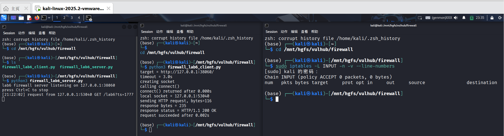
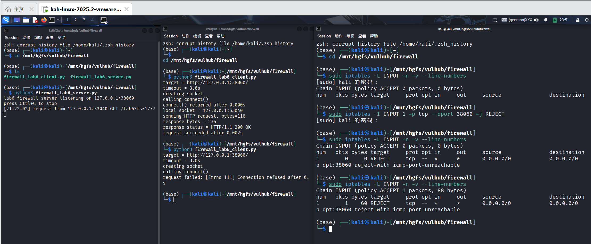
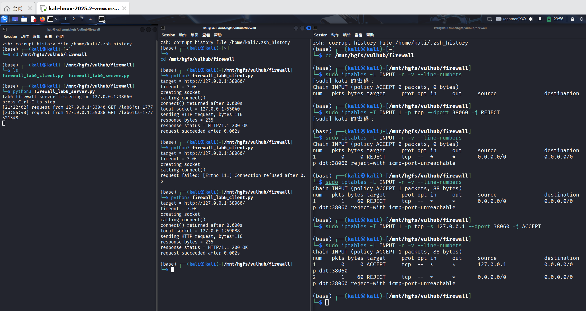
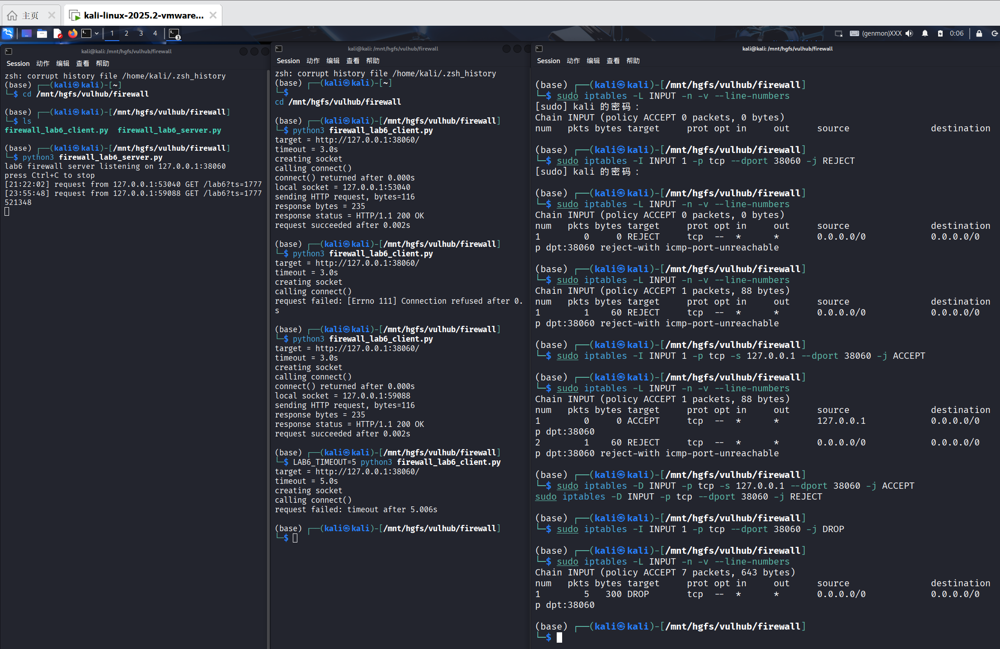
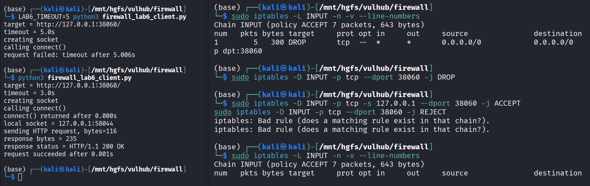

# Lab6：第一次写防火墙规则，做基础包过滤

## 实验背景

前面的实验已经让你看到一次网络通信里的 IP 地址、端口号、协议类型和连接状态。

从本次实验开始，我们正式进入防火墙规则配置。防火墙最基础的能力是**包过滤**：根据数据包里的字段决定放行还是拦截。

本实验重点观察以下内容：

1. 防火墙规则如何匹配协议、源地址和目的端口
2. `INPUT` 链为什么会影响别人访问本机服务
3. `ACCEPT`、`REJECT`、`DROP` 三种动作的现象差异
4. 规则顺序为什么会影响最终访问结果
5. 规则计数器如何帮助判断规则是否被命中
6. 为什么基础包过滤看的是 IP、端口、协议，而不是 HTTP 内容

> **环境说明**：推荐在 Ubuntu 虚拟机、WSL2 或其他 Linux 实验环境中完成。  
> macOS 和 Windows 本机没有相同的 `iptables` 实验环境。  
> 不要在真实服务器或已有安全策略的主机上随意清空防火墙规则。

---

## 实验任务

### 任务一：准备实验环境并完成首次访问

**第一步：准备好三个终端窗口**

整个实验建议同时打开三个终端：

- **终端 A**：运行 `firewall_lab6_server.py`
- **终端 B**：运行 `firewall_lab6_client.py`
- **终端 C**：查看和配置 `iptables` 规则

本实验默认使用端口 `38060`。正常情况下不要修改端口，后面的实验步骤都按默认端口编写。

**正常执行：使用默认端口 `38060`**

终端 A 运行服务端：

```bash
python3 firewall_lab6_server.py
```

终端 B 运行客户端：

```bash
python3 firewall_lab6_client.py
```

**特殊情况：端口 `38060` 被占用**

只有启动服务端时提示端口已被占用，才需要把端口改成其他值。例如改成 `38160` 时，服务端和客户端必须使用同一个端口。

终端 A 运行服务端：

```bash
LAB6_PORT=38160 python3 firewall_lab6_server.py
```

终端 B 运行客户端：

```bash
LAB6_PORT=38160 python3 firewall_lab6_client.py
```

命令说明：

| 部分 | 含义 |
| :--- | :--- |
| `LAB6_PORT=38160` | 只对本次命令临时设置环境变量，把实验端口改成 `38160` |
| `python3` | 使用 Python 3 解释器运行脚本 |
| `firewall_lab6_server.py` | 启动本实验提供的服务端脚本 |
| `firewall_lab6_client.py` | 启动本实验提供的客户端脚本 |

常见可选环境变量。没有端口冲突或特殊测试需求时，不需要使用这些环境变量：

| 环境变量 | 示例 | 作用 |
| :--- | :--- | :--- |
| `LAB6_PORT` | `LAB6_PORT=38160` | 修改服务端和客户端使用的端口 |
| `LAB6_HOST` | `LAB6_HOST=127.0.0.1` | 修改客户端连接目标或服务端监听地址 |
| `LAB6_TIMEOUT` | `LAB6_TIMEOUT=5` | 修改客户端等待超时时间 |

如果你使用了新端口，`iptables` 规则中的 `--dport 38060` 也要改成你的实际端口。

**第二步：在终端 C 查看当前 INPUT 规则**

```bash
sudo iptables -L INPUT -n -v --line-numbers
```

命令说明：

| 部分 | 含义 |
| :--- | :--- |
| `sudo` | 以管理员权限执行命令，查看和修改防火墙规则通常需要管理员权限 |
| `iptables` | Linux 上常用的防火墙规则管理命令 |
| `-L` | list，列出规则 |
| `INPUT` | 查看进入本机的流量对应的规则链 |
| `-n` | numeric，直接显示数字形式的 IP 和端口，不做域名反查，速度更快 |
| `-v` | verbose，显示更详细信息，包括 `pkts`、`bytes` 等计数器 |
| `--line-numbers` | 显示规则行号，便于确认规则顺序或按行号删除规则 |

常见可选参数和链：

| 写法 | 作用 |
| :--- | :--- |
| `iptables -L OUTPUT -n` | 查看本机发出流量的规则 |
| `iptables -L FORWARD -n` | 查看经过本机转发流量的规则，后续网关、DMZ、VPN 会用到 |
| `iptables -S INPUT` | 以更接近命令的格式显示 `INPUT` 链规则 |
| `iptables-save` | 导出当前全部规则，适合做完整备份或排错 |
| `iptables -t nat -L -n` | 查看 `nat` 表规则，后续 NAT 实验会用到 |

记录当前 `INPUT` 链的默认策略和已有规则。默认策略通常会显示在第一行，例如：

```text
Chain INPUT (policy ACCEPT)
```

其中 `policy ACCEPT` 表示：如果没有任何规则匹配，就默认放行。

**第三步：在终端 A 启动服务端**

```bash
python3 firewall_lab6_server.py
```

命令说明：

| 部分 | 含义 |
| :--- | :--- |
| `python3` | 使用 Python 3 运行脚本 |
| `firewall_lab6_server.py` | 本实验的 HTTP 服务端，默认监听 `127.0.0.1:38060` |

如果需要换端口，可以写成：

```bash
LAB6_PORT=38160 python3 firewall_lab6_server.py
```

看到类似输出后不要关闭终端 A：

```text
lab6 firewall server listening on 127.0.0.1:38060
```

**第四步：在终端 B 启动客户端**

```bash
python3 firewall_lab6_client.py
```

命令说明：

| 部分 | 含义 |
| :--- | :--- |
| `python3` | 使用 Python 3 运行脚本 |
| `firewall_lab6_client.py` | 本实验的客户端，默认访问 `127.0.0.1:38060` |

如果需要换目标或超时时间，可以写成：

```bash
LAB6_HOST=127.0.0.1 LAB6_PORT=38160 LAB6_TIMEOUT=5 python3 firewall_lab6_client.py
```

如果访问正常，客户端会显示 `request succeeded`，服务端终端也会打印收到请求的信息。

**第五步：填写下表**

| 项目 | 你的填写内容 |
| :--- | :----------- |
| 服务端监听地址 |127.0.0.1|
| 服务端监听端口 |38060|
| `INPUT` 链默认策略 |ACCEPT|
| 首次访问是否成功 |成功|
| 客户端本地临时端口 |53040|
| 服务端是否收到请求 |是|
| 客户端收到的响应首行 |HTTP/1.1 200 OK|

各项数值均可直接从终端输出读取：服务端监听信息在 `server listening on ...`，客户端本地端口在 `local socket = ...`，响应首行在 `response status = ...`。



---

### 任务二：添加 REJECT 规则并观察访问失败

**第一步：在终端 C 插入一条拒绝规则**

```bash
sudo iptables -I INPUT 1 -p tcp --dport 38060 -j REJECT
```

命令说明：

| 部分 | 含义 |
| :--- | :--- |
| `sudo` | 以管理员权限执行 |
| `iptables` | 修改 Linux 防火墙规则 |
| `-I INPUT 1` | insert，把规则插入到 `INPUT` 链第 1 行 |
| `-p tcp` | protocol，只匹配 TCP 协议 |
| `--dport 38060` | destination port，只匹配目的端口为 `38060` 的 TCP 包 |
| `-j REJECT` | jump，命中规则后执行 `REJECT`，拒绝并给对方返回错误 |

常见可选写法：

| 写法 | 作用 |
| :--- | :--- |
| `-A INPUT ...` | append，把规则追加到链尾；和 `-I` 相比，顺序可能不同 |
| `-s 192.168.1.10` | 只匹配某个源 IP |
| `-s 192.168.1.0/24` | 只匹配某个源网段 |
| `-d 127.0.0.1` | 只匹配某个目的 IP |
| `--sport 12345` | 匹配源端口，通常不如目的端口常用 |
| `-i lo` | 只匹配从指定入接口进入的流量，例如回环接口 `lo` |
| `-j ACCEPT` | 命中后放行 |
| `-j DROP` | 命中后直接丢弃，不回应 |
| `-j LOG` | 命中后写日志，通常还需要后续规则继续处理 |
| `-j REJECT --reject-with tcp-reset` | 对 TCP 连接用 RST 明确拒绝 |

这条规则的含义是：凡是进入本机、协议是 TCP、目的端口是 `38060` 的包，都拒绝。

**第二步：查看规则列表**

```bash
sudo iptables -L INPUT -n -v --line-numbers
```

确认 `REJECT` 规则出现在第 1 行。

**第三步：在终端 B 再次运行客户端**

```bash
python3 firewall_lab6_client.py
```

观察客户端是否很快失败，再观察终端 A 的服务端是否收到新的请求。

**第四步：再次查看规则计数器**

```bash
sudo iptables -L INPUT -n -v --line-numbers
```

如果规则被命中，`pkts` 或 `bytes` 计数一般会增加。

**第五步：填写下表**

| 项目 | 你的填写内容 |
| :--- | :----------- |
| 你添加的 `REJECT` 规则 |sudo iptables -I INPUT 1 -p tcp --dport 38060 -j REJECTREJECT |
| `REJECT` 规则位于第几行 |第 1 行|
| 客户端失败提示 |request failed: [Errno 111] Connection refused|
| 失败大约用了多久 |0.000s|
| 服务端是否收到请求 |否|
| `REJECT` 规则计数器是否增加 |是（pkts 从 0 变成了 1，bytes 从 0 变成了 60）|

简答题：

1. 这条规则主要匹配了哪些字段？
这条 iptables 规则主要匹配了以下字段：
流量进入的链：INPUT 链（进入本机的流量）
协议：-p tcp（仅匹配 TCP 协议数据包）
目的端口：--dport 38060（仅匹配目的端口为 38060 的数据包）
动作：-j REJECT（匹配后执行拒绝动作）


2. 为什么服务端没有收到请求，也能说明防火墙已经在更前面拦截了流量？
服务端运行在用户态的应用层，而 iptables 工作在内核态的网络层 / 传输层。当客户端发起 TCP 连接时，数据包先经过内核的防火墙规则匹配，命中 REJECT 规则后，内核直接回复拒绝报文，根本不会把数据包交给用户态的服务端程序处理。所以服务端收不到请求，说明流量在到达应用层之前就被防火墙拦截了。


3. `REJECT` 和“服务端程序没启动”在客户端现象上可能有什么相似之处？
两者都会导致客户端无法建立 TCP 连接，现象高度相似：
客户端都会收到 Connection refused 类的错误提示（Errno 111）
连接会立刻失败，不需要等待超时区别在于：
服务端没启动时，是操作系统内核（TCP/IP 协议栈）直接回复拒绝；
被 REJECT 规则拦截时，是防火墙规则主动回复拒绝，本质上都是内核级的拒绝响应，客户端无法直接区分两者的来源。




---

### 任务三：添加 ACCEPT 规则并观察规则顺序

现在 `REJECT` 规则已经阻断了访问。接下来在它前面插入一条更具体的允许规则。

**第一步：在终端 C 插入允许规则**

```bash
sudo iptables -I INPUT 1 -p tcp -s 127.0.0.1 --dport 38060 -j ACCEPT
```

命令说明：

| 部分 | 含义 |
| :--- | :--- |
| `-I INPUT 1` | 插入到 `INPUT` 链第 1 行，让这条规则排在原来的 `REJECT` 前面 |
| `-p tcp` | 匹配 TCP 协议 |
| `-s 127.0.0.1` | source，只匹配源地址为 `127.0.0.1` 的流量 |
| `--dport 38060` | 只匹配目的端口为 `38060` 的流量 |
| `-j ACCEPT` | 命中后放行 |

常见可选写法：

| 写法 | 作用 |
| :--- | :--- |
| `-s 10.0.0.0/24` | 允许一个网段 |
| `-s 10.0.0.5` | 只允许一台主机 |
| `-d 10.0.0.10` | 限定目的地址 |
| `-i eth0` | 限定从某个网卡进入 |
| `-m comment --comment "allow lab6"` | 给规则加注释，便于排错和维护 |

这条规则的含义是：允许源地址为 `127.0.0.1`、目的端口为 `38060` 的 TCP 访问。

**第二步：查看规则顺序**

```bash
sudo iptables -L INPUT -n -v --line-numbers
```

此时应该能看到：

```text
1  ACCEPT  tcp  --  127.0.0.1  0.0.0.0/0  tcp dpt:38060
2  REJECT  tcp  --  0.0.0.0/0  0.0.0.0/0  tcp dpt:38060 reject-with ...
```

具体显示格式可能略有不同，但关键是 `ACCEPT` 在 `REJECT` 前面。

**第三步：在终端 B 再次运行客户端**

```bash
python3 firewall_lab6_client.py
```

观察访问是否恢复成功。然后再次查看计数器，判断命中的是哪一条规则。

**第四步：填写下表**

| 项目 | 你的填写内容 |
| :--- | :----------- |
| 你添加的 `ACCEPT` 规则 |sudo iptables -I INPUT 1 -p tcp -s 127.0.0.1 --dport 38060 -j ACCEPT|
| `ACCEPT` 规则位于第几行 |第 1 行|
| `REJECT` 规则位于第几行 |第 2 行|
| 再次访问是否成功 |成功（客户端显示 request succeeded）|
| 命中的是哪一条规则 |第 1 行的 ACCEPT 规则|
| 你判断命中的依据 |客户端访问成功，且 sudo iptables -L INPUT -n -v --line-numbers 显示 ACCEPT 规则的 pkts/bytes 计数增加，而 REJECT 规则的计数没有变化|

简答题：

1. 为什么同样存在 `REJECT` 规则，访问却恢复了？
因为 iptables 规则是按顺序匹配的：数据包会从第 1 条规则开始，逐条向下匹配，一旦命中某条规则，就会执行对应的动作，不再继续匹配后续规则。你把 ACCEPT 规则插入到了第 1 行，客户端的请求数据包（源 IP 为127.0.0.1、目的端口38060）首先命中了这条 ACCEPT 规则，被直接放行，所以后续的 REJECT 规则不会被匹配到，访问自然就恢复了。


2. 为什么防火墙规则顺序会影响最终结果？
防火墙的规则匹配逻辑是顺序执行、匹配即停止的：
数据包会按照规则列表的顺序，从上到下依次匹配；
一旦命中某条规则（比如ACCEPT或REJECT），就会执行该规则定义的动作，不再继续检查后面的规则；
只有当数据包不匹配任何规则时，才会执行链的默认策略（policy）。
因此，更具体、更优先的规则必须放在前面，否则会被后面更宽泛的规则提前拦截，导致预期失效。


3. 如果把 `REJECT` 放在 `ACCEPT` 前面，本次访问会发生什么？
如果把 REJECT 规则放在第 1 行、ACCEPT 放在第 2 行：
客户端的请求数据包会先匹配到第 1 行的 REJECT 规则，被直接拒绝；
后续的 ACCEPT 规则不会被匹配到；
最终结果是客户端依然会收到 Connection refused 错误，访问失败，即使存在允许本地访问的规则也不会生效。




---

### 任务四：对比 DROP 与 REJECT

`REJECT` 会明确拒绝访问，`DROP` 则是直接丢弃包，不给对方回应。下面观察两者在客户端现象上的差异。

**第一步：删除刚才添加的 ACCEPT 和 REJECT 规则**

```bash
sudo iptables -D INPUT -p tcp -s 127.0.0.1 --dport 38060 -j ACCEPT
sudo iptables -D INPUT -p tcp --dport 38060 -j REJECT
```

命令说明：

| 部分 | 含义 |
| :--- | :--- |
| `-D INPUT` | delete，从 `INPUT` 链删除一条规则 |
| 后面的匹配条件 | 必须和要删除的规则一致，否则可能提示规则不存在 |

也可以按行号删除，例如：

```bash
sudo iptables -D INPUT 1
```

按行号删除前一定要先执行 `sudo iptables -L INPUT -n --line-numbers` 确认行号，因为删除一条规则后，后面的行号会立刻变化。

删除后查看确认：

```bash
sudo iptables -L INPUT -n -v --line-numbers
```

**第二步：添加 DROP 规则**

```bash
sudo iptables -I INPUT 1 -p tcp --dport 38060 -j DROP
```

命令说明：

| 部分 | 含义 |
| :--- | :--- |
| `-I INPUT 1` | 插入到 `INPUT` 链第 1 行 |
| `-p tcp --dport 38060` | 匹配访问本机 `38060` 端口的 TCP 流量 |
| `-j DROP` | 命中后直接丢弃，不返回拒绝信息 |

**第三步：用 5 秒超时运行客户端**

```bash
LAB6_TIMEOUT=5 python3 firewall_lab6_client.py
```

命令说明：

| 部分 | 含义 |
| :--- | :--- |
| `LAB6_TIMEOUT=5` | 把客户端等待超时时间设为 5 秒 |
| `python3 firewall_lab6_client.py` | 运行客户端脚本 |

这里设置较短超时，是为了观察 `DROP` 造成的等待现象，同时避免客户端一直卡住。

观察客户端是否等待一段时间后才失败。再观察服务端是否收到请求。

**第四步：查看 DROP 规则计数器**

```bash
sudo iptables -L INPUT -n -v --line-numbers
```

**第五步：填写下表**

| 项目 | 你的填写内容 |
| :--- | :----------- |
| 你添加的 `DROP` 规则 |sudo iptables -I INPUT 1 -p tcp --dport 38060 -j DROP|
| 使用 `REJECT` 时客户端失败现象 |立刻失败，提示 [Errno 111] Connection refused|
| 使用 `DROP` 时客户端失败现象 |等待超时后失败，提示 request failed: timeout after 5.006s|
| `DROP` 是否比 `REJECT` 等待更久 |是|
| 服务端是否收到请求 |否|
| `DROP` 规则计数器是否增加 |是|

简答题：

1. `REJECT` 和 `DROP` 都能阻断访问，为什么客户端看到的现象不同？
两者的核心区别在于内核是否会给客户端返回响应：
REJECT：内核收到请求包后，会主动向客户端返回 ICMP 端口不可达 或 TCP RST 拒绝报文，客户端收到后会立刻知道连接被拒绝，因此会直接抛出 Connection refused 错误，无需等待超时。
DROP：内核收到请求包后，会直接丢弃，不返回任何响应报文。客户端的连接请求会一直处于 “等待响应” 的状态，直到客户端的超时时间到达，才会主动放弃连接，因此会出现长时间等待后才提示超时失败的现象。


2. 如果你是网络管理员，排错时哪一种动作更容易判断问题？为什么？
对管理员来说，REJECT 更容易判断问题。
原因：REJECT 会返回明确的拒绝响应，客户端能立刻知道 “连接被拒绝”，可以快速定位是防火墙规则阻断了流量；而 DROP 只会导致客户端超时，管理员无法直接判断是防火墙丢包、网络链路中断，还是服务端根本没启动，排错难度会大大增加。


3. 如果你是攻击者，`DROP` 可能会让扫描结果变得更不明确，原因是什么？
对攻击者来说，DROP 会让端口扫描结果更模糊，原因如下：
扫描工具（如 nmap）在遇到 REJECT 时，能通过返回的拒绝报文明确判断端口是 “关闭” 的；
遇到 DROP 时，扫描工具无法区分是 “端口被防火墙丢弃” 还是 “网络不通 / 主机不在线”，只能标记为 “filtered（被过滤）” 状态，无法直接确认端口的真实状态，增加了攻击前的信息收集难度。




---

### 任务五：清理规则并恢复访问

实验结束前必须清理本次添加的规则，避免影响后续实验。

**第一步：删除 DROP 规则**

```bash
sudo iptables -D INPUT -p tcp --dport 38060 -j DROP
```

如果你前面某一步失败，导致 `ACCEPT` 或 `REJECT` 规则仍然存在，也一起删除：

```bash
sudo iptables -D INPUT -p tcp -s 127.0.0.1 --dport 38060 -j ACCEPT
sudo iptables -D INPUT -p tcp --dport 38060 -j REJECT
```

如果提示规则不存在，说明对应规则已经被删除，可以继续下一步。

**第二步：查看最终规则**

```bash
sudo iptables -L INPUT -n -v --line-numbers
```

确认本次实验添加的 `ACCEPT`、`REJECT`、`DROP` 规则都已经消失。

**第三步：再次运行客户端验证访问恢复**

```bash
python3 firewall_lab6_client.py
```

**第四步：填写下表**

| 项目 | 你的填写内容 |
| :--- | :----------- |
| 是否已删除 `ACCEPT` 规则 |是|
| 是否已删除 `REJECT` 规则 |是|
| 是否已删除 `DROP` 规则 |是|
| 清理后访问是否恢复成功 |是|
| 最终 `INPUT` 链默认策略 |ACCEPT|



---

## 问答题

1. 本实验中的包过滤规则主要匹配了哪些字段？
主要匹配了以下字段：
协议：-p tcp（仅匹配 TCP 协议数据包）
源 IP 地址：-s 127.0.0.1（部分规则限定了源地址）
目的端口：--dport 38060（所有规则都限定了目的端口）
流量方向：INPUT链（仅匹配进入本机的流量）


2. 为什么说本实验实现的是“包过滤”，而不是“应用层代理”？
包过滤工作在内核态的网络层 / 传输层，只检查 IP、端口、协议等数据包头部信息，不会解析应用层的 HTTP 请求内容，也不会修改或转发完整的应用数据；
应用层代理（如反向代理、WAF）工作在用户态的应用层，会解析 HTTP 协议、读取请求内容，甚至修改请求 / 响应，本实验的 iptables 规则不具备这些能力，因此属于包过滤。


3. `INPUT`、`OUTPUT`、`FORWARD` 分别对应什么方向的流量？
INPUT：匹配进入本机的流量（目标 IP 是本机地址，进程接收的数据包）；
OUTPUT：匹配从本机发出的流量（源 IP 是本机地址，进程发送的数据包）；
FORWARD：匹配经过本机转发的流量（既不是源 IP 也不是目标 IP，本机仅作为网关 / 路由器转发数据包）。


4. 为什么本实验主要操作 `INPUT` 链，而不是 `FORWARD` 链？
本实验中客户端和服务端都运行在同一台 Kali 主机上，访问的是本机的服务端口，流量是 “进入本机” 的数据包，因此属于INPUT链的处理范围；而FORWARD链仅用于转发非本机的流量，本实验中不存在跨主机转发的场景，因此不需要操作FORWARD链。


5. `ACCEPT`、`REJECT`、`DROP` 三种动作的区别是什么？
ACCEPT：直接放行数据包，允许流量继续传输，连接正常建立；
REJECT：拒绝数据包，并向客户端返回明确的拒绝响应（如 ICMP 端口不可达或 TCP RST），客户端会立刻收到错误提示；
DROP：直接丢弃数据包，不返回任何响应，客户端会一直等待直到超时，无法判断是被防火墙拦截还是网络不通。


6. 为什么规则顺序会影响最终结果？
iptables 的规则匹配逻辑是顺序执行、匹配即停止：数据包会从上到下依次匹配规则，一旦命中某条规则，就会执行对应的动作，不再继续检查后续规则。因此更具体、更优先的规则必须放在前面，否则会被后面更宽泛的规则提前拦截，导致预期的规则失效。


7. 规则计数器在排错时有什么用？
规则计数器（pkts/bytes）会记录命中该规则的数据包数量和字节数，作用如下：
验证规则是否被触发：如果计数器增加，说明流量确实匹配了该规则；
定位问题：可以判断流量是被哪条规则拦截 / 放行，快速定位规则顺序或匹配条件的错误；
排查误拦截：如果预期放行的流量计数器没有增加，说明规则匹配条件或顺序存在问题。


8. 真实环境中为什么常常采用“默认拒绝，再按需放行”的策略？
这种策略的核心优势是最小权限原则：
默认拒绝所有流量，只放行业务必需的端口 / IP，能最大程度减少攻击面，避免未授权的访问；
相比 “默认放行，再按需拒绝”，不会出现规则遗漏导致的意外放行，安全性更高；
便于维护和审计，所有允许的流量都必须显式配置规则，便于排查问题。


9. 只靠本实验这种基础包过滤规则，还无法解决哪些更复杂的安全问题？
基础包过滤只能基于 IP / 端口 / 协议过滤，无法解决以下问题：
应用层攻击：如 SQL 注入、XSS、命令注入等，这些攻击的特征在 HTTP 请求内容中，包过滤无法解析；
动态端口 / 协议：如 FTP、RPC 等使用动态端口的协议，无法通过固定端口规则放行；
状态化攻击：如 TCP 会话劫持、SYN Flood 攻击，基础包过滤无法跟踪连接状态；
内容过滤：如 URL 过滤、请求头 / 请求体过滤，需要应用层解析能力；
NAT 与地址伪装：无法实现端口映射、地址转换等功能。


---

## 截图要求

- 截图须清晰，终端文字可读。
- 所有截图与本 `Lab6.md` 放在同一目录下。
- 命名规范如下：

| 截图内容 | 文件名 |
| :------- | :----- |
| 服务端、客户端首次访问成功 | `run.png` |
| `REJECT` 规则阻断访问 | `blocked.png` |
| `ACCEPT` 规则恢复访问，并能看到规则顺序 | `allowed.png` |
| `DROP` 访问超时与规则计数器 | `drop_counter.png` |
| 清理规则后访问恢复 | `cleanup.png` |

具体要求：

1. `run.png`：至少能看到服务端 `server listening on ...`、客户端 `request succeeded`、客户端 `local socket = ...`。
2. `blocked.png`：至少能看到 `REJECT` 规则和客户端失败提示。
3. `allowed.png`：至少能看到 `ACCEPT` 位于 `REJECT` 前面，以及客户端访问恢复成功。
4. `drop_counter.png`：至少能看到 `DROP` 规则、客户端超时失败现象和规则计数器。
5. `cleanup.png`：至少能看到实验规则已删除，并且客户端访问恢复成功。

---

## 提交要求

在自己的文件夹下新建 `Lab6/` 目录，提交以下文件：

```text
学号姓名/
└── Lab6/
    ├── Lab6.md
    ├── run.png
    ├── blocked.png
    ├── allowed.png
    ├── drop_counter.png
    └── cleanup.png
```

---

## 截止时间

2026-05-07，届时关于 `Lab6` 的 PR 将不会被合并。

