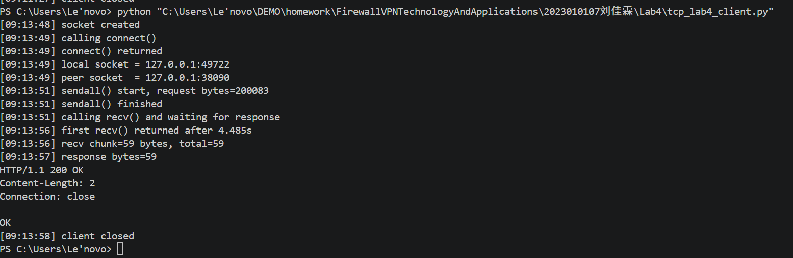
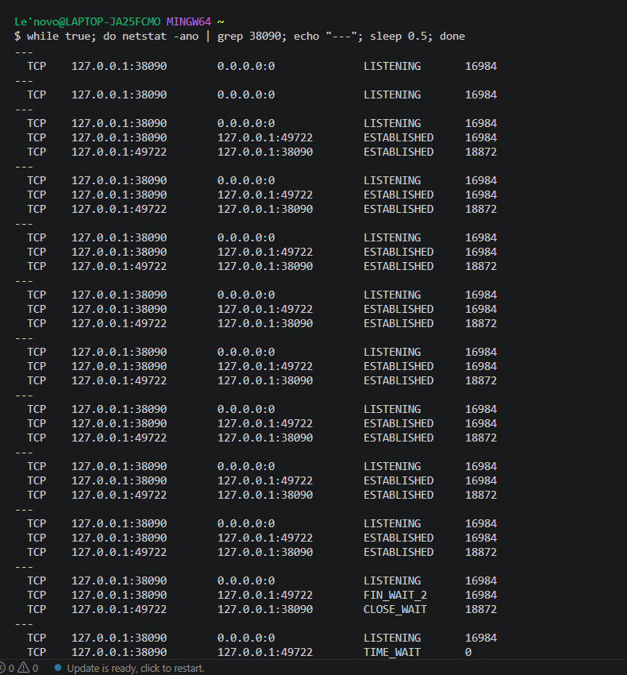
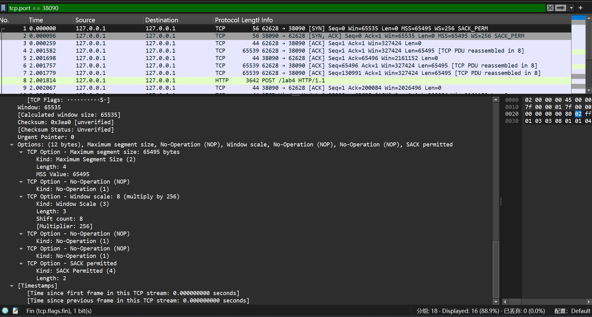
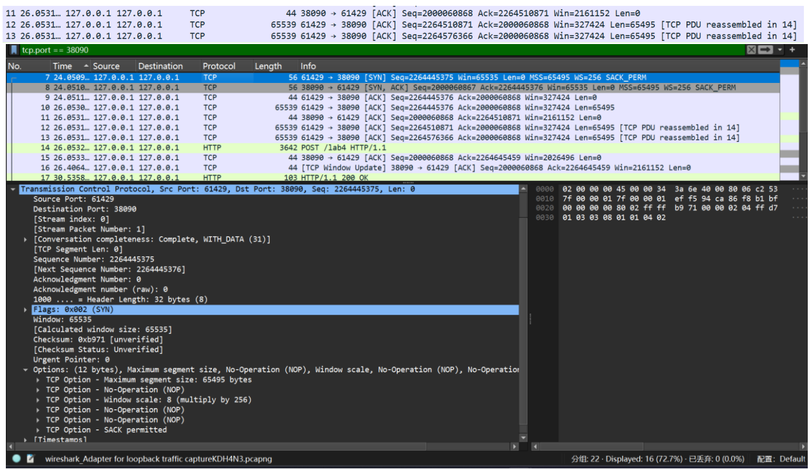
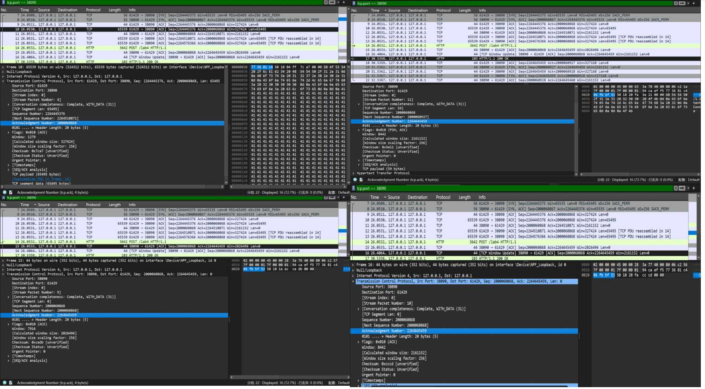
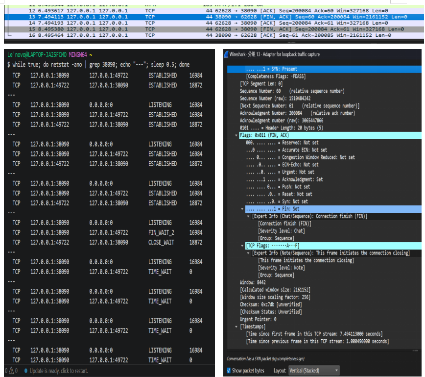

# Lab4：看见TCP 我不怕不怕啦

## 实验背景

本实验围绕一条 TCP 连接的完整生命周期展开，重点观察以下内容：

1. `socket()`、`listen()`、`accept()`、`connect()` 的职责区别
2. "连接"为什么本质上是交换控制信息而不是物理连线
3. TCP 头部中的端口号、序号、ACK 号、标志位、窗口、头部长度、可选字段
4. 三次握手如何建立收发准备
5. 应用层大块数据如何被 TCP 按 MSS 拆分
6. `Sequence Number` 与 `Acknowledgment Number` 如何配合工作
7. `recv()` 为什么会阻塞等待数据
8. 接收窗口如何反映接收方处理能力
9. ACK 与窗口更新为什么常常会被合并
10. `FIN` / `ACK` 如何完成断开
11. 为什么连接结束后套接字不会立刻删除

---

## 实验任务

### 任务一：准备实验环境并记录运行信息

**第一步：准备好四个窗口**

整个实验需要同时观察多个界面，建议在开始前把窗口布局摆好：

- **终端 A**：运行服务端
- **终端 B**：运行客户端
- **终端 C**：持续监控套接字状态（全程保持开启，不要关）
- **Wireshark**：抓包

**第二步：在终端 C 里启动持续监控**

TCP 状态变化很快，等你手动敲完 `ss` 命令再回车，状态可能已经过去了。用下面的命令让终端 C 每 0.5 秒自动刷新一次，之后只需要盯着这个窗口就行：

```bash
# Linux
watch -n 0.5 'ss -tan | grep 38090'

# macOS（没有 watch，用循环代替）
while true; do netstat -an | grep 38090; echo "---"; sleep 0.5; done

# Windows（Git Bash执行）
while true; do netstat -ano | grep 38090; echo "---"; sleep 0.5; done
```

如果你换了端口，把 `38090` 替换成实际端口。

**第三步：打开 Wireshark，选回环接口，填好过滤器，开始抓包**

回环接口在不同系统里名字不同：

| 系统 | 接口名 |
|:-----|:-------|
| Linux | `lo` |
| macOS | `lo0` |
| Windows | `Adapter for loopback traffic capture`（需提前安装 Npcap 并勾选回环支持） |

在显示过滤器里输入：

```text
tcp.port == 38090
```

然后点击开始抓包（蓝色鲨鱼鳍图标）。**先开始抓包，再运行脚本**，否则握手包会被漏掉。

**第四步：启动脚本**

```bash
# 终端 A
python3 tcp_lab4_server.py

# 终端 B（等服务端打印出 server listening on ... 后再运行）
python3 tcp_lab4_client.py
```

如果 `38090` 已被占用，两端都加环境变量换端口，同时记得把 Wireshark 过滤器和终端 C 里的端口号也改掉：

```bash
LAB4_PORT=38123 python3 tcp_lab4_server.py
LAB4_PORT=38123 python3 tcp_lab4_client.py
```

**第五步：填写下表**

| 项目                                | 你的填写内容 |
| :---------------------------------- | :----------- |
| 服务端监听地址                      |127.0.0.1              |
| 服务端监听端口                      |38090              |
| 客户端本地临时端口                  |	49722              |
| 客户端请求总字节数                  |	200083              |
| 服务端响应内容                      |HTTP/1.1 200 OK\nContent-Length: 2\nConnection: close\n\nOK              |
| 客户端 `connect()` 返回前后的时间点 |[09:13:49] calling connect() → [09:13:49] connect() returned              |
| 客户端首次收到响应前等待了多久      |	4.485s              |

各项数值均可直接从终端输出读取：服务端监听信息在 `server listening on ...`，客户端本地端口在 `local socket = ...`，请求字节数在 `sendall() start, request bytes=...`，等待时间在 `first recv() returned after ...s`。



---

### 任务二：观察套接字创建与连接建立

1. 服务端启动后，观察终端 C 出现 `LISTEN` 状态，截图留存。
2. 在终端 B 里启动客户端，观察它依次打印 `socket created`、`calling connect()`、`connect() returned`。
3. 客户端打印 `connect() returned` 之后，观察终端 C 出现 `ESTABLISHED`，截图留存。脚本在 `connect()` 返回后有 2 秒停顿，这段时间足够截图。

填写下表：

| 阶段                             | 你的填写内容 |
| :------------------------------- | :----------- |
| 服务端启动、客户端未连入时的状态 |LISTENING              |
| `connect()` 返回后服务端状态     |ESTABLISHED              |
| `connect()` 返回后客户端状态     |ESTABLISHED              |

简答题：

1. 服务端在客户端连接前为什么处于 `LISTEN`？
答：服务端调用listen()系统调用后，会进入LISTEN监听状态，用于被动等待客户端发起 TCP 连接请求，这是 TCP 服务端的标准工作流程，只有进入该状态才能接收客户端的 SYN 连接请求。


2. 为什么这时还没有真正建立 TCP 连接？
答：LISTEN仅代表服务端准备好接收连接，TCP 连接的建立需要完成三次握手（客户端发 SYN→服务端回 SYN+ACK→客户端回 ACK），仅服务端监听时，三次握手尚未开始，因此连接未真正建立。


3. `socket()` 与 `connect()` 的区别是什么？
答：socket()：仅在本地创建一个 TCP 套接字对象，分配内核资源，不发起任何网络交互，只是创建了一个 “通信端点”。
connect()：主动向服务端发起 TCP 连接请求，触发三次握手流程，阻塞直到握手完成，完成后套接字进入可收发数据的状态。


4. 为什么 `connect()` 返回后才进入可稳定收发数据的状态？
答：connect()会阻塞直到 TCP 三次握手完成，只有握手成功，双方才完成了序号、窗口、MSS 等参数的协商，建立了可靠的双向虚拟链路，此时才能稳定、有序地收发数据。


5. 为什么"网线一直连着"不等于"TCP 连接已经建立"？
答：网线连通是物理层 / 数据链路层的连通性，仅保证物理链路可用；而 TCP 连接是应用层的逻辑连接，需要通过三次握手完成状态同步和参数协商才能建立。物理连通不代表逻辑连接存在，比如网线连着但服务端未启动，就无法建立 TCP 连接。


6. 这里的"连接"更准确地说是在做什么？
答：这里的 “连接” 不是物理连接，而是在客户端和服务端之间，通过三次握手协商 TCP 连接参数（初始序号、窗口大小、MSS 等），同步双方的 TCP 状态，建立一个双向、可靠、有序的虚拟通信链路，用于后续数据的可靠传输。




---

### 任务三：观察三次握手与 TCP 头部字段

**定位握手包**：在 Wireshark 过滤器里输入下面的条件，可以屏蔽中间的数据包，只留下握手和断开阶段的控制包：

```text
tcp.port == 38090 && (tcp.flags.syn == 1 || tcp.flags.fin == 1)
```

包列表最前面的三个包就是三次握手（SYN → SYN-ACK → ACK）。

**找到各字段的位置**：点击某个握手包，在下方详情栏展开 `Transmission Control Protocol`。源端口、目的端口、Seq、Ack、Flags、Window、Header Length 都在这里。TCP 选项在最底部的 `Options` 子项里，展开后可以看到 MSS、Window Scale、SACK Permitted，注意这三项只出现在带 SYN 标志的包里，纯 ACK 包里没有。

**关于序号显示**：Wireshark 默认开启相对序号，会把每个方向的初始序号归零显示，所以 SYN 包的 Seq 看起来是 `0`，而不是真实的随机大数。这是正常现象，实验报告按 Wireshark 显示的值填写即可。如果你想看真实值，可以去 `Edit → Preferences → Protocols → TCP` 里取消勾选 `Relative sequence numbers`。

填写下表：

| 报文       | 源端口 | 目的端口 | Seq  | Ack  | Flags | Window | Header Length |
| :--------- | :----- | :------- | :--- | :--- | :---- | :----- | :------------ |
| 第一次握手 |62628        |38090          |0      |0      |SYN       |65535        |56字节               |
| 第二次握手 |38090        |62628          |0      |1      |SYN, ACK       |65535        |56字节               |
| 第三次握手 |62628        |38090          |1      |1      |ACK       |327424        |40字节               |

第一次握手（SYN）的 Ack 字段在 Wireshark 里通常显示为空或 `0`，这是正常的，因为此时客户端还没有收到服务端的任何数据。Header Length 在没有选项时是 20 字节，握手包因为携带了 MSS 等选项通常是 28 或 32 字节。

| TCP 选项       | 你的填写内容 |
| :------------- | :----------- |
| MSS            |65495              |
| Window Scale   |8 (multiply by 256)              |
| SACK Permitted |开启 Kind:SACK Permitted (4)                 Length:2              |

回环接口的 MSS 通常是 65495（因为回环 MTU 是 65536，比以太网的 1500 大得多），这会影响后续任务五里是否能观察到分段。

简答题：

1. 发送方和接收方端口号在连接阶段的作用是什么？
答：端口号用于标识主机上的不同应用进程，是 TCP 实现多路复用的关键标识。连接阶段通过端口号确定通信的端点，让操作系统能将收到的 TCP 报文准确交付给对应的进程。


2. TCP 头部如何帮助找到目标套接字？
答：TCP 头部使用 源 IP、源端口、目的 IP、目的端口 构成唯一的四元组，操作系统通过这四元组匹配到对应的套接字，从而将报文准确交付给本地的应用进程。


3. 为什么初始序号不是简单固定从 1 开始？
答：固定初始序号会存在严重的安全与可靠性问题：
（1）易遭受 重放攻击，攻击者可利用旧连接的序号干扰新连接；
（2）固定 ISN 会被预测，导致连接欺骗；
（3）TCP 使用随机初始序号（ISN），可避免旧报文误匹配到新连接，提高安全性。


4. 为什么 TCP 可选字段更容易在连接阶段看到？
答：TCP 选项（如 MSS、Window Scale、SACK）仅在 三次握手的 SYN 包 中进行双方协商。后续数据传输的 ACK 包通常不携带这些选项，因此这些选项只在连接建立阶段可见。




---

### 任务四：区分头部中的控制信息和套接字中的控制信息

用以下过滤器分别找到两类报文：

```text
# 纯控制报文（无应用数据）
tcp.port == 38090 && tcp.len == 0

# 携带应用数据的报文
tcp.port == 38090 && tcp.len > 0
```

从纯控制报文里选一个（SYN、纯 ACK 或 FIN-ACK 都可以），从数据报文里选一个（客户端发请求或服务端发响应的包）。

填写下表：

| 项目                   | 你的填写内容 |
| :--------------------- | :----------- |
| 纯控制报文的类型       |纯 ACK 确认报文（无应用数据，tcp.len=0）              |
| 携带应用数据的报文类型 |客户端 HTTP POST 请求报文（tcp.len>0，携带 200000 字节请求体）              |
| 头部中的控制信息举例   |序号 (Sequence Number)、确认号 (Acknowledgment Number)、ACK 标志位、窗口大小 (Window Size)、校验和 (Checksum)              |
| 套接字中的控制信息举例 |源 IP:127.0.0.1、源端口：49722、目的 IP:127.0.0.1、目的端口：38090、连接状态：ESTABLISHED              |

简答题：

1. 为什么"头部中的控制信息"和"套接字中的控制信息"不是同一件事？


---

### 任务五：观察数据分段、序号与 ACK

客户端发送的请求体是 200000 字节，超过了回环接口 MSS（约 65495 字节），因此应该可以在 Wireshark 里看到多个连续的数据段。用下面的过滤器找到客户端发出的数据包：

```text
tcp.srcport != 38090 && tcp.port == 38090 && tcp.len > 0
```

在包列表里连续选几个数据段，对比它们的 Seq 值。相邻两段的关系是：后一段的 Seq = 前一段的 Seq + 前一段的 TCP Segment Len。

找服务端返回给客户端的纯 ACK 报文：

```text
tcp.srcport == 38090 && tcp.flags.ack == 1 && tcp.len == 0
```

填写下表：

| 数据段  | Seq  | Ack  | TCP Segment Len | Flags |
| :------ | :--- | :--- | :-------------- | :---- |
| 第 1 段 |226445376      |2000060868      |65495                 |ACK, PSH       |
| 第 2 段 |2264510871      |2000060868      |65495                 |ACK, PSH       |
| 第 3 段 |2264576366      |2000060868      |65495                 |ACK, PSH       |

| ACK 报文 | Ack Number | Flags | Window |
| :------- | :--------- | :---- | :----- |
| 第 1 个  |226445376            |ACK       |1279（计算后327424）        |
| 第 2 个  |2264645459            |ACK       |7916（计算后2026496）        |
| 第 3 个  |2264645459            |ACK       |8442（计算后2161152，含[TCP Window Update]）        |

| 项目                         | 你的填写内容 |
| :--------------------------- | :----------- |
| 是否发生分段                 |是（客户端发送的 200000 字节请求体 > 协商的 MSS=65495 字节，TCP 自动分段）              |
| 握手中观察到的 MSS           |65495 字节（三次握手 SYN/SYN-ACK 报文的 TCP 选项中协商）              |
| 单段长度与 MSS 的关系        |单段最大长度等于 MSS（65495 字节），最后一段长度≤MSS，分段严格遵循协商的 MSS 值              |
| ACK 号大致确认到了第几个字节 |ACK 号为2264645459，表示已确认到序号小于该值的所有字节，对应客户端发送的全部 200000 字节数据              |

简答题：

1. 应用程序是否直接决定每个网络包的数据长度？为什么？
答：不能。应用程序仅通过sendall()发送完整的 200000 字节数据，TCP 协议会自动根据协商的 MSS（65495 字节）将数据拆分为多个分段，每个分段的长度由 TCP 控制，应用程序无法直接干预单个网络包的长度。


2. 大块应用数据为什么会被拆分？
答：
(1)受限于MSS（最大分段大小）：TCP 规定单个分段的最大数据长度不能超过三次握手协商的 MSS（本实验为 65495 字节），超过则必须分段。
(2)受限于MTU（最大传输单元）：链路层帧的最大长度限制，TCP 分段 + IP 头部总长度不能超过 MTU，否则会被 IP 层分片（TCP 分段是传输层行为，IP 分片是网络层行为）。
(3)保障可靠传输：分段后可逐段确认、重传，避免单个大包丢失导致全部数据重传，提升传输可靠性。


3. `MSS` 与 `MTU` 的关系是什么？
答：MTU（Maximum Transmission Unit）：链路层最大传输单元，指单个数据帧的最大长度（以太网默认 1500 字节，回环接口无链路层限制，因此本实验 MSS 为 65495 字节）。
MSS（Maximum Segment Size）：TCP 最大分段大小，指 TCP 分段中数据部分的最大长度。
关系公式：MSS = MTU - IP头部长度(20字节) - TCP头部长度(20字节)
以太网中：MSS = 1500 - 20 - 20 = 1460字节，本实验回环接口 MTU 更大，因此 MSS 为 65495 字节。


4. "一次 `sendall()`"与"一个 TCP 包"之间是什么关系？
答：
(1)一次sendall()是应用层的一次数据发送操作，本实验中发送了 200000 字节的完整请求体。
(2)一个 TCP 包是传输层的一个分段，承载部分应用数据，本实验中每个分段长度为 65495 字节。
(3)关系：一次sendall()对应多个 TCP 包，TCP 会自动将超过 MSS 的大块数据拆分为符合 MSS 的多个分段发送，应用层感知不到分段过程。


5. 为什么 ACK 体现的是累计确认？
答：TCP 的 ACK 号Acknowledgment Number表示 **「期望收到的下一个字节的序号」，意味着序号小于该值的所有字节都已成功接收 **。本实验中 ACK 号从226445376递增到2264645459，表示服务端已确认序号小于该值的所有字节，即使中间有多个分段，也只需要一个 ACK 确认全部已接收数据，因此是累计确认。


6. 如果中间某一段丢失，ACK 会出现什么变化？
答：若中间某一段丢失，服务端会持续返回以丢失段的起始序号为 ACK 号的重复 ACK，不会确认丢失段之后的数据。
客户端收到 3 个重复 ACK 后，会触发快速重传，立即重传丢失的分段，直到服务端确认该分段后，才会继续确认后续数据。





---

### 任务六：观察 `recv()` 阻塞与窗口字段

`recv()` 的等待时间直接从客户端终端读取，`calling recv() and waiting for response` 到 `first recv() returned after ...s` 之间就是等待时长，脚本已经帮你计算好了。

在 Wireshark 里找窗口值：用过滤器 `tcp.port == 38090 && tcp.flags.ack == 1` 列出所有 ACK 包，点击其中一个，在详情栏 `Transmission Control Protocol` 里找 `Window` 字段。如果同时显示了 `Calculated window size`，优先看这个值，它已经把 Window Scale 的缩放算进去了，是对方实际能接收的字节数。

如果包列表的 Info 列出现了 `[TCP Window Update]` 标注，说明这个包的主要目的是通知对方窗口变化，重点观察它的 `Window` 字段。

填写下表：

| 项目                                   | 你的填写内容 |
| :------------------------------------- | :----------- |
| 客户端开始调用 `recv()` 的时间         |09:13:51              |
| 客户端第一次收到响应的时间             |	09:13:56              |
| `recv()` 是否立刻返回                  |否（调用后阻塞等待了 4.485 秒才收到响应）              |
| 首次收到响应前等待了多久               |4.485 秒（calling recv()到first recv() returned的时间差）              |
| `recv()` 等待期间连接是否已经建立      |是（connect()在09:13:49已返回，连接建立完成后才调用recv()）              |
| 第 1 个 ACK 报文的窗口值               |327424 字节（Calculated window size，原始值 1279，缩放因子 256）              |
| 第 2 个 ACK 报文的窗口值               |2026496 字节（Calculated window size，原始值 7916，缩放因子 256）              |
| 第 3 个 ACK 报文的窗口值               |2161152 字节（Calculated window size，原始值 8442，缩放因子 256，含[TCP Window Update]）              |
| 窗口值是否变化                         |是              |
| 若变化，变化趋势                       |持续增大（从 327424 → 2026496 → 2161152，服务端接收窗口逐步扩大）              |
| ACK 与窗口更新是否可以出现在同一个包中 |是（第 3 个 ACK 报文同时携带了 ACK 确认和[TCP Window Update]）              |
| 是否看到 RTT 或 ACK 往返时间相关信息   |是（Wireshark 的[SEQ/ACK analysis]字段显示 RTT 往返时间）              |

简答题：

1. "连接建立"和"应用收到数据"之间是什么关系？
答：连接建立是应用收到数据的前提条件。TCP 必须先通过三次握手完成连接建立（connect()返回），才能进行后续的数据传输；应用层只有在连接建立完成后，才能通过recv()接收对端发送的应用数据。本实验中，connect()在09:13:49返回，recv()在09:13:51调用，连接建立完成后才进入阻塞等待。


2. 为什么说 `read` / `recv` 在数据未到达时会被挂起？
答：recv()是阻塞式系统调用：当应用进程调用recv()时，如果内核的 TCP 接收缓冲区中没有可读取的应用数据，进程会被操作系统挂起（进入阻塞状态），直到有数据到达缓冲区、被唤醒后才会返回。本实验中recv()等待了 4.485 秒才返回，就是因为服务端响应数据未及时到达，进程被挂起等待。


3. 窗口字段反映了接收方哪方面的能力？
答：窗口字段（Window/Calculated window size）反映了接收方的接收缓冲区剩余容量，即接收方当前能够接收的最大字节数，用于实现 TCP 的流量控制：发送方必须严格按照接收方通告的窗口大小发送数据，不能超过窗口限制，避免接收方缓冲区溢出、数据丢失。


4. 为什么发送方不能无限制连续发送数据？
答：发送方的发送速率受接收方通告的窗口大小限制：TCP 的滑动窗口机制要求发送方只能发送窗口内未被确认的数据，不能超过接收方的窗口上限。如果无限制发送，会导致接收方接收缓冲区溢出、数据丢失，同时引发网络拥塞。本实验中服务端窗口从 327424 逐步增大，发送方按窗口大小分段发送 200000 字节数据，验证了这一限制。


5. 滑动窗口为什么既提高效率又避免压垮接收方？
答：
(1)提高效率：滑动窗口允许发送方在收到 ACK 前连续发送多个分段（窗口内的数据），无需每发一个包就等待 ACK，大幅提升了传输效率，避免了停等协议的低吞吐量问题。
(2)避免压垮接收方：窗口大小由接收方动态通告，发送方必须严格遵守窗口限制，不会发送超过接收方处理能力的数据，避免接收方缓冲区溢出、数据丢失，实现了端到端的流量控制。本实验中服务端窗口动态调整，发送方按窗口大小发送数据，既保证了传输效率，又避免了接收方过载。


---

### 任务七：观察响应返回与双向 `seq/ack`

TCP 的 Seq/Ack 是双向独立的，客户端有自己的发送序号，服务端有自己的发送序号。用下面的过滤器只看服务端发出的数据包（源端口是 38090，有应用数据）：

```text
tcp.srcport == 38090 && tcp.len > 0
```

紧跟在服务端数据包后面的、客户端发出的 ACK 包，其 Ack Number 确认的就是服务端的发送序号。

填写下表：

| 项目                     | 你的填写内容 |
| :----------------------- | :----------- |
| 服务端响应数据报文的 Seq |2000060868（服务端的发送序号，对应 HTTP 响应报文的起始序号）              |
| 服务端响应数据报文的 Ack |2264645459（服务端对客户端发送数据的确认号，确认客户端已发送的全部数据）              |
| 客户端确认报文的 Ack     |2000060927（客户端对服务端响应数据的确认号，=服务端Seq + 服务端数据长度(59)，验证累计确认）              |

简答题：

1. 为什么 TCP 的 `seq/ack` 是双向分别计算的？
答：TCP 是全双工通信协议，客户端和服务端是两个完全独立的发送 / 接收实体，各自维护独立的序号空间：
(1)客户端的Seq用于标记自己发送的 200000 字节请求数据，Ack用于确认服务端发送的 HTTP 响应数据；
(2)服务端的Seq用于标记自己发送的 HTTP 响应数据（本实验为2000060868），Ack用于确认客户端发送的请求数据（本实验为2264645459）；
(3)两个方向的序号完全独立、互不干扰，分别保障两个方向数据的可靠、有序传输。


2. 为什么双方都需要各自的初始序号？
答：
(1)隔离历史连接：双方各自生成随机初始序号（ISN），可以区分当前连接的报文和历史连接的延迟报文，避免旧连接的报文被错误地当作新连接的数据，保障连接的唯一性。
(2)保障双向可靠传输：初始序号是各自发送序号空间的起点，用于标记数据的发送顺序，实现双向数据的按序到达、可靠确认。
(3)防止序号冲突：双向独立的 ISN 避免了两个方向的序号空间重叠，确保每个方向的序号都能唯一标识自己发送的字节。


3. 为什么发送应用数据时报文通常仍然带 `ACK`？
答：这是 TCP 的 ** 捎带确认（Delayed ACK）** 优化机制：当接收方收到对方数据后，需要发送 ACK 确认；如果此时接收方恰好有应用数据要发送，就会将 ACK捎带在数据报文中，无需单独发送纯 ACK 报文，大幅减少了网络中的报文数量，提升传输效率。
本实验中，服务端发送 HTTP 响应（应用数据）的第 17 号报文，同时携带了对客户端请求数据的 ACK（Ack=2264645459），就是典型的捎带确认，完美验证了这一机制。


---

### 任务八：观察连接断开与套接字延迟删除

用下面的过滤器精确定位所有带 FIN 的包：

```text
tcp.port == 38090 && tcp.flags.fin == 1
```

通常会看到两个 FIN 包（双方各一个）。看第一个 FIN 包的源端口，就能判断谁先发起断开。

**关于 TIME-WAIT**：TIME-WAIT 只出现在主动发起关闭的一方（先发 FIN 的那端）。服务端脚本在 `conn.close()` 之后会继续运行 10 秒再退出，这段时间可以在终端 C 里观察 TIME-WAIT。Linux 上 TIME-WAIT 通常持续约 60 秒，macOS 上可能较短，如果没有观察到请如实说明。

填写下表：

| 项目                                    | 你的填写内容 |
| :-------------------------------------- | :----------- |
| 谁先发送 FIN                            |服务端（源端口 38090）              |
| 关闭阶段共观察到几个带 FIN 的报文       |2 个              |
| 最终 ACK 是否可见                       |可见              |
| 关闭后是否观察到 `TIME-WAIT` 或等价现象 |是，观察到 TIME-WAIT 状态              |

简答题：

1. 为什么关闭连接不能只发一个结束通知？
答：TCP 是全双工通信，连接是双向独立的。仅发一个 FIN 只能关闭一个方向的发送，无法保证双方都完成数据传输。必须通过四次挥手（双方各发一个 FIN+ACK），才能双向关闭连接，确保数据不丢失、状态同步。


2. 为什么连接结束后套接字不会立刻删除？
答：为了进入TIME-WAIT 状态，等待 2MSL（最长报文寿命）：
（1）确保最后一个 ACK 报文被对方收到，避免对方重传 FIN
（2）防止旧连接的延迟报文干扰新的连接
（3）保证连接可靠关闭，彻底清理网络中的旧报文


3. 如果最后一个 ACK 丢失，而旧套接字已经立刻删除，可能带来什么问题？
答：（1）对方会持续重传 FIN 报文，认为连接未正常关闭
（2）新连接可能复用相同端口，旧的重传 FIN 会误送到新连接，导致新连接异常中断
（3）破坏 TCP 的可靠性，造成数据混乱、连接崩溃




---

## 问答题

1. TCP 的"连接"到底意味着什么？它为什么不是"把网线连上"？
答：TCP 的 “连接” 是应用层的逻辑虚拟连接，不是物理层的网线连通。
它的本质是：客户端和服务端通过三次握手，同步双方的初始序号、窗口大小、MSS 等参数，建立一个双向、可靠、有序的通信链路，让双方能稳定收发数据。
网线连通只是物理层 / 数据链路层的硬件连通，仅保证物理链路可用；而 TCP 连接需要通过三次握手完成状态同步，物理连通不代表逻辑连接存在（比如网线连着但服务端未启动，就无法建立 TCP 连接）。


2. 三次握手为什么能让双方进入可通信状态？
答：三次握手的核心作用是双向确认、同步参数、确保双方收发正常：
第一次握手（客户端发 SYN）：客户端告知服务端 “我要发起连接，我的初始序号是 ISN_C”，证明客户端的发送能力正常。
第二次握手（服务端发 SYN+ACK）：服务端确认收到客户端的 SYN，同时告知客户端 “我的初始序号是 ISN_S”，证明服务端的发送、接收能力都正常。
第三次握手（客户端发 ACK）：客户端确认收到服务端的 SYN+ACK，证明客户端的接收能力正常。
三次握手完成后，双方都确认了对方的收发能力，同步了序号、窗口等参数，因此进入可稳定收发数据的状态。


3. TCP 头部中的控制字段如何支撑收发数据？
答：TCP 头部的控制字段是支撑可靠传输、流量控制与连接管理的核心机制，分别从有序性、确认机制、状态管理与速率控制四个维度，保障数据收发的全流程：
（1）序号（Seq）与确认号（Ack）：Seq 为每字节数据编号，保证数据包的有序性；Ack 告知发送方已接收数据的字节数，实现可靠确认，两者协同确保数据不丢失、不乱序。
（2）控制标志位（SYN/ACK/FIN/RST）：SYN 与 ACK 协同完成三次握手，建立连接；FIN 用于双向关闭连接；RST 处理异常终止，管理连接的完整生命周期，保障连接的建立与关闭都规范可控。
（3）窗口（Window）：标识接收方当前缓冲区剩余空间，发送方据此调整发送速率，实现流量控制—— 缓冲区满时缩小窗口甚至进入零窗口，恢复后再更新窗口，避免缓冲区溢出。
（4）校验和（Checksum）：验证数据段的完整性，检测传输中的错误，确保接收的数据是准确无误的。
综上，TCP 头部控制字段通过序号 / 确认号保障可靠有序、标志位管理连接状态、窗口实现流量控制、校验和保证数据完整，全方位支撑了通信双方的高效、准确收发。


4. ACK、窗口、等待时间为什么会共同影响 TCP 的可靠传输？
答：三者从不同维度保障了 TCP 的可靠性，缺一不可：
(1)ACK（确认号）：是可靠传输的核心，通过确认已收到的数据，让发送方知道哪些数据被成功接收，哪些需要重传，避免丢包。
(2)窗口 (Window)：用于流量控制，接收方通过窗口大小告知发送方自己的接收能力，避免发送方发送过快导致接收方缓冲区溢出、数据丢失。
(3)等待时间（超时重传时间 RTO）：发送方在发送数据后启动计时器，若超时未收到 ACK，则重传数据，应对网络延迟、丢包等问题，确保数据最终被送达。
三者协同：ACK 确认接收、窗口控制发送速率、等待时间保障丢包重传，共同实现了 TCP 的可靠传输。


5. 断开连接为什么仍然需要严格的控制信息交换？
答：TCP 是全双工通信，连接是双向独立的，断开连接需要通过四次挥手完成严格的控制信息交换：
（1）双方需要各自发送 FIN 报文，关闭自己的发送方向，确保双方都完成了数据传输，避免数据丢失。
（2）需要通过 ACK 报文确认对方的 FIN，确保双方都收到了关闭通知，同步关闭状态。
（3）主动关闭方需要进入 TIME-WAIT 状态，等待 2MSL 时间，确保最后一个 ACK 被对方收到，同时避免旧连接的延迟报文干扰新连接。
如果没有严格的控制信息交换，会导致数据丢失、连接状态不一致、旧报文干扰新连接等问题，破坏 TCP 的可靠性。


6. 如果服务端根本没有启动，客户端调用 `connect()` 时会看到什么现象？
答：客户端调用connect()时，会向服务端发送 SYN 报文，发起三次握手：
(1)由于服务端未启动，没有进程监听对应端口，服务端会回复RST（复位）报文，拒绝连接。
(2)客户端收到 RST 后，connect()会立即报错，返回Connection refused（连接被拒绝），无法建立 TCP 连接，后续无法收发数据。
(3)从终端日志看，客户端会打印connect() failed或类似错误，不会进入connect() returned的成功状态。


7. 如果中途人为制造丢包，ACK、重传、窗口之间会出现什么变化？
答：人为制造丢包后，三者会产生连锁反应，保障数据可靠传输：
(1)ACK 变化：接收方收到乱序 / 丢包后，会重复发送重复 ACK（DupACK），告知发送方 “我收到了多少字节，后面的包丢了”。
(2)重传变化：发送方收到重复 ACK，或超时未收到 ACK 后，会触发快速重传 / 超时重传，重新发送丢失的数据包。
(3)窗口变化：接收方如果因为丢包导致缓冲区积压，会缩小窗口大小，告知发送方 “我处理不过来了，慢点发”，甚至出现零窗口，暂停发送；丢包恢复后，窗口会逐渐恢复。
三者协同：重复 ACK 触发快速重传，窗口控制发送速率，最终实现丢包恢复，保障数据完整。


8. 如果把客户端发送的数据改得更大，窗口字段和分段情况会如何变化？
答：分段情况：TCP 会根据 **MSS（最大分段大小）** 对大数据进行分段。如果数据大小超过 MSS，会被分成多个 TCP 分段发送；回环接口的 MSS 通常是 65495，若数据远大于 MSS，会产生大量连续分段。
窗口字段变化：
（1）发送方发送大数据时，接收方的接收缓冲区会被快速填满，窗口大小会逐渐缩小，甚至出现零窗口，暂停发送。
（2）接收方处理完数据后，会发送窗口更新（Window Update）报文，恢复窗口大小，让发送方继续发送。
（3）若发送速率远大于接收处理速率，会持续出现窗口收缩、零窗口的现象，直到数据处理完成。


9. 如果把服务端读取速度改得更慢，是否更容易看到窗口更新甚至零窗口？
答：是的，更容易看到窗口更新甚至零窗口，原因如下：
（1）服务端读取速度变慢，会导致接收缓冲区被快速填满，接收方会持续缩小窗口大小，告知客户端 “我处理不过来了，慢点发”。
（2）当缓冲区完全被填满时，会出现零窗口（Window=0），客户端会暂停发送数据，等待服务端处理完数据。
（3）服务端处理完部分数据后，会发送窗口更新报文，恢复窗口大小，客户端继续发送数据。
（4）服务端读取速度越慢，缓冲区填满的速度越快，窗口收缩、零窗口、窗口更新的现象就越明显，越容易在 Wireshark 中观察到。


---

## 截图要求

- 截图须清晰，终端文字和 Wireshark 字段可读。
- 所有截图与本 `Lab4.md` 放在同一目录下。
- 命名规范：

| 截图内容               | 文件名                  |
| :--------------------- | :---------------------- |
| 服务端与客户端运行结果 | `run.png`               |
| `ss` 状态变化          | `states.png`            |
| 三次握手与 TCP 选项    | `handshake_header.png`  |
| 大请求分段与 MSS       | `segmentation.png`      |
| ACK 与窗口观察         | `ack_window.png`        |
| 断开与最终状态         | `teardown_timewait.png` |

具体要求：

1. `run.png`：终端截图，至少能看到服务端 `server listening on ...`、客户端 `calling connect()`、`connect() returned`、`calling recv() and waiting for response`、`first recv() returned after ...s`。

2. `states.png`：终端截图，至少能看到 `LISTEN`、`ESTABLISHED`，以及 `TIME-WAIT`（若能观察到）。推荐截 `watch` 命令的持续输出画面，可以在一张截图里同时展示多个状态的变化过程。

3. `handshake_header.png`：Wireshark 截图，至少能看到三次握手中某个包的 `Source Port`、`Destination Port`、`Sequence Number`、`Acknowledgment Number`、`Flags`、`Window`，以及 `Options` 中的 `Maximum segment size`、`Window Scale`、`SACK Permitted`。

4. `segmentation.png`：Wireshark 截图，至少能看到客户端发送数据的 TCP 包的 `TCP Segment Len`、`Seq`、`Ack`。若能观察到分段，尽量截出多个连续数据段。

5. `ack_window.png`：Wireshark 截图，至少能看到一个或多个 ACK 报文的 `Acknowledgment Number`、`Window`，以及 `Calculated window size`（若显示）、`[TCP Window Update]`（若出现）。

6. `teardown_timewait.png`：Wireshark 截图或 Wireshark 与终端截图的拼图，至少能看到带 `FIN` 的包，以及 `TIME-WAIT` 状态（若能观察到）。

---

## 提交要求

在自己的文件夹下新建 `Lab4/` 目录，提交以下文件：

```text
学号姓名/
└── Lab4/
    ├── Lab4.md
    ├── tcp_lab4_server.py
    ├── tcp_lab4_client.py
    ├── run.png
    ├── states.png
    ├── handshake_header.png
    ├── segmentation.png
    ├── ack_window.png
    └── teardown_timewait.png
```

---

## 截止时间

2026-04-23，届时关于 Lab4 的 PR 请求将不会被合并。
