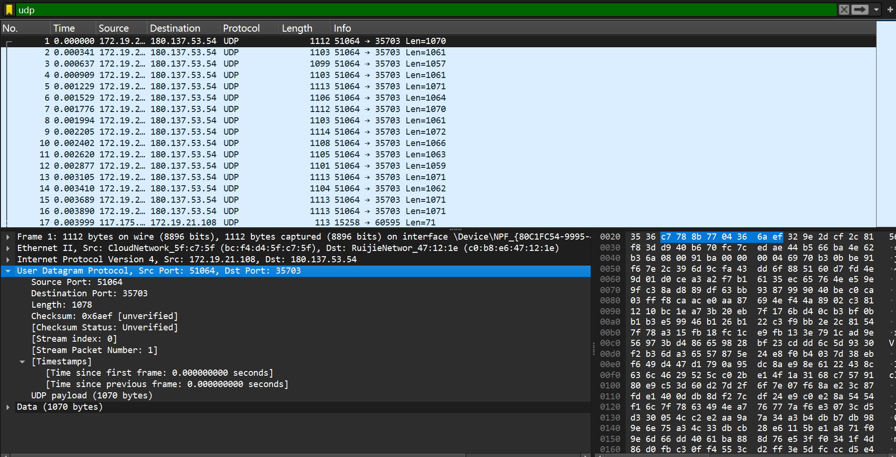
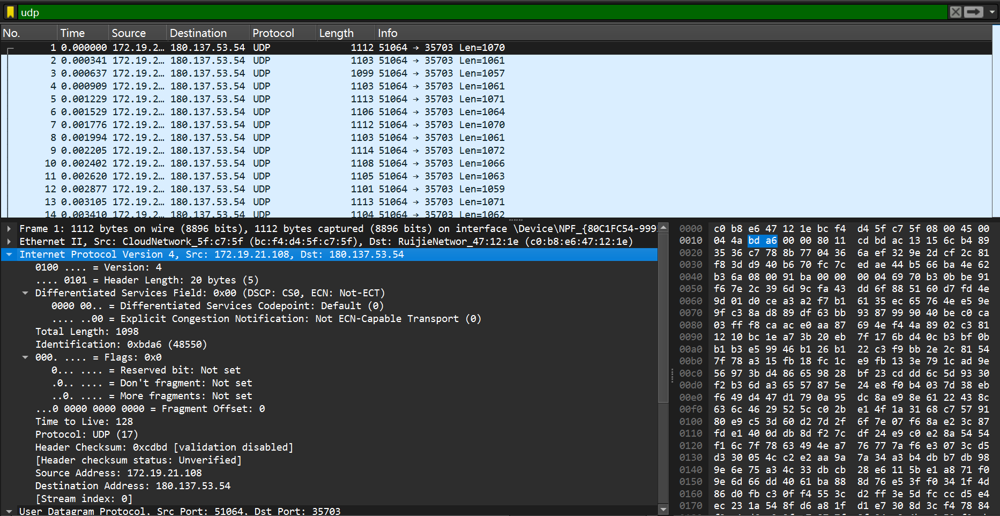
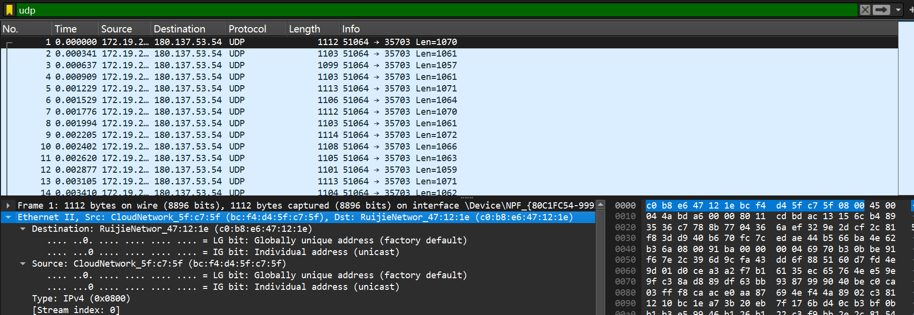
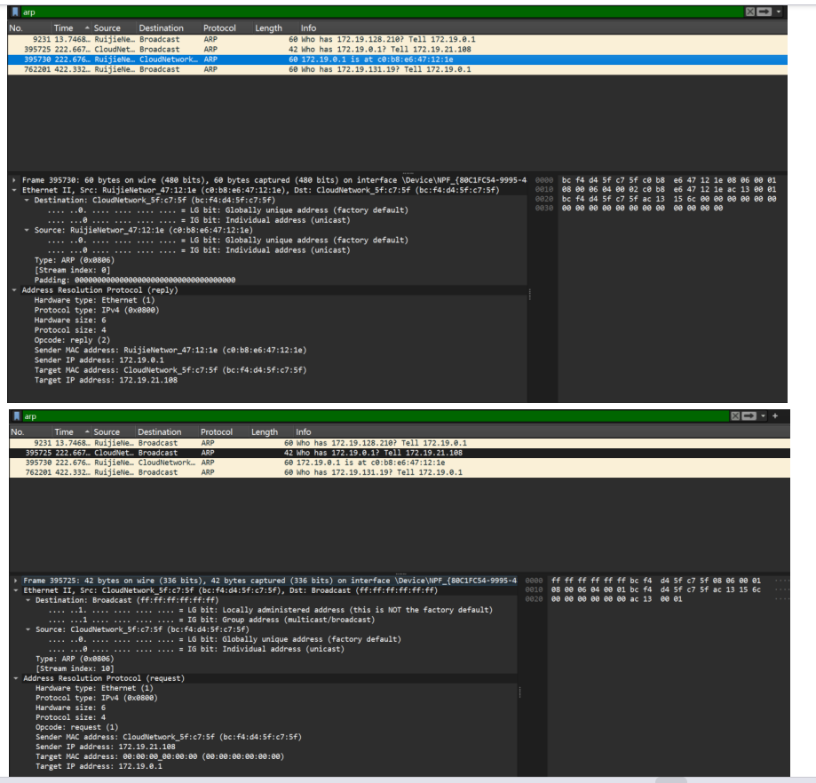
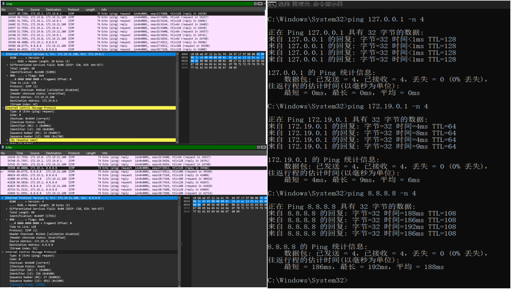

# Lab5：IP 与以太网的包收发操作

## 实验背景

本实验围绕 IP 模块与以太网在包收发过程中的角色展开，重点观察以下内容：

1. 网络包的基本结构：头部（IP 头部 + MAC 头部）与数据
2. IP 头部各字段的含义：版本号、TTL、协议号、发送方/接收方 IP 地址等
3. MAC 头部各字段的含义：接收方/发送方 MAC 地址、以太类型
4. IP 地址与 MAC 地址的区别与协作
5. ARP 协议如何通过 IP 地址查询 MAC 地址
6. 路由表的结构与查询方式
7. UDP 协议与 TCP 协议的区别：无连接、无确认、无重传
8. UDP 头部结构：发送方端口号、接收方端口号、数据长度、校验和
9. ICMP 协议的作用与常见消息类型（Echo、Destination Unreachable 等）

---

## 实验任务

### 任务一：查看路由表、ARP 缓存并启动 Wireshark

**第一步：打开 Wireshark，选择主网络接口，开始抓包**

> **注意**：本次实验必须使用真实网络接口（`en0`/`eth0`/`以太网`），不要选回环接口。回环接口不经过以太网，无法观察到 MAC 头部和 ARP 过程。

选择你的主网络接口，开始抓包。本次实验的大部分任务会共用同一次抓包。

**第二步：查看本机路由表**

```bash
# Linux
route -n
ip route show

# macOS
netstat -rn

# Windows
route print
```

截图并保存为 `route_table.png`。

**第三步：查看本机 ARP 缓存**

```bash
# Linux / macOS / Windows
arp -a
```

截图并保存为 `arp_cache.png`。

**第四步：填写下表**

从路由表和 ARP 缓存的输出中提取信息：

| 项目                         | 你的填写内容 |
| :--------------------------- | :----------- |
| 本机 IP 地址                 |172.19.21.108              |
| 本机所在子网                 |172.19.0.0/16（网络目标为 172.19.0.0，掩码 255.255.0.0）              |
| 子网掩码                     |255.255.0.0              |
| 默认网关 IP                  |172.19.0.1              |
| 默认网关 MAC 地址            |c0-b8-e6-47-12-1e（arp -a 中 172.19.0.1 对应的物理地址）              |
| 本机网卡 MAC 地址            |bc-f4-d4-5f-c7-5f              |

简答题：

1. 路由表的每一行包含哪些关键字段？教材中提到的 `Network Destination`、`Netmask`、`Gateway`、`Interface` 分别对应什么含义？
答：路由表每一行的关键字段包括：
（1）Network Destination（网络目标）：指该路由条目对应的目标网络或主机 IP 地址，可以是一个网段（如 172.19.0.0）、单个主机（如 172.19.21.108）或默认路由（0.0.0.0）。
（2）Netmask（网络掩码）：与网络目标配合，用于确定目标 IP 地址所属的子网范围。例如 255.255.0.0 表示目标 IP 的前 16 位为网络位。
（3）Gateway（网关）：数据包要发送到目标网络时，需要转发到的下一跳 IP 地址。如果是直连子网，网关会显示为 “在链路上”。
（4）Interface（接口）：本机用来发送该路由数据包的出接口 IP 地址（即本机网卡的 IP），表示数据包从哪个网卡发出。


2. 当目标 IP 地址不在本子网时，包会先发给谁？路由表的哪一列提供了这个信息？
答：当目标 IP 地址不在本子网时，数据包会先发送给默认网关（或对应路由条目中指定的网关），由网关转发到其他网络。路由表的 Gateway（网关） 列提供了这个信息，尤其是 0.0.0.0 这个默认路由条目，其网关就是所有非本地子网流量的转发目标。


3. 路由表的默认网关（`0.0.0.0`）条目的作用是什么？什么时候会匹配到这一行？
答：作用：作为默认路由，当系统中没有其他路由条目能匹配目标 IP 地址时，就会使用这条路由，将数据包转发到指定的网关，实现跨子网 / 互联网访问。
匹配时机：当目标 IP 地址不属于本机的任何直连子网，也没有配置更具体的静态路由时，IP 模块会匹配 0.0.0.0 这条默认路由，使用其指定的网关转发数据包。


4. 教材提到，确定发送方 IP 地址的关键在于"判断应该使用哪块网卡"。结合你查到的本机网卡信息，说明 IP 模块是如何做出这个判断的。
答：IP 模块选择发送接口的过程如下：
（1）最长匹配原则：IP 模块会将目标 IP 地址与路由表中的所有条目，按Network Destination和Netmask进行匹配，优先选择 ** 子网掩码最长（最具体）** 的路由条目。
例如，目标 IP 属于 172.19.x.x 网段，会匹配 172.19.0.0/16 路由，接口为 172.19.21.108。
若目标 IP 不属于任何直连子网，则匹配 0.0.0.0 路由，接口同样为 172.19.21.108（你的默认路由接口）。
（2）确定接口 IP：匹配到路由条目后，该条目的 Interface 列就是本机发送数据包的出接口 IP 地址，这个 IP 会作为数据包的源 IP 地址。
例如，你的默认路由 0.0.0.0 的接口是 172.19.21.108，因此访问外网时，数据包的源 IP 就是 172.19.21.108，通过对应的无线网卡发出。


---

### 任务二：观察 UDP 头部

只要计算机处于联网状态，Wireshark 中就会持续出现大量 UDP 流量（DNS、mDNS、DHCP、NTP 等），无需手动生成。

**第一步：在 Wireshark 中设置过滤器**

```text
udp
```

**第二步：在包列表中找一个 UDP 包**

随便选一个即可。如果包太多，可以加上源或目的 IP 来缩小范围，例如 `udp && ip.addr == 你的IP`。如果需要 DNS 包，也可以用 `udp.port == 53` 过滤。

> **可选**：如果想明确看到一个完整的请求-响应对，可以在终端中执行 `nslookup example.com`，Wireshark 中就会出现对应的 DNS 请求包。

**第三步：点击选中的 UDP 包，在详情栏展开 `User Datagram Protocol`**

填写下表：

| 项目               | 你的填写内容 |
| :----------------- | :----------- |
| UDP 头部总长度     |8 字节              |
| 源端口             |51064              |
| 目的端口           |35703              |
| 长度（Length）     |1078字节              |
| 校验和（Checksum） |0x6aef              |

简答题：

1. 你观察到的 UDP 头部长度是多少字节？TCP 头部至少 20 字节。UDP 省略了哪些字段？这些字段的缺失带来了什么后果？
答：
（1）观察到的 UDP 头部长度：8 字节（这是 UDP 协议的固定标准头部长度，无选项字段）。
（2）UDP 省略的 TCP 头部核心字段：
①序号（Sequence Number）、确认号（Acknowledgment Number）
②窗口大小（Window Size）、紧急指针（Urgent Pointer）
③标志位（Flags，如 ACK/SYN/FIN 等）
④选项字段（Options）
（3）缺失带来的后果：
①无连接、不可靠传输：UDP 不建立连接，也不确认数据包是否送达，丢包、乱序、重复都不会被处理。
②无流量控制与拥塞控制：UDP 不根据接收方的接收能力调整发送速度，也不感知网络拥塞，容易导致网络拥堵或接收方溢出。
③无数据重传机制：数据包丢失后，UDP 不会自动重传，需要上层应用自行实现。
④传输效率高、开销小：也正因为省略了这些字段，UDP 的头部开销极小，传输延迟低，适合对实时性要求高、可容忍少量丢包的场景（如音视频通话、游戏）。


2. UDP 头部中的"长度"字段指的是什么长度？
答：UDP 头部中的Length字段，指的是整个 UDP 数据报的总长度，包括：
UDP 头部（固定 8 字节） + UDP 数据（Payload，即应用层数据）
比如截图中的长度是1078字节，就代表这个 UDP 包的总长度是 1078 字节，其中头部占 8 字节，数据部分占1078-8=1070字节，和截图里的UDP payload (1070 bytes)完全对应。




---

### 任务三：观察 IP 头部字段

点击任务二中的同一个 UDP 包，在详情栏展开 `Internet Protocol Version 4`。

填写下表：

| 字段名称               | 你的填写内容 | 含义说明 |
| :--------------------- | :----------- | :------- |
| Version（版本号）      |4              |表示使用的 IP 协议版本为 IPv4          |
| Header Length（头部长度） |20字节            |IP 头部的固定最小长度，单位为 4 字节，这里值为 5（Header Length: 20 bytes (5)），5 × 4 = 20 字节          |
| Time to Live（TTL）    |128              |数据包的生存时间，每经过一个路由器 TTL 减 1，防止数据包在网络中无限循环          |
| Protocol（协议号）     |17              |表示 IP 层封装的上层协议为 UDP（协议号 17 代表 UDP，6 代表 TCP）          |
| Source Address（源 IP） |172.19.21.108              |发送方（你的主机）的 IP 地址          |
| Destination Address（目的 IP） |180.137.53.54	        |接收方服务器的 IP 地址          |

简答题：

1. 协议号字段的值是多少？它代表什么协议？如果抓一个 HTTP 请求的包，协议号会变成多少？
答：
协议号字段的值：17
代表的协议：UDP（UDP 协议的标准协议号为 17）
HTTP 请求包的协议号：HTTP 基于 TCP，TCP 的协议号为6，所以 HTTP 请求包的 IP 头部协议号会变成6。


2. TTL 字段的作用是什么？如果 TTL 降为 0 会发生什么？
答：
作用：TTL（Time to Live）是数据包的生存时间，限制数据包在网络中的转发次数，防止数据包因路由错误在网络中无限循环，造成网络拥塞。
TTL 降为 0 的后果：当数据包的 TTL 减为 0 时，收到该数据包的路由器会直接丢弃它，并向源主机发送一个ICMP 超时（Time Exceeded） 报文，通知源主机数据包已被丢弃。

3. 有教材提到 IP 地址"实际上并不是分配给计算机的，而是分配给网卡的"。你的本机有几块网卡？每块网卡的 IP 地址分别是什么？（提示：可参考任务一中路由表的 Interface 列，或用 `ip addr`（Linux）/`ifconfig`（macOS）/`ipconfig`（Windows）查看。）
答：答：IP 地址是分配给网络接口（网卡）的逻辑地址，而非直接分配给计算机本身，一台主机可以配置多块网卡，每块网卡都能拥有独立的 IP 地址。根据我的route print命令输出，本机包含以下网卡及其 IP 地址：
（1）MediaTek Wi-Fi 6 无线网卡（主网卡）：172.19.21.108
（2）VMware Virtual Ethernet Adapter for VMnet1：192.168.111.1
（3）VMware Virtual Ethernet Adapter for VMnet8：192.168.180.1
（4）软件环回接口（Loopback）：127.0.0.1


4. IP 头部中的源 IP 地址和目的 IP 地址分别是谁的地址？它们与 MAC 头部中的源/目的 MAC 地址有什么区别？
答：在本次抓取的数据包中，IP 头部的源 IP 地址是本机的地址172.19.21.108，目的 IP 地址是目标服务器的地址180.137.53.54。它们与 MAC 头部地址的主要区别如下：
（1）作用层级不同：IP 地址工作在网络层，用于跨网络的端到端寻址；MAC 地址工作在数据链路层，用于同一局域网内的链路到链路寻址。
（2）传输过程中是否变化不同：IP 地址在数据包从源主机到目的主机的全程传输中保持不变；而 MAC 地址每经过一个路由器（一跳），目的 MAC 地址会更新为下一跳设备的 MAC，源 MAC 地址会更新为当前出接口的 MAC。
（3）标识对象不同：IP 地址是主机的逻辑网络标识，可随网络环境变化；MAC 地址是网卡的物理硬件标识，出厂后通常固定不变。




---

### 任务四：观察 MAC 头部与以太网帧

点击任务二中的同一个 UDP 包，在详情栏展开 `Ethernet II`。

填写下表：

| 字段名称               | 你的填写内容 | 含义说明 |
| :--------------------- | :----------- | :------- |
| Source（源 MAC）       |bc:f4:d4:5f:c7:5f              |发送方（你的主机无线网卡）的物理地址          |
| Destination（目的 MAC） |c0:b8:e6:47:12:1e              |下一跳设备（你的网关 / 路由器）的物理地址          |
| Type（以太类型）       |0x0800              |表示该以太网帧承载的上层协议是 IPv4          |

关于 MAC 地址格式，填写下表：

| 项目               | 你的填写内容 |
| :----------------- | :----------- |
| MAC 地址长度       | 48 比特（6 字节） |
| 本机网卡的 MAC 地址 |bc:f4:d4:5f:c7:5f              |
| 目的 MAC 地址      |c0:b8:e6:47:12:1e              |
| MAC 地址的书写格式 |采用十六进制表示，每两个十六进制数为一组，共 6 组，组间用-或:分隔，例如 bc-f4-d4-5f-c7-5f 或 bc:f4:d4:5f:c7:5f              |

简答题：

1. 以太类型字段的值是多少？它代表后面承载的是什么协议的包？
答：在当前数据包中，以太网帧的 Type 字段值为0x0800，它代表该帧后面承载的是IPv4 协议的数据包。


2. DNS 服务器的 IP 通常是外网地址。本任务中目的 MAC 地址是 DNS 服务器的 MAC 地址还是你本机网关（路由器）的 MAC 地址？为什么？
答：本任务中的目的 MAC 地址是本机网关（路由器）的 MAC 地址，而非 DNS 服务器的 MAC 地址。原因是：DNS 服务器的 IP 是外网地址，与本机不在同一个局域网内，无法直接通过 MAC 地址通信。本机只能先将数据包发送给网关，再由网关转发到外网。因此，以太网帧的目的 MAC 地址始终是网关的 MAC 地址，而非最终目标服务器的 MAC 地址。


3. IP 地址和 MAC 地址在功能上有什么相似之处？又有什么本质区别？
答：
相似之处：两者都是网络中设备的唯一标识，都用于在通信中定位和区分不同的设备。
本质区别：
（1）工作层级不同：IP 地址工作在网络层，负责跨网络的端到端寻址；MAC 地址工作在数据链路层，负责同一局域网内的链路寻址。
（2）可变性不同：IP 地址是逻辑地址，可随网络环境变化；MAC 地址是物理地址，通常由网卡出厂时固定，不可修改。
（3）传输过程中是否变化不同：IP 地址在数据包传输全程保持不变；MAC 地址每经过一个路由器（一跳），目的 MAC 就会更新为下一跳设备的 MAC。
（4）寻址范围不同：IP 地址可以在全球范围内唯一标识设备；MAC 地址仅在局域网内有效，跨网通信时无法直接使用。


4. 为什么以太网帧中需要同时有 IP 地址（在 IP 头部中）和 MAC 地址？不能只用其中一种吗？
答：两者不能互相替代，必须同时存在，原因如下：
（1）IP 地址解决 “跨网络” 寻址问题：它标识了数据包最终要到达的端到端主机，负责在不同网络间路由数据包。没有 IP 地址，数据包无法从源主机路由到外网的目标主机。
（2）MAC 地址解决 “局域网内” 交付问题：它标识了当前链路上下一跳的设备，负责在同一局域网内将数据包从一台设备直接交付给另一台设备。没有 MAC 地址，数据包无法在局域网内完成传输，更无法发送给网关进行跨网转发。
因此，IP 地址负责 “我要去哪里”，MAC 地址负责 “这一跳该交给谁”，两者配合才能完成完整的通信过程，缺一不可。




---

### 任务五：观察 ARP 协议

ARP（Address Resolution Protocol，地址解析协议）用于根据 IP 地址查询 MAC 地址。只要计算机处于联网状态，Wireshark 中通常会持续出现 ARP 包（邻居发现、缓存刷新等），可以直接观察。如果抓包一段时间后仍未看到 ARP 包，再手动触发。

**第一步：在 Wireshark 中设置过滤器**

```text
arp
```

**第二步：在包列表中找 ARP 包**

正常联网的设备每隔几分钟就会自动发送 ARP 请求，等待即可。如果等了一会儿仍没有，可以选择以下任一方式手动触发：

- **方式 A（推荐）**：在终端中执行 `arping`

  ```bash
  # Linux（通常已预装）
  sudo arping -c 3 <网关IP>

  # macOS（如果没有，先执行：brew install arping）
  sudo arping -c 3 <网关IP>

  # Windows（可从 https://github.com/ThomasHabets/arping/releases 下载）
  arping -c 3 <网关IP>
  ```

- **方式 B**：先清除 ARP 缓存，再 ping 同网段地址

  ```bash
  # 清除 ARP 缓存
  # Linux:   sudo ip neigh flush all
  # macOS:   sudo arp -d -a
  # Windows: arp -d *

  # 然后 ping 网关
  ping <网关IP> -c 2
  ```

> **注意**：如果目标是 `127.0.0.1` 或外网地址，ARP 不会出现。回环接口不经过以太网，外网地址的 MAC 地址是路由器的（通常已缓存）。

**第三步：点击 ARP 请求包（Opcode 为 request），展开详情**

**第四步：填写下表**

| 项目                     | 你的填写内容 |
| :----------------------- | :----------- |
| ARP 请求的目的 MAC 地址 |ff:ff:ff:ff:ff:ff（广播地址，请求包的目标 MAC）              |
| ARP 请求中查询的目标 IP |172.19.0.1              |
| ARP 响应中返回的 MAC 地址 |c0:b8:e6:47:12:1e              |
| 该 ARP 包是自动出现还是手动触发的 |手动触发的（由ping 172.19.0.1触发）              |

简答题：

1. ARP 请求的目的 MAC 地址为什么是 `ff:ff:ff:ff:ff:ff`（广播地址）？
答：ARP 请求使用广播地址ff:ff:ff:ff:ff:ff，是因为发送方不知道目标 IP 对应的 MAC 地址，需要向局域网内所有设备广播查询请求。这样，局域网内的所有设备都会收到这个请求，其中只有目标 IP 对应的设备会回复 ARP 响应，其他设备会忽略该请求。


2. 为什么 ARP 缓存中的条目会在几分钟后自动删除？
答：ARP 缓存条目设置超时时间，是为了适应网络拓扑的动态变化。当设备更换、IP 地址重新分配或设备下线时，旧的 ARP 条目会失效。定时删除可以避免使用过时的 MAC 地址信息，防止数据包发送失败或发送到错误设备，保证网络通信的正确性。


3. 如果 ARP 缓存中的 MAC 地址已经过期（对方 IP 对应的设备已更换），会出现什么问题？如何解决？
答：出现的问题：发送方会将数据包发送到缓存中记录的旧 MAC 地址上，导致数据包无法到达正确设备，出现网络连接失败、丢包、通信中断等问题。
解决方法：
（1）等待 ARP 缓存条目自动超时，设备会重新发送 ARP 请求获取新的 MAC 地址；
（2（手动清除 ARP 缓存，在 Windows 中使用arp -d *命令清空缓存，再 ping 目标 IP 触发新的 ARP 请求；
（3）可以手动添加静态 ARP 条目，但仅适用于固定 IP 和 MAC 的设备，不适合动态变化的网络。




---

### 任务六：使用 `ping` 命令观察 ICMP

有教材提到了 ICMP（Internet Control Message Protocol）协议，它用于在 IP 层传递错误和控制信息。`ping` 命令就是基于 ICMP 的 Echo Request（类型 8）和 Echo Reply（类型 0）实现的。

**第一步：在 Wireshark 中设置 ICMP 过滤器**

```text
icmp
```

**第二步：在终端中执行 ping 命令**

```bash
# ping 本机（回环）
ping 127.0.0.1 -c 4

# ping 局域网内的设备（如路由器网关）
ping <网关IP> -c 4

# ping 外网地址
ping 8.8.8.8 -c 4
```

**第三步：在 Wireshark 中观察 ICMP 包**

填写下表：

| 目标               | 是否收到回复 | 往返时间（ms） | TTL 值 |
| :----------------- | :----------- | :------------- | :----- |
| 127.0.0.1          |是              |平均 0ms（<1ms）                |128        |
| 局域网设备（网关） |是              |平均 6ms                |64        |
| 8.8.8.8            |是              |平均 188ms                |108        |

> **提示**：ping 回环地址（`127.0.0.1`）时数据不经过物理网卡，Wireshark 在主网络接口上可能无法捕获到包。TTL 值可从终端输出中读取（`ping` 会显示 `ttl=...`），或切换 Wireshark 至回环接口（`lo0` / `lo`）抓包。

简答题：

1. `ping` 命令发送的是什么类型的 ICMP 消息？收到的回复又是什么类型？
答：ping 命令发送的是 ICMP Echo Request（类型 8） 消息，收到的回复是 ICMP Echo Reply（类型 0）消息。请求消息用于向目标主机发起探测，回复消息则是目标主机对探测请求的响应。


2. 为什么 ping 不同目标的 TTL 值不同？TTL 值反映了什么信息？
答：
不同目标的 TTL 值不同，是因为不同设备（操作系统 / 网络设备）的默认 TTL 初始值不同，且数据包在传输过程中经过的路由器跳数也不同，每经过一跳 TTL 值会减 1。
TTL 值反映了数据包在网络中传输时，还能经过的最大路由器转发次数，它防止了数据包因路由错误在网络中无限循环。通过 TTL 值可以大致推断目标主机的操作系统类型（如 Windows 默认 TTL 为 128，Linux 为 64）和数据包的传输跳数。


3. 教材表 2.4 中列出了多种 ICMP 消息类型。`Destination unreachable`（类型 3）在什么情况下会出现？请用以下方法尝试触发并观察：

   ```bash
   # 方法一（推荐）：ping 同网段内一个确认不存在的 IP
   # 例如你的本机 IP 是 192.168.1.100，子网掩码 255.255.255.0，
   # 那么可以 ping 192.168.1.250（一个大概率没有被分配的地址）
   ping <同网段不存在的IP> -c 3
   
   # 方法二：向一个关闭的端口发 UDP 包，触发 ICMP Port Unreachable
   # 先在 Wireshark 中保持 icmp 过滤器，然后执行：
   # Linux / macOS
   echo "test" | nc -u -w 1 <同网段某台设备的IP> 19999
   
   # Windows（需安装 nmap：https://nmap.org/download.html）
   nmap -sU -p 19999 <同网段某台设备的IP>
   ```

   观察到类型 3 的包后，记录其 Code 值（子类型）并说明代表什么含义。
答：答：Destination unreachable（类型 3，目的不可达）ICMP 消息，是当数据包无法被送达目标主机或目标端口时，由路由器或目标主机向源主机发送的错误通知报文：
（1）目标网络 / 主机不可达（Code=0/1）：数据包的目标 IP 不存在，路由器无法转发该数据包。
触发方式：ping 一个不存在的同网段 IP（ping 172.19.128.250，该地址未被分配），设备未回复 ARP 响应，部分路由器返回Destination net unreachable（Code=0）。
（2）目标端口不可达（Code=3）
数据包成功到达目标主机，但目标主机上没有进程监听指定的 UDP 端口。
触发方式：向目标主机的一个关闭的 UDP 端口发送数据包（用nmap -sU -p 19999 172.19.0.1扫描网关的 19999 端口），目标主机收到后返回Destination port unreachable（Code=3）。
（3）其他子类型（Code=2/4/5 等）
Code=2（协议不可达）：目标主机不支持数据包的传输层协议（如 IP 头中 Protocol 字段为不支持的协议号）。
Code=4（需要分片但设置了不分片位）：数据包大小超过了链路 MTU，且 IP 头中 DF（不分片）位被置 1，路由器无法转发。
Code=5（源路由失败）：数据包中指定的源路由路径无法完成。




---

## 问答题

1. 网络包由哪几部分构成？IP 头部和 MAC 头部分别的作用是什么？
答：一个完整的以太网网络包主要由三部分构成：以太网帧头部（MAC 头部）、IP 头部，以及数据载荷。
（1）MAC 头部包含源 MAC 地址、目的 MAC 地址和以太类型字段，作用是在数据链路层完成同一局域网内的设备寻址，将数据包从当前设备交付给链路中的下一跳设备。
（2）IP 头部包含源 IP 地址、目的 IP 地址、TTL、协议号等字段，作用是在网络层完成跨网路由寻址，标识数据包的最终源主机和目的主机，并通过 TTL 机制防止数据包在网络中无限循环。
（3）数据载荷则包含传输层（TCP/UDP）头部和应用层数据，是需要传输的实际业务内容。


2. IP 协议和以太网协议在网络传输中分别承担什么职责？它们是如何分工协作的？
答：IP 协议与以太网协议分别工作在网络层和数据链路层，职责与协作方式如下：
（1）IP 协议的核心职责是提供统一的逻辑 IP 地址，屏蔽底层物理网络差异，负责跨网路由寻址，决定数据包从源主机到目的主机的传输路径，同时处理不同链路 MTU 不匹配的分片与重组问题。
（2）以太网协议的核心职责是提供物理 MAC 地址，实现同一局域网内设备的直接通信，完成帧的封装解封装与差错检测，确保数据在链路层的可靠交付。
（3）两者分工协作时，IP 数据包会被封装在以太网帧中传输。IP 地址始终不变，标识端到端的通信目标；而 MAC 地址会在每一跳更新，标识当前链路的交付对象，以此实现 “跨网寻址” 与 “链路交付” 的配合。


3. ARP 协议解决的核心问题是什么？如果不使用 ARP 缓存，网络中会出现什么情况？
答：ARP 协议解决的核心问题是 IP 地址到 MAC 地址的映射，即根据目标 IP 地址查询其对应的物理 MAC 地址，使设备能在同一局域网内直接通信。如果不使用 ARP 缓存，每次发送数据包前都需要广播 ARP 请求，会导致网络中出现大量广播流量，占用带宽资源；同时每次都要等待 ARP 响应，会显著增加数据包发送延迟，降低通信效率，也会加重局域网内所有设备的 CPU 处理负载。


4. 为什么 IP 和负责传输的网络（如以太网）要分开设计？这种设计带来了什么好处？
答：IP 与以太网分开设计，是为了实现网络层与数据链路层的解耦。这种设计带来了多重好处：一是 IP 协议可以运行在多种不同的物理网络之上，底层网络技术的变化不会影响 IP 层的功能，具备极强的灵活性；二是统一的 IP 地址屏蔽了不同物理网络地址格式的差异，使跨网通信成为可能，具备良好的可扩展性；三是各层协议职责清晰，便于设计、实现和维护，也便于单独升级某一层的技术，降低了网络整体的复杂度。


5. 网卡在发送包时会额外添加哪 3 个控制数据？它们各自的作用是什么？
答：网卡在发送数据包时，会为上层 IP 数据报添加以太网帧的三个控制数据：
（1）前导码：用于同步，帮助接收方网卡识别帧的开始，同步时钟信号，确保比特流被正确接收。
（2）帧起始定界符：标志着前导码结束、以太网帧数据开始，帮助接收方定位帧的起始位置。
（3）帧校验序列：对整个以太网帧进行循环冗余校验，接收方可以通过它判断数据在传输过程中是否出错，实现差错检测。


6. 网卡接收到一个包后，需要经过哪些步骤才能将其交给操作系统？如果 FCS 校验失败会怎样？
答：网卡接收到数据包后，处理步骤如下：首先在物理层接收链路上的比特流，通过前导码和帧起始定界符同步，识别出完整的以太网帧；接着计算帧的校验和，与帧尾的 FCS 字段进行对比；校验通过后，检查帧的目的 MAC 地址是否为本机 MAC、广播地址或多播地址，若不是则直接丢弃；之后根据以太网帧的 Type 字段，判断上层协议类型，将数据交给操作系统内核中对应的协议栈处理。如果 FCS 校验失败，网卡会直接丢弃该数据包，不会将其交给操作系统，也不会发送任何错误通知。


7. TCP 和 UDP 的核心区别是什么？请从连接管理、可靠性、效率、适用场景四个维度进行比较。
答：TCP 和 UDP 四个维度对比：
（1）连接管理：TCP 是面向连接的协议，通信前需要通过三次握手建立连接，通信结束后通过四次挥手断开连接；UDP 是无连接协议，通信前不需要建立连接，可直接发送数据。
（2）可靠性：TCP 是可靠传输协议，提供确认重传、序号排序、流量控制和拥塞控制，保证数据按序、无差错到达；UDP 是不可靠传输协议，不保证数据到达、不保证顺序，也不提供重传机制，可能出现丢包、乱序。
（3）效率：TCP 头部开销大，最小为 20 字节，握手和确认机制会带来额外延迟，传输效率较低；UDP 头部开销小，固定为 8 字节，无握手和确认过程，传输延迟低，效率更高。
（4）适用场景：TCP 适用于对可靠性要求高、可容忍一定延迟的场景，如文件传输、网页浏览、邮件发送；UDP 适用于对实时性要求高、可容忍少量丢包的场景，如音视频通话、在线游戏、DNS 查询。


8. UDP 适用于哪些场景？请结合教材内容解释为什么这些场景适合使用 UDP 而非 TCP。
答：UDP 主要适用于以下场景：
（1）实时音视频通信：这类场景对延迟要求极高，少量丢包可通过应用层纠错处理，TCP 的重传和确认机制会带来不可接受的延迟，UDP 的低延迟特性更适配。
（2）在线游戏：游戏数据需要低延迟传输，少量丢包不影响整体体验，TCP 的流量控制和拥塞控制可能导致卡顿，UDP 的高效率更适合。
（3）DNS 查询：DNS 请求报文短小，且对延迟敏感，使用 UDP 可快速完成查询，避免 TCP 握手带来的额外开销。
（4）物联网设备通信：设备资源有限，UDP 的轻量级头部和无连接特性，适合低功耗、低带宽的物联网场景。


9. 如果一个 IP 包经过多次路由转发后 TTL 降为 0，路由器会如何处理？这与教材中提到的哪种 ICMP 消息有关？
答：当 IP 包的 TTL 值在转发过程中减为 0 时，收到该数据包的路由器会直接丢弃该数据包，防止其在网络中无限循环。同时，路由器会向源主机发送一个 ICMP Time Exceeded 消息，即 ICMP 类型 11 的超时报文，通知源主机数据包因 TTL 超时被丢弃。


---

## 截图要求

- 截图须清晰，终端文字和 Wireshark 字段可读。
- 所有截图与本 `Lab5.md` 放在同一目录下。
- 命名规范：

| 截图内容         | 文件名               |
| :--------------- | :------------------- |
| 路由表           | `route_table.png`    |
| ARP 缓存         | `arp_cache.png`      |
| UDP 头部字段     | `udp_header.png`     |
| IP 头部字段      | `ip_header.png`      |
| 以太网帧字段     | `ethernet_frame.png` |
| ARP 请求与响应   | `arp.png`            |
| ICMP ping        | `icmp.png`           |

具体要求：

1. `route_table.png`：终端截图，显示 `route -n`（Linux）、`netstat -rn`（macOS）或 `route print`（Windows）的完整输出。

2. `arp_cache.png`：终端截图，显示 `arp -a` 的完整输出。

3. `udp_header.png`：Wireshark 截图，展开 `User Datagram Protocol`，能看到 Source Port、Destination Port、Length、Checksum。

4. `ip_header.png`：Wireshark 截图，展开 `Internet Protocol Version 4`，能看到 Version、Header Length、TTL、Protocol、Source Address、Destination Address。

5. `ethernet_frame.png`：Wireshark 截图，展开 `Ethernet II`，能看到 Source、Destination、Type。

6. `arp.png`：Wireshark 截图（若能观察到），展开 ARP 包的详情，能看到发送方的 MAC 和 IP、查询的目标 IP。

7. `icmp.png`：Wireshark 截图，能看到 ICMP Echo Request 和 Echo Reply，以及 TTL 字段。

---

## 提交要求

在自己的文件夹下新建 `Lab5/` 目录，提交以下文件：

```text
学号姓名/
└── Lab5/
    ├── Lab5.md
    ├── route_table.png
    ├── arp_cache.png
    ├── udp_header.png
    ├── ip_header.png
    ├── ethernet_frame.png
    ├── arp.png
    └── icmp.png
```

---

## 截止时间

2026-05-07，届时关于 Lab5 的 PR 请求将不会被合并。
