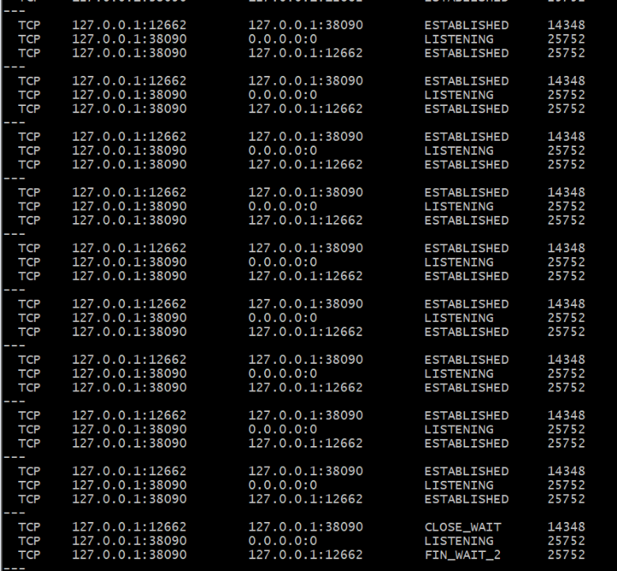
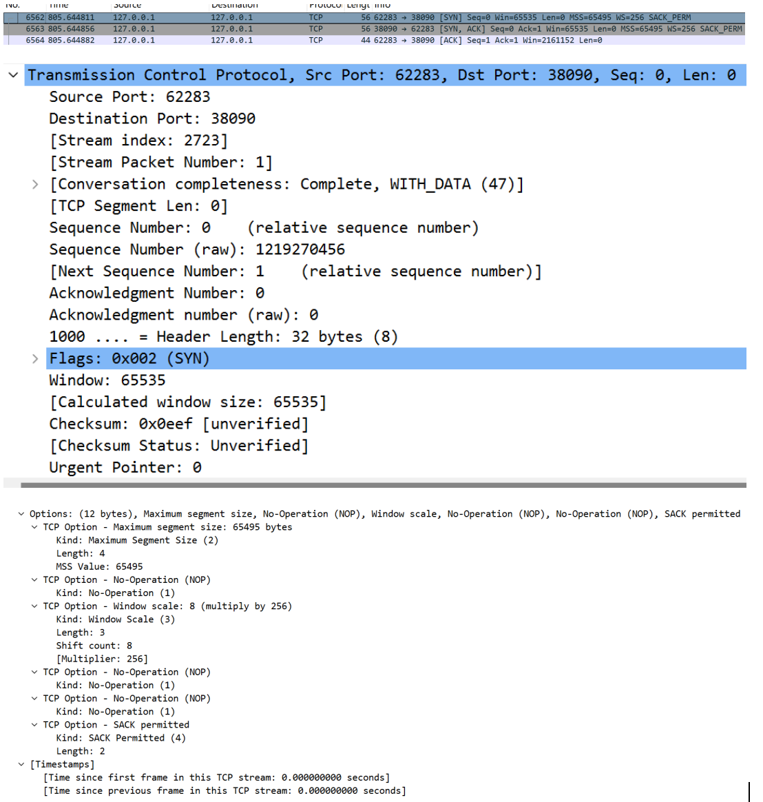
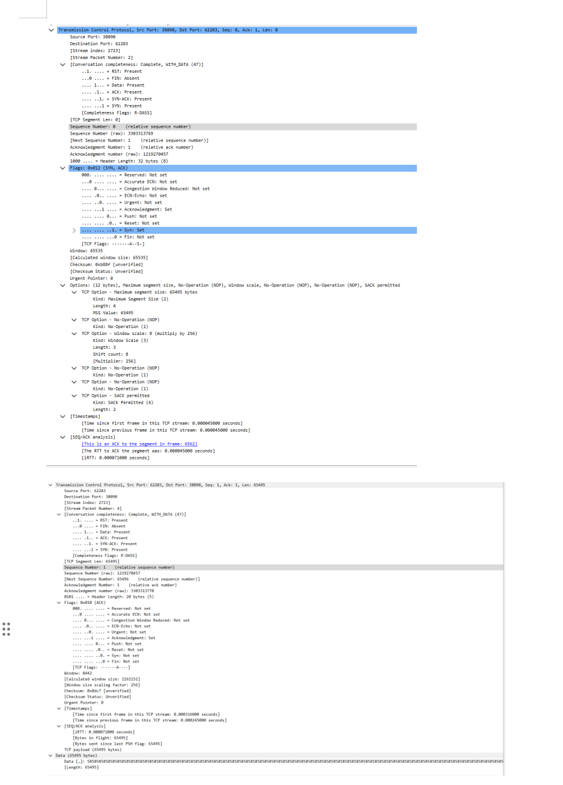
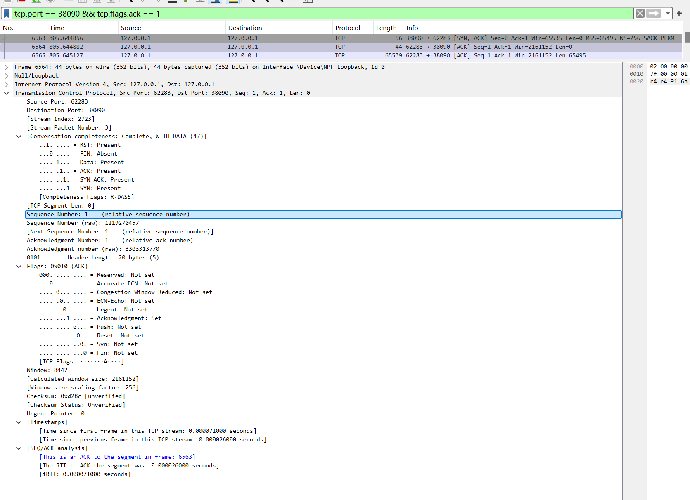
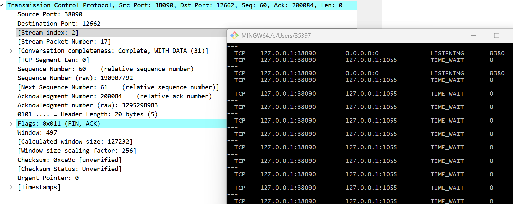

# Lab4：看见TCP 我不怕不怕啦

## 实验背景

本实验围绕一条 TCP 连接的完整生命周期展开，重点观察以下内容：

1. `socket()`、`listen()`、`accept()`、`connect()` 的职责区别
2. "连接"为什么本质上是交换控制信息而不是物理连线
3. TCP 头部中的端口号、序号、ACK 号、标志位、窗口、头部长度、可选字段
4. 三次握手如何建立收发准备
5. 应用层大块数据如何被 TCP 按 MSS 拆分
6. `Sequence Number` 与 `Acknowledgment Number` 如何配合工作
7. `recv()` 为什么会阻塞等待数据
8. 接收窗口如何反映接收方处理能力
9. ACK 与窗口更新为什么常常会被合并
10. `FIN` / `ACK` 如何完成断开
11. 为什么连接结束后套接字不会立刻删除

---

## 实验任务

### 任务一：准备实验环境并记录运行信息

**第一步：准备好四个窗口**

整个实验需要同时观察多个界面，建议在开始前把窗口布局摆好：

- **终端 A**：运行服务端
- **终端 B**：运行客户端
- **终端 C**：持续监控套接字状态（全程保持开启，不要关）
- **Wireshark**：抓包

**第二步：在终端 C 里启动持续监控**

TCP 状态变化很快，等你手动敲完 `ss` 命令再回车，状态可能已经过去了。用下面的命令让终端 C 每 0.5 秒自动刷新一次，之后只需要盯着这个窗口就行：

```bash
# Linux
watch -n 0.5 'ss -tan | grep 38090'

# macOS（没有 watch，用循环代替）
while true; do netstat -an | grep 38090; echo "---"; sleep 0.5; done

# Windows（Git Bash执行）
while true; do netstat -ano | grep 38090; echo "---"; sleep 0.5; done
```

如果你换了端口，把 `38090` 替换成实际端口。

**第三步：打开 Wireshark，选回环接口，填好过滤器，开始抓包**

回环接口在不同系统里名字不同：

| 系统 | 接口名 |
|:-----|:-------|
| Linux | `lo` |
| macOS | `lo0` |
| Windows | `Adapter for loopback traffic capture`（需提前安装 Npcap 并勾选回环支持） |

在显示过滤器里输入：

```text
tcp.port == 38090
```

然后点击开始抓包（蓝色鲨鱼鳍图标）。**先开始抓包，再运行脚本**，否则握手包会被漏掉。

**第四步：启动脚本**

```bash
# 终端 A
python3 tcp_lab4_server.py

# 终端 B（等服务端打印出 server listening on ... 后再运行）
python3 tcp_lab4_client.py
```

如果 `38090` 已被占用，两端都加环境变量换端口，同时记得把 Wireshark 过滤器和终端 C 里的端口号也改掉：

```bash
LAB4_PORT=38123 python3 tcp_lab4_server.py
LAB4_PORT=38123 python3 tcp_lab4_client.py
```

**第五步：填写下表**

| 项目                                | 你的填写内容 |
| :---------------------------------- | :----------- |
| 服务端监听地址                      |    127.0.0.1          |
| 服务端监听端口                      |       38090       |
| 客户端本地临时端口                  |        62283      |
| 客户端请求总字节数                  |      200000        |
| 服务端响应内容                      |      b'Hello from TCP Server! Hello from TCP Server! Hell'...（截断部分）        |
| 客户端 `connect()` 返回前后的时间点 |       connect() returned, cost: 0.000s       |
| 客户端首次收到响应前等待了多久      |      2.002s        |

各项数值均可直接从终端输出读取：服务端监听信息在 `server listening on ...`，客户端本地端口在 `local socket = ...`，请求字节数在 `sendall() start, request bytes=...`，等待时间在 `first recv() returned after ...s`。


---

### 任务二：观察套接字创建与连接建立

1. 服务端启动后，观察终端 C 出现 `LISTEN` 状态，截图留存。
2. 在终端 B 里启动客户端，观察它依次打印 `socket created`、`calling connect()`、`connect() returned`。
3. 客户端打印 `connect() returned` 之后，观察终端 C 出现 `ESTABLISHED`，截图留存。脚本在 `connect()` 返回后有 2 秒停顿，这段时间足够截图。

填写下表：

| 阶段                             | 你的填写内容 |
| :------------------------------- | :----------- |
| 服务端启动、客户端未连入时的状态 |       LISTEN       |
| `connect()` 返回后服务端状态     |      ESTABLISHED        |
| `connect()` 返回后客户端状态     |      ESTABLISHED        |

简答题：

1. 服务端在客户端连接前为什么处于 `LISTEN`？

服务端需要被动等待客户端的连接请求，LISTEN 状态表示套接字已准备好接收传入的连接请求，是服务端监听连接的必要状态。


2. 为什么这时还没有真正建立 TCP 连接？

LISTEN 仅表示服务端开启了监听端口，尚未完成三次握手的交互过程，只有完成三次握手后才会建立真正的 TCP 连接。

3. `socket()` 与 `connect()` 的区别是什么？

socket() 用于创建一个套接字描述符，是建立网络通信的基础；connect() 则是客户端主动向服务端发起连接请求，完成三次握手以建立连接。

4. 为什么 `connect()` 返回后才进入可稳定收发数据的状态？

connect() 返回意味着客户端与服务端已完成三次握手，TCP 连接正式建立，此时双方具备稳定收发数据的基础。

5. 为什么"网线一直连着"不等于"TCP 连接已经建立"？

为什么 "网线一直连着" 不等于 "TCP 连接已经建立"？
网线连接仅代表物理层链路连通，而 TCP 连接需要通过三次握手完成双方的状态确认、序号同步等，是逻辑层面的连接，与物理链路无关。


6. 这里的"连接"更准确地说是在做什么？

是客户端与服务端通过三次握手完成参数协商（如序号、窗口大小）、状态同步，最终建立双向可靠的数据传输通道的过程。



---

### 任务三：观察三次握手与 TCP 头部字段

**定位握手包**：在 Wireshark 过滤器里输入下面的条件，可以屏蔽中间的数据包，只留下握手和断开阶段的控制包：

```text
tcp.port == 38090 && (tcp.flags.syn == 1 || tcp.flags.fin == 1)
```

包列表最前面的三个包就是三次握手（SYN → SYN-ACK → ACK）。

**找到各字段的位置**：点击某个握手包，在下方详情栏展开 `Transmission Control Protocol`。源端口、目的端口、Seq、Ack、Flags、Window、Header Length 都在这里。TCP 选项在最底部的 `Options` 子项里，展开后可以看到 MSS、Window Scale、SACK Permitted，注意这三项只出现在带 SYN 标志的包里，纯 ACK 包里没有。

**关于序号显示**：Wireshark 默认开启相对序号，会把每个方向的初始序号归零显示，所以 SYN 包的 Seq 看起来是 `0`，而不是真实的随机大数。这是正常现象，实验报告按 Wireshark 显示的值填写即可。如果你想看真实值，可以去 `Edit → Preferences → Protocols → TCP` 里取消勾选 `Relative sequence numbers`。

填写下表：

| 报文       | 源端口 | 目的端口 | Seq  | Ack  | Flags | Window | Header Length |
| :--------- | :----- | :------- | :--- | :--- | :---- | :----- | :------------ |
| 第一次握手 |    62283    |    38090      |   0   |   0   |   SYN    |   65535    |       32 字节        |
| 第二次握手 |    38090    |     62283     |   0   |   1   |   SYN-ACK    |    216152    |         32 字节      |
| 第三次握手 |    62283    |    38090      |  1    |  1    |  ACK     |   216152     |         20 字节      |

第一次握手（SYN）的 Ack 字段在 Wireshark 里通常显示为空或 `0`，这是正常的，因为此时客户端还没有收到服务端的任何数据。Header Length 在没有选项时是 20 字节，握手包因为携带了 MSS 等选项通常是 28 或 32 字节。

| TCP 选项       | 你的填写内容 |
| :------------- | :----------- |
| MSS            |      65495        |
| Window Scale   |          8（Multiplier: 256）    |
| SACK Permitted |        允许（SACK permitted）      |

回环接口的 MSS 通常是 65495（因为回环 MTU 是 65536，比以太网的 1500 大得多），这会影响后续任务五里是否能观察到分段。

简答题：

1. 发送方和接收方端口号在连接阶段的作用是什么？

端口号用于标识同一主机上的不同应用进程，结合 IP 地址组成套接字，精准定位通信的双方进程，确保数据传输到正确的应用程序。

2. TCP 头部如何帮助找到目标套接字？
TCP 头部包含源端口、目的端口，结合 IP 头部的源 IP、目的 IP，共同确定唯一的套接字对，实现数据的精准投递。


3. 为什么初始序号不是简单固定从 1 开始？

固定初始序号易导致旧连接的序号与新连接冲突，引发数据错乱；随机初始序号可提高安全性，同时避免重复报文导致的传输错误。


4. 为什么 TCP 可选字段更容易在连接阶段看到？
可选字段（如 MSS、窗口缩放）用于协商连接参数，仅在三次握手的 SYN 包中传递，后续纯数据 / 纯 ACK 包无需携带，因此连接阶段最易观察。




---

### 任务四：区分头部中的控制信息和套接字中的控制信息

用以下过滤器分别找到两类报文：

```text
# 纯控制报文（无应用数据）
tcp.port == 38090 && tcp.len == 0

# 携带应用数据的报文
tcp.port == 38090 && tcp.len > 0
```

从纯控制报文里选一个（SYN、纯 ACK 或 FIN-ACK 都可以），从数据报文里选一个（客户端发请求或服务端发响应的包）。

填写下表：

| 项目                   | 你的填写内容 |
| :--------------------- | :----------- |
| 纯控制报文的类型       |     SYN（第一次握手）         |
| 携带应用数据的报文类型 |      服务端响应数据（带业务内容）        |
| 头部中的控制信息举例   |      Flags（SYN/ACK/FIN）、Seq、Ack、Window        |
| 套接字中的控制信息举例 |        连接状态（ESTABLISHED）、读写缓冲区控制、阻塞逻辑      |

简答题：

1. 为什么"头部中的控制信息"和"套接字中的控制信息"不是同一件事？

TCP 头部控制信息是网络协议层面的字段（如 Seq、Flags），用于实现数据包的传输控制；套接字控制信息是程序层面的逻辑（如连接状态、缓冲区管理），用于应用程序操控连接，二者分属协议层和应用层。


---

### 任务五：观察数据分段、序号与 ACK

客户端发送的请求体是 200000 字节，超过了回环接口 MSS（约 65495 字节），因此应该可以在 Wireshark 里看到多个连续的数据段。用下面的过滤器找到客户端发出的数据包：

```text
tcp.srcport != 38090 && tcp.port == 38090 && tcp.len > 0
```

在包列表里连续选几个数据段，对比它们的 Seq 值。相邻两段的关系是：后一段的 Seq = 前一段的 Seq + 前一段的 TCP Segment Len。

找服务端返回给客户端的纯 ACK 报文：

```text
tcp.srcport == 38090 && tcp.flags.ack == 1 && tcp.len == 0
```

填写下表：

| 数据段  | Seq  | Ack  | TCP Segment Len | Flags |
| :------ | :--- | :--- | :-------------- | :---- |
| 第 1 段 |   0   |   1   |      65495           |    PSH/ACK   |
| 第 2 段 |   65495	   |     1 |   65495              |  PSH/ACK     |
| 第 3 段 |    130990  |    1  |       65495          |   PSH/ACK    |

| ACK 报文 | Ack Number | Flags | Window |
| :------- | :--------- | :---- | :----- |
| 第 1 个  |      65495      |   ACK    |     216152   |
| 第 2 个  |     130990       |    ACK   |    216152    |
| 第 3 个  |     196485	       |    ACK   |   216152     |

| 项目                         | 你的填写内容 |
| :--------------------------- | :----------- |
| 是否发生分段                 |      是        |
| 握手中观察到的 MSS           |     65495 字节         |
| 单段长度与 MSS 的关系        |       单段长度接近 MSS 最大值       |
| ACK 号大致确认到了第几个字节 |         累计确认到已接收的最大字节序号     |

简答题：

1. 应用程序是否直接决定每个网络包的数据长度？为什么？

否。应用数据由 TCP 结合 MSS（最大分段大小）、MTU（最大传输单元） 及网络拥塞情况拆分，应用仅提供原始数据，不直接控制单个数据包长度。


2. 大块应用数据为什么会被拆分？

网络链路有 MTU 限制，单个数据包过大会导致传输失败、延迟增加；拆分后可提升传输可靠性、降低网络拥塞风险。

3. `MSS` 与 `MTU` 的关系是什么？
MSS 是 TCP 报文段的最大数据长度，MTU 是链路层帧的最大传输长度；MSS = MTU - IP 头部长度 - TCP 头部长度，MSS 受 MTU 约束。


4. "一次 `sendall()`"与"一个 TCP 包"之间是什么关系？
sendall() 是应用层的一次数据发送请求，TCP 会根据网络条件将其拆分为多个 TCP 数据包，二者是 “一次请求” 与 “多次传输” 的关系。


5. 为什么 ACK 体现的是累计确认？

TCP 累计确认机制中，接收方回复的 ACK 号表示已收到所有序号小于该值的数据，无需逐个确认单个报文，提升传输效率。

6. 如果中间某一段丢失，ACK 会出现什么变化？

接收方会持续回复缺失段之前的最大 ACK 号；发送方检测到重复 ACK 后，会触发快速重传机制，重传丢失的报文段。




---

### 任务六：观察 `recv()` 阻塞与窗口字段

`recv()` 的等待时间直接从客户端终端读取，`calling recv() and waiting for response` 到 `first recv() returned after ...s` 之间就是等待时长，脚本已经帮你计算好了。

在 Wireshark 里找窗口值：用过滤器 `tcp.port == 38090 && tcp.flags.ack == 1` 列出所有 ACK 包，点击其中一个，在详情栏 `Transmission Control Protocol` 里找 `Window` 字段。如果同时显示了 `Calculated window size`，优先看这个值，它已经把 Window Scale 的缩放算进去了，是对方实际能接收的字节数。

如果包列表的 Info 列出现了 `[TCP Window Update]` 标注，说明这个包的主要目的是通知对方窗口变化，重点观察它的 `Window` 字段。

填写下表：

| 项目                                   | 你的填写内容 |
| :------------------------------------- | :----------- |
| 客户端开始调用 `recv()` 的时间         |     calling recv() and waiting for response         |
| 客户端第一次收到响应的时间             |      first recv() returned after 2.002s        |
| `recv()` 是否立刻返回                  |        否      |
| 首次收到响应前等待了多久               |        2.002s      |
| `recv()` 等待期间连接是否已经建立      |       是       |
| 第 1 个 ACK 报文的窗口值               |      216152 字节        |
| 第 2 个 ACK 报文的窗口值               |        216152 字节      |
| 第 3 个 ACK 报文的窗口值               |       216152 字节       |
| 窗口值是否变化                         |           否   |
| 若变化，变化趋势                       |      -        |
| ACK 与窗口更新是否可以出现在同一个包中 |          是    |
| 是否看到 RTT 或 ACK 往返时间相关信息   |        是（RTT: 0.000071000 seconds）      |

简答题：

1. "连接建立"和"应用收到数据"之间是什么关系？
连接建立是数据传输的前提，只有完成三次握手建立连接后，应用层才能通过 recv() 接收数据；但连接建立不代表数据立即到达。


2. 为什么说 `read` / `recv` 在数据未到达时会被挂起？

recv() 是阻塞调用（默认模式），当接收缓冲区无数据时，进程会被挂起进入等待状态，直到有数据到达或发生异常才返回。

3. 窗口字段反映了接收方哪方面的能力？

窗口字段反映接收方接收缓冲区的剩余空间大小，决定了发送方当前可发送的最大数据量，是流量控制的核心依据。

4. 为什么发送方不能无限制连续发送数据？

接收方缓冲区大小有限，无限制发送会导致缓冲区溢出、数据丢失；同时网络拥塞会引发丢包、延迟，因此需通过窗口控制发送速率。

5. 滑动窗口为什么既提高效率又避免压垮接收方？

滑动窗口允许发送方连续发送多个未确认数据，减少交互开销提升效率；同时通过接收方窗口大小限制发送速率，避免接收方缓冲区溢出，实现流量控制。


---

### 任务七：观察响应返回与双向 `seq/ack`

TCP 的 Seq/Ack 是双向独立的，客户端有自己的发送序号，服务端有自己的发送序号。用下面的过滤器只看服务端发出的数据包（源端口是 38090，有应用数据）：

```text
tcp.srcport == 38090 && tcp.len > 0
```

紧跟在服务端数据包后面的、客户端发出的 ACK 包，其 Ack Number 确认的就是服务端的发送序号。

填写下表：

| 项目                     | 你的填写内容 |
| :----------------------- | :----------- |
| 服务端响应数据报文的 Seq |       1       |
| 服务端响应数据报文的 Ack |        200001      |
| 客户端确认报文的 Ack     |       23001       |

简答题：

1. 为什么 TCP 的 `seq/ack` 是双向分别计算的？

TCP 是全双工通信，双方独立进行数据传输，需为每个方向维护独立的序号和确认号，确保双向数据的有序、可靠传输。

2. 为什么双方都需要各自的初始序号？

双方独立维护序号是为了标记各自发送的数据字节，避免双向数据的序号混淆；同时初始序号的独立性保障了连接的唯一性和数据的有序性。

3. 为什么发送应用数据时报文通常仍然带 `ACK`？

ACK 用于确认对方已发送的数据，发送数据的同时携带 ACK，可累计确认对方的历史数据，无需单独发送 ACK 报文，减少网络开销。


---

### 任务八：观察连接断开与套接字延迟删除

用下面的过滤器精确定位所有带 FIN 的包：

```text
tcp.port == 38090 && tcp.flags.fin == 1
```

通常会看到两个 FIN 包（双方各一个）。看第一个 FIN 包的源端口，就能判断谁先发起断开。

**关于 TIME-WAIT**：TIME-WAIT 只出现在主动发起关闭的一方（先发 FIN 的那端）。服务端脚本在 `conn.close()` 之后会继续运行 10 秒再退出，这段时间可以在终端 C 里观察 TIME-WAIT。Linux 上 TIME-WAIT 通常持续约 60 秒，macOS 上可能较短，如果没有观察到请如实说明。

填写下表：

| 项目                                    | 你的填写内容 |
| :-------------------------------------- | :----------- |
| 谁先发送 FIN                            |     服务端         |
| 关闭阶段共观察到几个带 FIN 的报文       |      2 个        |
| 最终 ACK 是否可见                       |    是          |
| 关闭后是否观察到 `TIME-WAIT` 或等价现象 |       是（服务端观察到 TIME-WAIT）       |

简答题：

1. 为什么关闭连接不能只发一个结束通知？

TCP 是全双工通信，需双方分别关闭读、写通道；仅发一个 FIN 无法确认对方是否已完成数据发送，需通过四次挥手（FIN+ACK）完成双向关闭。

2. 为什么连接结束后套接字不会立刻删除？

主动关闭方需进入 TIME-WAIT 状态，确保对方收到最终 ACK；同时防止旧连接的延迟报文干扰新连接，保障连接关闭的可靠性。


3. 如果最后一个 ACK 丢失，而旧套接字已经立刻删除，可能带来什么问题？

对方未收到 ACK 会重传 FIN，而本地已删除套接字，无法回复 ACK，导致连接关闭异常、数据丢失；同时可能引发新连接复用旧端口的冲突。



---

## 问答题

1. TCP 的"连接"到底意味着什么？它为什么不是"把网线连上"？

TCP 连接是双方通过三次握手完成参数协商、状态同步、序号确认后，建立的双向可靠逻辑数据通道；“把网线连上” 仅代表物理层链路连通，与 TCP 逻辑连接无关。

2. 三次握手为什么能让双方进入可通信状态？

三次握手完成了双方的序号同步、窗口能力协商、连接状态确认，确保双方都知晓对方已准备好收发数据，且能通过序号保证数据有序、可靠传输。

3. TCP 头部中的控制字段如何支撑收发数据？

Seq/Ack 保证数据有序与可靠，Flags 控制连接生命周期（SYN/FIN/ACK），Window 实现流量控制，端口号定位进程，共同支撑数据的有序、可靠、精准传输。


4. ACK、窗口、等待时间为什么会共同影响 TCP 的可靠传输？
ACK 确保数据被正确接收，窗口控制发送速率避免拥塞，等待时间（RTT）动态调整重传机制，三者协同保障数据无丢失、无乱序、无拥塞。


5. 断开连接为什么仍然需要严格的控制信息交换？
断开是双向全双工的终止，需双方确认对方已无数据发送，避免数据丢失；同时 TIME-WAIT 等机制需通过控制报文保障旧连接的彻底关闭，防止新连接冲突。


6. 如果服务端根本没有启动，客户端调用 `connect()` 时会看到什么现象？

客户端 connect() 会阻塞一段时间后返回连接失败（如 “连接被拒绝”），Wireshark 中会收到服务端的 RST 报文，无三次握手过程。

7. 如果中途人为制造丢包，ACK、重传、窗口之间会出现什么变化？

接收方重复发送缺失段的 ACK，发送方检测到重复 ACK 触发快速重传；发送方降低窗口大小以缓解网络拥塞，同时触发超时重传，保证数据重传成功。

8. 如果把客户端发送的数据改得更大，窗口字段和分段情况会如何变化？

分段数量增加（单段长度仍接近 MSS）；窗口字段可能随网络拥塞动态减小，发送方会降低发送速率，避免因大量分段导致的网络拥塞。

9. 如果把服务端读取速度改得更慢，是否更容易看到窗口更新甚至零窗口？

是。服务端读取慢会导致接收缓冲区快速填满，窗口大小逐渐减小；当缓冲区满时会出现零窗口，发送方停止发送，直至服务端读取数据后释放缓冲区，触发窗口更新。

---

## 截图要求

- 截图须清晰，终端文字和 Wireshark 字段可读。
- 所有截图与本 `Lab4.md` 放在同一目录下。
- 命名规范：

| 截图内容               | 文件名                  |
| :--------------------- | :---------------------- |
| 服务端与客户端运行结果 | `run.png`               |
| `ss` 状态变化          | `states.png`            |
| 三次握手与 TCP 选项    | `handshake_header.png`  |
| 大请求分段与 MSS       | `segmentation.png`      |
| ACK 与窗口观察         | `ack_window.png`        |
| 断开与最终状态         | `teardown_timewait.png` |

具体要求：

1. `run.png`：终端截图，至少能看到服务端 `server listening on ...`、客户端 `calling connect()`、`connect() returned`、`calling recv() and waiting for response`、`first recv() returned after ...s`。

2. `states.png`：终端截图，至少能看到 `LISTEN`、`ESTABLISHED`，以及 `TIME-WAIT`（若能观察到）。推荐截 `watch` 命令的持续输出画面，可以在一张截图里同时展示多个状态的变化过程。

3. `handshake_header.png`：Wireshark 截图，至少能看到三次握手中某个包的 `Source Port`、`Destination Port`、`Sequence Number`、`Acknowledgment Number`、`Flags`、`Window`，以及 `Options` 中的 `Maximum segment size`、`Window Scale`、`SACK Permitted`。

4. `segmentation.png`：Wireshark 截图，至少能看到客户端发送数据的 TCP 包的 `TCP Segment Len`、`Seq`、`Ack`。若能观察到分段，尽量截出多个连续数据段。

5. `ack_window.png`：Wireshark 截图，至少能看到一个或多个 ACK 报文的 `Acknowledgment Number`、`Window`，以及 `Calculated window size`（若显示）、`[TCP Window Update]`（若出现）。

6. `teardown_timewait.png`：Wireshark 截图或 Wireshark 与终端截图的拼图，至少能看到带 `FIN` 的包，以及 `TIME-WAIT` 状态（若能观察到）。

---

## 提交要求

在自己的文件夹下新建 `Lab4/` 目录，提交以下文件：

```text
学号姓名/
└── Lab4/
    ├── Lab4.md
    ├── tcp_lab4_server.py
    ├── tcp_lab4_client.py
    ├── run.png
    ├── states.png
    ├── handshake_header.png
    ├── segmentation.png
    ├── ack_window.png
    └── teardown_timewait.png
```

---

## 截止时间

2026-04-23，届时关于 Lab4 的 PR 请求将不会被合并。
