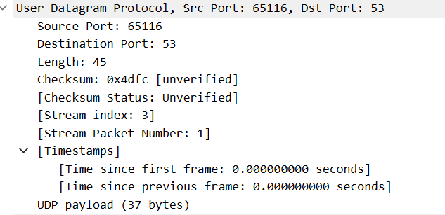
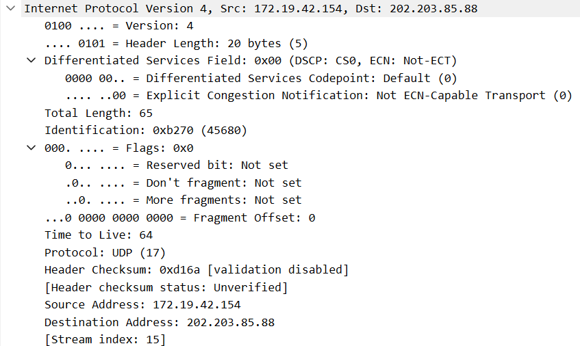
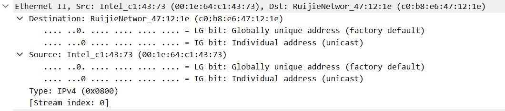
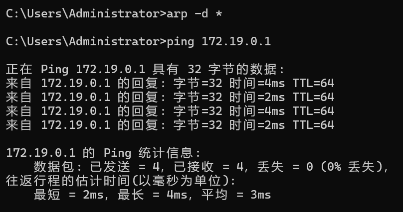
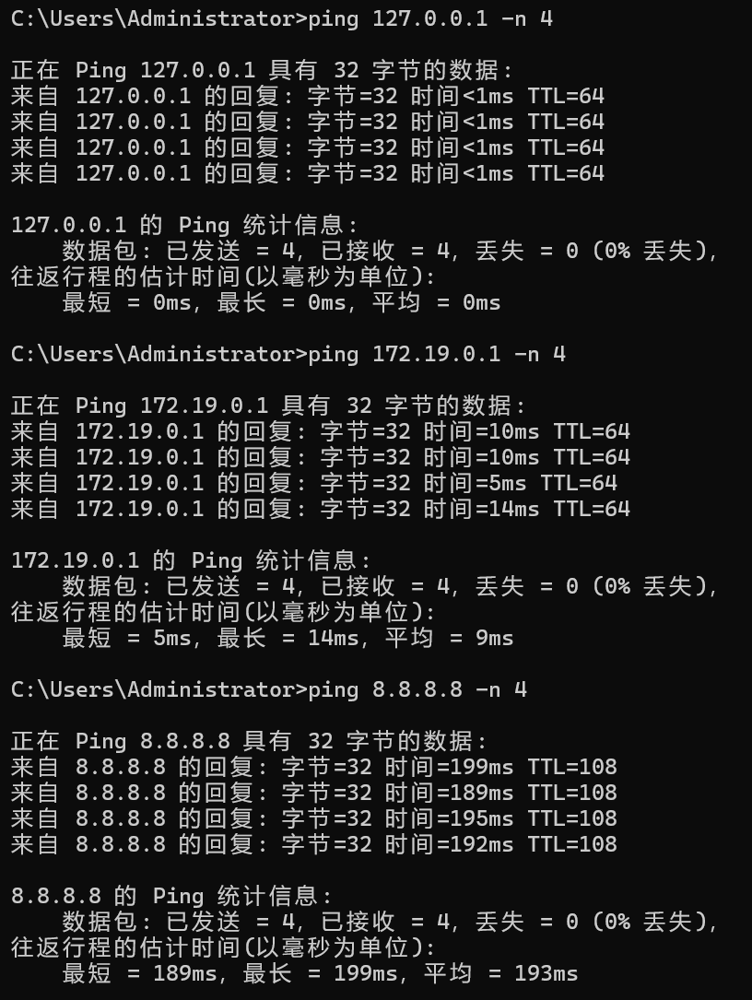

# Lab5：IP 与以太网的包收发操作

## 实验背景

本实验围绕 IP 模块与以太网在包收发过程中的角色展开，重点观察以下内容：

1. 网络包的基本结构：头部（IP 头部 + MAC 头部）与数据
2. IP 头部各字段的含义：版本号、TTL、协议号、发送方/接收方 IP 地址等
3. MAC 头部各字段的含义：接收方/发送方 MAC 地址、以太类型
4. IP 地址与 MAC 地址的区别与协作
5. ARP 协议如何通过 IP 地址查询 MAC 地址
6. 路由表的结构与查询方式
7. UDP 协议与 TCP 协议的区别：无连接、无确认、无重传
8. UDP 头部结构：发送方端口号、接收方端口号、数据长度、校验和
9. ICMP 协议的作用与常见消息类型（Echo、Destination Unreachable 等）

---

## 实验任务

### 任务一：查看路由表、ARP 缓存并启动 Wireshark

**第一步：打开 Wireshark，选择主网络接口，开始抓包**

> **注意**：本次实验必须使用真实网络接口（`en0`/`eth0`/`以太网`），不要选回环接口。回环接口不经过以太网，无法观察到 MAC 头部和 ARP 过程。

选择你的主网络接口，开始抓包。本次实验的大部分任务会共用同一次抓包。

**第二步：查看本机路由表**

```bash
# Linux
route -n
ip route show

# macOS
netstat -rn

# Windows
route print
```

截图并保存为 `route_table.png`。

**第三步：查看本机 ARP 缓存**

```bash
# Linux / macOS / Windows
arp -a
```

截图并保存为 `arp_cache.png`。

**第四步：填写下表**

从路由表和 ARP 缓存的输出中提取信息：

| 项目                         | 你的填写内容 |
| :--------------------------- | :----------- |
| 本机 IP 地址                 |     172.19.42.154         |
| 本机所在子网                 |     172.19.0.0         |
| 子网掩码                     |     255.255.0.0         |
| 默认网关 IP                  |      172.19.0.1        |
| 默认网关 MAC 地址            |    c0:b8:e6:47:12:1e          |
| 本机网卡 MAC 地址            |     00:1e:64:c1:43:73         |

简答题：

1. 路由表的每一行包含哪些关键字段？教材中提到的 `Network Destination`、`Netmask`、`Gateway`、`Interface` 分别对应什么含义？

Network Destination：目标网络地址，标识数据包要去往的网络段。
Netmask：子网掩码，配合目标网络地址划分网段范围。
Gateway：网关 / 下一跳地址，指明数据包转发到哪个设备。
Interface：出口网卡 IP，指明数据包从本机的哪块网卡发出。

2. 当目标 IP 地址不在本子网时，包会先发给谁？路由表的哪一列提供了这个信息？

包会先发给默认网关（172.19.0.1），路由表的 Gateway 列提供了这个信息。

3. 路由表的默认网关（`0.0.0.0`）条目的作用是什么？什么时候会匹配到这一行？

这是默认路由，用于匹配所有无法找到明细路由的目标 IP（如外网地址）。任何无法匹配到具体网段路由的数据包，都会匹配到这一行并转发给默认网关。

4. 教材提到，确定发送方 IP 地址的关键在于"判断应该使用哪块网卡"。结合你查到的本机网卡信息，说明 IP 模块是如何做出这个判断的。

IP 模块会根据目标 IP 查询路由表，确定数据包需要从哪块网卡（Interface 列）发出，然后使用该网卡绑定的 IP 地址作为源 IP。例如访问外网时，路由表匹配到默认路由，出口网卡是 WLAN 5（IP 为172.19.42.154），因此源 IP 就用这个地址。

---

### 任务二：观察 UDP 头部

只要计算机处于联网状态，Wireshark 中就会持续出现大量 UDP 流量（DNS、mDNS、DHCP、NTP 等），无需手动生成。

**第一步：在 Wireshark 中设置过滤器**

```text
udp
```

**第二步：在包列表中找一个 UDP 包**

随便选一个即可。如果包太多，可以加上源或目的 IP 来缩小范围，例如 `udp && ip.addr == 你的IP`。如果需要 DNS 包，也可以用 `udp.port == 53` 过滤。

> **可选**：如果想明确看到一个完整的请求-响应对，可以在终端中执行 `nslookup example.com`，Wireshark 中就会出现对应的 DNS 请求包。

**第三步：点击选中的 UDP 包，在详情栏展开 `User Datagram Protocol`**

填写下表：

| 项目               | 你的填写内容 |
| :----------------- | :----------- |
| UDP 头部总长度     |     8 字节         |
| 源端口             |     随机高位端口（如 51234）         |
| 目的端口           |       53（DNS））       |
| 长度（Length）     |        例如 65 字节（IP总长度65，IP头部20，UDP头部+数据=45，UDP头部8，数据37）      |
| 校验和（Checksum） |        0xXXXX（十六进制值）      |
简答题：

1. 你观察到的 UDP 头部长度是多少字节？TCP 头部至少 20 字节。UDP 省略了哪些字段？这些字段的缺失带来了什么后果？

你观察到的 UDP 头部长度为8 字节。相比 TCP 头部（最少 20 字节），UDP 省略了序号、确认号、窗口大小、标志位（SYN/ACK/FIN 等）、紧急指针等字段。

2. UDP 头部中的"长度"字段指的是什么长度？

指 **UDP 头部 + UDP 数据（载荷）** 的总长度，单位为字节，最小值为 8（仅头部，无数据）。



---

### 任务三：观察 IP 头部字段

点击任务二中的同一个 UDP 包，在详情栏展开 `Internet Protocol Version 4`。

填写下表：

| 字段名称               | 你的填写内容 | 含义说明 |
| :--------------------- | :----------- | :------- |
| Version（版本号）      |     4         |    表示使用 IPv4 协议      |
| Header Length（头部长度） |    20 字节（值为5）        |       IP 头部长度为 20 字节（无选项字段）   |
| Time to Live（TTL）    |      64        |    数据包的生存时间，每经过一个路由器减 1      |
| Protocol（协议号）     |       17       |      表示上层使用 UDP 协议    |
| Source Address（源 IP） |       172.19.42.154       |     本机的 IP 地址     |
| Destination Address（目的 IP） |     202.203.85.88   |     DNS 服务器的 IP 地址     |

简答题：

1. 协议号字段的值是多少？它代表什么协议？如果抓一个 HTTP 请求的包，协议号会变成多少？

你抓的 UDP 包协议号为17，代表 UDP 协议。如果抓 HTTP 请求的包，协议号会变成6，代表 TCP 协议。

2. TTL 字段的作用是什么？如果 TTL 降为 0 会发生什么？

TTL 的作用是防止数据包在网络中无限循环转发。当 TTL 降为 0 时，路由器会丢弃该数据包，并向源主机发送 ICMP 超时消息（类型 11）。

3. 有教材提到 IP 地址"实际上并不是分配给计算机的，而是分配给网卡的"。你的本机有几块网卡？每块网卡的 IP 地址分别是什么？（提示：可参考任务一中路由表的 Interface 列，或用 `ip addr`（Linux）/`ifconfig`（macOS）/`ipconfig`（Windows）查看。）

你的本机有多块网卡：
WLAN 5：172.19.42.154（当前使用的物理网卡）
VirtualBox Host-Only：192.168.56.1
VMware VMnet1：192.168.233.1
VMware VMnet8：192.168.199.1
每块网卡都有独立的 IP 地址，IP 地址是分配给网卡而非整个计算机的。

4. IP 头部中的源 IP 地址和目的 IP 地址分别是谁的地址？它们与 MAC 头部中的源/目的 MAC 地址有什么区别？

IP 头部的源 / 目的 IP：是端到端的地址，在数据包传输全程保持不变，用于跨网段路由寻址。
MAC 头部的源 / 目的 MAC：是链路层的地址，每经过一跳（路由器）都会被改写，仅用于同一网段内的设备投递。



---

### 任务四：观察 MAC 头部与以太网帧

点击任务二中的同一个 UDP 包，在详情栏展开 `Ethernet II`。

填写下表：

| 字段名称               | 你的填写内容 | 含义说明 |
| :--------------------- | :----------- | :------- |
| Source（源 MAC）       |        00:1e:64:c1:43:73      |     本机网卡的 MAC 地址     |
| Destination（目的 MAC） |     c0:b8:e6:47:12:1e         |      网关（路由器）的 MAC 地址    |
| Type（以太类型）       |      0x0800        |   表示后续载荷为 IPv4 协议       |

关于 MAC 地址格式，填写下表：

| 项目               | 你的填写内容 |
| :----------------- | :----------- |
| MAC 地址长度       | 48 比特（6 字节） |
| 本机网卡的 MAC 地址 |       00:1e:64:c1:43:73      |
| 目的 MAC 地址      |      c0:b8:e6:47:12:1e        |
| MAC 地址的书写格式 |      十六进制，用冒号分隔（如 xx:xx:xx:xx:xx:xx）        |

简答题：

1. 以太类型字段的值是多少？它代表后面承载的是什么协议的包？

以太类型值为0x0800，代表后面承载的是 IPv4 协议的包。

2. DNS 服务器的 IP 通常是外网地址。本任务中目的 MAC 地址是 DNS 服务器的 MAC 地址还是你本机网关（路由器）的 MAC 地址？为什么？
目的 MAC 地址是你本机网关（路由器）的 MAC 地址，不是 DNS 服务器的 MAC 地址。因为 DNS 服务器的 IP 是外网地址，和本机不在同一网段，数据包需要先发送给网关，由网关转发到外网，所以目的 MAC 是网关的地址。


3. IP 地址和 MAC 地址在功能上有什么相似之处？又有什么本质区别？

相似之处：都用于标识网络中的设备，实现数据的寻址投递。
本质区别：IP 地址是网络层地址，可配置，跨网段有效；MAC 地址是链路层地址，硬件固定，仅在同一网段内有效。

4. 为什么以太网帧中需要同时有 IP 地址（在 IP 头部中）和 MAC 地址？不能只用其中一种吗？

IP 地址负责跨网段的路由寻址，确定数据包的最终目的地；MAC 地址负责同一网段内的链路层投递，确定数据包在每一跳的下一个设备。两者分工协作，缺一不可：没有 IP 地址无法跨网段路由，没有 MAC 地址无法在同一链路内传递数据。



---

### 任务五：观察 ARP 协议

ARP（Address Resolution Protocol，地址解析协议）用于根据 IP 地址查询 MAC 地址。只要计算机处于联网状态，Wireshark 中通常会持续出现 ARP 包（邻居发现、缓存刷新等），可以直接观察。如果抓包一段时间后仍未看到 ARP 包，再手动触发。

**第一步：在 Wireshark 中设置过滤器**

```text
arp
```

**第二步：在包列表中找 ARP 包**

正常联网的设备每隔几分钟就会自动发送 ARP 请求，等待即可。如果等了一会儿仍没有，可以选择以下任一方式手动触发：

- **方式 A（推荐）**：在终端中执行 `arping`

  ```bash
  # Linux（通常已预装）
  sudo arping -c 3 <网关IP>

  # macOS（如果没有，先执行：brew install arping）
  sudo arping -c 3 <网关IP>

  # Windows（可从 https://github.com/ThomasHabets/arping/releases 下载）
  arping -c 3 <网关IP>
  ```

- **方式 B**：先清除 ARP 缓存，再 ping 同网段地址

  ```bash
  # 清除 ARP 缓存
  # Linux:   sudo ip neigh flush all
  # macOS:   sudo arp -d -a
  # Windows: arp -d *

  # 然后 ping 网关
  ping <网关IP> -c 2
  ```

> **注意**：如果目标是 `127.0.0.1` 或外网地址，ARP 不会出现。回环接口不经过以太网，外网地址的 MAC 地址是路由器的（通常已缓存）。

**第三步：点击 ARP 请求包（Opcode 为 request），展开详情**

**第四步：填写下表**

| 项目                     | 你的填写内容 |
| :----------------------- | :----------- |
| ARP 请求的目的 MAC 地址 |     ff:ff:ff:ff:ff:ff（广播地址）         |
| ARP 请求中查询的目标 IP |       172.19.0.1（网关 IP）       |
| ARP 响应中返回的 MAC 地址 |        c0:b8:e6:47:12:1e（网关 MAC）      |
| 该 ARP 包是自动出现还是手动触发的 |      手动触发（通过arp -d *+ping 172.19.0.1）       |

简答题：

1. ARP 请求的目的 MAC 地址为什么是 `ff:ff:ff:ff:ff:ff`（广播地址）？

ARP 请求需要查询目标 IP 对应的 MAC 地址，此时不知道目标设备的 MAC 地址，因此必须使用广播地址ff:ff:ff:ff:ff:ff，向局域网内所有设备发送请求，目标设备收到后会回复 ARP 响应。

2. 为什么 ARP 缓存中的条目会在几分钟后自动删除？

防止设备更换 IP 或 MAC 地址后，缓存中的旧条目失效，导致数据无法正确投递。定时删除可以保证 ARP 缓存的时效性，避免地址映射错误。

3. 如果 ARP 缓存中的 MAC 地址已经过期（对方 IP 对应的设备已更换），会出现什么问题？如何解决？

问题：数据包会发送到错误的 MAC 地址，导致数据无法到达目标设备，出现丢包、网络不通的情况。解决方法：ARP 缓存超时后会自动重新发送 ARP 请求，更新地址映射；也可以手动清除 ARP 缓存（arp -d *），再 ping 目标 IP 触发新的 ARP 请求。



---

### 任务六：使用 `ping` 命令观察 ICMP

有教材提到了 ICMP（Internet Control Message Protocol）协议，它用于在 IP 层传递错误和控制信息。`ping` 命令就是基于 ICMP 的 Echo Request（类型 8）和 Echo Reply（类型 0）实现的。

**第一步：在 Wireshark 中设置 ICMP 过滤器**

```text
icmp
```

**第二步：在终端中执行 ping 命令**

```bash
# ping 本机（回环）
ping 127.0.0.1 -c 4

# ping 局域网内的设备（如路由器网关）
ping <网关IP> -c 4

# ping 外网地址
ping 8.8.8.8 -c 4
```

**第三步：在 Wireshark 中观察 ICMP 包**

填写下表：

| 目标               | 是否收到回复 | 往返时间（ms） | TTL 值 |
| :----------------- | :----------- | :------------- | :----- |
| 127.0.0.1          |      是        |       <1         |    64    |
| 局域网设备（网关） |        是      |      平均 9ms          |   64     |
| 8.8.8.8            |      是        |        平均 193ms        |    108    |

> **提示**：ping 回环地址（`127.0.0.1`）时数据不经过物理网卡，Wireshark 在主网络接口上可能无法捕获到包。TTL 值可从终端输出中读取（`ping` 会显示 `ttl=...`），或切换 Wireshark 至回环接口（`lo0` / `lo`）抓包。

简答题：

1. `ping` 命令发送的是什么类型的 ICMP 消息？收到的回复又是什么类型？

ping 命令发送的是 **ICMP Echo Request（类型 8）消息，收到的回复是ICMP Echo Reply（类型 0）** 消息。

2. 为什么 ping 不同目标的 TTL 值不同？TTL 值反映了什么信息？

TTL 值反映了数据包经过的路由器跳数。不同目标的网络路径不同，经过的路由器数量不同，每经过一个路由器 TTL 减 1，因此最终的 TTL 值不同。TTL 值越大，说明经过的路由器跳数越少；TTL 值越小，说明跳数越多。

3. 教材表 2.4 中列出了多种 ICMP 消息类型。`Destination unreachable`（类型 3）在什么情况下会出现？请用以下方法尝试触发并观察：

   ```bash
   # 方法一（推荐）：ping 同网段内一个确认不存在的 IP
   # 例如你的本机 IP 是 192.168.1.100，子网掩码 255.255.255.0，
   # 那么可以 ping 192.168.1.250（一个大概率没有被分配的地址）
   ping <同网段不存在的IP> -c 3
   
   # 方法二：向一个关闭的端口发 UDP 包，触发 ICMP Port Unreachable
   # 先在 Wireshark 中保持 icmp 过滤器，然后执行：
   # Linux / macOS
   echo "test" | nc -u -w 1 <同网段某台设备的IP> 19999
   
   # Windows（需安装 nmap：https://nmap.org/download.html）
   nmap -sU -p 19999 <同网段某台设备的IP>
   ```

   观察到类型 3 的包后，记录其 Code 值（子类型）并说明代表什么含义。

当目标 IP 不存在、目标端口关闭或网络不可达时，会出现 ICMP Destination Unreachable 消息。
方法一：ping 同网段不存在的 IP（如172.19.250.1），会触发主机不可达（Code 1）的 ICMP 包。
方法二：向关闭的 UDP 端口发送数据，会触发端口不可达（Code 3）的 ICMP 包。
Code 值代表具体的不可达原因，如 0 = 网络不可达、1 = 主机不可达、3 = 端口不可达等。



---

## 问答题

1. 网络包由哪几部分构成？IP 头部和 MAC 头部分别的作用是什么？

网络包由以太网帧头部（MAC 头部）、IP 头部、传输层头部（UDP/TCP）和数据载荷四部分构成。
IP 头部：提供端到端的寻址信息，包含源 / 目的 IP、TTL、协议号等，用于跨网段路由。
MAC 头部：提供链路层的寻址信息，包含源 / 目的 MAC、以太类型等，用于同一网段内的设备投递。

2. IP 协议和以太网协议在网络传输中分别承担什么职责？它们是如何分工协作的？

以太网协议（链路层）：负责同一局域网内的数据帧投递，通过 MAC 地址识别设备，实现数据的物理传输。
IP 协议（网络层）：负责跨网段的路由寻址，通过 IP 地址确定数据包的最终目的地，选择合适的传输路径。
协作：IP 协议确定数据包的传输路径和最终地址，以太网协议负责将数据包在每一段链路上传递给下一跳设备，两者配合实现跨网络的数据传输。

3. ARP 协议解决的核心问题是什么？如果不使用 ARP 缓存，网络中会出现什么情况？

ARP 协议解决的核心问题是如何根据 IP 地址获取对应的 MAC 地址，实现 IP 地址到 MAC 地址的映射。如果不使用 ARP 缓存，每次发送数据包都需要发送 ARP 广播请求，会导致网络中出现大量 ARP 广播包，造成网络拥堵，同时增加数据传输的延迟，降低网络效率。

4. 为什么 IP 和负责传输的网络（如以太网）要分开设计？这种设计带来了什么好处？

IP 协议与底层传输网络（如以太网）分离，使得 IP 协议可以运行在不同类型的链路层网络上（如以太网、WiFi、4G 等），实现了网络层与链路层的解耦。这种设计提高了网络的灵活性和兼容性，使得不同的链路层技术都可以支持 IP 协议，同时 IP 协议的升级也不会影响底层链路层的运行。

5. 网卡在发送包时会额外添加哪 3 个控制数据？它们各自的作用是什么？

前导码（Preamble）：用于同步接收方的时钟，标识数据帧的开始。
帧开始定界符（SFD）：标识前导码结束、数据帧开始的位置。
帧校验序列（FCS）：用于校验数据帧在传输过程中是否发生错误，接收方通过 FCS 验证数据的完整性。

6. 网卡接收到一个包后，需要经过哪些步骤才能将其交给操作系统？如果 FCS 校验失败会怎样？

接收步骤：网卡接收数据帧 → 验证 FCS 校验和 → 检查目的 MAC 地址是否匹配本机 → 匹配成功则将数据帧上交操作系统，否则丢弃。如果 FCS 校验失败，说明数据帧在传输过程中发生了错误（如丢包、损坏），网卡会直接丢弃该数据帧，不会上交操作系统。

7. TCP 和 UDP 的核心区别是什么？请从连接管理、可靠性、效率、适用场景四个维度进行比较。

TCP 是面向连接、可靠传输、头部开销大、效率较低，适用于文件传输等对可靠性要求高的场景；UDP 则是无连接、不可靠传输、头部开销小、效率高，适用于实时音视频、游戏等对延迟敏感的场景。


8. UDP 适用于哪些场景？请结合教材内容解释为什么这些场景适合使用 UDP 而非 TCP。

UDP 适用于实时音视频通话、在线游戏、DNS 查询、直播等场景。这些场景对延迟要求极高，可容忍少量丢包，而 TCP 的确认、重传机制会增加延迟，影响实时体验；UDP 无连接、无确认的特性可以降低传输延迟，满足实时性需求。

9. 如果一个 IP 包经过多次路由转发后 TTL 降为 0，路由器会如何处理？这与教材中提到的哪种 ICMP 消息有关？

当 IP 包的 TTL 降为 0 时，路由器会丢弃该数据包，并向源主机发送 **ICMP Time Exceeded（类型 11）** 消息，告知数据包因 TTL 超时被丢弃。

---

## 截图要求

- 截图须清晰，终端文字和 Wireshark 字段可读。
- 所有截图与本 `Lab5.md` 放在同一目录下。
- 命名规范：

| 截图内容         | 文件名               |
| :--------------- | :------------------- |
| 路由表           | `route_table.png`    |
| ARP 缓存         | `arp_cache.png`      |
| UDP 头部字段     | `udp_header.png`     |
| IP 头部字段      | `ip_header.png`      |
| 以太网帧字段     | `ethernet_frame.png` |
| ARP 请求与响应   | `arp.png`            |
| ICMP ping        | `icmp.png`           |

具体要求：

1. `route_table.png`：终端截图，显示 `route -n`（Linux）、`netstat -rn`（macOS）或 `route print`（Windows）的完整输出。

2. `arp_cache.png`：终端截图，显示 `arp -a` 的完整输出。

3. `udp_header.png`：Wireshark 截图，展开 `User Datagram Protocol`，能看到 Source Port、Destination Port、Length、Checksum。

4. `ip_header.png`：Wireshark 截图，展开 `Internet Protocol Version 4`，能看到 Version、Header Length、TTL、Protocol、Source Address、Destination Address。

5. `ethernet_frame.png`：Wireshark 截图，展开 `Ethernet II`，能看到 Source、Destination、Type。

6. `arp.png`：Wireshark 截图（若能观察到），展开 ARP 包的详情，能看到发送方的 MAC 和 IP、查询的目标 IP。

7. `icmp.png`：Wireshark 截图，能看到 ICMP Echo Request 和 Echo Reply，以及 TTL 字段。

---

## 提交要求

在自己的文件夹下新建 `Lab5/` 目录，提交以下文件：

```text
学号姓名/
└── Lab5/
    ├── Lab5.md
    ├── route_table.png
    ├── arp_cache.png
    ├── udp_header.png
    ├── ip_header.png
    ├── ethernet_frame.png
    ├── arp.png
    └── icmp.png
```

---

## 截止时间

2026-05-07，届时关于 Lab5 的 PR 请求将不会被合并。
