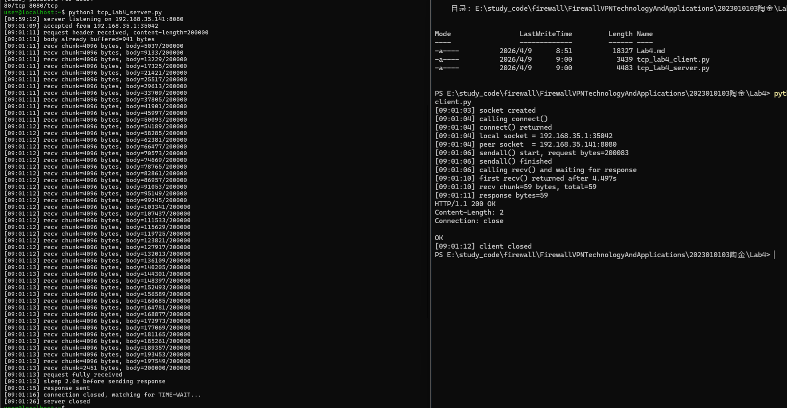
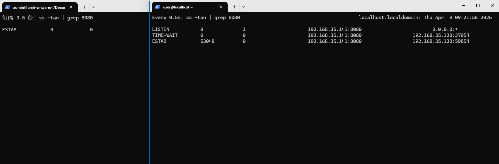
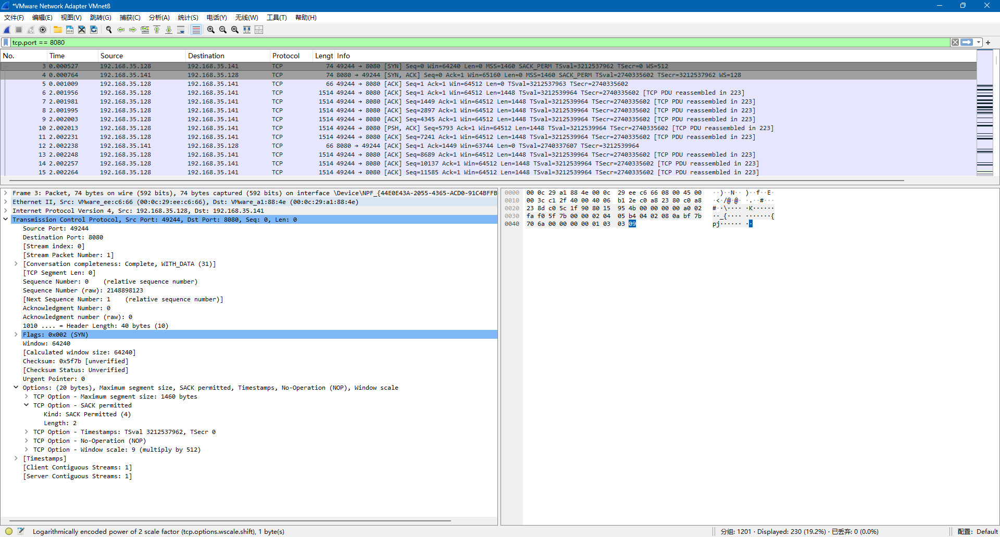
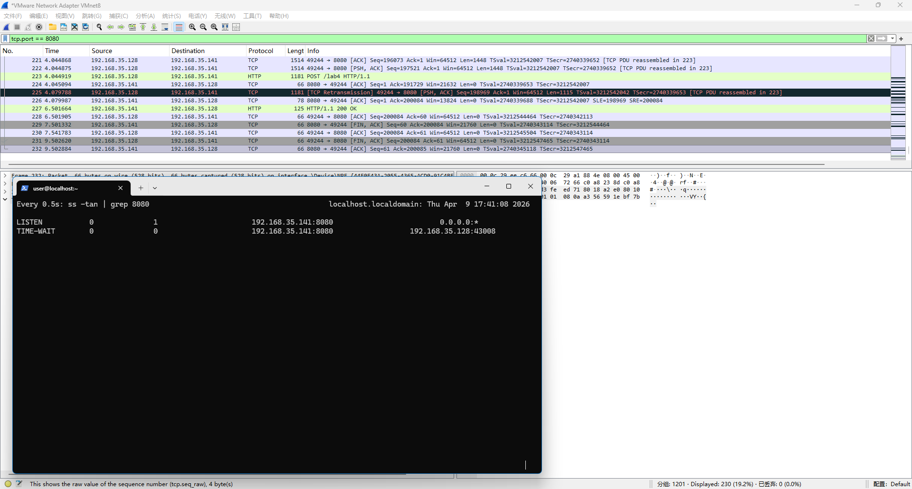
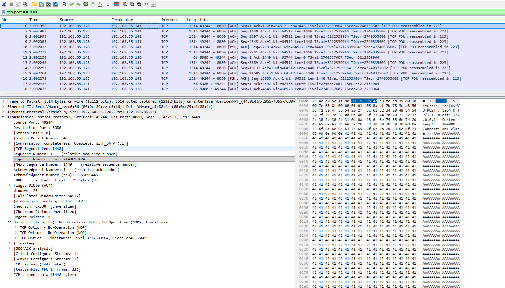
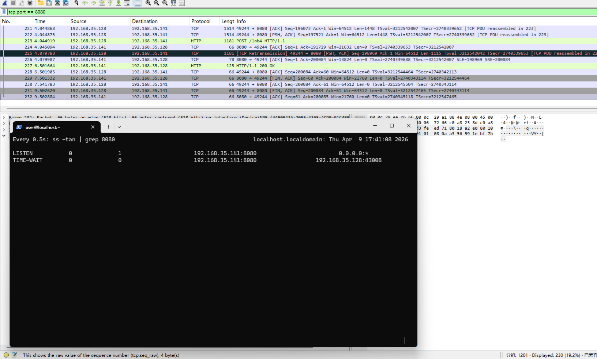

# Lab4：看见TCP 我不怕不怕啦

## 实验背景

本实验围绕一条 TCP 连接的完整生命周期展开，重点观察以下内容：

1. `socket()`、`listen()`、`accept()`、`connect()` 的职责区别
2. "连接"为什么本质上是交换控制信息而不是物理连线
3. TCP 头部中的端口号、序号、ACK 号、标志位、窗口、头部长度、可选字段
4. 三次握手如何建立收发准备
5. 应用层大块数据如何被 TCP 按 MSS 拆分
6. `Sequence Number` 与 `Acknowledgment Number` 如何配合工作
7. `recv()` 为什么会阻塞等待数据
8. 接收窗口如何反映接收方处理能力
9. ACK 与窗口更新为什么常常会被合并
10. `FIN` / `ACK` 如何完成断开
11. 为什么连接结束后套接字不会立刻删除

---

## 实验任务

### 任务一：准备实验环境并记录运行信息

**第一步：准备好四个窗口**

整个实验需要同时观察多个界面，建议在开始前把窗口布局摆好：

- **终端 A**：运行服务端
- **终端 B**：运行客户端
- **终端 C**：持续监控套接字状态（全程保持开启，不要关）
- **Wireshark**：抓包

**第二步：在终端 C 里启动持续监控**

TCP 状态变化很快，等你手动敲完 `ss` 命令再回车，状态可能已经过去了。用下面的命令让终端 C 每 0.5 秒自动刷新一次，之后只需要盯着这个窗口就行：

```bash
# Linux
watch -n 0.5 'ss -tan | grep 38090'

# macOS（没有 watch，用循环代替）
while true; do netstat -an | grep 38090; echo "---"; sleep 0.5; done

# Windows（Git Bash执行）
while true; do netstat -ano | grep 38090; echo "---"; sleep 0.5; done
```

如果你换了端口，把 `38090` 替换成实际端口。

**第三步：打开 Wireshark，选回环接口，填好过滤器，开始抓包**

回环接口在不同系统里名字不同：

| 系统 | 接口名 |
|:-----|:-------|
| Linux | `lo` |
| macOS | `lo0` |
| Windows | `Adapter for loopback traffic capture`（需提前安装 Npcap 并勾选回环支持） |

在显示过滤器里输入：

```text
tcp.port == 38090
```

然后点击开始抓包（蓝色鲨鱼鳍图标）。**先开始抓包，再运行脚本**，否则握手包会被漏掉。

**第四步：启动脚本**

```bash
# 终端 A
python3 tcp_lab4_server.py

# 终端 B（等服务端打印出 server listening on ... 后再运行）
python3 tcp_lab4_client.py
```

如果 `38090` 已被占用，两端都加环境变量换端口，同时记得把 Wireshark 过滤器和终端 C 里的端口号也改掉：

```bash
LAB4_PORT=38123 python3 tcp_lab4_server.py
LAB4_PORT=38123 python3 tcp_lab4_client.py
```

**第五步：填写下表**

| 项目                                | 你的填写内容 |
| :---------------------------------- | :----------- |
| 服务端监听地址                      |192.168.35.141|
| 服务端监听端口                      |8080|
| 客户端本地临时端口                  |35042|
| 客户端请求总字节数                  |200083|
| 服务端响应内容                      |request header received, content-length=200000|
| 客户端 `connect()` 返回前后的时间点 |前：09:01:04；后：09:01:04|
| 客户端首次收到响应前等待了多久      |4.497s|

各项数值均可直接从终端输出读取：服务端监听信息在 `server listening on ...`，客户端本地端口在 `local socket = ...`，请求字节数在 `sendall() start, request bytes=...`，等待时间在 `first recv() returned after ...s`。



---

### 任务二：观察套接字创建与连接建立

1. 服务端启动后，观察终端 C 出现 `LISTEN` 状态，截图留存。
2. 在终端 B 里启动客户端，观察它依次打印 `socket created`、`calling connect()`、`connect() returned`。
3. 客户端打印 `connect() returned` 之后，观察终端 C 出现 `ESTABLISHED`，截图留存。脚本在 `connect()` 返回后有 2 秒停顿，这段时间足够截图。

填写下表：

| 阶段                             | 你的填写内容 |
| :------------------------------- | :----------- |
| 服务端启动、客户端未连入时的状态 |`LISTEN`|
| `connect()` 返回后服务端状态     |`ESTAB`|
| `connect()` 返回后客户端状态     |`ESTAB`|

简答题：

1. 服务端在客户端连接前为什么处于 `LISTEN`？
> 在TCP网络通信中，服务端在客户端连接前处于`LISTEN`状态，是因为它执行了被动打开的操作，准备好接收外部的连接请求。


2. 为什么这时还没有真正建立 TCP 连接？
> 服务器处于`LISTEN`状态时是处于“待机”状态，这时没有客户端尝试连接它，或者客户端的连接请求被中间的防火墙拦截了，因此并没有建立真正的TCP连接。


3. `socket()` 与 `connect()` 的区别是什么？
> `socket()`是为连接分配了资源但没有连接到任何地方；`connect()`是建立连接，将 `socket()`创建的描述符与远程服务器的IP和端口绑定，并触发TCP三次握手。


4. 为什么 `connect()` 返回后才进入可稳定收发数据的状态？
> 因为`connect()`函数的返回，本质上标志着TCP三次握手的成功完成，即连接建立成功。


5. 为什么"网线一直连着"不等于"TCP 连接已经建立"？
> 网线在物理层/数据链路层只管把比特流传过去，它不关心对方是谁。而TCP在传输层需要确认对方在线和确认双向通畅


6. 这里的"连接"更准确地说是在做什么？
> TCP 的“连接”在做的其实是“同步两个主机的状态”保证通讯能够正常进行。




---

### 任务三：观察三次握手与 TCP 头部字段

**定位握手包**：在 Wireshark 过滤器里输入下面的条件，可以屏蔽中间的数据包，只留下握手和断开阶段的控制包：

```text
tcp.port == 38090 && (tcp.flags.syn == 1 || tcp.flags.fin == 1)
```

包列表最前面的三个包就是三次握手（SYN → SYN-ACK → ACK）。

**找到各字段的位置**：点击某个握手包，在下方详情栏展开 `Transmission Control Protocol`。源端口、目的端口、Seq、Ack、Flags、Window、Header Length 都在这里。TCP 选项在最底部的 `Options` 子项里，展开后可以看到 MSS、Window Scale、SACK Permitted，注意这三项只出现在带 SYN 标志的包里，纯 ACK 包里没有。

**关于序号显示**：Wireshark 默认开启相对序号，会把每个方向的初始序号归零显示，所以 SYN 包的 Seq 看起来是 `0`，而不是真实的随机大数。这是正常现象，实验报告按 Wireshark 显示的值填写即可。如果你想看真实值，可以去 `Edit → Preferences → Protocols → TCP` 里取消勾选 `Relative sequence numbers`。

填写下表：

| 报文       | 源端口 | 目的端口 | Seq  | Ack  | Flags | Window | Header Length |
| :--------- | :----- | :------- | :--- | :--- | :---- | :----- | :------------ |
| 第一次握手 |49244|8080|0|0|0x002 (`SYN`)|64240|40 bytes|
| 第二次握手 |8080|49244|0|1|0x0012 (`SYN, ACK`)|65160|40 bytes|
| 第三次握手 |49244|8080|1|1|0x0010 (`ACK`)|126|32  bytes|

第一次握手（SYN）的 Ack 字段在 Wireshark 里通常显示为空或 `0`，这是正常的，因为此时客户端还没有收到服务端的任何数据。Header Length 在没有选项时是 20 字节，握手包因为携带了 MSS 等选项通常是 28 或 32 字节。

| TCP 选项       | 你的填写内容 |
| :------------- | :----------- |
| MSS            |1460 byte|
| Window Scale   |9|
| SACK Permitted |4|

回环接口的 MSS 通常是 65495（因为回环 MTU 是 65536，比以太网的 1500 大得多），这会影响后续任务五里是否能观察到分段。

简答题：

1. 发送方和接收方端口号在连接阶段的作用是什么？
> 端口号在连接阶段用于标识特定的应用程序。发送方通过“目的端口”定位接收方主机上的目标服务，而“源端口”则作为接收方回传数据的逻辑地址，确保响应能准确送达发起请求的特定进程。


2. TCP 头部如何帮助找到目标套接字？
> TCP头部包含源端口和目的端口，结合IP头部的源IP和目的IP，构成了五元组（源IP、目的IP、源端口、目的端口、协议）。操作系统利用这个唯一的五元组在内存中检索并匹配对应的套接字，从而将数据包准确递交给关联的应用程序。


3. 为什么初始序号不是简单固定从 1 开始？
> 为了安全性和防止数据混淆。如果序号固定或可预测，攻击者容易伪造TCP包进行攻击（如 TCP 序列号预测攻击）。此外，随机化的初始序号能避免因网络延迟导致“前一次连接”的残留数据包被“当前连接”误接收。


4. 为什么 TCP 可选字段更容易在连接阶段看到？
> 因为连接阶段是双方协商通信能力的关键窗口。诸如MSS、Window Scale和SACK等关键参数，只需在建立连接时确认一次，后续数据传输阶段通常不再需要重复发送这些配置信息，以节省头部开销。




---

### 任务四：区分头部中的控制信息和套接字中的控制信息

用以下过滤器分别找到两类报文：

```text
# 纯控制报文（无应用数据）
tcp.port == 38090 && tcp.len == 0

# 携带应用数据的报文
tcp.port == 38090 && tcp.len > 0
```

从纯控制报文里选一个（SYN、纯 ACK 或 FIN-ACK 都可以），从数据报文里选一个（客户端发请求或服务端发响应的包）。

填写下表：

| 项目                   | 你的填写内容 |
| :--------------------- | :----------- |
| 纯控制报文的类型       |`SYN`|
| 携带应用数据的报文类型 |`PSH, ACK`|
| 头部中的控制信息举例   |Sequence Number: 5793|
| 套接字中的控制信息举例 |Source Port: 49244 Destination Port: 8080|

简答题：

1. 为什么"头部中的控制信息"和"套接字中的控制信息"不是同一件事？
> TCP头部控制信息是外部可见的“交换信息”。它是网络协议规定的固定格式，随数据包在互联网上穿梭；套接字控制信息是操作系统内部的“运行状态”。它是保存在内存中的数据结构，记录了诸如重传定时器、读写缓冲区指针、拥塞窗口等本地管理细节。


---

### 任务五：观察数据分段、序号与 ACK

客户端发送的请求体是 200000 字节，超过了回环接口 MSS（约 65495 字节），因此应该可以在 Wireshark 里看到多个连续的数据段。用下面的过滤器找到客户端发出的数据包：

```text
tcp.srcport != 38090 && tcp.port == 38090 && tcp.len > 0
```

在包列表里连续选几个数据段，对比它们的 Seq 值。相邻两段的关系是：后一段的 Seq = 前一段的 Seq + 前一段的 TCP Segment Len。

找服务端返回给客户端的纯 ACK 报文：

```text
tcp.srcport == 38090 && tcp.flags.ack == 1 && tcp.len == 0
```

填写下表：

| 数据段  | Seq  | Ack  | TCP Segment Len | Flags |
| :------ | :--- | :--- | :-------------- | :---- |
| 第 1 段 |1|1|1448|0x0010 (`ACK`)|
| 第 2 段 |1449|1|1448|0x0010 (`ACK`)|
| 第 3 段 |2897|1|1448|0x0010 (`ACK`)|

| ACK 报文 | Ack Number | Flags | Window |
| :------- | :--------- | :---- | :----- |
| 第 1 个  |1449|0x0010 (`ACK`)|498|
| 第 2 个  |2897|0x0010 (`ACK`)|487|
| 第 3 个  |4345|0x0010 (`ACK`)|476|

| 项目                         | 你的填写内容 |
| :--------------------------- | :----------- |
| 是否发生分段                 |是|
| 握手中观察到的 MSS           |1460 bytes|
| 单段长度与 MSS 的关系        |单段长度 $\le$ MSS|
| ACK 号大致确认到了第几个字节 |确认到最后一段的`Seq` + `Len`|

简答题：

1. 应用程序是否直接决定每个网络包的数据长度？为什么？
> 不直接决定。应用程序只负责将数据交给发送缓冲区。TCP协议栈会根据网络状态、窗口大小和MSS限制，自主决定何时以及将多少数据装入一个网络包中发送。


2. 大块应用数据为什么会被拆分？
> 主要是为了适配链路层的传输限制。如果数据包超过物理链路能承载的最大长度，会导致IP层分片，增加丢包风险和处理压力。拆分为较小的TCP段可以提高传输效率和重传的灵活性。


3. `MSS` 与 `MTU` 的关系是什么？
> MSS是MTU减去协议头部后的净负荷大小，MTU是物理链路的上限，而MSS是TCP为了避免分片而协商出的单个报文段最大数据长度。


4. "一次 `sendall()`"与"一个 TCP 包"之间是什么关系？
> 它们是多对多或一对多的流式关系。`sendall()`是应用层的操作，可能触发一个TCP包，也可能因为数据量大被拆分成多个包。


5. 为什么 ACK 体现的是累计确认？
> 为了提高传输效率和鲁棒性。累计确认表示“该序号之前的所有数据都已正确收到”，这样即使中间某个`ACK`丢失，只要后续的`ACK`到达，发送方就知道之前的数据也成功了，减少了不必要的重传。


6. 如果中间某一段丢失，ACK 会出现什么变化？
> `ACK`会“停滞”在丢失位置的前一个序号。即使后续更大序号的包到达了，接收方也只能反复发送丢失位点之前的确认号，直到丢失的那一段被补齐，`ACK`才会跳跃到最新接收到的连续序号。





---

### 任务六：观察 `recv()` 阻塞与窗口字段

`recv()` 的等待时间直接从客户端终端读取，`calling recv() and waiting for response` 到 `first recv() returned after ...s` 之间就是等待时长，脚本已经帮你计算好了。

在 Wireshark 里找窗口值：用过滤器 `tcp.port == 38090 && tcp.flags.ack == 1` 列出所有 ACK 包，点击其中一个，在详情栏 `Transmission Control Protocol` 里找 `Window` 字段。如果同时显示了 `Calculated window size`，优先看这个值，它已经把 Window Scale 的缩放算进去了，是对方实际能接收的字节数。

如果包列表的 Info 列出现了 `[TCP Window Update]` 标注，说明这个包的主要目的是通知对方窗口变化，重点观察它的 `Window` 字段。

填写下表：

| 项目                                   | 你的填写内容 |
| :------------------------------------- | :----------- |
| 客户端开始调用 `recv()` 的时间         |09:01:06|
| 客户端第一次收到响应的时间             |09:01:10|
| `recv()` 是否立刻返回                  |否|
| 首次收到响应前等待了多久               |4.497s|
| `recv()` 等待期间连接是否已经建立      |是|
| 第 1 个 ACK 报文的窗口值               |65160|
| 第 2 个 ACK 报文的窗口值               |64512|
| 第 3 个 ACK 报文的窗口值               |64512|
| 窗口值是否变化                         |是|
| 若变化，变化趋势                       |先减小后恢复|
| ACK 与窗口更新是否可以出现在同一个包中 |是|
| 是否看到 RTT 或 ACK 往返时间相关信息   |是|

简答题：

1. "连接建立"和"应用收到数据"之间是什么关系？
> 连接建立是数据传输的前提。只有在“三次握手”成功、内核创建并初始化好套接字控制块后，TCP协议栈才会接受对方发来的应用数据。连接建立标志着双方已协商好初始序号和窗口大小，具备了可靠传输的基础。


2. 为什么说 `read` / `recv` 在数据未到达时会被挂起？
> 这是操作系统的阻塞IO机制。当应用程序调用这些接口时，如果内核接收缓冲区为空，进程会进入“等待状态”并让出CPU资源。直到网络包到达、经过协议栈处理并放入缓冲区后，内核才会唤醒该进程继续执行。


3. 窗口字段反映了接收方哪方面的能力？
> 窗口字段直接反映了接收方的剩余缓冲区容量。它告诉发送方：“我目前还能容纳多少字节的数据”。这体现了接收方处理数据的速度与网络传输速度之间的平衡能力。


4. 为什么发送方不能无限制连续发送数据？
> 为了防止缓冲区溢出和网络拥塞。如果发送速度超过接收方的处理能力，数据会被丢弃；如果超过网络的承载能力，会导致路由器排队延迟甚至崩溃。TCP必须通过流量控制和拥塞控制来约束发送速率。


5. 滑动窗口为什么既提高效率又避免压垮接收方？
> 滑动窗口允许发送方在等待确认之前连续发送多个包，极大提升了链路利用率；同时，它受接收方反馈的窗口大小限制，动态调整发送上限，确保发送量始终在接收方的承受范围内。


---

### 任务七：观察响应返回与双向 `seq/ack`

TCP 的 Seq/Ack 是双向独立的，客户端有自己的发送序号，服务端有自己的发送序号。用下面的过滤器只看服务端发出的数据包（源端口是 38090，有应用数据）：

```text
tcp.srcport == 38090 && tcp.len > 0
```

紧跟在服务端数据包后面的、客户端发出的 ACK 包，其 Ack Number 确认的就是服务端的发送序号。

填写下表：

| 项目                     | 你的填写内容 |
| :----------------------- | :----------- |
| 服务端响应数据报文的 Seq |1|
| 服务端响应数据报文的 Ack |1449|
| 客户端确认报文的 Ack     |1|

简答题：

1. 为什么 TCP 的 `seq/ack` 是双向分别计算的？
> 因为TCP是全双工的。每一方都既是发送者也是接收者，必须各自维护一套独立的序列号来记录自己发送了多少数据，以及一套确认号来确认收到了对方多少数据，互不干扰。


2. 为什么双方都需要各自的初始序号？
> 为了确保双向数据传输的可靠性。每方必须告知对方自己发送数据的起始坐标，以便对方能正确排序、去重并发现丢失。如果只使用一方的序号，另一方发送的数据将无法被追踪和确认，导致通信只能单向进行。


3. 为什么发送应用数据时报文通常仍然带 `ACK`？
> 这是为了提高传输效率，采用了“稍带确认”机制。由于TCP头部始终包含确认号字段，在发送应用数据时顺便填入最新的确认号，可以避免单独发送一个纯ACK报文，从而减少网络中的小包数量，降低带宽和CPU的处理开销。


---

### 任务八：观察连接断开与套接字延迟删除

用下面的过滤器精确定位所有带 FIN 的包：

```text
tcp.port == 38090 && tcp.flags.fin == 1
```

通常会看到两个 FIN 包（双方各一个）。看第一个 FIN 包的源端口，就能判断谁先发起断开。

**关于 TIME-WAIT**：TIME-WAIT 只出现在主动发起关闭的一方（先发 FIN 的那端）。服务端脚本在 `conn.close()` 之后会继续运行 10 秒再退出，这段时间可以在终端 C 里观察 TIME-WAIT。Linux 上 TIME-WAIT 通常持续约 60 秒，macOS 上可能较短，如果没有观察到请如实说明。

填写下表：

| 项目                                    | 你的填写内容 |
| :-------------------------------------- | :----------- |
| 谁先发送 FIN                            |客户端|
| 关闭阶段共观察到几个带 FIN 的报文       |2|
| 最终 ACK 是否可见                       |是|
| 关闭后是否观察到 `TIME-WAIT` 或等价现象 |是|

简答题：

1. 为什么关闭连接不能只发一个结束通知？
> 因为TCP是全双工通信，发送方关闭连接仅代表它不再发送数据，但不代表它不能接收数据。双方必须独立完成“不再发送数据”的声明（各发一个 FIN）并得到对方确认，才能确保双方的数据都已完整传输。


2. 为什么连接结束后套接字不会立刻删除？
> 为了进入`TIME_WAIT`状态。这有两个主要目的：一是确保最后一个`ACK`能送达对方，如果对方没收到会重发`FIN`，此时套接字必须存在才能回应；二是防止“已失效的报文”干扰新连接，通过等待一段时间，让网络中残留的所有该连接的数据包都自然消失。


3. 如果最后一个 ACK 丢失，而旧套接字已经立刻删除，可能带来什么问题？
> 这会导致连接无法正常释放且新连接可能数据错乱。由于没有套接字处理对方重发的`FIN`，对方会因收不到回复而一直处于半关闭状态，浪费资源。




---

## 问答题

1. TCP 的"连接"到底意味着什么？它为什么不是"把网线连上"？
> TCP的“连接”是逻辑上的状态同步，而非物理线路的接通。它本质上是通信双方在各自内存中建立的一套数据结构，记录了序号、窗口大小、连接状态等信息。物理网线早已连通，连接是为了让双方在软件层面达成“可以开始可靠传输”的共识。


2. 三次握手为什么能让双方进入可通信状态？
> 三次握手通过交换`SYN`和`ACK`，让双方确认彼此的接收与发送能力均正常，并安全地同步初始序列号。这建立了一个双向的信任通道，确保后续数据能按序组装且丢失可查，从而进入可通信状态。


3. TCP 头部中的控制字段如何支撑收发数据？
> TCP头部通过序号确保数据按序到达，通过确认号告知已收到的范围，通过控制位如`SYN/FIN`管理连接生命周期。这些字段协同工作，使得即使在不可靠的IP层上也能实现可靠的字节流传输。


4. ACK、窗口、等待时间为什么会共同影响 TCP 的可靠传输？
> 这三者构成了TCP的反馈闭环：`ACK`确认送达，等待时间决定何时补发，窗口限制发送量以匹配接收能力。它们共同确保了数据“不丢、不重、不乱且不溢出”。


5. 断开连接为什么仍然需要严格的控制信息交换？
> 为了确保数据的完整性。TCP是全双工的，必须通过严格的`FIN`和`ACK`交互来确认双方都已经发完了所有数据，并给残留包留出消失时间，防止“旧连接的包”污染“新连接的数据”。


6. 如果服务端根本没有启动，客户端调用 `connect()` 时会看到什么现象？
> 出现连接被拒绝的情况。这是因为客户端发送`SYN`包后，服务端的操作系统发现没有进程监听该端口，会直接回传一个带有`RST`标志的报文，强制关闭连接尝试。


7. 如果中途人为制造丢包，ACK、重传、窗口之间会出现什么变化？
> 丢包会导致接收方发送重复`ACK`，发送方检测到后触发重传。同时，发送方会认为网络拥塞，主动缩小拥塞窗口以减缓发送速度，直至网络恢复稳定。


8. 如果把客户端发送的数据改得更大，窗口字段和分段情况会如何变化？
> 如果数据量超过`MSS`，TCP会将其分段为多个网络包。同时，发送方的行为会受接收方窗口字段的严格限制：如果数据量触及窗口上限，发送方必须停止发送，等待`ACK`腾出窗口空间。


9. 如果把服务端读取速度改得更慢，是否更容易看到窗口更新甚至零窗口？
> 是。如果服务端读取变慢，接收缓冲区会被填满，导致返回给发送方的窗口字段不断减小。最终可能出现“零窗口”通告，此时发送方必须停止发送并进入持续探测状态。


---

## 截图要求

- 截图须清晰，终端文字和 Wireshark 字段可读。
- 所有截图与本 `Lab4.md` 放在同一目录下。
- 命名规范：

| 截图内容               | 文件名                  |
| :--------------------- | :---------------------- |
| 服务端与客户端运行结果 | `run.png`               |
| `ss` 状态变化          | `states.png`            |
| 三次握手与 TCP 选项    | `handshake_header.png`  |
| 大请求分段与 MSS       | `segmentation.png`      |
| ACK 与窗口观察         | `ack_window.png`        |
| 断开与最终状态         | `teardown_timewait.png` |

具体要求：

1. `run.png`：终端截图，至少能看到服务端 `server listening on ...`、客户端 `calling connect()`、`connect() returned`、`calling recv() and waiting for response`、`first recv() returned after ...s`。

2. `states.png`：终端截图，至少能看到 `LISTEN`、`ESTABLISHED`，以及 `TIME-WAIT`（若能观察到）。推荐截 `watch` 命令的持续输出画面，可以在一张截图里同时展示多个状态的变化过程。

3. `handshake_header.png`：Wireshark 截图，至少能看到三次握手中某个包的 `Source Port`、`Destination Port`、`Sequence Number`、`Acknowledgment Number`、`Flags`、`Window`，以及 `Options` 中的 `Maximum segment size`、`Window Scale`、`SACK Permitted`。

4. `segmentation.png`：Wireshark 截图，至少能看到客户端发送数据的 TCP 包的 `TCP Segment Len`、`Seq`、`Ack`。若能观察到分段，尽量截出多个连续数据段。

5. `ack_window.png`：Wireshark 截图，至少能看到一个或多个 ACK 报文的 `Acknowledgment Number`、`Window`，以及 `Calculated window size`（若显示）、`[TCP Window Update]`（若出现）。

6. `teardown_timewait.png`：Wireshark 截图或 Wireshark 与终端截图的拼图，至少能看到带 `FIN` 的包，以及 `TIME-WAIT` 状态（若能观察到）。

---

## 提交要求

在自己的文件夹下新建 `Lab4/` 目录，提交以下文件：

```text
学号姓名/
└── Lab4/
    ├── Lab4.md
    ├── tcp_lab4_server.py
    ├── tcp_lab4_client.py
    ├── run.png
    ├── states.png
    ├── handshake_header.png
    ├── segmentation.png
    ├── ack_window.png
    └── teardown_timewait.png
```

---

## 截止时间

2026-04-23，届时关于 Lab4 的 PR 请求将不会被合并。
