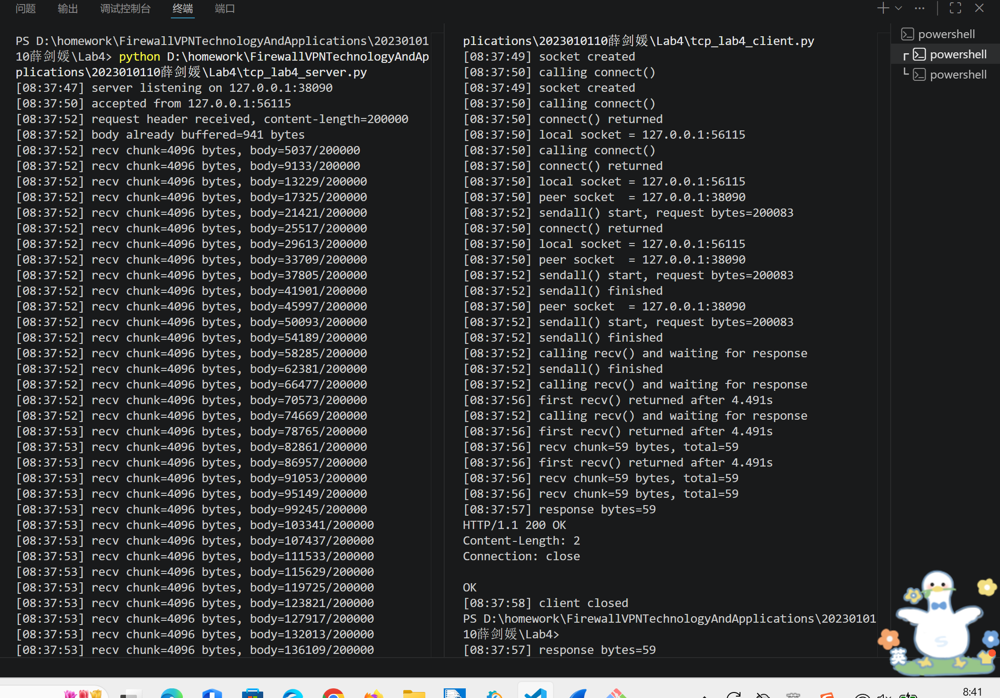
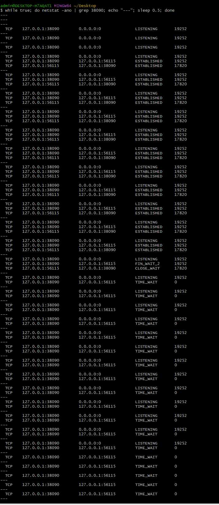
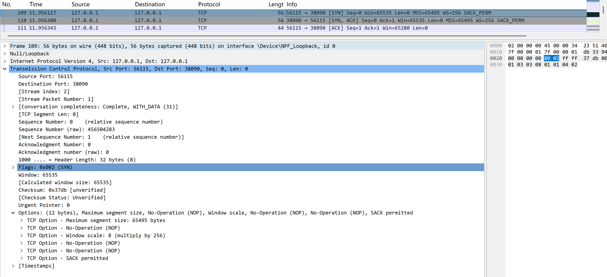
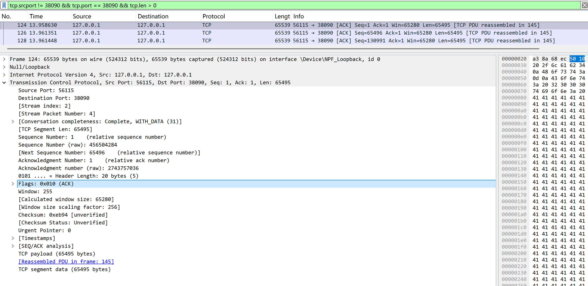
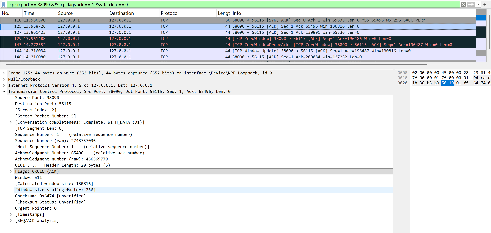
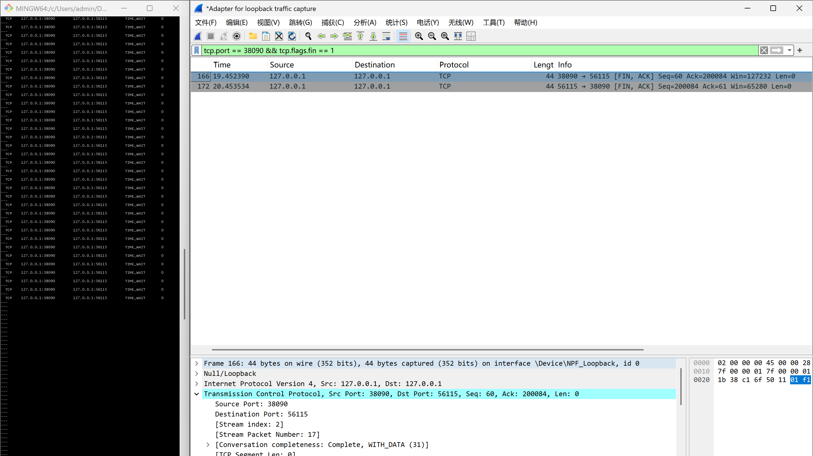

# Lab4：看见TCP 我不怕不怕啦

## 实验背景

本实验围绕一条 TCP 连接的完整生命周期展开，重点观察以下内容：

1. `socket()`、`listen()`、`accept()`、`connect()` 的职责区别
2. "连接"为什么本质上是交换控制信息而不是物理连线
3. TCP 头部中的端口号、序号、ACK 号、标志位、窗口、头部长度、可选字段
4. 三次握手如何建立收发准备
5. 应用层大块数据如何被 TCP 按 MSS 拆分
6. `Sequence Number` 与 `Acknowledgment Number` 如何配合工作
7. `recv()` 为什么会阻塞等待数据
8. 接收窗口如何反映接收方处理能力
9. ACK 与窗口更新为什么常常会被合并
10. `FIN` / `ACK` 如何完成断开
11. 为什么连接结束后套接字不会立刻删除

---

## 实验任务

### 任务一：准备实验环境并记录运行信息

**第一步：准备好四个窗口**

整个实验需要同时观察多个界面，建议在开始前把窗口布局摆好：

- **终端 A**：运行服务端
- **终端 B**：运行客户端
- **终端 C**：持续监控套接字状态（全程保持开启，不要关）
- **Wireshark**：抓包

**第二步：在终端 C 里启动持续监控**

TCP 状态变化很快，等你手动敲完 `ss` 命令再回车，状态可能已经过去了。用下面的命令让终端 C 每 0.5 秒自动刷新一次，之后只需要盯着这个窗口就行：

```bash
# Linux
watch -n 0.5 'ss -tan | grep 38090'

# macOS（没有 watch，用循环代替）
while true; do netstat -an | grep 38090; echo "---"; sleep 0.5; done

# Windows（Git Bash执行）
while true; do netstat -ano | grep 38090; echo "---"; sleep 0.5; done
```

如果你换了端口，把 `38090` 替换成实际端口。

**第三步：打开 Wireshark，选回环接口，填好过滤器，开始抓包**

回环接口在不同系统里名字不同：

| 系统 | 接口名 |
|:-----|:-------|
| Linux | `lo` |
| macOS | `lo0` |
| Windows | `Adapter for loopback traffic capture`（需提前安装 Npcap 并勾选回环支持） |

在显示过滤器里输入：

```text
tcp.port == 38090
```

然后点击开始抓包（蓝色鲨鱼鳍图标）。**先开始抓包，再运行脚本**，否则握手包会被漏掉。

**第四步：启动脚本**

```bash
# 终端 A
python3 tcp_lab4_server.py

# 终端 B（等服务端打印出 server listening on ... 后再运行）
python3 tcp_lab4_client.py
```

如果 `38090` 已被占用，两端都加环境变量换端口，同时记得把 Wireshark 过滤器和终端 C 里的端口号也改掉：

```bash
LAB4_PORT=38123 python3 tcp_lab4_server.py
LAB4_PORT=38123 python3 tcp_lab4_client.py
```

**第五步：填写下表**

| 项目                                | 你的填写内容 |
| :---------------------------------- | :----------- |
| 服务端监听地址                      |127.0.0.1|
| 服务端监听端口                      |38090|
| 客户端本地临时端口                  |56115|
| 客户端请求总字节数                  |200083|
| 服务端响应内容                      |HTTP/1.1 200 OK (Content-Length: 2)|
| 客户端 `connect()` 返回前后的时间点 |08:37:50 calling connect() → 08:37:50 connect() returned（几乎立即返回）|
| 客户端首次收到响应前等待了多久      |4.491 秒|

各项数值均可直接从终端输出读取：服务端监听信息在 `server listening on ...`，客户端本地端口在 `local socket = ...`，请求字节数在 `sendall() start, request bytes=...`，等待时间在 `first recv() returned after ...s`。



---

### 任务二：观察套接字创建与连接建立

1. 服务端启动后，观察终端 C 出现 `LISTEN` 状态，截图留存。
2. 在终端 B 里启动客户端，观察它依次打印 `socket created`、`calling connect()`、`connect() returned`。
3. 客户端打印 `connect() returned` 之后，观察终端 C 出现 `ESTABLISHED`，截图留存。脚本在 `connect()` 返回后有 2 秒停顿，这段时间足够截图。

填写下表：

| 阶段                             | 你的填写内容 |
| :------------------------------- | :----------- |
| 服务端启动、客户端未连入时的状态 |LISTEN|
| `connect()` 返回后服务端状态     |ESTABLISHED|
| `connect()` 返回后客户端状态     |ESTABLISHED|

简答题：

1. 服务端在客户端连接前为什么处于 `LISTEN`？
答：因为服务端执行了 listen() 系统调用，告诉操作系统内核：我愿意在这个端口上接受 incoming 连接请求。LISTEN 状态表示套接字正在被动等待客户端来连接。


2. 为什么这时还没有真正建立 TCP 连接？
答：因为 TCP 连接需要双方交换 SYN 和 ACK 包（三次握手）来同步彼此的初始序号和确认对方的存在。LISTEN 只是服务端做好了准备，但还没有任何客户端发起连接。


3. `socket()` 与 `connect()` 的区别是什么？
答：socket()：创建一个套接字文件描述符，分配内核资源（发送/接收缓冲区等），但这个套接字还没有绑定任何对端。
connect()：主动发起三次握手，与服务器建立 TCP 连接。成功返回后，套接字才真正与对端关联起来。


4. 为什么 `connect()` 返回后才进入可稳定收发数据的状态？
答：因为 connect() 返回（非阻塞模式下是成功发起，阻塞模式下是完成握手）意味着三次握手已经完成。此时双方都确认了：对方存在且可达、自己的初始序号已被对方知晓、对方的初始序号已被自己知晓、接收窗口大小已交换，有了这些信息，应用层才能可靠地收发数据。


5. 为什么"网线一直连着"不等于"TCP 连接已经建立"？
答：TCP 连接是一个逻辑状态，存在于操作系统内核的内存中，而不是物理线路上的一个"实体"。网线只提供了数据包的传输通道，但 TCP 协议栈还需要通过握手来协商连接参数（序号、窗口等）。没有握手，即使网线通着，协议栈也不会认为连接已建立。


6. 这里的"连接"更准确地说是在做什么？
答："连接"本质上是在交换控制信息：交换初始序号、交换 MSS（最大分段大小）、交换窗口缩放因子（Window Scale）、确认对方是否支持 SACK（选择性确认），这些信息都存放在 TCP 头部的字段和选项中，通过握手包传递。




---

### 任务三：观察三次握手与 TCP 头部字段

**定位握手包**：在 Wireshark 过滤器里输入下面的条件，可以屏蔽中间的数据包，只留下握手和断开阶段的控制包：

```text
tcp.port == 38090 && (tcp.flags.syn == 1 || tcp.flags.fin == 1)
```

包列表最前面的三个包就是三次握手（SYN → SYN-ACK → ACK）。

**找到各字段的位置**：点击某个握手包，在下方详情栏展开 `Transmission Control Protocol`。源端口、目的端口、Seq、Ack、Flags、Window、Header Length 都在这里。TCP 选项在最底部的 `Options` 子项里，展开后可以看到 MSS、Window Scale、SACK Permitted，注意这三项只出现在带 SYN 标志的包里，纯 ACK 包里没有。

**关于序号显示**：Wireshark 默认开启相对序号，会把每个方向的初始序号归零显示，所以 SYN 包的 Seq 看起来是 `0`，而不是真实的随机大数。这是正常现象，实验报告按 Wireshark 显示的值填写即可。如果你想看真实值，可以去 `Edit → Preferences → Protocols → TCP` 里取消勾选 `Relative sequence numbers`。

填写下表：

| 报文       | 源端口 | 目的端口 | Seq  | Ack  | Flags | Window | Header Length |
| :--------- | :----- | :------- | :--- | :--- | :---- | :----- | :------------ |
| 第一次握手 |56115|38090|0|0|0x002（SYN）|65535|32 字节|
| 第二次握手 |38090|56115|0|1|0x012（SYN,ACK）|65535|32 字节|
| 第三次握手 |56115|38090|1|1|0x010（ACK）|65280|20 字节|

第一次握手（SYN）的 Ack 字段在 Wireshark 里通常显示为空或 `0`，这是正常的，因为此时客户端还没有收到服务端的任何数据。Header Length 在没有选项时是 20 字节，握手包因为携带了 MSS 等选项通常是 28 或 32 字节。

| TCP 选项       | 你的填写内容 |
| :------------- | :----------- |
| MSS            |65495 字节|
| Window Scale   | 8 (multiply by 256)|
| SACK Permitted |是|

回环接口的 MSS 通常是 65495（因为回环 MTU 是 65536，比以太网的 1500 大得多），这会影响后续任务五里是否能观察到分段。

简答题：

1. 发送方和接收方端口号在连接阶段的作用是什么？
答：端口号 + IP 地址 = 套接字地址（socket address）。端口号用来区分同一台主机上的不同进程。在连接阶段，客户端使用自己的临时端口 + 服务端的知名端口，让 TCP 协议栈知道这个连接应该关联到哪个进程。


2. TCP 头部如何帮助找到目标套接字？
答：操作系统内核维护一个连接查找表。当收到一个 TCP 包时，内核提取头部中的（源 IP、源端口、目的 IP、目的端口）四元组，在表中查找匹配的套接字。匹配成功就把数据交给对应的进程。


3. 为什么初始序号不是简单固定从 1 开始？
答：固定序号会导致：历史连接的旧包可能被误认为属于新连接（延迟到达的包）、安全性差，容易被预测和攻击、随机初始序号（RFC 6528 建议）可以避免这些问题，让攻击者更难伪造 RST 等控制包。


4. 为什么 TCP 可选字段更容易在连接阶段看到？
答：因为大部分 TCP 选项（MSS、Window Scale、SACK、Timestamps 等）需要在握手时协商。一旦连接建立，这些选项就不再出现在普通数据包的头部中。所以 SYN 和 SYN-ACK 包是观察选项的最佳位置。




---

### 任务四：区分头部中的控制信息和套接字中的控制信息

用以下过滤器分别找到两类报文：

```text
# 纯控制报文（无应用数据）
tcp.port == 38090 && tcp.len == 0

# 携带应用数据的报文
tcp.port == 38090 && tcp.len > 0
```

从纯控制报文里选一个（SYN、纯 ACK 或 FIN-ACK 都可以），从数据报文里选一个（客户端发请求或服务端发响应的包）。

填写下表：

| 项目                   | 你的填写内容 |
| :--------------------- | :----------- |
| 纯控制报文的类型       |[SYN]（第一次握手）|
| 携带应用数据的报文类型 |[ACK] + 应用数据|
| 头部中的控制信息举例   |Flags（SYN）、Sequence Number、Acknowledgment Number、Window、Checksum|
| 套接字中的控制信息举例 |连接状态（LISTEN/ESTABLISHED/TIME_WAIT）、发送/接收缓冲区大小、拥塞窗口（cwnd）、慢启动阈值（ssthresh）、重传计时器|

简答题：

1. 为什么"头部中的控制信息"和"套接字中的控制信息"不是同一件事？
答：头部中的控制信息是封装在每个TCP报文段中、用于在网络对端之间进行协议协商的字段（如SYN、ACK、序号、窗口等），它的作用是告诉对方“我期望你做什么”；而套接字中的控制信息是操作系统内核为每个连接维护的本地状态数据（如连接状态、收发缓冲区、重传计时器等），它的作用是记录“当前连接自己是什么状况”。两者一个面向网络通信、一个面向本地管理，分属协议规范与系统实现的不同层面，因此不是同一件事。


---

### 任务五：观察数据分段、序号与 ACK

客户端发送的请求体是 200000 字节，超过了回环接口 MSS（约 65495 字节），因此应该可以在 Wireshark 里看到多个连续的数据段。用下面的过滤器找到客户端发出的数据包：

```text
tcp.srcport != 38090 && tcp.port == 38090 && tcp.len > 0
```

在包列表里连续选几个数据段，对比它们的 Seq 值。相邻两段的关系是：后一段的 Seq = 前一段的 Seq + 前一段的 TCP Segment Len。

找服务端返回给客户端的纯 ACK 报文：

```text
tcp.srcport == 38090 && tcp.flags.ack == 1 && tcp.len == 0
```

填写下表：

| 数据段  | Seq  | Ack  | TCP Segment Len | Flags |
| :------ | :--- | :--- | :-------------- | :---- |
| 第 1 段 |1|1|65495|ACK|
| 第 2 段 |65496|1|65495|ACK|
| 第 3 段 |130991|1|65495|ACK|

| ACK 报文 | Ack Number | Flags | Window |
| :------- | :--------- | :---- | :----- |
| 第 1 个  |65496|ACK|130816|
| 第 2 个  |196486|ACK|0|
| 第 3 个  |200084|ACK|127232|

| 项目                         | 你的填写内容 |
| :--------------------------- | :----------- |
| 是否发生分段                 |是|
| 握手中观察到的 MSS           |65495 字节|
| 单段长度与 MSS 的关系        |相等，每个数据段都达到 MSS 上限|
| ACK 号大致确认到了第几个字节 |包 125 确认到 65496，包 146 确认到 200084（全部数据）|

简答题：

1. 应用程序是否直接决定每个网络包的数据长度？为什么？
答：不直接决定。应用程序调用 send() 或 sendall() 时只是把数据交给 TCP 层，TCP 层会根据 MSS（最大分段大小）、拥塞窗口、接收窗口等因素，自动决定如何将数据拆分成多个网络包。应用程序无法控制每个 IP 包的大小。


2. 大块应用数据为什么会被拆分？
答：因为网络链路层有 MTU（最大传输单元）限制。如果 TCP 层不拆分，IP 层就要分片，而 IP 分片会导致：一个分片丢失就需要重传整个数据报，效率很低。TCP 在传输层按 MSS 拆分，可以避免 IP 分片，提高传输效率。


3. `MSS` 与 `MTU` 的关系是什么？
答：MSS = MTU - IP 头部长度 - TCP 头部长度；MTU 是链路层的限制（一个 IP 包最大能有多大）；MSS 是 TCP 层的数据段最大能有多大（不包含 IP 头和 TCP 头）


4. "一次 `sendall()`"与"一个 TCP 包"之间是什么关系？
答：没有固定的对应关系。一次 sendall() 可能会被拆成多个 TCP 包发送（当数据量超过 MSS 时，如本例中 200083 字节被拆成 4 个包）；反之，多次小的 send() 也可能被合并成一个 TCP 包发送（Nagle 算法）。


5. 为什么 ACK 体现的是累计确认？
答：因为 TCP 的 ACK 号表示“该序号之前的所有字节都已成功接收”。例如 ACK=65496 表示第 65495 字节及之前都已收到。这样，一个 ACK 就可以确认前面的多个数据段，减少了 ACK 包的数量，提高了网络效率。


6. 如果中间某一段丢失，ACK 会出现什么变化？
答：接收方会重复发送丢失段之前最后一个字节的 ACK。例如，如果第 2 段丢失，接收方会一直发送 ACK=65496（确认第 1 段，但第 2 段没收到）。发送方收到 3 次重复的 ACK 后，会触发快速重传，不等超时就直接重传丢失的第 2 段。





---

### 任务六：观察 `recv()` 阻塞与窗口字段

`recv()` 的等待时间直接从客户端终端读取，`calling recv() and waiting for response` 到 `first recv() returned after ...s` 之间就是等待时长，脚本已经帮你计算好了。

在 Wireshark 里找窗口值：用过滤器 `tcp.port == 38090 && tcp.flags.ack == 1` 列出所有 ACK 包，点击其中一个，在详情栏 `Transmission Control Protocol` 里找 `Window` 字段。如果同时显示了 `Calculated window size`，优先看这个值，它已经把 Window Scale 的缩放算进去了，是对方实际能接收的字节数。

如果包列表的 Info 列出现了 `[TCP Window Update]` 标注，说明这个包的主要目的是通知对方窗口变化，重点观察它的 `Window` 字段。

填写下表：

| 项目                                   | 你的填写内容 |
| :------------------------------------- | :----------- |
| 客户端开始调用 `recv()` 的时间         |08:37:52|
| 客户端第一次收到响应的时间             |08:37:56|
| `recv()` 是否立刻返回                  |	否|
| 首次收到响应前等待了多久               |4.491 秒|
| `recv()` 等待期间连接是否已经建立      |是|
| 第 1 个 ACK 报文的窗口值               |65535|
| 第 2 个 ACK 报文的窗口值               |130816|
| 第 3 个 ACK 报文的窗口值               |	0|
| 窗口值是否变化                         |	是|
| 若变化，变化趋势                       |65535 → 130816 → 0 → 0 → 0 → 127232（先增大，然后降为 0，最后恢复）|
| ACK 与窗口更新是否可以出现在同一个包中 |可以|
| 是否看到 RTT 或 ACK 往返时间相关信息   |是，Wireshark 的 [SEQ/ACK analysis] 中会显示|

简答题：

1. "连接建立"和"应用收到数据"之间是什么关系？
答：连接建立只是完成了 TCP 协议层面的握手（交换序号、窗口等），此时双方的应用层还没有任何数据交换。应用收到数据需要对方主动调用 send() 发送，并且数据经过网络传输后才能 recv() 返回。连接建立是数据交换的前提条件，但不是数据到达的保证。


2. 为什么说 `read` / `recv` 在数据未到达时会被挂起？
答：因为 recv() 默认是阻塞模式。当调用 recv() 时，如果接收缓冲区为空，内核会把当前进程/线程挂起（放入等待队列），直到有数据到达或连接关闭才唤醒。这是为了避免"忙等待"浪费 CPU。


3. 窗口字段反映了接收方哪方面的能力？
答：窗口字段反映接收方的接收缓冲区剩余空间。它告诉发送方："在我更新窗口之前，你最多还能发送多少字节"。这是 TCP 流量控制的核心机制。


4. 为什么发送方不能无限制连续发送数据？
答：因为接收方的处理速度是有限的。如果发送方发得太快，接收方的接收缓冲区会满（如包 129 的 Window=0），后续数据就会被丢弃。TCP 通过滑动窗口机制让发送方动态调整速率，避免压垮接收方。


5. 滑动窗口为什么既提高效率又避免压垮接收方？
答：提高效率：窗口允许发送方在收到 ACK 之前连续发送多个段，不需要"发一个等一个"（停等协议），充分利用网络带宽。
避免压垮：窗口大小受接收方控制（rwnd），发送方发送的总字节数不能超过窗口限制。当接收方缓冲区满时，通告 Window=0，发送方必须暂停，从而保护接收方。


---

### 任务七：观察响应返回与双向 `seq/ack`

TCP 的 Seq/Ack 是双向独立的，客户端有自己的发送序号，服务端有自己的发送序号。用下面的过滤器只看服务端发出的数据包（源端口是 38090，有应用数据）：

```text
tcp.srcport == 38090 && tcp.len > 0
```

紧跟在服务端数据包后面的、客户端发出的 ACK 包，其 Ack Number 确认的就是服务端的发送序号。

填写下表：

| 项目                     | 你的填写内容 |
| :----------------------- | :----------- |
| 服务端响应数据报文的 Seq |1|
| 服务端响应数据报文的 Ack |200084|
| 客户端确认报文的 Ack     |61|

简答题：

1. 为什么 TCP 的 `seq/ack` 是双向分别计算的？
答：因为 TCP 是全双工通信。每一端都有自己的发送序号和接收序号，分别独立增长。A 的 Seq 只表示 A 发送的数据，B 的 Seq 只表示 B 发送的数据。Ack 字段总是指向对方发送的数据。


2. 为什么双方都需要各自的初始序号？
答：因为双方发送的数据需要独立排序和确认。如果共用同一个序号空间，会出现混乱：A 发送的第 N 个字节和 B 发送的第 N 个字节无法区分。各自的初始序号让双方能够独立管理自己的发送流。


3. 为什么发送应用数据时报文通常仍然带 `ACK`？
答：因为 TCP 的 ACK 是捎带确认。为了节省网络资源，当一端有应用数据要发送时，它会顺便把对对方数据的确认信息放在同一个包里，而不是单独发一个纯 ACK 包。这是 TCP 提高效率的设计。


---

### 任务八：观察连接断开与套接字延迟删除

用下面的过滤器精确定位所有带 FIN 的包：

```text
tcp.port == 38090 && tcp.flags.fin == 1
```

通常会看到两个 FIN 包（双方各一个）。看第一个 FIN 包的源端口，就能判断谁先发起断开。

**关于 TIME-WAIT**：TIME-WAIT 只出现在主动发起关闭的一方（先发 FIN 的那端）。服务端脚本在 `conn.close()` 之后会继续运行 10 秒再退出，这段时间可以在终端 C 里观察 TIME-WAIT。Linux 上 TIME-WAIT 通常持续约 60 秒，macOS 上可能较短，如果没有观察到请如实说明。

填写下表：

| 项目                                    | 你的填写内容 |
| :-------------------------------------- | :----------- |
| 谁先发送 FIN                            |服务端（包 166：38090 → 56115 [FIN, ACK]）|
| 关闭阶段共观察到几个带 FIN 的报文       |2 个|
| 最终 ACK 是否可见                       |是|
| 关闭后是否观察到 `TIME-WAIT` 或等价现象 |是，在 states.png 中观察到服务端处于 TIME_WAIT|

简答题：

1. 为什么关闭连接不能只发一个结束通知？
答：因为 TCP 是全双工的，双方都需要独立关闭自己的发送通道。一个 FIN 只表示"我没有更多数据要发了"，不代表对方也没有。只有双方都发送了 FIN 并确认了对方的 FIN，连接才算完全关闭。


2. 为什么连接结束后套接字不会立刻删除？
答：为了保证可靠地处理最后那个 ACK 可能丢失的情况。主动关闭方发送最后一个 ACK 后进入 TIME-WAIT 状态，等待 2MSL（最大报文生存时间）。如果这个 ACK 丢了，被动关闭方会重发 FIN，TIME-WAIT 状态的存在允许主动方重新发送 ACK。如果套接字立刻删除，就无法处理重发的 FIN，导致被动方永远收不到确认。


3. 如果最后一个 ACK 丢失，而旧套接字已经立刻删除，可能带来什么问题？
答：被动关闭方会一直重发 FIN（直到超时），但主动方已经没有套接字来处理这个 FIN 了。被动方最终会进入 CLOSED 状态，但主动方可能已经用相同的端口新建了连接，导致新连接收到旧连接的 FIN 包（延迟到达的包），造成混乱或错误关闭。




---

## 问答题

1. TCP 的"连接"到底意味着什么？它为什么不是"把网线连上"？
答：TCP 连接是一个逻辑概念，存在于操作系统内核的协议栈中。它意味着双方已交换初始序号、已确认对方的存在和可达性、已协商好参数（MSS、窗口缩放等）、内核为这个连接分配了 socket 结构和缓冲区。网线只是物理通路，即使网线插着，没有握手也不能收发 TCP 数据。连接建立在握手完成后，而不是物理连线上。


2. 三次握手为什么能让双方进入可通信状态？
答：第 1 次（SYN）：客户端告知服务端自己的初始序号；第 2 次（SYN-ACK）：服务端确认客户端的序号，同时告知自己的初始序号；第 3 次（ACK）：客户端确认服务端的序号。完成后，双方都知道对方的初始序号、对方已准备好接收数据，可以开始发送应用数据。


3. TCP 头部中的控制字段如何支撑收发数据？
答：Seq/Ack 实现可靠传输（排序、去重、确认）；Flags（SYN/FIN/RST/PSH）管理连接生命周期和处理异常；Window 实现流量控制，防止接收方被淹没；Checksum 保证数据完整性。


4. ACK、窗口、等待时间为什么会共同影响 TCP 的可靠传输？
答：ACK 让发送方知道哪些数据已被成功接收，决定是否重传；窗口控制发送速率，避免接收方缓冲区溢出；等待时间（超时重传 RTO）确保如果 ACK 在超时前未到达，发送方会重传。三者配合：窗口避免过快的发送，ACK 提供反馈，超时提供最后的容错。


5. 断开连接为什么仍然需要严格的控制信息交换？
答：因为需要确保双方都同意关闭，并且所有数据都已正确接收。FIN 表示"我没有数据了"，ACK 确认对方的 FIN，最后的 TIME-WAIT 确保最后的 ACK 不会丢失。如果没有严格的交换，可能会出现半开连接、数据丢失或错误的连接复用。


6. 如果服务端根本没有启动，客户端调用 `connect()` 时会看到什么现象？
答：客户端会发送 SYN 包，但没有服务端响应。经过几次重传后，connect() 会返回错误 ECONNREFUSED（连接拒绝）或超时（ETIMEDOUT）。在 Wireshark 中会看到客户端反复重传 SYN，最终收到 ICMP 端口不可达或直接超时。


7. 如果中途人为制造丢包，ACK、重传、窗口之间会出现什么变化？
答：发送方收不到 ACK，会触发超时重传；如果只丢数据包不丢 ACK，接收方可能收到乱序数据，会发送重复 ACK；重复 ACK 达到 3 次会触发快速重传（不等超时）；窗口可能会缩小（发送方进入拥塞避免阶段）；整体吞吐量下降。


8. 如果把客户端发送的数据改得更大，窗口字段和分段情况会如何变化？
答：分段数量会增多（每段 ≤ MSS）；窗口字段（rwnd）可能会随着接收方缓冲区的消耗而动态变化；如果数据大到接收方缓冲区不够，窗口会缩小甚至变为 0（零窗口）；发送方会暂停发送，直到收到窗口更新。


9. 如果把服务端读取速度改得更慢，是否更容易看到窗口更新甚至零窗口？
答：是的。服务端调用 recv() 的速度越慢，接收缓冲区就越容易被填满。当缓冲区满时，服务端会向客户端通告窗口为 0（零窗口）。客户端收到零窗口后会停止发送，定期发送窗口探测包等待窗口恢复。当服务端终于读取了数据，会发送窗口更新包，客户端才能继续发送。

---

## 截图要求

- 截图须清晰，终端文字和 Wireshark 字段可读。
- 所有截图与本 `Lab4.md` 放在同一目录下。
- 命名规范：

| 截图内容               | 文件名                  |
| :--------------------- | :---------------------- |
| 服务端与客户端运行结果 | `run.png`               |
| `ss` 状态变化          | `states.png`            |
| 三次握手与 TCP 选项    | `handshake_header.png`  |
| 大请求分段与 MSS       | `segmentation.png`      |
| ACK 与窗口观察         | `ack_window.png`        |
| 断开与最终状态         | `teardown_timewait.png` |

具体要求：

1. `run.png`：终端截图，至少能看到服务端 `server listening on ...`、客户端 `calling connect()`、`connect() returned`、`calling recv() and waiting for response`、`first recv() returned after ...s`。

2. `states.png`：终端截图，至少能看到 `LISTEN`、`ESTABLISHED`，以及 `TIME-WAIT`（若能观察到）。推荐截 `watch` 命令的持续输出画面，可以在一张截图里同时展示多个状态的变化过程。

3. `handshake_header.png`：Wireshark 截图，至少能看到三次握手中某个包的 `Source Port`、`Destination Port`、`Sequence Number`、`Acknowledgment Number`、`Flags`、`Window`，以及 `Options` 中的 `Maximum segment size`、`Window Scale`、`SACK Permitted`。

4. `segmentation.png`：Wireshark 截图，至少能看到客户端发送数据的 TCP 包的 `TCP Segment Len`、`Seq`、`Ack`。若能观察到分段，尽量截出多个连续数据段。

5. `ack_window.png`：Wireshark 截图，至少能看到一个或多个 ACK 报文的 `Acknowledgment Number`、`Window`，以及 `Calculated window size`（若显示）、`[TCP Window Update]`（若出现）。

6. `teardown_timewait.png`：Wireshark 截图或 Wireshark 与终端截图的拼图，至少能看到带 `FIN` 的包，以及 `TIME-WAIT` 状态（若能观察到）。

---

## 提交要求

在自己的文件夹下新建 `Lab4/` 目录，提交以下文件：

```text
学号姓名/
└── Lab4/
    ├── Lab4.md
    ├── tcp_lab4_server.py
    ├── tcp_lab4_client.py
    ├── run.png
    ├── states.png
    ├── handshake_header.png
    ├── segmentation.png
    ├── ack_window.png
    └── teardown_timewait.png
```

---

## 截止时间

2026-04-23，届时关于 Lab4 的 PR 请求将不会被合并。
