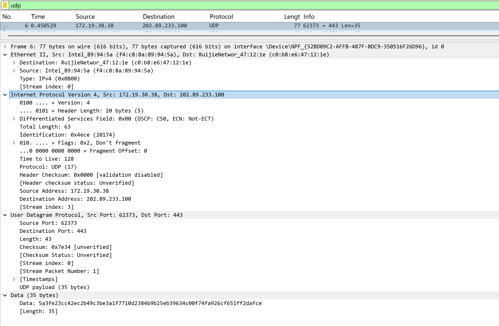
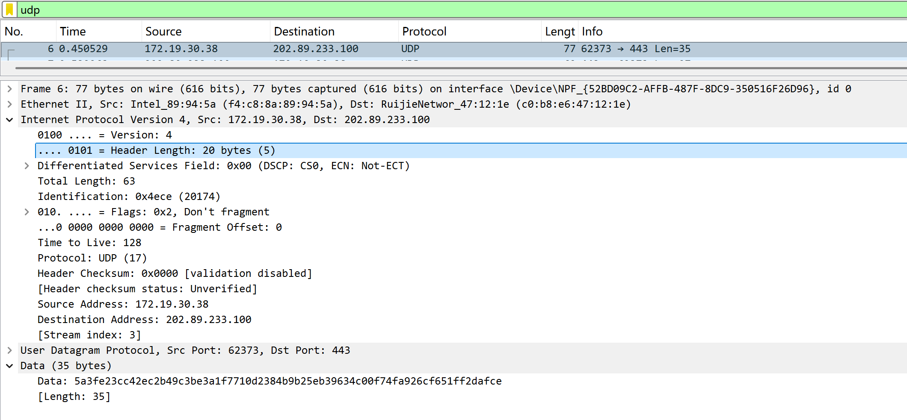
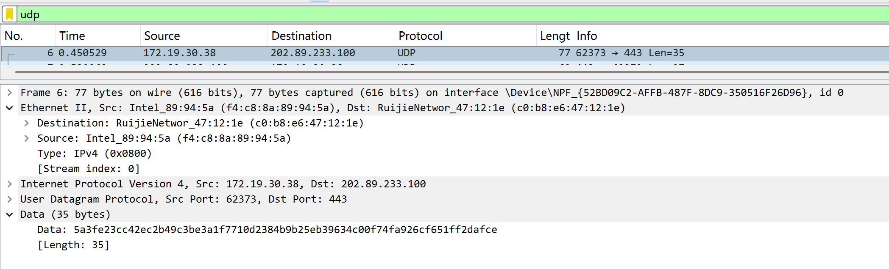
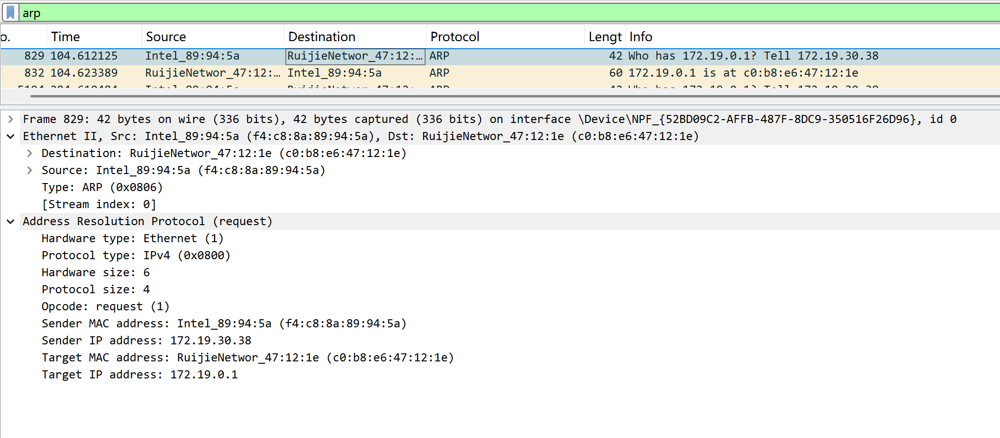
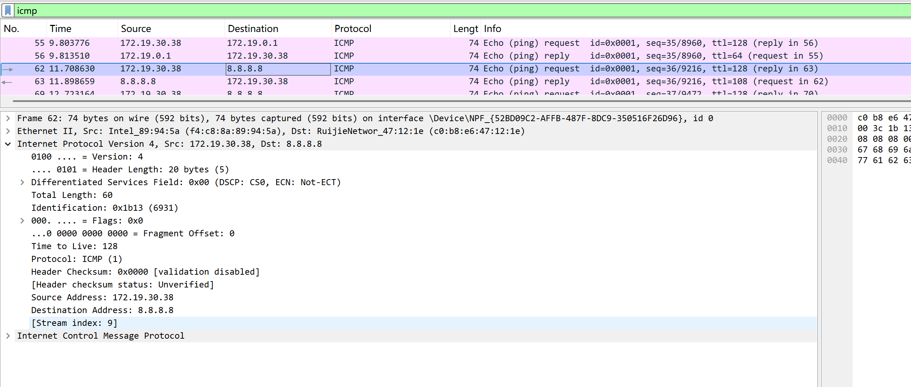

# Lab5：IP 与以太网的包收发操作

## 实验背景

本实验围绕 IP 模块与以太网在包收发过程中的角色展开，重点观察以下内容：

1. 网络包的基本结构：头部（IP 头部 + MAC 头部）与数据
2. IP 头部各字段的含义：版本号、TTL、协议号、发送方/接收方 IP 地址等
3. MAC 头部各字段的含义：接收方/发送方 MAC 地址、以太类型
4. IP 地址与 MAC 地址的区别与协作
5. ARP 协议如何通过 IP 地址查询 MAC 地址
6. 路由表的结构与查询方式
7. UDP 协议与 TCP 协议的区别：无连接、无确认、无重传
8. UDP 头部结构：发送方端口号、接收方端口号、数据长度、校验和
9. ICMP 协议的作用与常见消息类型（Echo、Destination Unreachable 等）

---

## 实验任务

### 任务一：查看路由表、ARP 缓存并启动 Wireshark

**第一步：打开 Wireshark，选择主网络接口，开始抓包**

> **注意**：本次实验必须使用真实网络接口（`en0`/`eth0`/`以太网`），不要选回环接口。回环接口不经过以太网，无法观察到 MAC 头部和 ARP 过程。

选择你的主网络接口，开始抓包。本次实验的大部分任务会共用同一次抓包。

**第二步：查看本机路由表**

```bash
# Linux
route -n
ip route show

# macOS
netstat -rn

# Windows
route print
```

截图并保存为 `route_table.png`。

**第三步：查看本机 ARP 缓存**

```bash
# Linux / macOS / Windows
arp -a
```

截图并保存为 `arp_cache.png`。

**第四步：填写下表**

从路由表和 ARP 缓存的输出中提取信息：

| 项目                         | 你的填写内容 |
| :--------------------------- | :----------- |
| 本机 IP 地址                 |172.19.30.38|
| 本机所在子网                 |172.19.0.0|
| 子网掩码                     |255.255.0.0|
| 默认网关 IP                  |172.19.0.1|
| 默认网关 MAC 地址            |c0-b8-e6-47-12-1e|
| 本机网卡 MAC 地址            |f4-c8-8a-89-94-5a|

简答题：

1. 路由表的每一行包含哪些关键字段？教材中提到的 `Network Destination`、`Netmask`、`Gateway`、`Interface` 分别对应什么含义？
答：Network Destination（网络目标）：目标网络的IP地址范围；Netmask（网络掩码）：与网络目标配合，决定哪些IP属于该子网；Gateway（网关）：	下一跳路由器的IP地址（在链路上表示直达，不需要网关）；Interface（接口）：本机从哪个网卡发出数据包


2. 当目标 IP 地址不在本子网时，包会先发给谁？路由表的哪一列提供了这个信息？
答：先发给默认网关。路由表的 Gateway 列提供了网关IP。


3. 路由表的默认网关（`0.0.0.0`）条目的作用是什么？什么时候会匹配到这一行？
答：当目标IP地址不匹配路由表中任何更具体的条目时，使用默认网关作为“最后的出路”。


4. 教材提到，确定发送方 IP 地址的关键在于"判断应该使用哪块网卡"。结合你查到的本机网卡信息，说明 IP 模块是如何做出这个判断的。
答：IP模块通过路由表判断：根据目标IP查找路由表，找到最匹配（最长前缀匹配）的条目、该条目的 Interface 列指明了使用哪块网卡、该网卡绑定的IP地址就是发送方源IP；比如：目标IP是外网地址时，匹配 0.0.0.0/0 条目，Interface=172.19.30.38，所以源IP为 172.19.30.38，使用MAC为 f4-c8-8a-89-94-5a 的无线网卡发送。


---

### 任务二：观察 UDP 头部

只要计算机处于联网状态，Wireshark 中就会持续出现大量 UDP 流量（DNS、mDNS、DHCP、NTP 等），无需手动生成。

**第一步：在 Wireshark 中设置过滤器**

```text
udp
```

**第二步：在包列表中找一个 UDP 包**

随便选一个即可。如果包太多，可以加上源或目的 IP 来缩小范围，例如 `udp && ip.addr == 你的IP`。如果需要 DNS 包，也可以用 `udp.port == 53` 过滤。

> **可选**：如果想明确看到一个完整的请求-响应对，可以在终端中执行 `nslookup example.com`，Wireshark 中就会出现对应的 DNS 请求包。

**第三步：点击选中的 UDP 包，在详情栏展开 `User Datagram Protocol`**

填写下表：

| 项目               | 你的填写内容 |
| :----------------- | :----------- |
| UDP 头部总长度     |8 字节|
| 源端口             |62373|
| 目的端口           |443|
| 长度（Length）     |43|
| 校验和（Checksum） |0x7e34|

简答题：

1. 你观察到的 UDP 头部长度是多少字节？TCP 头部至少 20 字节。UDP 省略了哪些字段？这些字段的缺失带来了什么后果？
答：UDP头部 8字节。UDP省略了：序列号、确认号、窗口大小、标志位、紧急指针、选项。后果：无可靠传输（丢包不重传）、无流量控制、无顺序保证、无连接状态。


2. UDP 头部中的"长度"字段指的是什么长度？
答：UDP头部 + UDP负载 的总字节数。比如我的的包中 Length=43，即 8字节头部 + 35字节数据。




---

### 任务三：观察 IP 头部字段

点击任务二中的同一个 UDP 包，在详情栏展开 `Internet Protocol Version 4`。

填写下表：

| 字段名称               | 你的填写内容 | 含义说明 |
| :--------------------- | :----------- | :------- |
| Version（版本号）      |4|IPv4协议版本|
| Header Length（头部长度） |20 bytes (5)|IP头部长度，5×4=20字节|
| Time to Live（TTL）    |128|最大跳数，每经过一跳减1|
| Protocol（协议号）     |17|UDP协议|
| Source Address（源 IP） |172.19.30.38|本机IP|
| Destination Address（目的 IP） |202.89.233.100|目标服务器IP|

简答题：

1. 协议号字段的值是多少？它代表什么协议？如果抓一个 HTTP 请求的包，协议号会变成多少？
答：协议号 = 17，代表 UDP。HTTP请求（使用TCP）的协议号会变成 6（TCP）。


2. TTL 字段的作用是什么？如果 TTL 降为 0 会发生什么？
答：TTL防止数据包在网络中无限循环。每经过一个路由器减1，TTL=0时路由器丢弃该包，并向源IP返回 ICMP Time Exceeded 消息。


3. 有教材提到 IP 地址"实际上并不是分配给计算机的，而是分配给网卡的"。你的本机有几块网卡？每块网卡的 IP 地址分别是什么？（提示：可参考任务一中路由表的 Interface 列，或用 `ip addr`（Linux）/`ifconfig`（macOS）/`ipconfig`（Windows）查看。）
答：从 ipconfig /all 看，有多个虚拟网卡，物理网卡（WLAN）的IP是 172.19.30.38。其他网卡：VirtualBox: 192.168.56.1、VMnet1: 192.168.247.1、VMnet8: 192.168.253.1


4. IP 头部中的源 IP 地址和目的 IP 地址分别是谁的地址？它们与 MAC 头部中的源/目的 MAC 地址有什么区别？
答：

| 类型 | 地址 | 作用范围 | 是否变化 |
| :--- | :--- | :--- | :--- |
| 源 IP | 本机 (172.19.30.38) | 端到端（全球唯一） | 不变化 |
| 目的 IP | 服务器 (202.89.233.100) | 端到端 | 不变化 |
| 源 MAC | 本机 (f4:c8:8a:89:94:5a) | 局域网内 | 每跳都会变 |
| 目的 MAC | 网关 (c0:b8:e6:47:12:1e) | 局域网内 | 每跳都会变 |

**区别**：IP 标识最终的通信两端，MAC 标识下一跳的物理设备。




---

### 任务四：观察 MAC 头部与以太网帧

点击任务二中的同一个 UDP 包，在详情栏展开 `Ethernet II`。

填写下表：

| 字段名称               | 你的填写内容 | 含义说明 |
| :--------------------- | :----------- | :------- |
| Source（源 MAC）       |f4:c8:8a:89:94:5a|本机无线网卡MAC|
| Destination（目的 MAC） |c0:b8:e6:47:12:1e|网关（路由器）MAC|
| Type（以太类型）       |0x0800|IPv4协议|

关于 MAC 地址格式，填写下表：

| 项目               | 你的填写内容 |
| :----------------- | :----------- |
| MAC 地址长度       | 48 比特（6 字节） |
| 本机网卡的 MAC 地址 |f4:c8:8a:89:94:5a|
| 目的 MAC 地址      |c0:b8:e6:47:12:1e|
| MAC 地址的书写格式 |十六进制，冒号分隔（也可用连字符）|

简答题：

1. 以太类型字段的值是多少？它代表后面承载的是什么协议的包？
答：以太类型字段的值是0x0800，代表上层是 IPv4 协议。


2. DNS 服务器的 IP 通常是外网地址。本任务中目的 MAC 地址是 DNS 服务器的 MAC 地址还是你本机网关（路由器）的 MAC 地址？为什么？
答：是网关的MAC地址（c0:b8:e6:47:12:1e = 172.19.0.1）。原因：目标IP 202.89.233.100 是外网地址，不在同一子网。本机查路由表后发给默认网关，所以目的MAC填网关的MAC。


3. IP 地址和 MAC 地址在功能上有什么相似之处？又有什么本质区别？
答：IP地址和MAC地址都用于标识网络设备，且数据包中需要同时包含两者才能完成通信。但它们的本质区别在于：IP地址是逻辑地址，可根据网络环境动态分配和变化，支持全球路由；而MAC地址是出厂固化的物理地址，不可变更，且仅在局域网内有效。


4. 为什么以太网帧中需要同时有 IP 地址（在 IP 头部中）和 MAC 地址？不能只用其中一种吗？
答：不能只用一种：只用MAC：MAC是平面地址，无法路由，无法实现全球互联网、只用IP：IP地址是逻辑的，需要MAC才能在以太网中实际传输帧，分工：IP负责跨网络寻路，MAC负责同一网络内交付。




---

### 任务五：观察 ARP 协议

ARP（Address Resolution Protocol，地址解析协议）用于根据 IP 地址查询 MAC 地址。只要计算机处于联网状态，Wireshark 中通常会持续出现 ARP 包（邻居发现、缓存刷新等），可以直接观察。如果抓包一段时间后仍未看到 ARP 包，再手动触发。

**第一步：在 Wireshark 中设置过滤器**

```text
arp
```

**第二步：在包列表中找 ARP 包**

正常联网的设备每隔几分钟就会自动发送 ARP 请求，等待即可。如果等了一会儿仍没有，可以选择以下任一方式手动触发：

- **方式 A（推荐）**：在终端中执行 `arping`

  ```bash
  # Linux（通常已预装）
  sudo arping -c 3 <网关IP>

  # macOS（如果没有，先执行：brew install arping）
  sudo arping -c 3 <网关IP>

  # Windows（可从 https://github.com/ThomasHabets/arping/releases 下载）
  arping -c 3 <网关IP>
  ```

- **方式 B**：先清除 ARP 缓存，再 ping 同网段地址

  ```bash
  # 清除 ARP 缓存
  # Linux:   sudo ip neigh flush all
  # macOS:   sudo arp -d -a
  # Windows: arp -d *

  # 然后 ping 网关
  ping <网关IP> -c 2
  ```

> **注意**：如果目标是 `127.0.0.1` 或外网地址，ARP 不会出现。回环接口不经过以太网，外网地址的 MAC 地址是路由器的（通常已缓存）。

**第三步：点击 ARP 请求包（Opcode 为 request），展开详情**

**第四步：填写下表**

| 项目                     | 你的填写内容 |
| :----------------------- | :----------- |
| ARP 请求的目的 MAC 地址 |c0:b8:e6:47:12:1e|
| ARP 请求中查询的目标 IP |172.19.0.1（网关）|
| ARP 响应中返回的 MAC 地址 |c0:b8:e6:47:12:1e|
| 该 ARP 包是自动出现还是手动触发的 |自动出现|

简答题：

1. ARP 请求的目的 MAC 地址为什么是 `ff:ff:ff:ff:ff:ff`（广播地址）？
答：理论上，因为本机不知道目标 IP 对应的 MAC 地址，所以需要用广播地址询问局域网内所有设备：“谁拥有这个 IP？请告诉我你的 MAC 地址。”但我的包中 ARP 请求目的 MAC 是单播地址，说明本机已经知道网关的 MAC，这个请求可能是免费 ARP（用于宣告自己的 IP/MAC 或检测 IP 冲突）或 ARP 缓存验证（检查缓存中的 MAC 是否仍然有效）。


2. 为什么 ARP 缓存中的条目会在几分钟后自动删除？
答：因为设备可能发生 IP 地址重新分配（如 DHCP）、网卡更换（MAC 地址变化）或网络拓扑变化（设备断开或移动）。如果不自动删除，本机会一直使用过期的 MAC 地址发包，导致无法通信，直到 ARP 超时后重新查询才能恢复。


3. 如果 ARP 缓存中的 MAC 地址已经过期（对方 IP 对应的设备已更换），会出现什么问题？如何解决？
答：问题：本机将数据包发往错误的 MAC 地址，目标设备收到后因 IP 不匹配而丢弃，导致通信失败（如 ping 不通、连接超时）。解决方法：自动等待 ARP 缓存过期（通常 1-5 分钟）后重新查询；手动执行 arp -d <IP>（Windows）或 sudo ip neigh flush dev <接口>（Linux）清除缓存；或发送 ping 等流量触发新的 ARP 请求。




---

### 任务六：使用 `ping` 命令观察 ICMP

有教材提到了 ICMP（Internet Control Message Protocol）协议，它用于在 IP 层传递错误和控制信息。`ping` 命令就是基于 ICMP 的 Echo Request（类型 8）和 Echo Reply（类型 0）实现的。

**第一步：在 Wireshark 中设置 ICMP 过滤器**

```text
icmp
```

**第二步：在终端中执行 ping 命令**

```bash
# ping 本机（回环）
ping 127.0.0.1 -c 4

# ping 局域网内的设备（如路由器网关）
ping <网关IP> -c 4

# ping 外网地址
ping 8.8.8.8 -c 4
```

**第三步：在 Wireshark 中观察 ICMP 包**

填写下表：

| 目标               | 是否收到回复 | 往返时间（ms） | TTL 值 |
| :----------------- | :----------- | :------------- | :----- |
| 127.0.0.1          |是|大约0.058 ms|	128|
| 局域网设备（网关） |是|大约25 ms|请求128 / 回复64|
| 8.8.8.8            |是|大约190 ms|请求128 / 回复108

> **提示**：ping 回环地址（`127.0.0.1`）时数据不经过物理网卡，Wireshark 在主网络接口上可能无法捕获到包。TTL 值可从终端输出中读取（`ping` 会显示 `ttl=...`），或切换 Wireshark 至回环接口（`lo0` / `lo`）抓包。

简答题：

1. `ping` 命令发送的是什么类型的 ICMP 消息？收到的回复又是什么类型？
答：ping 命令发送的是 ICMP 类型 8 的 Echo Request（回显请求）消息，用于向目标设备询问是否在线；收到的回复是 ICMP 类型 0 的 Echo Reply（回显应答）消息，表示目标设备存活并作出了响应。


2. 为什么 ping 不同目标的 TTL 值不同？TTL 值反映了什么信息？
答：ping 不同目标时 TTL 值不同，是因为每经过一个路由器，TTL 会减 1，不同目标经过的路由器数量不同，所以收到的 TTL 也不同。TTL 值反映了数据包最多还能经过多少跳（路由器），通过“初始 TTL 减去收到的 TTL”可以估算出目标距离本机经过了多少个路由器。


3. 教材表 2.4 中列出了多种 ICMP 消息类型。`Destination unreachable`（类型 3）在什么情况下会出现？请用以下方法尝试触发并观察：

   ```bash
   # 方法一（推荐）：ping 同网段内一个确认不存在的 IP
   # 例如你的本机 IP 是 192.168.1.100，子网掩码 255.255.255.0，
   # 那么可以 ping 192.168.1.250（一个大概率没有被分配的地址）
   ping <同网段不存在的IP> -c 3
   
   # 方法二：向一个关闭的端口发 UDP 包，触发 ICMP Port Unreachable
   # 先在 Wireshark 中保持 icmp 过滤器，然后执行：
   # Linux / macOS
   echo "test" | nc -u -w 1 <同网段某台设备的IP> 19999
   
   # Windows（需安装 nmap：https://nmap.org/download.html）
   nmap -sU -p 19999 <同网段某台设备的IP>
   ```

   观察到类型 3 的包后，记录其 Code 值（子类型）并说明代表什么含义。
   答：Destination Unreachable（类型 3）在路由器或目标主机无法将数据包交付给最终目的地时出现。常见情况包括：目标主机不存在（Code 1）、目标端口未开放（Code 3）、网络不可达（Code 0）等。在我的抓包中，观察到的 Code 值为 3（Port Unreachable），表示我发送 UDP 包到网关的 53 端口，但该端口没有程序在监听，因此网关返回此消息告知发送方端口不可达。




---

## 问答题

1. 网络包由哪几部分构成？IP 头部和 MAC 头部分别的作用是什么？
答：网络包由以太网头部（MAC头部）、IP头部、传输层头部（TCP/UDP头部）和数据负载四部分构成。MAC头部的作用是在同一局域网内进行物理寻址，标识下一跳设备的硬件地址，确保数据帧能够送达正确的网络接口；IP头部的作用是进行跨网络的逻辑寻址，标识数据包的源IP和目的IP，使数据包能够在不同网络之间通过路由器进行转发，最终到达目标主机。


2. IP 协议和以太网协议在网络传输中分别承担什么职责？它们是如何分工协作的？
答：IP协议负责网络层的逻辑寻址和路由，决定数据包从源到目的应该经过哪些路径（即“跨网络传输”）；以太网协议负责链路层的物理传输，在同一局域网内根据MAC地址将帧从一个接口送到另一个接口（即“最后一公里交付”）。二者分工协作：IP协议告诉数据包“要去哪里”，以太网协议负责“实际怎么走”；每经过一个路由器，IP头部保持不变（目的IP不变），而MAC头部会不断更新为下一跳的MAC地址，从而实现端到端的跨网络通信。


3. ARP 协议解决的核心问题是什么？如果不使用 ARP 缓存，网络中会出现什么情况？
答：ARP协议解决的核心问题是通过IP地址查询对应的MAC地址，使数据包能够在同一局域网内正确交付。如果不使用ARP缓存，每次发送数据包前都需要发送一次ARP广播请求，这会严重增加网络流量（每个包都触发一次广播），同时每个包都要等待ARP响应后才能发送，大幅降低传输效率；此外，频繁的广播会导致网络中所有设备都被唤醒，增加CPU负担和功耗。


4. 为什么 IP 和负责传输的网络（如以太网）要分开设计？这种设计带来了什么好处？
答：IP和以太网分开设计是基于分层架构的思想，目的是降低耦合、提高灵活性。这种设计带来的好处是：IP可以运行在任何链路层技术上（如以太网、Wi-Fi、光纤、4G/5G等），不需要为每种物理网络重新设计一套寻址和路由机制；同时，以太网也可以独立演进（如从10M到100Gbps），而不影响上层的IP协议。这种分层设计使得互联网能够兼容各种异构网络，实现全球互联。


5. 网卡在发送包时会额外添加哪 3 个控制数据？它们各自的作用是什么？
答：网卡在发送包时会额外添加前导码、帧起始定界符和帧校验序列三个控制数据。前导码（7字节）用于同步收发双方的时钟频率，使接收方准备好接收数据；帧起始定界符（1字节）标识帧的开始位置；帧校验序列（4字节，即FCS）用于检测数据在传输过程中是否发生错误，接收方通过计算CRC来校验帧的完整性，如果校验失败则丢弃该帧。


6. 网卡接收到一个包后，需要经过哪些步骤才能将其交给操作系统？如果 FCS 校验失败会怎样？
答：网卡接收到包后的步骤：首先通过前导码同步时钟，检测到帧起始定界符后开始接收数据；然后计算FCS并与帧尾的校验值比对；校验通过后，网卡将数据帧写入自己的接收缓冲区；接着通过DMA（直接内存访问）将数据拷贝到系统内存中；最后触发硬件中断通知操作系统有新的数据包到达，操作系统调用驱动程序处理该包，并根据协议类型（如IP、ARP）交给对应的协议栈。如果FCS校验失败，网卡会直接丢弃该帧，不通知操作系统，上层协议只能通过超时重传来恢复。


7. TCP 和 UDP 的核心区别是什么？请从连接管理、可靠性、效率、适用场景四个维度进行比较。
答：TCP和UDP的核心区别在于TCP提供可靠、有序、面向连接的传输服务，而UDP提供不可靠、无序、无连接的传输服务。从连接管理看，TCP需要三次握手建立连接和四次挥手释放连接，UDP无需任何连接过程；从可靠性看，TCP提供确认重传、流量控制和拥塞控制，UDP不保证送达、不重传、不排序；从效率看，TCP头部至少20字节且处理开销大，UDP头部仅8字节且处理速度快；从适用场景看，TCP适用于文件传输、网页浏览、邮件等对可靠性要求高的场景，UDP适用于实时音视频、DNS查询、网络游戏等对速度要求高且允许偶尔丢包的场景。


8. UDP 适用于哪些场景？请结合教材内容解释为什么这些场景适合使用 UDP 而非 TCP。
答：UDP适用于实时通信、流媒体、DNS查询和网络游戏等场景。这些场景适合使用UDP而非TCP的原因：实时通信（如VoIP、视频会议）对延迟敏感，TCP的重传机制会造成延迟抖动，而UDP即使丢包也无需等待重传，用户体验更好；流媒体（如直播）允许少量画面丢失但不允许卡顿，UDP的不可靠性换来了更低的延迟；DNS查询请求包很小，丢包后直接重试即可，不需要TCP的复杂握手开销；网络游戏中丢几个数据包不会导致游戏无法继续，但TCP的队头阻塞（丢失一个包会阻塞后续所有包）会导致明显的卡顿。


9. 如果一个 IP 包经过多次路由转发后 TTL 降为 0，路由器会如何处理？这与教材中提到的哪种 ICMP 消息有关？
答：当一个IP包经过多次路由转发后TTL降为0时，路由器会丢弃该数据包，并向源IP地址发送一条ICMP Time Exceeded（类型11，Code 0）消息，通知发送方数据包因超过生存时间而被丢弃。这与教材中提到的ICMP超时消息（Time Exceeded）有关，该机制用于防止数据包在网络中无限循环（例如路由环路），同时也被traceroute/tracert命令利用——通过设置递增的TTL值来探测数据包经过的每一跳路由器。


---

## 截图要求

- 截图须清晰，终端文字和 Wireshark 字段可读。
- 所有截图与本 `Lab5.md` 放在同一目录下。
- 命名规范：

| 截图内容         | 文件名               |
| :--------------- | :------------------- |
| 路由表           | `route_table.png`    |
| ARP 缓存         | `arp_cache.png`      |
| UDP 头部字段     | `udp_header.png`     |
| IP 头部字段      | `ip_header.png`      |
| 以太网帧字段     | `ethernet_frame.png` |
| ARP 请求与响应   | `arp.png`            |
| ICMP ping        | `icmp.png`           |

具体要求：

1. `route_table.png`：终端截图，显示 `route -n`（Linux）、`netstat -rn`（macOS）或 `route print`（Windows）的完整输出。

2. `arp_cache.png`：终端截图，显示 `arp -a` 的完整输出。

3. `udp_header.png`：Wireshark 截图，展开 `User Datagram Protocol`，能看到 Source Port、Destination Port、Length、Checksum。

4. `ip_header.png`：Wireshark 截图，展开 `Internet Protocol Version 4`，能看到 Version、Header Length、TTL、Protocol、Source Address、Destination Address。

5. `ethernet_frame.png`：Wireshark 截图，展开 `Ethernet II`，能看到 Source、Destination、Type。

6. `arp.png`：Wireshark 截图（若能观察到），展开 ARP 包的详情，能看到发送方的 MAC 和 IP、查询的目标 IP。

7. `icmp.png`：Wireshark 截图，能看到 ICMP Echo Request 和 Echo Reply，以及 TTL 字段。

---

## 提交要求

在自己的文件夹下新建 `Lab5/` 目录，提交以下文件：

```text
学号姓名/
└── Lab5/
    ├── Lab5.md
    ├── route_table.png
    ├── arp_cache.png
    ├── udp_header.png
    ├── ip_header.png
    ├── ethernet_frame.png
    ├── arp.png
    └── icmp.png
```

---

## 截止时间

2026-05-07，届时关于 Lab5 的 PR 请求将不会被合并。
