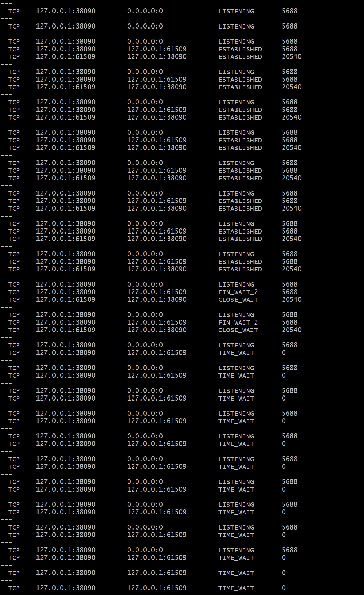
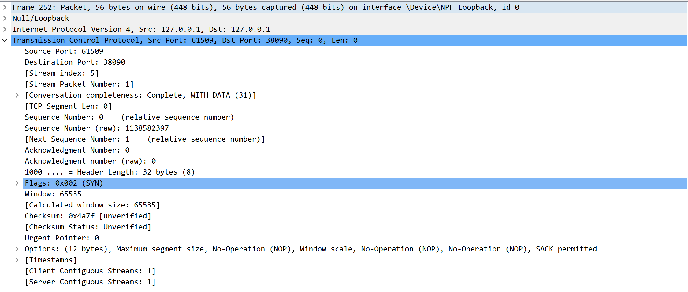
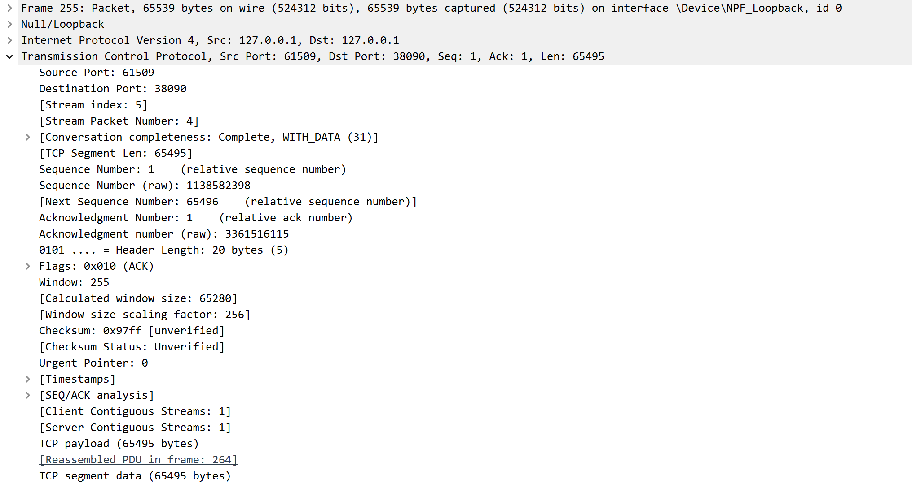
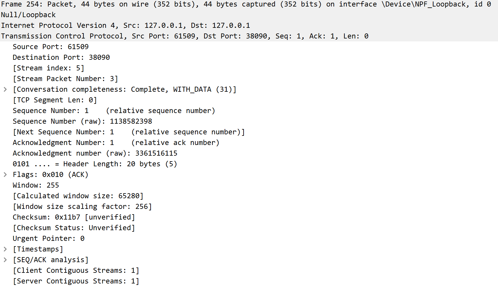
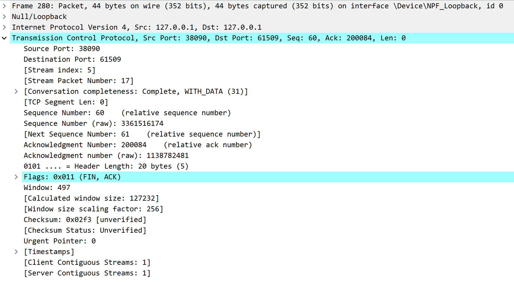

# Lab4：看见TCP 我不怕不怕啦

## 实验背景

本实验围绕一条 TCP 连接的完整生命周期展开，重点观察以下内容：

1. `socket()`、`listen()`、`accept()`、`connect()` 的职责区别
2. "连接"为什么本质上是交换控制信息而不是物理连线
3. TCP 头部中的端口号、序号、ACK 号、标志位、窗口、头部长度、可选字段
4. 三次握手如何建立收发准备
5. 应用层大块数据如何被 TCP 按 MSS 拆分
6. `Sequence Number` 与 `Acknowledgment Number` 如何配合工作
7. `recv()` 为什么会阻塞等待数据
8. 接收窗口如何反映接收方处理能力
9. ACK 与窗口更新为什么常常会被合并
10. `FIN` / `ACK` 如何完成断开
11. 为什么连接结束后套接字不会立刻删除

---

## 实验任务

### 任务一：准备实验环境并记录运行信息

**第一步：准备好四个窗口**

整个实验需要同时观察多个界面，建议在开始前把窗口布局摆好：

- **终端 A**：运行服务端
- **终端 B**：运行客户端
- **终端 C**：持续监控套接字状态（全程保持开启，不要关）
- **Wireshark**：抓包

**第二步：在终端 C 里启动持续监控**

TCP 状态变化很快，等你手动敲完 `ss` 命令再回车，状态可能已经过去了。用下面的命令让终端 C 每 0.5 秒自动刷新一次，之后只需要盯着这个窗口就行：

```bash
# Linux
watch -n 0.5 'ss -tan | grep 38090'

# macOS（没有 watch，用循环代替）
while true; do netstat -an | grep 38090; echo "---"; sleep 0.5; done

# Windows（Git Bash执行）
while true; do netstat -ano | grep 38090; echo "---"; sleep 0.5; done
```

如果你换了端口，把 `38090` 替换成实际端口。

**第三步：打开 Wireshark，选回环接口，填好过滤器，开始抓包**

回环接口在不同系统里名字不同：

| 系统 | 接口名 |
|:-----|:-------|
| Linux | `lo` |
| macOS | `lo0` |
| Windows | `Adapter for loopback traffic capture`（需提前安装 Npcap 并勾选回环支持） |

在显示过滤器里输入：

```text
tcp.port == 38090
```

然后点击开始抓包（蓝色鲨鱼鳍图标）。**先开始抓包，再运行脚本**，否则握手包会被漏掉。

**第四步：启动脚本**

```bash
# 终端 A
python3 tcp_lab4_server.py

# 终端 B（等服务端打印出 server listening on ... 后再运行）
python3 tcp_lab4_client.py
```

如果 `38090` 已被占用，两端都加环境变量换端口，同时记得把 Wireshark 过滤器和终端 C 里的端口号也改掉：

```bash
LAB4_PORT=38123 python3 tcp_lab4_server.py
LAB4_PORT=38123 python3 tcp_lab4_client.py
```

**第五步：填写下表**

| 项目                                | 你的填写内容 |
| :---------------------------------- | :----------- |
| 服务端监听地址                      |   127.0.0.1           |
| 服务端监听端口                      |  38090            |
| 客户端本地临时端口                  |    61509          |
| 客户端请求总字节数                  |    20083          |
| 服务端响应内容                      | 	HTTP/1.1 200 OK\nContent-Length: 2\nConnection: close            |
| 客户端 `connect()` 返回前后的时间点 |     调用前：09:22:25，返回后：09:22:25       |
| 客户端首次收到响应前等待了多久      |        4.536s      |

各项数值均可直接从终端输出读取：服务端监听信息在 `server listening on ...`，客户端本地端口在 `local socket = ...`，请求字节数在 `sendall() start, request bytes=...`，等待时间在 `first recv() returned after ...s`。


---

### 任务二：观察套接字创建与连接建立

1. 服务端启动后，观察终端 C 出现 `LISTEN` 状态，截图留存。
2. 在终端 B 里启动客户端，观察它依次打印 `socket created`、`calling connect()`、`connect() returned`。
3. 客户端打印 `connect() returned` 之后，观察终端 C 出现 `ESTABLISHED`，截图留存。脚本在 `connect()` 返回后有 2 秒停顿，这段时间足够截图。

填写下表：

| 阶段                             | 你的填写内容 |
| :------------------------------- | :----------- |
| 服务端启动、客户端未连入时的状态 |        LISTEN      |
| `connect()` 返回后服务端状态     |    ESTABLISHED          |
| `connect()` 返回后客户端状态     |       ESTABLISHED       |

简答题：

1. 服务端在客户端连接前为什么处于 `LISTEN`？
答：服务端调用 listen() 后进入监听状态，等待客户端发起连接请求，因此状态为 LISTEN。


2. 为什么这时还没有真正建立 TCP 连接？
答：TCP 连接必须通过三次握手才能建立，此时客户端尚未发起连接，握手未完成，因此未建立连接。


3. `socket()` 与 `connect()` 的区别是什么？
答：socket()：创建一个套接字对象，仅分配资源，不建立连接。connect()：主动向服务端发起 TCP 连接，完成三次握手。


4. 为什么 `connect()` 返回后才进入可稳定收发数据的状态？
答：connect() 会阻塞等待三次握手完成，握手成功后双方达成通信约定，才能可靠、有序地收发数据。


5. 为什么"网线一直连着"不等于"TCP 连接已经建立"？
答：网线连通是物理层正常，而 TCP 连接是传输层的逻辑连接，必须通过三次握手才能建立。


6. 这里的"连接"更准确地说是在做什么？
答：通过三次握手在通信双方建立可靠的、带状态的逻辑通信信道，用于保证数据有序、无误传输。




---

### 任务三：观察三次握手与 TCP 头部字段

**定位握手包**：在 Wireshark 过滤器里输入下面的条件，可以屏蔽中间的数据包，只留下握手和断开阶段的控制包：

```text
tcp.port == 38090 && (tcp.flags.syn == 1 || tcp.flags.fin == 1)
```

包列表最前面的三个包就是三次握手（SYN → SYN-ACK → ACK）。

**找到各字段的位置**：点击某个握手包，在下方详情栏展开 `Transmission Control Protocol`。源端口、目的端口、Seq、Ack、Flags、Window、Header Length 都在这里。TCP 选项在最底部的 `Options` 子项里，展开后可以看到 MSS、Window Scale、SACK Permitted，注意这三项只出现在带 SYN 标志的包里，纯 ACK 包里没有。

**关于序号显示**：Wireshark 默认开启相对序号，会把每个方向的初始序号归零显示，所以 SYN 包的 Seq 看起来是 `0`，而不是真实的随机大数。这是正常现象，实验报告按 Wireshark 显示的值填写即可。如果你想看真实值，可以去 `Edit → Preferences → Protocols → TCP` 里取消勾选 `Relative sequence numbers`。

填写下表：

| 报文       | 源端口 | 目的端口 | Seq  | Ack  | Flags | Window | Header Length |
| :--------- | :----- | :------- | :--- | :--- | :---- | :----- | :------------ |
| 第一次握手 |  61509     |  38090        |0      |   0   |     SYN  |    65535    |         32 字节      |
| 第二次握手 |    38090    |  61509       |0      |   1   |   SYN, ACK    | 65535       |          32 字节     |
| 第三次握手 | 61509     | 38090         |  1    |    1  |   ACK    |   65280       |   20 字节           |

第一次握手（SYN）的 Ack 字段在 Wireshark 里通常显示为空或 `0`，这是正常的，因为此时客户端还没有收到服务端的任何数据。Header Length 在没有选项时是 20 字节，握手包因为携带了 MSS 等选项通常是 28 或 32 字节。

| TCP 选项       | 你的填写内容 |
| :------------- | :----------- |
| MSS            |      65495         |
| Window Scale   |  8            |
| SACK Permitted | 是             |

回环接口的 MSS 通常是 65495（因为回环 MTU 是 65536，比以太网的 1500 大得多），这会影响后续任务五里是否能观察到分段。

简答题：

1. 发送方和接收方端口号在连接阶段的作用是什么？
答：端口号用于标识同一主机上的不同应用进程：服务端端口（38090）：固定监听端口，用于标识服务端应用，让客户端知道向哪个进程发起连接。客户端端口（53211）：临时端口，用于标识客户端发起连接的进程，让服务端知道响应发给哪个进程
作用：在 TCP 连接建立阶段，通过源 IP + 源端口 + 目的 IP + 目的端口四元组，唯一标识一条 TCP 连接，区分同一主机上的多个并发连接。


2. TCP 头部如何帮助找到目标套接字？
答：TCP 头部通过源端口、目的端口两个字段，结合 IP 头部的源 IP、目的 IP，组成四元组（源 IP、源端口、目的 IP、目的端口）：接收方收到报文后，通过目的端口找到对应的服务端套接字；服务端响应时，通过源端口找到对应的客户端套接字；四元组唯一标识一条 TCP 连接，确保数据准确交付到目标应用进程。


3. 为什么初始序号不是简单固定从 1 开始？
答：（1）安全原因：防止攻击者伪造旧连接的报文，干扰新连接；
（2）避免序号冲突：若固定从 1 开始，旧连接的延迟报文可能被新连接误判为有效数据；
（3）TCP 规范要求：初始序号（ISN）由系统随机生成，保证每个连接的序号空间独立，提升可靠性和安全性。


4. 为什么 TCP 可选字段更容易在连接阶段看到？
答：（1）TCP 选项（MSS、窗口缩放、SACK 等）是连接建立阶段的协商参数，仅在三次握手的 SYN 包中携带；
（2）作用：双方在连接建立时协商通信参数（如最大分段大小、窗口放大倍数），后续数据传输阶段无需重复携带；
（3）纯 ACK / 数据报文仅包含基础头部（20 字节），无选项，因此仅在连接阶段（SYN 包）能看到选项字段。




---

### 任务四：区分头部中的控制信息和套接字中的控制信息

用以下过滤器分别找到两类报文：

```text
# 纯控制报文（无应用数据）
tcp.port == 38090 && tcp.len == 0

# 携带应用数据的报文
tcp.port == 38090 && tcp.len > 0
```

从纯控制报文里选一个（SYN、纯 ACK 或 FIN-ACK 都可以），从数据报文里选一个（客户端发请求或服务端发响应的包）。

填写下表：

| 项目                   | 你的填写内容 |
| :--------------------- | :----------- |
| 纯控制报文的类型       |  SYN 报文（同步报文）            |
| 携带应用数据的报文类型 |    客户端 HTTP 请求报文（带 ACK 的数据报文）          |
| 头部中的控制信息举例   |    SYN、ACK、Seq、Ack、Window       |
| 套接字中的控制信息举例 | 源 IP 127.0.0.1、目的 IP 127.0.0.1、源端口 61509、目的端口 38090  |

简答题：

1. 为什么"头部中的控制信息"和"套接字中的控制信息"不是同一件事？
答：套接字控制信息是IP 地址 + 端口号，用于标识通信双方，整个连接固定不变。TCP 头部控制信息是标志位、序号、确认号等，用于控制可靠传输，随报文动态变化。二者层级、功能完全不同。


---

### 任务五：观察数据分段、序号与 ACK

客户端发送的请求体是 200000 字节，超过了回环接口 MSS（约 65495 字节），因此应该可以在 Wireshark 里看到多个连续的数据段。用下面的过滤器找到客户端发出的数据包：

```text
tcp.srcport != 38090 && tcp.port == 38090 && tcp.len > 0
```

在包列表里连续选几个数据段，对比它们的 Seq 值。相邻两段的关系是：后一段的 Seq = 前一段的 Seq + 前一段的 TCP Segment Len。

找服务端返回给客户端的纯 ACK 报文：

```text
tcp.srcport == 38090 && tcp.flags.ack == 1 && tcp.len == 0
```

填写下表：

| 数据段  | Seq  | Ack  | TCP Segment Len | Flags |
| :------ | :--- | :--- | :-------------- | :---- |
| 第 1 段 |    1  |   1   |   65495              |    ACK   |
| 第 2 段 |   65496   |     1 |          65495       |  ACK     |
| 第 3 段 |  130991    |   1   |   65495              |   ACK    |

| ACK 报文 | Ack Number | Flags | Window |
| :------- | :--------- | :---- | :----- |
| 第 1 个  |    	65496        |    ACK	  |    65535    |
| 第 2 个  |     130992       |  	ACK   |  65535      |
| 第 3 个  |     196488       |   ACK    |    65535    |

| 项目                         | 你的填写内容 |
| :--------------------------- | :----------- |
| 是否发生分段                 |    是          |
| 握手中观察到的 MSS           |      65495        |
| 单段长度与 MSS 的关系        |       单段长度等于 MSS       |
| ACK 号大致确认到了第几个字节 |    200084          |

简答题：

1. 应用程序是否直接决定每个网络包的数据长度？为什么？
答：不直接决定。 应用只交给 TCP 数据，TCP 按 MSS、网络状况自动分段。


2. 大块应用数据为什么会被拆分？
答：因为应用层数据大于 MSS，必须拆分成多个 TCP 段才能传输。


3. `MSS` 与 `MTU` 的关系是什么？
答：MSS = MTU − IP 头部 − TCP 头部，MSS 是 TCP 数据部分最大长度。


4. "一次 `sendall()`"与"一个 TCP 包"之间是什么关系？
答：一次 sendall () 会被拆成多个 TCP 包，不是一一对应。


5. 为什么 ACK 体现的是累计确认？
答：累计确认：ACK 表示之前所有字节都收到，不用逐个确认。


6. 如果中间某一段丢失，ACK 会出现什么变化？
答：某段丢失，ACK 会一直停在丢失位置前，触发重传。





---

### 任务六：观察 `recv()` 阻塞与窗口字段

`recv()` 的等待时间直接从客户端终端读取，`calling recv() and waiting for response` 到 `first recv() returned after ...s` 之间就是等待时长，脚本已经帮你计算好了。

在 Wireshark 里找窗口值：用过滤器 `tcp.port == 38090 && tcp.flags.ack == 1` 列出所有 ACK 包，点击其中一个，在详情栏 `Transmission Control Protocol` 里找 `Window` 字段。如果同时显示了 `Calculated window size`，优先看这个值，它已经把 Window Scale 的缩放算进去了，是对方实际能接收的字节数。

如果包列表的 Info 列出现了 `[TCP Window Update]` 标注，说明这个包的主要目的是通知对方窗口变化，重点观察它的 `Window` 字段。

填写下表：

| 项目                                   | 你的填写内容 |
| :------------------------------------- | :----------- |
| 客户端开始调用 `recv()` 的时间         |       09:22:27       |
| 客户端第一次收到响应的时间             |      09:22:32        |
| `recv()` 是否立刻返回                  |    否         |
| 首次收到响应前等待了多久               |        4.536s      |
| `recv()` 等待期间连接是否已经建立      |         是     |
| 第 1 个 ACK 报文的窗口值               |     65280         |
| 第 2 个 ACK 报文的窗口值               |       65280       |
| 第 3 个 ACK 报文的窗口值               |      65535     |
| 窗口值是否变化                         |   是           |
| 若变化，变化趋势                       |    基本稳定，传输过程中动态更新          |
| ACK 与窗口更新是否可以出现在同一个包中 |       可以       |
| 是否看到 RTT 或 ACK 往返时间相关信息   |      是        |

简答题：

1. "连接建立"和"应用收到数据"之间是什么关系？
答：连接建立只完成握手，应用收到数据要等数据真正到达。


2. 为什么说 `read` / `recv` 在数据未到达时会被挂起？
答：recv () 是阻塞调用，没数据就挂起，直到收到数据或出错。


3. 窗口字段反映了接收方哪方面的能力？
答：窗口反映接收方的缓存接收能力。


4. 为什么发送方不能无限制连续发送数据？
答：发送方受接收方窗口限制，不能无限发送，否则会溢出。


5. 滑动窗口为什么既提高效率又避免压垮接收方？
答：滑动窗口允许连续发送多段，提高效率；同时受窗口限制，不会压垮接收方。


---

### 任务七：观察响应返回与双向 `seq/ack`

TCP 的 Seq/Ack 是双向独立的，客户端有自己的发送序号，服务端有自己的发送序号。用下面的过滤器只看服务端发出的数据包（源端口是 38090，有应用数据）：

```text
tcp.srcport == 38090 && tcp.len > 0
```

紧跟在服务端数据包后面的、客户端发出的 ACK 包，其 Ack Number 确认的就是服务端的发送序号。

填写下表：

| 项目                     | 你的填写内容 |
| :----------------------- | :----------- |
| 服务端响应数据报文的 Seq |     1         |
| 服务端响应数据报文的 Ack |        200084      |
| 客户端确认报文的 Ack     |        60      |

简答题：

1. 为什么 TCP 的 `seq/ack` 是双向分别计算的？
答：TCP 是全双工通信协议，客户端和服务端可以同时独立发送和接收数据，相当于两条独立的单向数据流。双向分别计算 seq/ack，才能保证两个方向的数据流都能独立进行可靠传输、流量控制，互不干扰。


2. 为什么双方都需要各自的初始序号？
答：初始序号（ISN）是三次握手时双方各自生成的随机序号，核心作用是防止历史连接的延迟旧报文干扰当前连接，避免数据错乱。同时，双向独立的初始序号是双向独立 seq/ack 计算的基础，支撑两个方向的可靠传输。


3. 为什么发送应用数据时报文通常仍然带 `ACK`？
答：TCP 采用捎带确认（piggybacking）机制：当一方有数据要发送时，会把对对方数据的确认（ACK）“搭便车” 放在自己的数据报文里，不用单独发空 ACK 包，大幅减少网络报文数量，提升传输效率。


---

### 任务八：观察连接断开与套接字延迟删除

用下面的过滤器精确定位所有带 FIN 的包：

```text
tcp.port == 38090 && tcp.flags.fin == 1
```

通常会看到两个 FIN 包（双方各一个）。看第一个 FIN 包的源端口，就能判断谁先发起断开。

**关于 TIME-WAIT**：TIME-WAIT 只出现在主动发起关闭的一方（先发 FIN 的那端）。服务端脚本在 `conn.close()` 之后会继续运行 10 秒再退出，这段时间可以在终端 C 里观察 TIME-WAIT。Linux 上 TIME-WAIT 通常持续约 60 秒，macOS 上可能较短，如果没有观察到请如实说明。

填写下表：

| 项目                                    | 你的填写内容 |
| :-------------------------------------- | :----------- |
| 谁先发送 FIN                            | 服务端（源端口 38090）             |
| 关闭阶段共观察到几个带 FIN 的报文       |   两个           |
| 最终 ACK 是否可见                       |   可见           |
| 关闭后是否观察到 `TIME-WAIT` 或等价现象 |     是         |

简答题：

1. 为什么关闭连接不能只发一个结束通知？
答：TCP 是全双工通信，连接的两个方向（客户端→服务端、服务端→客户端）是独立的，需要分别关闭：
仅发一个 FIN 只能关闭单向的发送通道，另一方仍可继续发送数据，无法彻底终止整条连接。
必须通过四次挥手（双方各发一个 FIN+ACK，再各回一个 ACK），才能分别关闭两个方向的通信，确保双方都完成数据发送和接收，安全终止连接。


2. 为什么连接结束后套接字不会立刻删除？
答：主动关闭方需要进入TIME-WAIT 状态（持续 2MSL，约 60 秒），核心原因：
保证最后一个 ACK 可靠到达：若最后一个 ACK 丢失，被动关闭方会重发 FIN，主动方仍在 TIME-WAIT 状态可重发 ACK，避免连接异常终止。
防止旧连接的延迟报文干扰新连接：确保网络中所有旧连接的报文都超时消失，避免旧报文被误送到新建立的同端口连接中，保证连接的独立性和可靠性。


3. 如果最后一个 ACK 丢失，而旧套接字已经立刻删除，可能带来什么问题？
答：被动关闭方因未收到 ACK，会认为连接未正常关闭，持续重发 FIN 报文。
主动方已删除套接字，收到重发的 FIN 后会回复 RST（复位）报文，导致被动方连接异常中断。
若此时有新的连接复用了相同的端口号，旧连接的延迟报文或重发的 FIN 会被新连接误判为有效数据，造成数据错乱、连接异常，破坏 TCP 通信的可靠性。




---

## 问答题

1. TCP 的"连接"到底意味着什么？它为什么不是"把网线连上"？
答：TCP 连接是双方协商好的逻辑信道，靠三次握手建立，不是物理网线连接。


2. 三次握手为什么能让双方进入可通信状态？
答：三次握手让双方确认收发能力、初始序号、参数，进入可稳定通信状态。


3. TCP 头部中的控制字段如何支撑收发数据？
答：端口定位进程、Seq/Ack 保证顺序、标志位管理连接、窗口做流量控制。


4. ACK、窗口、等待时间为什么会共同影响 TCP 的可靠传输？
答：ACK 保证可靠、窗口限制发送速度、等待时间影响重传与效率。


5. 断开连接为什么仍然需要严格的控制信息交换？
答：断开要双向关闭通道，必须交换 FIN/ACK 确保数据收发完毕。


6. 如果服务端根本没有启动，客户端调用 `connect()` 时会看到什么现象？
答：客户端 connect () 会失败、超时或被拒绝。


7. 如果中途人为制造丢包，ACK、重传、窗口之间会出现什么变化？
答：丢包会导致ACK 停滞、重传、窗口暂时减小。


8. 如果把客户端发送的数据改得更大，窗口字段和分段情况会如何变化？
答：数据更大会造成分段更多，窗口会动态调整。


9. 如果把服务端读取速度改得更慢，是否更容易看到窗口更新甚至零窗口？
答：服务端读得慢会导致接收窗口变小，所有更容易出现窗口更新甚至零窗口。


---

## 截图要求

- 截图须清晰，终端文字和 Wireshark 字段可读。
- 所有截图与本 `Lab4.md` 放在同一目录下。
- 命名规范：

| 截图内容               | 文件名                  |
| :--------------------- | :---------------------- |
| 服务端与客户端运行结果 | `run.png`               |
| `ss` 状态变化          | `states.png`            |
| 三次握手与 TCP 选项    | `handshake_header.png`  |
| 大请求分段与 MSS       | `segmentation.png`      |
| ACK 与窗口观察         | `ack_window.png`        |
| 断开与最终状态         | `teardown_timewait.png` |

具体要求：

1. `run.png`：终端截图，至少能看到服务端 `server listening on ...`、客户端 `calling connect()`、`connect() returned`、`calling recv() and waiting for response`、`first recv() returned after ...s`。

2. `states.png`：终端截图，至少能看到 `LISTEN`、`ESTABLISHED`，以及 `TIME-WAIT`（若能观察到）。推荐截 `watch` 命令的持续输出画面，可以在一张截图里同时展示多个状态的变化过程。

3. `handshake_header.png`：Wireshark 截图，至少能看到三次握手中某个包的 `Source Port`、`Destination Port`、`Sequence Number`、`Acknowledgment Number`、`Flags`、`Window`，以及 `Options` 中的 `Maximum segment size`、`Window Scale`、`SACK Permitted`。

4. `segmentation.png`：Wireshark 截图，至少能看到客户端发送数据的 TCP 包的 `TCP Segment Len`、`Seq`、`Ack`。若能观察到分段，尽量截出多个连续数据段。

5. `ack_window.png`：Wireshark 截图，至少能看到一个或多个 ACK 报文的 `Acknowledgment Number`、`Window`，以及 `Calculated window size`（若显示）、`[TCP Window Update]`（若出现）。

6. `teardown_timewait.png`：Wireshark 截图或 Wireshark 与终端截图的拼图，至少能看到带 `FIN` 的包，以及 `TIME-WAIT` 状态（若能观察到）。

---

## 提交要求

在自己的文件夹下新建 `Lab4/` 目录，提交以下文件：

```text
学号姓名/
└── Lab4/
    ├── Lab4.md
    ├── tcp_lab4_server.py
    ├── tcp_lab4_client.py
    ├── run.png
    ├── states.png
    ├── handshake_header.png
    ├── segmentation.png
    ├── ack_window.png
    └── teardown_timewait.png
```

---

## 截止时间

2026-04-23，届时关于 Lab4 的 PR 请求将不会被合并。
