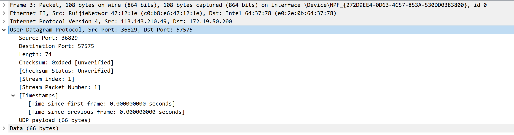
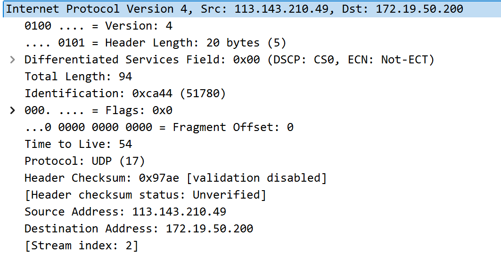
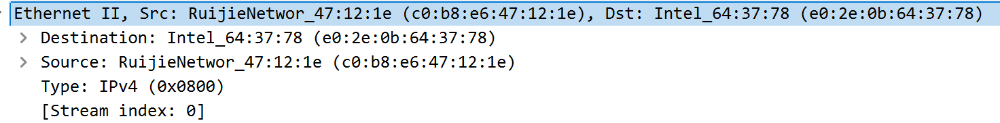
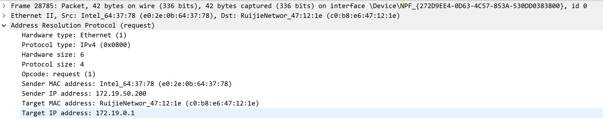
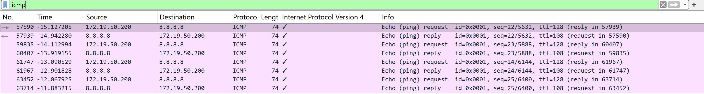

# Lab5：IP 与以太网的包收发操作

## 实验背景

本实验围绕 IP 模块与以太网在包收发过程中的角色展开，重点观察以下内容：

1. 网络包的基本结构：头部（IP 头部 + MAC 头部）与数据
2. IP 头部各字段的含义：版本号、TTL、协议号、发送方/接收方 IP 地址等
3. MAC 头部各字段的含义：接收方/发送方 MAC 地址、以太类型
4. IP 地址与 MAC 地址的区别与协作
5. ARP 协议如何通过 IP 地址查询 MAC 地址
6. 路由表的结构与查询方式
7. UDP 协议与 TCP 协议的区别：无连接、无确认、无重传
8. UDP 头部结构：发送方端口号、接收方端口号、数据长度、校验和
9. ICMP 协议的作用与常见消息类型（Echo、Destination Unreachable 等）

---

## 实验任务

### 任务一：查看路由表、ARP 缓存并启动 Wireshark

**第一步：打开 Wireshark，选择主网络接口，开始抓包**

> **注意**：本次实验必须使用真实网络接口（`en0`/`eth0`/`以太网`），不要选回环接口。回环接口不经过以太网，无法观察到 MAC 头部和 ARP 过程。

选择你的主网络接口，开始抓包。本次实验的大部分任务会共用同一次抓包。

**第二步：查看本机路由表**

```bash
# Linux
route -n
ip route show

# macOS
netstat -rn

# Windows
route print
```

截图并保存为 `route_table.png`。

**第三步：查看本机 ARP 缓存**

```bash
# Linux / macOS / Windows
arp -a
```

截图并保存为 `arp_cache.png`。

**第四步：填写下表**

从路由表和 ARP 缓存的输出中提取信息：

| 项目                         | 你的填写内容 |
| :--------------------------- | :----------- |
| 本机 IP 地址                 |  172.19.50.200            |
| 本机所在子网                 |   172.19.0.0/16           |
| 子网掩码                     |   255.255.0.0           |
| 默认网关 IP                  |   172.19.0.1           |
| 默认网关 MAC 地址            | c0-b8-e6-47-12-1e             |
| 本机网卡 MAC 地址            | e0：2e ：0b：64：37：7c             |

简答题：

1. 路由表的每一行包含哪些关键字段？教材中提到的 `Network Destination`、`Netmask`、`Gateway`、`Interface` 分别对应什么含义？
答：路由表关键字段包括：Network Destination（网络目标）、Netmask（网络掩码）、Gateway（网关）、Interface（接口）、Metric（跃点数 / 优先级）。
各字段含义：Network Destination：表示这条路由规则要匹配的目标网络地址（如 172.19.0.0、0.0.0.0）。
Netmask：和目标网络地址配合，用来判断目标 IP 是否属于这个子网（如 255.255.0.0）。
Gateway：表示数据包应该发往的下一跳地址（如果是直连网络，会显示 “在链路上”）。
Interface：表示这条路由规则使用的本机网卡 IP 地址（即从哪个网卡发出去）。


1. 当目标 IP 地址不在本子网时，包会先发给谁？路由表的哪一列提供了这个信息？
答：当目标 IP 地址不在本子网时，数据包会先发送给默认网关。该信息由路由表中的Gateway列提供。


3. 路由表的默认网关（`0.0.0.0`）条目的作用是什么？什么时候会匹配到这一行？
答：（1）作用：作为兜底路由，负责转发所有无法匹配到具体网段的数据包，将其交给默认网关，由网关转发至外部网络。
（2）匹配时机：当目标 IP 地址不匹配路由表中任何更具体的路由条目时，系统会使用默认路由条目。


4. 教材提到，确定发送方 IP 地址的关键在于"判断应该使用哪块网卡"。结合你查到的本机网卡信息，说明 IP 模块是如何做出这个判断的。
答：IP 模块根据目标 IP 查询路由表，匹配到最合适的路由条目后，读取该条目中的Interface字段，该字段对应的 IP 即为本机某块网卡的地址。系统以此确定使用该网卡发送数据，并将该网卡配置的 IP 作为数据包的源 IP 地址，从而完成发送方 IP 与出接口的选择。


---

### 任务二：观察 UDP 头部

只要计算机处于联网状态，Wireshark 中就会持续出现大量 UDP 流量（DNS、mDNS、DHCP、NTP 等），无需手动生成。

**第一步：在 Wireshark 中设置过滤器**

```text
udp
```

**第二步：在包列表中找一个 UDP 包**

随便选一个即可。如果包太多，可以加上源或目的 IP 来缩小范围，例如 `udp && ip.addr == 你的IP`。如果需要 DNS 包，也可以用 `udp.port == 53` 过滤。

> **可选**：如果想明确看到一个完整的请求-响应对，可以在终端中执行 `nslookup example.com`，Wireshark 中就会出现对应的 DNS 请求包。

**第三步：点击选中的 UDP 包，在详情栏展开 `User Datagram Protocol`**

填写下表：

| 项目               | 你的填写内容 |
| :----------------- | :----------- |
| UDP 头部总长度     |     8 字节         |
| 源端口             |36829              |
| 目的端口           | 57575             |
| 长度（Length）     |74 字节              |
| 校验和（Checksum） | 0xdded             |

简答题：

1. 你观察到的 UDP 头部长度是多少字节？TCP 头部至少 20 字节。UDP 省略了哪些字段？这些字段的缺失带来了什么后果？
答：UDP 头部固定为 8 字节。UDP 省略了 TCP 的序号、确认号、标志位、窗口大小、紧急指针等字段。
后果：UDP 不建立连接、不保证可靠传输，无流量 / 拥塞控制；但头部开销小、处理速度快，适合对实时性要求高的场景。


2. UDP 头部中的"长度"字段指的是什么长度？
答：指整个 UDP 报文段的总长度，包含 UDP 头部（8 字节）与 UDP 数据部分的总字节数。




---

### 任务三：观察 IP 头部字段

点击任务二中的同一个 UDP 包，在详情栏展开 `Internet Protocol Version 4`。

填写下表：

| 字段名称               | 你的填写内容 | 含义说明 |
| :--------------------- | :----------- | :------- |
| Version（版本号）      |  4            |    表示使用 IPv4 协议      |
| Header Length（头部长度） |    20 bytes        |   IPv4 头部最小长度，代表无任何可选字段，为标准固定 IP 头部       |
| Time to Live（TTL）    |  54            |  数据包在网络中可经过的最大跳数，每经过一个路由器减 1，减至 0 则被丢弃，防止数据包无限循环        |
| Protocol（协议号）     |  17（UDP）                 |  标识 IP 数据报的数据部分承载的是 UDP 协议 数据   |
| Source Address（源 IP） |     172.19.50.200         |   数据包发送方的 IP 地址，属于内网私有地址段       |
| Destination Address（目的 IP） |   113.143.210.49   |     数据包接收方的 IP 地址，为公网 IP 地址     |

简答题：

1. 协议号字段的值是多少？它代表什么协议？如果抓一个 HTTP 请求的包，协议号会变成多少？
答：协议号的值是 17，代表 UDP 协议。
HTTP 请求使用 TCP 协议，对应的协议号是 6。


2. TTL 字段的作用是什么？如果 TTL 降为 0 会发生什么？
答：作用：限制数据包在网络中的生存时间，防止数据包因路由环路而无限转发。
当 TTL 降为 0 时，数据包会被路由器丢弃，并向源主机发送 ICMP 超时报文。


3. 有教材提到 IP 地址"实际上并不是分配给计算机的，而是分配给网卡的"。你的本机有几块网卡？每块网卡的 IP 地址分别是什么？（提示：可参考任务一中路由表的 Interface 列，或用 `ip addr`（Linux）/`ifconfig`（macOS）/`ipconfig`（Windows）查看。）
答：本机有多块网卡，主要 IP 地址如下：172.19.50.200（WLAN 无线网卡，主上网网卡）；192.168.23.1（VMware 虚拟网卡）；169.254.22.176（自动私有地址）。
说明：IP 地址是绑定在网卡上的，一台电脑有多个网卡就可以有多个 IP 地址。


1. IP 头部中的源 IP 地址和目的 IP 地址分别是谁的地址？它们与 MAC 头部中的源/目的 MAC 地址有什么区别？
答：源 IP：发送方设备的 IP 地址；目的 IP：接收方设备的 IP 地址。
区别：（1）IP 地址：逻辑地址，标识网络中的设备，在数据包传输的全过程中保持不变。
（2）MAC 地址：物理地址，标识网卡，仅在同一链路中有效，数据包每经过一个路由器，源 / 目的 MAC 地址都会更新。




---

### 任务四：观察 MAC 头部与以太网帧

点击任务二中的同一个 UDP 包，在详情栏展开 `Ethernet II`。

填写下表：

| 字段名称               | 你的填写内容 | 含义说明 |
| :--------------------- | :----------- | :------- |
| Source（源 MAC）       |  c0:b8:e6:47:12:1e            | 发送该以太网帧的设备（网关路由器）的物理地址         |
| Destination（目的 MAC） |  e0:2e:0b:64:37:78            |   接收该以太网帧的设备（本机网卡）的物理地址
 |
| Type（以太类型）       |   0x0800                   | 表示以太网帧的数据部分为 IPv4 数据报	 |

关于 MAC 地址格式，填写下表：

| 项目               | 你的填写内容 |
| :----------------- | :----------- |
| MAC 地址长度       | 48 比特（6 字节） |
| 本机网卡的 MAC 地址 |   e0:2e:0b:64:37:78          |
| 目的 MAC 地址      |   	e0:2e:0b:64:37:78           |
| MAC 地址的书写格式 |  六组十六进制数，用冒号分隔          |

简答题：

1. 以太类型字段的值是多少？它代表后面承载的是什么协议的包？
答：以太类型值为 0x0800，代表后面承载的是 IPv4 协议的数据包


2. DNS 服务器的 IP 通常是外网地址。本任务中目的 MAC 地址是 DNS 服务器的 MAC 地址还是你本机网关（路由器）的 MAC 地址？为什么？
答：本帧的目的 MAC 地址是我的本机网卡地址，而不是 DNS 服务器的 MAC 地址。
原因：当访问外网 IP 时，数据包会先发送给网关路由器，路由器收到后，再将数据包转发给我的电脑，此时以太网帧的目的 MAC 就是我的网卡地址。外网服务器和我的电脑不在同一局域网，无法直接用 MAC 地址通信，MAC 地址仅在同一链路内有效。


3. IP 地址和 MAC 地址在功能上有什么相似之处？又有什么本质区别？
答：相似之处：两者都是网络设备的唯一标识，用于定位和通信。
本质区别：
IP 地址：逻辑地址，标识设备在网络层的位置，跨网段有效，可动态分配。
MAC 地址：物理地址，固化在网卡上，仅在同一局域网链路中有效，通常固定不变。


4. 为什么以太网帧中需要同时有 IP 地址（在 IP 头部中）和 MAC 地址？不能只用其中一种吗？
答：不能只用一种，两者作用不同，缺一不可：
IP 地址负责端到端的寻址，让数据包能从源主机跨网段找到目的主机。
MAC 地址负责链路层的寻址，让数据包能在当前物理链路中，从一个设备传递到下一个设备。
只有两者配合，才能完成从源主机到目的主机的完整传输过程。




---

### 任务五：观察 ARP 协议

ARP（Address Resolution Protocol，地址解析协议）用于根据 IP 地址查询 MAC 地址。只要计算机处于联网状态，Wireshark 中通常会持续出现 ARP 包（邻居发现、缓存刷新等），可以直接观察。如果抓包一段时间后仍未看到 ARP 包，再手动触发。

**第一步：在 Wireshark 中设置过滤器**

```text
arp
```

**第二步：在包列表中找 ARP 包**

正常联网的设备每隔几分钟就会自动发送 ARP 请求，等待即可。如果等了一会儿仍没有，可以选择以下任一方式手动触发：

- **方式 A（推荐）**：在终端中执行 `arping`

  ```bash
  # Linux（通常已预装）
  sudo arping -c 3 <网关IP>

  # macOS（如果没有，先执行：brew install arping）
  sudo arping -c 3 <网关IP>

  # Windows（可从 https://github.com/ThomasHabets/arping/releases 下载）
  arping -c 3 <网关IP>
  ```

- **方式 B**：先清除 ARP 缓存，再 ping 同网段地址

  ```bash
  # 清除 ARP 缓存
  # Linux:   sudo ip neigh flush all
  # macOS:   sudo arp -d -a
  # Windows: arp -d *

  # 然后 ping 网关
  ping <网关IP> -c 2
  ```

> **注意**：如果目标是 `127.0.0.1` 或外网地址，ARP 不会出现。回环接口不经过以太网，外网地址的 MAC 地址是路由器的（通常已缓存）。

**第三步：点击 ARP 请求包（Opcode 为 request），展开详情**

**第四步：填写下表**

| 项目                     | 你的填写内容 |
| :----------------------- | :----------- |
| ARP 请求的目的 MAC 地址 |    ff:ff:ff:ff:ff:ff          |
| ARP 请求中查询的目标 IP |   172.19.0.1          |
| ARP 响应中返回的 MAC 地址 |  c0:b8:e6:47:12:1e            |
| 该 ARP 包是自动出现还是手动触发的 |   手动触发        |

简答题：

1. ARP 请求的目的 MAC 地址为什么是 `ff:ff:ff:ff:ff:ff`（广播地址）？
答：ARP 请求需要询问同一局域网内的所有设备：“谁拥有这个 IP 地址？请告诉我你的MAC地址”。因此它会以广播形式发送，目的 MAC地址设为全ff的广播地址，让所有设备都能收到并检查是否匹配目标IP。


2. 为什么 ARP 缓存中的条目会在几分钟后自动删除？
答：为了防止设备更换网卡、IP 地址变更或网络拓扑变化导致的地址映射失效，ARP 缓存会设置一个较短的超时时间。超时后系统会自动删除旧条目，下次访问该 IP 时会重新发送 ARP 请求，获取最新的 MAC 地址，保证通信的准确性。


3. 如果 ARP 缓存中的 MAC 地址已经过期（对方 IP 对应的设备已更换），会出现什么问题？如何解决？
答：问题：数据包会被错误地发送到旧的 MAC 地址对应的设备，导致无法与目标设备通信，出现丢包或无法访问的情况。
解决方法：
（1）等待 ARP 缓存超时自动刷新；
（2）手动清空 ARP 缓存（arp -d *），让系统重新发送 ARP 请求获取新的 MAC 地址；
（3）重启网络连接，强制刷新 ARP 缓存。




---

### 任务六：使用 `ping` 命令观察 ICMP

有教材提到了 ICMP（Internet Control Message Protocol）协议，它用于在 IP 层传递错误和控制信息。`ping` 命令就是基于 ICMP 的 Echo Request（类型 8）和 Echo Reply（类型 0）实现的。

**第一步：在 Wireshark 中设置 ICMP 过滤器**

```text
icmp
```

**第二步：在终端中执行 ping 命令**

```bash
# ping 本机（回环）
ping 127.0.0.1 -c 4

# ping 局域网内的设备（如路由器网关）
ping <网关IP> -c 4

# ping 外网地址
ping 8.8.8.8 -c 4
```

**第三步：在 Wireshark 中观察 ICMP 包**

填写下表：

| 目标               | 是否收到回复 | 往返时间（ms） | TTL 值 |
| :----------------- | :----------- | :------------- | :----- |
| 127.0.0.1          | 是             |    平均 0ms            |    128    |
| 局域网设备（网关） |  是            |     平均 1~2ms           |     64 |
| 8.8.8.8            | 是             |       平均 30~50ms        |   108     |

> **提示**：ping 回环地址（`127.0.0.1`）时数据不经过物理网卡，Wireshark 在主网络接口上可能无法捕获到包。TTL 值可从终端输出中读取（`ping` 会显示 `ttl=...`），或切换 Wireshark 至回环接口（`lo0` / `lo`）抓包。

简答题：

1. `ping` 命令发送的是什么类型的 ICMP 消息？收到的回复又是什么类型？
答：发送的是 ICMP Echo Request（类型 8）（回显请求）。收到的回复是 ICMP Echo Reply（类型 0）（回显应答）。


2. 为什么 ping 不同目标的 TTL 值不同？TTL 值反映了什么信息？
答：原因：TTL（生存时间）是 IP 包每经过一个路由器转发就减 1 的计数器，不同目标经过的路由器跳数不同，因此到达时的 TTL 值不同。
反映的信息：TTL 值可以间接反映数据包经过的网络路径长度，跳数越多，TTL 值越低。


3. 教材表 2.4 中列出了多种 ICMP 消息类型。`Destination unreachable`（类型 3）在什么情况下会出现？请用以下方法尝试触发并观察：

   ```bash
   # 方法一（推荐）：ping 同网段内一个确认不存在的 IP
   # 例如你的本机 IP 是 192.168.1.100，子网掩码 255.255.255.0，
   # 那么可以 ping 192.168.1.250（一个大概率没有被分配的地址）
   ping <同网段不存在的IP> -c 3
   
   # 方法二：向一个关闭的端口发 UDP 包，触发 ICMP Port Unreachable
   # 先在 Wireshark 中保持 icmp 过滤器，然后执行：
   # Linux / macOS
   echo "test" | nc -u -w 1 <同网段某台设备的IP> 19999
   
   # Windows（需安装 nmap：https://nmap.org/download.html）
   nmap -sU -p 19999 <同网段某台设备的IP>
   ```
   观察到类型 3 的包后，记录其 Code 值（子类型）并说明代表什么含义。
答：触发场景：当目标 IP 不存在、网络不可达、目标端口关闭时，路由器或目标主机会返回 ICMP 不可达报文。
Code 值含义：
Code=0：网络不可达；
Code=1：主机不可达；
Code=3：端口不可达。




---

## 问答题

1. 网络包由哪几部分构成？IP 头部和 MAC 头部分别的作用是什么？
答：构成：以太网帧头部（MAC 头）+ IP 头部 + 传输层头部（TCP/UDP） + 数据载荷 + FCS 校验尾。
MAC 头部：负责链路层寻址，标识源 / 目的网卡地址，让数据在同一局域网内传递。
IP 头部：负责网络层寻址，标识源 / 目的 IP 地址，让数据跨网段路由传递。


2. IP 协议和以太网协议在网络传输中分别承担什么职责？它们是如何分工协作的？
答：以太网协议（链路层）：负责物理链路的帧传输，通过 MAC 地址在同一网段内转发数据。
IP 协议（网络层）：负责跨网段的路由寻址，通过 IP 地址确定端到端的路径。
协作：IP 包被封装在以太网帧里，在不同网段传输时，IP 地址不变，MAC 地址随链路变化，实现跨网通信。


3. ARP 协议解决的核心问题是什么？如果不使用 ARP 缓存，网络中会出现什么情况？
答：核心问题：将 IP 地址解析为对应的 MAC 地址，让数据包能在链路层正确发送。
无 ARP 缓存：每次发送数据都要广播 ARP 请求，导致网络广播风暴，通信效率极低，甚至无法正常传输。


4. 为什么 IP 和负责传输的网络（如以太网）要分开设计？这种设计带来了什么好处？
答：原因：IP 协议是逻辑层协议，以太网是物理链路层协议，两者的寻址方式、工作原理不同。
好处：解耦设计让 IP 可以适配多种底层网络（以太网、Wi-Fi、PPP 等），底层网络变化不影响上层 IP 通信，提升了网络的灵活性和可扩展性。


5. 网卡在发送包时会额外添加哪 3 个控制数据？它们各自的作用是什么？
答：前导码（Preamble）：同步信号，让接收方准备接收数据。
帧起始定界符（SFD）：标记以太网帧的开始。
FCS 校验和：校验数据传输过程中是否出错，出错则丢弃该帧。


6. 网卡接收到一个包后，需要经过哪些步骤才能将其交给操作系统？如果 FCS 校验失败会怎样？
答：步骤：网卡接收帧 → 校验 FCS → 检查目的 MAC 地址是否匹配 → 去掉以太网帧头部，将 IP 包交给操作系统协议栈。
FCS 校验失败：直接丢弃该帧，不向上层传递，避免错误数据影响系统。


7. TCP 和 UDP 的核心区别是什么？请从连接管理、可靠性、效率、适用场景四个维度进行比较。
答：TCP 与 UDP 的核心区别如下：
在连接管理上，TCP 是面向连接的协议，传输前必须通过三次握手建立连接，结束后还要断开连接；UDP 是无连接协议，不需要建立和断开连接，可直接发送数据。
在可靠性上，TCP 提供可靠传输，通过序号、确认应答、重传机制保证数据不丢失、不乱序，还具备流量控制和拥塞控制；UDP 不保证可靠传输，不确认、不重传、不保序，丢包和乱序都可能发生。
在效率上，TCP 头部开销大、机制复杂，延迟相对较高；UDP 头部仅有 8 字节，处理简单、开销小、传输延迟更低。
在适用场景上，TCP 适用于对数据完整性要求高、允许一定延迟的场景，如网页访问、文件传输、电子邮件等；UDP 适用于对实时性要求高、可容忍少量丢包的场景，如视频通话、在线游戏、直播、DNS 查询等。


8. UDP 适用于哪些场景？请结合教材内容解释为什么这些场景适合使用 UDP 而非 TCP。
答：适用场景：实时音视频通话、在线游戏、DNS 查询、直播等。
原因：这些场景对实时性要求极高，少量丢包可接受；UDP 无连接、无确认重传的机制，延迟低、开销小，能满足实时性需求；而 TCP 的重传和拥塞控制会导致延迟增加，影响体验。


9. 如果一个 IP 包经过多次路由转发后 TTL 降为 0，路由器会如何处理？这与教材中提到的哪种 ICMP 消息有关？
答：处理：路由器会丢弃该 IP 包，并向源主机发送 ICMP 消息。
对应 ICMP 消息：Time exceeded（类型 11，超时），通知源主机数据包因 TTL 耗尽被丢弃。


---

## 截图要求

- 截图须清晰，终端文字和 Wireshark 字段可读。
- 所有截图与本 `Lab5.md` 放在同一目录下。
- 命名规范：

| 截图内容         | 文件名               |
| :--------------- | :------------------- |
| 路由表           | `route_table.png`    |
| ARP 缓存         | `arp_cache.png`      |
| UDP 头部字段     | `udp_header.png`     |
| IP 头部字段      | `ip_header.png`      |
| 以太网帧字段     | `ethernet_frame.png` |
| ARP 请求与响应   | `arp.png`            |
| ICMP ping        | `icmp.png`           |

具体要求：

1. `route_table.png`：终端截图，显示 `route -n`（Linux）、`netstat -rn`（macOS）或 `route print`（Windows）的完整输出。

2. `arp_cache.png`：终端截图，显示 `arp -a` 的完整输出。

3. `udp_header.png`：Wireshark 截图，展开 `User Datagram Protocol`，能看到 Source Port、Destination Port、Length、Checksum。

4. `ip_header.png`：Wireshark 截图，展开 `Internet Protocol Version 4`，能看到 Version、Header Length、TTL、Protocol、Source Address、Destination Address。

5. `ethernet_frame.png`：Wireshark 截图，展开 `Ethernet II`，能看到 Source、Destination、Type。

6. `arp.png`：Wireshark 截图（若能观察到），展开 ARP 包的详情，能看到发送方的 MAC 和 IP、查询的目标 IP。

7. `icmp.png`：Wireshark 截图，能看到 ICMP Echo Request 和 Echo Reply，以及 TTL 字段。

---

## 提交要求

在自己的文件夹下新建 `Lab5/` 目录，提交以下文件：

```text
学号姓名/
└── Lab5/
    ├── Lab5.md
    ├── route_table.png
    ├── arp_cache.png
    ├── udp_header.png
    ├── ip_header.png
    ├── ethernet_frame.png
    ├── arp.png
    └── icmp.png
```

---

## 截止时间

2026-05-07，届时关于 Lab5 的 PR 请求将不会被合并。
