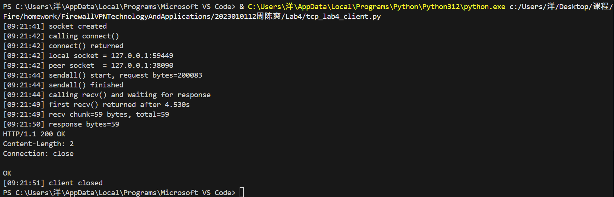
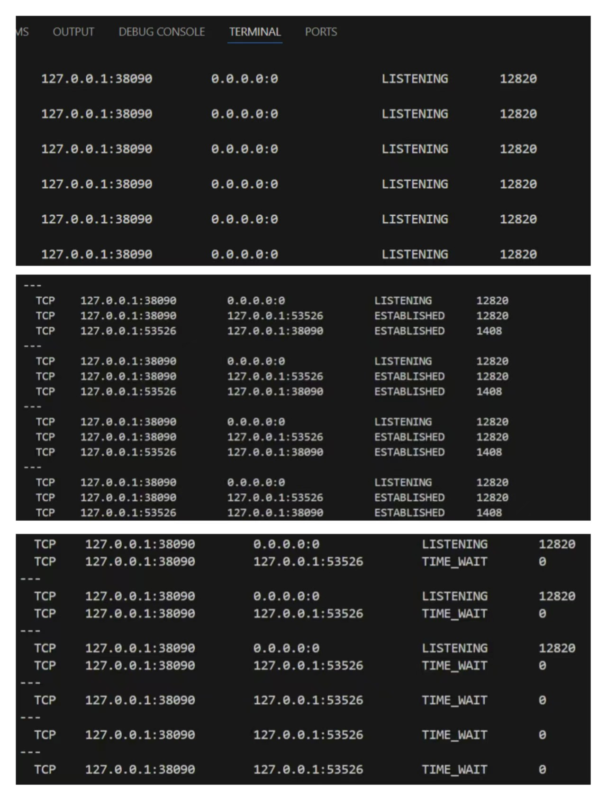
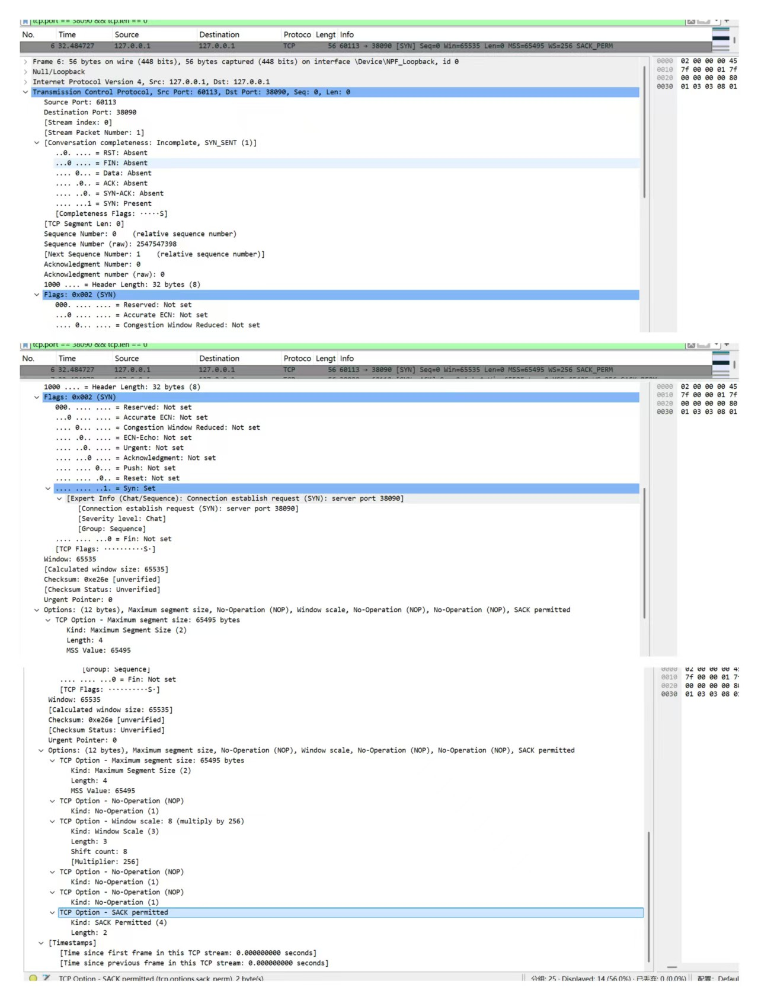
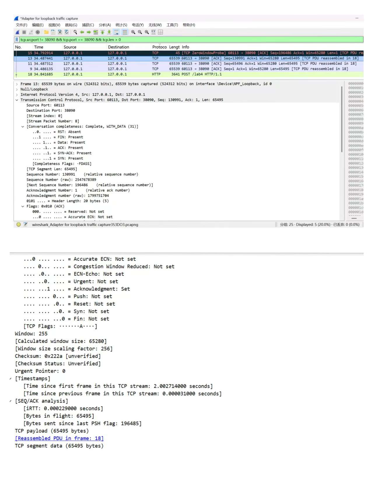
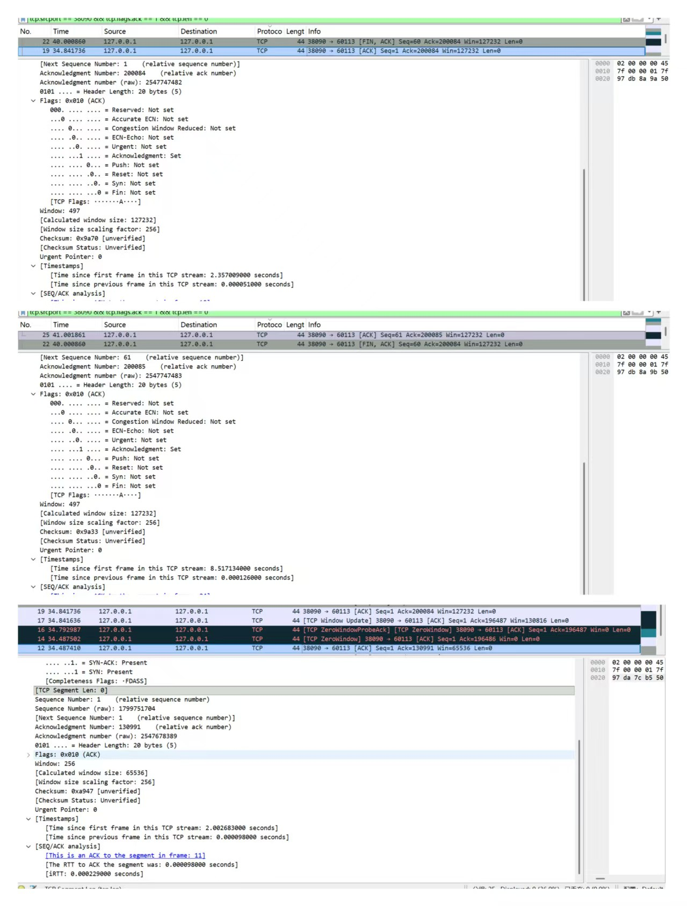
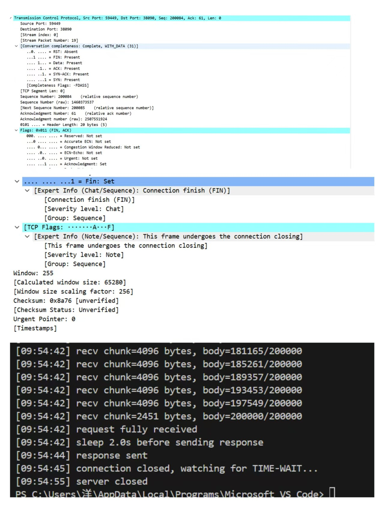

# Lab4：看见TCP 我不怕不怕啦

## 实验背景

本实验围绕一条 TCP 连接的完整生命周期展开，重点观察以下内容：

1. `socket()`、`listen()`、`accept()`、`connect()` 的职责区别
2. "连接"为什么本质上是交换控制信息而不是物理连线
3. TCP 头部中的端口号、序号、ACK 号、标志位、窗口、头部长度、可选字段
4. 三次握手如何建立收发准备
5. 应用层大块数据如何被 TCP 按 MSS 拆分
6. `Sequence Number` 与 `Acknowledgment Number` 如何配合工作
7. `recv()` 为什么会阻塞等待数据
8. 接收窗口如何反映接收方处理能力
9. ACK 与窗口更新为什么常常会被合并
10. `FIN` / `ACK` 如何完成断开
11. 为什么连接结束后套接字不会立刻删除

---

## 实验任务

### 任务一：准备实验环境并记录运行信息

**第一步：准备好四个窗口**

整个实验需要同时观察多个界面，建议在开始前把窗口布局摆好：

- **终端 A**：运行服务端
- **终端 B**：运行客户端
- **终端 C**：持续监控套接字状态（全程保持开启，不要关）
- **Wireshark**：抓包

**第二步：在终端 C 里启动持续监控**

TCP 状态变化很快，等你手动敲完 `ss` 命令再回车，状态可能已经过去了。用下面的命令让终端 C 每 0.5 秒自动刷新一次，之后只需要盯着这个窗口就行：

```bash
# Linux
watch -n 0.5 'ss -tan | grep 38090'

# macOS（没有 watch，用循环代替）
while true; do netstat -an | grep 38090; echo "---"; sleep 0.5; done

# Windows（Git Bash执行）
while true; do netstat -ano | grep 38090; echo "---"; sleep 0.5; done
```

如果你换了端口，把 `38090` 替换成实际端口。

**第三步：打开 Wireshark，选回环接口，填好过滤器，开始抓包**

回环接口在不同系统里名字不同：

| 系统 | 接口名 |
|:-----|:-------|
| Linux | `lo` |
| macOS | `lo0` |
| Windows | `Adapter for loopback traffic capture`（需提前安装 Npcap 并勾选回环支持） |

在显示过滤器里输入：

```text
tcp.port == 38090
```

然后点击开始抓包（蓝色鲨鱼鳍图标）。**先开始抓包，再运行脚本**，否则握手包会被漏掉。

**第四步：启动脚本**

```bash
# 终端 A
python3 tcp_lab4_server.py

# 终端 B（等服务端打印出 server listening on ... 后再运行）
python3 tcp_lab4_client.py
```

如果 `38090` 已被占用，两端都加环境变量换端口，同时记得把 Wireshark 过滤器和终端 C 里的端口号也改掉：

```bash
LAB4_PORT=38123 python3 tcp_lab4_server.py
LAB4_PORT=38123 python3 tcp_lab4_client.py
```

**第五步：填写下表**

| 项目                                | 你的填写内容 |
| :---------------------------------- | :----------- |
| 服务端监听地址                      | 127.0.0.1   |
| 服务端监听端口                      | 38090            |
| 客户端本地临时端口                  |  59449            |
| 客户端请求总字节数                  |    200083          |
| 服务端响应内容                      |HTTP/1.1 200 OK\Content-Length: 2\Connection: close\OK|
| 客户端 `connect()` 返回前后的时间点 | 09:21:42             |
| 客户端首次收到响应前等待了多久      |  4.530s            |

各项数值均可直接从终端输出读取：服务端监听信息在 `server listening on ...`，客户端本地端口在 `local socket = ...`，请求字节数在 `sendall() start, request bytes=...`，等待时间在 `first recv() returned after ...s`。



---

### 任务二：观察套接字创建与连接建立

1. 服务端启动后，观察终端 C 出现 `LISTEN` 状态，截图留存。
2. 在终端 B 里启动客户端，观察它依次打印 `socket created`、`calling connect()`、`connect() returned`。
3. 客户端打印 `connect() returned` 之后，观察终端 C 出现 `ESTABLISHED`，截图留存。脚本在 `connect()` 返回后有 2 秒停顿，这段时间足够截图。

填写下表：

| 阶段                             | 你的填写内容 |
| :------------------------------- | :----------- |
| 服务端启动、客户端未连入时的状态 |  LISTEN            |
| `connect()` 返回后服务端状态     |   	SYN_RCVD     |
| `connect()` 返回后客户端状态     | SYN_SENT → 迅速转为 ESTABLISHED |

简答题：

1. 服务端在客户端连接前为什么处于 `LISTEN`？
原理：LISTEN（监听）是服务端的被动打开状态。服务端调用 bind() 绑定端口后，必须调用 listen() 才能进入该状态。
目的：它表示 “我已经就位，随时准备接受任何客户端的连接请求”，但此时还没有具体的客户端连接上来，所以一直在监听端口是否有 SYN 包到来。


2. 为什么这时还没有真正建立 TCP 连接？
原因：TCP 建立连接需要三次握手。
过程：
服务端处于LISTEN时，只完成了第一步（绑定端口）。
当客户端连接时，才开始发送 SYN（三次握手第一步），服务端回复 SYN+ACK（第二步）。
真正建立的标志是服务端收到客户端的最后一个ACK。只有收到这个 ACK，connect()才会返回，连接才正式进入ESTABLISHED状态。


3. `socket()` 与 `connect()` 的区别是什么？
socket ()（创建文件描述符）：
作用：只是在操作系统内核里创建了一个空的套接字对象（相当于买了个空手机），返回一个文件描述符。
状态：此时只是一个本地资源，还没有任何网络连接。
connect ()（主动发起连接）：
作用：客户端通过这个套接字，向服务端发起网络连接（相当于拨打电话）。
结果：它会阻塞直到三次握手完成，返回后才代表真正连上了网。


4. 为什么 `connect()` 返回后才进入可稳定收发数据的状态？
核心原因：connect() 函数的内部逻辑就是阻塞等待三次握手完成的。
过程：
客户端发出 connect() 后，发出 SYN 包。
等待服务端回 SYN+ACK。
客户端再回 ACK。
只有当最后一个 ACK 发出去并被服务端确认后，connect() 才解除阻塞返回。
此时双方都确认了对方的存在，序列号同步好了，所以可以直接稳定收发数据。


5. 为什么"网线一直连着"不等于"TCP 连接已经建立"？
物理层 ≠ 传输层：
网线通了只代表物理层 / 链路层是通的（能收到电信号）。
TCP 连接是逻辑上的可靠通道，需要三次握手来协商序列号、窗口大小等参数。
极端情况：网线插着，但如果服务端程序没开（没监听），客户端一直connect超时，那么网线连着，但 TCP 连接永远建立不起来。


6. 这里的"连接"更准确地说是在做什么？
准确描述：这里的 “连接” 是指 TCP 的三次握手（Three-Way Handshake） 过程。
实质：它不是物理的线，而是双方协商并同步了一系列参数（如初始序列号 ISN、最大段大小 MSS、窗口缩放等）的过程。
结果：建立了一条全双工的、可靠的、有序的字节流传输通道。




---

### 任务三：观察三次握手与 TCP 头部字段

**定位握手包**：在 Wireshark 过滤器里输入下面的条件，可以屏蔽中间的数据包，只留下握手和断开阶段的控制包：

```text
tcp.port == 38090 && (tcp.flags.syn == 1 || tcp.flags.fin == 1)
```

包列表最前面的三个包就是三次握手（SYN → SYN-ACK → ACK）。

**找到各字段的位置**：点击某个握手包，在下方详情栏展开 `Transmission Control Protocol`。源端口、目的端口、Seq、Ack、Flags、Window、Header Length 都在这里。TCP 选项在最底部的 `Options` 子项里，展开后可以看到 MSS、Window Scale、SACK Permitted，注意这三项只出现在带 SYN 标志的包里，纯 ACK 包里没有。

**关于序号显示**：Wireshark 默认开启相对序号，会把每个方向的初始序号归零显示，所以 SYN 包的 Seq 看起来是 `0`，而不是真实的随机大数。这是正常现象，实验报告按 Wireshark 显示的值填写即可。如果你想看真实值，可以去 `Edit → Preferences → Protocols → TCP` 里取消勾选 `Relative sequence numbers`。

填写下表：

| 报文       | 源端口 | 目的端口 | Seq  | Ack  | Flags | Window | Header Length |
| :--------- | :----- | :------- | :--- | :--- | :---- | :----- | :------------ |
| 第一次握手 |  59449  |  38090  | 0（相对值）/ 1460173453（原始值）     |  0    |   SYN    |      65535  |         	32 字节      |
| 第二次握手 | 38090       | 59449         | 0（相对值）/ 2507551863（原始值）     |    1  |     SYN, ACK  |   65535     |      32字节         |
| 第三次握手 |      59449  |   38090       |  1（相对值）/ 1460173454（原始值）    |  1    |    ACK   |   255（缩放后 65280）     |        20 字节       |

第一次握手（SYN）的 Ack 字段在 Wireshark 里通常显示为空或 `0`，这是正常的，因为此时客户端还没有收到服务端的任何数据。Header Length 在没有选项时是 20 字节，握手包因为携带了 MSS 等选项通常是 28 或 32 字节。

| TCP 选项       | 你的填写内容 |
| :------------- | :----------- |
| MSS            |   65495 字节           |
| Window Scale   |   8（乘数 256）           |
| SACK Permitted |开启（已协商）              |

回环接口的 MSS 通常是 65495（因为回环 MTU 是 65536，比以太网的 1500 大得多），这会影响后续任务五里是否能观察到分段。

简答题：

1. 发送方和接收方端口号在连接阶段的作用是什么？
端口号是传输层的寻址标识，作用如下：
区分应用进程：一台主机上可同时运行多个网络程序，端口号用于唯一标识主机内的具体应用（如 38090 对应服务端程序，59449 对应客户端程序）。
建立 TCP 连接的核心要素：TCP 连接由「源 IP + 源端口 + 目的 IP + 目的端口」四元组唯一确定，端口号是区分不同连接的关键。
数据分发依据：接收方收到报文后，通过目的端口将数据交付给对应监听端口的应用程序。


2. TCP 头部如何帮助找到目标套接字？
TCP 头部通过四元组 + 端口号实现套接字定位：
TCP 头部包含源端口、目的端口，结合 IP 头部的源 IP、目的 IP，组成唯一的「四元组」。
操作系统内核会维护一张套接字表，收到报文时，用四元组匹配表中条目，找到对应的套接字，将数据交付给对应的应用进程。
即使多个连接复用同一 IP，也能通过端口号精准区分不同套接字。


3. 为什么初始序号不是简单固定从 1 开始？
安全性：固定初始序号易被攻击者预测，伪造报文劫持连接；随机初始序号可防止此类攻击。
可靠性：避免历史连接的延迟报文干扰新连接。若序号固定，旧连接的残留报文可能被新连接误判为有效数据，导致数据错乱。
TCP 规范要求：RFC 793 规定初始序号（ISN）需基于时钟生成，每秒递增，保证每个连接的 ISN 唯一。


4. 为什么 TCP 可选字段更容易在连接阶段看到？
协商时机：TCP 可选字段（如 MSS、窗口缩放、SACK）是连接建立阶段的协商参数，仅在三次握手的 SYN 报文中携带，用于双方协商传输特性。
数据传输阶段：数据报文的可选字段极少使用，仅在特殊场景（如时间戳、窗口更新）出现，因此连接阶段是观察可选字段的最佳时机。
必要性：这些参数决定了后续数据传输的性能（如 MSS 决定最大分段大小、窗口缩放决定接收窗口大小），必须在连接建立时完成协商。




---

### 任务四：区分头部中的控制信息和套接字中的控制信息

用以下过滤器分别找到两类报文：

```text
# 纯控制报文（无应用数据）
tcp.port == 38090 && tcp.len == 0

# 携带应用数据的报文
tcp.port == 38090 && tcp.len > 0
```

从纯控制报文里选一个（SYN、纯 ACK 或 FIN-ACK 都可以），从数据报文里选一个（客户端发请求或服务端发响应的包）。

填写下表：

| 项目                   | 你的填写内容 |
| :--------------------- | :----------- |
| 纯控制报文的类型       | SYN（TCP 三次握手连接建立请求报文）             |
| 携带应用数据的报文类型 |  带应用数据的 ACK 报文（客户端→服务端数据传输报文）            |
| 头部中的控制信息举例   | SYN/ACK 标志位、序号 Seq、确认号 Ack、窗口大小 Win、最大分段大小 MSS、窗口缩放因子 WS、SACK 允许             |
| 套接字中的控制信息举例 |源 IP：127.0.0.1、源端口：60113、目的 IP：127.0.0.1、目的端口：38090              |

简答题：

1. 为什么"头部中的控制信息"和"套接字中的控制信息"不是同一件事？
二者分属不同层级、功能完全不同，核心区别如下：
套接字中的控制信息：由源 IP、源端口、目的 IP、目的端口组成的四元组，是 TCP 连接的唯一身份标识，用于定位通信端点、实现端口多路复用，在整个连接生命周期内固定不变。
头部中的控制信息：TCP 报文头内的标志位（SYN/ACK/FIN 等）、序号 Seq、确认号 Ack、窗口大小、MSS等字段，用于 TCP 连接管理、可靠传输、流量控制，会随报文类型和传输状态动态变化。


---

### 任务五：观察数据分段、序号与 ACK

客户端发送的请求体是 200000 字节，超过了回环接口 MSS（约 65495 字节），因此应该可以在 Wireshark 里看到多个连续的数据段。用下面的过滤器找到客户端发出的数据包：

```text
tcp.srcport != 38090 && tcp.port == 38090 && tcp.len > 0
```

在包列表里连续选几个数据段，对比它们的 Seq 值。相邻两段的关系是：后一段的 Seq = 前一段的 Seq + 前一段的 TCP Segment Len。

找服务端返回给客户端的纯 ACK 报文：

```text
tcp.srcport == 38090 && tcp.flags.ack == 1 && tcp.len == 0
```

填写下表：

| 数据段  | Seq  | Ack  | TCP Segment Len | Flags |
| :------ | :--- | :--- | :-------------- | :---- |
| 第 1 段 | 1     |    1  |    65495             |  ACK     |
| 第 2 段 | 65496     |   1   |              	65495   | ACK      |
| 第 3 段 | 130991     | 1     |               	65495  |  ACK     |

| ACK 报文 | Ack Number | Flags | Window |
| :------- | :--------- | :---- | :----- |
| 第 1 个  | 200084           | ACK      | 127232       |
| 第 2 个  |  200085          |   ACK    | 127232       |
| 第 3 个  |130991            | ACK      |  	65535      |

| 项目                         | 你的填写内容 |
| :--------------------------- | :----------- |
| 是否发生分段                 |是，200000 字节的请求体被拆分为多个 TCP 分段传输              |
| 握手中观察到的 MSS           |  65495 字节            |
| 单段长度与 MSS 的关系        | 单段 TCP Segment Len=65495，等于协商的 MSS 值，符合最大分段传输规则             |
| ACK 号大致确认到了第几个字节 | ACK 号 = 200085，对应确认到第 200085 字节，完成 200000 字节数据的累计确认             |

简答题：

1. 应用程序是否直接决定每个网络包的数据长度？为什么？
应用程序仅提交大块数据（如一次sendall()发送 200000 字节），TCP 协议栈会根据协商的 MSS、网络 MTU 自动拆分数据，决定每个网络包的有效载荷长度，应用程序无法直接控制单个 TCP 包的分段长度。


2. 大块应用数据为什么会被拆分？
受 ** 链路 MTU（最大传输单元）** 限制：单个 IP 数据报不能超过链路 MTU，否则会在网络层分片，导致重传效率低下；
TCP 通过 MSS 协商最大分段大小，确保TCP段+IP头+TCP头不超过 MTU，避免网络层分片；
流量控制、拥塞控制也会动态调整分段大小，保障传输可靠性。


3. `MSS` 与 `MTU` 的关系是什么？
MTU：链路层最大传输单元，指单个 IP 数据报的最大长度（环回接口 MTU=65535 字节）；
MSS：TCP 最大分段大小，指 TCP 段中应用数据的最大长度；
公式：MSS = MTU - IP头长度(20B) - TCP头长度(20B)，因此环回接口 MSS=65535-40=65495，与抓包完全一致。


4. "一次 `sendall()`"与"一个 TCP 包"之间是什么关系？
一次sendall()是应用层的一次数据发送调用，提交完整的大块应用数据；
一个 TCP 包是传输层的单个分段，仅承载部分应用数据；
关系：一次sendall()对应多个 TCP 包，TCP 协议栈会将大块数据拆分为多个符合 MSS 的 TCP 分段，依次发送，对应抓包中的多个连续数据段。


5. 为什么 ACK 体现的是累计确认？
TCP 的 ACK 号定义为 **「期望收到的下一个字节的序号」，代表确认了所有序号小于 ACK 号的字节 ** 都已成功接收，而非仅确认最后一个分段。例如 ACK 号 = 130991，代表确认了 0~130990 字节的全部数据，体现累计确认特性，即使中间分段丢失，也可通过 ACK 号快速定位丢失位置，实现可靠重传。


6. 如果中间某一段丢失，ACK 会出现什么变化？
若中间某段（如第 2 段，Seq=65496）丢失，接收方会重复发送对前一段最后一个字节的 ACK（即 ACK 号 = 65496），持续请求重传丢失的分段；同时触发快速重传 / 超时重传机制，直到丢失分段被成功接收后，才会更新 ACK 号，确认后续数据，保障数据完整性。





---

### 任务六：观察 `recv()` 阻塞与窗口字段

`recv()` 的等待时间直接从客户端终端读取，`calling recv() and waiting for response` 到 `first recv() returned after ...s` 之间就是等待时长，脚本已经帮你计算好了。

在 Wireshark 里找窗口值：用过滤器 `tcp.port == 38090 && tcp.flags.ack == 1` 列出所有 ACK 包，点击其中一个，在详情栏 `Transmission Control Protocol` 里找 `Window` 字段。如果同时显示了 `Calculated window size`，优先看这个值，它已经把 Window Scale 的缩放算进去了，是对方实际能接收的字节数。

如果包列表的 Info 列出现了 `[TCP Window Update]` 标注，说明这个包的主要目的是通知对方窗口变化，重点观察它的 `Window` 字段。

填写下表：

| 项目                                   | 你的填写内容 |
| :------------------------------------- | :----------- |
| 客户端开始调用 `recv()` 的时间         |  09:21:44            |
| 客户端第一次收到响应的时间             |  09:21:49            |
| `recv()` 是否立刻返回                  | 否             |
| 首次收到响应前等待了多久               | 4.530s             |
| `recv()` 等待期间连接是否已经建立      |  是            |
| 第 1 个 ACK 报文的窗口值               |   127232           |
| 第 2 个 ACK 报文的窗口值               | 127232             |
| 第 3 个 ACK 报文的窗口值               |  	65535            |
| 窗口值是否变化                         |   是           |
| 若变化，变化趋势                       | 先保持稳定，后出现波动 / 调整（出现零窗口探测、窗口更新）             |
| ACK 与窗口更新是否可以出现在同一个包中 |  是            |
| 是否看到 RTT 或 ACK 往返时间相关信息   |      是        |

简答题：

1. "连接建立"和"应用收到数据"之间是什么关系？
连接建立是应用收到数据的前提。TCP 必须先通过三次握手完成连接建立，才能在已建立的连接上传输应用数据；应用层recv()只能在连接建立后，才能接收对端发送的数据，连接未建立时recv()会直接报错或阻塞。


2. 为什么说 `read` / `recv` 在数据未到达时会被挂起？
recv()是阻塞式系统调用：当应用进程调用recv()时，若内核 TCP 接收缓冲区中没有可读取的数据，进程会被操作系统挂起（进入睡眠状态），直到有数据到达缓冲区、被唤醒后才会返回读取到的数据，因此在数据未到达时会被挂起等待。


3. 窗口字段反映了接收方哪方面的能力？
窗口字段反映了接收方的接收缓存能力（流量控制能力）：它表示接收方当前能够接收的字节数上限，用于通知发送方 “我最多还能收多少数据”，是 TCP 实现端到端流量控制的核心字段。


4. 为什么发送方不能无限制连续发送数据？
受接收方窗口限制：发送方必须遵守接收方通告的窗口大小，不能发送超过窗口大小的数据，否则会被接收方丢弃；
受网络拥塞控制限制：TCP 拥塞控制会动态调整发送窗口，避免网络拥塞；
受可靠传输机制限制：发送方需要等待 ACK 确认，不能无限制发送未确认的数据，否则会导致重传风暴。


5. 滑动窗口为什么既提高效率又避免压垮接收方？
提高效率：滑动窗口允许发送方在等待 ACK 的同时，连续发送多个分段（流水线传输），无需每发一个就等一个 ACK，大幅提升传输吞吐量；
避免压垮接收方：接收方通过通告窗口大小，限制发送方的发送速率，确保发送方不会发送超过接收方缓存能力的数据，避免接收方缓冲区溢出、被压垮。


---

### 任务七：观察响应返回与双向 `seq/ack`

TCP 的 Seq/Ack 是双向独立的，客户端有自己的发送序号，服务端有自己的发送序号。用下面的过滤器只看服务端发出的数据包（源端口是 38090，有应用数据）：

```text
tcp.srcport == 38090 && tcp.len > 0
```

紧跟在服务端数据包后面的、客户端发出的 ACK 包，其 Ack Number 确认的就是服务端的发送序号。

填写下表：

| 项目                     | 你的填写内容 |
| :----------------------- | :----------- |
| 服务端响应数据报文的 Seq |  1（相对序号）/ 1799751704（原始序号）            |
| 服务端响应数据报文的 Ack |     200084（相对序号）/ 2547747482（原始序号）         |
| 客户端确认报文的 Ack     |   60（相对序号，对应服务端 Seq+Len=1+59=60）           |

简答题：

1. 为什么 TCP 的 `seq/ack` 是双向分别计算的？
TCP 是全双工通信协议，通信双方（客户端、服务端）是两个独立的发送 / 接收实体，各自维护独立的发送序号空间和接收确认空间，双向数据传输相互独立，因此需要分别计算 seq/ack，确保两个方向的可靠传输。


2. 为什么双方都需要各自的初始序号？
初始序号（ISN）用于标识每个方向的字节流起点，区分不同连接、避免历史连接的旧报文干扰当前连接；
双方独立生成 ISN，是 TCP 三次握手的核心环节，确保双向序号空间独立，为可靠传输、重传、流量控制提供基础。


3. 为什么发送应用数据时报文通常仍然带 `ACK`？
TCP 采用 ** 捎带确认（piggybacking）** 机制：当发送方有应用数据要发送时，会将对端数据的 ACK 确认信息捎带在数据报文中，无需单独发送 ACK 报文，减少网络报文数量、提升传输效率，因此带数据的报文通常会携带 ACK。


---

### 任务八：观察连接断开与套接字延迟删除

用下面的过滤器精确定位所有带 FIN 的包：

```text
tcp.port == 38090 && tcp.flags.fin == 1
```

通常会看到两个 FIN 包（双方各一个）。看第一个 FIN 包的源端口，就能判断谁先发起断开。

**关于 TIME-WAIT**：TIME-WAIT 只出现在主动发起关闭的一方（先发 FIN 的那端）。服务端脚本在 `conn.close()` 之后会继续运行 10 秒再退出，这段时间可以在终端 C 里观察 TIME-WAIT。Linux 上 TIME-WAIT 通常持续约 60 秒，macOS 上可能较短，如果没有观察到请如实说明。

填写下表：

| 项目                                    | 你的填写内容 |
| :-------------------------------------- | :----------- |
| 谁先发送 FIN                            |  服务端            |
| 关闭阶段共观察到几个带 FIN 的报文       |      2 个        |
| 最终 ACK 是否可见                       |    可见          |
| 关闭后是否观察到 `TIME-WAIT` 或等价现象 |      是        |

简答题：

1. 为什么关闭连接不能只发一个结束通知？
TCP 是全双工通信，连接的关闭需要双向分别完成：
发送 FIN 仅代表「我方不再发送数据」，但不影响「我方继续接收对方数据」。
若只发一个 FIN，仅关闭了发送方向，接收方向仍处于打开状态，无法彻底释放连接资源。
必须通过四次挥手（FIN→ACK→FIN→ACK），分别关闭两个方向的连接，才能彻底终止整个 TCP 连接。


2. 为什么连接结束后套接字不会立刻删除？
为了进入TIME-WAIT 状态（持续 2MSL，约 1-2 分钟），核心原因：
保证最后一个 ACK 可靠送达：若最后一个 ACK 丢失，对方会重发 FIN，TIME-WAIT 状态下的套接字可重发 ACK，完成连接关闭。
避免历史报文干扰新连接：等待 2MSL 可让网络中残留的旧连接报文彻底超时消失，防止新连接复用相同端口时，收到旧连接的延迟报文，导致数据错乱。


3. 如果最后一个 ACK 丢失，而旧套接字已经立刻删除，可能带来什么问题？
对方连接无法正常关闭：发送 FIN 的一方（服务端）收不到 ACK，会认为自己的 FIN 丢失，持续重发 FIN，导致服务端一直处于 LAST-ACK 状态，无法释放连接资源。
新连接被旧报文干扰：若客户端立刻删除套接字并复用相同端口建立新连接，服务端重发的旧 FIN 会被新连接误判，导致新连接被异常关闭，数据传输中断。
连接资源泄漏：服务端持续重发 FIN，占用系统套接字资源，可能引发资源耗尽，影响后续网络通信。




---

## 问答题

1. TCP 的"连接"到底意味着什么？它为什么不是"把网线连上"？
TCP 连接的本质：是逻辑上的、端到端的可靠通信通道，由双方通过三次握手协商建立，核心是同步序列号、窗口大小、MSS 等参数，维护全双工的字节流传输状态。
不是网线连通的原因：
物理层≠传输层：网线连通仅代表物理链路 / 数据链路层通，是硬件层面的连通；TCP 连接是传输层的逻辑连接，依赖双方应用程序的状态和协议协商。
状态依赖：即使网线插着，若服务端未监听端口、程序未启动，TCP 连接也无法建立；反之，网线断开后，TCP 连接会因超时自动释放。
多连接复用：同一根网线可承载多个 TCP 连接，通过端口号区分，说明连接是逻辑标识，而非物理链路本身。


2. 三次握手为什么能让双方进入可通信状态？
三次握手的核心是双向确认对方的发送 / 接收能力，同步初始序列号：
第一次握手（客户端→服务端 SYN）：客户端向服务端发起连接请求，同步自己的初始序列号 ISN，证明客户端的发送能力正常。
第二次握手（服务端→客户端 SYN+ACK）：服务端确认收到客户端的 SYN（ACK=ISN+1），同时发送自己的 SYN，同步服务端的初始序列号，证明服务端的发送 / 接收能力正常。
第三次握手（客户端→服务端 ACK）：客户端确认收到服务端的 SYN（ACK=ISN+1），证明双方的发送 / 接收能力均已验证，序列号同步完成，可进入全双工通信状态。


3. TCP 头部中的控制字段如何支撑收发数据？
TCP 头部的 6 个核心控制字段，从连接建立、数据传输到连接关闭，全流程支撑收发数据：
SYN：仅在三次握手阶段使用，用于发起连接请求、同步双方的初始序列号，是建立可靠通信的前提，确保收发双方的序号空间同步。
ACK：除第一次握手外，所有 TCP 报文都必须置位该字段，用于确认已收到对方的数据，是 TCP 可靠传输的核心保障，让发送方明确数据已被接收，避免数据丢失。
FIN：在四次挥手阶段使用，用于发起连接关闭请求，通知对方 “我方不再发送数据”，实现全双工连接的双向有序关闭，保障数据收发完成后再释放资源。
RST：用于强制重置异常连接，比如端口未监听、连接超时、收到非法报文等场景，直接中断收发，避免无效数据传输。
PSH：通知接收方立即将缓冲区中的数据交付给应用层，无需等待缓冲区填满，适用于交互式数据（如终端输入）的即时收发，提升传输效率。
URG：标识报文中包含紧急数据，配合紧急指针字段，让接收方优先处理紧急数据，无需等待普通数据按序处理，保障紧急指令的即时收发。


4. ACK、窗口、等待时间为什么会共同影响 TCP 的可靠传输？
三者是 TCP 可靠传输的三大核心支柱，协同保障数据的有序、完整、高效传输：
ACK（确认号）：用于确认已收到的数据，若发送方未收到对应 ACK，会触发超时重传，保证数据不丢失。
窗口（滑动窗口）：用于流量控制，接收方通过窗口字段告知发送方自己的接收缓冲区大小，避免发送方发送过快导致接收方溢出。
等待时间（超时重传时间 RTO、TIME-WAIT 的 2MSL）：
RTO：发送方等待 ACK 的超时时间，超时后重传数据，应对网络丢包。
2MSL：TIME-WAIT 状态的持续时间，保证最后一个 ACK 可靠送达，避免历史报文干扰新连接。
协同逻辑：ACK 保障数据不丢，窗口保障传输不拥塞，等待时间保障异常场景下的可靠性，三者缺一不可。


5. 断开连接为什么仍然需要严格的控制信息交换？
TCP 是全双工通信，连接关闭需要双向分别终止，因此需要严格的四次挥手流程：
单向关闭：发送 FIN 仅代表 "我方不再发送数据"，但仍可接收对方数据，因此需要双方分别发起 FIN 请求。
可靠性保障：通过 FIN+ACK 的交互，确保双方都已完成数据收发，避免数据丢失。
资源释放：通过四次挥手，双方同步关闭状态，释放套接字、缓冲区等系统资源。
TIME-WAIT 状态：最后一个 ACK 发送后，主动关闭方进入 TIME-WAIT 状态，保证连接彻底终止，避免历史报文干扰新连接。


6. 如果服务端根本没有启动，客户端调用 `connect()` 时会看到什么现象？
客户端现象：connect() 会阻塞，超时后返回连接超时 / 连接被拒绝错误。
底层原理：
客户端发送 SYN 报文后，因服务端未监听对应端口，服务端会回复 RST 报文（重置连接），或无响应。
若收到 RST，connect() 会立即返回ECONNREFUSED（连接被拒绝）；若未收到响应，connect() 会持续重试，直到超时后返回ETIMEDOUT（连接超时）。
客户端终端会打印连接失败日志，无法建立 TCP 连接。


7. 如果中途人为制造丢包，ACK、重传、窗口之间会出现什么变化？
ACK 变化：接收方仅对连续收到的数据发送 ACK，若中间报文丢失，会重复发送最后一个 ACK（快速重传触发条件），或无 ACK（超时重传触发条件）。
重传变化：发送方未收到对应 ACK，会触发超时重传，重传丢失的报文；若收到 3 次重复 ACK，会触发快速重传，无需等待超时。
窗口变化：
若丢包导致接收方缓冲区溢出，接收方会缩小窗口，甚至发送零窗口报文，通知发送方暂停发送。
重传会导致发送方拥塞窗口（cwnd）缩小，触发拥塞控制（如慢启动、拥塞避免），降低发送速率，避免网络进一步拥塞。


8. 如果把客户端发送的数据改得更大，窗口字段和分段情况会如何变化？
分段情况：数据大小超过 MSS（最大分段大小，回环接口为 65495 字节）时，TCP 会自动将数据分段，分成多个报文发送，每个报文的长度不超过 MSS。
窗口字段变化：
若数据大小未超过接收方窗口，窗口字段保持不变，发送方持续发送分段报文。
若数据大小超过接收方窗口，接收方会逐步更新窗口（ACK 中携带窗口字段），发送方根据窗口大小调整发送速率，待窗口释放后继续发送剩余分段。
若数据极大，会触发滑动窗口机制，窗口随接收方缓冲区释放逐步更新，保证数据完整传输。


9. 如果把服务端读取速度改得更慢，是否更容易看到窗口更新甚至零窗口？
是的，会更容易观察到窗口更新，甚至零窗口，原理如下：
服务端读取速度慢，会导致接收缓冲区被占满，无法及时处理新数据。
服务端会在 ACK 中逐步缩小窗口字段，通知客户端降低发送速率。
当缓冲区完全占满时，服务端会发送 ** 零窗口（Window=0）** 报文，通知客户端暂停发送所有数据。
待服务端读取部分数据、缓冲区释放后，会发送 ** 窗口更新（Window Update）** 报文，告知客户端新的窗口大小，恢复数据传输。
因此，降低服务端读取速度，会放大流量控制的效果，更容易观察到窗口更新和零窗口现象。


---

## 截图要求

- 截图须清晰，终端文字和 Wireshark 字段可读。
- 所有截图与本 `Lab4.md` 放在同一目录下。
- 命名规范：

| 截图内容               | 文件名                  |
| :--------------------- | :---------------------- |
| 服务端与客户端运行结果 | `run.png`               |
| `ss` 状态变化          | `states.png`            |
| 三次握手与 TCP 选项    | `handshake_header.png`  |
| 大请求分段与 MSS       | `segmentation.png`      |
| ACK 与窗口观察         | `ack_window.png`        |
| 断开与最终状态         | `teardown_timewait.png` |

具体要求：

1. `run.png`：终端截图，至少能看到服务端 `server listening on ...`、客户端 `calling connect()`、`connect() returned`、`calling recv() and waiting for response`、`first recv() returned after ...s`。

2. `states.png`：终端截图，至少能看到 `LISTEN`、`ESTABLISHED`，以及 `TIME-WAIT`（若能观察到）。推荐截 `watch` 命令的持续输出画面，可以在一张截图里同时展示多个状态的变化过程。

3. `handshake_header.png`：Wireshark 截图，至少能看到三次握手中某个包的 `Source Port`、`Destination Port`、`Sequence Number`、`Acknowledgment Number`、`Flags`、`Window`，以及 `Options` 中的 `Maximum segment size`、`Window Scale`、`SACK Permitted`。

4. `segmentation.png`：Wireshark 截图，至少能看到客户端发送数据的 TCP 包的 `TCP Segment Len`、`Seq`、`Ack`。若能观察到分段，尽量截出多个连续数据段。

5. `ack_window.png`：Wireshark 截图，至少能看到一个或多个 ACK 报文的 `Acknowledgment Number`、`Window`，以及 `Calculated window size`（若显示）、`[TCP Window Update]`（若出现）。

6. `teardown_timewait.png`：Wireshark 截图或 Wireshark 与终端截图的拼图，至少能看到带 `FIN` 的包，以及 `TIME-WAIT` 状态（若能观察到）。

---

## 提交要求

在自己的文件夹下新建 `Lab4/` 目录，提交以下文件：

```text
学号姓名/
└── Lab4/
    ├── Lab4.md
    ├── tcp_lab4_server.py
    ├── tcp_lab4_client.py
    ├── run.png
    ├── states.png
    ├── handshake_header.png
    ├── segmentation.png
    ├── ack_window.png
    └── teardown_timewait.png
```

---

## 截止时间

2026-04-23，届时关于 Lab4 的 PR 请求将不会被合并。
