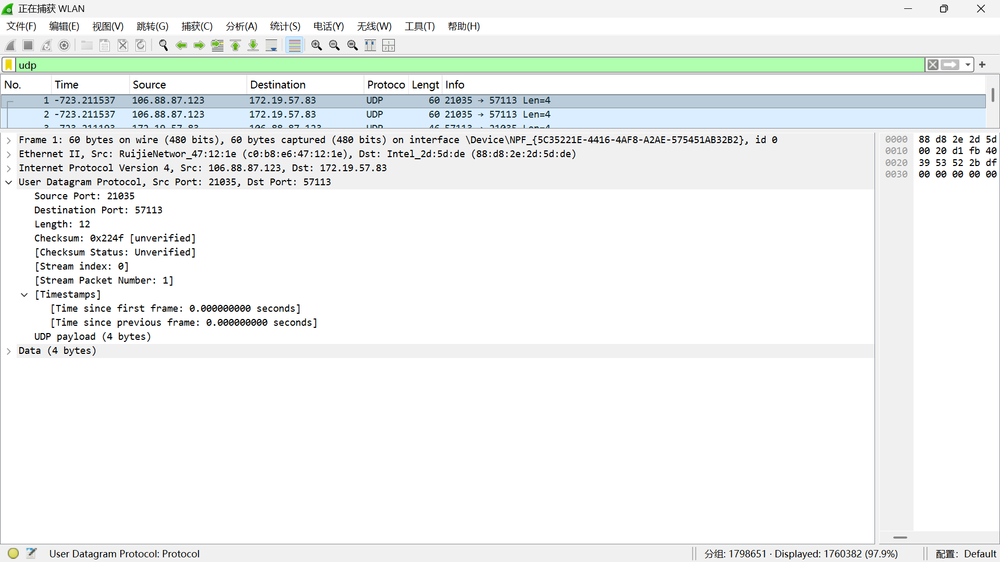
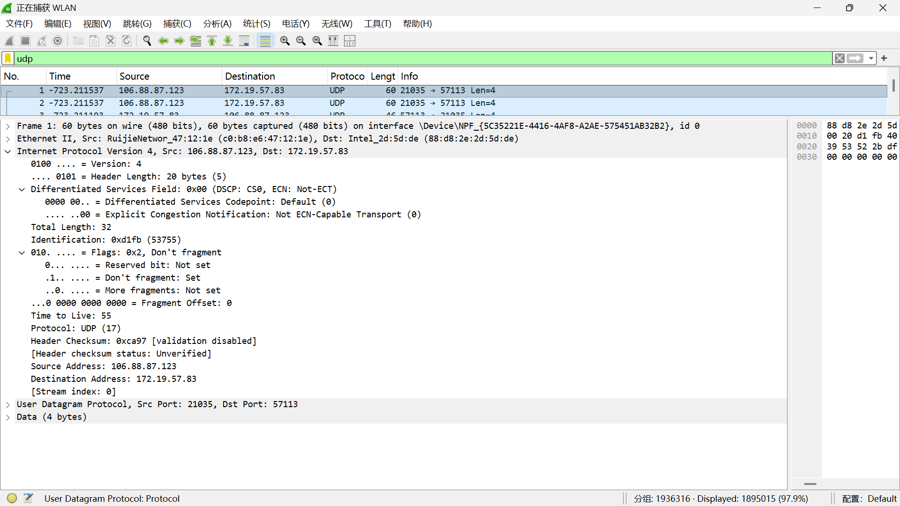
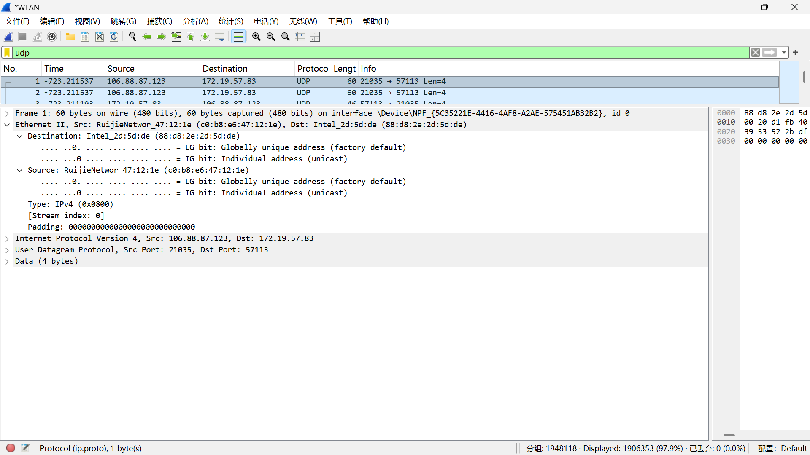
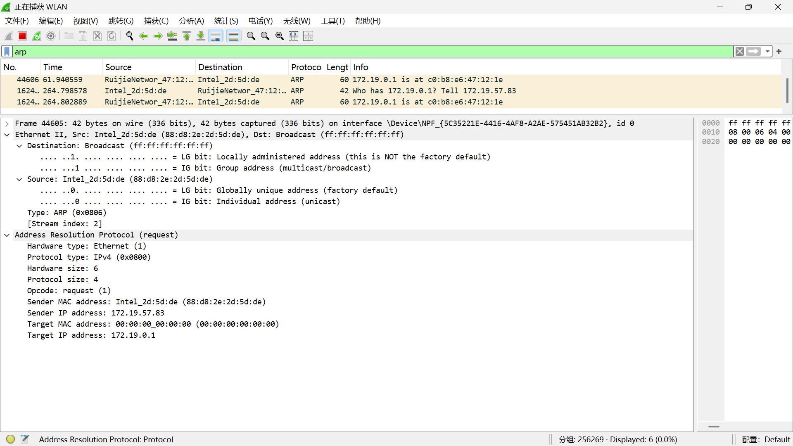
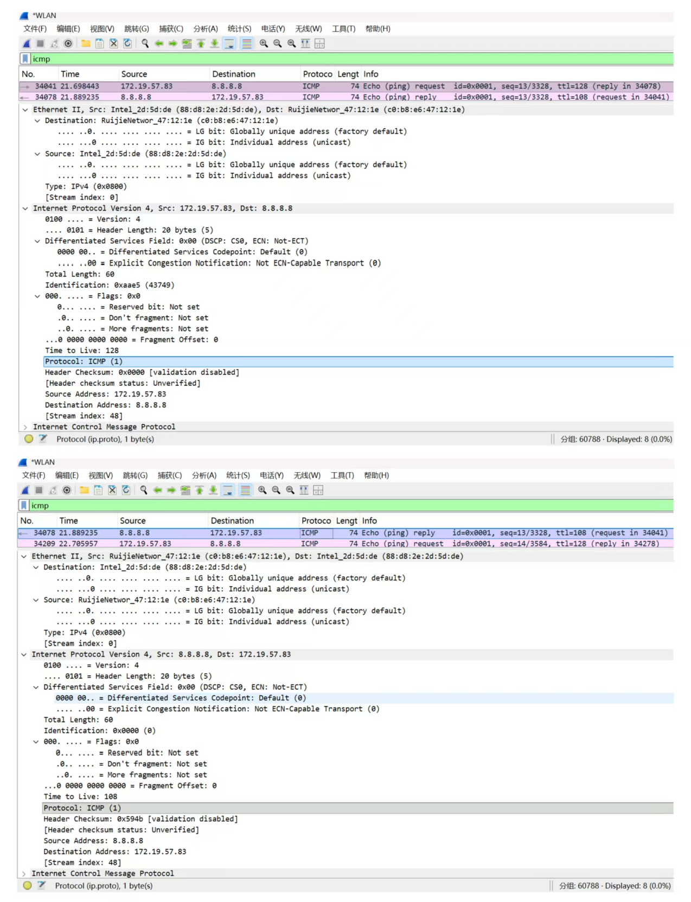

# Lab5：IP 与以太网的包收发操作

## 实验背景

本实验围绕 IP 模块与以太网在包收发过程中的角色展开，重点观察以下内容：

1. 网络包的基本结构：头部（IP 头部 + MAC 头部）与数据
2. IP 头部各字段的含义：版本号、TTL、协议号、发送方/接收方 IP 地址等
3. MAC 头部各字段的含义：接收方/发送方 MAC 地址、以太类型
4. IP 地址与 MAC 地址的区别与协作
5. ARP 协议如何通过 IP 地址查询 MAC 地址
6. 路由表的结构与查询方式
7. UDP 协议与 TCP 协议的区别：无连接、无确认、无重传
8. UDP 头部结构：发送方端口号、接收方端口号、数据长度、校验和
9. ICMP 协议的作用与常见消息类型（Echo、Destination Unreachable 等）

---

## 实验任务

### 任务一：查看路由表、ARP 缓存并启动 Wireshark

**第一步：打开 Wireshark，选择主网络接口，开始抓包**

> **注意**：本次实验必须使用真实网络接口（`en0`/`eth0`/`以太网`），不要选回环接口。回环接口不经过以太网，无法观察到 MAC 头部和 ARP 过程。

选择你的主网络接口，开始抓包。本次实验的大部分任务会共用同一次抓包。

**第二步：查看本机路由表**

```bash
# Linux
route -n
ip route show

# macOS
netstat -rn

# Windows
route print
```

截图并保存为 `route_table.png`。

**第三步：查看本机 ARP 缓存**

```bash
# Linux / macOS / Windows
arp -a
```

截图并保存为 `arp_cache.png`。

**第四步：填写下表**

从路由表和 ARP 缓存的输出中提取信息：

| 项目                         | 你的填写内容 |
| :--------------------------- | :----------- |
| 本机 IP 地址                 | 172.19.57.83             |
| 本机所在子网                 |  172.19.0.0/16            |
| 子网掩码                     | 255.255.0.0             |
| 默认网关 IP                  |  172.19.0.1            |
| 默认网关 MAC 地址            |c0-b8-e6-47-12-1e              |
| 本机网卡 MAC 地址            |88-D8-2E-2D-5D-DE              |

简答题：

1. 路由表的每一行包含哪些关键字段？教材中提到的 `Network Destination`、`Netmask`、`Gateway`、`Interface` 分别对应什么含义？
关键字段：通常包含 ** 网络目标（Network Destination）、网络掩码（Netmask）、网关（Gateway）、接口（Interface）、跃点数（Metric）** 等。
各字段含义：
Network Destination：表示该路由条目对应的目标网络 / 主机 IP 地址。
Netmask：即子网掩码，与目标 IP 地址配合，用于判断目标地址所属的网络范围。
Gateway：表示到达目标网络时，数据包需要转发到的下一跳 IP 地址（网关）。
Interface：表示本机上负责发送该路由数据包的网络接口 IP 地址。


2. 当目标 IP 地址不在本子网时，包会先发给谁？路由表的哪一列提供了这个信息？
数据包会先发送给默认网关（或路由表中匹配到的下一跳网关）。
路由表中的 **Gateway（网关）列 ** 提供了下一跳的地址信息，当目标 IP 不在本子网时，IP 模块会将数据包转发到该列对应的 IP 地址。


3. 路由表的默认网关（`0.0.0.0`）条目的作用是什么？什么时候会匹配到这一行？
作用：作为所有无法匹配到其他具体路由条目的数据包的 “兜底路由”，将这些数据包转发到默认网关，从而访问外部网络。
匹配时机：当目标 IP 地址无法与路由表中任何一条具体路由（如直连网段、静态路由）的网络目标和子网掩码匹配时，就会匹配到这条默认路由。


4. 教材提到，确定发送方 IP 地址的关键在于"判断应该使用哪块网卡"。结合你查到的本机网卡信息，说明 IP 模块是如何做出这个判断的。
IP 模块通过以下步骤判断使用哪块网卡：
匹配路由条目：根据目标 IP 地址，与路由表中的条目按最长匹配原则（子网掩码越长、优先级越高）进行匹配，找到对应的路由条目。
定位发送接口：该路由条目对应的Interface字段，就是本机上负责发送数据包的网卡 IP 地址。
确定网卡：根据网卡 IP 地址，找到对应的物理网卡（如你的 172.19.57.83 对应 Wi-Fi 网卡），数据包将从该网卡发出。


---

### 任务二：观察 UDP 头部

只要计算机处于联网状态，Wireshark 中就会持续出现大量 UDP 流量（DNS、mDNS、DHCP、NTP 等），无需手动生成。

**第一步：在 Wireshark 中设置过滤器**

```text
udp
```

**第二步：在包列表中找一个 UDP 包**

随便选一个即可。如果包太多，可以加上源或目的 IP 来缩小范围，例如 `udp && ip.addr == 你的IP`。如果需要 DNS 包，也可以用 `udp.port == 53` 过滤。

> **可选**：如果想明确看到一个完整的请求-响应对，可以在终端中执行 `nslookup example.com`，Wireshark 中就会出现对应的 DNS 请求包。

**第三步：点击选中的 UDP 包，在详情栏展开 `User Datagram Protocol`**

填写下表：

| 项目               | 你的填写内容 |
| :----------------- | :----------- |
| UDP 头部总长度     | 8 字节             |
| 源端口             | 21035             |
| 目的端口           | 57113             |
| 长度（Length）     |  12            |
| 校验和（Checksum） |  0x224f            |

简答题：

1. 你观察到的 UDP 头部长度是多少字节？TCP 头部至少 20 字节。UDP 省略了哪些字段？这些字段的缺失带来了什么后果？
UDP 头部长度：固定 8 字节（源端口、目的端口、长度、校验和各占 2 字节）。
省略的 TCP 字段：序列号、确认号、窗口大小、标志位（SYN/ACK/FIN 等）、紧急指针等。
缺失带来的后果：
无可靠传输：不保证数据包按序到达、不保证不丢失、不保证不重复。
无连接管理：无需三次握手建立连接，发送数据前无需确认对方状态。
无流量 / 拥塞控制：发送方会按自己的速率发送数据，可能导致网络拥塞或接收方溢出。
优势是开销极低、传输延迟小，适合对实时性要求高、可容忍少量丢包的场景（如视频通话、直播）。


2. UDP 头部中的"长度"字段指的是什么长度？
该字段指的是整个 UDP 数据报的总长度，包括 UDP 头部（8 字节） + UDP 数据 payload 的字节数。




---

### 任务三：观察 IP 头部字段

点击任务二中的同一个 UDP 包，在详情栏展开 `Internet Protocol Version 4`。

填写下表：

| 字段名称               | 你的填写内容 | 含义说明 |
| :--------------------- | :----------- | :------- |
| Version（版本号）      |  4            | 表示使用的是 IPv4 协议         |
| Header Length（头部长度） | 20 字节           | IP 数据报头部的固定长度，不含选项字段         |
| Time to Live（TTL）    | 55             |数据包在网络中最多可经过的路由器跳数，每经过一个路由器减 1          |
| Protocol（协议号）     |UDP (17)              | 表示 IP 数据报封装的上层协议是 UDP         |
| Source Address（源 IP） | 106.88.87.123             | 发送方的 IP 地址         |
| Destination Address（目的 IP） |172.19.57.83        |  接收方的 IP 地址        |

简答题：

1. 协议号字段的值是多少？它代表什么协议？如果抓一个 HTTP 请求的包，协议号会变成多少？
当前协议号：17，代表 UDP 协议。
HTTP 请求的包，上层协议是 TCP，对应的协议号是 6。


2. TTL 字段的作用是什么？如果 TTL 降为 0 会发生什么？
作用：防止数据包在网络中无限循环转发（比如路由环路），限制数据包的最大生存时间（跳数）。
当 TTL 降为 0 时，收到该包的路由器会丢弃数据包，并向源主机发送一个 ICMP 超时报文，通知数据包已超时。


3. 有教材提到 IP 地址"实际上并不是分配给计算机的，而是分配给网卡的"。你的本机有几块网卡？每块网卡的 IP 地址分别是什么？（提示：可参考任务一中路由表的 Interface 列，或用 `ip addr`（Linux）/`ifconfig`（macOS）/`ipconfig`（Windows）查看。）
本机有以下网卡和 IP：
WLAN 无线网卡：IP 172.19.57.83（实验用主网卡）
VMware VMnet1：IP 192.168.223.1
VMware VMnet8：IP 192.168.132.1


4. IP 头部中的源 IP 地址和目的 IP 地址分别是谁的地址？它们与 MAC 头部中的源/目的 MAC 地址有什么区别？
源 / 目的 IP 地址：分别是发送端主机和接收端主机的逻辑地址，在数据包传输的整个过程中保持不变。
源 / 目的 MAC 地址：是数据包在当前链路中的发送方和接收方物理地址，每经过一个路由器，MAC 地址就会被更新为下一跳的 MAC 地址。
核心区别：IP 地址用于端到端的路由寻址，MAC 地址用于同一链路内的二层转发。




---

### 任务四：观察 MAC 头部与以太网帧

点击任务二中的同一个 UDP 包，在详情栏展开 `Ethernet II`。

填写下表：

| 字段名称               | 你的填写内容 | 含义说明 |
| :--------------------- | :----------- | :------- |
| Source（源 MAC）       | c0:b8:e6:47:12:1e             |发送方设备的物理地址          |
| Destination（目的 MAC） | 88:d8:2e:2d:5d:de             | 接收方设备的物理地址         |
| Type（以太类型）       |0x0800              | 表示帧内承载的是 IPv4 协议数据         |

关于 MAC 地址格式，填写下表：

| 项目               | 你的填写内容 |
| :----------------- | :----------- |
| MAC 地址长度       | 48 比特（6 字节） |
| 本机网卡的 MAC 地址 |88:d8:2e:2d:5d:de              |
| 目的 MAC 地址      | 88:d8:2e:2d:5d:de             |
| MAC 地址的书写格式 |十六进制表示，用冒号分隔 6 个字节（如 XX:XX:XX:XX:XX:XX）              |

简答题：

1. 以太类型字段的值是多少？它代表后面承载的是什么协议的包？
字段值：0x0800
含义：代表以太网帧中承载的是 IPv4（网际协议第 4 版） 的数据包。


2. DNS 服务器的 IP 通常是外网地址。本任务中目的 MAC 地址是 DNS 服务器的 MAC 地址还是你本机网关（路由器）的 MAC 地址？为什么？
本次抓取的是 DNS 服务器响应给本机的 UDP 包，因此：
本帧的目的 MAC 地址是本机无线网卡的 MAC 地址：88:d8:2e:2d:5d:de
本帧的源 MAC 地址是网关（路由器）的 MAC 地址：c0:b8:e6:47:12:1e
原因：DNS 服务器位于外网，与本机不在同一局域网，无法直接进行二层通信。因此：
本机发送 DNS 请求时，数据包的目的 MAC 地址是网关 MAC，由网关转发给 DNS 服务器；
DNS 服务器的响应包会先到达网关，再由网关转发给本机，因此响应包的源 MAC 是网关 MAC，目的 MAC 是本机网卡 MAC。


3. IP 地址和 MAC 地址在功能上有什么相似之处？又有什么本质区别？
相似之处：两者都是网络中设备的唯一标识，核心作用都是定位通信双方，让数据能够准确发送到目标设备。
本质区别：
所属层级不同：IP 地址工作在网络层，负责跨网段的端到端寻址；MAC 地址工作在数据链路层，仅用于同一局域网内的设备转发。
可变性不同：IP 地址可以通过 DHCP 动态分配或手动修改，同一设备在不同网络中可以拥有不同的 IP；MAC 地址是固化在网卡中的物理地址，出厂后通常固定不变。
寻址方式不同：IP 地址通过路由表确定转发路径，依靠网络号实现跨网段路由；MAC 地址通过 ARP 协议解析，仅能在同一广播域内直接通信。


4. 为什么以太网帧中需要同时有 IP 地址（在 IP 头部中）和 MAC 地址？不能只用其中一种吗？
不能只用其中一种，二者分工不同，缺一不可：
IP 地址：负责跨网段的端到端寻址，确定数据包的最终源 / 目的主机。数据包经过路由器时，IP 地址保持不变，路由器根据目的 IP 选择转发路径。
MAC 地址：负责同一局域网内的链路层转发，确定数据包在当前链路中的下一跳设备。数据包每经过一个路由器，源 / 目的 MAC 地址都会被更新，以匹配当前链路的发送方和接收方。
只靠 IP 地址，无法在局域网内找到下一跳设备；只靠 MAC 地址，无法跨网段路由，因此必须结合使用。




---

### 任务五：观察 ARP 协议

ARP（Address Resolution Protocol，地址解析协议）用于根据 IP 地址查询 MAC 地址。只要计算机处于联网状态，Wireshark 中通常会持续出现 ARP 包（邻居发现、缓存刷新等），可以直接观察。如果抓包一段时间后仍未看到 ARP 包，再手动触发。

**第一步：在 Wireshark 中设置过滤器**

```text
arp
```

**第二步：在包列表中找 ARP 包**

正常联网的设备每隔几分钟就会自动发送 ARP 请求，等待即可。如果等了一会儿仍没有，可以选择以下任一方式手动触发：

- **方式 A（推荐）**：在终端中执行 `arping`

  ```bash
  # Linux（通常已预装）
  sudo arping -c 3 <网关IP>

  # macOS（如果没有，先执行：brew install arping）
  sudo arping -c 3 <网关IP>

  # Windows（可从 https://github.com/ThomasHabets/arping/releases 下载）
  arping -c 3 <网关IP>
  ```

- **方式 B**：先清除 ARP 缓存，再 ping 同网段地址

  ```bash
  # 清除 ARP 缓存
  # Linux:   sudo ip neigh flush all
  # macOS:   sudo arp -d -a
  # Windows: arp -d *

  # 然后 ping 网关
  ping <网关IP> -c 2
  ```

> **注意**：如果目标是 `127.0.0.1` 或外网地址，ARP 不会出现。回环接口不经过以太网，外网地址的 MAC 地址是路由器的（通常已缓存）。

**第三步：点击 ARP 请求包（Opcode 为 request），展开详情**

**第四步：填写下表**

| 项目                     | 你的填写内容 |
| :----------------------- | :----------- |
| ARP 请求的目的 MAC 地址 |ff:ff:ff:ff:ff:ff              |
| ARP 请求中查询的目标 IP | 172.19.0.1             |
| ARP 响应中返回的 MAC 地址 |c0:b8:e6:47:12:1e              |
| 该 ARP 包是自动出现还是手动触发的 | 手动触发             |

简答题：

1. ARP 请求的目的 MAC 地址为什么是 `ff:ff:ff:ff:ff:ff`（广播地址）？
ARP 请求的目的是 “在不知道目标 MAC 地址的情况下，询问整个局域网”。使用广播地址 ff:ff:ff:ff:ff:ff，可以让局域网内所有设备都收到这个请求包，目标 IP 对应的设备收到后，就会回复 ARP 响应包，这样你的主机就能拿到目标 MAC 地址了。


2. 为什么 ARP 缓存中的条目会在几分钟后自动删除？
这是为了防止设备 IP 和 MAC 地址对应关系变化后，缓存信息过时失效。比如设备更换网卡、IP 地址变动、设备下线等情况，旧的 ARP 条目会导致通信失败。设置自动老化时间，可以让系统定期重新发送 ARP 请求，更新缓存信息，保证通信的准确性。


3. 如果 ARP 缓存中的 MAC 地址已经过期（对方 IP 对应的设备已更换），会出现什么问题？如何解决？
问题：主机仍然会把数据包发给旧的 MAC 地址，而不是新设备的 MAC 地址，导致通信失败、网络不通。
解决方法：
手动清空 ARP 缓存：arp -d *，让系统重新发送 ARP 请求，获取最新的 MAC 地址。
重启设备，系统会自动重建 ARP 缓存。
发送一次 ping 请求，强制触发 ARP 过程，更新缓存。




---

### 任务六：使用 `ping` 命令观察 ICMP

有教材提到了 ICMP（Internet Control Message Protocol）协议，它用于在 IP 层传递错误和控制信息。`ping` 命令就是基于 ICMP 的 Echo Request（类型 8）和 Echo Reply（类型 0）实现的。

**第一步：在 Wireshark 中设置 ICMP 过滤器**

```text
icmp
```

**第二步：在终端中执行 ping 命令**

```bash
# ping 本机（回环）
ping 127.0.0.1 -c 4

# ping 局域网内的设备（如路由器网关）
ping <网关IP> -c 4

# ping 外网地址
ping 8.8.8.8 -c 4
```

**第三步：在 Wireshark 中观察 ICMP 包**

填写下表：

| 目标               | 是否收到回复 | 往返时间（ms） | TTL 值 |
| :----------------- | :----------- | :------------- | :----- |
| 127.0.0.1          |  是            |    ＜1ms            | 128       |
| 局域网设备（网关） |是              |   2～7             | 64       |
| 8.8.8.8            |   是           | 约 10～20               |  108      |

> **提示**：ping 回环地址（`127.0.0.1`）时数据不经过物理网卡，Wireshark 在主网络接口上可能无法捕获到包。TTL 值可从终端输出中读取（`ping` 会显示 `ttl=...`），或切换 Wireshark 至回环接口（`lo0` / `lo`）抓包。

简答题：

1. `ping` 命令发送的是什么类型的 ICMP 消息？收到的回复又是什么类型？
ping 发送的是 ICMP Echo Request（类型 8） 消息，用于请求目标主机回应。
收到的回复是 ICMP Echo Reply（类型 0） 消息，目标主机收到请求后返回，证明网络可达。


2. 为什么 ping 不同目标的 TTL 值不同？TTL 值反映了什么信息？
不同目标的初始 TTL 值不同（如 Windows 主机默认初始 TTL 为 128，Linux 主机为 64），且数据包经过的路由器跳数不同，每经过一个路由器 TTL 就会减 1，所以最终收到的 TTL 值不同。
TTL（Time to Live）反映了数据包在网络中传输的剩余跳数，也间接反映了目标主机的操作系统类型和数据包经过的网络路径长度。


3. 教材表 2.4 中列出了多种 ICMP 消息类型。`Destination unreachable`（类型 3）在什么情况下会出现？请用以下方法尝试触发并观察：

   ```bash
   # 方法一（推荐）：ping 同网段内一个确认不存在的 IP
   # 例如你的本机 IP 是 192.168.1.100，子网掩码 255.255.255.0，
   # 那么可以 ping 192.168.1.250（一个大概率没有被分配的地址）
   ping <同网段不存在的IP> -c 3
   
   # 方法二：向一个关闭的端口发 UDP 包，触发 ICMP Port Unreachable
   # 先在 Wireshark 中保持 icmp 过滤器，然后执行：
   # Linux / macOS
   echo "test" | nc -u -w 1 <同网段某台设备的IP> 19999
   
   # Windows（需安装 nmap：https://nmap.org/download.html）
   nmap -sU -p 19999 <同网段某台设备的IP>
   ```

   观察到类型 3 的包后，记录其 Code 值（子类型）并说明代表什么含义。
触发场景：向同网段内不存在的 IP 发送数据包，会触发 ICMP Destination Unreachable（类型 3）报文。
实验结果：ping 172.19.57.250 时，捕获到 ICMP 类型 3 报文，Code 值为 1（主机不可达）。
含义说明：Code=1 表示目标 IP 在局域网内不存在，网关无法解析其 MAC 地址，因此返回主机不可达报文。
补充：不同 Code 值对应不同错误：
Code=0：网络不可达
Code=1：主机不可达
Code=3：端口不可达




---

## 问答题

1. 网络包由哪几部分构成？IP 头部和 MAC 头部分别的作用是什么？
构成：一个完整的网络包（帧），由MAC 头部（数据链路层）、IP 头部（网络层）、传输层头部（TCP/UDP）、数据载荷（Payload） 四部分构成。
MAC 头部作用：
包含源 / 目的 MAC 地址，用于同一局域网内的二层转发，让数据包能从当前链路的发送方准确送到下一跳设备。
包含类型字段，标识上层承载的协议（如 IPv4）。
IP 头部作用：
包含源 / 目的 IP 地址，用于跨网段的三层路由寻址，确定数据包的最终源主机和目的主机。
包含 TTL、协议号、校验和等字段，控制数据包的生存时间、标识上层协议、保证数据完整性。


2. IP 协议和以太网协议在网络传输中分别承担什么职责？它们是如何分工协作的？
IP 协议（网络层）职责：
提供跨网段的逻辑寻址，通过 IP 地址标识主机，决定数据包的端到端传输路径（路由选择）。
处理数据包的分片与重组、TTL 控制、差错检测等。
以太网协议（数据链路层）职责：
提供同一链路内的物理寻址，通过 MAC 地址标识设备，完成数据包在局域网内的转发。
提供差错检测（FCS 校验）、介质访问控制（避免冲突）。
分工协作：
IP 负责 “宏观定位”：确定数据包的最终目标主机 IP，让路由器知道该把包转发到哪个网络。
以太网负责 “微观转发”：在每一段物理链路上，把数据包从当前设备转发到下一跳设备，直到到达目标主机所在的局域网。
数据包传输时，IP 地址全程不变，MAC 地址会随着链路变化而更新，二者配合完成从源到目的的完整传输。


3. ARP 协议解决的核心问题是什么？如果不使用 ARP 缓存，网络中会出现什么情况？
核心问题：IP 地址与 MAC 地址的映射问题。在同一局域网内，ARP 协议能根据目标 IP 地址，动态查询并获取对应的 MAC 地址，让数据包能在二层链路上正确转发。
不使用 ARP 缓存的后果：
每次发送数据包前，都必须发送一次 ARP 广播请求，会造成大量广播流量，严重占用网络带宽，导致网络拥堵。
主机需要频繁处理 ARP 请求和响应，增加 CPU 负载，降低通信效率。


4. 为什么 IP 和负责传输的网络（如以太网）要分开设计？这种设计带来了什么好处？
分开设计的原因：
IP 是逻辑层协议，关注的是跨网段的端到端寻址；以太网是物理层 / 链路层协议，关注的是同一链路内的设备转发。二者的职责和作用范围不同，分开设计能让各自专注于自己的核心功能。
带来的好处：
灵活性：IP 协议可以运行在不同的链路层网络上（如以太网、Wi-Fi、PPP），链路层技术更新不会影响 IP 层的逻辑。
可扩展性：不同的链路层网络可以独立发展，IP 层只需要适配对应的 ARP / 地址解析机制即可。
简化实现：各层协议的复杂度被拆分，IP 层不用关心底层链路的细节，链路层也不用关心上层的路由逻辑。


5. 网卡在发送包时会额外添加哪 3 个控制数据？它们各自的作用是什么？
网卡发送数据包时，会在数据前面添加以太网头部，在数据后面添加FCS 校验和，核心的 3 个控制数据是：
源 MAC 地址：标识发送方网卡的物理地址，用于链路层的转发和溯源。
目的 MAC 地址：标识数据包在当前链路中的接收方设备，让下一跳设备知道这个包是发给自己的。
FCS（帧校验序列）：对整个以太网帧进行循环冗余校验，接收方通过它判断数据在传输过程中是否出错，保证数据完整性。


6. 网卡接收到一个包后，需要经过哪些步骤才能将其交给操作系统？如果 FCS 校验失败会怎样？
接收步骤：
物理层接收：网卡从链路上接收比特流，同步时钟并还原成二进制数据。
FCS 校验：对收到的帧计算校验和，和帧尾的 FCS 值对比。
过滤目的 MAC：如果目的 MAC 不是本机 MAC 或广播 / 组播地址，网卡直接丢弃该帧。
解析以太网头部：根据类型字段判断上层协议（如 IPv4），剥去以太网头部。
交给上层协议：将 IP 数据包交给操作系统的 IP 协议栈处理。
FCS 校验失败的后果：网卡会直接丢弃该帧，不会交给操作系统，避免错误数据影响上层协议。


7. TCP 和 UDP 的核心区别是什么？请从连接管理、可靠性、效率、适用场景四个维度进行比较。
TCP 和 UDP 的核心区别可以从四个维度来理解：
连接管理：TCP 是面向连接的协议，通信双方必须先通过三次握手建立连接，传输完成后再通过四次挥手释放连接；而 UDP 是无连接的协议，发送数据前不需要建立连接，直接把数据包发出去即可。
可靠性：TCP 提供可靠传输保障，通过确认应答、超时重传、流量控制和拥塞控制等机制，确保数据按序、无差错、不丢失地到达对方；UDP 不提供任何可靠性保证，不确认、不重传，也不保证数据的顺序和到达，数据包可能丢失、乱序。
效率：TCP 的头部开销较大（最小 20 字节），且有连接建立、维护和重传的额外成本，传输效率相对较低；UDP 头部固定为 8 字节，没有连接管理的额外开销，传输延迟低、效率高，更适合高速传输场景。
适用场景：TCP 适合对数据可靠性要求高、可容忍一定延迟的场景，比如文件传输、网页浏览、邮件收发；UDP 则适合对实时性要求高、能容忍少量丢包的场景，比如视频通话、直播、在线游戏和 DNS 查询。


8. UDP 适用于哪些场景？请结合教材内容解释为什么这些场景适合使用 UDP 而非 TCP。
UDP 适合对实时性要求高、可容忍少量丢包、数据量小的场景，典型场景：
实时音视频通话（如视频会议、语音聊天）
直播流媒体传输
在线游戏（尤其是快节奏竞技游戏）
DNS 查询
物联网设备的低功耗数据上报
原因：
低延迟：UDP 无连接建立过程，直接发送数据，延迟远低于 TCP，能保证音视频、游戏的实时性。
轻量高效：UDP 头部开销小，无确认重传机制，传输效率高，适合大量小数据包的场景。
丢包不影响整体：音视频、直播中少量丢包只会导致短暂卡顿，不会影响整体通信，TCP 的重传反而会增加延迟，影响用户体验。


9. 如果一个 IP 包经过多次路由转发后 TTL 降为 0，路由器会如何处理？这与教材中提到的哪种 ICMP 消息有关？
路由器的处理：当 IP 包的 TTL 减为 0 时，路由器会直接丢弃该数据包，不再继续转发。
相关 ICMP 消息：路由器会向源主机发送 ICMP 超时消息（类型 11），通知源主机数据包因 TTL 过期被丢弃。


---

## 截图要求

- 截图须清晰，终端文字和 Wireshark 字段可读。
- 所有截图与本 `Lab5.md` 放在同一目录下。
- 命名规范：

| 截图内容         | 文件名               |
| :--------------- | :------------------- |
| 路由表           | `route_table.png`    |
| ARP 缓存         | `arp_cache.png`      |
| UDP 头部字段     | `udp_header.png`     |
| IP 头部字段      | `ip_header.png`      |
| 以太网帧字段     | `ethernet_frame.png` |
| ARP 请求与响应   | `arp.png`            |
| ICMP ping        | `icmp.png`           |

具体要求：

1. `route_table.png`：终端截图，显示 `route -n`（Linux）、`netstat -rn`（macOS）或 `route print`（Windows）的完整输出。

2. `arp_cache.png`：终端截图，显示 `arp -a` 的完整输出。

3. `udp_header.png`：Wireshark 截图，展开 `User Datagram Protocol`，能看到 Source Port、Destination Port、Length、Checksum。

4. `ip_header.png`：Wireshark 截图，展开 `Internet Protocol Version 4`，能看到 Version、Header Length、TTL、Protocol、Source Address、Destination Address。

5. `ethernet_frame.png`：Wireshark 截图，展开 `Ethernet II`，能看到 Source、Destination、Type。

6. `arp.png`：Wireshark 截图（若能观察到），展开 ARP 包的详情，能看到发送方的 MAC 和 IP、查询的目标 IP。

7. `icmp.png`：Wireshark 截图，能看到 ICMP Echo Request 和 Echo Reply，以及 TTL 字段。

---

## 提交要求

在自己的文件夹下新建 `Lab5/` 目录，提交以下文件：

```text
学号姓名/
└── Lab5/
    ├── Lab5.md
    ├── route_table.png
    ├── arp_cache.png
    ├── udp_header.png
    ├── ip_header.png
    ├── ethernet_frame.png
    ├── arp.png
    └── icmp.png
```

---

## 截止时间

2026-05-07，届时关于 Lab5 的 PR 请求将不会被合并。
