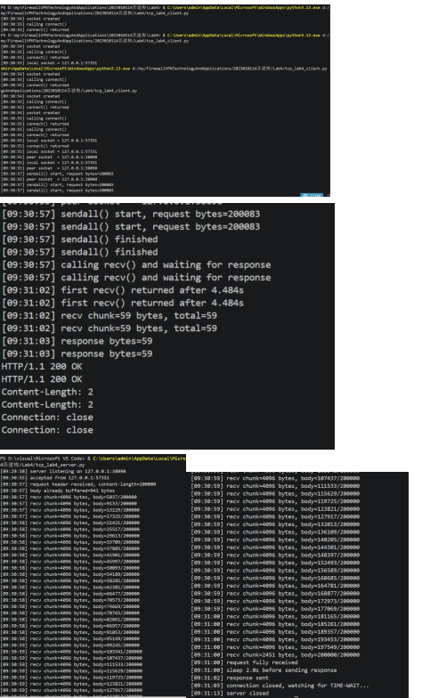
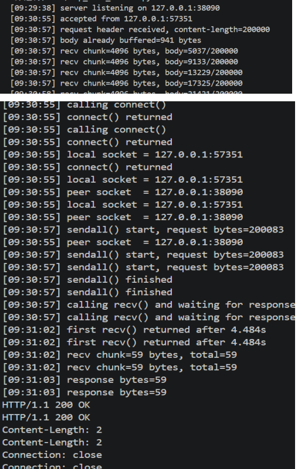
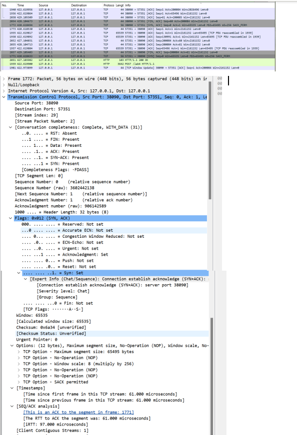
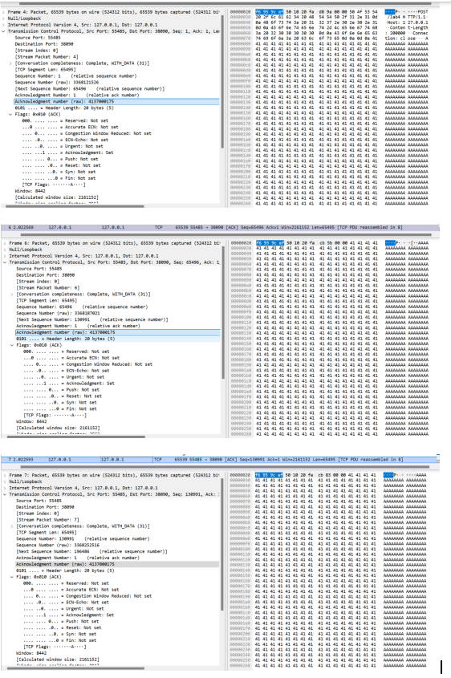
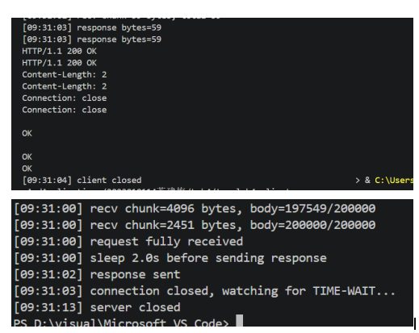

# Lab4：看见TCP 我不怕不怕啦

## 实验背景

本实验围绕一条 TCP 连接的完整生命周期展开，重点观察以下内容：

1. `socket()`、`listen()`、`accept()`、`connect()` 的职责区别
2. "连接"为什么本质上是交换控制信息而不是物理连线
3. TCP 头部中的端口号、序号、ACK 号、标志位、窗口、头部长度、可选字段
4. 三次握手如何建立收发准备
5. 应用层大块数据如何被 TCP 按 MSS 拆分
6. `Sequence Number` 与 `Acknowledgment Number` 如何配合工作
7. `recv()` 为什么会阻塞等待数据
8. 接收窗口如何反映接收方处理能力
9. ACK 与窗口更新为什么常常会被合并
10. `FIN` / `ACK` 如何完成断开
11. 为什么连接结束后套接字不会立刻删除

---

## 实验任务

### 任务一：准备实验环境并记录运行信息

**第一步：准备好四个窗口**

整个实验需要同时观察多个界面，建议在开始前把窗口布局摆好：

- **终端 A**：运行服务端
- **终端 B**：运行客户端
- **终端 C**：持续监控套接字状态（全程保持开启，不要关）
- **Wireshark**：抓包

**第二步：在终端 C 里启动持续监控**

TCP 状态变化很快，等你手动敲完 `ss` 命令再回车，状态可能已经过去了。用下面的命令让终端 C 每 0.5 秒自动刷新一次，之后只需要盯着这个窗口就行：

```bash
# Linux
watch -n 0.5 'ss -tan | grep 38090'

# macOS（没有 watch，用循环代替）
while true; do netstat -an | grep 38090; echo "---"; sleep 0.5; done

# Windows（Git Bash执行）
while true; do netstat -ano | grep 38090; echo "---"; sleep 0.5; done
```

如果你换了端口，把 `38090` 替换成实际端口。

**第三步：打开 Wireshark，选回环接口，填好过滤器，开始抓包**

回环接口在不同系统里名字不同：

| 系统 | 接口名 |
|:-----|:-------|
| Linux | `lo` |
| macOS | `lo0` |
| Windows | `Adapter for loopback traffic capture`（需提前安装 Npcap 并勾选回环支持） |

在显示过滤器里输入：

```text
tcp.port == 38090
```

然后点击开始抓包（蓝色鲨鱼鳍图标）。**先开始抓包，再运行脚本**，否则握手包会被漏掉。

**第四步：启动脚本**

```bash
# 终端 A
python3 tcp_lab4_server.py

# 终端 B（等服务端打印出 server listening on ... 后再运行）
python3 tcp_lab4_client.py
```

如果 `38090` 已被占用，两端都加环境变量换端口，同时记得把 Wireshark 过滤器和终端 C 里的端口号也改掉：

```bash
LAB4_PORT=38123 python3 tcp_lab4_server.py
LAB4_PORT=38123 python3 tcp_lab4_client.py
```

**第五步：填写下表**

| 项目                                | 你的填写内容 |
| :---------------------------------- | :----------- |
| 服务端监听地址                      |        127.0.0.1      |
| 服务端监听端口                      |  38090            |
| 客户端本地临时端口                  |    57351          |
| 客户端请求总字节数                  |   200083 字节           |
| 服务端响应内容                      |   HTTP/1.1 200 OK + Content-Length: 2 + Connection: close           |
| 客户端 `connect()` 返回前后的时间点 |     [09:38:55] calling connect() → [09:38:55] connect() returned（同一秒内，瞬间完成）         |
| 客户端首次收到响应前等待了多久      |    4.484 秒          |

各项数值均可直接从终端输出读取：服务端监听信息在 `server listening on ...`，客户端本地端口在 `local socket = ...`，请求字节数在 `sendall() start, request bytes=...`，等待时间在 `first recv() returned after ...s`。



---

### 任务二：观察套接字创建与连接建立

1. 服务端启动后，观察终端 C 出现 `LISTEN` 状态，截图留存。
2. 在终端 B 里启动客户端，观察它依次打印 `socket created`、`calling connect()`、`connect() returned`。
3. 客户端打印 `connect() returned` 之后，观察终端 C 出现 `ESTABLISHED`，截图留存。脚本在 `connect()` 返回后有 2 秒停顿，这段时间足够截图。

填写下表：

| 阶段                             | 你的填写内容 |
| :------------------------------- | :----------- |
| 服务端启动、客户端未连入时的状态 |  listening on 127.0.0.1:38090            |
| `connect()` 返回后服务端状态     |     accepted from 127.0.0.1:57351         |
| `connect()` 返回后客户端状态     |     connect() returned         |

简答题：

1. 服务端在客户端连接前为什么处于 `LISTEN`？
答：服务端在客户端连接前处于 `LISTEN` 状态，是因为 TCP 协议规定被动方必须先进入监听状态才能响应连接请求。当服务端调用 `listen()` 系统调用后，操作系统内核会将该 socket 标记为被动 socket，并为其分配半连接队列和全连接队列，同时通知网卡对该端口的 SYN 报文进行处理。如果没有进入 `LISTEN` 状态，内核在收到客户端发来的 SYN 连接请求时，找不到对应的监听 socket，就会直接回复 RST 报文拒绝连接。因此 `LISTEN` 状态是服务端准备接受连接的必要前提，它告诉内核“我在这个端口上等着，请帮我处理三次握手”。


2. 为什么这时还没有真正建立 TCP 连接？
答：这时还没有真正建立 TCP 连接，是因为 TCP 协议的“三次握手”过程尚未完成。`LISTEN` 只是服务端的一个预备状态，表示它已经做好了接受连接的准备，但此时客户端还没有发出 SYN 包，或者即使发出了 SYN 包，也还需要服务端回复 SYN-ACK、客户端再回复 ACK 这三个步骤全部完成后，双方才能确认彼此的存在并开始数据传输。在 `LISTEN` 状态下，服务端只是被动地等待客户端的第一次握手，连接还没有任何实质性的建立，因此不能进行数据收发。


3. `socket()` 与 `connect()` 的区别是什么？
答：`socket()` 和 `connect()` 在 TCP 网络编程中扮演着不同的角色。`socket()` 是一个通用的系统调用，用于创建一个新的通信端点，它会在操作系统内核中分配一个套接字结构体，并返回一个文件描述符供后续操作使用，这个调用本身并不涉及任何网络活动，只是准备好了一个可以进行网络通信的对象。而 `connect()` 则是专门用于 TCP 客户端的系统调用，它会主动触发三次握手过程，向服务端发起真正的连接请求。当客户端调用 `connect()` 时，内核会发送 SYN 包到服务端，并等待服务端回复 SYN-ACK，最后再发送 ACK 完成握手，整个过程是阻塞的，只有连接成功建立或超时失败时函数才会返回。简单来说，`socket()` 是“买一部电话机”，而 `connect()` 是“拨打电话号码并等待对方接通”。


4. 为什么 `connect()` 返回后才进入可稳定收发数据的状态？
答：`connect()` 返回后才进入可稳定收发数据的状态，是因为 `connect()` 函数的返回本身就标志着 TCP 三次握手已经全部完成。在 `connect()` 阻塞等待期间，客户端内核与服务器端内核完成了 SYN、SYN-ACK、ACK 这三个报文的交换，当客户端收到服务器发来的 SYN-ACK 并发送出最后的 ACK 后，双方都确认了彼此的初始序列号，也确认了对方的接收窗口和最大报文段长度等参数，此时 TCP 连接才进入 `ESTABLISHED` 状态。只有在这个状态下，双方的内核才为连接分配了发送缓冲区和接收缓冲区，并准备好处理应用层的数据收发。如果 `connect()` 还没有返回，意味着三次握手尚未完成，客户端内核还不能确定对方是否真的愿意并能够接收数据，此时调用 `send()` 发送数据可能会失败或导致不可预期的行为。因此 `connect()` 返回是一个明确的信号，告诉应用程序：“底层的连接已经准备好了，你可以安全地开始发送和接收数据了”。


5. 为什么"网线一直连着"不等于"TCP 连接已经建立"？
答：“网线一直连着”只保证了物理层和链路层的连通性，即电信号或光信号能够在两台计算机之间传递，但这远不等于 TCP 连接已经建立。TCP 连接是一个逻辑上的、端到端的虚拟概念，它需要双方操作系统内核通过三次握手来交换初始序列号、确认对方的存在并分配连接相关的资源。即使网线始终连通，如果客户端从未向服务端发送 SYN 包，或者服务端没有进入 LISTEN 状态并回复 SYN-ACK，那么双方内核中就没有任何关于这个连接的记录，也没有为连接分配缓冲区、计时器等资源。反过来，网线断开也不一定立即导致 TCP 连接断开，因为 TCP 有自己的保活机制和超时重传，只有在连续多次重传失败后才会判定连接失效。所以“网线连着”只是 TCP 连接能够建立的物理前提，但真正建立连接必须通过协议层面的三次握手。


6. 这里的"连接"更准确地说是在做什么？
答：这里的“连接”更准确地说，是在双方操作系统内核之间建立一条逻辑上的虚拟通信管道。这条管道并不对应任何实际的物理线路，而是通过交换三次握手报文，让双方内核记录下对方的 IP 地址、端口号、初始序列号、窗口大小等状态信息，并为这个连接分配发送缓冲区、接收缓冲区和一系列计时器。此后，当应用程序调用 `send()` 发送数据时，内核会将这些数据切分成报文段，加上正确的序列号后发出；当收到对方发来的报文段时，内核会根据序列号进行排序、去重和重传，再交给应用程序。可以说，TCP 连接的本质是两端内核中维护的一份关于对方的状态机，而不是一根实实在在的网线。




---

### 任务三：观察三次握手与 TCP 头部字段

**定位握手包**：在 Wireshark 过滤器里输入下面的条件，可以屏蔽中间的数据包，只留下握手和断开阶段的控制包：

```text
tcp.port == 38090 && (tcp.flags.syn == 1 || tcp.flags.fin == 1)
```

包列表最前面的三个包就是三次握手（SYN → SYN-ACK → ACK）。

**找到各字段的位置**：点击某个握手包，在下方详情栏展开 `Transmission Control Protocol`。源端口、目的端口、Seq、Ack、Flags、Window、Header Length 都在这里。TCP 选项在最底部的 `Options` 子项里，展开后可以看到 MSS、Window Scale、SACK Permitted，注意这三项只出现在带 SYN 标志的包里，纯 ACK 包里没有。

**关于序号显示**：Wireshark 默认开启相对序号，会把每个方向的初始序号归零显示，所以 SYN 包的 Seq 看起来是 `0`，而不是真实的随机大数。这是正常现象，实验报告按 Wireshark 显示的值填写即可。如果你想看真实值，可以去 `Edit → Preferences → Protocols → TCP` 里取消勾选 `Relative sequence numbers`。

填写下表：

| 报文       | 源端口 | 目的端口 | Seq  | Ack  | Flags | Window | Header Length |
| :--------- | :----- | :------- | :--- | :--- | :---- | :----- | :------------ |
| 第一次握手 |   57351     |  38090        |    906142588  |   0   |     SYN  |     65535   |            32 字节   |
| 第二次握手 |    38090    |   57351       |  3602442138    | 906142589     |    SYN, ACK   |    65535    |    32字节           |
| 第三次握手 |    57351    |     38090     |   906142589   |   3602442139   |    ACK   |      8442  |        20字节       |

第一次握手（SYN）的 Ack 字段在 Wireshark 里通常显示为空或 `0`，这是正常的，因为此时客户端还没有收到服务端的任何数据。Header Length 在没有选项时是 20 字节，握手包因为携带了 MSS 等选项通常是 28 或 32 字节。

| TCP 选项       | 你的填写内容 |
| :------------- | :----------- |
| MSS            |     65495 字节         |
| Window Scale   |              8|
| SACK Permitted |            是  |

回环接口的 MSS 通常是 65495（因为回环 MTU 是 65536，比以太网的 1500 大得多），这会影响后续任务五里是否能观察到分段。

简答题：

1. 发送方和接收方端口号在连接阶段的作用是什么？
答：发送方和接收方的端口号在连接阶段的核心作用是**多路复用与多路分解**，即让操作系统内核能够将收到的 TCP 报文段正确交付给对应的应用程序进程。当客户端发起第一次握手时，其内核会将源端口（由操作系统随机分配的临时端口）和目的端口（服务端监听的知名端口）封装进 SYN 报文中；服务端收到后，根据目的端口 38090 找到正在该端口上 listen 的 socket，从而将连接请求交给正确的进程。在回复第二次握手时，服务端将源端口与目的端口互换，客户端收到后同样根据端口号匹配到之前发起连接的 socket。通过这四个端口号（源 IP、源端口、目的 IP、目的端口）的组合，TCP 协议能够唯一标识一条连接，即使同一台机器的同一进程同时与多个服务端通信，内核也能根据端口号区分不同连接的数据包，确保数据不会错乱。


2. TCP 头部如何帮助找到目标套接字？
答：TCP 头部主要依靠**源端口号**和**目的端口号**这两个字段来帮助操作系统找到目标套接字。当一个 TCP 报文段到达主机的网络层后，IP 层会根据协议字段将其交给 TCP 模块处理。TCP 模块提取出报文首部中的目的端口号，在一个维护着所有活跃套接字与端口号映射关系的哈希表中进行查找，找到正在该端口上监听的套接字。对于已建立连接的报文，仅靠目的端口还不够，因为同一端口可能对应多个已连接的套接字（例如同一个服务端端口与多个客户端建立了连接）。此时 TCP 会使用一个四元组——源 IP 地址、目的 IP 地址、源端口号、目的端口号——作为唯一标识，在已建立连接的套接字列表中精确匹配到对应的那个套接字。找到后，内核将报文段中的数据放入该套接字的接收缓冲区，并唤醒正在该套接字上阻塞等待的进程。因此，TCP 头部中的端口号是连接多路分解的关键索引。


3. 为什么初始序号不是简单固定从 1 开始？
答：初始序号不固定从 1 开始，而是由操作系统随机生成，主要是出于安全考虑和防止旧连接干扰。如果每次连接都从 1 开始，攻击者很容易预测序列号，从而实施会话劫持或伪造 TCP 报文注入攻击。另一方面，网络中可能存在延迟到达的旧连接报文，假如客户端之前与同一服务端建立过连接并发送了序列号为 1 到 100 的数据，连接关闭后这些报文仍在网络中滞留，当客户端用同样的地址和端口重新建立连接且序列号又从 1 开始时，服务端收到这些过期的 SYN 或数据报文就可能误认为是当前连接的有效报文，导致数据错乱。通过随机选择 32 位范围内的初始序号，可以极大降低这种偶然冲突的概率，并让攻击者难以猜测。因此，TCP 协议要求每个连接使用随时间变化且难以预测的初始序列号。


4. 为什么 TCP 可选字段更容易在连接阶段看到？
答：TCP 可选字段更容易在连接阶段看到，是因为大多数 TCP 选项只能在连接建立时的 SYN 报文和 SYN-ACK 报文中进行协商，连接建立后通常不再出现。这些选项如最大报文段长度（MSS）、窗口缩放因子（Window Scale）、选择性确认（SACK）等，需要在数据传输开始之前让通信双方确认对方是否支持以及具体的参数值。例如 MSS 告诉对方自己能接收的最大报文段大小，窗口缩放因子告知对方后续窗口字段需要左移的位数，SACK 表明自己支持丢包时的选择性重传。一旦连接进入 ESTABLISHED 状态并开始传输数据，TCP 首部中就不再需要携带这些选项字段，因为参数已经协商完成，后续的数据段和 ACK 段首部长度通常只有 20 字节。因此抓包时会发现握手阶段的报文头部长度较长（32 或 40 字节），而数据传输和挥手阶段的报文头部长度较短（20 字节）。




---

### 任务四：区分头部中的控制信息和套接字中的控制信息

用以下过滤器分别找到两类报文：

```text
# 纯控制报文（无应用数据）
tcp.port == 38090 && tcp.len == 0

# 携带应用数据的报文
tcp.port == 38090 && tcp.len > 0
```

从纯控制报文里选一个（SYN、纯 ACK 或 FIN-ACK 都可以），从数据报文里选一个（客户端发请求或服务端发响应的包）。

填写下表：

| 项目                   | 你的填写内容 |
| :--------------------- | :----------- |
| 纯控制报文的类型       |  第三次握手 ACK（Frame 1773，57351 → 38090 [ACK]，Len=0）            |
| 携带应用数据的报文类型 |     HTTP POST 请求（Frame 1939，57351 → 38090，携带 HTTP 请求数据）         |
| 头部中的控制信息举例   |      序列号（906142588）、确认号（3602442139）、窗口大小（8442）、SYN 标志、ACK 标志        |
| 套接字中的控制信息举例 |       源 IP（127.0.0.1）、目的 IP（127.0.0.1）、源端口（57351）、目的端口（38090）、TIME-WAIT 状态（服务端日志显示 watching for TIME-WAIT）       |

简答题：

1. 为什么"头部中的控制信息"和"套接字中的控制信息"不是同一件事？
答：头部中的控制信息是嵌入在TCP报文段首部中随网络传输的字段，比如序列号、确认号、窗口大小和SYN、ACK等标志位，它们用于指导接收方内核如何处理这个报文。而套接字中的控制信息是操作系统内核为每个套接字维护的持久化状态，比如本端和对端的IP与端口、TCP状态（如LISTEN、ESTABLISHED、TIME_WAIT）、收发缓冲区指针等。前者是“写在信件上的指令”，随报文流动且每个报文可以不同；后者是“邮局里关于收件人的档案”，常驻内核内存用于管理连接生命周期。两者虽然共同协作，但位于不同位置、服务于不同目的，因此不是同一件事。


---

### 任务五：观察数据分段、序号与 ACK

客户端发送的请求体是 200000 字节，超过了回环接口 MSS（约 65495 字节），因此应该可以在 Wireshark 里看到多个连续的数据段。用下面的过滤器找到客户端发出的数据包：

```text
tcp.srcport != 38090 && tcp.port == 38090 && tcp.len > 0
```

在包列表里连续选几个数据段，对比它们的 Seq 值。相邻两段的关系是：后一段的 Seq = 前一段的 Seq + 前一段的 TCP Segment Len。

找服务端返回给客户端的纯 ACK 报文：

```text
tcp.srcport == 38090 && tcp.flags.ack == 1 && tcp.len == 0
```

填写下表：

| 数据段  | Seq  | Ack  | TCP Segment Len | Flags |
| :------ | :--- | :--- | :-------------- | :---- |
| 第 1 段 |   1   |   1   |   65495              |  ACK     |
| 第 2 段 |  65496   |    1  |         65495        |   ACK    |
| 第 3 段 | 130991     |   1   |        65495         |    ACK   |

| ACK 报文 | Ack Number | Flags | Window |
| :------- | :--------- | :---- | :----- |
| 第 1 个  | 65496           |  ACK     |2161152        |
| 第 2 个  | 200084           |   ACK    |  2026496      |
| 第 3 个  |  20084          |    ACK   |  2161152      |

| 项目                         | 你的填写内容 |
| :--------------------------- | :----------- |
| 是否发生分段                 |  是            |
| 握手中观察到的 MSS           |  65495字节            |
| 单段长度与 MSS 的关系        | 单段长度（65495）= MSS（65495），填满了每个段             |
| ACK 号大致确认到了第几个字节 |   第 200084 个字节           |

简答题：

1. 应用程序是否直接决定每个网络包的数据长度？为什么？
答：应用程序并不直接决定每个网络包的数据长度。当应用程序调用 `send()` 或 `write()` 发送数据时，它只是将一段连续的数据交给了操作系统内核，内核中的 TCP 协议栈会根据多个因素来决定如何将这段数据分割成若干个报文段。这些因素包括路径最大传输单元、发送窗口大小、接收方通告的窗口大小、以及拥塞控制算法的状态等。应用程序无法强制内核按照某个精确的长度发送每个包，即使应用程序每次只发送 1 个字节，内核也可能将其缓存起来，等到积累到一定数量后再一并发送。反过来，即使应用程序一次性发送 200000 字节，内核也会按照 MSS 将其分割成多个段分别发送。因此，应用程序决定的是发送的字节流，而网络包的数据长度是由 TCP 协议栈动态决定的。


2. 大块应用数据为什么会被拆分？
答：大块应用数据会被拆分，主要是因为网络链路层和物理层对数据帧的大小存在限制。以太网标准规定了一个最大传输单元，通常为 1500 字节，如果 IP 数据报超过这个大小，就需要在 IP 层进行分片。然而 IP 分片存在效率低下和安全性问题，因此 TCP 协议倾向于在传输层就避免产生过大的报文段。在建立连接时，双方会通过 MSS 选项告知对方自己能够接收的最大 TCP 报文段长度，这个 MSS 通常是根据本地网络接口的 MTU 减去 IP 首部和 TCP 首部长度计算得出的。对于回环接口，MTU 通常远大于以太网的 1500 字节，因此 MSS 可以达到 65495 字节。即便如此，200000 字节的请求体仍然超过了这个 MSS，所以 TCP 协议栈会将其拆分成多个大小不超过 MSS 的报文段分别发送。此外，接收方通告的窗口大小也可能限制一次能发送的数据量，如果窗口较小，即使 MSS 允许，也需要拆分发送。拆分的最终目的是让每个报文段都能在网络上顺利传输，避免在 IP 层被分片，从而提高传输效率和可靠性。


3. `MSS` 与 `MTU` 的关系是什么？
答：MSS与MTU的关系是：MSS等于MTU减去IP首部长度再减去TCP首部长度。MTU是网络链路层所能传输的最大数据帧大小，以太网通常为1500字节。当IP数据报超过MTU时，IP层需要进行分片，但这会降低传输效率并增加重组开销。为了避免IP分片，TCP协议在连接建立时通过MSS选项告知对方自己能够接收的最大TCP报文段长度，这个长度被设计为刚好能够封装在一个MTU大小的IP数据报内。以典型的以太网为例，MTU为1500字节，IP首部通常为20字节，TCP首部通常为20字节，因此MSS通常为1460字节。在回环接口中，MTU通常远大于以太网标准，可以达到65535字节甚至更高，因此实验中观察到的MSS为65495字节，正是从回环接口的MTU中减去40字节首部后得到的。通过协商MSS，通信双方可以确保每个TCP报文段在IP层封装后都不会超过本地链路的MTU，从而避免IP分片。


4. "一次 `sendall()`"与"一个 TCP 包"之间是什么关系？
答：一次 `sendall()` 与一个 TCP 包之间没有一对一的对应关系。`sendall()` 是应用程序调用的函数，它的语义是保证将所有指定的数据都交付给 TCP 协议栈，可能会在内部多次调用 `send()` 来完成。而 TCP 包是网络传输的基本单位，其大小受到 MSS、发送窗口、拥塞窗口等多重因素的限制。当应用程序调用 `sendall()` 发送 200000 字节的大块数据时，TCP 协议栈会将其拆分成多个大小不超过 MSS 的报文段，每个报文段对应一个独立的 TCP 包，分别发送到网络中。反过来，如果应用程序多次调用 `send()` 每次只发送几个字节，TCP 也可能因为启用了 Nagle 算法而将这些小数据块合并到同一个 TCP 包中发送。因此，一次 `sendall()` 可能对应多个 TCP 包，而多个 `send()` 也可能对应一个 TCP 包。应用程序控制的是字节流的边界，而 TCP 包的分割与合并完全由协议栈动态决定。


5. 为什么 ACK 体现的是累计确认？
答：ACK 体现的是累计确认，是因为 TCP 协议设计为使用确认号来告知发送方“截至目前，我已成功收到对方发送的连续字节流，下一个期望收到的字节是这个序号”。这种机制使得一个 ACK 报文可以同时确认之前多个报文段。例如在实验中，客户端发送了三个数据段，序列号分别为 1、65496、130991，每个段长 65495 字节。服务端收到第一个段后回复 Ack=65496，收到第二个段后如果回复 Ack=130991，就表示前两个段都已确认。最终服务端回复 Ack=200084，一次性确认了所有 200083 字节的数据都已收到。累计确认的好处是效率高，发送方不需要为每个报文段单独等待确认，一个 ACK 就能确认一段连续区间的所有数据，同时简化了重传机制，发送方只需要维护一个重传计时器，而不用为每个报文段分别计时。如果 TCP 采用逐个确认的方式，网络开销会成倍增加，且实现复杂度也会大幅上升。


6. 如果中间某一段丢失，ACK 会出现什么变化？
答：如果中间某一段丢失，ACK 会停止前进，反复确认丢失段之前最后一个连续收到的字节。以实验中的三个数据段为例，假设第二个段丢失而第一个段和第三个段成功到达，服务端收到第一个段后会回复 Ack=65496。当第三个段到达时，由于第二个段尚未收到，服务端的接收缓冲区中会出现一个空洞，此时服务端不会将 Ack 更新为第三个段之后的序号，而是继续重复回复 Ack=65496，即期望收到的是丢失的第二个段。客户端收到重复的同一个 ACK 后，就会意识到第二个段可能丢失了，触发快速重传机制，在超时之前重新发送第二个段。当丢失的段被补上后，接收方才能将连续的数据交付给应用程序，并将 ACK 更新为所有已连续收到的下一个字节序号。因此，ACK 停滞在某个位置而不前进，是检测丢包的重要信号。





---

### 任务六：观察 `recv()` 阻塞与窗口字段

`recv()` 的等待时间直接从客户端终端读取，`calling recv() and waiting for response` 到 `first recv() returned after ...s` 之间就是等待时长，脚本已经帮你计算好了。

在 Wireshark 里找窗口值：用过滤器 `tcp.port == 38090 && tcp.flags.ack == 1` 列出所有 ACK 包，点击其中一个，在详情栏 `Transmission Control Protocol` 里找 `Window` 字段。如果同时显示了 `Calculated window size`，优先看这个值，它已经把 Window Scale 的缩放算进去了，是对方实际能接收的字节数。

如果包列表的 Info 列出现了 `[TCP Window Update]` 标注，说明这个包的主要目的是通知对方窗口变化，重点观察它的 `Window` 字段。

填写下表：

| 项目                                   | 你的填写内容 |
| :------------------------------------- | :----------- |
| 客户端开始调用 `recv()` 的时间         |  09:30:57            |
| 客户端第一次收到响应的时间             |  09:31:02            |
| `recv()` 是否立刻返回                  |  否            |
| 首次收到响应前等待了多久               |  	4.484 秒            |
| `recv()` 等待期间连接是否已经建立      |  是            |
| 第 1 个 ACK 报文的窗口值               | 2161152             |
| 第 2 个 ACK 报文的窗口值               |    	2026496          |
| 第 3 个 ACK 报文的窗口值               |   2161152           |
| 窗口值是否变化                         |  是            |
| 若变化，变化趋势                       |  先减小后恢复（2161152 → 2026496 → 2161152）            |
| ACK 与窗口更新是否可以出现在同一个包中 |    是          |
| 是否看到 RTT 或 ACK 往返时间相关信息   |      是        |

简答题：

1. "连接建立"和"应用收到数据"之间是什么关系？
答：“连接建立”和“应用收到数据”之间是必要但不充分的关系。连接建立指的是 TCP 三次握手完成，双方内核进入 ESTABLISHED 状态，此时传输通道已经准备好，应用程序可以调用 send() 发送数据或调用 recv() 等待数据。但连接建立并不意味着应用层能够立即收到数据，因为数据还需要经过发送方应用程序的主动发送、TCP 协议栈的分段封装、网络传输、接收方 TCP 协议栈的重组排序，最终才能交付给接收方的应用程序。在实验中，客户端 connect() 在 09:30:55 返回，连接已经建立，但客户端调用 recv() 后等待了 4.484 秒才收到服务端的 HTTP 响应，这是因为服务端需要先完整接收 200000 字节的请求体，然后 sleep 2 秒，再发送响应。因此，连接建立只是数据收发的前提条件，实际的数据到达时间取决于发送方何时发送以及网络和处理延迟。


2. 为什么说 `read` / `recv` 在数据未到达时会被挂起？
答：`read` 或 `recv` 在数据未到达时会被挂起，是因为 TCP 套接字默认以阻塞模式工作。当应用程序调用 `recv()` 时，它会询问内核：“这个连接的接收缓冲区里有数据吗？”如果没有数据可用，内核会将调用该函数的进程或线程放入等待队列，使其进入睡眠状态，而不会立即返回一个空结果。只有当接收缓冲区中有了新的数据，或者连接发生错误，或者超时时间到达，内核才会唤醒这个进程，让 `recv()` 返回。这种设计的目的是让 CPU 资源能够被其他需要执行的进程使用，而不是让当前进程空转忙等。在实验中，客户端调用 `recv()` 后等待了 4.484 秒才收到服务端的响应，这 4.484 秒内客户端进程就是被挂起的，没有占用 CPU，直到服务端的 HTTP 响应到达后内核才将其唤醒。如果 `recv()` 在无数据时立即返回空，应用程序就需要反复轮询，效率极低。因此挂起等待是 TCP 阻塞 I/O 模型的核心特性。


3. 窗口字段反映了接收方哪方面的能力？
答：窗口字段反映了接收方应用程序处理数据的能力以及接收缓冲区剩余空间的大小。当接收方收到数据后，数据先被放入内核的接收缓冲区中，等待应用程序通过 `recv()` 读取。如果应用程序读取及时，缓冲区就有大量空闲空间，窗口值就大，发送方可以快速发送更多数据。如果应用程序读取缓慢，缓冲区逐渐被填满，窗口值就会缩小，通知发送方降低发送速率。在实验中，No.5 报文的窗口值为 2161152，表示接收缓冲区有大量可用空间；No.9 报文在接收完 200000 字节后窗口降至 2026496，说明部分缓冲区空间被已到达但未被应用程序读取的数据占用了；No.10 的窗口更新报文显示窗口恢复为 2161152，表明应用程序已经读取了数据，缓冲区再次腾空。因此窗口值本质上是接收方对发送方的流量控制信号，告诉对方自己能以多快的速度接收数据，避免发送过快导致数据被丢弃。


4. 为什么发送方不能无限制连续发送数据？
答：发送方不能无限制连续发送数据，主要是为了配合接收方的处理能力和避免网络拥塞。接收方的接收缓冲区大小是有限的，应用程序读取数据的速度也有限，如果发送方无视接收方通告的窗口大小而持续发送，接收方的缓冲区最终会被填满，后续到达的数据只能被丢弃，造成重传浪费。TCP 通过窗口字段实现流量控制，发送方必须确保已发送但未确认的数据总量不超过接收方通告的窗口大小，这就限制了发送速率。此外，网络本身也可能存在拥塞，如果发送方不顾网络状况持续高速发送，路由器队列会溢出，导致大量丢包，反而降低有效吞吐量。TCP 还通过拥塞控制机制动态调整发送速度。因此，发送方不能无限制发送既是尊重接收方的处理能力，也是维护网络稳定性的必要措施。


5. 滑动窗口为什么既提高效率又避免压垮接收方？
答：滑动窗口之所以既能提高效率又能避免压垮接收方，是因为它将确认与流量控制统一在一个机制中。发送方维护一个窗口，窗口内的数据可以连续发送而不必等待每个报文段的单独确认，这大大提高了信道利用率，尤其是在高带宽长延迟的网络中。同时，窗口的大小由接收方通过通告窗口字段动态指定，接收方根据自己的缓冲区剩余空间来调整这个值，发送方据此限制已发送但未确认的数据总量，从而确保不会超出接收方的处理能力。当接收方应用程序读取数据腾出缓冲区后，窗口扩大，发送方可以继续发送；当接收方来不及处理时，窗口缩小，发送方自动减速。这样一来，发送方既能在网络条件好的时候高速发送数据，又能在接收方繁忙时自动降速，实现了效率与流量控制的平衡。滑动窗口让发送方不必停下来等待每个确认，但也永远不会超过接收方愿意接收的数据量。


---

### 任务七：观察响应返回与双向 `seq/ack`

TCP 的 Seq/Ack 是双向独立的，客户端有自己的发送序号，服务端有自己的发送序号。用下面的过滤器只看服务端发出的数据包（源端口是 38090，有应用数据）：

```text
tcp.srcport == 38090 && tcp.len > 0
```

紧跟在服务端数据包后面的、客户端发出的 ACK 包，其 Ack Number 确认的就是服务端的发送序号。

填写下表：

| 项目                     | 你的填写内容 |
| :----------------------- | :----------- |
| 服务端响应数据报文的 Seq |   60           |
| 服务端响应数据报文的 Ack |     200084         |
| 客户端确认报文的 Ack     |  61            |

简答题：

1. 为什么 TCP 的 `seq/ack` 是双向分别计算的？
答：TCP 的 seq 和 ack 是双向分别计算的，是因为 TCP 连接是全双工的，两个方向的数据传输相互独立。每一方都有自己的发送序号，用于标记自己发送的字节流位置，同时也有自己的确认序号，用于告知对方自己已收到对方发送的哪些数据。这种设计使得两个方向的数据流可以交错传输而互不干扰。例如在实验中，客户端发送 HTTP 请求时使用自己的序号空间（从 906142588 开始），服务端发送 HTTP 响应时使用自己独立的序号空间（从 3602442138 开始）。客户端在 ACK 包中确认的是服务端的序号，服务端确认的是客户端的序号。如果两个方向共享同一个序号空间，就会造成混乱，无法区分哪个序号属于哪个方向的数据。因此双向分别计算 seq 和 ack 是全双工通信的基础。


2. 为什么双方都需要各自的初始序号？
答：双方都需要各自的初始序号，是因为 TCP 连接是全双工的，两个方向的数据传输必须独立进行可靠交付。如果只有一方拥有初始序号，另一方没有，那么没有初始序号的一方就无法让对方确认自己发送的数据。每个方向的初始序号用于标记该方向字节流的起始位置，发送方将自己的初始序号告知对方后，对方就可以用确认号来反馈已收到哪些数据，从而实现该方向上的可靠传输。初始序号在三次握手中交换，客户端在 SYN 中携带自己的初始序号，服务端在 SYN+ACK 中同时携带自己的初始序号并确认客户端的初始序号。如果双方使用相同的初始序号，或者只有一方有初始序号，就无法区分不同方向的数据流，也会增加序列号冲突和旧报文干扰的风险。因此各自独立的初始序号是全双工可靠传输的必要设计。


3. 为什么发送应用数据时报文通常仍然带 `ACK`？
答：发送应用数据时报文通常仍然带 ACK，是为了提高网络效率，利用数据报文捎带确认给对方。TCP 允许将确认信息与数据放在同一个报文段中发送，这叫做捎带确认。当一方有应用数据要发送时，它可以将自己最新的确认号附在这个数据报文的首部中，随数据一起发往对方，而不需要单独发送一个只包含 ACK 的包。这样可以减少网络中报文的数量，降低协议开销。在实验中，客户端发送 HTTP 请求的多个数据段时，每个段都设置了 ACK 标志位，确认号为 1，表示确认服务端的 SYN 报文。服务端发送 HTTP 响应时，同样也带有 ACK 标志，确认客户端的请求数据。如果发送数据时不允许携带 ACK，那么每次收到数据后都必须单独回复一个纯 ACK 包，网络流量会明显增加。因此，带数据的报文同时设置 ACK 是 TCP 的常见优化手段。


---

### 任务八：观察连接断开与套接字延迟删除

用下面的过滤器精确定位所有带 FIN 的包：

```text
tcp.port == 38090 && tcp.flags.fin == 1
```

通常会看到两个 FIN 包（双方各一个）。看第一个 FIN 包的源端口，就能判断谁先发起断开。

**关于 TIME-WAIT**：TIME-WAIT 只出现在主动发起关闭的一方（先发 FIN 的那端）。服务端脚本在 `conn.close()` 之后会继续运行 10 秒再退出，这段时间可以在终端 C 里观察 TIME-WAIT。Linux 上 TIME-WAIT 通常持续约 60 秒，macOS 上可能较短，如果没有观察到请如实说明。

填写下表：

| 项目                                    | 你的填写内容 |
| :-------------------------------------- | :----------- |
| 谁先发送 FIN                            |   服务端           |
| 关闭阶段共观察到几个带 FIN 的报文       |    2个          |
| 最终 ACK 是否可见                       |       是       |
| 关闭后是否观察到 `TIME-WAIT` 或等价现象 |   是，服务端持续约 10 秒           |

简答题：

1. 为什么关闭连接不能只发一个结束通知？
答：关闭连接不能只发一个结束通知，是因为 TCP 连接是**全双工**的，数据可以同时在两个方向上独立传输。一个结束通知只能关闭其中一个方向的数据流，另一个方向仍然可以继续发送数据。当一方发送 FIN 时，只表示它不再有数据要发送了，但仍然可以接收对方发来的数据。对方收到 FIN 后可以继续发送尚未传完的数据，发送完毕后也需要发送自己的 FIN 来关闭另一个方向。因此完整的关闭需要双方各自发送一次 FIN，并各自确认对方的 FIN，这就是为什么需要四次挥手而不是一次通知就能结束整个连接。如果只发一个结束通知，另一方可能还有未发送完的数据就无法继续传输了。


2. 为什么连接结束后套接字不会立刻删除？
答：连接结束后套接字不会立刻删除，主要是因为 TCP 需要经历 **TIME_WAIT** 状态。主动关闭连接的一方在发送最后一个 ACK 后会进入 TIME_WAIT 状态，通常持续 2 倍的最大报文段生存时间（2MSL）。这样做的第一个原因是确保最后一个 ACK 能够被对方收到，如果对方没有收到这个 ACK 并重发了 FIN，TIME_WAIT 状态下的套接字可以响应这个重发的 FIN 并重新发送 ACK，避免对方因超时而错误地认为连接未正常关闭。第二个原因是让网络中可能滞留的旧报文段在连接关闭后自然消失，防止这些延迟到达的报文段被误认为是同一个端口上新建立的连接的有效数据。如果在最后一个 ACK 发出后立即删除套接字并复用相同的地址和端口，新连接可能会收到属于旧连接的陈旧报文，导致数据错乱。因此 TIME_WAIT 状态和延迟删除套接字是 TCP 保证可靠性和防止混淆的重要机制。


3. 如果最后一个 ACK 丢失，而旧套接字已经立刻删除，可能带来什么问题？
答：如果最后一个 ACK 丢失而旧套接字已经立刻删除，可能带来两个严重问题。第一个问题是服务端会因收不到对 FIN 的确认而超时重传 FIN 报文，但由于客户端的套接字已经删除，内核中没有对应的连接状态，收到重传的 FIN 后无法回复 ACK，只能回复 RST 报文。服务端收到 RST 后会认为连接异常终止，而非正常关闭，这可能导致服务端资源无法被正确释放或记录错误状态。第二个问题更加隐蔽：如果同一个端口很快被新建立的连接复用，而网络中仍有旧连接延迟到达的数据报文，当服务端重传的 FIN 或旧数据报文到达时，新连接的套接字可能误将其当作有效数据接收，导致数据错乱或连接被意外重置。TIME_WAIT 状态正是为了防止这两种情况，它保留套接字一段时间，使其能够响应重传的 FIN 并丢弃属于旧连接的残余报文，从而保护后续的新连接不受干扰。




---

## 问答题

1. TCP 的"连接"到底意味着什么？它为什么不是"把网线连上"？
答：TCP 的“连接”意味着通信双方的操作系统内核中共同维护了一份关于这条逻辑通道的状态信息，包括对方的 IP 地址和端口号、当前的发送和接收序列号、窗口大小、重传计时器等。这并不是一条实实在在的物理线路，而是一个虚拟的、软件层面的概念。之所以不等于“把网线连上”，是因为网线连通只保证了物理层和链路层能够传递电信号或光信号，但此时双方内核中还没有任何关于这个通信会话的记录，也没有分配缓冲区、协商初始序列号或确认对方的存在。两台计算机即使网线相连，只要没有执行 TCP 的三次握手，就不存在任何 TCP 连接。反过来，网线断开也不一定立即导致 TCP 连接消失，因为 TCP 有自己的超时重传和保活机制，只有在多次重试失败后才会判定连接失效。因此，“网线连着”只是 TCP 连接能够建立的物理前提，而真正的连接是两端内核通过报文交换达成的状态同步。


2. 三次握手为什么能让双方进入可通信状态？
答：三次握手能让双方进入可通信状态，是因为它完成了三件关键的事情：确认双方的收发能力正常、同步初始序列号、协商通信参数。第一次握手客户端发送 SYN，告诉服务端“我想连接你，这是我的初始序列号 x”，此时客户端确认了自己的发送能力和服务端的接收能力。第二次握手服务端回复 SYN+ACK，告诉客户端“我收到了你的 SYN，同意连接，这是我的初始序列号 y，并确认收到了你的序列号 x+1”，此时服务端确认了自己的发送和接收能力以及客户端的发送能力。第三次握手客户端回复 ACK，告诉服务端“我确认收到了你的序列号 y+1”，此时客户端完成了对服务端发送能力的最终确认。经过这三个报文交换后，双方都明确知道了对方愿意通信、对方的初始序列号是多少、自己的序列号已被对方确认，于是双方内核进入 ESTABLISHED 状态，并分配好发送和接收缓冲区，这时应用程序就可以放心地调用 send 和 recv 来收发数据了。三次握手本质上是让双方对通信的起点达成一致，为后续的可靠传输奠定了基础。


3. TCP 头部中的控制字段如何支撑收发数据？
答TCP 头部中的控制字段通过协同工作来支撑数据的可靠收发。序列号字段为每个发送的字节编号，接收方用确认号字段回复已收到的最大连续序列号，从而实现丢包检测与重传。ACK 标志位指示确认号字段有效，使接收方能及时告知发送方数据的接收进度。SYN 和 FIN 标志位分别用于建立和释放连接，通知对方开始或结束通信。RST 标志位在异常时强制终止连接。PSH 标志位告诉接收方将数据立即交给应用程序，而不等待缓冲区填满。窗口字段用于流量控制，通知对方自己还能接收多少数据，防止发送过快导致接收方缓冲区溢出。URG 标志位配合紧急指针，让某些高优先级数据被立即处理。这些控制字段与序列号、确认号、窗口等字段相互配合，使 TCP 能够在不可靠的 IP 层之上提供面向连接、可靠、有序的字节流服务。


4. ACK、窗口、等待时间为什么会共同影响 TCP 的可靠传输？
答：ACK、窗口和等待时间共同构成了 TCP 可靠传输的核心机制，三者缺一不可。ACK（确认号）告诉发送方哪些数据已经被接收方成功收到，发送方根据 ACK 判断是否需要重传丢失的报文段，这是可靠性的基础。窗口字段用于流量控制，接收方通过通告窗口大小告知发送方自己还能接收多少数据，防止发送方发送过快导致接收方缓冲区溢出而丢弃数据。等待时间则体现在超时重传机制中，发送方为每个发出的报文段启动一个计时器，如果在规定时间内没有收到对应的 ACK，就认为报文段丢失并重新发送。这三个要素相互关联：窗口大小会影响发送方一次能发送的数据量，而发送窗口内的每个报文段都有自己的重传计时器；ACK 的到达会更新发送窗口并重置计时器。如果没有 ACK，发送方不知道数据是否到达；如果没有窗口，发送方可能淹没接收方；如果没有等待时间，发送方无法判断何时应该重传。正是这三者的协同工作，使得 TCP 能够在丢包、延迟、带宽变化等复杂网络环境下实现可靠、有序且高效的传输。


5. 断开连接为什么仍然需要严格的控制信息交换？
答：断开连接仍然需要严格的控制信息交换，是因为 TCP 连接是全双工的，双方需要分别关闭各自方向的数据传输。主动关闭的一方发送 FIN 表示自己不再有数据要发送，但此时仍可以接收对方发来的数据；被动关闭的一方收到 FIN 后回复 ACK，然后继续发送完自己尚未传完的数据，最后再发送自己的 FIN。这个过程中 FIN 和 ACK 的交换顺序必须严格遵循，否则可能导致数据丢失或连接无法正常关闭。如果一方直接关闭套接字而不发送 FIN，另一方会一直等待数据，直到超时才发现连接已断，造成资源浪费。此外，最后的 ACK 和 TIME_WAIT 状态也是严格控制的，用于确保对方能够收到关闭确认，并让网络中残留的旧报文自然消失。因此，断开连接的控制信息交换是 TCP 可靠性的重要组成部分。


6. 如果服务端根本没有启动，客户端调用 `connect()` 时会看到什么现象？
答：如果服务端根本没有启动，客户端调用 `connect()` 时会看到连接失败。客户端内核发送第一个 SYN 包到服务端的端口，但由于该端口上没有进程在监听，服务端操作系统内核会回复一个 RST（重置连接）包，表示拒绝连接。客户端收到 RST 后，`connect()` 函数会立即返回错误，通常返回 -1，错误码为 `ECONNREFUSED`（连接被拒绝）。这个过程不会等待超时，因为 RST 是立即回复的，所以客户端很快就能知道连接失败。如果网络不通导致 SYN 包丢失，客户端会等待超时（通常几十秒）后才返回错误。在实验中，如果客户端在服务端启动之前就调用 `connect()`，会看到类似 `ConnectionRefusedError` 或 `[Errno 10061]` 的异常。


7. 如果中途人为制造丢包，ACK、重传、窗口之间会出现什么变化？
答：如果中途人为制造丢包，ACK、重传和窗口之间会出现一系列连锁变化。以客户端发送数据段为例，假设中间某个数据段丢失，服务端收到后续段时会发现接收缓冲区出现空洞，此时服务端不会更新 ACK 号，而是反复确认丢失段之前最后一个连续字节的位置，发送方收到多个重复的 ACK 后会触发快速重传，在超时之前就重新发送丢失的段。在重传期间，发送窗口可能会停止前进，因为窗口内的数据尚未全部被确认，如果窗口被填满，发送方将无法继续发送新数据，直到丢失的段被成功重传并确认。接收方的窗口值可能保持不变或略有缩小，但不会因为丢包本身而改变，窗口只反映缓冲区剩余空间。重传成功后，ACK 号会跳跃到所有连续数据之后，发送窗口向前滑动，传输恢复正常。整个过程体现了 TCP 在丢包环境下的自愈能力。


8. 如果把客户端发送的数据改得更大，窗口字段和分段情况会如何变化？
答：如果客户端发送的数据改得更大，比如从 200KB 增加到 1MB，窗口字段和分段情况会出现以下变化。分段方面，TCP 协议栈仍然会按照握手时协商的 MSS 进行拆分，每个数据段长度不超过 65495 字节，因此数据段的数量会成比例增加，1MB 数据大约会被拆分成 16 个段。窗口字段方面，接收方通告的窗口大小不会因为数据量变大而改变，它取决于接收缓冲区容量和应用程序读取速度。如果接收方缓冲区足够大，窗口会保持在一个较大的值，允许发送方连续发送多个段而不必等待确认。但如果接收方应用程序读取速度跟不上，窗口会逐渐缩小，最终可能降为零，迫使发送方停止发送。此外，在大量数据传输过程中，接收方可能会在多个 ACK 中通告逐渐减小的窗口值，发送方需要根据这些窗口信息调整发送速率。由于实验中的服务端在接收完数据后 sleep 2 秒才处理，如果数据量更大，接收缓冲区可能更容易被填满，窗口缩小现象会更加明显。


9. 如果把服务端读取速度改得更慢，是否更容易看到窗口更新甚至零窗口？
答：是的，如果把服务端读取速度改得更慢，会更容易看到窗口更新甚至零窗口现象。服务端通过 `recv()` 从内核接收缓冲区中读取数据，如果应用程序读取速度跟不上数据到达的速度，接收缓冲区会逐渐被填满。当缓冲区剩余空间变小时，服务端在回复 ACK 时会通告一个较小的窗口值，客户端收到后会减慢发送速度。如果服务端完全不读取数据，接收缓冲区最终会耗尽，此时服务端通告的窗口值降为零，客户端收到零窗口后必须停止发送，进入持续定时器轮询，直到服务端再次通告非零窗口。当服务端应用程序终于读取了一部分数据腾出缓冲区空间后，服务端会单独发送一个窗口更新报文通知客户端可以继续发送。在实验中，服务端接收完 200KB 数据后 sleep 2 秒才处理，如果将 sleep 时间延长或者模拟缓慢读取，就能在抓包中清晰观察到窗口逐渐缩小、最终变为零、以及后续窗口更新恢复的过程。这些现象是 TCP 流量控制机制的直接体现。


---

## 截图要求

- 截图须清晰，终端文字和 Wireshark 字段可读。
- 所有截图与本 `Lab4.md` 放在同一目录下。
- 命名规范：

| 截图内容               | 文件名                  |
| :--------------------- | :---------------------- |
| 服务端与客户端运行结果 | `run.png`               |
| `ss` 状态变化          | `states.png`            |
| 三次握手与 TCP 选项    | `handshake_header.png`  |
| 大请求分段与 MSS       | `segmentation.png`      |
| ACK 与窗口观察         | `ack_window.png`        |
| 断开与最终状态         | `teardown_timewait.png` |

具体要求：

1. `run.png`：终端截图，至少能看到服务端 `server listening on ...`、客户端 `calling connect()`、`connect() returned`、`calling recv() and waiting for response`、`first recv() returned after ...s`。

2. `states.png`：终端截图，至少能看到 `LISTEN`、`ESTABLISHED`，以及 `TIME-WAIT`（若能观察到）。推荐截 `watch` 命令的持续输出画面，可以在一张截图里同时展示多个状态的变化过程。

3. `handshake_header.png`：Wireshark 截图，至少能看到三次握手中某个包的 `Source Port`、`Destination Port`、`Sequence Number`、`Acknowledgment Number`、`Flags`、`Window`，以及 `Options` 中的 `Maximum segment size`、`Window Scale`、`SACK Permitted`。

4. `segmentation.png`：Wireshark 截图，至少能看到客户端发送数据的 TCP 包的 `TCP Segment Len`、`Seq`、`Ack`。若能观察到分段，尽量截出多个连续数据段。

5. `ack_window.png`：Wireshark 截图，至少能看到一个或多个 ACK 报文的 `Acknowledgment Number`、`Window`，以及 `Calculated window size`（若显示）、`[TCP Window Update]`（若出现）。

6. `teardown_timewait.png`：Wireshark 截图或 Wireshark 与终端截图的拼图，至少能看到带 `FIN` 的包，以及 `TIME-WAIT` 状态（若能观察到）。

---

## 提交要求

在自己的文件夹下新建 `Lab4/` 目录，提交以下文件：

```text
学号姓名/
└── Lab4/
    ├── Lab4.md
    ├── tcp_lab4_server.py
    ├── tcp_lab4_client.py
    ├── run.png
    ├── states.png
    ├── handshake_header.png
    ├── segmentation.png
    ├── ack_window.png
    └── teardown_timewait.png
```

---

## 截止时间

2026-04-23，届时关于 Lab4 的 PR 请求将不会被合并。
