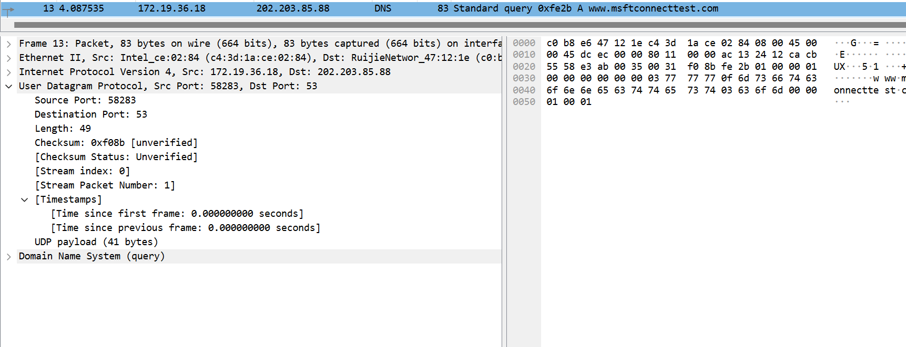
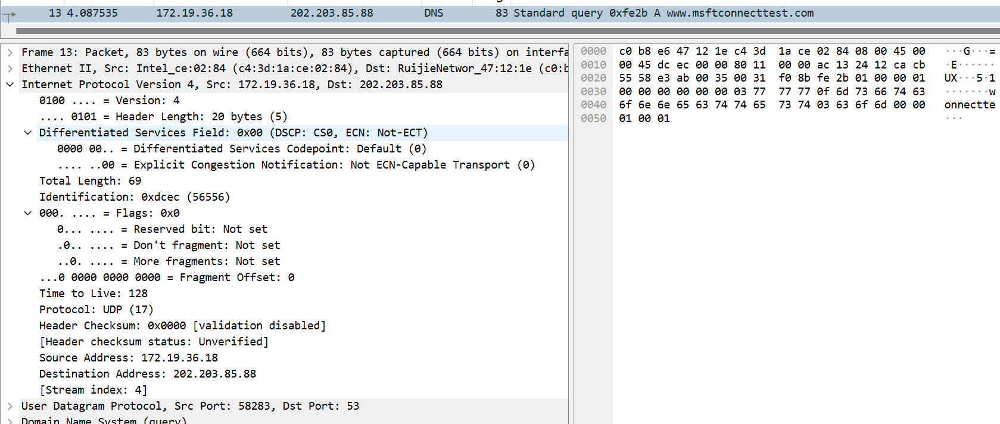
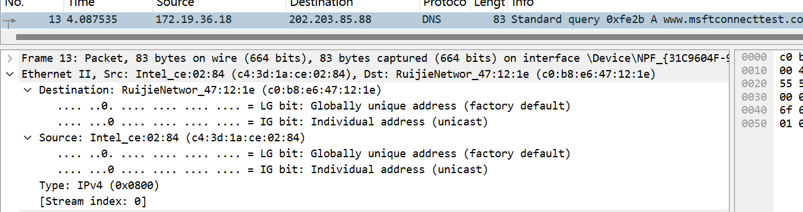
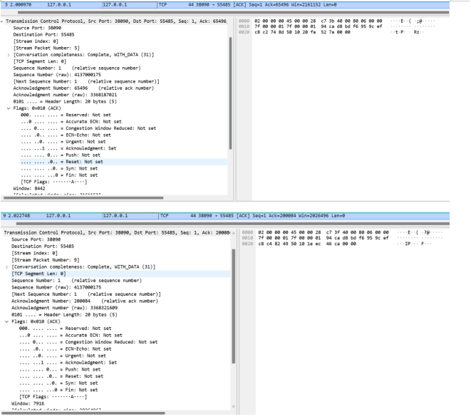
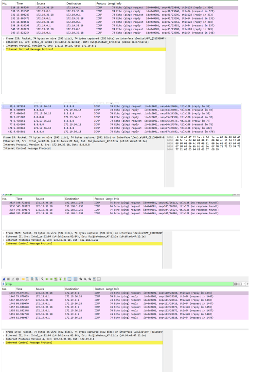

# Lab5：IP 与以太网的包收发操作

## 实验背景

本实验围绕 IP 模块与以太网在包收发过程中的角色展开，重点观察以下内容：

1. 网络包的基本结构：头部（IP 头部 + MAC 头部）与数据
2. IP 头部各字段的含义：版本号、TTL、协议号、发送方/接收方 IP 地址等
3. MAC 头部各字段的含义：接收方/发送方 MAC 地址、以太类型
4. IP 地址与 MAC 地址的区别与协作
5. ARP 协议如何通过 IP 地址查询 MAC 地址
6. 路由表的结构与查询方式
7. UDP 协议与 TCP 协议的区别：无连接、无确认、无重传
8. UDP 头部结构：发送方端口号、接收方端口号、数据长度、校验和
9. ICMP 协议的作用与常见消息类型（Echo、Destination Unreachable 等）

---

## 实验任务

### 任务一：查看路由表、ARP 缓存并启动 Wireshark

**第一步：打开 Wireshark，选择主网络接口，开始抓包**

> **注意**：本次实验必须使用真实网络接口（`en0`/`eth0`/`以太网`），不要选回环接口。回环接口不经过以太网，无法观察到 MAC 头部和 ARP 过程。

选择你的主网络接口，开始抓包。本次实验的大部分任务会共用同一次抓包。

**第二步：查看本机路由表**

```bash
# Linux
route -n
ip route show

# macOS
netstat -rn

# Windows
route print
```

截图并保存为 `route_table.png`。

**第三步：查看本机 ARP 缓存**

```bash
# Linux / macOS / Windows
arp -a
```

截图并保存为 `arp_cache.png`。

**第四步：填写下表**

从路由表和 ARP 缓存的输出中提取信息：

| 项目                         | 你的填写内容 |
| :--------------------------- | :----------- |
| 本机 IP 地址                 | 	172.19.36.18             |
| 本机所在子网                 |  	172.19.0.0/24            |
| 子网掩码                     |  255.255.255.0            |
| 默认网关 IP                  |     172.19.0.1         |
| 默认网关 MAC 地址            |  c0-b8-e6-47-12-1e            |
| 本机网卡 MAC 地址            | 	c4-3d-1a-ce-02-84             |

简答题：

1. 路由表的每一行包含哪些关键字段？教材中提到的 `Network Destination`、`Netmask`、`Gateway`、`Interface` 分别对应什么含义？
答：路由表的每一行通常包含五个关键字段。其中，`Network Destination` 表示数据包要到达的目标网络或主机的地址；`Netmask` 是与目标地址配合使用的子网掩码，用于区分网络部分和主机部分；`Gateway` 指的是下一跳路由器的地址，即数据包应该转发到的下一个设备，如果目标地址位于本机直接连接的网络上，该字段通常显示为“在链路上”；`Interface` 则指定本机用于发送数据包的接口的IP地址，也就是从哪个网卡出去。此外还有一个 `Metric` 字段，表示路由的优先级或成本，数值越小优先级越高。


2. 当目标 IP 地址不在本子网时，包会先发给谁？路由表的哪一列提供了这个信息？
答：当目标 IP 地址不在本机所在的子网时，数据包会被先发给默认网关。路由表中的 `Gateway` 列提供了这个信息，该列记录了下一跳路由器的 IP 地址，即数据包需要转发到的设备。通常在路由表中，`Network Destination` 为 `0.0.0.0` 且 `Netmask` 为 `0.0.0.0` 的那条默认路由会指定网关地址，所有发往非本子网的数据包都将匹配这条路由，并从 `Gateway` 列获得下一跳的地址。


3. 路由表的默认网关（`0.0.0.0`）条目的作用是什么？什么时候会匹配到这一行？
答：路由表中 `Network Destination` 为 `0.0.0.0` 且 `Netmask` 为 `0.0.0.0` 的条目称为默认网关条目。它的作用是：当数据包的目标 IP 地址无法匹配路由表中的任何一条更具体的路由（比如直连子网路由、主机路由或其他特定网络路由）时，就使用这条默认路由来转发数据包，将包发给 `Gateway` 列指定的下一跳路由器。

匹配时机是：对于所有目标 IP 地址，只要没有更精确（即子网掩码更长）的路由与之匹配，最终都会匹配到这行 `0.0.0.0`，因为它可以匹配任何地址。简单说，它是“最后兜底”的路由，保证所有未知目的地的流量都能有一个出口。


4. 教材提到，确定发送方 IP 地址的关键在于"判断应该使用哪块网卡"。结合你查到的本机网卡信息，说明 IP 模块是如何做出这个判断的。
答：IP模块在发送数据包时，判断使用哪块网卡（即选择哪个源IP地址）的核心过程如下：

首先，IP模块会查看数据包的目标IP地址，并查阅本机的路由表，从中找到一条最匹配（即子网掩码最长或优先级最高）的路由条目。这条路由条目中指定的`Interface`字段（即本机用于发送数据的IP地址）就决定了应该使用哪块网卡。

结合你之前查到的本机信息（例如本机IP地址`172.19.36.18`，所在子网`172.19.0.0/24`，默认网关`172.19.0.1`），具体判断逻辑是：

如果目标IP地址与本机IP `172.19.36.18` 属于同一个子网（例如目标为`172.19.0.5`），路由表中会有一条直连路由（`Network Destination` 为 `172.19.0.0`，`Netmask` 为 `255.255.255.0`，`Gateway` 为 `在链路上`），`Interface` 列为 `172.19.36.18`。此时IP模块会选择该网卡，并直接通过ARP解析目标MAC地址发送数据包。

如果目标IP地址不在本子网（例如访问`8.8.8.8`），路由表会匹配到默认路由（`0.0.0.0`），该路由的 `Interface` 列同样指向 `172.19.36.18`（或默认网关对应的本地接口）。此时IP模块仍选择 `172.19.36.18` 这块网卡，并将数据包封装后发送给默认网关 `172.19.0.1`。

因此，判断的关键就是：根据目标IP查找路由表 → 找到最匹配的路由条目 → 使用该条目中 `Interface` 字段指定的IP地址和对应的网卡。如果有多个网卡配置了不同子网的IP，路由表中会有多条直连路由，IP模块会根据目标IP所属的子网自动选择相应的网卡。


---

### 任务二：观察 UDP 头部

只要计算机处于联网状态，Wireshark 中就会持续出现大量 UDP 流量（DNS、mDNS、DHCP、NTP 等），无需手动生成。

**第一步：在 Wireshark 中设置过滤器**

```text
udp
```

**第二步：在包列表中找一个 UDP 包**

随便选一个即可。如果包太多，可以加上源或目的 IP 来缩小范围，例如 `udp && ip.addr == 你的IP`。如果需要 DNS 包，也可以用 `udp.port == 53` 过滤。

> **可选**：如果想明确看到一个完整的请求-响应对，可以在终端中执行 `nslookup example.com`，Wireshark 中就会出现对应的 DNS 请求包。

**第三步：点击选中的 UDP 包，在详情栏展开 `User Datagram Protocol`**

填写下表：

| 项目               | 你的填写内容 |
| :----------------- | :----------- |
| UDP 头部总长度     |      8字节        |
| 源端口             |           58283   |
| 目的端口           |        53      |
| 长度（Length）     |          49    |
| 校验和（Checksum） |  	0xf08b            |

简答题：

1. 你观察到的 UDP 头部长度是多少字节？TCP 头部至少 20 字节。UDP 省略了哪些字段？这些字段的缺失带来了什么后果？
答：8 字节。TCP头部相比，UDP省略了以下字段：序列号、确认号、数据偏移、保留位、标志位（URG、ACK、PSH、RST、SYN、FIN等）、窗口大小、紧急指针、选项和填充。UDP只保留了最基本的源端口、目的端口、长度和校验和四个字段。由于省略了序列号、确认号和标志位等字段，UDP无法提供TCP所具备的可靠传输机制，具体后果包括：不保证数据包的按序到达，不进行丢包重传，没有拥塞控制和流量控制，也不建立连接（无三次握手）。这使得UDP传输具有更好的实时性和更低的开销，但应用程序需要自行处理丢包、乱序等可靠性问题。因此UDP常用于对实时性要求高、可容忍少量丢包的场景，如DNS查询、视频直播、VoIP语音通话等。


2. UDP 头部中的"长度"字段指的是什么长度？
答：UDP头部中的“长度”字段指的是UDP数据报的总长度，即UDP头部（8字节）加上UDP负载（Payload）的字节数。




---

### 任务三：观察 IP 头部字段

点击任务二中的同一个 UDP 包，在详情栏展开 `Internet Protocol Version 4`。

填写下表：

| 字段名称               | 你的填写内容 | 含义说明 |
| :--------------------- | :----------- | :------- |
| Version（版本号）      |     4         |  表示该 IP 数据报使用 IPv4 协议        |
| Header Length（头部长度） |   20字节         |  表示 IP 头部长度为 20 字节（单位是 4 字节，5 × 4 = 20）        |
| Time to Live（TTL）    |   128          |    表示数据包的最大跳数，每经过一个路由器减 1，减到 0 时丢弃，防止无限循环      |
| Protocol（协议号）     |    17          |     表示 IP 负载部分封装的协议类型，17 对应 UDP     |
| Source Address（源 IP） |  172.19.36.18            |        	发送该数据包的主机 IP 地址  |
| Destination Address（目的 IP） |	202.203.85.88 |   	接收该数据包的目标主机 IP 地址       |

简答题：

1. 协议号字段的值是多少？它代表什么协议？如果抓一个 HTTP 请求的包，协议号会变成多少？
答：协议号字段的值是 17，代表 UDP 协议。如果抓一个 HTTP 请求的包，协议号会变成 6，代表 TCP 协议。


2. TTL 字段的作用是什么？如果 TTL 降为 0 会发生什么？
答：TTL（Time to Live）字段的作用是限制数据包在网络中的最大跳数，防止数据包因路由环路而在网络中无限循环。每经过一个路由器，TTL 值减 1。

如果 TTL 降为 0，路由器会丢弃该数据包，并向源主机发送一个 ICMP 超时错误消息。


3. 有教材提到 IP 地址"实际上并不是分配给计算机的，而是分配给网卡的"。你的本机有几块网卡？每块网卡的 IP 地址分别是什么？（提示：可参考任务一中路由表的 Interface 列，或用 `ip addr`（Linux）/`ifconfig`（macOS）/`ipconfig`（Windows）查看。）
答：本机主要有5块网卡及对应IP地址：
- 无线网卡：172.19.36.18
- VirtualBox虚拟网卡：192.168.56.1
- VMware VMnet1：192.168.239.1
- VMware VMnet8：192.168.145.1
- 无线虚拟适配器：192.168.137.1

教材说法正确：IP地址实际是分配给每块网卡的，而不是整个计算机。


4. IP 头部中的源 IP 地址和目的 IP 地址分别是谁的地址？它们与 MAC 头部中的源/目的 MAC 地址有什么区别？
答：IP头部中的源IP地址是发送方主机的IP地址，目的IP地址是最终接收方主机的IP地址。MAC头部中的源MAC地址是当前发送数据包的设备的MAC地址，目的MAC地址是下一跳接收设备的MAC地址。
两者的区别在于：IP地址在整个传输过程中保持不变（除非经过NAT），标识通信的终点；MAC地址在每一跳都会改变，标识相邻节点之间的链路层连接。IP地址负责“最终去哪”，MAC地址负责“下一站给谁”。




---

### 任务四：观察 MAC 头部与以太网帧

点击任务二中的同一个 UDP 包，在详情栏展开 `Ethernet II`。

填写下表：

| 字段名称               | 你的填写内容 | 含义说明 |
| :--------------------- | :----------- | :------- |
| Source（源 MAC）       |   c4:3d:1a:ce:02:84           |   发送该数据帧的本机网卡 MAC 地址       |
| Destination（目的 MAC） | 	c0:b8:e6:47:12:1e             |   	接收该数据帧的下一跳设备（网关）的 MAC 地址       |
| Type（以太类型）       |    	0x0800          |  	表示上层协议为 IPv4       |

关于 MAC 地址格式，填写下表：

| 项目               | 你的填写内容 |
| :----------------- | :----------- |
| MAC 地址长度       | 48 比特（6 字节） |
| 本机网卡的 MAC 地址 |  	c4:3d:1a:ce:02:84         |
| 目的 MAC 地址      |  	c0:b8:e6:47:12:1e            |
| MAC 地址的书写格式 | 十六进制，每字节用冒号或短横线分隔（如 c4:3d:1a:ce:02:84 或 c4-3d-1a-ce-02-84）             |

简答题：

1. 以太类型字段的值是多少？它代表后面承载的是什么协议的包？
答：以太类型字段的值是 0x0800，它代表后面承载的是 IPv4 协议的包。


2. DNS 服务器的 IP 通常是外网地址。本任务中目的 MAC 地址是 DNS 服务器的 MAC 地址还是你本机网关（路由器）的 MAC 地址？为什么？
答：本任务中目的 MAC 地址是本机网关（路由器）的 MAC 地址，而不是 DNS 服务器的 MAC 地址。

原因是：DNS 服务器的 IP 地址（202.203.85.88）是外网地址，与本机 IP（172.19.36.18）不在同一个子网。本机需要将数据包先发送给默认网关（172.19.0.1），由网关进行路由转发。因此数据包在以太网层的目标 MAC 地址必须是网关的 MAC 地址，而不是最终 DNS 服务器的 MAC 地址。跨网段通信时，目的 MAC 地址永远填的是下一跳路由器的 MAC 地址，目的 IP 地址才填最终目标。


3. IP 地址和 MAC 地址在功能上有什么相似之处？又有什么本质区别？
答：IP地址和MAC地址在功能上的相似之处是：它们都用于在网络中唯一标识一个设备（或网卡），是数据能够正确送达目的地的基础。

本质区别在于：IP地址是逻辑地址，由网络管理员或DHCP动态分配，可以根据网络拓扑变化而改变，用于在网络层标识设备所在的位置（属于哪个子网），负责跨网络的路由寻址。MAC地址是物理地址，由网卡制造商烧录在硬件中，全球唯一且通常不可改变，用于在同一个数据链路层网络（同一子网）中标识相邻设备，负责在本地网络中的实际帧传输。简单说，IP地址用于“找到目标在哪一个网络”，MAC地址用于“在同一网络内找到具体设备”。


4. 为什么以太网帧中需要同时有 IP 地址（在 IP 头部中）和 MAC 地址？不能只用其中一种吗？
答：不能只用其中一种，因为IP地址和MAC地址工作在不同层次，解决不同的问题。

只用IP地址的问题：IP地址是逻辑地址，用于跨网络路由，但在同一个局域网内发送数据帧时，网卡需要知道目标设备的物理地址才能把帧发到正确的网卡上。IP地址无法直接转换成硬件需要的MAC地址。

只用MAC地址的问题：MAC地址是物理地址，只能在同一个子网内通信。当数据包需要跨越多个网络（如访问互联网）时，MAC地址无法提供路由信息，路由器无法根据MAC地址决定下一跳路径。此外MAC地址由制造商烧录，与网络拓扑无关，无法像IP地址那样按网络位置进行聚合和路由。

因此两者缺一不可：IP地址负责从源到终端的端到端寻址（逻辑定位），MAC地址负责每一段链路上的实际帧传输（物理转发）。它们配合工作，IP头部中的目的IP始终不变，而以太网头部中的目的MAC地址逐跳改变，由当前网络的网关或目标设备决定。




---

### 任务五：观察 ARP 协议

ARP（Address Resolution Protocol，地址解析协议）用于根据 IP 地址查询 MAC 地址。只要计算机处于联网状态，Wireshark 中通常会持续出现 ARP 包（邻居发现、缓存刷新等），可以直接观察。如果抓包一段时间后仍未看到 ARP 包，再手动触发。

**第一步：在 Wireshark 中设置过滤器**

```text
arp
```

**第二步：在包列表中找 ARP 包**

正常联网的设备每隔几分钟就会自动发送 ARP 请求，等待即可。如果等了一会儿仍没有，可以选择以下任一方式手动触发：

- **方式 A（推荐）**：在终端中执行 `arping`

  ```bash
  # Linux（通常已预装）
  sudo arping -c 3 <网关IP>

  # macOS（如果没有，先执行：brew install arping）
  sudo arping -c 3 <网关IP>

  # Windows（可从 https://github.com/ThomasHabets/arping/releases 下载）
  arping -c 3 <网关IP>
  ```

- **方式 B**：先清除 ARP 缓存，再 ping 同网段地址

  ```bash
  # 清除 ARP 缓存
  # Linux:   sudo ip neigh flush all
  # macOS:   sudo arp -d -a
  # Windows: arp -d *

  # 然后 ping 网关
  ping <网关IP> -c 2
  ```

> **注意**：如果目标是 `127.0.0.1` 或外网地址，ARP 不会出现。回环接口不经过以太网，外网地址的 MAC 地址是路由器的（通常已缓存）。

**第三步：点击 ARP 请求包（Opcode 为 request），展开详情**

**第四步：填写下表**

| 项目                     | 你的填写内容 |
| :----------------------- | :----------- |
| ARP 请求的目的 MAC 地址 | Broadcast (ff:ff:ff:ff:ff:ff)             |
| ARP 请求中查询的目标 IP |   172.19.36.18           |
| ARP 响应中返回的 MAC 地址 |   	c4:3d:1a:ce:02:84           |
| 该 ARP 包是自动出现还是手动触发的 |   	自动出现           |

简答题：

1. ARP 请求的目的 MAC 地址为什么是 `ff:ff:ff:ff:ff:ff`（广播地址）？
答：ARP 请求的目的 MAC 地址之所以是广播地址（`ff:ff:ff:ff:ff:ff`），是因为发送方（网关）不知道目标 IP 地址对应的 MAC 地址是什么。

在同一个局域网内，发送方需要找到某个 IP 对应的 MAC 地址时，只能通过广播的方式向网络中所有设备询问：“谁拥有这个 IP？请把你的 MAC 地址告诉我。”广播地址可以保证网络中的所有设备都能收到这个请求，拥有该 IP 的设备会单独回复自己的 MAC 地址，其他设备则忽略该请求。这样发送方就能学习到正确的 MAC 地址，并存入 ARP 缓存中供后续通信使用。


2. 为什么 ARP 缓存中的条目会在几分钟后自动删除？
答：ARP缓存中的条目会在几分钟后自动删除，主要原因是为了适应网络环境的变化。网络中设备的IP地址和MAC地址的对应关系可能随时改变，比如设备更换网卡、IP地址重新分配或设备加入退出网络。如果ARP缓存中的条目长期不更新，当某个设备的MAC地址发生变化后，发送方仍然使用旧的MAC地址发送数据，就会导致通信失败。通过定期删除旧条目并重新发起ARP请求获取最新信息，可以保证ARP缓存能够及时反映网络中的实际映射关系，从而确保数据能够正确送达目标设备。


3. 如果 ARP 缓存中的 MAC 地址已经过期（对方 IP 对应的设备已更换），会出现什么问题？如何解决？
答：如果 ARP 缓存中的 MAC 地址已经过期（例如对方设备更换了网卡或 IP 重新分配），本机仍然使用旧的 MAC 地址封装数据帧，数据帧会被发送到一个不存在的或错误的设备上，导致通信失败。

解决办法是：当本机发现无法与目标 IP 正常通信时（例如 TCP 连接超时或收到 ICMP 错误消息），会主动删除该 IP 对应的 ARP 缓存条目，然后重新发送 ARP 请求广播，获取目标 IP 最新的 MAC 地址。此外，ARP 缓存中的条目本身也会在过期时间（通常为几十秒到几分钟）到达后自动删除，下次通信时会重新通过 ARP 请求获取正确的 MAC 地址。




---

### 任务六：使用 `ping` 命令观察 ICMP

有教材提到了 ICMP（Internet Control Message Protocol）协议，它用于在 IP 层传递错误和控制信息。`ping` 命令就是基于 ICMP 的 Echo Request（类型 8）和 Echo Reply（类型 0）实现的。

**第一步：在 Wireshark 中设置 ICMP 过滤器**

```text
icmp
```

**第二步：在终端中执行 ping 命令**

```bash
# ping 本机（回环）
ping 127.0.0.1 -c 4

# ping 局域网内的设备（如路由器网关）
ping <网关IP> -c 4

# ping 外网地址
ping 8.8.8.8 -c 4
```

**第三步：在 Wireshark 中观察 ICMP 包**

填写下表：

| 目标               | 是否收到回复 | 往返时间（ms） | TTL 值 |
| :----------------- | :----------- | :------------- | :----- |
| 127.0.0.1          |     是         |  <1 ms（约 0.0x ms）              |   128     |
| 局域网设备（网关） |       是       |   约 6-7 ms             |    128（请求）/ 64（回复    |
| 8.8.8.8            |         是     |  约 212-214 ms              |  128（请求）/ 128（回复）
说明：

127.0.0.1 是本地回环地址，不经过网卡，所以几乎无延迟，TTL 为 128。

网关的回复 TTL 为 64，说明网关是 Linux/Unix 类设备。

8.8.8.8 的回复 TTL 也是 128，回复时间约 200+ ms，属于正常的外网延迟。

      |

> **提示**：ping 回环地址（`127.0.0.1`）时数据不经过物理网卡，Wireshark 在主网络接口上可能无法捕获到包。TTL 值可从终端输出中读取（`ping` 会显示 `ttl=...`），或切换 Wireshark 至回环接口（`lo0` / `lo`）抓包。

简答题：

1. `ping` 命令发送的是什么类型的 ICMP 消息？收到的回复又是什么类型？
答：ping 命令发送的是 ICMP 类型 8 的消息，即 Echo Request（回显请求）。收到的回复是 ICMP 类型 0 的消息，即 Echo Reply（回显应答）。


2. 为什么 ping 不同目标的 TTL 值不同？TTL 值反映了什么信息？
答：ping 不同目标时 TTL 值不同，是因为 TTL 反映了数据包从源主机到目标主机之间经过的路由器跳数（即经过了多少个网络节点）。TTL 的初始值由操作系统设置（常见初始值为 64、128 或 255），每经过一个路由器，TTL 值减 1。当收到回复时，显示的 TTL 值是经过递减后剩余的值，因此不同的目标主机距离不同，经过的路由器数量不同，剩余的 TTL 值也就不同。通过比较初始值和剩余值的差值，可以大致判断源主机与目标主机之间的网络距离或跳数。


3. 教材表 2.4 中列出了多种 ICMP 消息类型。`Destination unreachable`（类型 3）在什么情况下会出现？请用以下方法尝试触发并观察：

   ```bash
   # 方法一（推荐）：ping 同网段内一个确认不存在的 IP
   # 例如你的本机 IP 是 192.168.1.100，子网掩码 255.255.255.0，
   # 那么可以 ping 192.168.1.250（一个大概率没有被分配的地址）
   ping <同网段不存在的IP> -c 3
   
   # 方法二：向一个关闭的端口发 UDP 包，触发 ICMP Port Unreachable
   # 先在 Wireshark 中保持 icmp 过滤器，然后执行：
   # Linux / macOS
   echo "test" | nc -u -w 1 <同网段某台设备的IP> 19999
   
   # Windows（需安装 nmap：https://nmap.org/download.html）
   nmap -sU -p 19999 <同网段某台设备的IP>
   ```

   观察到类型 3 的包后，记录其 Code 值（子类型）并说明代表什么含义。
答：Destination unreachable（类型3）在数据包无法送达目标时出现，常见场景包括目标主机不存在、目标端口未开放、网络不可达或需要分片但不允许分片。以方法二（向关闭端口发送UDP包）为例，观察到的Code值为3，代表Port unreachable，含义是目标主机上指定的端口没有服务在监听，UDP数据包无法送达。




---

## 问答题

1. 网络包由哪几部分构成？IP 头部和 MAC 头部分别的作用是什么？
答：一个网络包通常由三部分构成：头部（Header）、负载（Payload，也称数据部分）和尾部（Footer，如以太网的帧校验序列FCS）。其中头部又按协议栈层次分层封装，典型的层次包括以太网头部（MAC头部）、IP头部和传输层头部（如TCP/UDP头部）。

IP头部的作用是实现网络层的端到端逻辑寻址和路由，它包含了源IP地址和目的IP地址，用于指导数据包从源主机跨网络传输到目的主机，每个路由器根据IP头部中的目的IP地址决定下一跳的转发路径。IP头部还包含TTL、协议号等字段用于控制包的生命周期和标识上层协议。

MAC头部的作用是在同一个数据链路层网络（即同一子网）内实现相邻节点之间的物理寻址和帧传输，它包含了源MAC地址和目的MAC地址，用于标识数据帧的发送方和接收方（通常是本机网卡和下一跳路由器或目标主机的网卡）。MAC头部中的以太类型字段还用于标识上层协议（如IPv4或ARP）。

简单来说，IP头部负责“从哪来到哪去”（跨网络寻址），MAC头部负责“下一站给谁”（同网段内的实际交付）。


2. IP 协议和以太网协议在网络传输中分别承担什么职责？它们是如何分工协作的？
答：IP协议和以太网协议在网络传输中承担不同但互补的职责。

IP协议工作在网络层，负责端到端的逻辑寻址和路由。它使用IP地址标识源主机和目的主机，并指导数据包跨越多个不同网络（如局域网、广域网）进行转发。每个路由器根据IP头部中的目的IP地址独立决定下一跳路径，确保数据包最终到达目标主机。

以太网协议工作在数据链路层，负责在同一物理网络（同一子网）内的相邻节点之间传输数据帧。它使用MAC地址标识直接相连的设备（如本机网卡和下一跳路由器），并通过CSMA/CD（或全双工）机制管理对物理介质的访问，还提供差错检测（通过FCS校验）。

两者的分工协作方式如下：当IP协议确定数据包需要发送到某个目标IP时，它会先判断目标IP是否与源IP处于同一子网。如果是同一子网，IP协议直接调用以太网协议封装帧并发送给目标主机；如果不是同一子网，IP协议将数据包发给默认网关，再由网关负责转发。以太网协议负责将IP数据包封装成以太网帧，添加上源和目的MAC地址（通过ARP协议获得下一跳设备的MAC地址），然后将帧发送到物理线路上。接收端的以太网协议解封装后，将IP数据包交给IP协议处理。

简言之，IP协议负责“全局导航”（决定最终去哪），以太网协议负责“局部运输”（决定下一站给谁）。两者分层协作，IP依赖以太网完成每一段的实际传输，以太网则依赖IP实现跨网络的端到端通信。


3. ARP 协议解决的核心问题是什么？如果不使用 ARP 缓存，网络中会出现什么情况？
答：ARP协议解决的核心问题是：在同一个IPv4局域网内，将目标IP地址解析为对应的MAC地址，以便数据链路层能够封装以太网帧并正确交付给目标设备。

如果不使用ARP缓存，每次需要发送数据包时，主机都必须广播一个ARP请求来查询目标IP对应的MAC地址。这会导致以下情况：网络中的广播流量急剧增加，每个数据包发送前都要等待ARP响应，通信延迟显著上升；大量广播请求会消耗所有设备的CPU资源，造成网络拥塞和性能下降；由于广播帧无法跨越路由器，跨网段通信也会变得极其低效。ARP缓存通过暂存解析结果，有效减少了广播次数，提升了通信效率和网络稳定性。


4. 为什么 IP 和负责传输的网络（如以太网）要分开设计？这种设计带来了什么好处？
答：IP和负责传输的网络（如以太网）分开设计，主要原因是不同的网络技术有不同的物理特性和寻址方式。IP协议设计为与底层网络无关的通用网络层协议，可以在以太网、Wi-Fi、PPP、帧中继等多种链路层技术上运行，而以太网只是其中一种实现。

这种分层设计带来的好处包括：第一，IP协议可以统一全球互联网的寻址和路由规则，而不需要为每一种物理网络单独设计一套网络层协议；第二，底层网络技术可以独立演进和替换，例如从以太网升级到光纤通道或无线网络，上层的IP协议和应用不需要做任何修改；第三，提高了灵活性和可扩展性，允许不同的物理网络通过路由器互联组成一个统一的IP网络；第四，便于开发和维护，各层职责清晰，可以分别进行优化和故障排查。

简单说，分开设计使得“逻辑上的端到端通信”与“物理上的实际传输”解耦，这是互联网能够将无数异构网络连接成一个整体的核心设计思想。


5. 网卡在发送包时会额外添加哪 3 个控制数据？它们各自的作用是什么？
答：网卡在发送以太网帧时，会在帧的开头和结尾额外添加以下 3 个控制数据：

1. 前导码（Preamble）：7 字节，用于同步发送方和接收方的时钟，让接收方网卡准备好接收数据。紧随其后的是 1 字节的帧首定界符（SFD），标识帧的开始。

2. 帧校验序列（FCS，Frame Check Sequence）：4 字节，位于帧的末尾，用于检测数据在传输过程中是否发生比特错误。接收方网卡会重新计算并比对 FCS 值，若不一致则丢弃该帧。

3. 帧间隙（Interframe Gap，IFG）：实际不是字段，而是 12 字节的传输空闲时间，用于给网卡留出处理前一帧和准备接收下一帧的时间，避免帧冲突。

前导码帮助接收方同步时钟，FCS 确保数据完整性，帧间隙协调帧间的间隔。


6. 网卡接收到一个包后，需要经过哪些步骤才能将其交给操作系统？如果 FCS 校验失败会怎样？
答：网卡接收到一个包后，需要经过以下步骤才能将其交给操作系统：

1. 接收物理信号并转换为比特流，检测前导码以同步时钟。
2. 识别帧首定界符，开始接收数据帧。
3. 接收完整个帧后，计算并比对FCS（帧校验序列），检查数据完整性。
4. 去除前导码和FCS，将得到的以太网帧（包含MAC头部、IP头部和数据）暂存到网卡内部的接收缓冲区。
5. 网卡通过DMA（直接内存访问）将帧数据复制到系统内存中预分配的缓冲区。
6. 网卡产生硬件中断，通知操作系统有新的数据帧到达。
7. 操作系统的网卡驱动程序处理中断，将数据帧提交给上层协议栈（如ARP或IP模块）处理。

如果FCS校验失败，网卡会直接丢弃该帧，不产生中断，也不将数据传递给操作系统。上层协议（如TCP）需要通过超时重传机制来恢复丢失的数据，而UDP等不可靠协议则不会感知到丢包。


7. TCP 和 UDP 的核心区别是什么？请从连接管理、可靠性、效率、适用场景四个维度进行比较。
答：TCP和UDP的核心区别可以从以下四个维度进行比较：

连接管理方面：TCP是面向连接的协议，通信前需要通过三次握手建立连接，通信结束后通过四次挥手释放连接；UDP是无连接的协议，发送数据前不需要建立任何连接，可以直接发送。

可靠性方面：TCP提供可靠传输，通过序列号、确认应答、超时重传、校验和等机制确保数据无差错、不丢失、不重复、按序到达；UDP不保证可靠传输，只提供基本的校验和检错，丢包或乱序后不会自动重传或纠正。

效率方面：TCP由于需要维护连接状态、进行确认和拥塞控制，头部开销较大（至少20字节），传输效率相对较低；UDP头部固定8字节，没有确认和重传机制，传输效率高，延迟更小。

适用场景方面：TCP适用于对可靠性要求高、对实时性要求相对较低的场景，如网页浏览（HTTP）、文件传输（FTP）、邮件（SMTP）、数据库连接等；UDP适用于对实时性要求高、可容忍少量丢包的场景，如视频直播、VoIP语音通话、在线游戏、DNS查询、SNMP等。


8. UDP 适用于哪些场景？请结合教材内容解释为什么这些场景适合使用 UDP 而非 TCP。
答：根据教材内容，UDP适用于对实时性要求高、可容忍少量丢包、不希望有连接建立延迟的场景，主要包括：视频直播、VoIP语音通话、在线游戏、DNS查询、SNMP网络管理等。

这些场景适合使用UDP而非TCP的原因如下：视频直播和VoIP语音通话对延迟非常敏感，TCP的确认重传机制会导致延迟累积和画面卡顿，少量丢包仅造成短暂的花屏或杂音，用户可以接受，而UDP的低延迟和简单头部更适合实时传输。在线游戏中玩家需要实时交互，TCP的拥塞控制和重传会产生操作延迟，影响游戏体验，UDP可以快速发送位置和状态更新，偶尔丢包只会造成轻微卡顿。DNS查询需要快速响应，建立TCP连接的开销过大，一个UDP请求包和一个响应包即可完成，效率远高于TCP。SNMP等网络管理协议需要在网络拥塞时仍能工作，UDP的轻量级特性使得它在网络状况不佳时仍有较高的成功率。简单说，这些场景的共同特点是：宁可丢包也不要等待，UDP的不可靠传输反而成为了优势。


9. 如果一个 IP 包经过多次路由转发后 TTL 降为 0，路由器会如何处理？这与教材中提到的哪种 ICMP 消息有关？
答：当一个IP包经过多次路由转发后TTL降为0时，路由器会丢弃该数据包，并向源IP地址发送一个ICMP超时消息（Type 11，Code 0），该消息的Code值为0，代表TTL expired in transit（传输过程中TTL过期）。这与教材中提到的ICMP超时消息（Time Exceeded）有关。这种机制用于防止数据包因路由环路而在网络中无限循环，同时也可以被traceroute等工具利用来探测网络路径上的路由器。


---

## 截图要求

- 截图须清晰，终端文字和 Wireshark 字段可读。
- 所有截图与本 `Lab5.md` 放在同一目录下。
- 命名规范：

| 截图内容         | 文件名               |
| :--------------- | :------------------- |
| 路由表           | `route_table.png`    |
| ARP 缓存         | `arp_cache.png`      |
| UDP 头部字段     | `udp_header.png`     |
| IP 头部字段      | `ip_header.png`      |
| 以太网帧字段     | `ethernet_frame.png` |
| ARP 请求与响应   | `arp.png`            |
| ICMP ping        | `icmp.png`           |

具体要求：

1. `route_table.png`：终端截图，显示 `route -n`（Linux）、`netstat -rn`（macOS）或 `route print`（Windows）的完整输出。

2. `arp_cache.png`：终端截图，显示 `arp -a` 的完整输出。

3. `udp_header.png`：Wireshark 截图，展开 `User Datagram Protocol`，能看到 Source Port、Destination Port、Length、Checksum。

4. `ip_header.png`：Wireshark 截图，展开 `Internet Protocol Version 4`，能看到 Version、Header Length、TTL、Protocol、Source Address、Destination Address。

5. `ethernet_frame.png`：Wireshark 截图，展开 `Ethernet II`，能看到 Source、Destination、Type。

6. `arp.png`：Wireshark 截图（若能观察到），展开 ARP 包的详情，能看到发送方的 MAC 和 IP、查询的目标 IP。

7. `icmp.png`：Wireshark 截图，能看到 ICMP Echo Request 和 Echo Reply，以及 TTL 字段。

---

## 提交要求

在自己的文件夹下新建 `Lab5/` 目录，提交以下文件：

```text
学号姓名/
└── Lab5/
    ├── Lab5.md
    ├── route_table.png
    ├── arp_cache.png
    ├── udp_header.png
    ├── ip_header.png
    ├── ethernet_frame.png
    ├── arp.png
    └── icmp.png
```

---

## 截止时间

2026-05-07，届时关于 Lab5 的 PR 请求将不会被合并。
