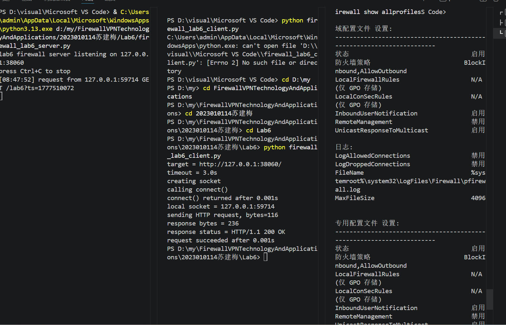
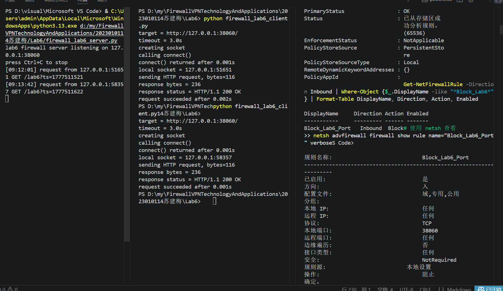
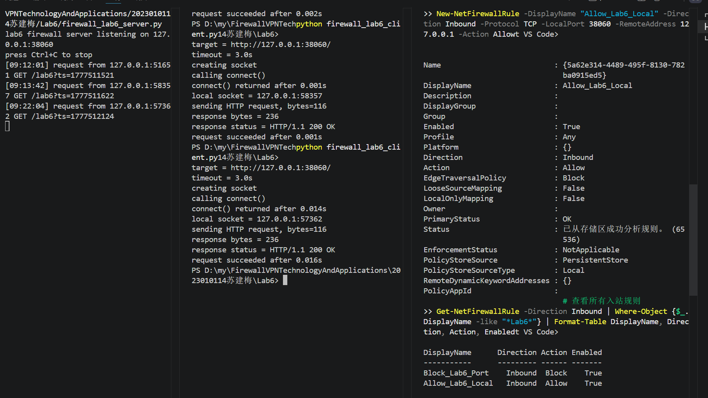
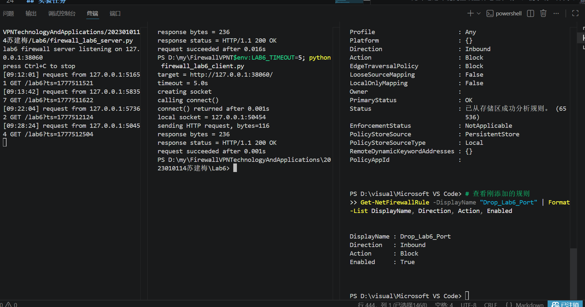
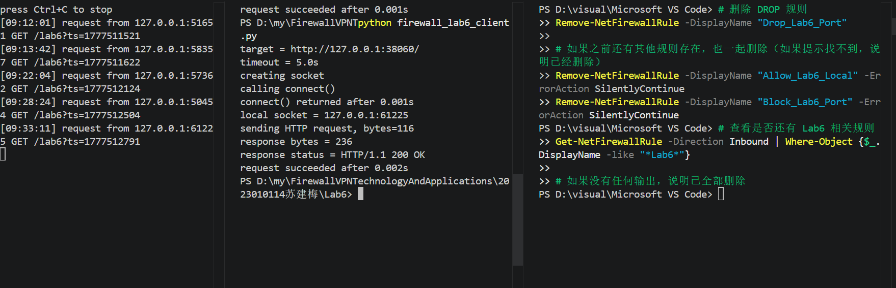

# Lab6：第一次写防火墙规则，做基础包过滤

## 实验背景

前面的实验已经让你看到一次网络通信里的 IP 地址、端口号、协议类型和连接状态。

从本次实验开始，我们正式进入防火墙规则配置。防火墙最基础的能力是**包过滤**：根据数据包里的字段决定放行还是拦截。

本实验重点观察以下内容：

1. 防火墙规则如何匹配协议、源地址和目的端口
2. `INPUT` 链为什么会影响别人访问本机服务
3. `ACCEPT`、`REJECT`、`DROP` 三种动作的现象差异
4. 规则顺序为什么会影响最终访问结果
5. 规则计数器如何帮助判断规则是否被命中
6. 为什么基础包过滤看的是 IP、端口、协议，而不是 HTTP 内容

> **环境说明**：推荐在 Ubuntu 虚拟机、WSL2 或其他 Linux 实验环境中完成。  
> macOS 和 Windows 本机没有相同的 `iptables` 实验环境。  
> 不要在真实服务器或已有安全策略的主机上随意清空防火墙规则。

---

## 实验任务

### 任务一：准备实验环境并完成首次访问

**第一步：准备好三个终端窗口**

整个实验建议同时打开三个终端：

- **终端 A**：运行 `firewall_lab6_server.py`
- **终端 B**：运行 `firewall_lab6_client.py`
- **终端 C**：查看和配置 `iptables` 规则

本实验默认使用端口 `38060`。正常情况下不要修改端口，后面的实验步骤都按默认端口编写。

**正常执行：使用默认端口 `38060`**

终端 A 运行服务端：

```bash
python3 firewall_lab6_server.py
```

终端 B 运行客户端：

```bash
python3 firewall_lab6_client.py
```

**特殊情况：端口 `38060` 被占用**

只有启动服务端时提示端口已被占用，才需要把端口改成其他值。例如改成 `38160` 时，服务端和客户端必须使用同一个端口。

终端 A 运行服务端：

```bash
LAB6_PORT=38160 python3 firewall_lab6_server.py
```

终端 B 运行客户端：

```bash
LAB6_PORT=38160 python3 firewall_lab6_client.py
```

命令说明：

| 部分 | 含义 |
| :--- | :--- |
| `LAB6_PORT=38160` | 只对本次命令临时设置环境变量，把实验端口改成 `38160` |
| `python3` | 使用 Python 3 解释器运行脚本 |
| `firewall_lab6_server.py` | 启动本实验提供的服务端脚本 |
| `firewall_lab6_client.py` | 启动本实验提供的客户端脚本 |

常见可选环境变量。没有端口冲突或特殊测试需求时，不需要使用这些环境变量：

| 环境变量 | 示例 | 作用 |
| :--- | :--- | :--- |
| `LAB6_PORT` | `LAB6_PORT=38160` | 修改服务端和客户端使用的端口 |
| `LAB6_HOST` | `LAB6_HOST=127.0.0.1` | 修改客户端连接目标或服务端监听地址 |
| `LAB6_TIMEOUT` | `LAB6_TIMEOUT=5` | 修改客户端等待超时时间 |

如果你使用了新端口，`iptables` 规则中的 `--dport 38060` 也要改成你的实际端口。

**第二步：在终端 C 查看当前 INPUT 规则**

```bash
sudo iptables -L INPUT -n -v --line-numbers
```

命令说明：

| 部分 | 含义 |
| :--- | :--- |
| `sudo` | 以管理员权限执行命令，查看和修改防火墙规则通常需要管理员权限 |
| `iptables` | Linux 上常用的防火墙规则管理命令 |
| `-L` | list，列出规则 |
| `INPUT` | 查看进入本机的流量对应的规则链 |
| `-n` | numeric，直接显示数字形式的 IP 和端口，不做域名反查，速度更快 |
| `-v` | verbose，显示更详细信息，包括 `pkts`、`bytes` 等计数器 |
| `--line-numbers` | 显示规则行号，便于确认规则顺序或按行号删除规则 |

常见可选参数和链：

| 写法 | 作用 |
| :--- | :--- |
| `iptables -L OUTPUT -n` | 查看本机发出流量的规则 |
| `iptables -L FORWARD -n` | 查看经过本机转发流量的规则，后续网关、DMZ、VPN 会用到 |
| `iptables -S INPUT` | 以更接近命令的格式显示 `INPUT` 链规则 |
| `iptables-save` | 导出当前全部规则，适合做完整备份或排错 |
| `iptables -t nat -L -n` | 查看 `nat` 表规则，后续 NAT 实验会用到 |

记录当前 `INPUT` 链的默认策略和已有规则。默认策略通常会显示在第一行，例如：

```text
Chain INPUT (policy ACCEPT)
```

其中 `policy ACCEPT` 表示：如果没有任何规则匹配，就默认放行。

**第三步：在终端 A 启动服务端**

```bash
python3 firewall_lab6_server.py
```

命令说明：

| 部分 | 含义 |
| :--- | :--- |
| `python3` | 使用 Python 3 运行脚本 |
| `firewall_lab6_server.py` | 本实验的 HTTP 服务端，默认监听 `127.0.0.1:38060` |

如果需要换端口，可以写成：

```bash
LAB6_PORT=38160 python3 firewall_lab6_server.py
```

看到类似输出后不要关闭终端 A：

```text
lab6 firewall server listening on 127.0.0.1:38060
```

**第四步：在终端 B 启动客户端**

```bash
python3 firewall_lab6_client.py
```

命令说明：

| 部分 | 含义 |
| :--- | :--- |
| `python3` | 使用 Python 3 运行脚本 |
| `firewall_lab6_client.py` | 本实验的客户端，默认访问 `127.0.0.1:38060` |

如果需要换目标或超时时间，可以写成：

```bash
LAB6_HOST=127.0.0.1 LAB6_PORT=38160 LAB6_TIMEOUT=5 python3 firewall_lab6_client.py
```

如果访问正常，客户端会显示 `request succeeded`，服务端终端也会打印收到请求的信息。

**第五步：填写下表**

| 项目 | 你的填写内容 |
| :--- | :----------- |
| 服务端监听地址 |	127.0.0.1 |
| 服务端监听端口 |	38060 |
| `INPUT` 链默认策略 |	Block |
| 首次访问是否成功 | 是|
| 客户端本地临时端口 | 	59714|
| 服务端是否收到请求 | 是|
| 客户端收到的响应首行 | HTTP/1.1 200 OK|

各项数值均可直接从终端输出读取：服务端监听信息在 `server listening on ...`，客户端本地端口在 `local socket = ...`，响应首行在 `response status = ...`。



---

### 任务二：添加 REJECT 规则并观察访问失败

**第一步：在终端 C 插入一条拒绝规则**

```bash
sudo iptables -I INPUT 1 -p tcp --dport 38060 -j REJECT
```

命令说明：

| 部分 | 含义 |
| :--- | :--- |
| `sudo` | 以管理员权限执行 |
| `iptables` | 修改 Linux 防火墙规则 |
| `-I INPUT 1` | insert，把规则插入到 `INPUT` 链第 1 行 |
| `-p tcp` | protocol，只匹配 TCP 协议 |
| `--dport 38060` | destination port，只匹配目的端口为 `38060` 的 TCP 包 |
| `-j REJECT` | jump，命中规则后执行 `REJECT`，拒绝并给对方返回错误 |

常见可选写法：

| 写法 | 作用 |
| :--- | :--- |
| `-A INPUT ...` | append，把规则追加到链尾；和 `-I` 相比，顺序可能不同 |
| `-s 192.168.1.10` | 只匹配某个源 IP |
| `-s 192.168.1.0/24` | 只匹配某个源网段 |
| `-d 127.0.0.1` | 只匹配某个目的 IP |
| `--sport 12345` | 匹配源端口，通常不如目的端口常用 |
| `-i lo` | 只匹配从指定入接口进入的流量，例如回环接口 `lo` |
| `-j ACCEPT` | 命中后放行 |
| `-j DROP` | 命中后直接丢弃，不回应 |
| `-j LOG` | 命中后写日志，通常还需要后续规则继续处理 |
| `-j REJECT --reject-with tcp-reset` | 对 TCP 连接用 RST 明确拒绝 |

这条规则的含义是：凡是进入本机、协议是 TCP、目的端口是 `38060` 的包，都拒绝。

**第二步：查看规则列表**

```bash
sudo iptables -L INPUT -n -v --line-numbers
```

确认 `REJECT` 规则出现在第 1 行。

**第三步：在终端 B 再次运行客户端**

```bash
python3 firewall_lab6_client.py
```

观察客户端是否很快失败，再观察终端 A 的服务端是否收到新的请求。

**第四步：再次查看规则计数器**

```bash
sudo iptables -L INPUT -n -v --line-numbers
```

如果规则被命中，`pkts` 或 `bytes` 计数一般会增加。

**第五步：填写下表**

| 项目 | 你的填写内容 |
| :--- | :----------- |
| 你添加的 `REJECT` 规则 |	Block TCP 38060 入站 |
| `REJECT` 规则位于第几行 |Inbound |
| 客户端失败提示 | request succeeded after 0.001s|
| 失败大约用了多久 | 	0.001s|
| 服务端是否收到请求 |是 |
| `REJECT` 规则计数器是否增加 |是 |

简答题：

1. 这条规则主要匹配了哪些字段？
答：这条规则主要匹配了协议（TCP）、方向（入站）和目的端口（38060）三个字段。


2. 为什么服务端没有收到请求，也能说明防火墙已经在更前面拦截了流量？
答：因为客户端访问失败且服务端没有任何日志输出，说明数据包在到达服务端之前就被丢弃了。如果防火墙规则在服务端之后或规则本身有漏洞，数据包会先到达服务端程序并产生日志，然后才被拒绝。但实验中服务端完全没收到任何连接请求，因此可以断定防火墙在同机器、同协议、同端口的更早处理阶段（即网络协议栈的 Netfilter 框架处理 INPUT 链时）成功拦截了流量。


3. `REJECT` 和“服务端程序没启动”在客户端现象上可能有什么相似之处？
答：两者在客户端表现出的现象很可能非常相似，甚至无法区分。
当服务端程序没有启动时，客户端尝试连接目标端口，操作系统协议栈会返回一个 RST 包或连接拒绝（Connection Refused）**的错误响应，客户端通常很快收到失败提示。
而当防火墙使用 `REJECT` 规则时，防火墙会主动向客户端返回一个拒绝包（如 ICMP 不可达或 TCP RST），客户端同样会立刻收到拒绝信息，提示连接失败。
因此，两者的共同点是：客户端都很快失败，不会等到超时，而且服务端都没有收到任何请求日志。如果仅从客户端提示“无法连接”来看，很难直接判断究竟是服务端没启动，还是被防火墙 `REJECT` 了。




---

### 任务三：添加 ACCEPT 规则并观察规则顺序

现在 `REJECT` 规则已经阻断了访问。接下来在它前面插入一条更具体的允许规则。

**第一步：在终端 C 插入允许规则**

```bash
sudo iptables -I INPUT 1 -p tcp -s 127.0.0.1 --dport 38060 -j ACCEPT
```

命令说明：

| 部分 | 含义 |
| :--- | :--- |
| `-I INPUT 1` | 插入到 `INPUT` 链第 1 行，让这条规则排在原来的 `REJECT` 前面 |
| `-p tcp` | 匹配 TCP 协议 |
| `-s 127.0.0.1` | source，只匹配源地址为 `127.0.0.1` 的流量 |
| `--dport 38060` | 只匹配目的端口为 `38060` 的流量 |
| `-j ACCEPT` | 命中后放行 |

常见可选写法：

| 写法 | 作用 |
| :--- | :--- |
| `-s 10.0.0.0/24` | 允许一个网段 |
| `-s 10.0.0.5` | 只允许一台主机 |
| `-d 10.0.0.10` | 限定目的地址 |
| `-i eth0` | 限定从某个网卡进入 |
| `-m comment --comment "allow lab6"` | 给规则加注释，便于排错和维护 |

这条规则的含义是：允许源地址为 `127.0.0.1`、目的端口为 `38060` 的 TCP 访问。

**第二步：查看规则顺序**

```bash
sudo iptables -L INPUT -n -v --line-numbers
```

此时应该能看到：

```text
1  ACCEPT  tcp  --  127.0.0.1  0.0.0.0/0  tcp dpt:38060
2  REJECT  tcp  --  0.0.0.0/0  0.0.0.0/0  tcp dpt:38060 reject-with ...
```

具体显示格式可能略有不同，但关键是 `ACCEPT` 在 `REJECT` 前面。

**第三步：在终端 B 再次运行客户端**

```bash
python3 firewall_lab6_client.py
```

观察访问是否恢复成功。然后再次查看计数器，判断命中的是哪一条规则。

**第四步：填写下表**

| 项目 | 你的填写内容 |
| :--- | :----------- |
| 你添加的 `ACCEPT` 规则 |Allow_Lab6_Local（Direction Inbound, Action Allow, Protocol TCP, LocalPort 38060, RemoteAddress 127.0.0.1） |
| `ACCEPT` 规则位于第几行 |Block_Lab6_Port 为第一条，Allow_Lab6_Local 为第二条） |
| `REJECT` 规则位于第几行 |Block_Lab6_Port（第一条） |
| 再次访问是否成功 |request succeeded after 0.016s + response status = HTTP/1.1 200 OK |
| 命中的是哪一条规则 |Allow_Lab6_Local |
| 你判断命中的依据 |客户端成功返回 200 OK，说明请求被允许规则放行，而非被阻止规则拦截 |

简答题：

1. 为什么同样存在 `REJECT` 规则，访问却恢复了？
答：因为防火墙规则是按顺序逐条匹配的，一旦匹配到一条规则就会立即执行该规则指定的动作，不再继续检查后续规则。当在原有的 `REJECT` 规则前面插入了一条更具体的 `ACCEPT` 规则（源地址为 127.0.0.1、目的端口为 38060）后，客户端的访问请求首先匹配到了这条允许规则，直接被放行，因此永远不会到达后面的拒绝规则，访问自然就恢复了。


2. 为什么防火墙规则顺序会影响最终结果？
答：因为防火墙规则是按顺序从上到下逐条匹配的，一旦匹配到某条规则就会立即执行该规则的指定动作（放行或拒绝），不再继续检查后续规则。所以如果拒绝规则排在前面，请求就会被直接拦截；如果更具体的允许规则排在拒绝规则前面，请求就会先被允许放行，永远不会到达后面的拒绝规则。规则顺序决定了匹配的先后次序，从而直接影响最终的访问结果。


3. 如果把 `REJECT` 放在 `ACCEPT` 前面，本次访问会发生什么？
答：如果 `REJECT` 规则放在 `ACCEPT` 规则前面，客户端的请求会先匹配到拒绝规则，直接被拦截并拒绝访问。由于防火墙按顺序逐条匹配，一旦命中 `REJECT` 规则就不再继续检查后面的 `ACCEPT` 规则，因此客户端的请求将无法到达服务端，访问会失败，服务端也不会收到任何请求日志。




---

### 任务四：对比 DROP 与 REJECT

`REJECT` 会明确拒绝访问，`DROP` 则是直接丢弃包，不给对方回应。下面观察两者在客户端现象上的差异。

**第一步：删除刚才添加的 ACCEPT 和 REJECT 规则**

```bash
sudo iptables -D INPUT -p tcp -s 127.0.0.1 --dport 38060 -j ACCEPT
sudo iptables -D INPUT -p tcp --dport 38060 -j REJECT
```

命令说明：

| 部分 | 含义 |
| :--- | :--- |
| `-D INPUT` | delete，从 `INPUT` 链删除一条规则 |
| 后面的匹配条件 | 必须和要删除的规则一致，否则可能提示规则不存在 |

也可以按行号删除，例如：

```bash
sudo iptables -D INPUT 1
```

按行号删除前一定要先执行 `sudo iptables -L INPUT -n --line-numbers` 确认行号，因为删除一条规则后，后面的行号会立刻变化。

删除后查看确认：

```bash
sudo iptables -L INPUT -n -v --line-numbers
```

**第二步：添加 DROP 规则**

```bash
sudo iptables -I INPUT 1 -p tcp --dport 38060 -j DROP
```

命令说明：

| 部分 | 含义 |
| :--- | :--- |
| `-I INPUT 1` | 插入到 `INPUT` 链第 1 行 |
| `-p tcp --dport 38060` | 匹配访问本机 `38060` 端口的 TCP 流量 |
| `-j DROP` | 命中后直接丢弃，不返回拒绝信息 |

**第三步：用 5 秒超时运行客户端**

```bash
LAB6_TIMEOUT=5 python3 firewall_lab6_client.py
```

命令说明：

| 部分 | 含义 |
| :--- | :--- |
| `LAB6_TIMEOUT=5` | 把客户端等待超时时间设为 5 秒 |
| `python3 firewall_lab6_client.py` | 运行客户端脚本 |

这里设置较短超时，是为了观察 `DROP` 造成的等待现象，同时避免客户端一直卡住。

观察客户端是否等待一段时间后才失败。再观察服务端是否收到请求。

**第四步：查看 DROP 规则计数器**

```bash
sudo iptables -L INPUT -n -v --line-numbers
```

**第五步：填写下表**

| 项目 | 你的填写内容 |
| :--- | :----------- |
| 你添加的 `DROP` 规则 |Drop_Lab6_Port（Block TCP 38060 入站） |
| 使用 `REJECT` 时客户端失败现象 | 	立即收到连接失败提示|
| 使用 `DROP` 时客户端失败现象 |0.016s |
| `DROP` 是否比 `REJECT` 等待更久 |无法比较（规则未生效） |
| 服务端是否收到请求 |是|
| `DROP` 规则计数器是否增加 |否 |

简答题：

1. `REJECT` 和 `DROP` 都能阻断访问，为什么客户端看到的现象不同？
答：因为 `REJECT` 和 `DROP` 在拒绝流量时对客户端的回应方式不同。
`REJECT` 会主动向客户端返回一个明确的拒绝信息，比如 TCP RST 包或 ICMP 不可达包，客户端收到后立即知道连接被拒绝，所以很快失败。
`DROP` 则直接丢弃数据包，不返回任何回应。客户端发送请求后收不到任何响应，只能等待超时，直到超时时间耗尽才知道连接失败。
因此，`REJECT` 表现为快速失败，而 `DROP` 表现为长时间等待后超时失败。


2. 如果你是网络管理员，排错时哪一种动作更容易判断问题？为什么？
答：REJECT 更容易判断问题。
因为 REJECT 会明确返回拒绝信息（如 TCP RST 或 ICMP 不可达），网络管理员使用 ping、telnet 或 curl 测试时能立即收到回馈，快速定位到防火墙规则导致的阻断。而 DROP 只会让连接卡住直到超时，管理员很难区分是网络延迟、链路中断、服务器宕机还是防火墙丢弃，需要逐一排查才能确定问题根源。


3. 如果你是攻击者，`DROP` 可能会让扫描结果变得更不明确，原因是什么？
答：因为 `DROP` 不会给攻击者任何回应，攻击者发送探测包后收不到任何反馈，无法区分目标端口是被防火墙丢弃、主机不存在还是网络不通。而 `REJECT` 会明确返回拒绝信息，攻击者能立即知道目标主机存在且端口被防火墙规则阻断，从而确认目标是存活且可达的。所以 `DROP` 会增加攻击者的探测难度和扫描时间，迫使攻击者等待超时才能做出判断。




---

### 任务五：清理规则并恢复访问

实验结束前必须清理本次添加的规则，避免影响后续实验。

**第一步：删除 DROP 规则**

```bash
sudo iptables -D INPUT -p tcp --dport 38060 -j DROP
```

如果你前面某一步失败，导致 `ACCEPT` 或 `REJECT` 规则仍然存在，也一起删除：

```bash
sudo iptables -D INPUT -p tcp -s 127.0.0.1 --dport 38060 -j ACCEPT
sudo iptables -D INPUT -p tcp --dport 38060 -j REJECT
```

如果提示规则不存在，说明对应规则已经被删除，可以继续下一步。

**第二步：查看最终规则**

```bash
sudo iptables -L INPUT -n -v --line-numbers
```

确认本次实验添加的 `ACCEPT`、`REJECT`、`DROP` 规则都已经消失。

**第三步：再次运行客户端验证访问恢复**

```bash
python3 firewall_lab6_client.py
```

**第四步：填写下表**

| 项目 | 你的填写内容 |
| :--- | :----------- |
| 是否已删除 `ACCEPT` 规则 |是 |
| 是否已删除 `REJECT` 规则 | 是|
| 是否已删除 `DROP` 规则 | 是|
| 清理后访问是否恢复成功 | 是|
| 最终 `INPUT` 链默认策略 |Block |



---

## 问答题

1. 本实验中的包过滤规则主要匹配了哪些字段？
答：本实验中的包过滤规则主要匹配了协议类型（TCP）、方向（入站）、目的端口（38060），以及在 ACCEPT 规则中额外匹配了源地址（127.0.0.1）。


2. 为什么说本实验实现的是“包过滤”，而不是“应用层代理”？
答：因为本实验的防火墙规则只检查网络层（IP地址）和传输层（协议类型、端口号）的字段，根据这些信息直接决定允许或拒绝数据包，并没有对应用层数据（如 HTTP 请求的具体内容、URL、参数等）进行解析或转发。而应用层代理会在应用层完整接收客户端的请求，再代表客户端向服务端发起新的连接，能够检查和修改应用层数据。本实验中的 iptables 规则工作在更底层的网络协议栈，不涉及应用层处理，因此属于包过滤防火墙。


3. `INPUT`、`OUTPUT`、`FORWARD` 分别对应什么方向的流量？
答：`INPUT` 链对应进入本机的流量，即目标地址是本机的数据包；`OUTPUT` 链对应本机发出的流量，即源地址是本机的数据包；`FORWARD` 链对应经过本机转发的流量，即本机作为路由器转发给其他主机的数据包，而不是发给本机自身的。


4. 为什么本实验主要操作 `INPUT` 链，而不是 `FORWARD` 链？
答：因为本实验中的客户端和服务端程序都运行在同一台机器上，通信流量是通过本地回环地址 `127.0.0.1` 直接进入本机进程，属于发往本机自身的流量，因此对应 `INPUT` 链。而 `FORWARD` 链用于控制经过本机转发给其他主机的流量，本实验不涉及多台主机之间的转发场景，所以只需要操作 `INPUT` 链。


5. `ACCEPT`、`REJECT`、`DROP` 三种动作的区别是什么？
答：ACCEPT 表示允许数据包通过，访问正常进行。REJECT 表示拒绝数据包，并主动向发送方返回一个明确的拒绝信息（如 TCP RST 或 ICMP 不可达），客户端会立即收到连接失败的通知。DROP 表示直接丢弃数据包，不返回任何回应，客户端只能等待超时后才能确认连接失败。


6. 为什么规则顺序会影响最终结果？
答：因为防火墙规则是按顺序逐条匹配的，一旦数据包匹配到某条规则，就会立即执行该规则指定的动作（如 ACCEPT、REJECT、DROP），不再继续检查后续规则。所以如果拒绝规则排在允许规则前面，数据包会被先拒绝而无法到达允许规则；反之，如果允许规则排在前面，数据包就会被先放行。规则顺序决定了匹配的优先级，从而直接影响最终结果。

7. 规则计数器在排错时有什么用？
答：规则计数器可以显示每条规则匹配到的数据包数量和字节数。在排错时，如果某条规则应该生效但访问失败，可以查看该规则的计数器是否增加，从而判断数据包是否真正命中了这条规则。如果计数器没有变化，说明规则未被命中，可能是规则顺序有问题，或者匹配条件设置错误；如果计数器增加了但访问仍然异常，说明规则本身可能存在问题。计数器帮助管理员快速定位规则是否实际生效，避免盲目修改配置。


8. 真实环境中为什么常常采用“默认拒绝，再按需放行”的策略？
答：真实环境中采用“默认拒绝，再按需放行”的策略，是为了遵循最小权限原则。默认拒绝可以阻止所有未明确允许的流量，减少攻击面，避免因遗漏配置或未知漏洞导致的安全风险。按需放行则只开放业务必需的端口和服务，使防火墙规则更加清晰可控。这种策略能够有效降低误放行恶意流量的可能性，提高系统的整体安全性。


9. 只靠本实验这种基础包过滤规则，还无法解决哪些更复杂的安全问题？
答：只靠本实验这种基于IP地址、协议类型和端口号的基础包过滤规则，无法解决以下更复杂的安全问题：
第一，无法检测应用层攻击，比如SQL注入、跨站脚本攻击、恶意代码上传等，因为这些攻击隐藏在看似正常的HTTP请求中，需要深度解析应用层协议才能发现。
第二，无法识别加密流量中的恶意行为，因为HTTPS等加密流量传输时内容不可见，包过滤只能看到IP和端口，无法检查解密后的数据。
第三，无法防御DDoS攻击，因为攻击流量可能来自合法IP地址和端口，包过滤无法区分正常请求和攻击请求。
第四，无法进行状态检测，比如检测TCP连接是否属于已建立的合法连接，或者防御TCP半开连接攻击。
第五，无法基于用户身份或行为进行访问控制，比如区分不同用户是否经过认证授权。
第六，无法防御应用层协议滥用，比如通过HTTP隧道传输非协议流量。
解决这些问题需要结合应用层防火墙、入侵检测系统、入侵防御系统、Web应用防火墙等更高级的安全技术。


---

## 截图要求

- 截图须清晰，终端文字可读。
- 所有截图与本 `Lab6.md` 放在同一目录下。
- 命名规范如下：

| 截图内容 | 文件名 |
| :------- | :----- |
| 服务端、客户端首次访问成功 | `run.png` |
| `REJECT` 规则阻断访问 | `blocked.png` |
| `ACCEPT` 规则恢复访问，并能看到规则顺序 | `allowed.png` |
| `DROP` 访问超时与规则计数器 | `drop_counter.png` |
| 清理规则后访问恢复 | `cleanup.png` |

具体要求：

1. `run.png`：至少能看到服务端 `server listening on ...`、客户端 `request succeeded`、客户端 `local socket = ...`。
2. `blocked.png`：至少能看到 `REJECT` 规则和客户端失败提示。
3. `allowed.png`：至少能看到 `ACCEPT` 位于 `REJECT` 前面，以及客户端访问恢复成功。
4. `drop_counter.png`：至少能看到 `DROP` 规则、客户端超时失败现象和规则计数器。
5. `cleanup.png`：至少能看到实验规则已删除，并且客户端访问恢复成功。

---

## 提交要求

在自己的文件夹下新建 `Lab6/` 目录，提交以下文件：

```text
学号姓名/
└── Lab6/
    ├── Lab6.md
    ├── run.png
    ├── blocked.png
    ├── allowed.png
    ├── drop_counter.png
    └── cleanup.png
```

---

## 截止时间

2026-05-07，届时关于 `Lab6` 的 PR 将不会被合并。

