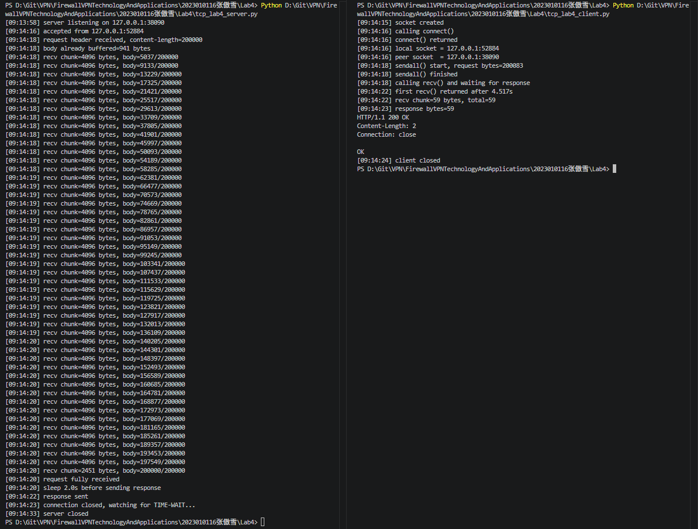
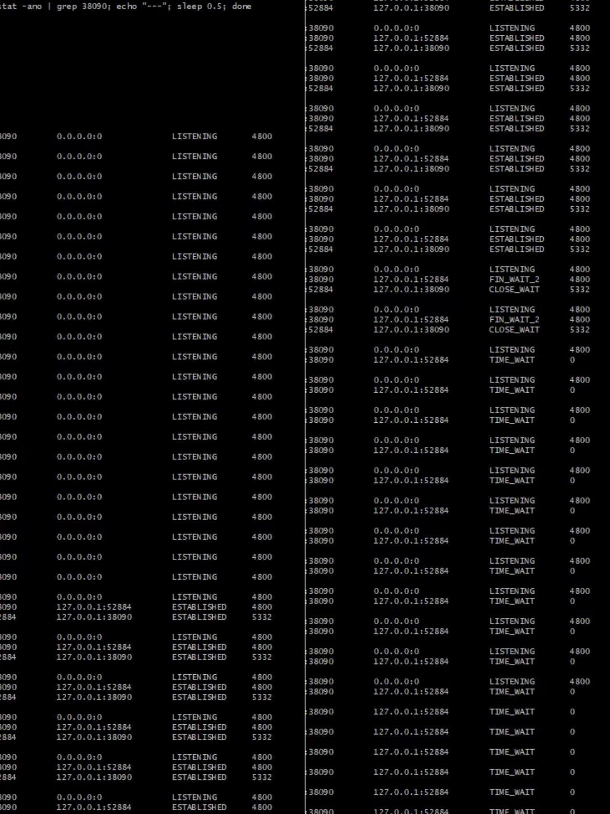
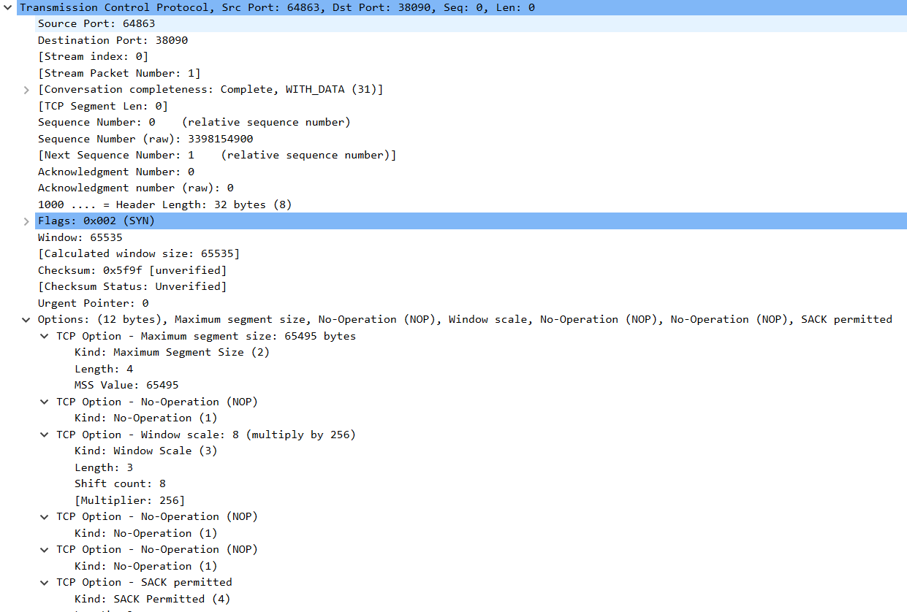
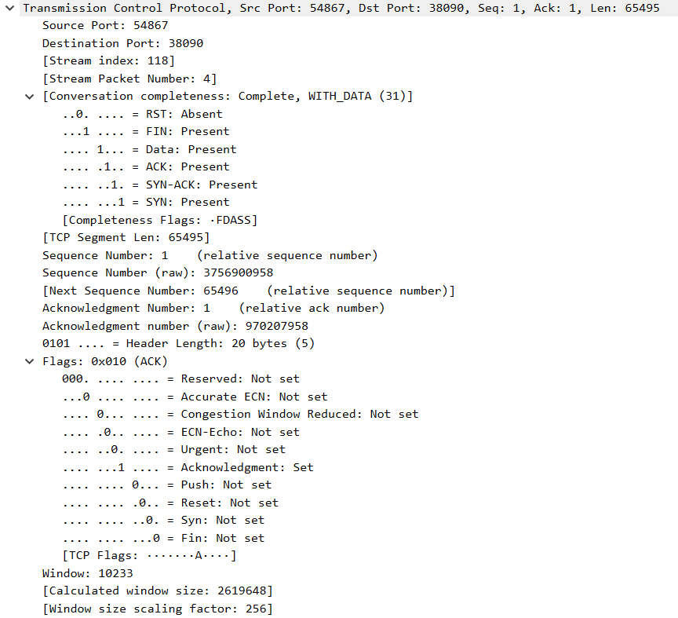
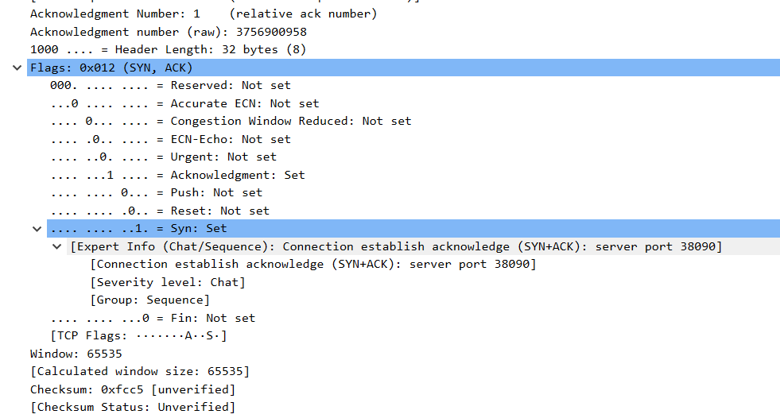
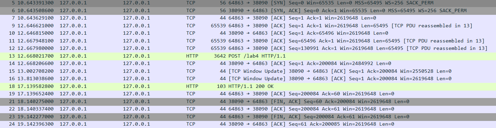

# Lab4：看见TCP 我不怕不怕啦

## 实验背景

本实验围绕一条 TCP 连接的完整生命周期展开，重点观察以下内容：

1. `socket()`、`listen()`、`accept()`、`connect()` 的职责区别
2. "连接"为什么本质上是交换控制信息而不是物理连线
3. TCP 头部中的端口号、序号、ACK 号、标志位、窗口、头部长度、可选字段
4. 三次握手如何建立收发准备
5. 应用层大块数据如何被 TCP 按 MSS 拆分
6. `Sequence Number` 与 `Acknowledgment Number` 如何配合工作
7. `recv()` 为什么会阻塞等待数据
8. 接收窗口如何反映接收方处理能力
9. ACK 与窗口更新为什么常常会被合并
10. `FIN` / `ACK` 如何完成断开
11. 为什么连接结束后套接字不会立刻删除

---

## 实验任务

### 任务一：准备实验环境并记录运行信息

**第一步：准备好四个窗口**

整个实验需要同时观察多个界面，建议在开始前把窗口布局摆好：

- **终端 A**：运行服务端
- **终端 B**：运行客户端
- **终端 C**：持续监控套接字状态（全程保持开启，不要关）
- **Wireshark**：抓包

**第二步：在终端 C 里启动持续监控**

TCP 状态变化很快，等你手动敲完 `ss` 命令再回车，状态可能已经过去了。用下面的命令让终端 C 每 0.5 秒自动刷新一次，之后只需要盯着这个窗口就行：

```bash
# Linux
watch -n 0.5 'ss -tan | grep 38090'

# macOS（没有 watch，用循环代替）
while true; do netstat -an | grep 38090; echo "---"; sleep 0.5; done

# Windows（Git Bash执行）
while true; do netstat -ano | grep 38090; echo "---"; sleep 0.5; done
```

如果你换了端口，把 `38090` 替换成实际端口。

**第三步：打开 Wireshark，选回环接口，填好过滤器，开始抓包**

回环接口在不同系统里名字不同：

| 系统 | 接口名 |
|:-----|:-------|
| Linux | `lo` |
| macOS | `lo0` |
| Windows | `Adapter for loopback traffic capture`（需提前安装 Npcap 并勾选回环支持） |

在显示过滤器里输入：

```text
tcp.port == 38090
```

然后点击开始抓包（蓝色鲨鱼鳍图标）。**先开始抓包，再运行脚本**，否则握手包会被漏掉。

**第四步：启动脚本**

```bash
# 终端 A
python3 tcp_lab4_server.py

# 终端 B（等服务端打印出 server listening on ... 后再运行）
python3 tcp_lab4_client.py
```

如果 `38090` 已被占用，两端都加环境变量换端口，同时记得把 Wireshark 过滤器和终端 C 里的端口号也改掉：

```bash
LAB4_PORT=38123 python3 tcp_lab4_server.py
LAB4_PORT=38123 python3 tcp_lab4_client.py
```

**第五步：填写下表**

| 项目                                | 你的填写内容 |
| :---------------------------------- | :----------- |
| 服务端监听地址                      | 127.0.0.1           |
| 服务端监听端口                      | 38090               |
| 客户端本地临时端口                  |  52884              |
| 客户端请求总字节数                  |   200083            |
| 服务端响应内容                      |  HTTP/1.1 200 0K    |
| 客户端 `connect()` 返回前后的时间点 |[09:14:16] calling connect() [09:14:16] connect() returned |
| 客户端首次收到响应前等待了多久      |  4.517S            |

各项数值均可直接从终端输出读取：服务端监听信息在 `server listening on ...`，客户端本地端口在 `local socket = ...`，请求字节数在 `sendall() start, request bytes=...`，等待时间在 `first recv() returned after ...s`。



---

### 任务二：观察套接字创建与连接建立

1. 服务端启动后，观察终端 C 出现 `LISTEN` 状态，截图留存。
2. 在终端 B 里启动客户端，观察它依次打印 `socket created`、`calling connect()`、`connect() returned`。
3. 客户端打印 `connect() returned` 之后，观察终端 C 出现 `ESTABLISHED`，截图留存。脚本在 `connect()` 返回后有 2 秒停顿，这段时间足够截图。

填写下表：

| 阶段                             | 你的填写内容 |
| :------------------------------- | :----------- |
| 服务端启动、客户端未连入时的状态 |  LISTENING     |
| `connect()` 返回后服务端状态     | ESTABLISHED   |
| `connect()` 返回后客户端状态     | ESTABLISHED    |

简答题：

1. 服务端在客户端连接前为什么处于 `LISTEN`？
答：为了被动等待客户端的连接请求，表示服务端已准备好接受连接，但尚未与任何客户端建立连接


2. 为什么这时还没有真正建立 TCP 连接？
答：因为 TCP 连接需要三次握手来同步双方的状态和序号，LISTEN 只是准备工作，握手还没开始


3. `socket()` 与 `connect()` 的区别是什么？
答：ocket()：创建一个套接字（相当于拿一部电话机），connect()：主动向服务端发起连接（相当于拨号并完成握手建立通话）


4. 为什么 `connect()` 返回后才进入可稳定收发数据的状态？
答：因为 connect() 返回时，三次握手已经完成，双方都确认对方已就绪，可以安全地发送数据


5. 为什么"网线一直连着"不等于"TCP 连接已经建立"？
答：网线是物理层的通路，TCP 连接是传输层的逻辑状态。即使网线连着，如果没有经过三次握手，操作系统内核对这个连接一无所知，无法传输数据


6. 这里的"连接"更准确地说是在做什么？
答：在双方内核中为这次通信分配资源（缓冲区、序号等），并同步状态，形成一个可以双向可靠传输数据的逻辑通道




---

### 任务三：观察三次握手与 TCP 头部字段

**定位握手包**：在 Wireshark 过滤器里输入下面的条件，可以屏蔽中间的数据包，只留下握手和断开阶段的控制包：

```text
tcp.port == 38090 && (tcp.flags.syn == 1 || tcp.flags.fin == 1)
```

包列表最前面的三个包就是三次握手（SYN → SYN-ACK → ACK）。

**找到各字段的位置**：点击某个握手包，在下方详情栏展开 `Transmission Control Protocol`。源端口、目的端口、Seq、Ack、Flags、Window、Header Length 都在这里。TCP 选项在最底部的 `Options` 子项里，展开后可以看到 MSS、Window Scale、SACK Permitted，注意这三项只出现在带 SYN 标志的包里，纯 ACK 包里没有。

**关于序号显示**：Wireshark 默认开启相对序号，会把每个方向的初始序号归零显示，所以 SYN 包的 Seq 看起来是 `0`，而不是真实的随机大数。这是正常现象，实验报告按 Wireshark 显示的值填写即可。如果你想看真实值，可以去 `Edit → Preferences → Protocols → TCP` 里取消勾选 `Relative sequence numbers`。

填写下表：

| 报文       | 源端口 | 目的端口 | Seq  | Ack  | Flags | Window | Header Length |
| :--------- | :----- | :------- | :--- | :--- | :---- | :----- | :------------ |
| 第一次握手 |52884   |38090      |  0   |  无   | 0x0002 | 65535 |32bytes(8)    |
| 第二次握手 |38090   |52884      |  0   | 1     | 0x0012 | 65535 |32bytes(8)   |
| 第三次握手 |38090   |52884      |60    | 200084 |0x0011 | 10233 | 20bytes(5)   |

第一次握手（SYN）的 Ack 字段在 Wireshark 里通常显示为空或 `0`，这是正常的，因为此时客户端还没有收到服务端的任何数据。Header Length 在没有选项时是 20 字节，握手包因为携带了 MSS 等选项通常是 28 或 32 字节。

| TCP 选项       | 你的填写内容 |
| :------------- | :----------- |
| MSS            |  65495            |
| Window Scale   | 8 (multiply by 256)  |
| SACK Permitted | Kind: SACK Permitted (4) Length: 2|

回环接口的 MSS 通常是 65495（因为回环 MTU 是 65536，比以太网的 1500 大得多），这会影响后续任务五里是否能观察到分段。

简答题：

1. 发送方和接收方端口号在连接阶段的作用是什么？
答：唯一标识通信双方的应用进程。IP 地址找到主机，端口号找到主机上的具体进程（如 Web 服务、客户端程序），两者组合（套接字）才能唯一确定一条连接


2. TCP 头部如何帮助找到目标套接字？
答：通过头部中的源端口和目的端口两个字段。操作系统收到报文后，提取这两个端口号，加上 IP 头中的源 IP 和目的 IP，就能唯一匹配到本机上的某个套接字，从而把数据交给正确的应用程序


3. 为什么初始序号不是简单固定从 1 开始？
答：防止旧连接的数据包干扰新连接。如果每次从 1 开始，上次连接滞留在网络中的延迟包（比如 SEQ=100）到达新连接时，可能会被错误接收。随机初始序号能大大降低这种风险，提高安全性


4. 为什么 TCP 可选字段更容易在连接阶段看到？
答：因为连接阶段的报文（SYN、SYN+ACK）头部空间充足（通常 20 字节固定头 + 最多 40 字节选项），可以携带 MSS、窗口缩放、SACK 等协商参数。而数据传输阶段的报文往往没有或只有很少选项，因为协商已在连接阶段完成，不需要重复发送



---

### 任务四：区分头部中的控制信息和套接字中的控制信息

用以下过滤器分别找到两类报文：

```text
# 纯控制报文（无应用数据）
tcp.port == 38090 && tcp.len == 0

# 携带应用数据的报文
tcp.port == 38090 && tcp.len > 0
```

从纯控制报文里选一个（SYN、纯 ACK 或 FIN-ACK 都可以），从数据报文里选一个（客户端发请求或服务端发响应的包）。

填写下表：

| 项目                   | 你的填写内容 |
| :--------------------- | :----------- |
| 纯控制报文的类型       |SYN+ACK       |
| 携带应用数据的报文类型 |客户端数据发送（ACK + PSH + Data）|
| 头部中的控制信息举例   |SYN=1, ACK=1  |
| 套接字中的控制信息举例 |Window: 65535  MSS: 65495 |

简答题：

1. 为什么"头部中的控制信息"和"套接字中的控制信息"不是同一件事？
答：“头部中的控制信息”是“信”，是放在信封表面的公开指令；而“套接字中的控制信息”是“账本”，是双方各自在本地偷偷记录的内部状态。


---

### 任务五：观察数据分段、序号与 ACK

客户端发送的请求体是 200000 字节，超过了回环接口 MSS（约 65495 字节），因此应该可以在 Wireshark 里看到多个连续的数据段。用下面的过滤器找到客户端发出的数据包：

```text
tcp.srcport != 38090 && tcp.port == 38090 && tcp.len > 0
```

在包列表里连续选几个数据段，对比它们的 Seq 值。相邻两段的关系是：后一段的 Seq = 前一段的 Seq + 前一段的 TCP Segment Len。

找服务端返回给客户端的纯 ACK 报文：

```text
tcp.srcport == 38090 && tcp.flags.ack == 1 && tcp.len == 0
```

填写下表：

| 数据段  | Seq  | Ack  | TCP Segment Len | Flags |
| :------ | :--- | :--- | :-------------- | :---- |
| 第 1 段 |1     |1      |65495           |0x010(ACK) |
| 第 2 段 |65496 |1     |65495            |0x010(ACK) |
| 第 3 段 |130991|1     |65495            |0X010(ACK) |

| ACK 报文 | Ack Number | Flags | Window |
| :------- | :--------- | :---- | :----- |
| 第 1 个  |1 |0x012(SYN,ACK)  |65535    |
| 第 2 个  |65496 |0X010(ACK)  |10233    |
| 第 3 个  |200084|0X010(ACK)  |9707     |

| 项目                         | 你的填写内容 |
| :--------------------------- | :----------- |
| 是否发生分段                 | 否(Len=MSS)   |
| 握手中观察到的 MSS           |65495          |
| 单段长度与 MSS 的关系        |Len = MSS=65495 |
| ACK 号大致确认到了第几个字节 |第65495个字节    |

简答题：

1. 应用程序是否直接决定每个网络包的数据长度？为什么？
答：不直接决定。应用程序调用 send() 时只是把数据交给操作系统内核，内核中的 TCP 协议栈会根据 MSS（最大段长度）、发送窗口等因素，自动决定把数据切分成多大的 TCP 段再交给 IP 层发送


2. 大块应用数据为什么会被拆分？
答：因为链路层有 MTU（最大传输单元） 限制（通常 1500 字节）。超过 MTU 的数据包会被 IP 层分片，分片会降低效率且增加风险。TCP 为了避免 IP 分片，在传输层就把数据拆成小于等于 MSS 的段，保证每个 IP 包不超过 MTU


3. `MSS` 与 `MTU` 的关系是什么？
答：MSS = MTU - IP头部(20) - TCP头部(20)


4. "一次 `sendall()`"与"一个 TCP 包"之间是什么关系？
答：没有固定的一对一关系。一次 sendall(200KB) 可能被拆成多个 TCP 包发送（每个 ≤ MSS）；反之，多次小的 send() 也可能被合并成一个 TCP 包发送（Nagle 算法）。应用层的一次调用和传输层的包之间是多对多的关系


5. 为什么 ACK 体现的是累计确认？
答：因为 TCP 头部只有一个 Acknowledgment Number 字段，它表示该序号之前的所有字节都已收到。这样设计可以节省头部空间，避免为每个包单独确认，同时简化丢包恢复（只需记住第一个丢失的序号）


6. 如果中间某一段丢失，ACK 会出现什么变化？
答：ACK 会卡在丢失段的前一个位置，不断重复确认已收到的最后一个连续字节。例如发送了 1、2、3 三段，第 2 段丢失，接收方收到第 3 段时会发现前面缺了第 2 段，于是重复发送 Ack=2（期望第 2 段）。发送方收到 3 个重复 ACK 后就会快速重传丢失的第 2 段





---

### 任务六：观察 `recv()` 阻塞与窗口字段

`recv()` 的等待时间直接从客户端终端读取，`calling recv() and waiting for response` 到 `first recv() returned after ...s` 之间就是等待时长，脚本已经帮你计算好了。

在 Wireshark 里找窗口值：用过滤器 `tcp.port == 38090 && tcp.flags.ack == 1` 列出所有 ACK 包，点击其中一个，在详情栏 `Transmission Control Protocol` 里找 `Window` 字段。如果同时显示了 `Calculated window size`，优先看这个值，它已经把 Window Scale 的缩放算进去了，是对方实际能接收的字节数。

如果包列表的 Info 列出现了 `[TCP Window Update]` 标注，说明这个包的主要目的是通知对方窗口变化，重点观察它的 `Window` 字段。

填写下表：

| 项目                                   | 你的填写内容 |
| :------------------------------------- | :----------- |
| 客户端开始调用 `recv()` 的时间         | 10:12:25      |
| 客户端第一次收到响应的时间             |10:12:30       |
| `recv()` 是否立刻返回                  | 否             |
| 首次收到响应前等待了多久               |4.493s              |
| `recv()` 等待期间连接是否已经建立      |是              |
| 第 1 个 ACK 报文的窗口值               |2619648         |
| 第 2 个 ACK 报文的窗口值               |2484992          |
| 第 3 个 ACK 报文的窗口值               |2550528          |
| 窗口值是否变化                         |是              |
| 若变化，变化趋势                       |先降后升         |
| ACK 与窗口更新是否可以出现在同一个包中 |可以(15,16)       |
| 是否看到 RTT 或 ACK 往返时间相关信息   |可以              |

简答题：

1. "连接建立"和"应用收到数据"之间是什么关系？
答：连接建立是应用收到数据的必要前提。必须先完成三次握手，双方内核中建立好套接字状态、分配好缓冲区，应用程序才能通过 recv() 收到对方发来的数据


2. 为什么说 `read` / `recv` 在数据未到达时会被挂起？
答：因为 recv() 默认是阻塞模式。当接收缓冲区为空时，内核会让该进程进入睡眠状态（挂起），直到新数据到达内核缓冲区并唤醒它。如果不想阻塞，可以用 O_NONBLOCK 设置非阻塞模式


3. 窗口字段反映了接收方哪方面的能力？
答：反映了接收方可用接收缓冲区的大小。它告诉发送方：“我的应用层还没取走多少数据，你还能再发多少字节而不会撑爆我的缓冲区。”


4. 为什么发送方不能无限制连续发送数据？
答:因为有两个限制：
接收方窗口：对方缓冲区满了就会丢包。
拥塞窗口（cwnd）：防止网络中间设备（路由器）过载。
发送窗口 = min(接收方窗口, 拥塞窗口)


5. 滑动窗口为什么既提高效率又避免压垮接收方？
答：提高效率：允许发送方在等待一个 ACK 期间连续发多个包，而不必停等；避免压垮接收方：发送总量受接收方窗口限制，确保不会超过对方缓冲区的处理能力。


---

### 任务七：观察响应返回与双向 `seq/ack`

TCP 的 Seq/Ack 是双向独立的，客户端有自己的发送序号，服务端有自己的发送序号。用下面的过滤器只看服务端发出的数据包（源端口是 38090，有应用数据）：

```text
tcp.srcport == 38090 && tcp.len > 0
```

紧跟在服务端数据包后面的、客户端发出的 ACK 包，其 Ack Number 确认的就是服务端的发送序号。

填写下表：

| 项目                     | 你的填写内容 |
| :----------------------- | :----------- |
| 服务端响应数据报文的 Seq |1              |
| 服务端响应数据报文的 Ack |200084         |
| 客户端确认报文的 Ack     |1              |

简答题：

1. 为什么 TCP 的 `seq/ack` 是双向分别计算的？
答：因为 TCP 是全双工通信，两个方向的数据流独立。发送方需要序号来追踪自己发了多少数据，接收方需要确认号来告诉对方自己收到了多少。每条数据流都有自己的序号空间和确认机制，互不干扰


2. 为什么双方都需要各自的初始序号？
答：因为两个方向的数据传输是独立且可能同时发生的。服务端要发送数据给客户端，必须有自己独立的序号空间；客户端要发送数据给服务端，也要有自己的序号空间。各自随机选择初始序号，还能防止旧连接的残留包干扰新连接


3. 为什么发送应用数据时报文通常仍然带 `ACK`？
答：因为 TCP 协议允许 捎带确认（Piggybacking）。数据报文在发送应用数据的同时，可以顺便把对对方数据的确认（ACK）也放进去，这样节省了一个单独的 ACK 包，提高了网络利用率。所以数据报文的 ACK 标志位通常也是 1


---

### 任务八：观察连接断开与套接字延迟删除

用下面的过滤器精确定位所有带 FIN 的包：

```text
tcp.port == 38090 && tcp.flags.fin == 1
```

通常会看到两个 FIN 包（双方各一个）。看第一个 FIN 包的源端口，就能判断谁先发起断开。

**关于 TIME-WAIT**：TIME-WAIT 只出现在主动发起关闭的一方（先发 FIN 的那端）。服务端脚本在 `conn.close()` 之后会继续运行 10 秒再退出，这段时间可以在终端 C 里观察 TIME-WAIT。Linux 上 TIME-WAIT 通常持续约 60 秒，macOS 上可能较短，如果没有观察到请如实说明。

填写下表：

| 项目                                    | 你的填写内容 |
| :-------------------------------------- | :----------- |
| 谁先发送 FIN                            |服务端(38090)  |
| 关闭阶段共观察到几个带 FIN 的报文       | 2个             |
| 最终 ACK 是否可见                       |是              |
| 关闭后是否观察到 `TIME-WAIT` 或等价现象 |  是            |

简答题：

1. 为什么关闭连接不能只发一个结束通知？
答：因为 TCP 是全双工通信，两个方向的数据流是独立的。一个 FIN 只表示自己不会再发送数据，但对方可能还有数据要发。所以需要双方各自发送自己的 FIN，才能完整关闭两个方向


2. 为什么连接结束后套接字不会立刻删除？
答：因为需要等待 2MSL（最大报文生存时间），防止最后一个 ACK 丢失导致对方重传 FIN。如果立即删除套接字，收到对方重传的 FIN 时已经没有套接字可响应，对方会一直收不到 ACK 而无法正常关闭


3. 如果最后一个 ACK 丢失，而旧套接字已经立刻删除，可能带来什么问题？
答：对方收不到 ACK，会反复重传 FIN，永远无法进入关闭状态。
如果旧套接字被立即删除且端口号被新连接重用，对方重传的 FIN 可能会错误地到达新连接，导致新连接被意外关闭。这就是为什么 TIME-WAIT 状态必须等待 2MSL 的原因




---

## 问答题

1. TCP 的"连接"到底意味着什么？它为什么不是"把网线连上"？
答：TCP 的"连接"是传输层的逻辑状态，是双方内核中为通信分配的资源（缓冲区、序号、窗口等）的集合，而不是物理线路。网线只是物理层通路，没有三次握手和状态同步，即使网线连着，双方也无法传输数据


2. 三次握手为什么能让双方进入可通信状态？
答：因为三次握手完成了三件关键事情：
同步初始序号（双方知道对方从哪个序号开始发）
交换窗口大小（知道对方能收多少）
确认对方在线且愿意通信
之后才能确保双方可以安全地收发数据


3. TCP 头部中的控制字段如何支撑收发数据？
答：SEQ：标记数据的位置，支持乱序重组和丢包检测
ACK：告知对方已收到哪些数据（累计确认）
Window：告知对方我还有多少缓冲区空间
SYN/FIN：建立/关闭连接的控制信号
PSH：催促接收方立即将数据交给应用层


4. ACK、窗口、等待时间为什么会共同影响 TCP 的可靠传输？
答：ACK：确认对方已收到，没有 ACK 就重传
窗口：限制发送速率，防止接收方被压垮
等待时间（RTO）：判断是否丢包，触发重传
三者配合：窗口控制流量，ACK 反馈状态，RTO 兜底丢包，共同实现可靠传输。


5. 断开连接为什么仍然需要严格的控制信息交换？
答：因为需要确保双方都完成了数据发送。如果一方突然关闭，对方可能还有未发送完的数据。四次挥手让双方有机会告诉对方“我没数据要发了”，并确认对方也同意关闭，避免数据丢失


6. 如果服务端根本没有启动，客户端调用 `connect()` 时会看到什么现象？
答：客户端会发送 SYN，但服务端不响应。经过多次重传（约几秒到几十秒）后，connect() 最终返回超时错误或连接被拒绝（如果服务端主机在线但端口没监听，可能会收到 RST）


7. 如果中途人为制造丢包，ACK、重传、窗口之间会出现什么变化？
答：ACK：接收方会重复发送丢失段之前的最后一个 ACK（重复 ACK）
重传：发送方收到 3 个重复 ACK 后触发快速重传（不等超时）
窗口：如果丢包导致接收方缓冲区被填满，窗口会缩小甚至变为 0，触发窗口探测


8. 如果把客户端发送的数据改得更大，窗口字段和分段情况会如何变化？
答：窗口字段：不变，窗口由接收方缓冲区大小决定，与发送数据量无关
分段情况：数据会被拆成多个 MSS 大小的段发送（每个 ≤ MSS），然后由接收方 TCP 层重组成原始数据交给应用


9. 如果把服务端读取速度改得更慢，是否更容易看到窗口更新甚至零窗口？
答：是。服务端读得慢 → 接收缓冲区被填满 → 窗口逐渐缩小 → 最终变为 Win=0（零窗口）。之后发送方会停止发送，并定期发送窗口探测包，当服务端应用读取数据后，会发送窗口更新包（Win > 0）通知发送方继续发送


---

## 截图要求

- 截图须清晰，终端文字和 Wireshark 字段可读。
- 所有截图与本 `Lab4.md` 放在同一目录下。
- 命名规范：

| 截图内容               | 文件名                  |
| :--------------------- | :---------------------- |
| 服务端与客户端运行结果 | `run.png`               |
| `ss` 状态变化          | `states.png`            |
| 三次握手与 TCP 选项    | `handshake_header.png`  |
| 大请求分段与 MSS       | `segmentation.png`      |
| ACK 与窗口观察         | `ack_window.png`        |
| 断开与最终状态         | `teardown_timewait.png` |

具体要求：

1. `run.png`：终端截图，至少能看到服务端 `server listening on ...`、客户端 `calling connect()`、`connect() returned`、`calling recv() and waiting for response`、`first recv() returned after ...s`。

2. `states.png`：终端截图，至少能看到 `LISTEN`、`ESTABLISHED`，以及 `TIME-WAIT`（若能观察到）。推荐截 `watch` 命令的持续输出画面，可以在一张截图里同时展示多个状态的变化过程。

3. `handshake_header.png`：Wireshark 截图，至少能看到三次握手中某个包的 `Source Port`、`Destination Port`、`Sequence Number`、`Acknowledgment Number`、`Flags`、`Window`，以及 `Options` 中的 `Maximum segment size`、`Window Scale`、`SACK Permitted`。

4. `segmentation.png`：Wireshark 截图，至少能看到客户端发送数据的 TCP 包的 `TCP Segment Len`、`Seq`、`Ack`。若能观察到分段，尽量截出多个连续数据段。

5. `ack_window.png`：Wireshark 截图，至少能看到一个或多个 ACK 报文的 `Acknowledgment Number`、`Window`，以及 `Calculated window size`（若显示）、`[TCP Window Update]`（若出现）。

6. `teardown_timewait.png`：Wireshark 截图或 Wireshark 与终端截图的拼图，至少能看到带 `FIN` 的包，以及 `TIME-WAIT` 状态（若能观察到）。

---

## 提交要求

在自己的文件夹下新建 `Lab4/` 目录，提交以下文件：

```text
学号姓名/
└── Lab4/
    ├── Lab4.md
    ├── tcp_lab4_server.py
    ├── tcp_lab4_client.py
    ├── run.png
    ├── states.png
    ├── handshake_header.png
    ├── segmentation.png
    ├── ack_window.png
    └── teardown_timewait.png
```

---

## 截止时间

2026-04-23，届时关于 Lab4 的 PR 请求将不会被合并。
