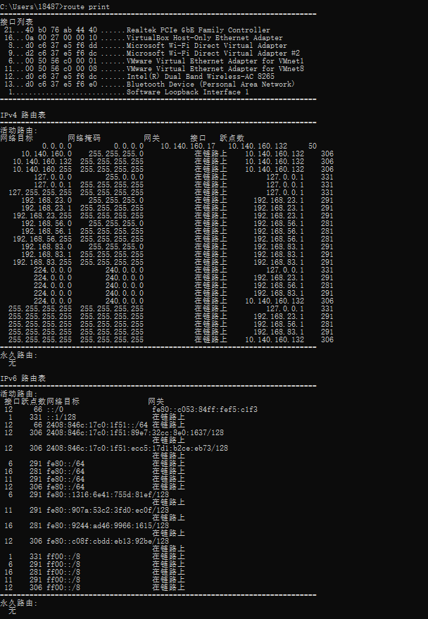
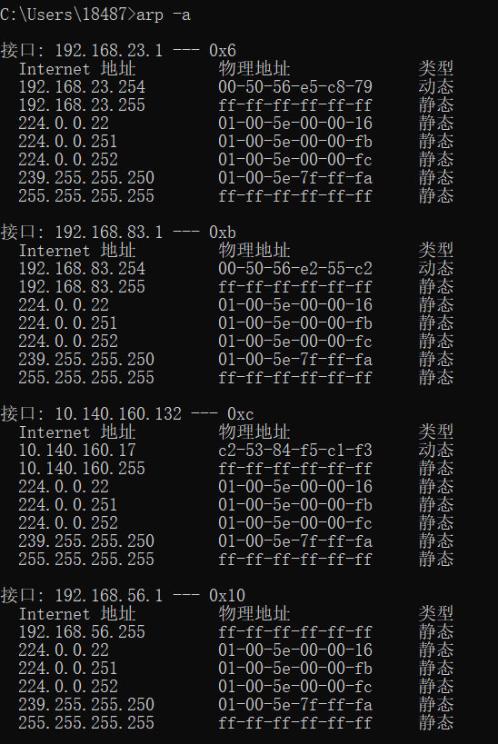
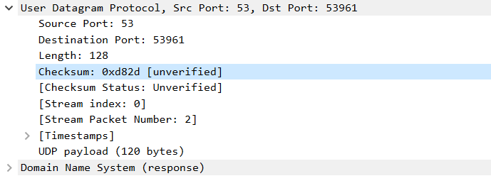
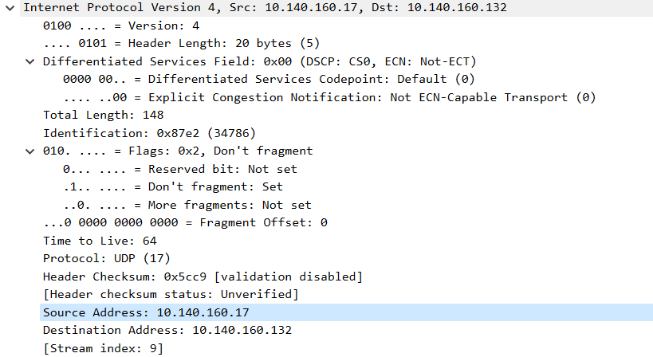
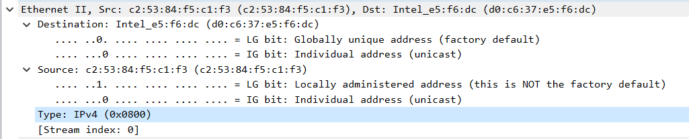
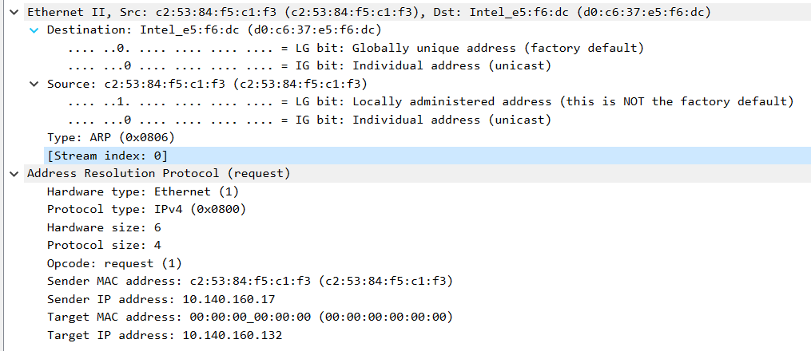
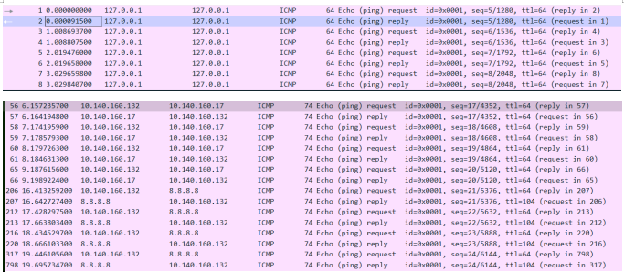

# Lab5：IP 与以太网的包收发操作

## 实验背景

本实验围绕 IP 模块与以太网在包收发过程中的角色展开，重点观察以下内容：

1. 网络包的基本结构：头部（IP 头部 + MAC 头部）与数据
2. IP 头部各字段的含义：版本号、TTL、协议号、发送方/接收方 IP 地址等
3. MAC 头部各字段的含义：接收方/发送方 MAC 地址、以太类型
4. IP 地址与 MAC 地址的区别与协作
5. ARP 协议如何通过 IP 地址查询 MAC 地址
6. 路由表的结构与查询方式
7. UDP 协议与 TCP 协议的区别：无连接、无确认、无重传
8. UDP 头部结构：发送方端口号、接收方端口号、数据长度、校验和
9. ICMP 协议的作用与常见消息类型（Echo、Destination Unreachable 等）

---

## 实验任务

### 任务一：查看路由表、ARP 缓存并启动 Wireshark

**第一步：打开 Wireshark，选择主网络接口，开始抓包**

> **注意**：本次实验必须使用真实网络接口（`en0`/`eth0`/`以太网`），不要选回环接口。回环接口不经过以太网，无法观察到 MAC 头部和 ARP 过程。

选择你的主网络接口，开始抓包。本次实验的大部分任务会共用同一次抓包。

**第二步：查看本机路由表**

```bash
# Linux
route -n
ip route show

# macOS
netstat -rn

# Windows
route print
```



**第三步：查看本机 ARP 缓存**

```bash
# Linux / macOS / Windows
arp -a
```



**第四步：填写下表**

从路由表和 ARP 缓存的输出中提取信息：

| 项目                         | 你的填写内容 |
| :--------------------------- | :----------- |
| 本机 IP 地址                 | 10.140.160.132 |
| 本机所在子网                 |10.140.160.0 |
| 子网掩码                     |255.255.255.0 |
| 默认网关 IP                  |10.140.160.17 |
| 默认网关 MAC 地址            | c2-53-84-f5-c1-f3 |
| 本机网卡 MAC 地址            |40 b0 76 ab 44 40 |

简答题：

1. 路由表的每一行包含哪些关键字段？教材中提到的 `Network Destination`、`Netmask`、`Gateway`、`Interface` 分别对应什么含义？
答：Network Destination（目的网络）：本条路由所要到达的目标网络地址
Netmask（子网掩码）：匹配目的 IP 时使用的子网掩码
Gateway（网关）：数据包转发的下一跳地址
Interface（接口）：本机发送数据包所用的网卡 IP 地址

2. 当目标 IP 地址不在本子网时，包会先发给谁？路由表的哪一列提供了这个信息？
答：数据包会先发给默认网关；该信息由路由表的 Gateway（网关） 列提供

3. 路由表的默认网关（`0.0.0.0`）条目的作用是什么？什么时候会匹配到这一行？
答：作用：当路由表中没有其他精确路由可以匹配目标 IP 时，统一将数据包转发出去。
匹配时机：所有子网路由都不匹配时，自动匹配默认网关这条路由

4. 教材提到，确定发送方 IP 地址的关键在于"判断应该使用哪块网卡"。结合你查到的本机网卡信息，说明 IP 模块是如何做出这个判断的。
答：IP 模块根据目标 IP 查找路由表，匹配到对应路由条目后，该路由对应的Interface（本机接口） 就是要使用的网卡，该网卡绑定的 IP 即为数据包的源 IP 地址

---

### 任务二：观察 UDP 头部

只要计算机处于联网状态，Wireshark 中就会持续出现大量 UDP 流量（DNS、mDNS、DHCP、NTP 等），无需手动生成。

**第一步：在 Wireshark 中设置过滤器**

```text
udp
```

**第二步：在包列表中找一个 UDP 包**

随便选一个即可。如果包太多，可以加上源或目的 IP 来缩小范围，例如 `udp && ip.addr == 你的IP`。如果需要 DNS 包，也可以用 `udp.port == 53` 过滤。

> **可选**：如果想明确看到一个完整的请求-响应对，可以在终端中执行 `nslookup example.com`，Wireshark 中就会出现对应的 DNS 请求包。

**第三步：点击选中的 UDP 包，在详情栏展开 `User Datagram Protocol`**

填写下表：

| 项目               | 你的填写内容 |
| :----------------- | :----------- |
| UDP 头部总长度     |8byte          |
| 源端口             |53            |
| 目的端口           |5396          |
| 长度（Length）     |128           |
| 校验和（Checksum） | 0xd82d       |

简答题：

1. 你观察到的 UDP 头部长度是多少字节？TCP 头部至少 20 字节。UDP 省略了哪些字段？这些字段的缺失带来了什么后果？
答：UDP 头部长度：8 字节
UDP 省略的 TCP 字段：序号、确认号、滑动窗口、紧急指针
缺失带来的后果：UDP无连接、不可靠传输，没有重传机制、没有流量控制、没有拥塞控制、没有顺序保证，数据包可能丢失、乱序到达


2. UDP 头部中的"长度"字段指的是什么长度？
答：UDP 首部 + UDP 数据部分 的总字节长度



---

### 任务三：观察 IP 头部字段

点击任务二中的同一个 UDP 包，在详情栏展开 `Internet Protocol Version 4`。

填写下表：

| 字段名称               | 你的填写内容 | 含义说明 |
| :--------------------- | :----------- | :------- |
| Version（版本号）      |4                       |IP 协议版本为IPv4 |
| Header Length（头部长度） | 20bytes             |IP 首部长度为 20 字节 |
| Time to Live（TTL）    | 64                    | 生存时间只有64跳  |
| Protocol（协议号）     | UDP(17)               |封装的上层传输层协议为 UDP，协议编号 17|
| Source Address（源 IP） | 10.140.160.17        |发送数据包的主机ip地址  |
| Destination Address（目的 IP） |10.140.160.132 | 数据包要送达的目标主机ip地址 |

简答题：

1. 协议号字段的值是多少？它代表什么协议？如果抓一个 HTTP 请求的包，协议号会变成多少？
答：协议号 = 17，代表 UDP 协议
HTTP 基于 TCP 传输，所以 HTTP 抓包时协议号为 6（TCP 协议号）

2. TTL 字段的作用是什么？如果 TTL 降为 0 会发生什么？
答：限制 IP 数据包在网络中经过路由器的转发跳数，每经过一台路由器 TTL 减 1，防止数据包在网络无限循环。
若 TTL 减为0：路由器直接丢弃该数据包，并向源主机发送超时 ICMP 报文。

3. 有教材提到 IP 地址"实际上并不是分配给计算机的，而是分配给网卡的"。你的本机有几块网卡？每块网卡的 IP 地址分别是什么？（提示：可参考任务一中路由表的 Interface 列，或用 `ip addr`（Linux）/`ifconfig`（macOS）/`ipconfig`（Windows）查看。）
答：IP 地址分配给网卡，而非主机
本机网卡数量：2 块，包含本地回环网卡、真实物理以太 / 无线网卡
回环网卡 IP：127.0.0.1
本机局域网物理网卡 IP：10.140.160.17

4. IP 头部中的源 IP 地址和目的 IP 地址分别是谁的地址？它们与 MAC 头部中的源/目的 MAC 地址有什么区别？
答：源 IP：发送主机的网络层 IP 地址，目的 IP：接收主机的网络层 IP 地址
IP 地址（网络层）：逻辑地址，跨网段全网标识主机，随路由转发会改变下一跳，源目 IP 全程不变。
MAC 地址（数据链路层）：物理硬件地址，只在当前局域网内有效，每经过一跳路由器，源、目的 MAC 都会重新变化




---

### 任务四：观察 MAC 头部与以太网帧

点击任务二中的同一个 UDP 包，在详情栏展开 `Ethernet II`。

填写下表：

| 字段名称               | 你的填写内容 | 含义说明 |
| :--------------------- | :----------- | :------- |
| Source（源 MAC）       | c2:53:84:f5:c1:f3  |发送该数据帧的网卡硬件物理地址 |
| Destination（目的 MAC） |d0:c6:37:e5:f6:dc  |接收该数据帧的目标网卡硬件物理地址 |
| Type（以太类型）       | ipv4(0x0800)        |标识帧内封装的上层网络层协议类型   |

关于 MAC 地址格式，填写下表：

| 项目               | 你的填写内容 |
| :----------------- | :----------- |
| MAC 地址长度       | 48 比特（6 字节） |
| 本机网卡的 MAC 地址 | 40 b0 76 ab 44 40 |
| 目的 MAC 地址      |d0:c6:37:e5:f6:dc  |
| MAC 地址的书写格式 |XX:XX:XX:XX:XX:XX   |

简答题：

1. 以太类型字段的值是多少？它代表后面承载的是什么协议的包？
答：数值：0x0800
含义：代表帧内封装的上层网络层协议为 IPv4 协议。

2. DNS 服务器的 IP 通常是外网地址。本任务中目的 MAC 地址是 DNS 服务器的 MAC 地址还是你本机网关（路由器）的 MAC 地址？为什么？
答：目的 MAC 地址是本机网关（路由器）的 MAC 地址，不是 DNS 服务器的 MAC 地址
因为跨网段通信时，数据帧在局域网内只会发给网关
MAC 地址仅在当前局域网内有效，无法跨越路由器网段传输

3. IP 地址和 MAC 地址在功能上有什么相似之处？又有什么本质区别？
答：都是网络中用于标识网络节点（主机 / 设备）的地址，都用来完成通信寻址
本质区别：MAC 地址：数据链路层物理硬件地址，网卡出厂固化，仅局域网内有效；IP 地址：网络层逻辑软件地址，可灵活修改配置，支持全网跨网段寻址

4. 为什么以太网帧中需要同时有 IP 地址（在 IP 头部中）和 MAC 地址？不能只用其中一种吗？
答：不能，只用其中任意一种二者分工完全不同、缺一不可
MAC 地址：属于数据链路层，只负责同一局域网内的数据帧投递，无法跨路由器、跨网段传输。
IP 地址：属于网络层，负责全球互联网跨网段路由寻址，找到目标主机的全网位置，但无法直接驱动底层硬件传帧。
通信流程：IP 负责找全网目的地，MAC 负责局域网内每一跳的链路传输，二者配合才能完成互联网完整通信。




---

### 任务五：观察 ARP 协议

ARP（Address Resolution Protocol，地址解析协议）用于根据 IP 地址查询 MAC 地址。只要计算机处于联网状态，Wireshark 中通常会持续出现 ARP 包（邻居发现、缓存刷新等），可以直接观察。如果抓包一段时间后仍未看到 ARP 包，再手动触发。

**第一步：在 Wireshark 中设置过滤器**

```text
arp
```

**第二步：在包列表中找 ARP 包**

正常联网的设备每隔几分钟就会自动发送 ARP 请求，等待即可。如果等了一会儿仍没有，可以选择以下任一方式手动触发：

- **方式 A（推荐）**：在终端中执行 `arping`

  ```bash
  # Linux（通常已预装）
  sudo arping -c 3 <网关IP>

  # macOS（如果没有，先执行：brew install arping）
  sudo arping -c 3 <网关IP>

  # Windows（可从 https://github.com/ThomasHabets/arping/releases 下载）
  arping -c 3 <网关IP>
  ```

- **方式 B**：先清除 ARP 缓存，再 ping 同网段地址

  ```bash
  # 清除 ARP 缓存
  # Linux:   sudo ip neigh flush all
  # macOS:   sudo arp -d -a
  # Windows: arp -d *

  # 然后 ping 网关
  ping <网关IP> -c 2
  ```

> **注意**：如果目标是 `127.0.0.1` 或外网地址，ARP 不会出现。回环接口不经过以太网，外网地址的 MAC 地址是路由器的（通常已缓存）。

**第三步：点击 ARP 请求包（Opcode 为 request），展开详情**

**第四步：填写下表**

| 项目                     | 你的填写内容 |
| :----------------------- | :----------- |
| ARP 请求的目的 MAC 地址 |00:00:00:00:00:00   |
| ARP 请求中查询的目标 IP |10.140.160.132       |
| ARP 响应中返回的 MAC 地址 |d0:c6:37:e5:f6:dc   |
| 该 ARP 包是自动出现还是手动触发的 |手动          |

简答题：

1. ARP 请求的目的 MAC 地址为什么是 `ff:ff:ff:ff:ff:ff`（广播地址）？
答：强制询问局域网内所有主机。
原因：ARP 用于通过 IP 找 MAC，但发送请求时不知道目标 MAC。为了确保目标设备能收到并回复，必须向局域网内所有设备发送广播，目标设备收到后会比对 IP，匹配则单播回复

2. 为什么 ARP 缓存中的条目会在几分钟后自动删除？
答：目的：保证地址有效性与节省资源。
原因：网络中设备 MAC 可能变动（如换路由器、换网卡）。设有效期可淘汰过时条目，避免下一跳错误；同时防止缓存无限膨胀，占用系统内存

3. 如果 ARP 缓存中的 MAC 地址已经过期（对方 IP 对应的设备已更换），会出现什么问题？如何解决？后果：数据包无法送达，出现网络不通、丢包、ping 请求超时。
解决：手动清除：执行 arp -d 
重新获取：系统会自动发送新的 ARP 请求，重新查询并更新缓存




---

### 任务六：使用 `ping` 命令观察 ICMP

有教材提到了 ICMP（Internet Control Message Protocol）协议，它用于在 IP 层传递错误和控制信息。`ping` 命令就是基于 ICMP 的 Echo Request（类型 8）和 Echo Reply（类型 0）实现的。

**第一步：在 Wireshark 中设置 ICMP 过滤器**

```text
icmp
```

**第二步：在终端中执行 ping 命令**

```bash
# ping 本机（回环）
ping 127.0.0.1 -c 4

# ping 局域网内的设备（如路由器网关）
ping <网关IP> -c 4

# ping 外网地址
ping 8.8.8.8 -c 4
```

**第三步：在 Wireshark 中观察 ICMP 包**

填写下表：

| 目标               | 是否收到回复 | 往返时间（ms） | TTL 值 |
| :----------------- | :----------- | :------------- | :----- |
| 127.0.0.1          |是            |0.000091500	| 64       |
| 局域网设备（网关） | 是             |0.006959    |64        |
| 8.8.8.8            |是              |0.2294682        |64       |

> **提示**：ping 回环地址（`127.0.0.1`）时数据不经过物理网卡，Wireshark 在主网络接口上可能无法捕获到包。TTL 值可从终端输出中读取（`ping` 会显示 `ttl=...`），或切换 Wireshark 至回环接口（`lo0` / `lo`）抓包。

简答题：

1. `ping` 命令发送的是什么类型的 ICMP 消息？收到的回复又是什么类型？
答：ping 命令发送的是 ICMP Echo Request（类型 8），收到的回复是 ICMP Echo Reply（类型 0）

2. 为什么 ping 不同目标的 TTL 值不同？TTL 值反映了什么信息？
答：不同目标主机距离本机经过的路由器跳数不一样；且不同操作系统出厂默认初始 TTL 值也不同
TTL 代表数据包剩余转发跳数，可以粗略判断本机到目标主机之间经过了多少个路由器

3. 教材表 2.4 中列出了多种 ICMP 消息类型。`Destination unreachable`（类型 3）在什么情况下会出现？请用以下方法尝试触发并观察：

   ```bash
   # 方法一（推荐）：ping 同网段内一个确认不存在的 IP
   # 例如你的本机 IP 是 192.168.1.100，子网掩码 255.255.255.0，
   # 那么可以 ping 192.168.1.250（一个大概率没有被分配的地址）
   ping <同网段不存在的IP> -c 3
   
   # 方法二：向一个关闭的端口发 UDP 包，触发 ICMP Port Unreachable
   # 先在 Wireshark 中保持 icmp 过滤器，然后执行：
   # Linux / macOS
   echo "test" | nc -u -w 1 <同网段某台设备的IP> 19999
   
   # Windows（需安装 nmap：https://nmap.org/download.html）
   nmap -sU -p 19999 <同网段某台设备的IP>
   ```

   观察到类型 3 的包后，记录其 Code 值（子类型）并说明代表什么含义。
答：ping 同网段不存在的 IP时，抓到类型 3、Code=1（主机不可达）；
向未开放的 UDP 端口发包时，抓到类型 3、Code=3（端口不可达）




---

## 问答题

1. 网络包由哪几部分构成？IP 头部和 MAC 头部分别的作用是什么？
答：网络包由 MAC 首部、IP 首部、传输层首部（TCP/UDP）、数据 四部分构成。
MAC 首部：实现同一局域网内链路传输，标识源、目的网卡物理地址
IP 首部：实现跨网段路由寻址，标识全网源、目的主机逻辑地址

2. IP 协议和以太网协议在网络传输中分别承担什么职责？它们是如何分工协作的？
答：以太网协议：数据链路层，负责局域网内点对点帧传输，依靠 MAC 地址收发数据。
IP 协议：网络层，负责跨网段路由选路，规划数据包传输路径。
分工协作：IP 确定数据包去往哪里，以太网负责把数据包在每一段链路上实际传送

3. ARP 协议解决的核心问题是什么？如果不使用 ARP 缓存，网络中会出现什么情况？
答：ARP 核心问题：通过 IP 地址查询对应的 MAC 地址。
无 ARP 缓存的后果：每一次通信都要发送大量 ARP 广播请求，占用网络带宽、网络拥堵、通信效率极低

4. 为什么 IP 和负责传输的网络（如以太网）要分开设计？这种设计带来了什么好处？
答：分层分开设计原因：网络层 IP 独立于底层物理链路，不绑定以太网、WiFi 等具体硬件。
好处：实现网络互联，不同底层链路（以太网、光纤、无线）都可以统一使用 IP 协议，便于扩展、兼容各种网络、方便升级

5. 网卡在发送包时会额外添加哪 3 个控制数据？它们各自的作用是什么？
答：前导码：同步时钟，让接收方做好接收准备。
帧开始定界符 SFD：标记数据帧正式开始。
帧校验序列 FCS：CRC 校验，检测传输过程中是否出错

6. 网卡接收到一个包后，需要经过哪些步骤才能将其交给操作系统？如果 FCS 校验失败会怎样？
答：接收步骤：网卡接收以太网帧，先进行 FCS 校验；校验无误后去除帧头帧尾；提取 IP 数据包上交操作系统内核。
FCS 校验失败：直接丢弃该帧，不向上层提交，也不重传

7. TCP 和 UDP 的核心区别是什么？请从连接管理、可靠性、效率、适用场景四个维度进行比较。
答：连接管理：TCP 面向连接；UDP 无连接。
可靠性：TCP 可靠传输（确认、重传、排序）；UDP 不可靠，不保证送达。
传输效率：TCP 开销大、速度慢；UDP 首部小、开销小、速度快。
适用场景：TCP 用于文件传输、网页 HTTP 等；UDP 用于视频、直播、语音、游戏

8. UDP 适用于哪些场景？请结合教材内容解释为什么这些场景适合使用 UDP 而非 TCP。
答：适用：在线直播、视频通话、语音聊天、网络游戏。
原因：这类业务对实时性要求高，能容忍少量丢包，不需要重传；TCP 重传会造成卡顿延迟，UDP 低时延、速度快更合适

9. 如果一个 IP 包经过多次路由转发后 TTL 降为 0，路由器会如何处理？这与教材中提到的哪种 ICMP 消息有关？
答：处理方式：路由器直接丢弃该 IP 数据包。
对应 ICMP 消息：ICMP 超时报文


---

## 截图要求

- 截图须清晰，终端文字和 Wireshark 字段可读。
- 所有截图与本 `Lab5.md` 放在同一目录下。
- 命名规范：

| 截图内容         | 文件名               |
| :--------------- | :------------------- |
| 路由表           | `route_table.png`    |
| ARP 缓存         | `arp_cache.png`      |
| UDP 头部字段     | `udp_header.png`     |
| IP 头部字段      | `ip_header.png`      |
| 以太网帧字段     | `ethernet_frame.png` |
| ARP 请求与响应   | `arp.png`            |
| ICMP ping        | `icmp.png`           |

具体要求：

1. `route_table.png`：终端截图，显示 `route -n`（Linux）、`netstat -rn`（macOS）或 `route print`（Windows）的完整输出。

2. `arp_cache.png`：终端截图，显示 `arp -a` 的完整输出。

3. ``udp_header.png：Wireshark 截图，展开 `User Datagram Protocol`，能看到 Source Port、Destination Port、Length、Checksum。

4. `ip_header.png`：Wireshark 截图，展开 `Internet Protocol Version 4`，能看到 Version、Header Length、TTL、Protocol、Source Address、Destination Address。

5. `ethernet_frame.png`：Wireshark 截图，展开 `Ethernet II`，能看到 Source、Destination、Type。

6. `arp.png`：Wireshark 截图（若能观察到），展开 ARP 包的详情，能看到发送方的 MAC 和 IP、查询的目标 IP。

7. `icmp.png`：Wireshark 截图，能看到 ICMP Echo Request 和 Echo Reply，以及 TTL 字段。

---

## 提交要求

在自己的文件夹下新建 `Lab5/` 目录，提交以下文件：

```text
学号姓名/
└── Lab5/
    ├── Lab5.md
    ├── route_table.png
    ├── arp_cache.png
    ├── udp_header.png
    ├── ip_header.png
    ├── ethernet_frame.png
    ├── arp.png
    └── icmp.png
```

---

## 截止时间

2026-05-07，届时关于 Lab5 的 PR 请求将不会被合并。
