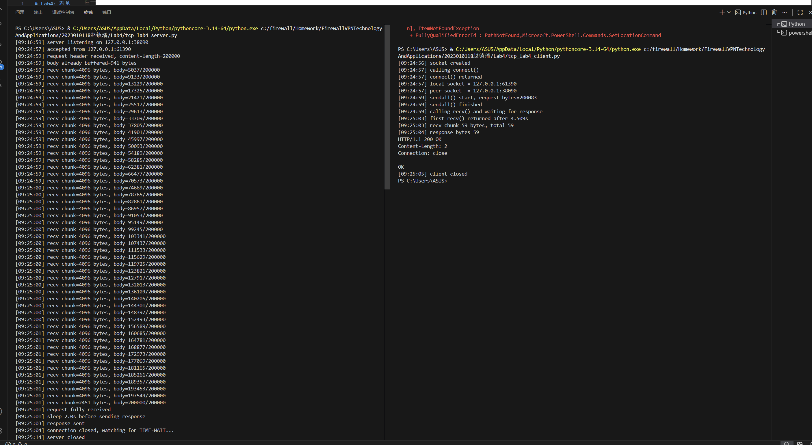
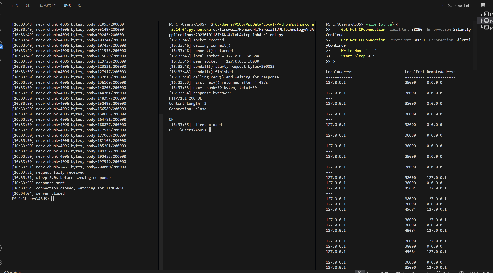
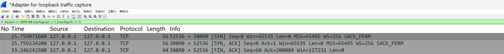
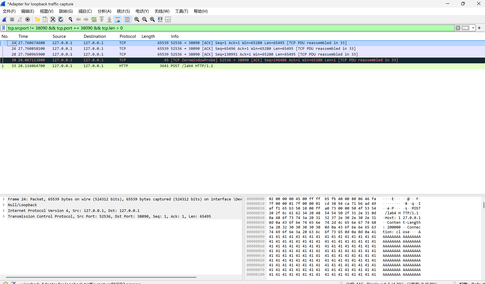
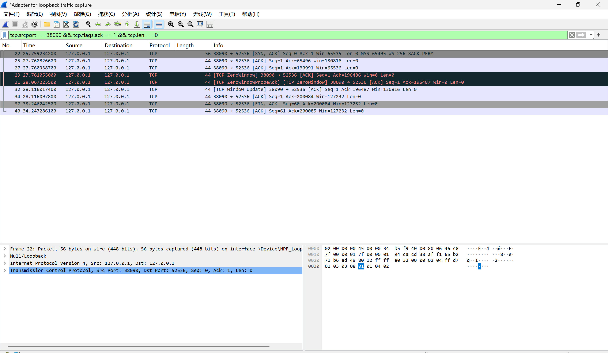
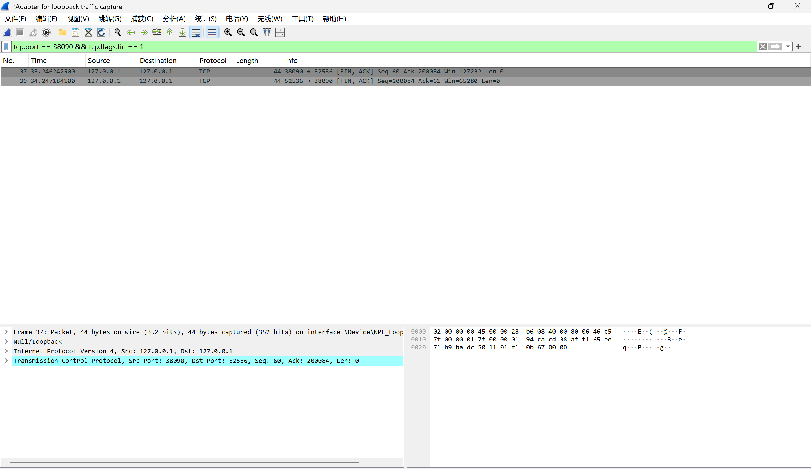

# Lab4：看见TCP 我不怕不怕啦

## 实验背景

本实验围绕一条 TCP 连接的完整生命周期展开，重点观察以下内容：

1. `socket()`、`listen()`、`accept()`、`connect()` 的职责区别
2. "连接"为什么本质上是交换控制信息而不是物理连线
3. TCP 头部中的端口号、序号、ACK 号、标志位、窗口、头部长度、可选字段
4. 三次握手如何建立收发准备
5. 应用层大块数据如何被 TCP 按 MSS 拆分
6. `Sequence Number` 与 `Acknowledgment Number` 如何配合工作
7. `recv()` 为什么会阻塞等待数据
8. 接收窗口如何反映接收方处理能力
9. ACK 与窗口更新为什么常常会被合并
10. `FIN` / `ACK` 如何完成断开
11. 为什么连接结束后套接字不会立刻删除

---

## 实验任务

### 任务一：准备实验环境并记录运行信息

**第一步：准备好四个窗口**

整个实验需要同时观察多个界面，建议在开始前把窗口布局摆好：

- **终端 A**：运行服务端
- **终端 B**：运行客户端
- **终端 C**：持续监控套接字状态（全程保持开启，不要关）
- **Wireshark**：抓包

**第二步：在终端 C 里启动持续监控**

TCP 状态变化很快，等你手动敲完 `ss` 命令再回车，状态可能已经过去了。用下面的命令让终端 C 每 0.5 秒自动刷新一次，之后只需要盯着这个窗口就行：

```bash
# Linux
watch -n 0.5 'ss -tan | grep 38090'

# macOS（没有 watch，用循环代替）
while true; do netstat -an | grep 38090; echo "---"; sleep 0.5; done

# Windows（Git Bash执行）
while true; do netstat -ano | grep 38090; echo "---"; sleep 0.5; done
```

如果你换了端口，把 `38090` 替换成实际端口。

**第三步：打开 Wireshark，选回环接口，填好过滤器，开始抓包**

回环接口在不同系统里名字不同：

| 系统 | 接口名 |
|:-----|:-------|
| Linux | `lo` |
| macOS | `lo0` |
| Windows | `Adapter for loopback traffic capture`（需提前安装 Npcap 并勾选回环支持） |

在显示过滤器里输入：

```text
tcp.port == 38090
```

然后点击开始抓包（蓝色鲨鱼鳍图标）。**先开始抓包，再运行脚本**，否则握手包会被漏掉。

**第四步：启动脚本**

```bash
# 终端 A
python3 tcp_lab4_server.py

# 终端 B（等服务端打印出 server listening on ... 后再运行）
python3 tcp_lab4_client.py
```

如果 `38090` 已被占用，两端都加环境变量换端口，同时记得把 Wireshark 过滤器和终端 C 里的端口号也改掉：

```bash
LAB4_PORT=38123 python3 tcp_lab4_server.py
LAB4_PORT=38123 python3 tcp_lab4_client.py
```

**第五步：填写下表**

| 项目                                | 你的填写内容 |
| :---------------------------------- | :----------- |
| 服务端监听地址                      |127.0.0.1 |
| 服务端监听端口                      |38090 |
| 客户端本地临时端口                  |61390 |
| 客户端请求总字节数                  |200083|
| 服务端响应内容                      |HTTP/1.1 200 OK\nContent-Length: 2\nConnection: close\n\nOK|
| 客户端 `connect()` 返回前后的时间点 |	调用前：09:24:57（calling connect()）返回后：09:24:57（connect() returned）|
| 客户端首次收到响应前等待了多久      |4.509s|

各项数值均可直接从终端输出读取：服务端监听信息在 `server listening on ...`，客户端本地端口在 `local socket = ...`，请求字节数在 `sendall() start, request bytes=...`，等待时间在 `first recv() returned after ...s`。



---

### 任务二：观察套接字创建与连接建立

1. 服务端启动后，观察终端 C 出现 `LISTEN` 状态，截图留存。
2. 在终端 B 里启动客户端，观察它依次打印 `socket created`、`calling connect()`、`connect() returned`。
3. 客户端打印 `connect() returned` 之后，观察终端 C 出现 `ESTABLISHED`，截图留存。脚本在 `connect()` 返回后有 2 秒停顿，这段时间足够截图。

填写下表：

| 阶段                             | 你的填写内容 |
| :------------------------------- | :----------- |
| 服务端启动、客户端未连入时的状态 | LISTEN |
| `connect()` 返回后服务端状态     |	ESTABLISHED|
| `connect()` 返回后客户端状态     |ESTABLISHED |

简答题：

1. 服务端在客户端连接前为什么处于 `LISTEN`？
答：服务端调用 bind() 绑定端口后，会调用 listen() 进入 LISTEN 状态。这表示服务端的套接字已经配置完成，正在被动等待客户端发起的连接请求，随时准备响应接入。


2. 为什么这时还没有真正建立 TCP 连接？
答：TCP 连接的建立需要完成三次握手流程，双方必须交换 SYN、SYN-ACK、ACK 控制包。服务端处于 LISTEN 状态，仅表示它 “准备好了”，但尚未与任何客户端完成三次握手，因此逻辑上的 TCP 连接并未建立。


3. `socket()` 与 `connect()` 的区别是什么？
答：（1）socket()：仅在操作系统内核中创建一个套接字文件描述符，相当于 “打开一个通信口子”，此时它是孤立的，未绑定任何地址，也未建立连接。
（2）connect()：客户端主动调用，向服务端的地址和端口发起连接请求，触发 TCP 三次握手流程，将客户端套接字与服务端地址关联起来。


4. 为什么 `connect()` 返回后才进入可稳定收发数据的状态？
答：connect() 成功返回，意味着客户端与服务端之间的三次握手已完成，双方已经协商好了初始序列号、窗口大小等传输参数，TCP 连接正式进入 ESTABLISHED 状态。只有在这个状态下，双方才具备了合法、稳定的收发数据通道。


5. 为什么"网线一直连着"不等于"TCP 连接已经建立"？
答：网线连通只代表物理层 / 链路层的硬件是通的；而 TCP 连接是传输层的逻辑状态，必须通过三次握手完成状态协商。即便物理链路正常，如果没有完成三次握手，TCP 连接依然不存在，无法进行数据传输


6. 这里的"连接"更准确地说是在做什么？
答：这里的 “连接” 本质上是双方的一次状态约定：通过三次握手，协商并同步双方的初始序列号、确认号，约定通信规则，在两个套接字之间建立起一条逻辑上的通信通道。它不是物理上的线路，而是双方内核维护的状态记录。




---

### 任务三：观察三次握手与 TCP 头部字段

**定位握手包**：在 Wireshark 过滤器里输入下面的条件，可以屏蔽中间的数据包，只留下握手和断开阶段的控制包：

```text
tcp.port == 38090 && (tcp.flags.syn == 1 || tcp.flags.fin == 1)
```

包列表最前面的三个包就是三次握手（SYN → SYN-ACK → ACK）。

**找到各字段的位置**：点击某个握手包，在下方详情栏展开 `Transmission Control Protocol`。源端口、目的端口、Seq、Ack、Flags、Window、Header Length 都在这里。TCP 选项在最底部的 `Options` 子项里，展开后可以看到 MSS、Window Scale、SACK Permitted，注意这三项只出现在带 SYN 标志的包里，纯 ACK 包里没有。

**关于序号显示**：Wireshark 默认开启相对序号，会把每个方向的初始序号归零显示，所以 SYN 包的 Seq 看起来是 `0`，而不是真实的随机大数。这是正常现象，实验报告按 Wireshark 显示的值填写即可。如果你想看真实值，可以去 `Edit → Preferences → Protocols → TCP` 里取消勾选 `Relative sequence numbers`。

填写下表：

| 报文       | 源端口 | 目的端口 | Seq  | Ack  | Flags | Window | Header Length |
| :--------- | :----- | :------- | :--- | :--- | :---- | :----- | :------------ |
| 第一次握手 | 52536 |38090 | 0|0|SYN  |65535| 32 |
| 第二次握手 | 38090 |52536| 0|1|SYN, ACK| 65535 |32|
| 第三次握手 |52536 |38090|1 |1|ACK|65535 |20 |

第一次握手（SYN）的 Ack 字段在 Wireshark 里通常显示为空或 `0`，这是正常的，因为此时客户端还没有收到服务端的任何数据。Header Length 在没有选项时是 20 字节，握手包因为携带了 MSS 等选项通常是 28 或 32 字节。

| TCP 选项       | 你的填写内容 |
| :------------- | :----------- |
| MSS            |65495|
| Window Scale   |256|
| SACK Permitted |SACK_PERM|

回环接口的 MSS 通常是 65495（因为回环 MTU 是 65536，比以太网的 1500 大得多），这会影响后续任务五里是否能观察到分段。

简答题：

1. 发送方和接收方端口号在连接阶段的作用是什么？
答：端口号是 TCP 连接的 “进程标识”：
（1）接收方端口号（如你的实验中 38090）用来标识目标服务进程，确保连接请求能被正确的程序接收和处理。
（2）发送方端口号（如 52536）是客户端临时端口，用来标识客户端进程，让服务端能区分来自不同客户端的连接。
（3）两者共同组成一个四元组（源 IP + 源端口 + 目的 IP + 目的端口），唯一标识一条 TCP 连接。


2. TCP 头部如何帮助找到目标套接字？
答：操作系统内核通过 TCP 头部中的 源端口、目的端口、源 IP、目的 IP 组成的四元组，来匹配对应的套接字：
（1）当数据包到达主机时，内核会用这四个字段，在内核的连接表中查找已存在的套接字。
（2）如果找到匹配的套接字，就将数据交付给对应的应用进程；如果是连接请求（SYN 包），则交付给监听该端口的服务进程处理。


3. 为什么初始序号不是简单固定从 1 开始？
答：初始序号（ISN）是随机生成的，而不是固定为 1，主要出于两点考虑：
（1）安全性：固定的初始序号容易被攻击者预测，发起伪造的 RST 包或会话劫持攻击。
（2）可靠性：随机序号可以避免旧连接的延迟数据包，干扰新建立的连接，防止数据错乱。

4. 为什么 TCP 可选字段更容易在连接阶段看到？
TCP 可选字段主要在三次握手阶段协商，之后通常不再携带：
（1）连接建立时，双方会在 SYN/SYN-ACK 包中协商 MSS（最大分段大小）、窗口缩放（Window Scale）、SACK 支持等选项，这些都需要通过可选字段传递。
（2）连接建立后，双方已经确定了这些参数，后续的数据传输包通常不需要再携带这些选项，头部长度就回到默认的 20 字节，所以可选字段只在握手阶段明显可见。




---

### 任务四：区分头部中的控制信息和套接字中的控制信息

用以下过滤器分别找到两类报文：

```text
# 纯控制报文（无应用数据）
tcp.port == 38090 && tcp.len == 0

# 携带应用数据的报文
tcp.port == 38090 && tcp.len > 0
```

从纯控制报文里选一个（SYN、纯 ACK 或 FIN-ACK 都可以），从数据报文里选一个（客户端发请求或服务端发响应的包）。

填写下表：

| 项目                   | 你的填写内容 |
| :--------------------- | :----------- |
| 纯控制报文的类型       |SYN（第一次握手包）、SYN-ACK（第二次握手包）、FIN-ACK（挥手包）|
| 携带应用数据的报文类型 |客户端发送的数据分段（Len=4096）、服务端响应包（HTTP/1.1 200 OK）|
| 头部中的控制信息举例   |Flags=SYN、Seq=0、Ack=1、Win=65535、MSS=65495、WS=256|
| 套接字中的控制信息举例 |服务端 LISTEN 状态、客户端 connect() returned、连接 ESTABLISHED 状态、TIME_WAIT 状态|

简答题：

1. 为什么"头部中的控制信息"和"套接字中的控制信息"不是同一件事？
（1）层级不同：头部控制信息：是传输层协议规范，存在于每个 TCP 报文里，比如 SYN/ACK 标志位、序号、确认号、窗口大小等。它是报文本身的一部分，只在单次传输中起作用。
套接字控制信息：是操作系统内核维护的状态，比如 LISTEN、ESTABLISHED、TIME_WAIT 等状态，以及 connect() 调用的返回值。它记录的是整个连接的生命周期状态，与单个报文无关。
（2）作用域不同：头部信息只控制当前这个报文的传输，比如是否是连接请求、是否确认收到数据。套接字信息控制的是整个连接的状态，比如连接是否建立、是否关闭，应用程序通过它来判断能否收发数据。
（3）存在形式不同：头部控制信息是 “报文里的字段”，随报文一起发送，在网络中传输。套接字控制信息是 “内核里的记录”，只存在于本地操作系统中，不会在网络中传输。


---

### 任务五：观察数据分段、序号与 ACK

客户端发送的请求体是 200000 字节，超过了回环接口 MSS（约 65495 字节），因此应该可以在 Wireshark 里看到多个连续的数据段。用下面的过滤器找到客户端发出的数据包：

```text
tcp.srcport != 38090 && tcp.port == 38090 && tcp.len > 0
```

在包列表里连续选几个数据段，对比它们的 Seq 值。相邻两段的关系是：后一段的 Seq = 前一段的 Seq + 前一段的 TCP Segment Len。

找服务端返回给客户端的纯 ACK 报文：

```text
tcp.srcport == 38090 && tcp.flags.ack == 1 && tcp.len == 0
```

填写下表：

| 数据段  | Seq  | Ack  | TCP Segment Len | Flags |
| :------ | :--- | :--- | :-------------- | :---- |
| 第 1 段 |1|1|65495 |ACK|
| 第 2 段 |65496|1|65495 |ACK|
| 第 3 段 |130991|1|65495|ACK|

| ACK 报文 | Ack Number | Flags | Window |
| :------- | :--------- | :---- | :----- |
| 第 1 个  |65496|ACK |130816|
| 第 2 个  |130991|ACK|65536|
| 第 3 个  |196486|ACK|130816|

| 项目                         | 你的填写内容 |
| :--------------------------- | :----------- |
| 是否发生分段                 |是|
| 握手中观察到的 MSS           |65495|
| 单段长度与 MSS 的关系        |单段数据长度（65495）等于 MSS|
| ACK 号大致确认到了第几个字节 |65496、130991、196486|

简答题：

1. 应用程序是否直接决定每个网络包的数据长度？为什么？
答：应用程序不能直接决定每个网络包的数据长度。原因：应用程序调用sendall()发送的数据，会先进入操作系统内核的 TCP 发送缓冲区，再由 TCP 协议根据协商的 MSS、拥塞控制、Nagle 算法等机制，动态决定如何将数据封装成分段。实验中sendall()发送的 200000 字节数据，最终被 TCP 按 MSS 拆分为多个分段，而非直接对应一个网络包。

2. 大块应用数据为什么会被拆分？
答：主要原因有两点：
（1）避免 IP 层分片：TCP 每个分段的应用数据长度不能超过 MSS，否则 IP 层需要对数据包进行分片，会降低传输效率和可靠性，还可能增加丢包重传的复杂度。
（2）传输效率优化：TCP 会根据网络状况、接收方窗口大小等因素，动态调整分段大小，减少网络拥塞和延迟，提升整体传输性能。

3. `MSS` 与 `MTU` 的关系是什么？
答：MSS（最大分段大小）是 TCP 报文段中应用数据部分能承载的最大字节数，不包含 TCP 头部和 IP 头部。它们的关系为：MSS = MTU - IP头部长度(20字节) - TCP头部长度(20字节)。


4. "一次 `sendall()`"与"一个 TCP 包"之间是什么关系？
答：两者不是一一对应的关系：
（1）一次sendall()发送的数据，可能被 TCP 拆分为多个分段发送（如你的实验中 200000 字节被拆分为多个分段）。
（2）多次sendall()发送的小数据，也可能被 TCP 合并为一个分段发送（当满足 Nagle 算法条件时）。


5. 为什么 ACK 体现的是累计确认？
答：ACK 号的含义是 “我已经收到了序号之前的所有字节”，而不是只确认单个分段。例如实验中，服务端回复ACK=65496，表示已经收到了1~65495字节的所有数据，客户端收到这个 ACK 后，无需再逐个确认之前的分段，这种机制被称为累计确认，能有效减少 ACK 包的数量，提升传输效率。


6. 如果中间某一段丢失，ACK 会出现什么变化？
答：服务端会一直回复重复的 ACK 号（即已收到的连续字节的最大序号 + 1）。例如第 2 段丢失，服务端会持续回ACK=65496，表示只收到了第 1 段数据，未收到后续分段。客户端收到 3 个重复的 ACK 后，会触发快速重传机制，立即重传丢失的分段，无需等待超时。





---

### 任务六：观察 `recv()` 阻塞与窗口字段

`recv()` 的等待时间直接从客户端终端读取，`calling recv() and waiting for response` 到 `first recv() returned after ...s` 之间就是等待时长，脚本已经帮你计算好了。

在 Wireshark 里找窗口值：用过滤器 `tcp.port == 38090 && tcp.flags.ack == 1` 列出所有 ACK 包，点击其中一个，在详情栏 `Transmission Control Protocol` 里找 `Window` 字段。如果同时显示了 `Calculated window size`，优先看这个值，它已经把 Window Scale 的缩放算进去了，是对方实际能接收的字节数。

如果包列表的 Info 列出现了 `[TCP Window Update]` 标注，说明这个包的主要目的是通知对方窗口变化，重点观察它的 `Window` 字段。

填写下表：

| 项目                                   | 你的填写内容 |
| :------------------------------------- | :----------- |
| 客户端开始调用 `recv()` 的时间         |[09:24:59]|
| 客户端第一次收到响应的时间             |[09:25:03]|
| `recv()` 是否立刻返回                  |否|
| 首次收到响应前等待了多久               |约4.5秒 |
| `recv()` 等待期间连接是否已经建立      |是|
| 第 1 个 ACK 报文的窗口值               |65535|
| 第 2 个 ACK 报文的窗口值               |130816|
| 第 3 个 ACK 报文的窗口值               |65536|
| 窗口值是否变化                         |是|
| 若变化，变化趋势                       | 窗口值从初始值 65535 先增大到 130816，再减小到 65536，出现波动，反映接收缓冲区的使用与释放|
| ACK 与窗口更新是否可以出现在同一个包中 |是|
| 是否看到 RTT 或 ACK 往返时间相关信息   |否 |

简答题：

1. "连接建立"和"应用收到数据"之间是什么关系？
答：（1）连接建立（三次握手完成）是应用收发数据的前提条件，但不是 “收到数据” 的充分条件。
（2）三次握手只完成了双方的序号同步和连接状态协商，保证了传输通道的建立；但应用数据的到达还受发送方发送速度、网络延迟、接收方处理速度等因素影响。
（3）实验中，客户端 connect() 成功后，调用 recv() 仍需等待约 4.5 秒才收到数据，这说明 “连接建立”≠“数据已准备好”，两者是独立的阶段。


2. 为什么说 `read` / `recv` 在数据未到达时会被挂起？
答：在默认的阻塞模式下，recv() 调用会被操作系统内核挂起（阻塞），直到满足以下任一条件才返回：
（1）有数据到达内核接收缓冲区；
（2）连接被关闭；
（3）发生错误。


3. 窗口字段反映了接收方哪方面的能力？
答：窗口字段反映了接收方当前的接收缓冲区剩余容量，决定了发送方最多能发送多少数据而无需等待确认：
（1）窗口值越大，说明接收方缓冲区剩余空间越多，处理能力越强，发送方可以连续发送更多数据；
（2）窗口值减小，说明接收方处理速度慢，缓冲区即将被填满，发送方需要降低发送速率；
（3）窗口值为 0（零窗口）时，发送方必须停止发送，直到接收方更新窗口。


4. 为什么发送方不能无限制连续发送数据？
答：发送方的发送速率受接收方窗口大小的限制，不能无限制发送：
（1）TCP 是流量控制协议，发送方必须遵守接收方的窗口大小，避免发送过快导致接收方缓冲区溢出、数据丢失；
（2）网络拥塞控制也会限制发送速率，避免大量数据包涌入网络导致拥塞崩溃。


5. 滑动窗口为什么既提高效率又避免压垮接收方？
答：滑动窗口机制通过 “批量发送、按需确认” 实现了效率与可靠性的平衡：
（1）提高效率：发送方无需每发一个分段就等待 ACK，而是可以连续发送窗口大小内的数据，减少了等待时间和 ACK 包数量，大幅提升吞吐量；
（2）避免压垮接收方：窗口大小由接收方控制，发送方的发送速率始终匹配接收方的处理能力，不会超过其缓冲区容量，实现了流量控制。


---

### 任务七：观察响应返回与双向 `seq/ack`

TCP 的 Seq/Ack 是双向独立的，客户端有自己的发送序号，服务端有自己的发送序号。用下面的过滤器只看服务端发出的数据包（源端口是 38090，有应用数据）：

```text
tcp.srcport == 38090 && tcp.len > 0
```

紧跟在服务端数据包后面的、客户端发出的 ACK 包，其 Ack Number 确认的就是服务端的发送序号。

填写下表：

| 项目                     | 你的填写内容 |
| :----------------------- | :----------- |
| 服务端响应数据报文的 Seq |60 |
| 服务端响应数据报文的 Ack |200084|
| 客户端确认报文的 Ack     |61|

简答题：

1. 为什么 TCP 的 `seq/ack` 是双向分别计算的？
答：TCP 是全双工协议，客户端和服务端可以同时发送和接收数据，因此双方需要各自维护一套独立的序号（seq）和确认号（ack）：
（1）客户端的 seq/ack 用于标识自己发送的数据序号，同时确认服务端发来的数据。
（2）服务端的 seq/ack 用于标识自己发送的数据序号，同时确认客户端发来的数据。
（3）两套序号互不干扰，才能实现双向同时传输和可靠确认，确保双方数据的完整性和有序性。


2. 为什么双方都需要各自的初始序号？
答：双方各自维护初始序号（ISN）主要有三个目的：
（1）保证双向序号的独立性：避免不同方向的数据序号冲突，确保全双工传输时，双方的数据不会互相干扰。
（2）提升连接安全性：随机生成的初始序号可以防止攻击者预测序号，发起会话劫持或伪造 RST 包，避免连接被恶意破坏。
（3）避免数据错乱：随机序号可以防止旧连接的延迟数据包干扰新连接，确保新连接的数据不会被旧数据污染。


3. 为什么发送应用数据时报文通常仍然带 `ACK`？
答：TCP 协议规定，只要发送报文，默认会携带 ACK 标志位，这是为了实现捎带确认机制：
（1）在发送数据的同时，顺便确认对方之前发来的数据，减少单独发送 ACK 包的开销，提升传输效率。
（2）保持连接的确认状态，让对方知道数据已被接收，无需额外等待确认包，避免不必要的超时重传。


---

### 任务八：观察连接断开与套接字延迟删除

用下面的过滤器精确定位所有带 FIN 的包：

```text
tcp.port == 38090 && tcp.flags.fin == 1
```

通常会看到两个 FIN 包（双方各一个）。看第一个 FIN 包的源端口，就能判断谁先发起断开。

**关于 TIME-WAIT**：TIME-WAIT 只出现在主动发起关闭的一方（先发 FIN 的那端）。服务端脚本在 `conn.close()` 之后会继续运行 10 秒再退出，这段时间可以在终端 C 里观察 TIME-WAIT。Linux 上 TIME-WAIT 通常持续约 60 秒，macOS 上可能较短，如果没有观察到请如实说明。

填写下表：

| 项目                                    | 你的填写内容 |
| :-------------------------------------- | :----------- |
| 谁先发送 FIN                            |服务端|
| 关闭阶段共观察到几个带 FIN 的报文       |2 个 |
| 最终 ACK 是否可见                       |否|
| 关闭后是否观察到 `TIME-WAIT` 或等价现象 | 否|

简答题：

1. 为什么关闭连接不能只发一个结束通知？
答：TCP 是双向全双工协议，数据收发是独立的，关闭连接需要双向确认：
（1）一方发送 FIN 仅表示 “我不再发送数据了”，但仍可以接收对方的数据。
（2）双方都需要发送 FIN 并收到对方的 ACK，才能确保两个方向的数据传输都已结束，避免数据丢失或半开连接。


2. 为什么连接结束后套接字不会立刻删除？
答：为了处理延迟到达的数据包和 ACK 丢包问题，主动关闭的一方会进入 TIME-WAIT 状态：
（1）确保对方能收到最后一个 ACK：如果 ACK 丢失，对方会重传 FIN 包，此时主动方仍在监听，可以重发 ACK。
（2）防止旧连接的延迟数据包干扰新连接：等待足够时间后，旧连接的数据包会在网络中消失，避免被新连接错误接收。


3. 如果最后一个 ACK 丢失，而旧套接字已经立刻删除，可能带来什么问题？
答：(1)对方会一直重传 FIN 包，但此时套接字已被删除，内核无法回复 ACK，导致对方一直处于 LAST-ACK 状态，无法正常关闭。
(2)旧连接的延迟数据包可能被新建立的同名连接接收，导致数据错乱或安全问题。




---

## 问答题

1. TCP 的"连接"到底意味着什么？它为什么不是"把网线连上"？
答：TCP 连接不是物理链路的接通，而是双方在内核中维护的一套状态与约定：
（1）双方协商并同步了初始序号、窗口大小、MSS 等参数，建立了可靠传输的规则。
（2）内核中记录了连接状态（如 ESTABLISHED）、序号 / 确认号、滑动窗口等信息。
（3）它和 “网线连通” 的区别是：网线连通只保证物理层可达，而 TCP 连接是传输层的逻辑约定，即使网线正常，也可能因三次握手失败而无法建立连接。


2. 三次握手为什么能让双方进入可通信状态？
答：三次握手的核心是双向同步初始序号并确认对方的收发能力：
（1）客户端发送 SYN：告知服务端自己的初始序号 ISN(c)，并请求建立连接。
（2）服务端回复 SYN+ACK：确认收到客户端的序号，同时发送自己的初始序号 ISN(s)。
（3）客户端回复 ACK：确认收到服务端的序号，双方的序号同步完成。
握手后，双方都确认了对方的发送和接收能力，序号、窗口等参数协商完成，因此可以安全收发数据。


3. TCP 头部中的控制字段如何支撑收发数据？
答：TCP 头部的多个字段协同工作，支撑可靠数据传输：
（1）序号（Seq）/ 确认号（Ack）：标识数据的顺序，实现累计确认，保证数据有序、无重复交付。
（2）标志位（SYN/ACK/FIN/PSH）：控制连接建立、数据传输、连接断开的过程。
（3）窗口（Window）：告知对方自己的接收缓冲区大小，实现流量控制，避免发送方过快导致接收方溢出。
校验和：验证数据完整性，确保数据传输中未被篡改。


4. ACK、窗口、等待时间为什么会共同影响 TCP 的可靠传输？
答：三者共同构成了 TCP 的可靠传输与流量控制机制：
（1）ACK：确认数据已收到，让发送方知道哪些数据可以丢弃重传缓存，未收到 ACK 的数据需要重传。
（2）窗口：限制发送方的发送速率，匹配接收方的处理能力，避免拥塞和数据溢出。
（3）等待时间（超时重传定时器）：如果在规定时间内未收到 ACK，发送方会重传数据，防止丢包导致的传输中断。
三者协同，既保证了数据可靠交付，又避免了网络拥塞和接收方过载。


5. 断开连接为什么仍然需要严格的控制信息交换？
答：TCP 是全双工协议，断开连接需要双向确认双方都不再发送数据：
（1）一方发送 FIN 仅表示 “我不再发送数据了”，但仍可以接收对方的数据。
（2）双方都需要发送 FIN 并收到对方的 ACK，才能确保两个方向的数据传输都已结束，避免半开连接（一方已关闭，另一方仍在发送数据）导致的数据丢失。


6. 如果服务端根本没有启动，客户端调用 `connect()` 时会看到什么现象？
答：客户端的 connect() 会失败：
（1）操作系统会向服务端端口发送 SYN 包，但服务端未启动，端口处于关闭状态，会回复 RST 包。
（2）客户端收到 RST 后，connect() 调用会返回错误（如 Connection refused），无法建立连接。


7. 如果中途人为制造丢包，ACK、重传、窗口之间会出现什么变化？
答：（1）ACK：接收方只会回复已收到的连续数据的最大序号，导致发送方收到重复的 ACK 包。
（2）重传：发送方收到 3 个重复 ACK 或超时后，会触发快速重传，重新发送丢失的分段。
（3）窗口：如果丢包导致接收方处理延迟，窗口大小可能会变小，甚至出现零窗口，发送方会暂停发送，直到接收方更新窗口。


8. 如果把客户端发送的数据改得更大，窗口字段和分段情况会如何变化？
答：（1）分段情况：数据会按 MSS 进行更多次分段。例如你的实验中，200000 字节数据被按 MSS=65495 分为多个分段；如果数据量更大，分段数量会线性增加。
（2）窗口字段：窗口大小由接收方的缓冲区决定，与发送数据量无关，但接收方的窗口更新会更频繁，以确认收到的数据。


9. 如果把服务端读取速度改得更慢，是否更容易看到窗口更新甚至零窗口？
答：是的，更容易看到：
（1）服务端读取慢，接收缓冲区会很快被填满，导致窗口大小不断减小，最终出现 零窗口（窗口大小为 0），此时客户端会暂停发送数据。
（2）当服务端读取部分数据后，缓冲区释放，会发送窗口更新包，告知客户端可以继续发送数据，因此会看到多次窗口更新。


---

## 截图要求

- 截图须清晰，终端文字和 Wireshark 字段可读。
- 所有截图与本 `Lab4.md` 放在同一目录下。
- 命名规范：

| 截图内容               | 文件名                  |
| :--------------------- | :---------------------- |
| 服务端与客户端运行结果 | `run.png`               |
| `ss` 状态变化          | `states.png`            |
| 三次握手与 TCP 选项    | `handshake_header.png`  |
| 大请求分段与 MSS       | `segmentation.png`      |
| ACK 与窗口观察         | `ack_window.png`        |
| 断开与最终状态         | `teardown_timewait.png` |

具体要求：

1. `run.png`：终端截图，至少能看到服务端 `server listening on ...`、客户端 `calling connect()`、`connect() returned`、`calling recv() and waiting for response`、`first recv() returned after ...s`。

2. `states.png`：终端截图，至少能看到 `LISTEN`、`ESTABLISHED`，以及 `TIME-WAIT`（若能观察到）。推荐截 `watch` 命令的持续输出画面，可以在一张截图里同时展示多个状态的变化过程。

3. `handshake_header.png`：Wireshark 截图，至少能看到三次握手中某个包的 `Source Port`、`Destination Port`、`Sequence Number`、`Acknowledgment Number`、`Flags`、`Window`，以及 `Options` 中的 `Maximum segment size`、`Window Scale`、`SACK Permitted`。

4. `segmentation.png`：Wireshark 截图，至少能看到客户端发送数据的 TCP 包的 `TCP Segment Len`、`Seq`、`Ack`。若能观察到分段，尽量截出多个连续数据段。

5. `ack_window.png`：Wireshark 截图，至少能看到一个或多个 ACK 报文的 `Acknowledgment Number`、`Window`，以及 `Calculated window size`（若显示）、`[TCP Window Update]`（若出现）。

6. `teardown_timewait.png`：Wireshark 截图或 Wireshark 与终端截图的拼图，至少能看到带 `FIN` 的包，以及 `TIME-WAIT` 状态（若能观察到）。

---

## 提交要求

在自己的文件夹下新建 `Lab4/` 目录，提交以下文件：

```text
学号姓名/
└── Lab4/
    ├── Lab4.md
    ├── tcp_lab4_server.py
    ├── tcp_lab4_client.py
    ├── run.png
    ├── states.png
    ├── handshake_header.png
    ├── segmentation.png
    ├── ack_window.png
    └── teardown_timewait.png
```

---

## 截止时间

2026-04-23，届时关于 Lab4 的 PR 请求将不会被合并。
