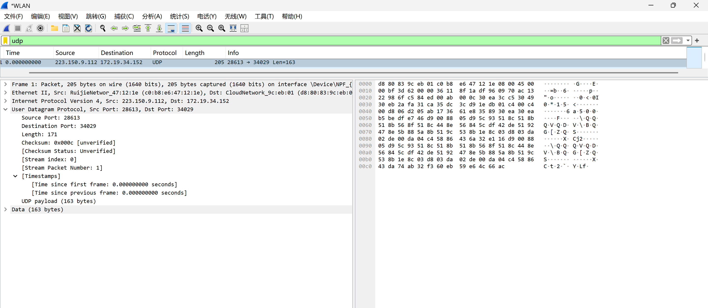
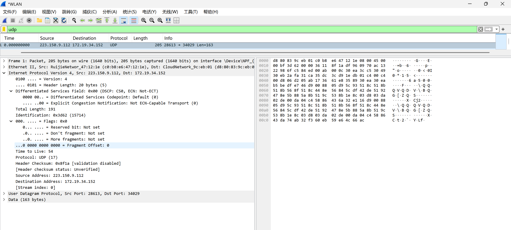
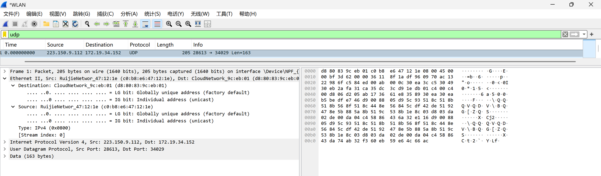
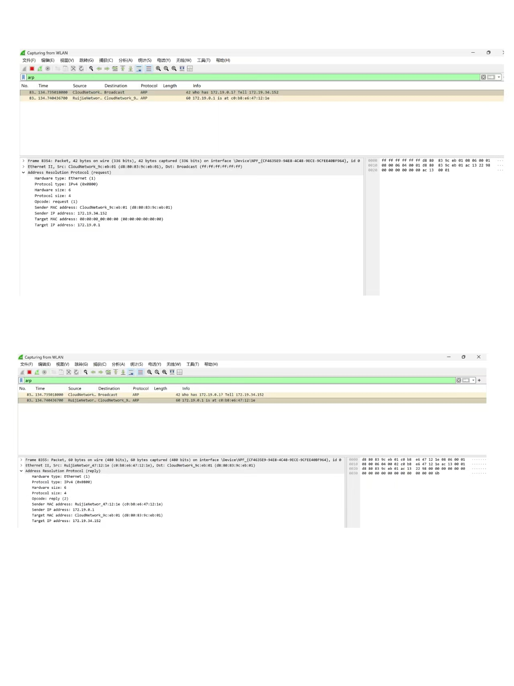
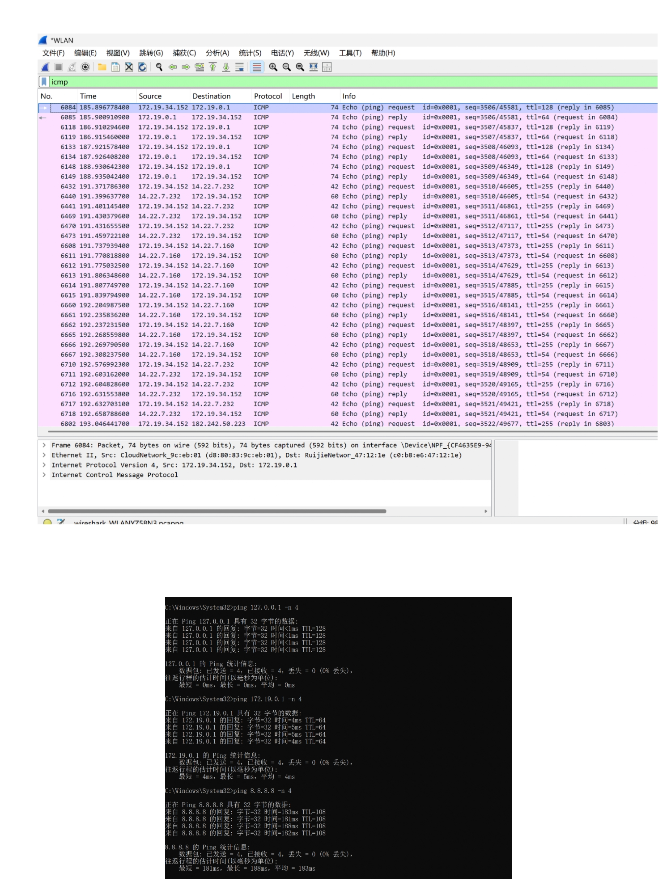

# Lab5：IP 与以太网的包收发操作

## 实验背景

本实验围绕 IP 模块与以太网在包收发过程中的角色展开，重点观察以下内容：

1. 网络包的基本结构：头部（IP 头部 + MAC 头部）与数据
2. IP 头部各字段的含义：版本号、TTL、协议号、发送方/接收方 IP 地址等
3. MAC 头部各字段的含义：接收方/发送方 MAC 地址、以太类型
4. IP 地址与 MAC 地址的区别与协作
5. ARP 协议如何通过 IP 地址查询 MAC 地址
6. 路由表的结构与查询方式
7. UDP 协议与 TCP 协议的区别：无连接、无确认、无重传
8. UDP 头部结构：发送方端口号、接收方端口号、数据长度、校验和
9. ICMP 协议的作用与常见消息类型（Echo、Destination Unreachable 等）

---

## 实验任务

### 任务一：查看路由表、ARP 缓存并启动 Wireshark

**第一步：打开 Wireshark，选择主网络接口，开始抓包**

> **注意**：本次实验必须使用真实网络接口（`en0`/`eth0`/`以太网`），不要选回环接口。回环接口不经过以太网，无法观察到 MAC 头部和 ARP 过程。

选择你的主网络接口，开始抓包。本次实验的大部分任务会共用同一次抓包。

**第二步：查看本机路由表**

```bash
# Linux
route -n
ip route show

# macOS
netstat -rn

# Windows
route print
```

截图并保存为 `route_table.png`。

**第三步：查看本机 ARP 缓存**

```bash
# Linux / macOS / Windows
arp -a
```

截图并保存为 `arp_cache.png`。

**第四步：填写下表**

从路由表和 ARP 缓存的输出中提取信息：

| 项目                         | 你的填写内容 |
| :--------------------------- | :----------- |
| 本机 IP 地址                 |172.19.34.152|
| 本机所在子网                 |172.19.0.0|
| 子网掩码                     |255.255.255.0|
| 默认网关 IP                  |172.19.0.1 |
| 默认网关 MAC 地址            |c0-b8-e6-47-12-1e|
| 本机网卡 MAC 地址            |D8-80-83-9C-EB-01 |

简答题：

1. 路由表的每一行包含哪些关键字段？教材中提到的 `Network Destination`、`Netmask`、`Gateway`、`Interface` 分别对应什么含义？
答：（1）关键字段：Network Destination（网络目标）、Netmask（网络掩码）、Gateway（网关）、Interface（接口）、Metric（跃点数 / 优先级）。
（2）各字段含义：Network Destination：表示这条路由规则对应的目标网段 / 主机地址。Netmask：子网掩码，用于和目标 IP 地址进行按位与运算，从而判断目标 IP 所属的网段，匹配对应的路由规则。Gateway：下一跳地址，即数据包需要转发到的设备 IP。如果目标 IP 和本机在同一子网，网关为 “在链路上”；如果目标 IP 在外网，网关就是默认网关 172.19.0.1。Interface：表示本机用来发送该数据包的网卡 IP 地址，即数据包从本机的哪个网口发出。


2. 当目标 IP 地址不在本子网时，包会先发给谁？路由表的哪一列提供了这个信息？
答：（1）当目标 IP 地址不在本子网（172.19.0.0/16）时，数据包会先发给默认网关，由网关负责转发到外网。（2）路由表的Gateway列提供了这个信息：当目标 IP 不匹配任何直连网段时，会匹配0.0.0.0的默认路由，该条目的Gateway列的值就是下一跳的网关 IP。


3. 路由表的默认网关（`0.0.0.0`）条目的作用是什么？什么时候会匹配到这一行？
答：（1）作用：作为路由表的 “兜底规则”，当数据包的目标 IP 地址不匹配路由表中任何其他网段规则时，就会使用这条默认路由，将数据包转发给默认网关。（2）匹配时机：当目标 IP 与本机 IP按子网掩码（255.255.0.0）做按位与运算后，结果和路由表中所有Network Destination都不匹配时，就会匹配到0.0.0.0这一行。比如访问百度（IP 不在172.19.0.0/16网段）时，就会触发这条规则。


4. 教材提到，确定发送方 IP 地址的关键在于"判断应该使用哪块网卡"。结合你查到的本机网卡信息，说明 IP 模块是如何做出这个判断的。
答：IP 模块判断逻辑如下：
(1)匹配路由条目：根据目标 IP 地址，在路由表中匹配对应的路由条目，找到该条目的Interface（本机网卡 IP）。比如目标 IP 是 172.19.34.200（同网段），会匹配172.19.0.0这条直连路由，对应的Interface是172.19.34.152。比如目标 IP 是外网地址（如百度 IP），会匹配0.0.0.0的默认路由，对应的Interface同样是172.19.34.152。
(2)选择网卡与 IP：该Interface对应的网卡（你的 MediaTek WiFi 网卡），就是数据包要从本机发出的网口；发送方 IP 地址就使用该网卡的 IP 地址172.19.34.152。


---

### 任务二：观察 UDP 头部

只要计算机处于联网状态，Wireshark 中就会持续出现大量 UDP 流量（DNS、mDNS、DHCP、NTP 等），无需手动生成。

**第一步：在 Wireshark 中设置过滤器**

```text
udp
```

**第二步：在包列表中找一个 UDP 包**

随便选一个即可。如果包太多，可以加上源或目的 IP 来缩小范围，例如 `udp && ip.addr == 你的IP`。如果需要 DNS 包，也可以用 `udp.port == 53` 过滤。

> **可选**：如果想明确看到一个完整的请求-响应对，可以在终端中执行 `nslookup example.com`，Wireshark 中就会出现对应的 DNS 请求包。

**第三步：点击选中的 UDP 包，在详情栏展开 `User Datagram Protocol`**

填写下表：

| 项目               | 你的填写内容 |
| :----------------- | :----------- |
| UDP 头部总长度     |8 字节|
| 源端口             |28613|
| 目的端口           |34029|
| 长度（Length）     |171 字节|
| 校验和（Checksum） |0x000c|

简答题：

1. 你观察到的 UDP 头部长度是多少字节？TCP 头部至少 20 字节。UDP 省略了哪些字段？这些字段的缺失带来了什么后果?
答：（1）UDP 头部长度：8 字节（UDP 头部由源端口、目的端口、长度、校验和 4 个固定字段组成，每个字段 2 字节，总计 8 字节）。
（2）UDP 省略的 TCP 头部字段：
序号（Sequence Number）、确认号（Acknowledgment Number）、标志位（SYN/ACK/FIN/RST 等）、窗口大小（Window Size）、紧急指针（Urgent Pointer）、可选字段（Options）等。
（3）缺失后果：无连接不可靠：省略序号 / 确认号 → 不保证数据包按序到达，丢包后无法重传，适用于实时性场景（如视频通话）；无流量 / 拥塞控制：省略窗口大小 → 发送方无速率限制，可能导致接收方缓冲区溢出；无连接管理：省略标志位 → 无需三次握手建立连接，通信开销小，但无法检测连接异常。


2. UDP 头部中的"长度"字段指的是什么长度？
答：本次截图中该字段值为 171 字节，即本次 UDP 数据包的头部 + 数据总长度为 171 字节。




---

### 任务三：观察 IP 头部字段

点击任务二中的同一个 UDP 包，在详情栏展开 `Internet Protocol Version 4`。

填写下表：

| 字段名称               | 你的填写内容 | 含义说明 |
| :--------------------- | :----------- | :------- |
| Version（版本号）      |4 |表示使用的是 IPv4 协议（如果是 6 则为 IPv6）。|
| Header Length（头部长度） |20 字节|IP 头部的固定长度，这里是默认的 20 字节（无额外选项字段）。单位是 4 字节，截图中显示Header Length: 20 bytes (5)，其中5表示 5 个 4 字节，即5×4=20字节。|
| Time to Live（TTL）    |54|数据包的生存时间，每经过一个路由器会减 1，防止数据包在网络中无限循环。|
| Protocol（协议号）     |17|表示 IP 层承载的上层协议，17对应 UDP 协议（截图中显示 Protocol: UDP (17)）。|
| Source Address（源 IP） |223.150.9.112 |发送该数据包的设备 IP 地址，这里是服务器 IP。|
| Destination Address（目的 IP） |172.19.34.152|接收该数据包的设备 IP 地址，这里是本机 IP。|

简答题：

1. 协议号字段的值是多少？它代表什么协议？如果抓一个 HTTP 请求的包，协议号会变成多少？
答：（1）本次截图中协议号的值是 17，代表 UDP 协议。
（2）HTTP 请求使用的是 TCP 协议，对应的协议号是 6。


2. TTL 字段的作用是什么？如果 TTL 降为 0 会发生什么？
答：（1）作用：TTL（Time to Live，生存时间）用于限制数据包在网络中的转发次数，防止数据包因路由错误在网络中无限循环。数据包每经过一个路由器，TTL 值会减 1。
（2）后果：当 TTL 降为 0 时，路由器会丢弃该数据包，并向源 IP 发送一个 ICMP 超时 报文，通知源主机数据包传输超时。


3. 有教材提到 IP 地址"实际上并不是分配给计算机的，而是分配给网卡的"。你的本机有几块网卡？每块网卡的 IP 地址分别是什么？（提示：可参考任务一中路由表的 Interface 列，或用 `ip addr`（Linux）/`ifconfig`（macOS）/`ipconfig`（Windows）查看。）
答：（1）从我之前的路由表和ipconfig输出可以看出，本机有多块网卡：
MediaTek Wi-Fi 6E MT7922 无线网卡：IP 地址 172.19.34.152
VMware Virtual Ethernet Adapter for VMnet1：IP 地址 192.168.116.1
VMware Virtual Ethernet Adapter for VMnet8：IP 地址 192.168.237.1
（2）说明：IP 地址是绑定到具体网卡上的，一台设备有多个网卡就可以有多个 IP 地址，数据包从哪个网卡发出，就使用哪个网卡的 IP 作为源 IP。


4. IP 头部中的源 IP 地址和目的 IP 地址分别是谁的地址？它们与 MAC 头部中的源/目的 MAC 地址有什么区别？
答：（1）本次数据包的源 IP 地址是 223.150.9.112（服务器 IP），目的 IP 地址是 172.19.34.152（你的本机 IP）。
（2）区别：
IP 地址：工作在网络层，用于标识端到端（主机到主机）的通信，在数据包传输过程中，源 IP 和目的 IP 始终不变。
MAC 地址：工作在数据链路层，用于标识链路层相邻节点的通信，数据包每经过一个路由器，源 / 目的 MAC 地址都会更新为当前链路的发送方和接收方 MAC 地址。




---

### 任务四：观察 MAC 头部与以太网帧

点击任务二中的同一个 UDP 包，在详情栏展开 `Ethernet II`。

填写下表：

| 字段名称               | 你的填写内容 | 含义说明 |
| :--------------------- | :----------- | :------- |
| Source（源 MAC）       |c0:b8:e6:47:12:1e|发送该以太网帧的设备 MAC 地址，这里是路由器的 LAN 口 MAC 地址。|
| Destination（目的 MAC） |d8:80:83:9c:eb:01|接收该以太网帧的设备 MAC 地址，这里是你的本机无线网卡 MAC 地址。|
| Type（以太类型）       |0x0800|表示以太网帧承载的上层协议类型，0x0800 对应 IPv4 协议。 |

关于 MAC 地址格式，填写下表：

| 项目               | 你的填写内容 |
| :----------------- | :----------- |
| MAC 地址长度       | 48 比特（6 字节） |
| 本机网卡的 MAC 地址 |d8:80:83:9c:eb:01|
| 目的 MAC 地址      |d8:80:83:9c:eb:01|
| MAC 地址的书写格式 |十六进制，用冒号（:）或连字符（-）分隔，如 d8:80:83:9c:eb:01|

简答题：

1. 以太类型字段的值是多少？它代表后面承载的是什么协议的包？
答：本次截图中以太类型字段的值是 0x0800，它代表以太网帧后面承载的是 IPv4 协议的数据包。


2. DNS 服务器的 IP 通常是外网地址。本任务中目的 MAC 地址是 DNS 服务器的 MAC 地址还是你本机网关（路由器）的 MAC 地址？为什么？
答：（1）本任务中目的 MAC 地址是我的本机无线网卡 MAC 地址，源 MAC 地址才是网关（路由器）的 MAC 地址。
（2）原因：数据包从外网服务器发出，经过路由器转发后，到达我所在的局域网时，以太网帧的源 MAC 会被替换为路由器的 LAN 口 MAC，目的 MAC 会被替换为我的本机网卡 MAC，这样局域网内的交换机才能把数据包准确交付给我的电脑。


3. IP 地址和 MAC 地址在功能上有什么相似之处？又有什么本质区别？
答：（1）相似之处：两者都用于标识网络中的设备，都是地址，用来完成数据的寻址和交付。
（2）本质区别：
工作层级不同：IP 地址工作在网络层，用于主机到主机的端到端通信；MAC 地址工作在数据链路层，用于相邻节点之间的链路层通信。
作用范围不同：IP 地址是跨网段的，在整个互联网中有效；MAC 地址仅在同一广播域（局域网）内有效。
可变性不同：IP 地址可以根据网络环境动态分配或修改；MAC 地址通常是网卡出厂时固化的，一般不会改变。


4. 为什么以太网帧中需要同时有 IP 地址（在 IP 头部中）和 MAC 地址？不能只用其中一种吗？
答：不能只用其中一种，原因如下：
（1）只用 IP 地址不行：IP 地址是逻辑地址，只标识主机，无法在局域网内完成物理交付。局域网内的交换机只识别 MAC 地址，不知道 IP 地址对应的物理位置，无法直接转发数据包。
（2）只用 MAC 地址不行：MAC 地址是物理地址，无法跨网段路由。不同局域网之间的路由器无法识别其他网段的 MAC 地址，也无法根据 MAC 地址决定转发路径。
（3）两者配合的必要性：IP 地址负责 “端到端” 的路由寻址，MAC 地址负责 “链路到链路” 的交付转发，两者结合才能完成从源主机到目的主机的完整通信过程。




---

### 任务五：观察 ARP 协议

ARP（Address Resolution Protocol，地址解析协议）用于根据 IP 地址查询 MAC 地址。只要计算机处于联网状态，Wireshark 中通常会持续出现 ARP 包（邻居发现、缓存刷新等），可以直接观察。如果抓包一段时间后仍未看到 ARP 包，再手动触发。

**第一步：在 Wireshark 中设置过滤器**

```text
arp
```

**第二步：在包列表中找 ARP 包**

正常联网的设备每隔几分钟就会自动发送 ARP 请求，等待即可。如果等了一会儿仍没有，可以选择以下任一方式手动触发：

- **方式 A（推荐）**：在终端中执行 `arping`

  ```bash
  # Linux（通常已预装）
  sudo arping -c 3 <网关IP>

  # macOS（如果没有，先执行：brew install arping）
  sudo arping -c 3 <网关IP>

  # Windows（可从 https://github.com/ThomasHabets/arping/releases 下载）
  arping -c 3 <网关IP>
  ```

- **方式 B**：先清除 ARP 缓存，再 ping 同网段地址

  ```bash
  # 清除 ARP 缓存
  # Linux:   sudo ip neigh flush all
  # macOS:   sudo arp -d -a
  # Windows: arp -d *

  # 然后 ping 网关
  ping <网关IP> -c 2
  ```

> **注意**：如果目标是 `127.0.0.1` 或外网地址，ARP 不会出现。回环接口不经过以太网，外网地址的 MAC 地址是路由器的（通常已缓存）。

**第三步：点击 ARP 请求包（Opcode 为 request），展开详情**

**第四步：填写下表**

| 项目                     | 你的填写内容 |
| :----------------------- | :----------- |
| ARP 请求的目的 MAC 地址 |ff:ff:ff:ff:ff:ff|
| ARP 请求中查询的目标 IP |172.19.0.1|
| ARP 响应中返回的 MAC 地址 |c0:b8:e6:47:12:1e|
| 该 ARP 包是自动出现还是手动触发的 | 手动触发的|

简答题：

1. ARP 请求的目的 MAC 地址为什么是 `ff:ff:ff:ff:ff:ff`（广播地址）？
答：ARP 请求的目的是根据目标 IP 查询其对应的 MAC 地址。发送方此时并不知道目标设备的 MAC 地址，因此无法进行单播发送，只能向局域网内所有设备发送广播请求，让目标 IP 对应的设备收到后，再单播回复自己的 MAC 地址。


2. 为什么 ARP 缓存中的条目会在几分钟后自动删除？
答：ARP 缓存设置自动删除（超时老化）机制，是为了保证地址映射的时效性。如果网络中的设备更换了网卡、IP 地址发生变更，旧的 ARP 缓存条目就会失效。超时删除后，系统会重新发送 ARP 请求，获取最新的 IP-MAC 映射，避免因使用过时地址导致通信失败。


3. 如果 ARP 缓存中的 MAC 地址已经过期（对方 IP 对应的设备已更换），会出现什么问题？如何解决？
答：（1）出现的问题：系统会继续向缓存中旧的 MAC 地址发送数据包，而该 MAC 地址已不再属于目标 IP 对应的设备，导致数据包无法送达，表现为ping 不通目标设备 / 网关、网络连接异常。
（2）解决方法：
等待 ARP 缓存自动超时，系统会重新发送 ARP 请求，更新映射；以管理员身份打开命令提示符，执行 arp -d * 清空 ARP 缓存，再 ping 目标 IP，强制触发新的 ARP 请求，获取最新 MAC 地址。




---

### 任务六：使用 `ping` 命令观察 ICMP

有教材提到了 ICMP（Internet Control Message Protocol）协议，它用于在 IP 层传递错误和控制信息。`ping` 命令就是基于 ICMP 的 Echo Request（类型 8）和 Echo Reply（类型 0）实现的。

**第一步：在 Wireshark 中设置 ICMP 过滤器**

```text
icmp
```

**第二步：在终端中执行 ping 命令**

```bash
# ping 本机（回环）
ping 127.0.0.1 -c 4

# ping 局域网内的设备（如路由器网关）
ping <网关IP> -c 4

# ping 外网地址
ping 8.8.8.8 -c 4
```

**第三步：在 Wireshark 中观察 ICMP 包**

填写下表：

| 目标               | 是否收到回复 | 往返时间（ms） | TTL 值 |
| :----------------- | :----------- | :------------- | :----- |
| 127.0.0.1          |是|<1ms|128 |
| 局域网设备（网关） |是|4ms|64|
| 8.8.8.8            |是|183ms|108|

> **提示**：ping 回环地址（`127.0.0.1`）时数据不经过物理网卡，Wireshark 在主网络接口上可能无法捕获到包。TTL 值可从终端输出中读取（`ping` 会显示 `ttl=...`），或切换 Wireshark 至回环接口（`lo0` / `lo`）抓包。

简答题：

1. `ping` 命令发送的是什么类型的 ICMP 消息？收到的回复又是什么类型？
答：ping 命令发送的是 ICMP Echo Request（类型 8） 消息，收到的回复是 ICMP Echo Reply（类型 0） 消息。


2. 为什么 ping 不同目标的 TTL 值不同？TTL 值反映了什么信息？
答（1）不同目标的网络路径长度（经过的路由器数量）不同。数据包每经过一个路由器转发，TTL（Time to Live，生存时间）值就会减 1，所以到达目标主机时，TTL 值会根据经过的跳数变化。
（2）TTL 值反映了数据包在网络中经过的跳数（路由器数量），也能间接推断目标主机的操作系统（例如 Windows 系统默认初始 TTL 为 128，Linux 系统为 64）。


3. 教材表 2.4 中列出了多种 ICMP 消息类型。`Destination unreachable`（类型 3）在什么情况下会出现？请用以下方法尝试触发并观察：

   ```bash
   # 方法一（推荐）：ping 同网段内一个确认不存在的 IP
   # 例如你的本机 IP 是 192.168.1.100，子网掩码 255.255.255.0，
   # 那么可以 ping 192.168.1.250（一个大概率没有被分配的地址）
   ping <同网段不存在的IP> -c 3
   
   # 方法二：向一个关闭的端口发 UDP 包，触发 ICMP Port Unreachable
   # 先在 Wireshark 中保持 icmp 过滤器，然后执行：
   # Linux / macOS
   echo "test" | nc -u -w 1 <同网段某台设备的IP> 19999
   
   # Windows（需安装 nmap：https://nmap.org/download.html）
   nmap -sU -p 19999 <同网段某台设备的IP>
   ```

   观察到类型 3 的包后，记录其 Code 值（子类型）并说明代表什么含义。
答：（1）出现场景：当 IP 数据包的目标无法送达时，路由器或目标主机会向源主机返回 ICMP 类型 3 消息，例如：
目标 IP 地址不存在（主机不可达）
目标端口未开放（端口不可达）
路由不可达（网络不可达）
（2）常见 Code 值及含义：
Code=0：网络不可达（目标网络不存在或路由错误）
Code=1：主机不可达（目标 IP 不存在）
Code=3：端口不可达（目标端口未开放，UDP 场景常见）
例如：用方法一 ping 不存在的 IP，通常会触发 Code=1（主机不可达）；用方法二向关闭的 UDP 端口发包，会触发 Code=3（端口不可达）。




---

## 问答题

1. 网络包由哪几部分构成？IP 头部和 MAC 头部分别的作用是什么？
答：（1）IP 头部：负责逻辑寻址和路由控制，包含源 IP、目的 IP、TTL、协议类型等信息，让数据包能跨网段找到目标主机。
（2）MAC 头部：负责局域网内的物理寻址和链路交付，包含源 MAC、目的 MAC、以太类型等信息，让数据包在同一广播域内被交换机正确转发。


2. IP 协议和以太网协议在网络传输中分别承担什么职责？它们是如何分工协作的？
答（1）IP 协议（网络层）：负责端到端的路由寻址，定义 IP 地址规则，决定数据包的传输路径，实现跨网段通信。
（2）以太网协议（数据链路层）：负责链路到链路的交付，定义 MAC 地址规则，让数据包在局域网内通过交换机正确转发到下一跳设备。
（3）分工协作：IP 负责 “大方向”（从 A 主机到 B 主机的路径规划），以太网负责 “每一步”（从 A 主机到路由器、路由器到下一跳设备的物理交付）。IP 包被封装在以太网帧中传输，每到一个新的链路，以太网帧的源 / 目的 MAC 会被更新，而 IP 地址始终不变，直到到达目标主机。


3. ARP 协议解决的核心问题是什么？如果不使用 ARP 缓存，网络中会出现什么情况？
答：（1）核心问题：实现IP 地址到 MAC 地址的映射，解决 “知道 IP，不知道 MAC，无法在局域网内发送数据包” 的问题。
（2）无缓存的后果：每次发送数据包前都要广播发送 ARP 请求，导致局域网内广播流量暴增，带宽被大量占用，网络效率急剧下降，甚至出现广播风暴。


4. 为什么 IP 和负责传输的网络（如以太网）要分开设计？这种设计带来了什么好处？
答：（1）原因：IP 是逻辑层协议，与底层物理传输介质无关；以太网是物理层 / 数据链路层协议，依赖硬件标准。分开设计可以实现 “网络层与链路层解耦”。
（2）好处：灵活性高：IP 可以运行在以太网、Wi-Fi、PPP 等多种不同的链路层网络上，无需修改 IP 协议本身。可扩展性强：链路层技术更新换代时（如从 100M 以太网升级到千兆以太网），上层 IP 协议不受影响。跨平台兼容：不同厂商、不同标准的链路层设备，只要支持 IP 协议，就能互联互通。


5. 网卡在发送包时会额外添加哪 3 个控制数据？它们各自的作用是什么？
答：网卡发送数据包时，会在原始数据基础上添加以太网帧头部、IP 头部（如果未封装）、FCS 校验和（若已封装，主要是以太网帧头和尾），更准确的是以太网帧的 3 个核心控制数据：
（1）源 MAC 地址：标识数据包的发送方网卡。
（2）目的 MAC 地址：标识数据包在当前链路的接收方设备。
（3）FCS 帧校验序列：对整个以太网帧进行循环冗余校验，接收方通过它判断数据在传输中是否出错。


6. 网卡接收到一个包后，需要经过哪些步骤才能将其交给操作系统？如果 FCS 校验失败会怎样？
答：（1）接收处理步骤：
网卡检查目的 MAC 地址是否为自身 MAC、广播地址或组播地址，不是则丢弃。计算 FCS 校验和，验证数据包是否损坏。校验通过后，剥去以太网帧头部和尾部，提取 IP 数据包。
根据 IP 头部的协议字段（如 TCP/UDP），将数据交给对应的上层协议处理。
（2）FCS 校验失败的后果：网卡直接丢弃该数据包，不向上层传递，也不通知发送方重传。


7. TCP 和 UDP 的核心区别是什么？请从连接管理、可靠性、效率、适用场景四个维度进行比较。
答：（1）连接管理：TCP 是面向连接的协议，通信双方必须先通过三次握手建立可靠连接，数据传输完成后还要通过四次挥手释放连接，整个过程有严格的状态管理。UDP 是无连接的协议，发送方直接向目标地址发送数据包，不需要提前建立连接，也没有连接维护和释放的过程。
（2）可靠性：TCP 提供可靠的数据传输服务，通过确认应答、超时重传、流量控制和拥塞控制等机制，保证数据有序、无重复、无丢失地到达接收方。UDP 是不可靠传输，它不保证数据包一定送达，也不保证按序到达，不提供重传和错误恢复机制，传输过程中可能出现丢包、乱序或重复。
（3）传输效率：TCP 因为有连接建立、确认应答和重传等额外开销，协议头部较大，传输效率相对较低，延迟也更高。UDP 协议头部小，没有连接建立和确认机制，传输开销极低，延迟小，传输效率更高。
（4）适用场景：TCP 适用于对数据完整性要求高、可容忍一定延迟的场景，例如文件传输、网页浏览、电子邮件等，这些场景下数据丢失或乱序会导致业务失败。UDP 适用于对实时性要求高、可容忍少量数据丢失的场景，例如在线视频、语音通话、网络游戏和 DNS 查询等，这些场景中延迟比数据完整性更重要，少量丢包不会影响整体体验。


8. UDP 适用于哪些场景？请结合教材内容解释为什么这些场景适合使用 UDP 而非 TCP。
答：UDP 适合实时性优先、可容忍少量丢包的场景，例如：
（1）音视频通话 / 直播：少量丢包只会造成短暂卡顿，TCP 的重传会导致延迟大幅增加，反而影响体验。
（2）在线游戏：实时状态同步对延迟敏感，丢包可通过后续数据包更新弥补，TCP 的确认机制会增加延迟，导致操作响应变慢。
（3）DNS 查询：单次请求 - 响应，数据量小，无需建立连接，UDP 能快速完成查询。
（4）原因：这些场景中，延迟比数据完整性更重要，UDP 的无连接特性和低延迟优势，比 TCP 的可靠性更能满足业务需求。


9. 如果一个 IP 包经过多次路由转发后 TTL 降为 0，路由器会如何处理？这与教材中提到的哪种 ICMP 消息有关？
答：（1）处理方式：路由器会直接丢弃该 IP 包，不会继续转发。
（2）关联的 ICMP 消息：路由器会向源主机发送 ICMP Time Exceeded（类型 11） 消息，通知源主机数据包因 TTL 超时被丢弃，防止数据包在网络中无限循环。


---

## 截图要求

- 截图须清晰，终端文字和 Wireshark 字段可读。
- 所有截图与本 `Lab5.md` 放在同一目录下。
- 命名规范：

| 截图内容         | 文件名               |
| :--------------- | :------------------- |
| 路由表           | `route_table.png`    |
| ARP 缓存         | `arp_cache.png`      |
| UDP 头部字段     | `udp_header.png`     |
| IP 头部字段      | `ip_header.png`      |
| 以太网帧字段     | `ethernet_frame.png` |
| ARP 请求与响应   | `arp.png`            |
| ICMP ping        | `icmp.png`           |

具体要求：

1. `route_table.png`：终端截图，显示 `route -n`（Linux）、`netstat -rn`（macOS）或 `route print`（Windows）的完整输出。

2. `arp_cache.png`：终端截图，显示 `arp -a` 的完整输出。

3. `udp_header.png`：Wireshark 截图，展开 `User Datagram Protocol`，能看到 Source Port、Destination Port、Length、Checksum。

4. `ip_header.png`：Wireshark 截图，展开 `Internet Protocol Version 4`，能看到 Version、Header Length、TTL、Protocol、Source Address、Destination Address。

5. `ethernet_frame.png`：Wireshark 截图，展开 `Ethernet II`，能看到 Source、Destination、Type。

6. `arp.png`：Wireshark 截图（若能观察到），展开 ARP 包的详情，能看到发送方的 MAC 和 IP、查询的目标 IP。

7. `icmp.png`：Wireshark 截图，能看到 ICMP Echo Request 和 Echo Reply，以及 TTL 字段。

---

## 提交要求

在自己的文件夹下新建 `Lab5/` 目录，提交以下文件：

```text
学号姓名/
└── Lab5/
    ├── Lab5.md
    ├── route_table.png
    ├── arp_cache.png
    ├── udp_header.png
    ├── ip_header.png
    ├── ethernet_frame.png
    ├── arp.png
    └── icmp.png
```

---

## 截止时间

2026-05-07，届时关于 Lab5 的 PR 请求将不会被合并。
