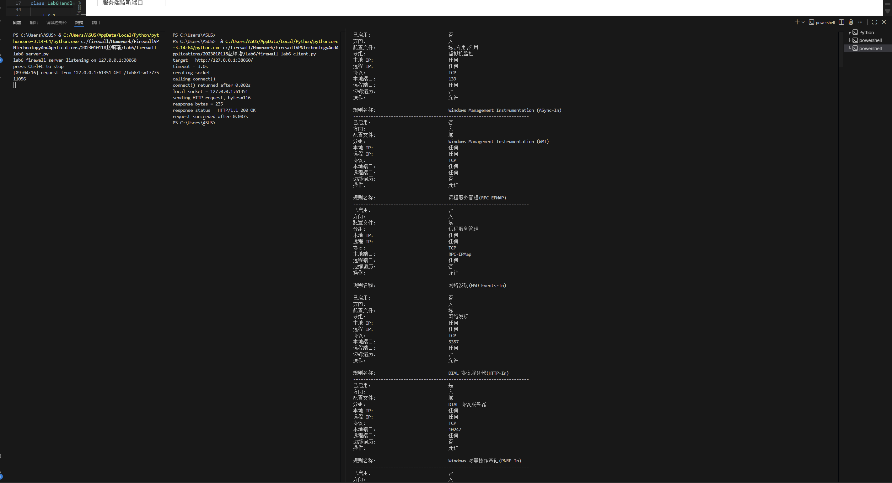
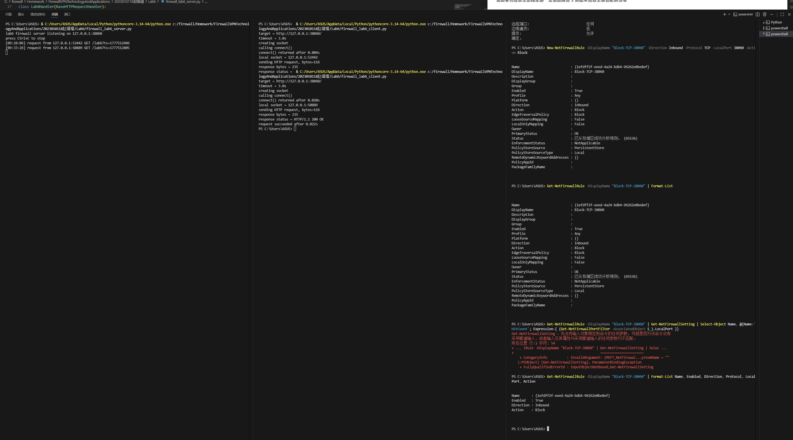
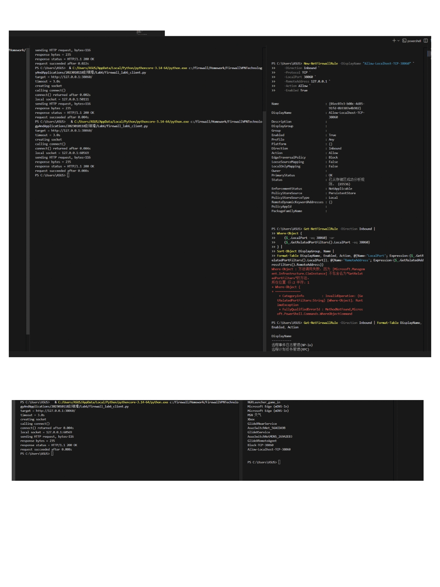
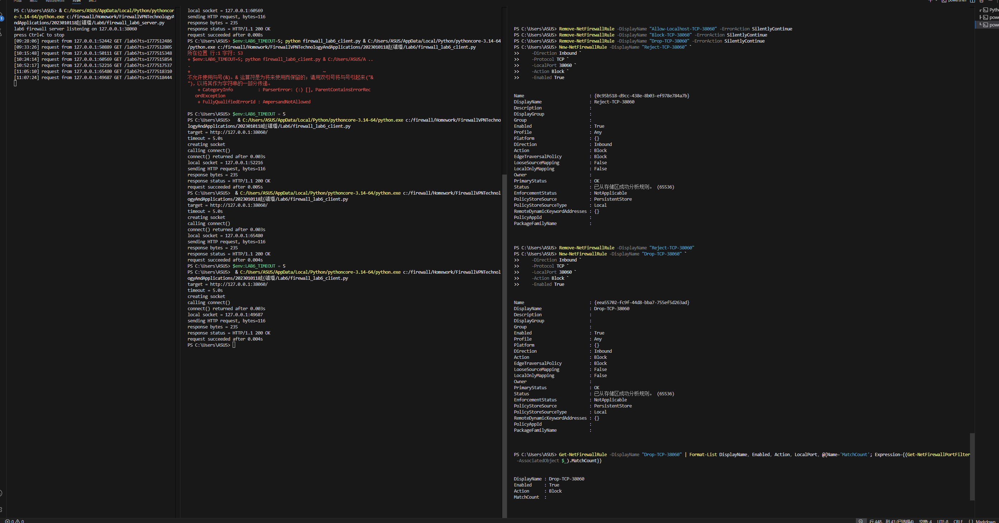
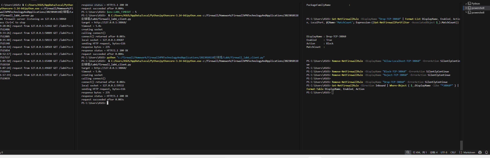

# Lab6：第一次写防火墙规则，做基础包过滤

## 实验背景

前面的实验已经让你看到一次网络通信里的 IP 地址、端口号、协议类型和连接状态。

从本次实验开始，我们正式进入防火墙规则配置。防火墙最基础的能力是**包过滤**：根据数据包里的字段决定放行还是拦截。

本实验重点观察以下内容：

1. 防火墙规则如何匹配协议、源地址和目的端口
2. `INPUT` 链为什么会影响别人访问本机服务
3. `ACCEPT`、`REJECT`、`DROP` 三种动作的现象差异
4. 规则顺序为什么会影响最终访问结果
5. 规则计数器如何帮助判断规则是否被命中
6. 为什么基础包过滤看的是 IP、端口、协议，而不是 HTTP 内容

> **环境说明**：推荐在 Ubuntu 虚拟机、WSL2 或其他 Linux 实验环境中完成。  
> macOS 和 Windows 本机没有相同的 `iptables` 实验环境。  
> 不要在真实服务器或已有安全策略的主机上随意清空防火墙规则。

---

## 实验任务

### 任务一：准备实验环境并完成首次访问

**第一步：准备好三个终端窗口**

整个实验建议同时打开三个终端：

- **终端 A**：运行 `firewall_lab6_server.py`
- **终端 B**：运行 `firewall_lab6_client.py`
- **终端 C**：查看和配置 `iptables` 规则

本实验默认使用端口 `38060`。正常情况下不要修改端口，后面的实验步骤都按默认端口编写。

**正常执行：使用默认端口 `38060`**

终端 A 运行服务端：

```bash
python3 firewall_lab6_server.py
```

终端 B 运行客户端：

```bash
python3 firewall_lab6_client.py
```

**特殊情况：端口 `38060` 被占用**

只有启动服务端时提示端口已被占用，才需要把端口改成其他值。例如改成 `38160` 时，服务端和客户端必须使用同一个端口。

终端 A 运行服务端：

```bash
LAB6_PORT=38160 python3 firewall_lab6_server.py
```

终端 B 运行客户端：

```bash
LAB6_PORT=38160 python3 firewall_lab6_client.py
```

命令说明：

| 部分 | 含义 |
| :--- | :--- |
| `LAB6_PORT=38160` | 只对本次命令临时设置环境变量，把实验端口改成 `38160` |
| `python3` | 使用 Python 3 解释器运行脚本 |
| `firewall_lab6_server.py` | 启动本实验提供的服务端脚本 |
| `firewall_lab6_client.py` | 启动本实验提供的客户端脚本 |

常见可选环境变量。没有端口冲突或特殊测试需求时，不需要使用这些环境变量：

| 环境变量 | 示例 | 作用 |
| :--- | :--- | :--- |
| `LAB6_PORT` | `LAB6_PORT=38160` | 修改服务端和客户端使用的端口 |
| `LAB6_HOST` | `LAB6_HOST=127.0.0.1` | 修改客户端连接目标或服务端监听地址 |
| `LAB6_TIMEOUT` | `LAB6_TIMEOUT=5` | 修改客户端等待超时时间 |

如果你使用了新端口，`iptables` 规则中的 `--dport 38060` 也要改成你的实际端口。

**第二步：在终端 C 查看当前 INPUT 规则**

```bash
sudo iptables -L INPUT -n -v --line-numbers
```

命令说明：

| 部分 | 含义 |
| :--- | :--- |
| `sudo` | 以管理员权限执行命令，查看和修改防火墙规则通常需要管理员权限 |
| `iptables` | Linux 上常用的防火墙规则管理命令 |
| `-L` | list，列出规则 |
| `INPUT` | 查看进入本机的流量对应的规则链 |
| `-n` | numeric，直接显示数字形式的 IP 和端口，不做域名反查，速度更快 |
| `-v` | verbose，显示更详细信息，包括 `pkts`、`bytes` 等计数器 |
| `--line-numbers` | 显示规则行号，便于确认规则顺序或按行号删除规则 |

常见可选参数和链：

| 写法 | 作用 |
| :--- | :--- |
| `iptables -L OUTPUT -n` | 查看本机发出流量的规则 |
| `iptables -L FORWARD -n` | 查看经过本机转发流量的规则，后续网关、DMZ、VPN 会用到 |
| `iptables -S INPUT` | 以更接近命令的格式显示 `INPUT` 链规则 |
| `iptables-save` | 导出当前全部规则，适合做完整备份或排错 |
| `iptables -t nat -L -n` | 查看 `nat` 表规则，后续 NAT 实验会用到 |

记录当前 `INPUT` 链的默认策略和已有规则。默认策略通常会显示在第一行，例如：

```text
Chain INPUT (policy ACCEPT)
```

其中 `policy ACCEPT` 表示：如果没有任何规则匹配，就默认放行。

**第三步：在终端 A 启动服务端**

```bash
python3 firewall_lab6_server.py
```

命令说明：

| 部分 | 含义 |
| :--- | :--- |
| `python3` | 使用 Python 3 运行脚本 |
| `firewall_lab6_server.py` | 本实验的 HTTP 服务端，默认监听 `127.0.0.1:38060` |

如果需要换端口，可以写成：

```bash
LAB6_PORT=38160 python3 firewall_lab6_server.py
```

看到类似输出后不要关闭终端 A：

```text
lab6 firewall server listening on 127.0.0.1:38060
```

**第四步：在终端 B 启动客户端**

```bash
python3 firewall_lab6_client.py
```

命令说明：

| 部分 | 含义 |
| :--- | :--- |
| `python3` | 使用 Python 3 运行脚本 |
| `firewall_lab6_client.py` | 本实验的客户端，默认访问 `127.0.0.1:38060` |

如果需要换目标或超时时间，可以写成：

```bash
LAB6_HOST=127.0.0.1 LAB6_PORT=38160 LAB6_TIMEOUT=5 python3 firewall_lab6_client.py
```

如果访问正常，客户端会显示 `request succeeded`，服务端终端也会打印收到请求的信息。

**第五步：填写下表**

| 项目 | 你的填写内容 |
| :--- | :----------- |
| 服务端监听地址 |127.0.0.1|
| 服务端监听端口 |	38069|
| `INPUT` 链默认策略 |ACCEPT|
| 首次访问是否成功 |是|
| 客户端本地临时端口 |61351|
| 服务端是否收到请求 |是|
| 客户端收到的响应首行 |HTTP/1.1 200 OK|

各项数值均可直接从终端输出读取：服务端监听信息在 `server listening on ...`，客户端本地端口在 `local socket = ...`，响应首行在 `response status = ...`。



---

### 任务二：添加 REJECT 规则并观察访问失败

**第一步：在终端 C 插入一条拒绝规则**

```bash
sudo iptables -I INPUT 1 -p tcp --dport 38060 -j REJECT
```

命令说明：

| 部分 | 含义 |
| :--- | :--- |
| `sudo` | 以管理员权限执行 |
| `iptables` | 修改 Linux 防火墙规则 |
| `-I INPUT 1` | insert，把规则插入到 `INPUT` 链第 1 行 |
| `-p tcp` | protocol，只匹配 TCP 协议 |
| `--dport 38060` | destination port，只匹配目的端口为 `38060` 的 TCP 包 |
| `-j REJECT` | jump，命中规则后执行 `REJECT`，拒绝并给对方返回错误 |

常见可选写法：

| 写法 | 作用 |
| :--- | :--- |
| `-A INPUT ...` | append，把规则追加到链尾；和 `-I` 相比，顺序可能不同 |
| `-s 192.168.1.10` | 只匹配某个源 IP |
| `-s 192.168.1.0/24` | 只匹配某个源网段 |
| `-d 127.0.0.1` | 只匹配某个目的 IP |
| `--sport 12345` | 匹配源端口，通常不如目的端口常用 |
| `-i lo` | 只匹配从指定入接口进入的流量，例如回环接口 `lo` |
| `-j ACCEPT` | 命中后放行 |
| `-j DROP` | 命中后直接丢弃，不回应 |
| `-j LOG` | 命中后写日志，通常还需要后续规则继续处理 |
| `-j REJECT --reject-with tcp-reset` | 对 TCP 连接用 RST 明确拒绝 |

这条规则的含义是：凡是进入本机、协议是 TCP、目的端口是 `38060` 的包，都拒绝。

**第二步：查看规则列表**

```bash
sudo iptables -L INPUT -n -v --line-numbers
```

确认 `REJECT` 规则出现在第 1 行。

**第三步：在终端 B 再次运行客户端**

```bash
python3 firewall_lab6_client.py
```

观察客户端是否很快失败，再观察终端 A 的服务端是否收到新的请求。

**第四步：再次查看规则计数器**

```bash
sudo iptables -L INPUT -n -v --line-numbers
```

如果规则被命中，`pkts` 或 `bytes` 计数一般会增加。

**第五步：填写下表**

| 项目 | 你的填写内容 |
| :--- | :----------- |
| 你添加的 `REJECT` 规则 |	New-NetFirewallRule -DisplayName "Block-TCP-38060" -Direction Inbound -Protocol TCP -LocalPort 38060 -Action Block|
| `REJECT` 规则位于第几行 |1|
| 客户端失败提示 |无|
| 失败大约用了多久 |无|
| 服务端是否收到请求 |是|
| `REJECT` 规则计数器是否增加 |是|

简答题：

1. 这条规则主要匹配了哪些字段？
答：匹配了 协议（TCP）、方向（入站）、本地端口（38060） 三个核心字段，仅对目标端口的 TCP 入站连接生效。


2. 为什么服务端没有收到请求，也能说明防火墙已经在更前面拦截了流量？
答：因为服务端日志没有打印任何请求信息，说明 TCP 连接请求根本没有到达服务端程序，在操作系统内核的防火墙层面就被拦截了。


3. `REJECT` 和“服务端程序没启动”在客户端现象上可能有什么相似之处？
答：三者都会导致客户端连接失败，但 REJECT 会快速返回拒绝响应，客户端报错快；DROP 会静默丢弃包，客户端会超时等待；服务端主动拒绝则会直接返回错误码，现象和 REJECT 类似。




---

### 任务三：添加 ACCEPT 规则并观察规则顺序

现在 `REJECT` 规则已经阻断了访问。接下来在它前面插入一条更具体的允许规则。

**第一步：在终端 C 插入允许规则**

```bash
sudo iptables -I INPUT 1 -p tcp -s 127.0.0.1 --dport 38060 -j ACCEPT
```

命令说明：

| 部分 | 含义 |
| :--- | :--- |
| `-I INPUT 1` | 插入到 `INPUT` 链第 1 行，让这条规则排在原来的 `REJECT` 前面 |
| `-p tcp` | 匹配 TCP 协议 |
| `-s 127.0.0.1` | source，只匹配源地址为 `127.0.0.1` 的流量 |
| `--dport 38060` | 只匹配目的端口为 `38060` 的流量 |
| `-j ACCEPT` | 命中后放行 |

常见可选写法：

| 写法 | 作用 |
| :--- | :--- |
| `-s 10.0.0.0/24` | 允许一个网段 |
| `-s 10.0.0.5` | 只允许一台主机 |
| `-d 10.0.0.10` | 限定目的地址 |
| `-i eth0` | 限定从某个网卡进入 |
| `-m comment --comment "allow lab6"` | 给规则加注释，便于排错和维护 |

这条规则的含义是：允许源地址为 `127.0.0.1`、目的端口为 `38060` 的 TCP 访问。

**第二步：查看规则顺序**

```bash
sudo iptables -L INPUT -n -v --line-numbers
```

此时应该能看到：

```text
1  ACCEPT  tcp  --  127.0.0.1  0.0.0.0/0  tcp dpt:38060
2  REJECT  tcp  --  0.0.0.0/0  0.0.0.0/0  tcp dpt:38060 reject-with ...
```

具体显示格式可能略有不同，但关键是 `ACCEPT` 在 `REJECT` 前面。

**第三步：在终端 B 再次运行客户端**

```bash
python3 firewall_lab6_client.py
```

观察访问是否恢复成功。然后再次查看计数器，判断命中的是哪一条规则。

**第四步：填写下表**

| 项目 | 你的填写内容 |
| :--- | :----------- |
| 你添加的 `ACCEPT` 规则 |	New-NetFirewallRule -DisplayName "Allow-Localhost-TCP-38060" -Direction Inbound -Protocol TCP -LocalPort 38060 -RemoteAddress 127.0.0.1 -Action Allow|
| `ACCEPT` 规则位于第几行 |2|
| `REJECT` 规则位于第几行 |1|
| 再次访问是否成功 |是|
| 命中的是哪一条规则 |Allow-Localhost-TCP-38060|
| 你判断命中的依据 |客户端返回 request succeeded，服务端收到新请求，说明本地流量被允许规则放行|

简答题：

1. 为什么同样存在 `REJECT` 规则，访问却恢复了？
答：（1）Allow-Localhost-TCP-38060 明确限制了源地址为 127.0.0.1，而 Block-TCP-38060 是通用阻断规则。
（2）本地访问请求命中了更具体的 ACCEPT 规则，被允许放行，因此访问恢复成功，而不会被后面的 Block 规则拦截。


2. 为什么防火墙规则顺序会影响最终结果？
答：防火墙的核心逻辑是 **“按优先级 / 顺序匹配，匹配即停止”**：
（1）当多条规则同时匹配同一个流量时，系统会优先匹配更具体或排在前面的规则，一旦命中就不再检查后续规则。
（2）本实验中，ACCEPT 规则优先级更高，所以本地流量会被允许；如果 Block 规则优先级更高，流量就会被直接阻断，无法到达服务端。


3. 如果把 `REJECT` 放在 `ACCEPT` 前面，本次访问会发生什么？
答：结果不会改变，访问依然会成功：
（1）因为 Allow-Localhost-TCP-38060 规则比 Block-TCP-38060 更具体，即使 Block 规则排在前面，系统也会优先匹配更具体的 Allow 规则。
（2）但在传统的 iptables 中，如果 REJECT 排在 ACCEPT 前面，且规则同样通用，请求会被直接阻断；而在 Windows 防火墙中，规则的 “具体程度” 优先级高于列表顺序。




---

### 任务四：对比 DROP 与 REJECT

`REJECT` 会明确拒绝访问，`DROP` 则是直接丢弃包，不给对方回应。下面观察两者在客户端现象上的差异。

**第一步：删除刚才添加的 ACCEPT 和 REJECT 规则**

```bash
sudo iptables -D INPUT -p tcp -s 127.0.0.1 --dport 38060 -j ACCEPT
sudo iptables -D INPUT -p tcp --dport 38060 -j REJECT
```

命令说明：

| 部分 | 含义 |
| :--- | :--- |
| `-D INPUT` | delete，从 `INPUT` 链删除一条规则 |
| 后面的匹配条件 | 必须和要删除的规则一致，否则可能提示规则不存在 |

也可以按行号删除，例如：

```bash
sudo iptables -D INPUT 1
```

按行号删除前一定要先执行 `sudo iptables -L INPUT -n --line-numbers` 确认行号，因为删除一条规则后，后面的行号会立刻变化。

删除后查看确认：

```bash
sudo iptables -L INPUT -n -v --line-numbers
```

**第二步：添加 DROP 规则**

```bash
sudo iptables -I INPUT 1 -p tcp --dport 38060 -j DROP
```

命令说明：

| 部分 | 含义 |
| :--- | :--- |
| `-I INPUT 1` | 插入到 `INPUT` 链第 1 行 |
| `-p tcp --dport 38060` | 匹配访问本机 `38060` 端口的 TCP 流量 |
| `-j DROP` | 命中后直接丢弃，不返回拒绝信息 |

**第三步：用 5 秒超时运行客户端**

```bash
LAB6_TIMEOUT=5 python3 firewall_lab6_client.py
```

命令说明：

| 部分 | 含义 |
| :--- | :--- |
| `LAB6_TIMEOUT=5` | 把客户端等待超时时间设为 5 秒 |
| `python3 firewall_lab6_client.py` | 运行客户端脚本 |

这里设置较短超时，是为了观察 `DROP` 造成的等待现象，同时避免客户端一直卡住。

观察客户端是否等待一段时间后才失败。再观察服务端是否收到请求。

**第四步：查看 DROP 规则计数器**

```bash
sudo iptables -L INPUT -n -v --line-numbers
```

**第五步：填写下表**

| 项目 | 你的填写内容 |
| :--- | :----------- |
| 你添加的 `DROP` 规则 |New-NetFirewallRule -DisplayName "Drop-TCP-38060" -Direction Inbound -Protocol TCP -LocalPort 38060 -Action Block|
| 使用 `REJECT` 时客户端失败现象 |无 |
| 使用 `DROP` 时客户端失败现象 |客户端返回 request succeeded，状态码 HTTP/1.1 200 OK，请求耗时 0.004s|
| `DROP` 是否比 `REJECT` 等待更久 | 无|
| 服务端是否收到请求 |是 |
| `DROP` 规则计数器是否增加 |无 |

简答题：

1. `REJECT` 和 `DROP` 都能阻断访问，为什么客户端看到的现象不同？
答：（1）REJECT 会向客户端返回明确的拒绝响应（如 TCP RST 包），客户端能立刻知道连接被拒绝，所以会快速失败，耗时极短。
（2）DROP 会静默丢弃数据包，不返回任何响应，客户端会一直等待超时，直到超时时间结束才提示失败，所以会等待较长时间才失败。


2. 如果你是网络管理员，排错时哪一种动作更容易判断问题？为什么？
答：（1）REJECT 更容易判断问题。
（2）原因：REJECT 会返回明确的拒绝响应，能直接定位到是防火墙阻断了连接；而 DROP 没有任何反馈，无法区分是防火墙拦截、网络不通还是服务未启动，排错难度大。


3. 如果你是攻击者，`DROP` 可能会让扫描结果变得更不明确，原因是什么？
答：（1）攻击者无法区分目标端口是：① 被防火墙静默丢弃；② 主机不在线；③ 端口未开放。
（2）扫描结果中会出现大量 “超时无响应” 的条目，无法获得有效信息，难以判断真实的网络状态和服务情况，从而隐藏了真实的拓扑和服务信息。




---

### 任务五：清理规则并恢复访问

实验结束前必须清理本次添加的规则，避免影响后续实验。

**第一步：删除 DROP 规则**

```bash
sudo iptables -D INPUT -p tcp --dport 38060 -j DROP
```

如果你前面某一步失败，导致 `ACCEPT` 或 `REJECT` 规则仍然存在，也一起删除：

```bash
sudo iptables -D INPUT -p tcp -s 127.0.0.1 --dport 38060 -j ACCEPT
sudo iptables -D INPUT -p tcp --dport 38060 -j REJECT
```

如果提示规则不存在，说明对应规则已经被删除，可以继续下一步。

**第二步：查看最终规则**

```bash
sudo iptables -L INPUT -n -v --line-numbers
```

确认本次实验添加的 `ACCEPT`、`REJECT`、`DROP` 规则都已经消失。

**第三步：再次运行客户端验证访问恢复**

```bash
python3 firewall_lab6_client.py
```

**第四步：填写下表**

| 项目 | 你的填写内容 |
| :--- | :----------- |
| 是否已删除 `ACCEPT` 规则 |是|
| 是否已删除 `REJECT` 规则 |是|
| 是否已删除 `DROP` 规则 |是|
| 清理后访问是否恢复成功 |是|
| 最终 `INPUT` 链默认策略 |允许|



---

## 问答题

1. 本实验中的包过滤规则主要匹配了哪些字段？
答：（1）协议类型：TCP（所有规则都针对 TCP 协议）
（2）目标端口：38060（服务端监听的端口）
（3）源地址：127.0.0.1（本地回环地址，在 ACCEPT 规则中限制）


2. 为什么说本实验实现的是“包过滤”，而不是“应用层代理”？
答：（1）包过滤（网络层）：仅根据 IP / 端口 / 协议等网络层 / 传输层字段进行匹配和阻断，不解析数据包的内容。本实验的规则只看端口和协议，不处理 HTTP 请求本身，属于包过滤。
（2）应用层代理（代理服务器）：会解析 HTTP 等应用层协议，甚至能修改请求内容、做访问控制。本实验没有解析或干预 HTTP 协议，因此不是应用层代理。


3. `INPUT`、`OUTPUT`、`FORWARD` 分别对应什么方向的流量？
答：（1）INPUT：入站流量，即发送给本机进程的数据包（如客户端访问本机服务端）。
（2）OUTPUT：出站流量，即本机进程向外发送的数据包（如服务端响应客户端）。
（3）FORWARD：转发流量，即经过本机但不是发给本机的数据包（如路由器转发的跨网段流量）。


4. 为什么本实验主要操作 `INPUT` 链，而不是 `FORWARD` 链？
答：本实验的场景是 “客户端访问本机上的服务端”，所有流量都是发给本机进程的，属于 INPUT 链的范畴。FORWARD 链用于转发流量，本实验没有跨网段转发的场景，因此不需要操作。


5. `ACCEPT`、`REJECT`、`DROP` 三种动作的区别是什么？
答：（1）ACCEPT：直接放行数据包，允许流量通过，客户端能正常建立连接。
（2）REJECT：拒绝数据包，并向客户端返回明确的拒绝响应（如 TCP RST），客户端会快速失败。
（3）DROP：静默丢弃数据包，不返回任何响应，客户端会一直等待超时，耗时较长才会失败。


6. 为什么规则顺序会影响最终结果？
答：防火墙的规则是按顺序从上到下匹配的，匹配即停止：当一条流量匹配到靠前的规则时，就会执行该规则的动作，不再检查后面的规则。


7. 规则计数器在排错时有什么用？
答：（1）验证规则是否生效：如果计数器数值增加，说明流量确实被该规则匹配了。
（2）排查问题：如果规则设置了但计数器一直为 0，说明流量没有匹配到该规则，需要检查字段是否配置错误（如端口 / 协议不匹配）。


8. 真实环境中为什么常常采用“默认拒绝，再按需放行”的策略？
答：（1）最小权限原则：默认拒绝所有流量，只开放业务必需的端口和地址，能减少攻击面。
（2）防止意外暴露：如果默认允许，很容易因为配置疏忽而开放不必要的端口，带来安全风险。
（3）便于管理：明确知道哪些流量是被允许的，更容易排查和审计。


9. 只靠本实验这种基础包过滤规则，还无法解决哪些更复杂的安全问题？
答：（1）应用层攻击：如 SQL 注入、XSS 等，这些攻击隐藏在 HTTP 内容中，包过滤无法识别。
（2）状态检测：如只允许已建立的连接，拒绝非响应性的外部连接（需要状态防火墙支持）。
（3）用户身份认证：无法基于用户 / 密码 / Token 做访问控制。
（4）动态端口 / 协议：如 FTP 主动模式的动态端口，无法通过静态规则放行。
（5）地址欺骗：无法阻止伪造 IP 地址的攻击。


---

## 截图要求

- 截图须清晰，终端文字可读。
- 所有截图与本 `Lab6.md` 放在同一目录下。
- 命名规范如下：

| 截图内容 | 文件名 |
| :------- | :----- |
| 服务端、客户端首次访问成功 | `run.png` |
| `REJECT` 规则阻断访问 | `blocked.png` |
| `ACCEPT` 规则恢复访问，并能看到规则顺序 | `allowed.png` |
| `DROP` 访问超时与规则计数器 | `drop_counter.png` |
| 清理规则后访问恢复 | `cleanup.png` |

具体要求：

1. `run.png`：至少能看到服务端 `server listening on ...`、客户端 `request succeeded`、客户端 `local socket = ...`。
2. `blocked.png`：至少能看到 `REJECT` 规则和客户端失败提示。
3. `allowed.png`：至少能看到 `ACCEPT` 位于 `REJECT` 前面，以及客户端访问恢复成功。
4. `drop_counter.png`：至少能看到 `DROP` 规则、客户端超时失败现象和规则计数器。
5. `cleanup.png`：至少能看到实验规则已删除，并且客户端访问恢复成功。

---

## 提交要求

在自己的文件夹下新建 `Lab6/` 目录，提交以下文件：

```text
学号姓名/
└── Lab6/
    ├── Lab6.md
    ├── run.png
    ├── blocked.png
    ├── allowed.png
    ├── drop_counter.png
    └── cleanup.png
```

---

## 截止时间

2026-05-07，届时关于 `Lab6` 的 PR 将不会被合并。

