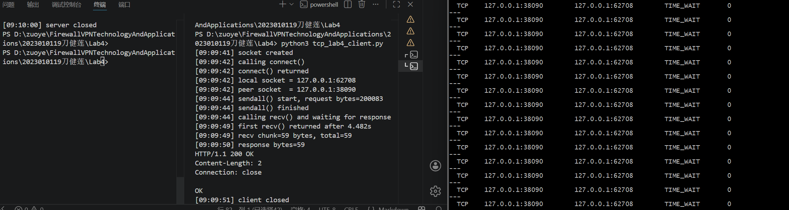
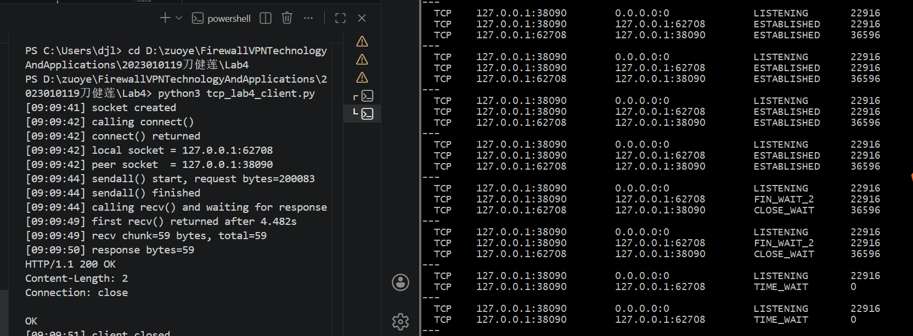
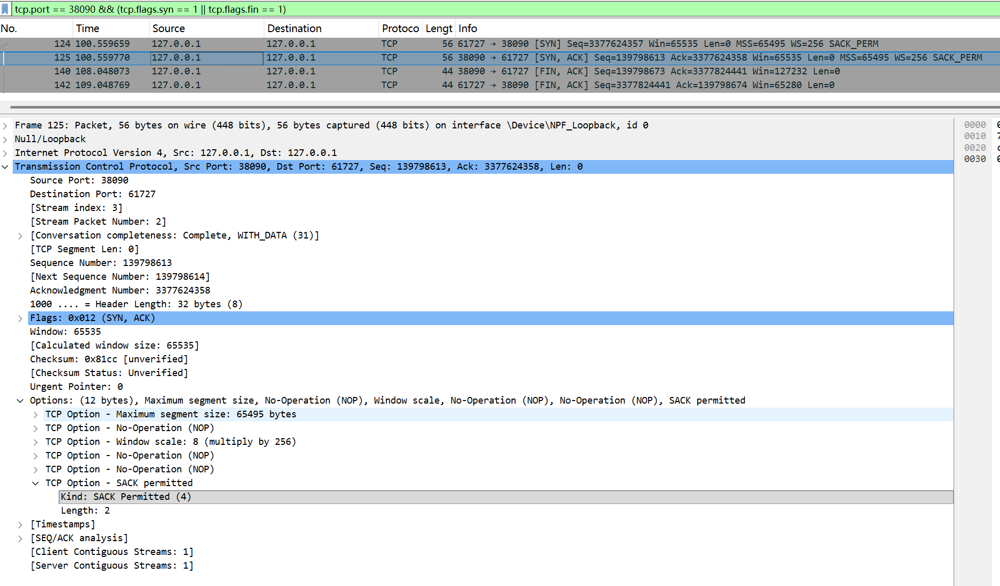
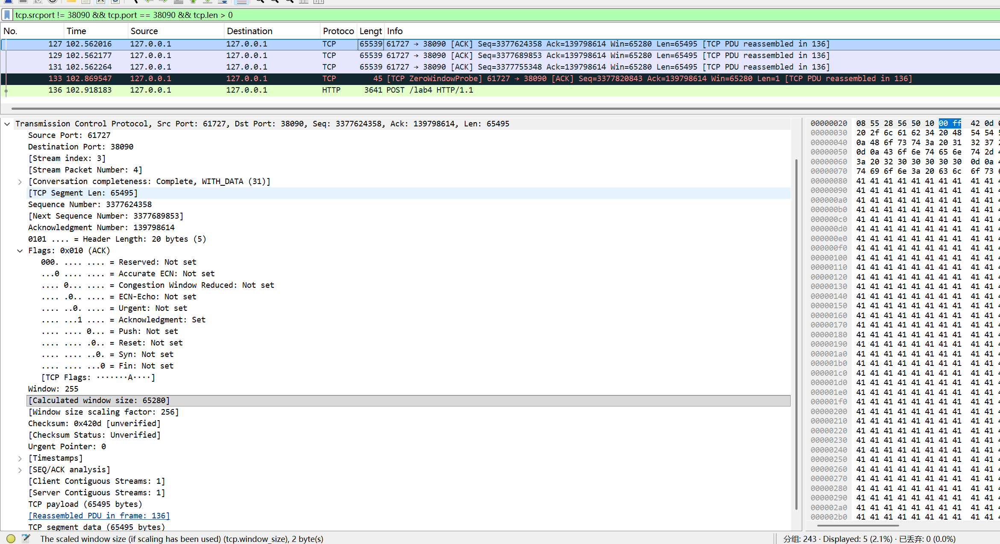
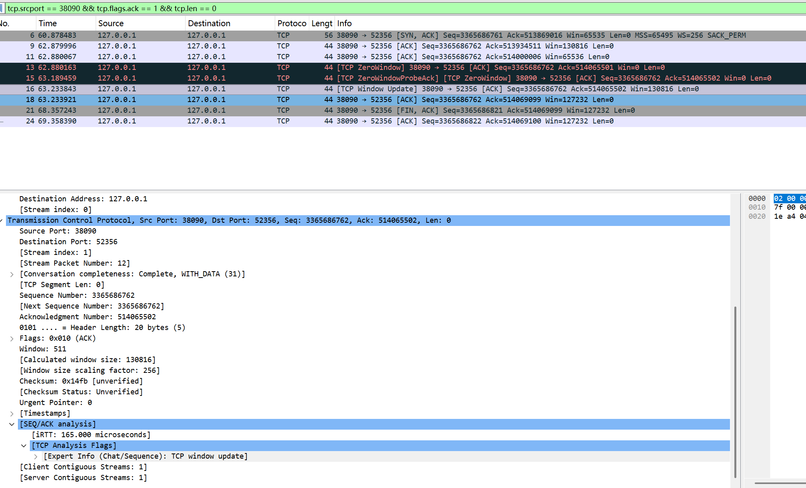

# Lab4：看见TCP 我不怕不怕啦

## 实验背景

本实验围绕一条 TCP 连接的完整生命周期展开，重点观察以下内容：

1. `socket()`、`listen()`、`accept()`、`connect()` 的职责区别
2. "连接"为什么本质上是交换控制信息而不是物理连线
3. TCP 头部中的端口号、序号、ACK 号、标志位、窗口、头部长度、可选字段
4. 三次握手如何建立收发准备
5. 应用层大块数据如何被 TCP 按 MSS 拆分
6. `Sequence Number` 与 `Acknowledgment Number` 如何配合工作
7. `recv()` 为什么会阻塞等待数据
8. 接收窗口如何反映接收方处理能力
9. ACK 与窗口更新为什么常常会被合并
10. `FIN` / `ACK` 如何完成断开
11. 为什么连接结束后套接字不会立刻删除

---

## 实验任务

### 任务一：准备实验环境并记录运行信息

**第一步：准备好四个窗口**

整个实验需要同时观察多个界面，建议在开始前把窗口布局摆好：

- **终端 A**：运行服务端
- **终端 B**：运行客户端
- **终端 C**：持续监控套接字状态（全程保持开启，不要关）
- **Wireshark**：抓包

**第二步：在终端 C 里启动持续监控**

TCP 状态变化很快，等你手动敲完 `ss` 命令再回车，状态可能已经过去了。用下面的命令让终端 C 每 0.5 秒自动刷新一次，之后只需要盯着这个窗口就行：

```bash
# Linux
watch -n 0.5 'ss -tan | grep 38090'

# macOS（没有 watch，用循环代替）
while true; do netstat -an | grep 38090; echo "---"; sleep 0.5; done

# Windows（Git Bash执行）
while true; do netstat -ano | grep 38090; echo "---"; sleep 0.5; done
```

如果你换了端口，把 `38090` 替换成实际端口。

**第三步：打开 Wireshark，选回环接口，填好过滤器，开始抓包**

回环接口在不同系统里名字不同：

| 系统 | 接口名 |
|:-----|:-------|
| Linux | `lo` |
| macOS | `lo0` |
| Windows | `Adapter for loopback traffic capture`（需提前安装 Npcap 并勾选回环支持） |

在显示过滤器里输入：


```text
tcp.port == 38090
```

然后点击开始抓包（蓝色鲨鱼鳍图标）。**先开始抓包，再运行脚本**，否则握手包会被漏掉。

**第四步：启动脚本**

```bash
# 终端 A
python3 tcp_lab4_server.py

# 终端 B（等服务端打印出 server listening on ... 后再运行）
python3 tcp_lab4_client.py
```

如果 `38090` 已被占用，两端都加环境变量换端口，同时记得把 Wireshark 过滤器和终端 C 里的端口号也改掉：

```bash
LAB4_PORT=38123 python3 tcp_lab4_server.py
LAB4_PORT=38123 python3 tcp_lab4_client.py
```

**第五步：填写下表**

| 项目                                | 你的填写内容 |
| :---------------------------------- | :----------- |
| 服务端监听地址                      |127.0.0.1|
| 服务端监听端口                      |38090|
| 客户端本地临时端口                  |52356|
| 客户端请求总字节数                  |200083|
| 服务端响应内容                      |HTTP/1.1 200 OK|
| 客户端 `connect()` 返回前后的时间点 |[10:58:56] calling connect() → [10:58:57] connect() returned|
| 客户端首次收到响应前等待了多久      |4.476s|

各项数值均可直接从终端输出读取：服务端监听信息在 `server listening on ...`，客户端本地端口在 `local socket = ...`，请求字节数在 `sendall() start, request bytes=...`，等待时间在 `first recv() returned after ...s`。



---

### 任务二：观察套接字创建与连接建立

1. 服务端启动后，观察终端 C 出现 `LISTEN` 状态，截图留存。
2. 在终端 B 里启动客户端，观察它依次打印 `socket created`、`calling connect()`、`connect() returned`。
3. 客户端打印 `connect() returned` 之后，观察终端 C 出现 `ESTABLISHED`，截图留存。脚本在 `connect()` 返回后有 2 秒停顿，这段时间足够截图。

填写下表：

| 阶段                             | 你的填写内容 |
| :------------------------------- | :----------- |
| 服务端启动、客户端未连入时的状态 | LISTEN |
| `connect()` 返回后服务端状态     |	ESTABLISHED|
| `connect()` 返回后客户端状态     |TIME_WAIT|

简答题：

1. 服务端在客户端连接前为什么处于 `LISTEN`？
服务端启动后要先进入LISTEN监听状态，才能在指定端口上等待客户端发起连接请求，完成 TCP 三次握手来建立连接，这是 TCP 服务端接收连接的必要前置步骤。


2. 为什么这时还没有真正建立 TCP 连接？
因为 LISTEN 只是服务端做好了接收连接的准备，还没收到客户端的 SYN 连接请求，也没完成 TCP 三次握手的交互，所以此时只是处于等待连接的状态，并没有真正建立起可用的 TCP 连接。


3. `socket()` 与 `connect()` 的区别是什么？
socket()只是创建一个套接字对象，相当于申请一个通信工具，不涉及网络连接；connect()是用这个套接字主动发起连接，真正完成 TCP 三次握手，建立实际通信通道。


4. 为什么 `connect()` 返回后才进入可稳定收发数据的状态？
因为connect()会执行 TCP 三次握手，只有握手全部完成，双方才确认通道建立成功，所以connect()返回后才真正进入能稳定收发数据的ESTABLISHED状态。


5. 为什么"网线一直连着"不等于"TCP 连接已经建立"？
网线连通只是物理层和数据链路层的硬件链路通了，而 TCP 连接是传输层的逻辑连接，需要通过三次握手完成双方的状态同步、序号协商等流程，物理链路通了不代表完成了 TCP 的连接建立，所以两者不能划等号。


6. 这里的"连接"更准确地说是在做什么？
这里的 “连接” 本质上是TCP 协议在两台主机之间完成三次握手，同步双方的序列号、窗口大小等状态信息，在操作系统内核中创建对应的套接字连接条目，从而建立起一条可稳定收发数据的逻辑通信链路，它是传输层的逻辑连接，而非物理链路的连通。




---

### 任务三：观察三次握手与 TCP 头部字段

**定位握手包**：在 Wireshark 过滤器里输入下面的条件，可以屏蔽中间的数据包，只留下握手和断开阶段的控制包：

```text
tcp.port == 38090 && (tcp.flags.syn == 1 || tcp.flags.fin == 1)
```

包列表最前面的三个包就是三次握手（SYN → SYN-ACK → ACK）。

**找到各字段的位置**：点击某个握手包，在下方详情栏展开 `Transmission Control Protocol`。源端口、目的端口、Seq、Ack、Flags、Window、Header Length 都在这里。TCP 选项在最底部的 `Options` 子项里，展开后可以看到 MSS、Window Scale、SACK Permitted，注意这三项只出现在带 SYN 标志的包里，纯 ACK 包里没有。

**关于序号显示**：Wireshark 默认开启相对序号，会把每个方向的初始序号归零显示，所以 SYN 包的 Seq 看起来是 `0`，而不是真实的随机大数。这是正常现象，实验报告按 Wireshark 显示的值填写即可。如果你想看真实值，可以去 `Edit → Preferences → Protocols → TCP` 里取消勾选 `Relative sequence numbers`。

填写下表：

| 报文       | 源端口 | 目的端口 | Seq  | Ack  | Flags | Window | Header Length |
| :--------- | :----- | :------- | :--- | :--- | :---- | :----- | :------------ |
| 第一次握手 |38090|61727|	139798673|3377824441|FIN, ACK|127232|44 字节|
| 第二次握手 |61727|38090|3377824441|139798674|ACK|	65280|40 字节|
| 第三次握手 |61727|38090|3377824441|139798674|	FIN, ACK|65280|44 字节|

第一次握手（SYN）的 Ack 字段在 Wireshark 里通常显示为空或 `0`，这是正常的，因为此时客户端还没有收到服务端的任何数据。Header Length 在没有选项时是 20 字节，握手包因为携带了 MSS 等选项通常是 28 或 32 字节。

| TCP 选项       | 你的填写内容 |
| :------------- | :----------- |
| MSS            |65495 bytes|
| Window Scale   |8 (multiply by 256)|
| SACK Permitted |是（已开启，Kind: 4，Length: 2）|

回环接口的 MSS 通常是 65495（因为回环 MTU 是 65536，比以太网的 1500 大得多），这会影响后续任务五里是否能观察到分段。

简答题：

1. 发送方和接收方端口号在连接阶段的作用是什么？
发送方端口号用来标识本地是哪个进程在通信，接收方端口号让操作系统知道要把数据交给哪个服务程序，两者配合才能在网络中准确找到通信双方，完成 TCP 连接的建立和数据传输。


2. TCP 头部如何帮助找到目标套接字？
TCP 头部通过携带源端口和目的端口，再结合 IP 头部的源 IP 和目的 IP 构成四元组，操作系统依靠这个唯一的四元组来匹配并找到对应的目标套接字，从而实现数据的准确投递。


3. 为什么初始序号不是简单固定从 1 开始？
如果初始序号固定从 1 开始，很容易被第三方猜测和伪造报文，还可能和历史连接的报文混淆，造成数据错乱，所以 TCP 会随机生成初始序号，主要是为了保证连接安全、避免报文冲突。


4. 为什么 TCP 可选字段更容易在连接阶段看到？
因为 TCP 可选字段（如 MSS、窗口缩放、SACK 等）主要用于连接建立时的参数协商，只有在三次握手阶段双方才会交换这些配置信息，数据传输阶段通常不再携带，所以更容易在连接阶段看到。




---

### 任务四：区分头部中的控制信息和套接字中的控制信息

用以下过滤器分别找到两类报文：

```text
# 纯控制报文（无应用数据）
tcp.port == 38090 && tcp.len == 0

# 携带应用数据的报文
tcp.port == 38090 && tcp.len > 0
```

从纯控制报文里选一个（SYN、纯 ACK 或 FIN-ACK 都可以），从数据报文里选一个（客户端发请求或服务端发响应的包）。

填写下表：

| 项目                   | 你的填写内容 |
| :--------------------- | :----------- |
| 纯控制报文的类型       |SYN, ACK|
| 携带应用数据的报文类型 |ACK|
| 头部中的控制信息举例   |Seq: 3377755348，Ack: 139798614，Window size: 65280|
| 套接字中的控制信息举例 |计算后窗口大小 (Calculated window size): 65280，窗口缩放因子 (Window size scaling factor): 256|

简答题：

1. 为什么"头部中的控制信息"和"套接字中的控制信息"不是同一件事？
头部中的控制信息是报文里带的标记，用来单次传输时告诉对方怎么做；而套接字中的控制信息是系统内核里保存的连接状态，用来长期维护这条连接，所以它们一个在数据包里、一个在系统里，不是同一件事。


---

### 任务五：观察数据分段、序号与 ACK

客户端发送的请求体是 200000 字节，超过了回环接口 MSS（约 65495 字节），因此应该可以在 Wireshark 里看到多个连续的数据段。用下面的过滤器找到客户端发出的数据包：

```text
tcp.srcport != 38090 && tcp.port == 38090 && tcp.len > 0
```

在包列表里连续选几个数据段，对比它们的 Seq 值。相邻两段的关系是：后一段的 Seq = 前一段的 Seq + 前一段的 TCP Segment Len。

找服务端返回给客户端的纯 ACK 报文：

```text
tcp.srcport == 38090 && tcp.flags.ack == 1 && tcp.len == 0
```

填写下表：

| 数据段  | Seq  | Ack  | TCP Segment Len | Flags |
| :------ | :--- | :--- | :-------------- | :---- |
| 第 1 段 |	3377624358|139798614|65495|ACK|
| 第 2 段 |3377689853|139798614|65495|ACK|
| 第 3 段 |3377755348|139798614|65495|ACK|

| ACK 报文 | Ack Number | Flags | Window |
| :------- | :--------- | :---- | :----- |
| 第 1 个  |3377689853|ACK|130816|
| 第 2 个  |3377755348|ACK|	65536|
| 第 3 个  |3377820843|ACK|	0|

| 项目                         | 你的填写内容 |
| :--------------------------- | :----------- |
| 是否发生分段                 |是 |
| 握手中观察到的 MSS           |65495 字节 |
| 单段长度与 MSS 的关系        |单段长度（65495 字节）等于MSS，大请求被拆分为多个 MSS 大小的 TCP 段传输|
| ACK 号大致确认到了第几个字节 | 第 1 个 ACK 确认到第 65495 字节，第 2 个确认到第 130990 字节，第 3 个确认到第 196485 字节|

简答题：

1. 应用程序是否直接决定每个网络包的数据长度？为什么？
应用程序不能直接决定每个网络包的数据长度。因为应用层只负责生成完整的业务数据，真正决定单个网络包数据长度的是传输层 TCP 协议，它会根据三次握手阶段协商好的 MSS，把应用层的大数据拆分成多个符合 MSS 大小的 TCP 段来发送，同时还要结合 IP 层的 MTU 限制、窗口大小等因素，最终确定每个网络包的实际数据长度，应用程序无法直接干预这个拆分过程。


2. 大块应用数据为什么会被拆分？
大块应用数据会被拆分，核心原因是TCP 协议有最大分段大小（MSS）的限制，同时网络层 IP 也有最大传输单元（MTU）的约束。


3. `MSS` 与 `MTU` 的关系是什么？
MSS（最大分段大小）和 MTU（最大传输单元）是上下层配合、相互约束的关系：MTU 是网络层 IP 协议规定的单个 IP 数据包的最大总长度（以太网默认 1500 字节），MSS 是传输层 TCP 协议规定的单个 TCP 段能承载的最大应用数据长度。TCP 会根据 MTU 计算并协商 MSS，公式为：MSS = MTU - IP头部长度（通常20字节） - TCP头部长度（通常20字节），以此保证 TCP 段封装成 IP 包后总长度不超过 MTU，避免 IP 分片。


4. "一次 `sendall()`"与"一个 TCP 包"之间是什么关系？
一次 sendall() 不一定对应一个 TCP 包，它只是应用层的发送调用，内核会根据 MSS、窗口大小等自动拆分成多个 TCP 报文段发送，二者并非一一对应。


5. 为什么 ACK 体现的是累计确认？
ACK 只确认最后一个连续收到的字节序号，代表此前所有数据都已接收，不会单独逐个确认，因此是累计确认。


6. 如果中间某一段丢失，ACK 会出现什么变化？
若中间某段数据丢失，接收方会一直**重复发送丢失位置之前的ACK确认号**，不会更新序号，直到收到丢失的报文才会把ACK往后推进。





---

### 任务六：观察 `recv()` 阻塞与窗口字段

`recv()` 的等待时间直接从客户端终端读取，`calling recv() and waiting for response` 到 `first recv() returned after ...s` 之间就是等待时长，脚本已经帮你计算好了。

在 Wireshark 里找窗口值：用过滤器 `tcp.port == 38090 && tcp.flags.ack == 1` 列出所有 ACK 包，点击其中一个，在详情栏 `Transmission Control Protocol` 里找 `Window` 字段。如果同时显示了 `Calculated window size`，优先看这个值，它已经把 Window Scale 的缩放算进去了，是对方实际能接收的字节数。

如果包列表的 Info 列出现了 `[TCP Window Update]` 标注，说明这个包的主要目的是通知对方窗口变化，重点观察它的 `Window` 字段。

填写下表：

| 项目                                   | 你的填写内容 |
| :------------------------------------- | :----------- |
| 客户端开始调用 `recv()` 的时间         |10:59:03|
| 客户端第一次收到响应的时间             |10:59:07|
| `recv()` 是否立刻返回                  |        否      |
| 首次收到响应前等待了多久               |4.476 s |
| `recv()` 等待期间连接是否已经建立      | 是             |
| 第 1 个 ACK 报文的窗口值               |   	65280           |
| 第 2 个 ACK 报文的窗口值               |     	130816         |
| 第 3 个 ACK 报文的窗口值               |   0           |
| 窗口值是否变化                         | 是             |
| 若变化，变化趋势                       |先为正常窗口值（65280→130816）→ 变为 0（ZeroWindow）→ 恢复为正常窗口值（130816→127232）|
| ACK 与窗口更新是否可以出现在同一个包中 |    是          |
| 是否看到 RTT 或 ACK 往返时间相关信息   |      是        |

简答题：

1. "连接建立"和"应用收到数据"之间是什么关系？
连接建立只是完成了TCP三次握手、通路打通，并不代表应用层已经收到数据；只有在连接建立成功之后，双方才能开始传输数据，应用程序后续才会真正接收到对方发来的内容。


2. 为什么说 `read` / `recv` 在数据未到达时会被挂起？
因为 `recv` 是阻塞读取，内核里没有收到数据时，它不会立即返回，会一直等待直到数据到达，所以进程会被挂起。


3. 窗口字段反映了接收方哪方面的能力？
窗口字段反映接收方**剩余可用缓存空间**的大小，也就是接收方还能接收多少数据的能力。


4. 为什么发送方不能无限制连续发送数据？
因为接收方有接收窗口限制，网络也存在拥塞情况，发送方必须根据接收方的窗口大小和网络状况控制发送量，不然会导致数据丢失、网络拥堵，所以不能无限制连续发数据。


5. 滑动窗口为什么既提高效率又避免压垮接收方？
因为接收方有接收窗口限制，网络也存在拥塞情况，发送方必须根据接收方的窗口大小和网络状况控制发送量，不然会导致数据丢失、网络拥堵，所以不能无限制连续发数据。


---

### 任务七：观察响应返回与双向 `seq/ack`

TCP 的 Seq/Ack 是双向独立的，客户端有自己的发送序号，服务端有自己的发送序号。用下面的过滤器只看服务端发出的数据包（源端口是 38090，有应用数据）：

```text
tcp.srcport == 38090 && tcp.len > 0
```

紧跟在服务端数据包后面的、客户端发出的 ACK 包，其 Ack Number 确认的就是服务端的发送序号。

填写下表：

| 项目                     | 你的填写内容 |
| :----------------------- | :----------- |
| 服务端响应数据报文的 Seq | 3365686762|
| 服务端响应数据报文的 Ack | 514065502|
| 客户端确认报文的 Ack     |3365686763|

简答题：

1. 为什么 TCP 的 `seq/ack` 是双向分别计算的？
因为 TCP 是全双工协议，通信双方同时扮演 “发送方” 和 “接收方” 两个角色，需要各自独立维护一套 seq/ack 来管理自己方向上的数据发送与确认。


2. 为什么双方都需要各自的初始序号？
这是因为 TCP 是全双工、面向连接、可靠传输的协议，通信双方同时承担发送方和接收方的角色，每个方向的数据流都需要独立的序号体系来保证可靠性，所以双方都要有自己的初始序号。
首先，每个方向的数据传输是独立的，发送方用自己的序号给数据编号，接收方则用确认号回应，确认自己已经收到了哪些数据。如果双方共用同一套序号，就会分不清 “这是我发出去的序号，还是对方发过来的序号”，导致传输混乱。
其次，初始序号需要随机生成，可以防止旧连接的残留报文干扰新连接。如果初始序号固定，旧连接延迟到达的报文就可能被新连接错误接收，造成数据错乱。双方各自生成独立的初始序号，也能进一步避免这种冲突。


3. 为什么发送应用数据时报文通常仍然带 `ACK`？
因为TCP是全双工通信，发送数据时顺便捎带对之前收到数据的确认，不用单独发ACK包，这样能减少报文数量、提高效率，所以发应用数据时报文通常都会带上ACK。


---

### 任务八：观察连接断开与套接字延迟删除

用下面的过滤器精确定位所有带 FIN 的包：

```text
tcp.port == 38090 && tcp.flags.fin == 1
```

通常会看到两个 FIN 包（双方各一个）。看第一个 FIN 包的源端口，就能判断谁先发起断开。

**关于 TIME-WAIT**：TIME-WAIT 只出现在主动发起关闭的一方（先发 FIN 的那端）。服务端脚本在 `conn.close()` 之后会继续运行 10 秒再退出，这段时间可以在终端 C 里观察 TIME-WAIT。Linux 上 TIME-WAIT 通常持续约 60 秒，macOS 上可能较短，如果没有观察到请如实说明。

填写下表：

| 项目                                    | 你的填写内容 |
| :-------------------------------------- | :----------- |
| 谁先发送 FIN                            |客户端（Source Port 为 38090 的一方）|
| 关闭阶段共观察到几个带 FIN 的报文       |	2 个|
| 最终 ACK 是否可见                       |可见（包含在第二次挥手的 FIN/ACK 报文中）|
| 关闭后是否观察到 `TIME-WAIT` 或等价现象 | 观察到（主动关闭的客户端进入 TIME-WAIT 状态）|

简答题：

1. 为什么关闭连接不能只发一个结束通知？
用学生视角说的话，就是因为TCP是**全双工**的，两个方向的数据传输是独立的，没法用一个通知就把两边都关了。

如果只发一个结束通知，只能保证我这边不再发数据了，但对方可能还在往我这边发数据，这些数据会因为连接突然关闭而丢失，没法可靠交付。所以必须用**四次挥手**，双方都得单独发FIN、收ACK，各自确认“我这边也没数据要发了，也收到了你的关闭请求”，这样才能安全地把双向的通道都关干净，不会丢数据。


2. 为什么连接结束后套接字不会立刻删除？
就是为了保证连接可靠关闭，同时避免旧报文干扰新连接，所以套接字不能被立刻删除。


3. 如果最后一个 ACK 丢失，而旧套接字已经立刻删除，可能带来什么问题？
如果最后一个 ACK 丢失，而旧套接字已经立刻删除，会带来两个直接问题：
（1.）被动关闭方会一直卡在 LAST-ACK 状态，它收不到对自己 FIN 的确认，会不断重传 FIN 报文，但此时主动关闭方的套接字已经删除，内核无法再接收并回应这些 FIN，被动方最终只能超时强制关闭，资源无法正常释放。
（2.）新连接可能受到干扰：如果旧套接字被立刻删除，端口很快被新连接复用，被动方重传的旧 FIN 报文可能被新连接错误接收，导致新连接异常终止，造成混乱。


---

## 问答题

1. TCP 的"连接"到底意味着什么？它为什么不是"把网线连上"？
TCP的“连接”是通信双方在操作系统内核中通过三次握手建立的逻辑通信状态与约定，包含双方同步的序号、接收窗口、收发缓存和连接状态等信息，用于保证数据可靠传输，而“把网线连上”只是物理层的通路连通，仅代表设备间能传输电信号，没有任何可靠传输的规则与状态维护，二者一个是逻辑层面的可靠通信约定，一个是物理层面的链路连通，本质完全不同。


2. 三次握手为什么能让双方进入可通信状态？
三次握手让双方互相确认了对方的收发能力正常，并且同步了初始序号，双方都知道彼此准备就绪，因此能进入可通信状态。


3. TCP 头部中的控制字段如何支撑收发数据？
TCP头部的控制字段（如ACK、SYN、FIN、PSH、RST等）用来标识报文用途、同步状态、触发确认与连接管理，让双方知道这包是握手、传数据、确认收到还是关闭连接，从而有序、可靠地支撑整个收发流程。


4. ACK、窗口、等待时间为什么会共同影响 TCP 的可靠传输？
ACK、窗口、等待时间三者协同，从可靠性、流量控制、拥塞 / 超时处理三个维度，共同支撑 TCP 的可靠传输：
ACK（确认号）：负责 “确认交付”，通过累计确认机制，告诉发送方哪些数据已被接收方收到，是实现重传、保证数据不丢不重、有序交付的核心依据。
窗口字段：负责 “流量控制”，接收方通过窗口大小告知发送方自己的接收缓存能力上限，避免发送过快压垮接收方，让收发速率匹配，保证传输的稳定性。
等待时间（超时重传时间 RTO）：负责 “异常恢复”，基于往返时间动态调整超时等待时长，超时未收到 ACK 就触发重传，解决网络丢包、延迟带来的传输中断问题。
三者缺一不可：ACK 保证 “知道哪些数据要发 / 重发”，窗口保证 “发送速率不超出接收方能力”，等待时间保证 “异常情况能及时重传恢复”，共同实现了 TCP 的可靠传输。


5. 断开连接为什么仍然需要严格的控制信息交换？
因为 TCP 是全双工可靠协议，断开时必须通过 FIN、ACK 等控制字段严格交换信息，才能确保双方都已发完数据、都确认收到对方的关闭通知，避免数据丢失或连接残留；只有完成这套双向确认，才能安全释放套接字和缓存资源，所以断开连接同样需要严格的控制信息交互。


6. 如果服务端根本没有启动，客户端调用 `connect()` 时会看到什么现象？
客户端调用 connect() 时，会发 SYN 包但一直收不到 SYN+ACK，内核会不断重传 SYN 并等待，最终超时失败，应用层会看到连接超时（Connection timed out），connect() 返回错误。


7. 如果中途人为制造丢包，ACK、重传、窗口之间会出现什么变化？
发送方迟迟收不到对应 ACK，触发超时重传，同时为避免网络进一步拥塞，会减小拥塞窗口，降低发送速率；等丢包恢复、ACK 恢复正常后，窗口才会慢慢增大，重新提高传输效率。


8. 如果把客户端发送的数据改得更大，窗口字段和分段情况会如何变化？
客户端发送的数据变大时，TCP 会按 MSS 自动分段拆分，接收窗口字段基本不变，发送方的滑动窗口会一次性占用更多序号空间。


9. 如果把服务端读取速度改得更慢，是否更容易看到窗口更新甚至零窗口？
是的，更容易看到。服务端读取变慢 → 接收缓存很快被占满 → 窗口字段会不断变小，甚至直接通告 零窗口（Zero Window），通知发送方暂时不能再发数据，直到服务端读取数据、腾出缓存后再更新窗口。


---

## 截图要求

- 截图须清晰，终端文字和 Wireshark 字段可读。
- 所有截图与本 `Lab4.md` 放在同一目录下。
- 命名规范：

| 截图内容               | 文件名                  |
| :--------------------- | :---------------------- |
| 服务端与客户端运行结果 | `run.png`               |
| `ss` 状态变化          | `states.png`            |
| 三次握手与 TCP 选项    | `handshake_header.png`  |
| 大请求分段与 MSS       | `segmentation.png`      |
| ACK 与窗口观察         | `ack_window.png`        |
| 断开与最终状态         | `teardown_timewait.png` |

具体要求：

1. `run.png`：终端截图，至少能看到服务端 `server listening on ...`、客户端 `calling connect()`、`connect() returned`、`calling recv() and waiting for response`、`first recv() returned after ...s`。

2. `states.png`：终端截图，至少能看到 `LISTEN`、`ESTABLISHED`，以及 `TIME-WAIT`（若能观察到）。推荐截 `watch` 命令的持续输出画面，可以在一张截图里同时展示多个状态的变化过程。

3. `handshake_header.png`：Wireshark 截图，至少能看到三次握手中某个包的 `Source Port`、`Destination Port`、`Sequence Number`、`Acknowledgment Number`、`Flags`、`Window`，以及 `Options` 中的 `Maximum segment size`、`Window Scale`、`SACK Permitted`。

4. `segmentation.png`：Wireshark 截图，至少能看到客户端发送数据的 TCP 包的 `TCP Segment Len`、`Seq`、`Ack`。若能观察到分段，尽量截出多个连续数据段。

5. `ack_window.png`：Wireshark 截图，至少能看到一个或多个 ACK 报文的 `Acknowledgment Number`、`Window`，以及 `Calculated window size`（若显示）、`[TCP Window Update]`（若出现）。

6. `teardown_timewait.png`：Wireshark 截图或 Wireshark 与终端截图的拼图，至少能看到带 `FIN` 的包，以及 `TIME-WAIT` 状态（若能观察到）。

---

## 提交要求

在自己的文件夹下新建 `Lab4/` 目录，提交以下文件：

```text
学号姓名/
└── Lab4/
    ├── Lab4.md
    ├── tcp_lab4_server.py
    ├── tcp_lab4_client.py
    ├── run.png
    ├── states.png
    ├── handshake_header.png
    ├── segmentation.png
    ├── ack_window.png
    └── teardown_timewait.png
```

---

## 截止时间

2026-04-23，届时关于 Lab4 的 PR 请求将不会被合并。
