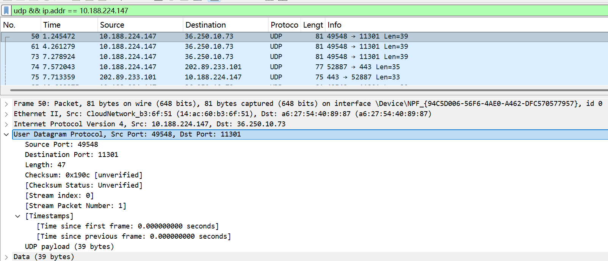
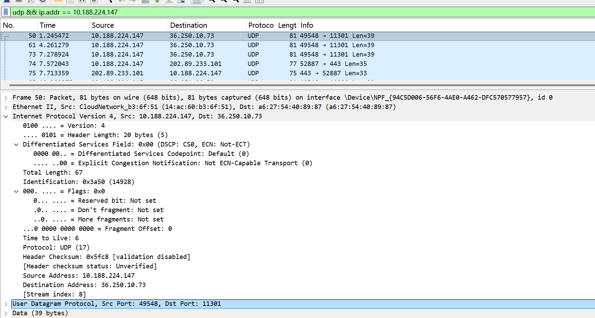
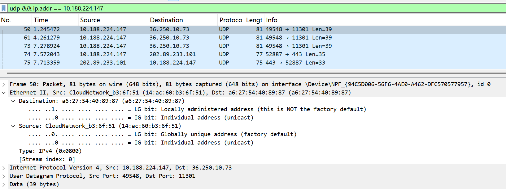
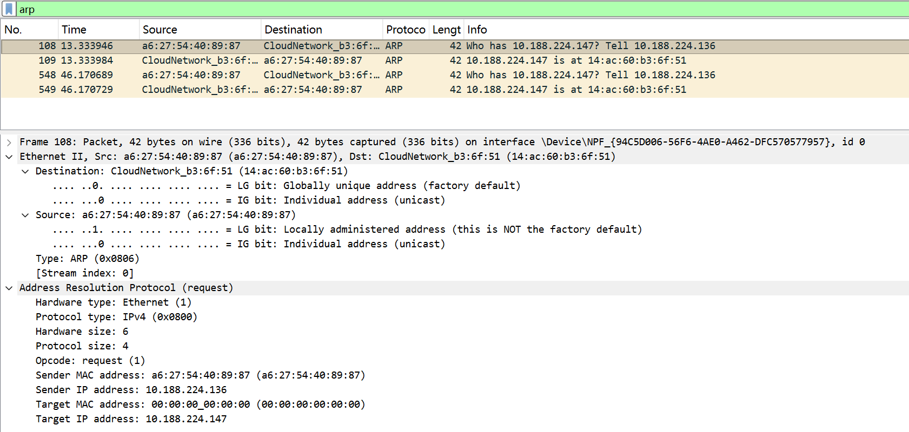

# Lab5：IP 与以太网的包收发操作

## 实验背景

本实验围绕 IP 模块与以太网在包收发过程中的角色展开，重点观察以下内容：

1. 网络包的基本结构：头部（IP 头部 + MAC 头部）与数据
2. IP 头部各字段的含义：版本号、TTL、协议号、发送方/接收方 IP 地址等
3. MAC 头部各字段的含义：接收方/发送方 MAC 地址、以太类型
4. IP 地址与 MAC 地址的区别与协作
5. ARP 协议如何通过 IP 地址查询 MAC 地址
6. 路由表的结构与查询方式
7. UDP 协议与 TCP 协议的区别：无连接、无确认、无重传
8. UDP 头部结构：发送方端口号、接收方端口号、数据长度、校验和
9. ICMP 协议的作用与常见消息类型（Echo、Destination Unreachable 等）

---

## 实验任务

### 任务一：查看路由表、ARP 缓存并启动 Wireshark

**第一步：打开 Wireshark，选择主网络接口，开始抓包**

> **注意**：本次实验必须使用真实网络接口（`en0`/`eth0`/`以太网`），不要选回环接口。回环接口不经过以太网，无法观察到 MAC 头部和 ARP 过程。

选择你的主网络接口，开始抓包。本次实验的大部分任务会共用同一次抓包。

**第二步：查看本机路由表**

```bash
# Linux
route -n
ip route show

# macOS
netstat -rn

# Windows
route print
```

截图并保存为 `route_table.png`。

**第三步：查看本机 ARP 缓存**

```bash
# Linux / macOS / Windows
arp -a
```

截图并保存为 `arp_cache.png`。

**第四步：填写下表**

从路由表和 ARP 缓存的输出中提取信息：

| 项目                         | 你的填写内容 |
| :--------------------------- | :----------- |
| 本机 IP 地址                 |10.188.224.147|
| 本机所在子网                 |10.188.224.0/24|
| 子网掩码                     |255.255.255.0|
| 默认网关 IP                  |10.188.224.136|
| 默认网关 MAC 地址            |a6-27-54-40-89-87|
| 本机网卡 MAC 地址            |	74 5d 22 96 9c 45|

简答题：

1. 路由表的每一行包含哪些关键字段？教材中提到的 `Network Destination`、`Netmask`、`Gateway`、`Interface` 分别对应什么含义？
路由表的每一行包含网络目标（`Network Destination`）、子网掩码（`Netmask`）、网关（`Gateway`）、接口（`Interface`）和跃点数（`Metric`）等关键字段：其中，`Network Destination`表示该路由规则对应的目标网络地址，用来匹配数据包的目标网段；`Netmask`与目标地址配合，确定网段的范围和网络位；`Gateway`是数据包转发的下一跳地址，直连网络时为“在链路上”，跨网段时为网关IP；`Interface`则指明数据包从本机哪个网卡接口发出。


2. 当目标 IP 地址不在本子网时，包会先发给谁？路由表的哪一列提供了这个信息？
当目标IP地址不在本子网时，数据包会先发给默认网关，路由表的`Gateway`（网关）列提供了这个信息。


3. 路由表的默认网关（`0.0.0.0`）条目的作用是什么？什么时候会匹配到这一行？
路由表中 `0.0.0.0` 对应的默认网关条目，作用是为所有无法匹配到其他具体路由条目的数据包，提供一个统一的转发出口；当目标IP地址不在本机路由表的任何直连网段、静态路由网段中时，数据包就会匹配到这一行，按该条目的网关地址转发出去。


4. 教材提到，确定发送方 IP 地址的关键在于"判断应该使用哪块网卡"。结合你查到的本机网卡信息，说明 IP 模块是如何做出这个判断的。
IP 模块是通过路由表来判断使用哪块网卡发送数据包的：当主机要发送数据包时，会根据目标 IP 地址，在路由表中逐条匹配路由条目，找到目标网段匹配度最高（子网掩码最长）的那条路由，再读取该条目中的Interface（接口）字段，这个字段对应的 IP 地址，就是要从本机发出的网卡 IP，以此确定发送方 IP 地址。


---

### 任务二：观察 UDP 头部

只要计算机处于联网状态，Wireshark 中就会持续出现大量 UDP 流量（DNS、mDNS、DHCP、NTP 等），无需手动生成。

**第一步：在 Wireshark 中设置过滤器**

```text
udp
```

**第二步：在包列表中找一个 UDP 包**

随便选一个即可。如果包太多，可以加上源或目的 IP 来缩小范围，例如 `udp && ip.addr == 你的IP`。如果需要 DNS 包，也可以用 `udp.port == 53` 过滤。

> **可选**：如果想明确看到一个完整的请求-响应对，可以在终端中执行 `nslookup example.com`，Wireshark 中就会出现对应的 DNS 请求包。

**第三步：点击选中的 UDP 包，在详情栏展开 `User Datagram Protocol`**

填写下表：

| 项目               | 你的填写内容 |
| :----------------- | :----------- |
| UDP 头部总长度     |8 字节|
| 源端口             |49548|
| 目的端口           |11301|
| 长度（Length）     |47              |
| 校验和（Checksum） |	0x190c|

简答题：

1. 你观察到的 UDP 头部长度是多少字节？TCP 头部至少 20 字节。UDP 省略了哪些字段？这些字段的缺失带来了什么后果？
观察到的 UDP 头部长度是8 字节，它省略了 TCP 里的序号、确认号、窗口大小、标志位、紧急指针、选项与填充等字段。这种省略让 UDP 协议变得极其轻量、传输延迟低，适合语音、视频这类对实时性要求高的场景；但同时也失去了可靠传输、流量控制和拥塞控制的能力，不保证数据不丢、不乱序、不重复，所有可靠性工作都要交给应用层自己处理。


2. UDP 头部中的"长度"字段指的是什么长度？
UDP 头部中的 “长度” 字段，指的是整个 UDP 报文（UDP 头部 + UDP 数据 payload）的总字节长度，其中 UDP 头部固定为 8 字节，所以它的最小值就是 8（代表没有数据的空 UDP 报文）。




---

### 任务三：观察 IP 头部字段

点击任务二中的同一个 UDP 包，在详情栏展开 `Internet Protocol Version 4`。

填写下表：

| 字段名称               | 你的填写内容 | 含义说明 |
| :--------------------- | :----------- | :------- |
| Version（版本号）      | 4|表示使用的是 IPv4 协议|
| Header Length（头部长度） | 20 bytes|表示 IP 头部的长度为 20 字节|
| Time to Live（TTL）    |6|表示数据包的存活跳数，每经过一个路由器会减 1，减到 0 时数据包会被丢弃|
| Protocol（协议号）     |17    |表示 IP 层承载的上层协议为 UDP（协议号 17）|
| Source Address（源 IP） |10.188.224.147|表示数据包的发送方 IP 地址|
| Destination Address（目的 IP） |	36.250.10.73|表示数据包的接收方 IP 地址|

简答题：

1. 协议号字段的值是多少？它代表什么协议？如果抓一个 HTTP 请求的包，协议号会变成多少？
协议号字段的值是 17，它代表 UDP 协议；如果抓一个 HTTP 请求的包，协议号会变成 6（代表 TCP 协议）。


2. TTL 字段的作用是什么？如果 TTL 降为 0 会发生什么？
TTL（Time to Live，生存时间）字段的作用是限制数据包在网络中的转发跳数，防止数据包在路由环路中无限循环，同时间接控制传输时延。
当数据包经过每一台路由器时，TTL 值会被减 1；如果 TTL 降为 0，路由器会直接丢弃该数据包，并向源主机发送一个 ICMP “超时”（Time Exceeded）报文，通知源主机数据包因跳数耗尽而被丢弃。


3. 有教材提到 IP 地址"实际上并不是分配给计算机的，而是分配给网卡的"。你的本机有几块网卡？每块网卡的 IP 地址分别是什么？（提示：可参考任务一中路由表的 Interface 列，或用 `ip addr`（Linux）/`ifconfig`（macOS）/`ipconfig`（Windows）查看。）
本机有多块网卡，常见的至少有物理网卡和虚拟网卡。从路由表 Interface 列可以看到至少两个 IP：一个是10.188.224.147，另一个是192.168.41.1，每个 IP 分别对应一块独立的网卡，这也说明 IP 地址确实是分配给网卡接口，而不是直接分配给整台计算机。


4. IP 头部中的源 IP 地址和目的 IP 地址分别是谁的地址？它们与 MAC 头部中的源/目的 MAC 地址有什么区别？
IP 头部中的源 IP 地址是发送方主机的 IP 地址，目的 IP 地址是接收方主机的 IP 地址；而 MAC 头部的源 / 目的 MAC 地址是当前链路中发送方和下一跳设备（如网关或直连主机）的物理地址。
两者的核心区别在于：IP 地址用于跨网段的端到端寻址，在数据包从源主机到目的主机的整个传输过程中，源 IP 和目的 IP 始终不变；而 MAC 地址仅用于同一网段内的链路层寻址，数据包每经过一个路由器，源 MAC 会变为当前出口网卡的 MAC，目的 MAC 会变为下一跳设备的 MAC，只有直连时目的 MAC 才是接收方主机的 MAC。




---

### 任务四：观察 MAC 头部与以太网帧

点击任务二中的同一个 UDP 包，在详情栏展开 `Ethernet II`。

填写下表：

| 字段名称               | 你的填写内容 | 含义说明 |
| :--------------------- | :----------- | :------- |
| Source（源 MAC）       |14:ac:60:b3:6f:51|发送方网卡的物理地址，即本机网卡的 MAC 地址|
| Destination（目的 MAC） |a6:27:54:40:89:87|数据包下一跳设备（默认网关）的物理地址|
| Type（以太类型）       |	0x0800|表示上层协议为 IPv4|

关于 MAC 地址格式，填写下表：

| 项目               | 你的填写内容 |
| :----------------- | :----------- |
| MAC 地址长度       | 48 比特（6 字节） |
| 本机网卡的 MAC 地址 |	14:ac:60:b3:6f:51|
| 目的 MAC 地址      |a6:27:54:40:89:87|
| MAC 地址的书写格式 |十六进制表示，每2字节用冒号分隔，如xx:xx:xx:xx:xx:xx
|

简答题：

1. 以太类型字段的值是多少？它代表后面承载的是什么协议的包？
以太类型字段的值是 0x0800，它代表后面承载的是 IPv4（Internet Protocol version 4） 协议的数据包。


2. DNS 服务器的 IP 通常是外网地址。本任务中目的 MAC 地址是 DNS 服务器的 MAC 地址还是你本机网关（路由器）的 MAC 地址？为什么？
本任务中目的 MAC 地址是本机网关（路由器）的 MAC 地址，不是 DNS 服务器的 MAC 地址。
原因是：DNS 服务器的 IP 是外网地址，与本机不在同一个子网内。根据路由规则，本机需要先把数据包发给网关，再由网关转发到外网。MAC 地址只用于同一链路（子网）内的寻址，因此在本机发出的数据包中，目的 MAC 只能是网关的 MAC，而不是远程 DNS 服务器的 MAC（两者不在同一网段，无法直接通信）。


3. IP 地址和 MAC 地址在功能上有什么相似之处？又有什么本质区别？
IP 地址和 MAC 地址的相似之处是：二者都是网络中设备的唯一标识符，都用于标识设备、实现数据的定向传输。
它们的本质区别可以用一段话概括：IP 地址是逻辑地址，用于跨网段的端到端寻址，在整个传输过程中源 / 目的 IP 始终不变，由网络层负责；而 MAC 地址是物理地址，仅用于同一链路内的节点寻址，数据包每经过一个路由器，目的 MAC 就会更新为下一跳设备的 MAC 地址，由数据链路层负责。


4. 为什么以太网帧中需要同时有 IP 地址（在 IP 头部中）和 MAC 地址？不能只用其中一种吗？
不能只用其中一种：IP 地址负责跨网段的端到端逻辑寻址，MAC 地址负责同一网段内的链路层物理寻址，二者分工配合，缺一不可。




---

### 任务五：观察 ARP 协议

ARP（Address Resolution Protocol，地址解析协议）用于根据 IP 地址查询 MAC 地址。只要计算机处于联网状态，Wireshark 中通常会持续出现 ARP 包（邻居发现、缓存刷新等），可以直接观察。如果抓包一段时间后仍未看到 ARP 包，再手动触发。

**第一步：在 Wireshark 中设置过滤器**

```text
arp
```

**第二步：在包列表中找 ARP 包**

正常联网的设备每隔几分钟就会自动发送 ARP 请求，等待即可。如果等了一会儿仍没有，可以选择以下任一方式手动触发：

- **方式 A（推荐）**：在终端中执行 `arping`

  ```bash
  # Linux（通常已预装）
  sudo arping -c 3 <网关IP>

  # macOS（如果没有，先执行：brew install arping）
  sudo arping -c 3 <网关IP>

  # Windows（可从 https://github.com/ThomasHabets/arping/releases 下载）
  arping -c 3 <网关IP>
  ```

- **方式 B**：先清除 ARP 缓存，再 ping 同网段地址

  ```bash
  # 清除 ARP 缓存
  # Linux:   sudo ip neigh flush all
  # macOS:   sudo arp -d -a
  # Windows: arp -d *

  # 然后 ping 网关
  ping <网关IP> -c 2
  ```

> **注意**：如果目标是 `127.0.0.1` 或外网地址，ARP 不会出现。回环接口不经过以太网，外网地址的 MAC 地址是路由器的（通常已缓存）。

**第三步：点击 ARP 请求包（Opcode 为 request），展开详情**

**第四步：填写下表**

| 项目                     | 你的填写内容 |
| :----------------------- | :----------- |
| ARP 请求的目的 MAC 地址 |00:00:00:00:00:00|
| ARP 请求中查询的目标 IP |10.188.224.147|
| ARP 响应中返回的 MAC 地址 |	14:ac:60:b3:6f:51|
| 该 ARP 包是自动出现还是手动触发的 | 自动出现|

简答题：

1. ARP 请求的目的 MAC 地址为什么是 `ff:ff:ff:ff:ff:ff`（广播地址）？
ARP 请求的目的 MAC 地址是广播地址ff:ff:ff:ff:ff:ff，是因为发送方不知道目标 IP 对应的 MAC 地址，需要向同一网段内的所有设备广播查询，请求目标 IP 的设备回复自己的 MAC 地址，从而完成 IP 到 MAC 的映射。


2. 为什么 ARP 缓存中的条目会在几分钟后自动删除？
ARP 缓存条目自动删除，是为了保证 IP 与 MAC 地址映射的实时性和正确性，核心原因有三点：
防止地址变化导致通信失效：设备更换网卡、IP 地址变更，或新设备复用旧 IP 时，旧的 ARP 条目会失效。定时删除能让主机重新发送 ARP 请求，获取最新的映射关系，避免数据包发往错误的 MAC 地址。
应对设备离线 / 故障场景：如果目标设备下线、故障或被移除，旧的 ARP 条目会变成 “僵尸条目”，定时清理能避免主机继续向不存在的设备发送数据，减少无效通信。
优化缓存资源占用：ARP 缓存空间有限，过期条目会占用内存，定时清理可以释放资源，让缓存始终保持活跃、有效的条目，提升查询效率。


3. 如果 ARP 缓存中的 MAC 地址已经过期（对方 IP 对应的设备已更换），会出现什么问题？如何解决？
如果 ARP 缓存中的 MAC 地址过期，会导致数据包被错误地发送到旧设备的 MAC 地址，新设备收不到数据，通信失败，因为发送方会继续使用失效的映射关系，把帧发给已经更换的设备。
解决方法：
等待 ARP 缓存超时自动更新：缓存条目到期后，系统会自动重新发送 ARP 请求，获取新设备的 MAC 地址。
手动刷新 ARP 缓存：Windows 用arp -d、Linux/macOS 用ip neigh flush清除缓存，让系统立刻重新解析 IP 对应的 MAC 地址。
主动触发 ARP 请求：向目标 IP 发送一次通信（如 ping），系统会自动发送 ARP 请求，更新缓存条目。




---

### 任务六：使用 `ping` 命令观察 ICMP

有教材提到了 ICMP（Internet Control Message Protocol）协议，它用于在 IP 层传递错误和控制信息。`ping` 命令就是基于 ICMP 的 Echo Request（类型 8）和 Echo Reply（类型 0）实现的。

**第一步：在 Wireshark 中设置 ICMP 过滤器**

```text
icmp
```

**第二步：在终端中执行 ping 命令**

```bash
# ping 本机（回环）
ping 127.0.0.1 -c 4

# ping 局域网内的设备（如路由器网关）
ping <网关IP> -c 4

# ping 外网地址
ping 8.8.8.8 -c 4
```

**第三步：在 Wireshark 中观察 ICMP 包**

填写下表：

| 目标               | 是否收到回复 | 往返时间（ms） | TTL 值 |
| :----------------- | :----------- | :------------- | :----- |
| 127.0.0.1          | 是|<1ms|128|
| 局域网设备（网关） |是 |19~139ms|64 |
| 8.8.8.8            | 是| 376~1470ms|111|

> **提示**：ping 回环地址（`127.0.0.1`）时数据不经过物理网卡，Wireshark 在主网络接口上可能无法捕获到包。TTL 值可从终端输出中读取（`ping` 会显示 `ttl=...`），或切换 Wireshark 至回环接口（`lo0` / `lo`）抓包。

简答题：

1. `ping` 命令发送的是什么类型的 ICMP 消息？收到的回复又是什么类型？
ping 命令发送的是 ICMP Echo Request（类型 8） 消息，收到的回复是 ICMP Echo Reply（类型 0） 消息。


2. 为什么 ping 不同目标的 TTL 值不同？TTL 值反映了什么信息？
不同目标的 TTL 值不同，是因为它反映了数据包从源主机到目标主机经过的路由器跳数和目标设备的初始 TTL 设置：不同操作系统默认初始 TTL 值不同（如 Windows 为 128、Linux 为 64），且数据包每经过一个路由器 TTL 会减 1，因此到达不同目标时的剩余 TTL 值自然不同；TTL 值本质上反映了数据包的传输路径长度（跳数），通过初始 TTL 与收到的 TTL 差值可推算出经过的路由器数量，也能间接帮助判断目标设备的操作系统类型和网络路径的复杂度。


3. 教材表 2.4 中列出了多种 ICMP 消息类型。`Destination unreachable`（类型 3）在什么情况下会出现？请用以下方法尝试触发并观察：

   ```bash
   # 方法一（推荐）：ping 同网段内一个确认不存在的 IP
   # 例如你的本机 IP 是 192.168.1.100，子网掩码 255.255.255.0，
   # 那么可以 ping 192.168.1.250（一个大概率没有被分配的地址）
   ping <同网段不存在的IP> -c 3
   
   # 方法二：向一个关闭的端口发 UDP 包，触发 ICMP Port Unreachable
   # 先在 Wireshark 中保持 icmp 过滤器，然后执行：
   # Linux / macOS
   echo "test" | nc -u -w 1 <同网段某台设备的IP> 19999
   
   # Windows（需安装 nmap：https://nmap.org/download.html）
   nmap -sU -p 19999 <同网段某台设备的IP>
   ```

   观察到类型 3 的包后，记录其 Code 值（子类型）并说明代表什么含义。
Destination unreachable（类型 3）ICMP 消息，会在数据包无法被送达目标主机或端口时出现，比如目标 IP 不存在、主机不可达、端口关闭或路由不可达等场景。
触发场景与对应 Code 值含义
ping 同网段不存在的 IP（方法一）
触发的通常是 Code=1（Host unreachable，主机不可达） 或 Code=3（Port unreachable，端口不可达，较少见），代表目标 IP 不存在或无设备响应，数据包无法送达主机。
向关闭的端口发 UDP 包（方法二）
触发的是 Code=3（Port unreachable，端口不可达），代表目标主机存在，但指定的 UDP 端口未被监听，数据包无法送达对应的应用程序。


---

## 问答题

1. 网络包由哪几部分构成？IP 头部和 MAC 头部分别的作用是什么？
网络包由 MAC 头部、IP 头部、传输层头部（如 TCP/UDP/ICMP）和数据载荷 四部分构成；MAC 头部负责数据链路层的本地链路寻址与帧转发，记录源 / 目的 MAC 地址，实现同一网段内的相邻设备交付；IP 头部负责网络层的跨网段端到端寻址与路由，记录源 / 目的 IP 地址，为数据包提供全局的目标定位与传输路径指引。


2. IP 协议和以太网协议在网络传输中分别承担什么职责？它们是如何分工协作的？
以太网协议属于数据链路层，负责局域网内基于MAC地址的相邻设备寻址与帧传输，完成本地链路的数据封装与转发；IP协议属于网络层，负责基于IP地址实现跨网段的逻辑寻址、路由选择与数据包分片，实现全网范围的端到端通信。二者分层协作，IP协议提供全局的目标寻址与路由路径，以太网协议负责单段链路的逐跳交付，上层数据先封装IP头部再封装以太网头部，依靠两层地址配合，完成数据从源主机到目的主机的完整传输。


3. ARP 协议解决的核心问题是什么？如果不使用 ARP 缓存，网络中会出现什么情况？
ARP 协议核心解决已知 IP 地址，查询对应 MAC 地址的地址解析问题，实现网络层 IP 与链路层 MAC 的映射。若无 ARP 缓存，每次通信都要广播发送 ARP 请求，会大幅增加局域网广播流量，造成网络拥堵、通信效率大幅下降


4. 为什么 IP 和负责传输的网络（如以太网）要分开设计？这种设计带来了什么好处？
IP 与以太网分层分开设计，为实现网络层与底层链路技术解耦，使 IP 协议不依赖以太网等特定物理网络；好处是 IP 可兼容以太网、无线等多种底层网络，上层应用无需改动就能跨不同链路通信，同时路由转发逻辑统一，网络拓展与维护更灵活。


5. 网卡在发送包时会额外添加哪 3 个控制数据？它们各自的作用是什么？
网卡发送数据包时会额外添加MAC 头部、FCS 尾部、帧间隙控制信息：MAC 头部存放源目 MAC 地址与类型字段，实现链路层寻址与协议识别；FCS 校验和用于检测传输中的数据错误；帧间隙用来隔离连续数据帧，避免帧冲突、保障链路稳定传输。


6. 网卡接收到一个包后，需要经过哪些步骤才能将其交给操作系统？如果 FCS 校验失败会怎样？
网卡接收帧后，先通过 FCS 校验，校验合法则剥离帧尾与 MAC 头部，核对目的 MAC 是否为本机或广播 MAC，匹配成功后解析上层协议，将数据上交系统协议栈处理；若 FCS 校验失败，网卡直接丢弃该损坏数据包，不再向上提交。


7. TCP 和 UDP 的核心区别是什么？请从连接管理、可靠性、效率、适用场景四个维度进行比较。
TCP 面向有连接、可靠传输，通过确认、重传、拥塞控制保障数据完整有序，传输开销大、效率较低，适用于文件传输、网页浏览等对数据可靠要求高的场景；UDP 面向无连接、不可靠传输，无额外校验与控制机制，开销小、传输效率高、延迟低，适用于视频通话、直播、游戏等注重实时性、可容忍少量丢包的场景。


8. UDP 适用于哪些场景？请结合教材内容解释为什么这些场景适合使用 UDP 而非 TCP。
UDP 适用于实时音视频、网络直播、在线游戏、DNS 查询等场景，UDP 无连接、开销小、延迟低，不保证可靠传输，允许少量丢包；这类场景更看重实时性，少量数据丢失不会影响整体使用体验，若使用 TCP，连接建立、确认重传、拥塞控制等机制会增加延迟与开销，造成卡顿、延时过高，反而不适配业务需求。


9. 如果一个 IP 包经过多次路由转发后 TTL 降为 0，路由器会如何处理？这与教材中提到的哪种 ICMP 消息有关？
当 IP 包 TTL 减为 0 时，路由器会直接丢弃该数据包，并向源主机发送ICMP 超时报文，对应 ICMP时间超过类型（类型 11），以此告知发送方数据包因路由跳数超限无法到达目的地。


---

## 截图要求

- 截图须清晰，终端文字和 Wireshark 字段可读。
- 所有截图与本 `Lab5.md` 放在同一目录下。
- 命名规范：

| 截图内容         | 文件名               |
| :--------------- | :------------------- |
| 路由表           | `route_table.png`    |
| ARP 缓存         | `arp_cache.png`      |
| UDP 头部字段     | `udp_header.png`     |
| IP 头部字段      | `ip_header.png`      |
| 以太网帧字段     | `ethernet_frame.png` |
| ARP 请求与响应   | `arp.png`            |
| ICMP ping        | `icmp.png`           |

具体要求：

1. `route_table.png`：终端截图，显示 `route -n`（Linux）、`netstat -rn`（macOS）或 `route print`（Windows）的完整输出。

2. `arp_cache.png`：终端截图，显示 `arp -a` 的完整输出。

3. `udp_header.png`：Wireshark 截图，展开 `User Datagram Protocol`，能看到 Source Port、Destination Port、Length、Checksum。

4. `ip_header.png`：Wireshark 截图，展开 `Internet Protocol Version 4`，能看到 Version、Header Length、TTL、Protocol、Source Address、Destination Address。

5. `ethernet_frame.png`：Wireshark 截图，展开 `Ethernet II`，能看到 Source、Destination、Type。

6. `arp.png`：Wireshark 截图（若能观察到），展开 ARP 包的详情，能看到发送方的 MAC 和 IP、查询的目标 IP。

7. `icmp.png`：Wireshark 截图，能看到 ICMP Echo Request 和 Echo Reply，以及 TTL 字段。

---

## 提交要求

在自己的文件夹下新建 `Lab5/` 目录，提交以下文件：

```text
学号姓名/
└── Lab5/
    ├── Lab5.md
    ├── route_table.png
    ├── arp_cache.png
    ├── udp_header.png
    ├── ip_header.png
    ├── ethernet_frame.png
    ├── arp.png
    └── icmp.png
```

---

## 截止时间

2026-05-07，届时关于 Lab5 的 PR 请求将不会被合并。
