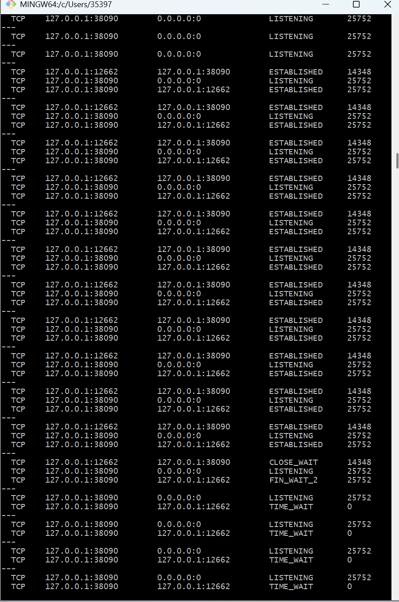
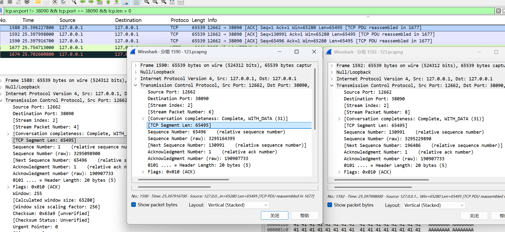

# Lab4：看见TCP 我不怕不怕啦

## 实验背景

本实验围绕一条 TCP 连接的完整生命周期展开，重点观察以下内容：

1. `socket()`、`listen()`、`accept()`、`connect()` 的职责区别
2. "连接"为什么本质上是交换控制信息而不是物理连线
3. TCP 头部中的端口号、序号、ACK 号、标志位、窗口、头部长度、可选字段
4. 三次握手如何建立收发准备
5. 应用层大块数据如何被 TCP 按 MSS 拆分
6. `Sequence Number` 与 `Acknowledgment Number` 如何配合工作
7. `recv()` 为什么会阻塞等待数据
8. 接收窗口如何反映接收方处理能力
9. ACK 与窗口更新为什么常常会被合并
10. `FIN` / `ACK` 如何完成断开
11. 为什么连接结束后套接字不会立刻删除

---

## 实验任务

### 任务一：准备实验环境并记录运行信息

**第一步：准备好四个窗口**

整个实验需要同时观察多个界面，建议在开始前把窗口布局摆好：

- **终端 A**：运行服务端
- **终端 B**：运行客户端
- **终端 C**：持续监控套接字状态（全程保持开启，不要关）
- **Wireshark**：抓包

**第二步：在终端 C 里启动持续监控**

TCP 状态变化很快，等你手动敲完 `ss` 命令再回车，状态可能已经过去了。用下面的命令让终端 C 每 0.5 秒自动刷新一次，之后只需要盯着这个窗口就行：

```bash
# Linux
watch -n 0.5 'ss -tan | grep 38090'

# macOS（没有 watch，用循环代替）
while true; do netstat -an | grep 38090; echo "---"; sleep 0.5; done

# Windows（Git Bash执行）
while true; do netstat -ano | grep 38090; echo "---"; sleep 0.5; done
```

如果你换了端口，把 `38090` 替换成实际端口。

**第三步：打开 Wireshark，选回环接口，填好过滤器，开始抓包**

回环接口在不同系统里名字不同：

| 系统 | 接口名 |
|:-----|:-------|
| Linux | `lo` |
| macOS | `lo0` |
| Windows | `Adapter for loopback traffic capture`（需提前安装 Npcap 并勾选回环支持） |

在显示过滤器里输入：

```text
tcp.port == 38090
```

然后点击开始抓包（蓝色鲨鱼鳍图标）。**先开始抓包，再运行脚本**，否则握手包会被漏掉。

**第四步：启动脚本**

```bash
# 终端 A
python3 tcp_lab4_server.py

# 终端 B（等服务端打印出 server listening on ... 后再运行）
python3 tcp_lab4_client.py
```

如果 `38090` 已被占用，两端都加环境变量换端口，同时记得把 Wireshark 过滤器和终端 C 里的端口号也改掉：

```bash
LAB4_PORT=38123 python3 tcp_lab4_server.py
LAB4_PORT=38123 python3 tcp_lab4_client.py
```

**第五步：填写下表**

| 项目                                | 你的填写内容 |
| :---------------------------------- | :----------- |
| 服务端监听地址                      |       127.0.0.1       |
| 服务端监听端口                      |      38090        |
| 客户端本地临时端口                  |   12662           |
| 客户端请求总字节数                  |   200083           |
| 服务端响应内容                      |   HTTP/1.1 200 OK    |
| 客户端 `connect()` 返回前后的时间点 |    09:04:50           |
| 客户端首次收到响应前等待了多久      |     4.563s         |

各项数值均可直接从终端输出读取：服务端监听信息在 `server listening on ...`，客户端本地端口在 `local socket = ...`，请求字节数在 `sendall() start, request bytes=...`，等待时间在 `first recv() returned after ...s`。


---

### 任务二：观察套接字创建与连接建立

1. 服务端启动后，观察终端 C 出现 `LISTEN` 状态，截图留存。
2. 在终端 B 里启动客户端，观察它依次打印 `socket created`、`calling connect()`、`connect() returned`。
3. 客户端打印 `connect() returned` 之后，观察终端 C 出现 `ESTABLISHED`，截图留存。脚本在 `connect()` 返回后有 2 秒停顿，这段时间足够截图。

填写下表：

| 阶段                             | 你的填写内容 |
| :------------------------------- | :----------- |
| 服务端启动、客户端未连入时的状态 |     LISTENING            |
| `connect()` 返回后服务端状态     |    ESTABLISHED           |
| `connect()` 返回后客户端状态     |    ESTABLISHED         |

简答题：

1. 服务端在客户端连接前为什么处于 `LISTEN`？

服务端调用 listen() 后，操作系统会在内核中为该端口创建一个监听队列。这表示服务端已经准备好，被动等待接收来自客户端的 TCP 连接请求。

2. 为什么这时还没有真正建立 TCP 连接？

因为此时客户端还没有发起连接（尚未发送 SYN 报文），双方没有进行三次握手交换控制信息，操作系统还没有为具体的连接分配专用的资源。
3. `socket()` 与 `connect()` 的区别是什么？

socket() 只是在本地操作系统中申请并分配了一个套接字结构（文件描述符），没有网络交互；connect() 则是主动向远端目标发起 TCP 的三次握手流程，是建立网络逻辑连接的动作。


4. 为什么 `connect()` 返回后才进入可稳定收发数据的状态？

connect() 是阻塞的，它的成功返回意味着底层的三次握手已经完成，双方互相确认了初始序列号、窗口大小等核心参数，此时 ESTABLISHED 状态确立，方可可靠传输数据。

5. 为什么"网线一直连着"不等于"TCP 连接已经建立"？

网线连着只代表物理层和数据链路层连通。TCP 是传输层协议，它的"连接"是一种基于状态机的逻辑连接，需要双方内核维护变量（如 Seq、Ack、缓冲区），不进行握手协商就不是 TCP 连接。

6. 这里的"连接"更准确地说是在做什么？

是在通信双方的操作系统内核中，互相交换初始状态（控制参数），并为接下来的数据传输各自预留所需的内存资源（如发送/接收缓冲区、计时器等）。



---

### 任务三：观察三次握手与 TCP 头部字段

**定位握手包**：在 Wireshark 过滤器里输入下面的条件，可以屏蔽中间的数据包，只留下握手和断开阶段的控制包：

```text
tcp.port == 38090 && (tcp.flags.syn == 1 || tcp.flags.fin == 1)
```

包列表最前面的三个包就是三次握手（SYN → SYN-ACK → ACK）。

**找到各字段的位置**：点击某个握手包，在下方详情栏展开 `Transmission Control Protocol`。源端口、目的端口、Seq、Ack、Flags、Window、Header Length 都在这里。TCP 选项在最底部的 `Options` 子项里，展开后可以看到 MSS、Window Scale、SACK Permitted，注意这三项只出现在带 SYN 标志的包里，纯 ACK 包里没有。

**关于序号显示**：Wireshark 默认开启相对序号，会把每个方向的初始序号归零显示，所以 SYN 包的 Seq 看起来是 `0`，而不是真实的随机大数。这是正常现象，实验报告按 Wireshark 显示的值填写即可。如果你想看真实值，可以去 `Edit → Preferences → Protocols → TCP` 里取消勾选 `Relative sequence numbers`。

填写下表：

| 报文       | 源端口 | 目的端口 | Seq  | Ack  | Flags | Window | Header Length |
| :--------- | :----- | :------- | :--- | :--- | :---- | :----- | :------------ |
| 第一次握手 |   12662     |   38090       |   0   |   0   |   0x002 (SYN)    |   65535     |     32 bytes (8)          |
| 第二次握手 |   38090     |   12662       |   0   |   1   |   0x012 (SYN, ACK)    |   65535    |  32 bytes (8)         |
| 第三次握手 |   12662     |    38090      |   1  |    1   |    0x010 (ACK)    |   255     |    20 bytes (5)           |

第一次握手（SYN）的 Ack 字段在 Wireshark 里通常显示为空或 `0`，这是正常的，因为此时客户端还没有收到服务端的任何数据。Header Length 在没有选项时是 20 字节，握手包因为携带了 MSS 等选项通常是 28 或 32 字节。

| TCP 选项       | 你的填写内容 |
| :------------- | :----------- |
| MSS            |    65495          |
| Window Scale   |    8          |
| SACK Permitted |    1          |

回环接口的 MSS 通常是 65495（因为回环 MTU 是 65536，比以太网的 1500 大得多），这会影响后续任务五里是否能观察到分段。

简答题：

1. 发送方和接收方端口号在连接阶段的作用是什么？
结合源 IP 和目的 IP，共同组成唯一的“四元组”，用于在两台主机的应用层进程之间建立精确的多路复用和分发通道。

2. TCP 头部如何帮助找到目标套接字？
操作系统的网络栈收到数据包后，会解析 TCP 头部中的“目的端口号”，然后在内核的套接字映射表中查找处于监听状态或已建立连接的对应进程，将数据放入其接收缓冲区。


3. 为什么初始序号不是简单固定从 1 开始？
为了安全性（防止伪造 TCP 包注入连接）和可靠性（防止网络中延迟的、旧连接产生的“幽灵包”与新连接的数据混淆）。


4. 为什么 TCP 可选字段更容易在连接阶段看到？
像 MSS、窗口缩放比例等参数属于连接的全局基础配置，只需要在连接建立初期的 SYN 报文中协商一次即可。数据传输阶段不再携带，以节省带宽和头部开销。


---

### 任务四：区分头部中的控制信息和套接字中的控制信息

用以下过滤器分别找到两类报文：

```text
# 纯控制报文（无应用数据）
tcp.port == 38090 && tcp.len == 0

# 携带应用数据的报文
tcp.port == 38090 && tcp.len > 0
```

从纯控制报文里选一个（SYN、纯 ACK 或 FIN-ACK 都可以），从数据报文里选一个（客户端发请求或服务端发响应的包）。

填写下表：

| 项目                   | 你的填写内容 |
| :--------------------- | :----------- |
| 纯控制报文的类型       |    ACK（确认报文）                            |
| 携带应用数据的报文类型 |    数据报文（如客户端请求 / 服务端响应）      |
| 头部中的控制信息举例   |    Seq、Ack、Flags、Window                 |
| 套接字中的控制信息举例 |    源 IP、源端口、目的 IP、目的端口          |

简答题：

1. 为什么"头部中的控制信息"和"套接字中的控制信息"不是同一件事？
“头部中的控制信息”是在物理网络中实际传输的协议字段，用于两端之间的通信和协商；而“套接字中的控制信息”是操作系统为了维护这个连接，在其本地内存（内核）中分配和记录的数据结构与状态机变量，它只存在于端系统内部。
 


---

### 任务五：观察数据分段、序号与 ACK

客户端发送的请求体是 200000 字节，超过了回环接口 MSS（约 65495 字节），因此应该可以在 Wireshark 里看到多个连续的数据段。用下面的过滤器找到客户端发出的数据包：

```text
tcp.srcport != 38090 && tcp.port == 38090 && tcp.len > 0
```

在包列表里连续选几个数据段，对比它们的 Seq 值。相邻两段的关系是：后一段的 Seq = 前一段的 Seq + 前一段的 TCP Segment Len。

找服务端返回给客户端的纯 ACK 报文：

```text
tcp.srcport == 38090 && tcp.flags.ack == 1 && tcp.len == 0
```

填写下表：

| 数据段  | Seq  | Ack  | TCP Segment Len | Flags |
| :------ | :--- | :--- | :-------------- | :---- |
| 第 1 段 |  1         |  1   |   65495        |  0x010 (ACK)     |
| 第 2 段 |  65496     |  1    |   65495        |  0x010 (ACK)     |
| 第 3 段 |  130991    |  1    |   65495        |  0x010 (ACK)     |

| ACK 报文 | Ack Number | Flags | Window |
| :------- | :--------- | :---- | :----- |
| 第 1 个  |  65496       |  0x010 (ACK)     |   511     |
| 第 2 个  |  130991      |  0x010 (ACK)     |   256     |
| 第 3 个  |  200084      |  0x010 (ACK)     |   497     |

| 项目                         | 你的填写内容 |
| :--------------------------- | :----------- |
| 是否发生分段                 |     是                                 |
| 握手中观察到的 MSS           |     65495                              |
| 单段长度与 MSS 的关系        |     基本等于 MSS（每段约 65495 字节）    |
| ACK 号大致确认到了第几个字节 |      65496、130991、200084              |

简答题：

1. 应用程序是否直接决定每个网络包的数据长度？为什么？
不决定。应用程序（如 Python 脚本）只是将数据按块推入套接字的发送缓冲区，底层的 TCP 协议栈会根据网络路径的 MTU 和对方的 MSS 动态决定如何切分物理包。


2. 大块应用数据为什么会被拆分？
因为底层的数据链路层（如以太网）有最大传输单元（MTU）的物理限制。如果数据过大，不仅会引发 IP 层效率低下的分片，而且一旦发生丢包会导致整个大块数据重传，因此 TCP 在传输层直接主动按 MSS 分段。


3. `MSS` 与 `MTU` 的关系是什么？
MSS = MTU - IP头 - TCP头


4. "一次 `sendall()`"与"一个 TCP 包"之间是什么关系？
是一对多的关系。应用层调用一次 sendall() 交给内核的可能是几百 KB 的数据，TCP 内核会把这些数据切分成数十个合规的 TCP 包发向网络。


5. 为什么 ACK 体现的是累计确认？
累计确认（ACK N 代表 N 之前的数据均已安全收到）可以显著减少网络中的 ACK 报文数量，并且如果中途某个 ACK 丢失，后续到达的 ACK 依然可以“覆盖”前面的确认，增加协议的鲁棒性。

6. 如果中间某一段丢失，ACK 会出现什么变化？
接收方发现序号不连续后，会对其当前按序收到的最后一个字节连续发送“重复 ACK（Duplicate ACK）”，不会确认乱序到达的数据。





---

### 任务六：观察 `recv()` 阻塞与窗口字段

`recv()` 的等待时间直接从客户端终端读取，`calling recv() and waiting for response` 到 `first recv() returned after ...s` 之间就是等待时长，脚本已经帮你计算好了。

在 Wireshark 里找窗口值：用过滤器 `tcp.port == 38090 && tcp.flags.ack == 1` 列出所有 ACK 包，点击其中一个，在详情栏 `Transmission Control Protocol` 里找 `Window` 字段。如果同时显示了 `Calculated window size`，优先看这个值，它已经把 Window Scale 的缩放算进去了，是对方实际能接收的字节数。

如果包列表的 Info 列出现了 `[TCP Window Update]` 标注，说明这个包的主要目的是通知对方窗口变化，重点观察它的 `Window` 字段。

填写下表：

| 项目                                   | 你的填写内容 |
| :------------------------------------- | :----------- |
| 客户端开始调用 `recv()` 的时间         |    09:04:52          |
| 客户端第一次收到响应的时间             |     09:04:57         |
| `recv()` 是否立刻返回                  |    否          |
| 首次收到响应前等待了多久               |     约4.56秒         |
| `recv()` 等待期间连接是否已经建立      |     是         |
| 第 1 个 ACK 报文的窗口值               |     511（Calculated ≈ 130816）         |
| 第 2 个 ACK 报文的窗口值               |     256（Calculated ≈ 65536）         |
| 第 3 个 ACK 报文的窗口值               |     497（Calculated ≈ 127232）         |
| 窗口值是否变化                         |     是         |
| 若变化，变化趋势                       |      先减小 → 再增大        |
| ACK 与窗口更新是否可以出现在同一个包中 |        可以      |
| 是否看到 RTT 或 ACK 往返时间相关信息   |        是      |

简答题：

1. "连接建立"和"应用收到数据"之间是什么关系？
连接建立仅代表底层的网络传输管道已经就绪，但通道里是否有数据取决于对端的应用层是否已经计算完毕并把数据发到了网络上。


2. 为什么说 `read` / `recv` 在数据未到达时会被挂起？
因为操作系统的默认 Socket 是阻塞模式的，当内核接收缓冲区没有可读数据时，调用 recv() 的线程会被操作系统休眠（挂起）交出 CPU，直到网卡收到数据并引发中断通知内核，线程才会被唤醒。


3. 窗口字段反映了接收方哪方面的能力？
反映了接收方内核空间中接收缓冲区的剩余可用大小，体现了接收方应用层处理数据的速率能力。


4. 为什么发送方不能无限制连续发送数据？
如果发送过快，超过接收方窗口大小，会导致接收方缓冲区溢出而丢包（流量控制要求）；同时也会造成中间路由器的队列溢出（拥塞控制要求）。


5. 滑动窗口为什么既提高效率又避免压垮接收方？
滑动窗口允许发送方在未收到 ACK 的情况下“批量”发送多个数据包，极大提高了带宽利用率；同时通过动态调整窗口大小（当接收方处理不过来时减小窗口），又精准控制了发送速率，不会撑爆接收方。


---

### 任务七：观察响应返回与双向 `seq/ack`

TCP 的 Seq/Ack 是双向独立的，客户端有自己的发送序号，服务端有自己的发送序号。用下面的过滤器只看服务端发出的数据包（源端口是 38090，有应用数据）：

```text
tcp.srcport == 38090 && tcp.len > 0
```

紧跟在服务端数据包后面的、客户端发出的 ACK 包，其 Ack Number 确认的就是服务端的发送序号。

填写下表：

| 项目                     | 你的填写内容 |
| :----------------------- | :----------- |
| 服务端响应数据报文的 Seq |      1             |
| 服务端响应数据报文的 Ack |      200084        |
| 客户端确认报文的 Ack     |      60            |

简答题：

1. 为什么 TCP 的 `seq/ack` 是双向分别计算的？
因为 TCP 是全双工通信，通信双方可以在同一时刻互相发送数据。各自维护一套独立的发送序号（Seq）和接收期望序号（Ack），互不干扰。


2. 为什么双方都需要各自的初始序号？
双方各生成一个随机的初始序列号可以避免与网络中残留的、来自旧连接的数据包发生序列号冲突，保障双向数据流的安全与隔离。


3. 为什么发送应用数据时报文通常仍然带 `ACK`？
TCP 采用了“捎带确认（Piggybacking）”机制。当需要发送数据时，顺便把 TCP 头部的 ACK 标志置位并填入最新的确认号，这样可以免去发送专门的纯控制 ACK 包，提升网络效率。


---

### 任务八：观察连接断开与套接字延迟删除

用下面的过滤器精确定位所有带 FIN 的包：

```text
tcp.port == 38090 && tcp.flags.fin == 1
```

通常会看到两个 FIN 包（双方各一个）。看第一个 FIN 包的源端口，就能判断谁先发起断开。

**关于 TIME-WAIT**：TIME-WAIT 只出现在主动发起关闭的一方（先发 FIN 的那端）。服务端脚本在 `conn.close()` 之后会继续运行 10 秒再退出，这段时间可以在终端 C 里观察 TIME-WAIT。Linux 上 TIME-WAIT 通常持续约 60 秒，macOS 上可能较短，如果没有观察到请如实说明。

填写下表：

| 项目                                    | 你的填写内容 |
| :-------------------------------------- | :----------- |
| 谁先发送 FIN                            |   客户端（38090）  |
| 关闭阶段共观察到几个带 FIN 的报文         |       2个         |
| 最终 ACK 是否可见                       |      可见          |
| 关闭后是否观察到 `TIME-WAIT` 或等价现象  |       是           |

简答题：

1. 为什么关闭连接不能只发一个结束通知？
因为 TCP 连接是全双工的。一方发送 FIN 只表示“我没有数据要发送了”，但它仍然可以接收来自对方的数据。因此双方都需要各自发送一个 FIN 并互相确认（即经典的四次挥手），才能确保两个方向的通道都彻底关闭。


2. 为什么连接结束后套接字不会立刻删除？
主动发起关闭的一方必须进入 TIME-WAIT 状态（通常持续 2 个 MSL 时长）。这有两个目的：一是可以妥善处理网络中可能延迟到达的旧数据包，二是可以确保自己发送的最后一个 ACK 成功到达对方（若对方没收到会重传 FIN，TIME-WAIT 保证本地还能回应 ACK）。


3. 如果最后一个 ACK 丢失，而旧套接字已经立刻删除，可能带来什么问题？
被动关闭方没有收到最后的 ACK，会超时重传 FIN 报文。但如果此时主动关闭方的套接字已经彻底销毁，收到 FIN 后会不知所措并回复一个 RST 异常重置包，导致对端程序抛出错误，未能优雅关闭。


---

## 问答题

1. TCP 的"连接"到底意味着什么？它为什么不是"把网线连上"？
TCP 连接本质上是通信双方操作系统内核中维护的一种共识与状态数据结构（包含 Seq/Ack 计数器、收发缓冲区、拥塞窗口等变量）。它是构建在不可靠 IP 网络层之上的软件逻辑层面的虚拟连接，即使网线断了，只要双方的内核状态不被销毁，TCP 逻辑连接在超时前依然存在。


2. 三次握手为什么能让双方进入可通信状态？
通过三次握手，双方互换并确认了至关重要的通信参数：各自的随机初始序号（避免混乱）、MSS（防止 IP 分片）、接收窗口大小等；且双方的系统资源（缓冲区）都已准备就绪，形成了可靠收发的基础。


3. TCP 头部中的控制字段如何支撑收发数据？
端口号支撑了多路复用；序号 (Seq) 和确认号 (Ack) 支撑了数据的顺序性与可靠重传；窗口大小 (Window) 支撑了流量控制；各标志位 (SYN/ACK/FIN) 支撑了连接状态机的流转。


4. ACK、窗口、等待时间为什么会共同影响 TCP 的可靠传输？
ACK 解决了包“是否送达”的问题（不可靠网络变为可靠）；窗口大小动态决定了“最多能发多少”以免接收端崩溃；而各种等待时间（如 RTO 超时重传时间）则应对网络链路的拥塞情况，这三者配合构成了 TCP 的闭环反馈机制。


5. 断开连接为什么仍然需要严格的控制信息交换？
为了保证“优雅关闭”。双方可能还有未发送完的数据滞留在发送缓冲区中，必须通过 FIN 和 ACK 互相告知自己发送完毕，确保对方成功接收到所有尾部数据后，再安全地回收内核内存与端口资源。


6. 如果服务端根本没有启动，客户端调用 `connect()` 时会看到什么现象？
客户端会立刻失败。因为目标机器的操作系统内核发现对应端口上没有监听队列，会直接返回一个 RST（重置）控制报文。客户端 Python 代码中会抛出 ConnectionRefusedError 异常。


7. 如果中途人为制造丢包，ACK、重传、窗口之间会出现什么变化？
接收端对丢失段的后续乱序到达段会一直回复相同确认号的重复 ACK（Dup-ACK）。发送端若收到 3 个连续的 Dup-ACK 或发生超时，就会启动“重传”，同时内核会认为网络拥塞，迅速减小发送端的“拥塞窗口”，降低发送速度。


8. 如果把客户端发送的数据改得更大，窗口字段和分段情况会如何变化？
分段数量会显著增加。若服务端仍然故意极慢速读取数据，随着数据涌入，服务端的接收缓冲区会被逐渐填满，抓包中可见服务端返回的 TCP 报文中 Window 字段会逐渐减小，甚至变成 0（零窗口）。此时发送端会被迫暂停发送，并定期发送零窗口探测包（Zero Window Probe）。


9. 如果把服务端读取速度改得更慢，是否更容易看到窗口更新甚至零窗口？
是的。服务端的应用层从内核中取走数据的速度如果远慢于客户端通过网络发来的速度，服务端内核由于缓冲区堆积，会不断地在回复的 ACK 中通告更小的窗口值。最终耗尽时就是“零窗口”。等服务端终于读走数据腾出空间后，会再发一个带有正常窗口大小的包通知对方（[TCP Window Update]）。


---

## 截图要求

- 截图须清晰，终端文字和 Wireshark 字段可读。
- 所有截图与本 `Lab4.md` 放在同一目录下。
- 命名规范：

| 截图内容               | 文件名                  |
| :--------------------- | :---------------------- |
| 服务端与客户端运行结果 | `run.png`               |
| `ss` 状态变化          | `states.png`            |
| 三次握手与 TCP 选项    | `handshake_header.png`  |
| 大请求分段与 MSS       | `segmentation.png`      |
| ACK 与窗口观察         | `ack_window.png`        |
| 断开与最终状态         | `teardown_timewait.png` |

具体要求：

1. `run.png`：终端截图，至少能看到服务端 `server listening on ...`、客户端 `calling connect()`、`connect() returned`、`calling recv() and waiting for response`、`first recv() returned after ...s`。

2. `states.png`：终端截图，至少能看到 `LISTEN`、`ESTABLISHED`，以及 `TIME-WAIT`（若能观察到）。推荐截 `watch` 命令的持续输出画面，可以在一张截图里同时展示多个状态的变化过程。

3. `handshake_header.png`：Wireshark 截图，至少能看到三次握手中某个包的 `Source Port`、`Destination Port`、`Sequence Number`、`Acknowledgment Number`、`Flags`、`Window`，以及 `Options` 中的 `Maximum segment size`、`Window Scale`、`SACK Permitted`。

4. `segmentation.png`：Wireshark 截图，至少能看到客户端发送数据的 TCP 包的 `TCP Segment Len`、`Seq`、`Ack`。若能观察到分段，尽量截出多个连续数据段。

5. `ack_window.png`：Wireshark 截图，至少能看到一个或多个 ACK 报文的 `Acknowledgment Number`、`Window`，以及 `Calculated window size`（若显示）、`[TCP Window Update]`（若出现）。

6. `teardown_timewait.png`：Wireshark 截图或 Wireshark 与终端截图的拼图，至少能看到带 `FIN` 的包，以及 `TIME-WAIT` 状态（若能观察到）。

---

## 提交要求

在自己的文件夹下新建 `Lab4/` 目录，提交以下文件：

```text
学号姓名/
└── Lab4/
    ├── Lab4.md
    ├── tcp_lab4_server.py
    ├── tcp_lab4_client.py
    ├── run.png
    ├── states.png
    ├── handshake_header.png
    ├── segmentation.png
    ├── ack_window.png
    └── teardown_timewait.png
```

---

## 截止时间

2026-04-23，届时关于 Lab4 的 PR 请求将不会被合并。
