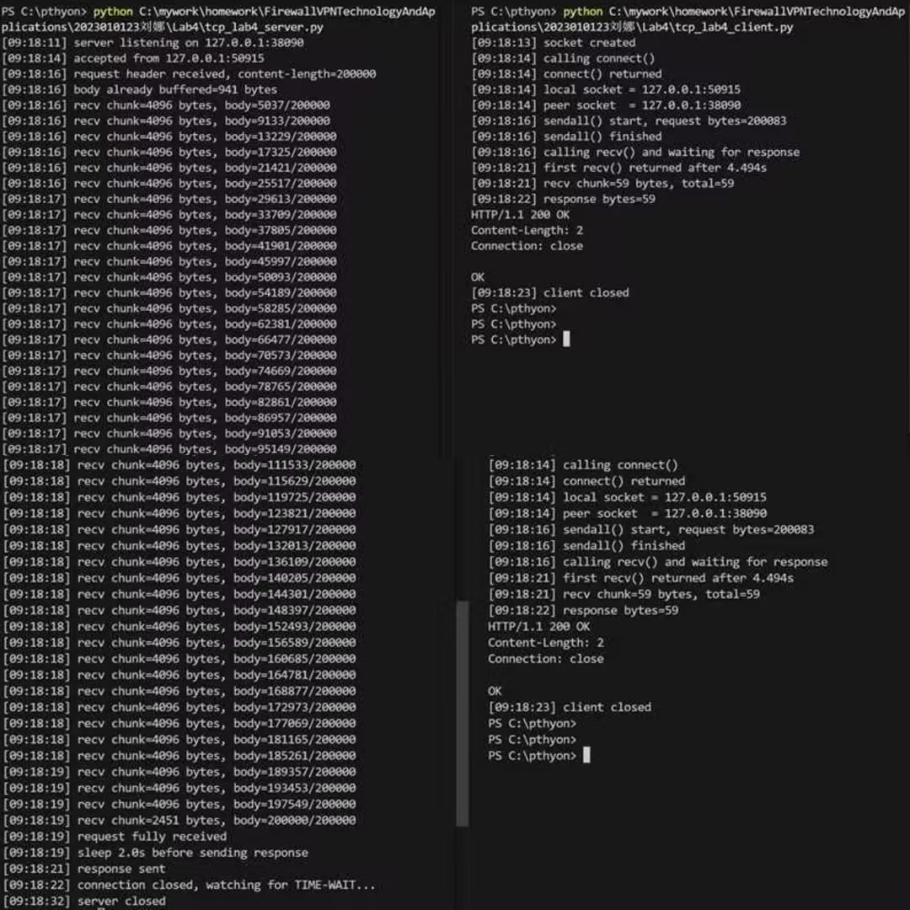
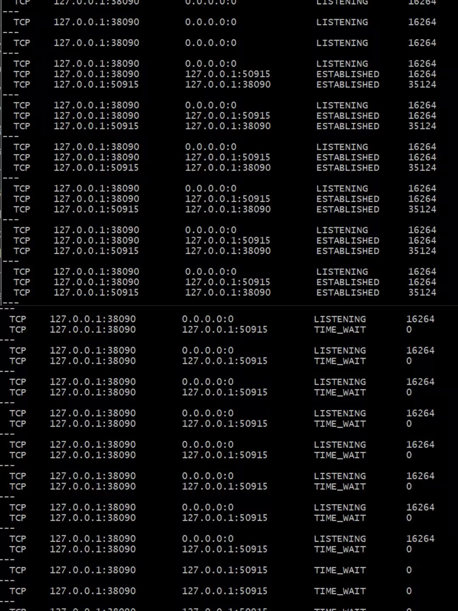
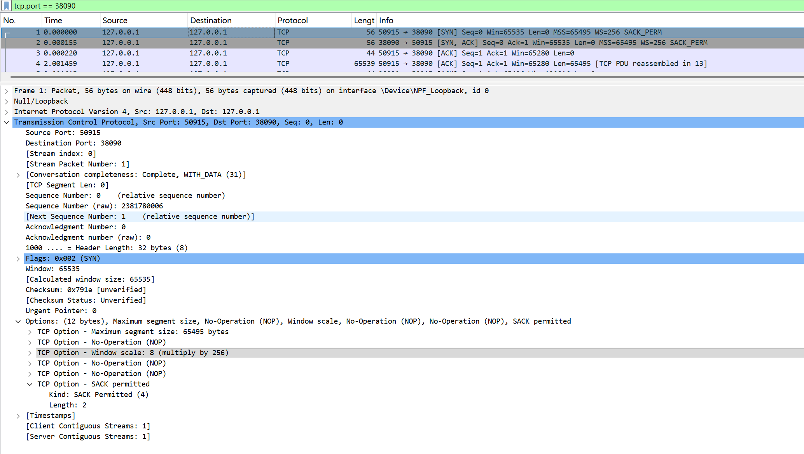
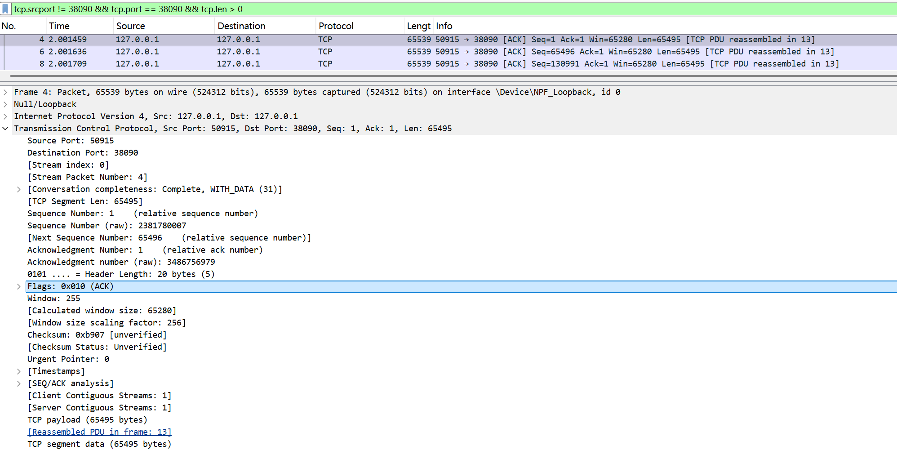
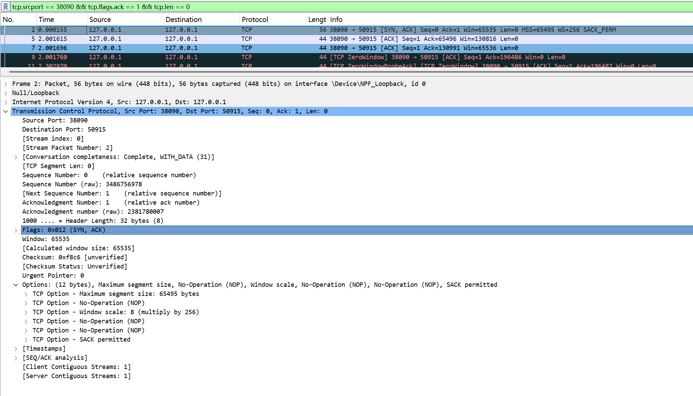
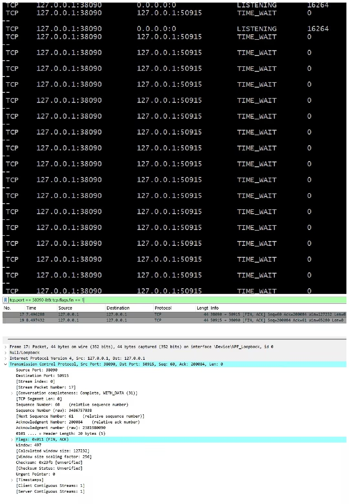

# Lab4：看见TCP 我不怕不怕啦

## 实验背景

本实验围绕一条 TCP 连接的完整生命周期展开，重点观察以下内容：

1. `socket()`、`listen()`、`accept()`、`connect()` 的职责区别
2. "连接"为什么本质上是交换控制信息而不是物理连线
3. TCP 头部中的端口号、序号、ACK 号、标志位、窗口、头部长度、可选字段
4. 三次握手如何建立收发准备
5. 应用层大块数据如何被 TCP 按 MSS 拆分
6. `Sequence Number` 与 `Acknowledgment Number` 如何配合工作
7. `recv()` 为什么会阻塞等待数据
8. 接收窗口如何反映接收方处理能力
9. ACK 与窗口更新为什么常常会被合并
10. `FIN` / `ACK` 如何完成断开
11. 为什么连接结束后套接字不会立刻删除

---

## 实验任务

### 任务一：准备实验环境并记录运行信息

**第一步：准备好四个窗口**

整个实验需要同时观察多个界面，建议在开始前把窗口布局摆好：

- **终端 A**：运行服务端
- **终端 B**：运行客户端
- **终端 C**：持续监控套接字状态（全程保持开启，不要关）
- **Wireshark**：抓包

**第二步：在终端 C 里启动持续监控**

TCP 状态变化很快，等你手动敲完 `ss` 命令再回车，状态可能已经过去了。用下面的命令让终端 C 每 0.5 秒自动刷新一次，之后只需要盯着这个窗口就行：

```bash
# Linux
watch -n 0.5 'ss -tan | grep 38090'

# macOS（没有 watch，用循环代替）
while true; do netstat -an | grep 38090; echo "---"; sleep 0.5; done

# Windows（Git Bash执行）
while true; do netstat -ano | grep 38090; echo "---"; sleep 0.5; done
```

如果你换了端口，把 `38090` 替换成实际端口。

**第三步：打开 Wireshark，选回环接口，填好过滤器，开始抓包**

回环接口在不同系统里名字不同：

| 系统 | 接口名 |
|:-----|:-------|
| Linux | `lo` |
| macOS | `lo0` |
| Windows | `Adapter for loopback traffic capture`（需提前安装 Npcap 并勾选回环支持） |

在显示过滤器里输入：

```text
tcp.port == 38090
```

然后点击开始抓包（蓝色鲨鱼鳍图标）。**先开始抓包，再运行脚本**，否则握手包会被漏掉。

**第四步：启动脚本**

```bash
# 终端 A
python3 tcp_lab4_server.py

# 终端 B（等服务端打印出 server listening on ... 后再运行）
python3 tcp_lab4_client.py
```

如果 `38090` 已被占用，两端都加环境变量换端口，同时记得把 Wireshark 过滤器和终端 C 里的端口号也改掉：

```bash
LAB4_PORT=38123 python3 tcp_lab4_server.py
LAB4_PORT=38123 python3 tcp_lab4_client.py
```

**第五步：填写下表**

| 项目                                | 你的填写内容 |
| :---------------------------------- | :----------- |
| 服务端监听地址                      | 127.0.0.1             |
| 服务端监听端口                      | 38090             |
| 客户端本地临时端口                  | 50915            |
| 客户端请求总字节数                  | 200803             |
| 服务端响应内容                      |HTTP/1.1 200 OK Content-Length: 2 Connection: close              |
| 客户端 `connect()` 返回前后的时间点 | 返回前：[09:18:14] calling connect()返回后：[09:18:14] connect() returned             |
| 客户端首次收到响应前等待了多久      | 4.494s             |

各项数值均可直接从终端输出读取：服务端监听信息在 `server listening on ...`，客户端本地端口在 `local socket = ...`，请求字节数在 `sendall() start, request bytes=...`，等待时间在 `first recv() returned after ...s`。



---

### 任务二：观察套接字创建与连接建立

1. 服务端启动后，观察终端 C 出现 `LISTEN` 状态，截图留存。
2. 在终端 B 里启动客户端，观察它依次打印 `socket created`、`calling connect()`、`connect() returned`。
3. 客户端打印 `connect() returned` 之后，观察终端 C 出现 `ESTABLISHED`，截图留存。脚本在 `connect()` 返回后有 2 秒停顿，这段时间足够截图。

填写下表：

| 阶段                             | 你的填写内容 |
| :------------------------------- | :----------- |
| 服务端启动、客户端未连入时的状态 |  LISTENING            |
| `connect()` 返回后服务端状态     | ESTABLISHED             |
| `connect()` 返回后客户端状态     | ESTABLISHED            |

简答题：

1. 服务端在客户端连接前为什么处于 `LISTEN`？
答：LISTEN是服务端的被动监听状态，表示服务端已创建socket并绑定端口，处于等待客户端发起连接请求的状态，只有保持LISTEN才能接收后续的TCP连接请求（三次握手第一步）。


2. 为什么这时还没有真正建立 TCP 连接？
答：LISTEN仅表示服务端准备好接收连接，但尚未收到客户端的SYN连接请求，更未完成三次握手。只有三次握手全部完成，才会进入ESTABLISHED真正的连接状态。


3. `socket()` 与 `connect()` 的区别是什么？
答：socket()：创建socket文件描述符，仅完成 “创建通信端点” 的动作，未与任何地址建立关联，是TCP连接的 “空载体”。
connect()：主动发起TCP连接，客户端通过该函数触发三次握手，向服务端地址/端口发起请求，成功返回后才建立起可用的TCP连接。


4. 为什么 `connect()` 返回后才进入可稳定收发数据的状态？
答：connect()是客户端阻塞/非阻塞发起连接的核心函数，其返回成功意味着三次握手已完成：客户端发SYN→服务端回SYN+ACK→客户端发ACK。只有三次握手完成，TCP连接才进入ESTABLISHED状态，此时双方才具备可靠收发数据的基础（流量控制、拥塞控制等机制生效）。


5. 为什么"网线一直连着"不等于"TCP 连接已经建立"？
答：网线连通仅代表物理层/链路层的硬件通路畅通，而TCP连接是逻辑层面的三层/四层连接。网线通≠三次握手完成，比如服务端未监听、网络丢包导致握手失败，物理通路通但TCP连接仍未建立；甚至连接建立后，若双方未发送数据，仅网线通也无法判定连接是否存活（TCP需靠心跳包检测）。


6. 这里的"连接"更准确地说是在做什么？
答：这里的TCP连接本质是三次握手建立的逻辑通信通道，核心是：
双方协商序列号（保证数据有序）、窗口大小（流量控制）；约定通信规则（重传机制、拥塞控制），最终让双方能稳定、可靠、有序地收发数据。




---

### 任务三：观察三次握手与 TCP 头部字段

**定位握手包**：在 Wireshark 过滤器里输入下面的条件，可以屏蔽中间的数据包，只留下握手和断开阶段的控制包：

```text
tcp.port == 38090 && (tcp.flags.syn == 1 || tcp.flags.fin == 1)
```

包列表最前面的三个包就是三次握手（SYN → SYN-ACK → ACK）。

**找到各字段的位置**：点击某个握手包，在下方详情栏展开 `Transmission Control Protocol`。源端口、目的端口、Seq、Ack、Flags、Window、Header Length 都在这里。TCP 选项在最底部的 `Options` 子项里，展开后可以看到 MSS、Window Scale、SACK Permitted，注意这三项只出现在带 SYN 标志的包里，纯 ACK 包里没有。

**关于序号显示**：Wireshark 默认开启相对序号，会把每个方向的初始序号归零显示，所以 SYN 包的 Seq 看起来是 `0`，而不是真实的随机大数。这是正常现象，实验报告按 Wireshark 显示的值填写即可。如果你想看真实值，可以去 `Edit → Preferences → Protocols → TCP` 里取消勾选 `Relative sequence numbers`。

填写下表：

| 报文       | 源端口 | 目的端口 | Seq  | Ack  | Flags | Window | Header Length |
| :--------- | :----- | :------- | :--- | :--- | :---- | :----- | :------------ |
| 第一次握手 |50915        |38090          |0      |  0    |SYN       | 65535       |  32 bytes(8)             |
| 第二次握手 | 38090       |50915          | 0     | 1     | SYN,ACK      | 65535       | 32 bytes(8)              |
| 第三次握手 |50915        | 38090         | 1     | 1     |ACK       | 255（缩放后为65280）       | 20 bytes(5)              |

第一次握手（SYN）的 Ack 字段在 Wireshark 里通常显示为空或 `0`，这是正常的，因为此时客户端还没有收到服务端的任何数据。Header Length 在没有选项时是 20 字节，握手包因为携带了 MSS 等选项通常是 28 或 32 字节。

| TCP 选项       | 你的填写内容 |
| :------------- | :----------- |
| MSS            | 65495             |
| Window Scale   | 8(multiply by 256)            |
| SACK Permitted | YES             |

回环接口的 MSS 通常是 65495（因为回环 MTU 是 65536，比以太网的 1500 大得多），这会影响后续任务五里是否能观察到分段。

简答题：

1. 发送方和接收方端口号在连接阶段的作用是什么？
答：端口号是主机内部用于标识具体通信进程的逻辑地址。在TCP连接阶段，接收方（服务端）的知名端口（如本次实验中的38090）用于固定监听特定服务的连接请求，确保客户端能精准定位到目标服务；发送方（客户端）的临时端口（如本次实验中的50915）是客户端本地通信的唯一标识。二者结合能唯一区分同一主机上的不同应用进程，避免不同进程的通信数据混淆，让TCP连接能精准建立，为后续可靠的数据传输奠定基础。


2. TCP 头部如何帮助找到目标套接字？
答：TCP头部携带源端口、目的端口字段，结合网络层IP头部的源IP、目的IP，共同构成TCP连接的四元组（源IP、源端口、目的IP、目的端口）。操作系统通过这个唯一的四元组，匹配系统中的套接字（socket），从而将接收到的TCP数据精准递交给对应的进程，实现数据的正确分发。


3. 为什么初始序号不是简单固定从 1 开始？
答：初始序号（ISN）固定从1开始存在两大核心问题：一是旧连接数据干扰，若网络中存在延迟的旧连接报文，固定ISN会导致新旧连接的序号重叠，造成新连接接收数据错乱，破坏通信可靠性；二是存在安全风险，固定ISN易被攻击者预测，攻击者可伪造报文劫持连接。因此TCP协议要求初始序号为32位随机数，通过时间、随机算法等方式生成，保证序号的唯一性和不可预测性，避免上述问题。


4. 为什么 TCP 可选字段更容易在连接阶段看到？
答：TCP可选字段的核心作用是协商通信参数，这些参数需要在TCP连接建立时一次性协商完成，后续数据传输阶段不会再携带。而连接阶段的三次握手报文是专门用于协商通信参数的，因此会集中展示这些可选字段；同时数据传输阶段的报文需尽可能精简，减少可选字段带来的报文开销，所以可选字段仅在连接阶段被抓包清晰捕获，后续传输阶段难以看到。




---

### 任务四：区分头部中的控制信息和套接字中的控制信息

用以下过滤器分别找到两类报文：

```text
# 纯控制报文（无应用数据）
tcp.port == 38090 && tcp.len == 0

# 携带应用数据的报文
tcp.port == 38090 && tcp.len > 0
```

从纯控制报文里选一个（SYN、纯 ACK 或 FIN-ACK 都可以），从数据报文里选一个（客户端发请求或服务端发响应的包）。

填写下表：

| 项目                   | 你的填写内容 |
| :--------------------- | :----------- |
| 纯控制报文的类型       |SYN、SYN+ACK、ACK、以及带[TCP ZeroWindow]的ACK（不含应用数据，仅用于连接建立、确认或流量控制）             |
| 携带应用数据的报文类型 |TCP段中Len=65495的报文（实际携带HTTP请求数据，被标记为 [TCP PDU reassembled in 13]），以及Frame 13（HTTP POST请求）、Frame 15（HTTP 200 OK响应）              |
| 头部中的控制信息举例   |序号 (Seq)、确认号 (Ack)、窗口大小 (Window)、标志位 (Flags，如 SYN/ACK/RST/FIN)、最大段大小 (MSS)、窗口缩放 (Window scale)、SACK 许可等              |
| 套接字中的控制信息举例 |源 IP: 端口（127.0.0.1:50915）、目的 IP: 端口（127.0.0.1:38090）、连接状态（LISTENING/ESTABLISHED/TIME_WAIT）、进程ID（16264/35124）              |

简答题：

1. 为什么"头部中的控制信息"和"套接字中的控制信息"不是同一件事？
答：两者不是同一件事，主要原因如下：1.所属协议层次不同；头部中的控制信息属于传输层（TCP协议），封装在网络数据包中，随报文在网络中传输。套接字中的控制信息属于操作系统提供的Socket API，是本地内核中管理连接的数据结构，不发送到网络中。
2.作用范围不同；头部信息用于通信双方之间的协调（如序号、确认号、窗口通告、标志位），对端可见。套接字信息仅用于本地进程与操作系统的交互（如本地/远程地址、PID、连接状态、收发缓冲区设置），对端不可见。
3.生命周期不同；头部信息逐报文变化（如每个报文的Seq、Ack、Window都可能不同）。套接字信息在连接生命周期内相对稳定（如五元组、PID、监听/建立状态）。
4.获取方式不同；头部信息通过抓包（Wireshark/tcpdump）直接读取。套接字信息需通过系统命令（如netstat、ss、lsof）或系统调用查看。


---

### 任务五：观察数据分段、序号与 ACK

客户端发送的请求体是 200000 字节，超过了回环接口 MSS（约 65495 字节），因此应该可以在 Wireshark 里看到多个连续的数据段。用下面的过滤器找到客户端发出的数据包：

```text
tcp.srcport != 38090 && tcp.port == 38090 && tcp.len > 0
```

在包列表里连续选几个数据段，对比它们的 Seq 值。相邻两段的关系是：后一段的 Seq = 前一段的 Seq + 前一段的 TCP Segment Len。

找服务端返回给客户端的纯 ACK 报文：

```text
tcp.srcport == 38090 && tcp.flags.ack == 1 && tcp.len == 0
```

填写下表：

| 数据段  | Seq  | Ack  | TCP Segment Len | Flags |
| :------ | :--- | :--- | :-------------- | :---- |
| 第 1 段 |   1   |  1    |     65495            | 0x010 (ACK)      |
| 第 2 段 |65496      | 1     |  65495               |0x010 (ACK)       |
| 第 3 段 | 130991     | 1     |  65495               |0x010 (ACK)       |

| ACK 报文 | Ack Number | Flags | Window |
| :------- | :--------- | :---- | :----- |
| 第 1 个  |65496            |0x010 (ACK)       |130816        |
| 第 2 个  |130991            |0x010 (ACK)       |65536        |
| 第 3 个  | 196486           |0X010 (ACK)       |0        |

| 项目                         | 你的填写内容 |
| :--------------------------- | :----------- |
| 是否发生分段                 |  是            |
| 握手中观察到的 MSS           | 65495             |
| 单段长度与 MSS 的关系        |  单段长度 = MSS            |
| ACK 号大致确认到了第几个字节 |最终 ACK 号为 196486，确认到第 196485 字节              |

简答题：

1. 应用程序是否直接决定每个网络包的数据长度？为什么？
答：否。原因：应用程序仅负责向TCP套接字提交待发送的应用数据，不直接控制每个网络包的实际数据长度。单个网络包的最大数据长度由TCP协议协商的MSS（最大分段大小）、链路层MTU（最大传输单元）共同决定，而非应用程序指定。TCP协议栈会根据MSS自动对应用数据进行分段，将大块数据拆分为符合MSS限制的分段，再封装为网络包发送。此外，流量控制（接收窗口大小）、拥塞控制（拥塞窗口cwnd）也会动态调整每个包的实际发送长度，应用程序无法干预这些底层机制。


2. 大块应用数据为什么会被拆分？
答：核心原因是链路层MTU的限制，同时兼顾传输可靠性与效率。
1.链路层MTU限制：以太网标准 MTU 为1500字节（环回接口为65535字节），IP+TCP头部会占用固定字节数，因此单个IP包能承载的TCP数据最大为MSS。若应用数据长度超过MSS，必须拆分为多个分段，否则会因超过MTU导致IP分片（或直接丢弃）。
2.传输可靠性：TCP将大块数据拆分为小分段，可降低单包丢失对整体传输的影响，仅需重传丢失的分段，无需重传整个大块数据，提升传输效率。
3.流量控制适配：接收端的窗口大小会限制发送端的单次发送量，分段可灵活适配接收端的接收能力，避免发送端一次性发送过多数据导致接收缓冲区溢出。


3. `MSS` 与 `MTU` 的关系是什么？
答：MSS = MTU - IP头部长度 - TCP头部长度。MSS由MTU推导而来（减去IP头和TCP头的最小长度）。


4. "一次 `sendall()`"与"一个 TCP 包"之间是什么关系？
答：一次sendall()调用对应一个完整的应用层数据块，但可能被 TCP 拆分为多个TCP包（分段）发送，二者不是一一对应关系。
1.sendall()是应用层的系统调用，作用是将完整的应用数据块提交给 TCP 协议栈，由 TCP 负责后续的传输。
2.TCP 会根据 MSS、接收窗口、拥塞窗口等参数，将sendall()提交的大块数据拆分为多个符合长度限制的 TCP 分段，每个分段封装为一个独立的 TCP 包发送。
3.接收端 TCP 会将多个分段重组为完整的应用数据块，再交付给应用程序。
本次抓包中，一次sendall()提交的大数据被拆分为 3 个长度为 65495B 的 TCP 包，最终重组为完整的 HTTP 请求，直观体现了该关系。sendall() 是应用层行为，TCP包是传输层行为，两者之间是“多对多”关系。


5. 为什么 ACK 体现的是累计确认？
答：TCP的ACK号定义为「期望收到对方下一个字节的序号」，因此天然实现累计确认。
累计确认的核心逻辑：ACK号 = N，表示所有序号小于N的字节已全部成功接收，仅需确认到当前的最高序号，无需对每个分段单独确认。
累计确认的优势：减少 ACK 报文的数量，降低网络开销；同时简化接收端的确认逻辑，提升传输效率。


6. 如果中间某一段丢失，ACK 会出现什么变化？
答：ACK号会停留在丢失分段之前的最后一个确认位置，不再递增，并持续发送重复ACK。发送方收到3个重复ACK后会触发快速重传，若超时未收到ACK则触发超时重传。





---

### 任务六：观察 `recv()` 阻塞与窗口字段

`recv()` 的等待时间直接从客户端终端读取，`calling recv() and waiting for response` 到 `first recv() returned after ...s` 之间就是等待时长，脚本已经帮你计算好了。

在 Wireshark 里找窗口值：用过滤器 `tcp.port == 38090 && tcp.flags.ack == 1` 列出所有 ACK 包，点击其中一个，在详情栏 `Transmission Control Protocol` 里找 `Window` 字段。如果同时显示了 `Calculated window size`，优先看这个值，它已经把 Window Scale 的缩放算进去了，是对方实际能接收的字节数。

如果包列表的 Info 列出现了 `[TCP Window Update]` 标注，说明这个包的主要目的是通知对方窗口变化，重点观察它的 `Window` 字段。

填写下表：

| 项目                                   | 你的填写内容 |
| :------------------------------------- | :----------- |
| 客户端开始调用 `recv()` 的时间         | 09:18:16             |
| 客户端第一次收到响应的时间             | 09:18:21             |
| `recv()` 是否立刻返回                  | 否             |
| 首次收到响应前等待了多久               |  4.494s            |
| `recv()` 等待期间连接是否已经建立      | 是             |
| 第 1 个 ACK 报文的窗口值               | 130816             |
| 第 2 个 ACK 报文的窗口值               | 65536             |
| 第 3 个 ACK 报文的窗口值               | 0             |
| 窗口值是否变化                         |  是            |
| 若变化，变化趋势                       | 先从130816降至65536，再降至0（持续减小，最终出现零窗口）             |
| ACK 与窗口更新是否可以出现在同一个包中 |是              |
| 是否看到 RTT 或 ACK 往返时间相关信息   | 是             |

简答题：

1. "连接建立"和"应用收到数据"之间是什么关系？
答：连接建立是应用收到数据的前提：只有TCP三次握手完成、连接成功建立后，客户端与服务端才能进行可靠的数据传输，应用程序才能通过recv()等接口接收数据；若连接未建立，应用无法收到任何有效数据，本次实验中客户端connect()于09:18:14完成连接建立，之后才调用recv()等待并最终收到响应，直观体现了这一先后依赖关系。


2. 为什么说 `read` / `recv` 在数据未到达时会被挂起？
答：因为read/recv是默认的阻塞式系统调用，当应用程序调用该接口时，若TCP接收缓冲区中没有可读取的有效数据，操作系统会将该进程挂起（进入阻塞等待状态），直到有数据到达缓冲区、被内核拷贝到用户空间后，recv()才会返回，本次实验中客户端recv()调用后等待约 4.494 秒才收到响应返回，就是典型的阻塞挂起场景。


3. 窗口字段反映了接收方哪方面的能力？
答：窗口字段反映了接收方的接收缓存能力：TCP头部的窗口字段（Window）本质是接收方告知发送方的、当前接收缓冲区剩余的可接收字节数，直接体现了接收方当前能够接收数据的能力，本次实验中服务端窗口从130816逐步降至0，就是接收缓冲区被占满、接收能力耗尽的体现。


4. 为什么发送方不能无限制连续发送数据？
答：TCP的流量控制机制，发送方的发送量受接收方通告的窗口大小严格限制，发送方最多只能发送窗口大小对应字节数的数据，若接收方窗口为0，发送方必须暂停发送。


5. 滑动窗口为什么既提高效率又避免压垮接收方？
答：滑动窗口机制允许发送方在收到ACK前连续发送多个分段，无需每发一个就等待确认，大幅提升了传输效率；同时发送方的发送量始终受接收方通告的窗口大小约束，不会超过接收方的接收缓存能力，避免了发送方发送过快导致接收方缓冲区溢出、数据丢失的问题。


---

### 任务七：观察响应返回与双向 `seq/ack`

TCP 的 Seq/Ack 是双向独立的，客户端有自己的发送序号，服务端有自己的发送序号。用下面的过滤器只看服务端发出的数据包（源端口是 38090，有应用数据）：

```text
tcp.srcport == 38090 && tcp.len > 0
```

紧跟在服务端数据包后面的、客户端发出的 ACK 包，其 Ack Number 确认的就是服务端的发送序号。

填写下表：

| 项目                     | 你的填写内容 |
| :----------------------- | :----------- |
| 服务端响应数据报文的 Seq |  1            |
| 服务端响应数据报文的 Ack |  200084            |
| 客户端确认报文的 Ack     |  60            |

简答题：

1. 为什么 TCP 的 `seq/ack` 是双向分别计算的？
答：TCP是全双工通信协议，双方可以同时独立地发送和接收数据。因此，每一方都需要维护自己发送数据的序列号（seq），以及确认对方数据的确认号（ack）。双向分别计算可以保证每一方发送的数据都能被对方正确排序和确认，互不干扰。


2. 为什么双方都需要各自的初始序号？
答：TCP连接是双向的，双方都需要主动发送数据，因此必须各自生成独立的初始序号（ISN）来标记自己发送数据流的起始位置。初始序号通过三次握手协商，一方面可以区分不同的TCP连接，避免历史连接的旧报文干扰当前连接；另一方面，双方独立的初始序号是双向seq/ack分别计算的基础，确保两个方向的序号空间互不冲突，保障双向数据传输的可靠性。


3. 为什么发送应用数据时报文通常仍然带 `ACK`？
答:TCP的确认机制是累计的，为了提高效率，通常采用“捎带确认”（piggybacking）。当一方有应用数据要发送时，它会顺便在同一个TCP报文头部中带上对对方数据的ACK，这样可以减少单独的纯ACK包数量，节省网络带宽，同时也能及时更新对方的发送窗口。


---

### 任务八：观察连接断开与套接字延迟删除

用下面的过滤器精确定位所有带 FIN 的包：

```text
tcp.port == 38090 && tcp.flags.fin == 1
```

通常会看到两个 FIN 包（双方各一个）。看第一个 FIN 包的源端口，就能判断谁先发起断开。

**关于 TIME-WAIT**：TIME-WAIT 只出现在主动发起关闭的一方（先发 FIN 的那端）。服务端脚本在 `conn.close()` 之后会继续运行 10 秒再退出，这段时间可以在终端 C 里观察 TIME-WAIT。Linux 上 TIME-WAIT 通常持续约 60 秒，macOS 上可能较短，如果没有观察到请如实说明。

填写下表：

| 项目                                    | 你的填写内容 |
| :-------------------------------------- | :----------- |
| 谁先发送 FIN                            | 服务端（38090）             |
| 关闭阶段共观察到几个带 FIN 的报文       |  2个            |
| 最终 ACK 是否可见                       |可见              |
| 关闭后是否观察到 `TIME-WAIT` 或等价现象 |是              |

简答题：

1. 为什么关闭连接不能只发一个结束通知？
答：因为TCP是全双工通信协议，连接建立后，发送方向和接收方向是独立的。只发一个结束通知（FIN），只能表示 “我不会再发送数据”，但无法保证对方也结束发送，也无法切断接收数据的通道。只有当双方都发送FIN（即完成双向关闭），才能确保整个连接被彻底断开，因此需要四次挥手，而不是单次通知。


2. 为什么连接结束后套接字不会立刻删除？
答：连接结束后，主动关闭方（发送FIN的一方）会进入TIME-WAIT（2MSL）状态，套接字不会立刻删除。核心原因是：等待 2MSL（最大报文生存时间），确保被动关闭方收到的最终ACK。如果套接字立刻删除，当被动关闭方重发FIN时，主动方无法识别，会导致连接异常终止；同时等待旧报文彻底消失，防止新连接收到旧数据。


3. 如果最后一个 ACK 丢失，而旧套接字已经立刻删除，可能带来什么问题？
答：会导致TCP连接无法可靠关闭：被动关闭方因为没收到最后一个ACK，会认为连接未关闭，重发FIN；但主动方已删除旧套接字，无法识别这个FIN，会返回RST（复位报文），导致连接异常中断；同时，旧连接可能存在的延迟报文，若新连接复用端口/地址，会被新连接接收，造成数据错乱，破坏通信的可靠性和安全性。




---

## 问答题

1. TCP 的"连接"到底意味着什么？它为什么不是"把网线连上"？
答：TCP的“连接”并不是物理上的线路连通，而是通信双方操作系统内核中维护的一段逻辑状态，包括套接字对、初始序号、发送/接收缓冲区、窗口大小等。通过三次握手，双方协商并确认这些状态后，才认为连接已建立。即使网线物理上连着，如果没有完成握手，TCP也无法收发数据；反之，即使经过复杂的网络路径，只要握手成功，连接就存在。所以说TCP连接是“软”的、协议层面的概念，而不是“把网线连上”那样的硬连接。


2. 三次握手为什么能让双方进入可通信状态？
答：三次握手的核心作用是双向确认双方的发送/接收能力，同步初始序号，为可靠传输建立基础：第一次握手（客户端发 SYN）让服务端确认客户端的发送能力正常；第二次握手（服务端发 SYN+ACK）让客户端确认服务端的发送 / 接收能力正常，同时同步双方的初始序号；第三次握手（客户端发 ACK）让服务端确认客户端的接收能力正常。三次握手完成后，双方都确认了对方的收发能力、同步了序号，因此进入双向可通信的状态。


3. TCP 头部中的控制字段如何支撑收发数据？
答：TCP头部的控制字段从多维度支撑可靠收发：序号（Seq）标记发送数据的字节位置，保障数据按序接收；确认号（Ack）实现累计确认，验证数据是否成功接收；窗口（Window）实现流量控制，限制发送方的发送量，避免压垮接收方；标志位（SYN/ACK/FIN/RST）管理连接的建立、确认、关闭与重置；校验和保障报文传输的完整性；紧急指针处理紧急数据，这些字段协同工作，共同支撑TCP的可靠、有序、流量可控的数据收发。


4. ACK、窗口、等待时间为什么会共同影响 TCP 的可靠传输？
答：ACK确认机制让发送方知道哪些数据已被对方接收，未确认的数据需要重传；窗口（Window）控制发送方的发送速率，避免超过接收方的处理能力；等待时间（超时重传计时器）决定了发送方在未收到ACK时何时重传数据。三者相互配合：ACK推进窗口，窗口限制发送量，超时时间触发重传。缺少任何一个，都会破坏TCP的可靠性和效率。


5. 断开连接为什么仍然需要严格的控制信息交换？
答：因为TCP是全双工的，每一方都需要独立关闭自己的发送方向。四次挥手通过FIN和ACK的交换，确保双方都能优雅地关闭连接：主动方发送FIN表示不再发数据，被动方回复ACK并发送自己的FIN，最后主动方回复最终ACK。如果交换不严格，可能导致半关闭状态残留、数据丢失或连接无法完全释放。此外，TIME_WAIT状态确保最后的ACK能被对方收到，防止旧连接报文干扰新连接。


6. 如果服务端根本没有启动，客户端调用 `connect()` 时会看到什么现象？
答：客户端调用connect()时，会向服务端发送SYN报文尝试建立连接；由于服务端未启动，无法响应SYN，客户端会持续重传SYN报文，直到超时，最终connect()调用失败，返回连接超时错误（如Connection refused或超时异常），应用程序会收到连接失败的提示。


7. 如果中途人为制造丢包，ACK、重传、窗口之间会出现什么变化？
答：若中途丢包，接收方会持续发送重复的ACK（ACK号停留在丢失分段的起始序号）；发送方收到重复ACK（快速重传）或超时后，会触发重传机制，重传丢失的分段；同时，若丢包导致接收方数据乱序，接收方的窗口会根据缓冲区剩余情况动态调整，若重传导致发送量增加，接收方窗口可能减小，甚至出现零窗口，直到丢失数据被成功重传、接收方处理完数据后，窗口才会恢复。


8. 如果把客户端发送的数据改得更大，窗口字段和分段情况会如何变化？
答：分段情况：TCP会按MSS（抓包中为65495字节）将数据拆分成多个段，数据越大，段数越多。窗口字段：窗口大小由接收方根据其缓冲区剩余空间决定，与发送方数据量无直接关系。但如果发送方发送更快、数据更大，会更快填满接收方的缓冲区，导致接收方通告Window=0（零窗口），发送方停止发送，直到收到窗口更新报文。


9. 如果把服务端读取速度改得更慢，是否更容易看到窗口更新甚至零窗口？
答：是。服务端读取速度变慢时，接收缓冲区的数据无法被及时取走，缓冲区剩余空间会持续减小，因此服务端会通过ACK报文不断更新更小的窗口值；当缓冲区完全被占满时，会发送窗口为0的零窗口报文，通知客户端暂停发送，直到服务端读取数据、缓冲区有剩余空间后，再发送窗口更新报文恢复发送。因此服务端读取速度越慢，越容易观察到窗口的动态更新，甚至零窗口现象。


---

## 截图要求

- 截图须清晰，终端文字和 Wireshark 字段可读。
- 所有截图与本 `Lab4.md` 放在同一目录下。
- 命名规范：

| 截图内容               | 文件名                  |
| :--------------------- | :---------------------- |
| 服务端与客户端运行结果 | `run.png`               |
| `ss` 状态变化          | `states.png`            |
| 三次握手与 TCP 选项    | `handshake_header.png`  |
| 大请求分段与 MSS       | `segmentation.png`      |
| ACK 与窗口观察         | `ack_window.png`        |
| 断开与最终状态         | `teardown_timewait.png` |

具体要求：

1. `run.png`：终端截图，至少能看到服务端 `server listening on ...`、客户端 `calling connect()`、`connect() returned`、`calling recv() and waiting for response`、`first recv() returned after ...s`。

2. `states.png`：终端截图，至少能看到 `LISTEN`、`ESTABLISHED`，以及 `TIME-WAIT`（若能观察到）。推荐截 `watch` 命令的持续输出画面，可以在一张截图里同时展示多个状态的变化过程。

3. `handshake_header.png`：Wireshark 截图，至少能看到三次握手中某个包的 `Source Port`、`Destination Port`、`Sequence Number`、`Acknowledgment Number`、`Flags`、`Window`，以及 `Options` 中的 `Maximum segment size`、`Window Scale`、`SACK Permitted`。

4. `segmentation.png`：Wireshark 截图，至少能看到客户端发送数据的 TCP 包的 `TCP Segment Len`、`Seq`、`Ack`。若能观察到分段，尽量截出多个连续数据段。

5. `ack_window.png`：Wireshark 截图，至少能看到一个或多个 ACK 报文的 `Acknowledgment Number`、`Window`，以及 `Calculated window size`（若显示）、`[TCP Window Update]`（若出现）。

6. `teardown_timewait.png`：Wireshark 截图或 Wireshark 与终端截图的拼图，至少能看到带 `FIN` 的包，以及 `TIME-WAIT` 状态（若能观察到）。

---

## 提交要求

在自己的文件夹下新建 `Lab4/` 目录，提交以下文件：

```text
学号姓名/
└── Lab4/
    ├── Lab4.md
    ├── tcp_lab4_server.py
    ├── tcp_lab4_client.py
    ├── run.png
    ├── states.png
    ├── handshake_header.png
    ├── segmentation.png
    ├── ack_window.png
    └── teardown_timewait.png
```

---

## 截止时间

2026-04-23，届时关于 Lab4 的 PR 请求将不会被合并。
