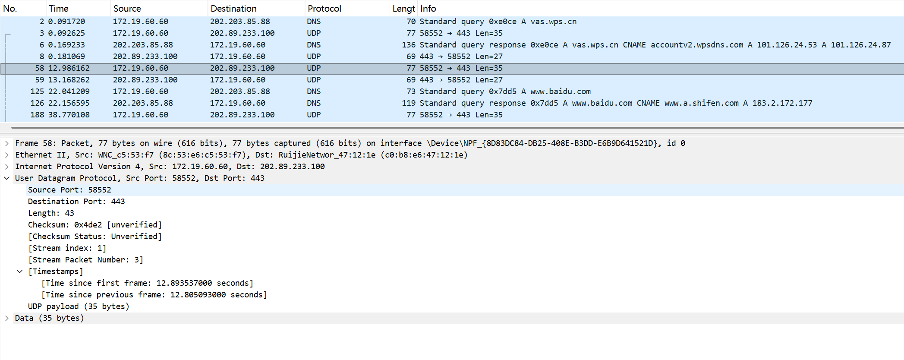
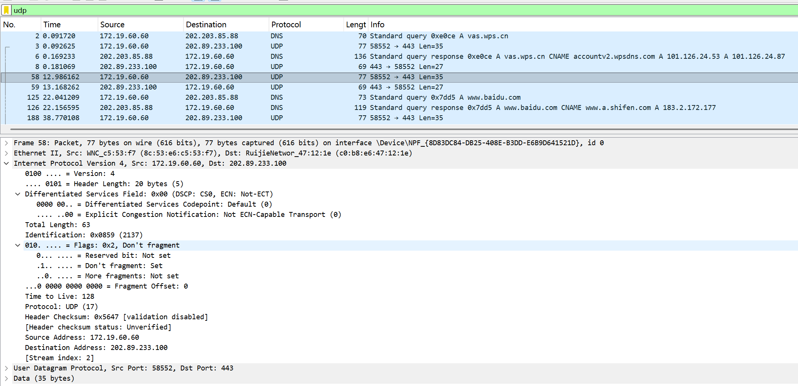
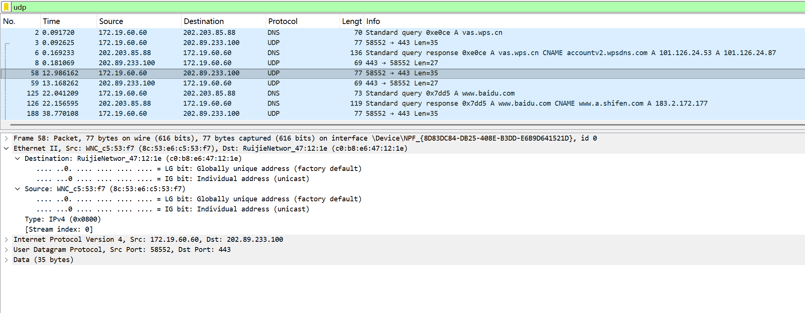
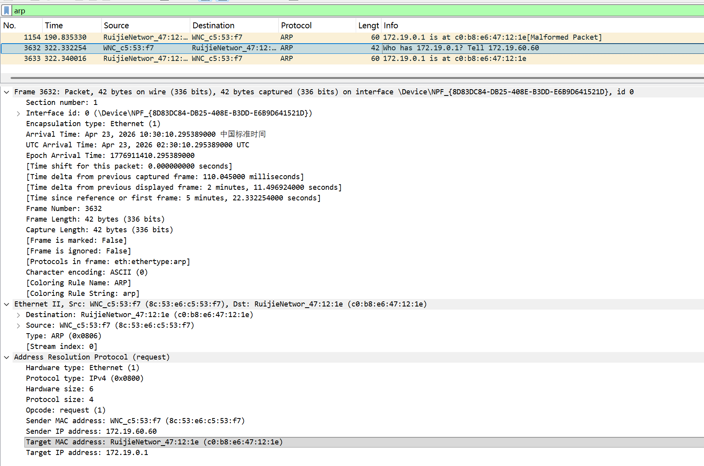
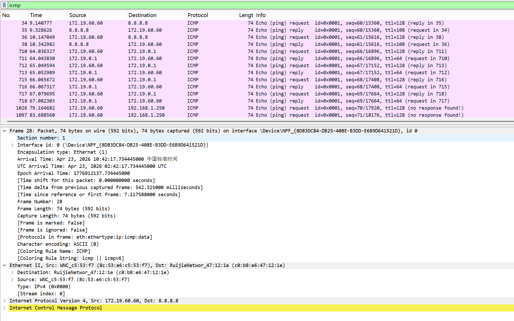

# Lab5：IP 与以太网的包收发操作

## 实验背景

本实验围绕 IP 模块与以太网在包收发过程中的角色展开，重点观察以下内容：

1. 网络包的基本结构：头部（IP 头部 + MAC 头部）与数据
2. IP 头部各字段的含义：版本号、TTL、协议号、发送方/接收方 IP 地址等
3. MAC 头部各字段的含义：接收方/发送方 MAC 地址、以太类型
4. IP 地址与 MAC 地址的区别与协作
5. ARP 协议如何通过 IP 地址查询 MAC 地址
6. 路由表的结构与查询方式
7. UDP 协议与 TCP 协议的区别：无连接、无确认、无重传
8. UDP 头部结构：发送方端口号、接收方端口号、数据长度、校验和
9. ICMP 协议的作用与常见消息类型（Echo、Destination Unreachable 等）

---

## 实验任务

### 任务一：查看路由表、ARP 缓存并启动 Wireshark

**第一步：打开 Wireshark，选择主网络接口，开始抓包**

> **注意**：本次实验必须使用真实网络接口（`en0`/`eth0`/`以太网`），不要选回环接口。回环接口不经过以太网，无法观察到 MAC 头部和 ARP 过程。

选择你的主网络接口，开始抓包。本次实验的大部分任务会共用同一次抓包。

**第二步：查看本机路由表**

```bash
# Linux
route -n
ip route show

# macOS
netstat -rn

# Windows
route print
```

截图并保存为 `route_table.png`。

**第三步：查看本机 ARP 缓存**

```bash
# Linux / macOS / Windows
arp -a
```

截图并保存为 `arp_cache.png`。

**第四步：填写下表**

从路由表和 ARP 缓存的输出中提取信息：

| 项目                         | 你的填写内容 |
| :--------------------------- | :----------- |
| 本机 IP 地址                 | 172.19.60.60             |
| 本机所在子网                 |172.19.0.0/16              |
| 子网掩码                     |255.255.255.0              |
| 默认网关 IP                  |172.19.0.1              |
| 默认网关 MAC 地址            | c0-b8-e6-47-12-1e              |
| 本机网卡 MAC 地址            |8c-53-e6-c5-53-f7              |

简答题：

1. 路由表的每一行包含哪些关键字段？教材中提到的 `Network Destination`、`Netmask`、`Gateway`、`Interface` 分别对应什么含义？
答：Windows路由表每一行核心关键字段包含网络目标、网络掩码、网关、接口、跃点数。其中Network Destination（网络目标）代表本条路由可达的目的网络网段地址；Netmask（网络掩码）用于匹配目的IP所属网段，区分IP地址的网络位与主机位；Gateway（网关）是数据包去往对应网段的下一跳转发设备IP地址；Interface（接口）代表本机发送该数据包所使用的网卡对应的IP地址。


2. 当目标 IP 地址不在本子网时，包会先发给谁？路由表的哪一列提供了这个信息？
答：当目标IP地址不属于本机所在子网时，主机无法直接二层通信，数据包会统一发送给默认网关设备。该转发地址信息，对应路由表里"网关（Gateway）"字段，依靠网关完成不同网段之间的数据转发。


3. 路由表的默认网关（`0.0.0.0`）条目的作用是什么？什么时候会匹配到这一行？
答：路由表中0.0.0.0默认网关条目，是全网兜底默认路由，作用是统一转发路由表内没有精准匹配规则的所有网络流量，是主机访问外网、跨网段通信的总出口。当数据包目的IP无法匹配路由表中任何一条具体网段路由条目时，系统就会匹配这条默认路由，按照预设网关转发数据包。


4. 教材提到，确定发送方 IP 地址的关键在于"判断应该使用哪块网卡"。结合你查到的本机网卡信息，说明IP模块是如何做出这个判断的。
答：IP模块会先根据数据包目的IP地址，在路由表中匹配最长前缀、最低跃点数的最优路由条目，再读取这条路由对应的接口IP，以此确定出站网卡。结合本机信息，访问外网流量匹配默认路由，对应接口IP为 172.19.60.60，系统就选用 WiFi 无线网卡作为出站网卡；访问虚拟机内网网段时，则匹配对应专属路由，调用VMware虚拟网卡发送数据，以此确定数据包的源IP与发送网卡。


---

### 任务二：观察 UDP 头部

只要计算机处于联网状态，Wireshark 中就会持续出现大量 UDP 流量（DNS、mDNS、DHCP、NTP 等），无需手动生成。

**第一步：在 Wireshark 中设置过滤器**

```text
udp
```

**第二步：在包列表中找一个 UDP 包**

随便选一个即可。如果包太多，可以加上源或目的 IP 来缩小范围，例如 `udp && ip.addr == 你的IP`。如果需要 DNS 包，也可以用 `udp.port == 53` 过滤。

> **可选**：如果想明确看到一个完整的请求-响应对，可以在终端中执行 `nslookup example.com`，Wireshark 中就会出现对应的 DNS 请求包。

**第三步：点击选中的 UDP 包，在详情栏展开 `User Datagram Protocol`**

填写下表：

| 项目               | 你的填写内容 |
| :----------------- | :----------- |
| UDP 头部总长度     | 8字节             |
| 源端口             |58552              |
| 目的端口           |443              |
| 长度（Length）     |43              |
| 校验和（Checksum） |0x4de2              |

简答题：

1. 你观察到的 UDP 头部长度是多少字节？TCP 头部至少 20 字节。UDP 省略了哪些字段？这些字段的缺失带来了什么后果？
答：本次抓包观察到UDP头部固定长度为8 字节。对比TCP协议，UDP省略了序号字段、确认序号字段、滑动窗口字段、标志位字段等可靠传输相关字段。这些字段的缺失，让UDP无法实现序号确认、丢包重传、流量控制、拥塞控制与有序重组，因此UDP是不可靠传输协议，数据包可能出现丢失、乱序、重复到达的情况，但同时也换来了更低的传输延迟、更小的报文开销与更快的转发速度。


2. UDP 头部中的"长度"字段指的是什么长度？
答：UDP头部里的 “长度” 字段，代表UDP首部长度 + UDP数据部分的总字节长度，也就是整个UDP报文段的整体长度，本次抓包中该数值为 43字节，其中8字节是UDP固定首部，剩余35字节为UDP净荷数据。




---

### 任务三：观察 IP 头部字段

点击任务二中的同一个 UDP 包，在详情栏展开 `Internet Protocol Version 4`。

填写下表：

| 字段名称               | 你的填写内容 | 含义说明 |
| :--------------------- | :----------- | :------- |
| Version（版本号）      |4              | 代表当前使用IPv4互联网协议版本         |
| Header Length（头部长度） |20bytes            |标识IP数据报首部的长度，以 4 字节为单位，此处数值 5 对应 20 字节          |
| Time to Live（TTL）    |128              |生存时间,数据包每经过一个路由转发数值减1,防止IP数据包在网络无限循环          |
| Protocol（协议号）     | 17             |标识IP封装的上层传输层协议，17代表UDP协议          |
| Source Address（源 IP） |172.19.60.60              |发送该IP数据包的主机IP地址          |
| Destination Address（目的 IP） |202.89.233.100        |该IP数据包最终要送达的目标主机IP地址          |

简答题：

1. 协议号字段的值是多少？它代表什么协议？如果抓一个 HTTP 请求的包，协议号会变成多少？
答：协议号字段的值是17，代表UDP协议。如果抓取一个HTTP请求的包，协议号会变成6，因为HTTP基于TCP协议（TCP的协议号为6）。协议号字段用于告知网络层将数据载荷交给哪个上层传输层协议处理。


2. TTL 字段的作用是什么？如果 TTL 降为 0 会发生什么？
答：TTL字段的作用是限制数据包在网络中的最大跳数，防止因路由环路导致数据包在网络中无限循环。每经过一个路由器，TTL减1。如果TTL降为0，路由器会丢弃该数据包，并向源主机发送一个ICMP超时（Time Exceeded）错误消息，通知源主机数据包已被丢弃。


3. 有教材提到 IP 地址"实际上并不是分配给计算机的，而是分配给网卡的"。你的本机有几块网卡？每块网卡的 IP 地址分别是什么？（提示：可参考任务一中路由表的 Interface 列，或用 `ip addr`（Linux）/`ifconfig`（macOS）/`ipconfig`（Windows）查看。）
答：本机有多块物理与虚拟网卡：WiFi无线网卡、VMware两台虚拟机虚拟网卡、回环网卡、蓝牙虚拟网卡等。对应 IP 分别为：WiFi网卡172.19.60.60、VMnet1虚拟网卡192.168.48.1、VMnet8虚拟网卡192.168.237.1、本地回环网卡127.0.0.1。IP 地址是绑定在主机各个网络接口（网卡）上，而非整台计算机。


4. IP 头部中的源 IP 地址和目的 IP 地址分别是谁的地址？它们与 MAC 头部中的源/目的 MAC 地址有什么区别？
答：IP头部的源IP和目的IP分别是发送端主机的IP地址和最终接收端主机的IP地址，它们在整个传输过程中（即使经过多个路由器）通常保持不变。MAC头部的源MAC和目的MAC则是每一段链路（直连网络段）上相邻两个网络设备的物理地址，随着数据包经过每一跳路由器而逐段变化。




---

### 任务四：观察 MAC 头部与以太网帧

点击任务二中的同一个 UDP 包，在详情栏展开 `Ethernet II`。

填写下表：

| 字段名称               | 你的填写内容 | 含义说明 |
| :--------------------- | :----------- | :------- |
| Source（源 MAC）       |8c:53:e6:c5:53:f7	              |发送该数据帧的本机网卡物理地址          |
| Destination（目的 MAC） |c0:b8:e6:47:12:1e              |接收该数据帧的下一跳设备（默认网关）的物理地址          |
| Type（以太类型）       |0x0800              |表示数据帧封装的上层协议为IPv4          |

关于 MAC 地址格式，填写下表：

| 项目               | 你的填写内容 |
| :----------------- | :----------- |
| MAC 地址长度       | 48 比特（6 字节） |
| 本机网卡的 MAC 地址 |8c:53:e6:c5:53:f7              |
| 目的 MAC 地址      | c0:b8:e6:47:12:1e             |
| MAC 地址的书写格式 |十六进制表示，通常以冒号（:）或连字符（-）分隔每两个十六进制数，例如XX:XX:XX:XX:XX:XX或XX-XX-XX-XX-XX-XX              |

简答题：

1. 以太类型字段的值是多少？它代表后面承载的是什么协议的包？
答：以太类型字段的值是0x0800，它代表后面承载的是IPv4协议的包。这个字段告诉网卡和驱动程序如何处理接收到的数据帧：如果类型值为0x0800，则将数据载荷交给IPv4协议栈处理；如果是0x0806则交给ARP协议；如果是0x86DD则交给IPv6协议栈。


2. DNS 服务器的 IP 通常是外网地址。本任务中目的 MAC 地址是 DNS 服务器的 MAC 地址还是你本机网关（路由器）的 MAC 地址？为什么？
答：目的MAC地址是本机网关（路由器）的MAC地址，而不是DNS服务器的MAC地址。原因：本机（172.19.60.60）与DNS服务器（202.203.85.88）不在同一个局域网内。在以太网中，数据帧只能在同一广播域内（同一子网）直接传输。因此，本机先将数据包发给默认网关（172.19.0.1），由网关路由器负责转发到外网。所以以太网帧头的目的MAC地址必须是网关的MAC地址，而不是最终DNS服务器的MAC地址。


3. IP 地址和 MAC 地址在功能上有什么相似之处？又有什么本质区别？
答：相似之处：IP地址和MAC地址都是用于标识网络设备的唯一地址，都用于在网络中定位和区分不同的设备，保证数据能够从源设备正确地发送到目标设备。
本质区别：
1.作用范围不同：MAC地址工作在数据链路层（局域网内），只在同一个广播域内有效；IP地址工作在网络层，可以在全球互联网范围内（不同网络之间）路由寻址。
2.可更改性不同：MAC地址通常由硬件厂商固化在网卡上，理论上全球唯一且不可更改（可软件伪造）；IP地址由网络管理员或DHCP动态分配，可以随时更改。
3.编址方式不同：MAC地址是48位十六进制数，采用扁平化结构；IP地址是32位（IPv4）或128位（IPv6），采用分层结构（网络号+主机号），支持路由聚合。


4. 为什么以太网帧中需要同时有 IP 地址（在 IP 头部中）和 MAC 地址？不能只用其中一种吗？
答:不能只使用其中一种地址，二者分工完全互补、缺一不可。MAC地址只负责同一局域网内相邻设备点对点链路传输，无法跨路由器跳转；IP地址负责全网跨网段端到端路由寻址，但无法直接实现局域网硬件通信。以太网帧必须同时搭配两种地址：用IP地址找到全网目标主机，用MAC地址完成每一段本地链路的数据转发，共同实现跨互联网完整通信。




---

### 任务五：观察 ARP 协议

ARP（Address Resolution Protocol，地址解析协议）用于根据 IP 地址查询 MAC 地址。只要计算机处于联网状态，Wireshark 中通常会持续出现 ARP 包（邻居发现、缓存刷新等），可以直接观察。如果抓包一段时间后仍未看到 ARP 包，再手动触发。

**第一步：在 Wireshark 中设置过滤器**

```text
arp
```

**第二步：在包列表中找 ARP 包**

正常联网的设备每隔几分钟就会自动发送 ARP 请求，等待即可。如果等了一会儿仍没有，可以选择以下任一方式手动触发：

- **方式 A（推荐）**：在终端中执行 `arping`

  ```bash
  # Linux（通常已预装）
  sudo arping -c 3 <网关IP>

  # macOS（如果没有，先执行：brew install arping）
  sudo arping -c 3 <网关IP>

  # Windows（可从 https://github.com/ThomasHabets/arping/releases 下载）
  arping -c 3 <网关IP>
  ```

- **方式 B**：先清除 ARP 缓存，再 ping 同网段地址

  ```bash
  # 清除 ARP 缓存
  # Linux:   sudo ip neigh flush all
  # macOS:   sudo arp -d -a
  # Windows: arp -d *

  # 然后 ping 网关
  ping <网关IP> -c 2
  ```

> **注意**：如果目标是 `127.0.0.1` 或外网地址，ARP 不会出现。回环接口不经过以太网，外网地址的 MAC 地址是路由器的（通常已缓存）。

**第三步：点击 ARP 请求包（Opcode 为 request），展开详情**

**第四步：填写下表**

| 项目                     | 你的填写内容 |
| :----------------------- | :----------- |
| ARP 请求的目的 MAC 地址 |	ff:ff:ff:ff:ff:ff
| ARP 请求中查询的目标 IP | 	172.19.0.1             |
| ARP 响应中返回的 MAC 地址 | 	c0:b8:e6:47:12:1e             |
| 该 ARP 包是自动出现还是手动触发的 |自动出现              |

简答题：

1. ARP 请求的目的 MAC 地址为什么是 `ff:ff:ff:ff:ff:ff`（广播地址）？
答：因为ARP请求的目标IP可能在同一局域网内，但源主机不知道该IP对应的MAC地址是多少。为了找到这个未知的MAC地址，源主机需要向同一广播域内的所有设备询问：“谁拥有这个IP地址？请告诉我。” 因此，它使用广播MAC地址 ff:ff:ff:ff:ff:ff 作为以太网帧的目的地址，确保交换机会将该帧复制并发送给所有端口（除了接收端口），让所有设备都能收到这个请求。只有拥有该目标IP的设备会响应，其他设备会忽略


2. 为什么 ARP 缓存中的条目会在几分钟后自动删除？
答：1.适应网络变化：设备的IP地址可能会变更（如DHCP重新分配、网卡更换、设备重启等）。如果ARP条目永久保留，当对方设备的MAC地址发生变化时，本机仍会用旧的、错误的MAC地址发送数据，导致通信失败。定期删除条目可以强制重新获取最新的MAC地址。2.节省资源：ARP缓存占用内存资源，且许多设备可能已不再通信。删除过时的条目可以释放资源，保证缓存中只保留当前活动、有效的映射关系。


3. 如果 ARP 缓存中的 MAC 地址已经过期（对方 IP 对应的设备已更换），会出现什么问题？如何解决？
答：出现问题：主机会把数据包发送到错误的MAC地址，导致网络不通、无法正常访问目标设备，还可能引发ARP欺骗、网络环路、丢包断网等故障。解决方法：手动清空本机过期ARP缓存表，主机重新发送ARP广播请求，获取目标IP最新、正确的MAC地址，更新ARP映射条目即可恢复正常通信。




---

### 任务六：使用 `ping` 命令观察 ICMP

有教材提到了 ICMP（Internet Control Message Protocol）协议，它用于在 IP 层传递错误和控制信息。`ping` 命令就是基于 ICMP 的 Echo Request（类型 8）和 Echo Reply（类型 0）实现的。

**第一步：在 Wireshark 中设置 ICMP 过滤器**

```text
icmp
```

**第二步：在终端中执行 ping 命令**

```bash
# ping 本机（回环）
ping 127.0.0.1 -c 4

# ping 局域网内的设备（如路由器网关）
ping <网关IP> -c 4

# ping 外网地址
ping 8.8.8.8 -c 4
```

**第三步：在 Wireshark 中观察 ICMP 包**

填写下表：

| 目标               | 是否收到回复 | 往返时间（ms） | TTL 值 |
| :----------------- | :----------- | :------------- | :----- |
| 127.0.0.1          |是              | <1ms（本机内核循环，极快）               |128        |
| 局域网设备（网关） | 是             | 3-7 ms               |请求包的 TTL = 128；回复包的 TTL = 64        |
| 8.8.8.8            | 是             | 约20ms               | 请求包的 TTL = 128；回复包的 TTL = 108       |

> **提示**：ping 回环地址（`127.0.0.1`）时数据不经过物理网卡，Wireshark 在主网络接口上可能无法捕获到包。TTL 值可从终端输出中读取（`ping` 会显示 `ttl=...`），或切换 Wireshark 至回环接口（`lo0` / `lo`）抓包。

简答题：

1. `ping` 命令发送的是什么类型的 ICMP 消息？收到的回复又是什么类型？
答：ping 命令向外发送的是ICMP Echo Request（回显请求，类型 8）报文，收到目标主机回应的是ICMP Echo Reply（回显应答，类型 0）报文，通过一问一答验证网络连通性。


2. 为什么 ping 不同目标的 TTL 值不同？TTL 值反映了什么信息？
答：ping网关等局域网目标时，数据包只经过极少路由跳转，TTL衰减很小；ping外网地址时，数据包需要经过多台路由器层层转发，每经过1跳路由器TTL数值就会减1，因此最终收到回复的TTL数值更低。TTL值代表IP数据包在网络中最多可经过的路由转发跳数，用来防止数据包在网络中无限循环转发。


3. 教材表 2.4 中列出了多种 ICMP 消息类型。`Destination unreachable`（类型 3）在什么情况下会出现？请用以下方法尝试触发并观察：

   ```bash
   # 方法一（推荐）：ping 同网段内一个确认不存在的 IP
   # 例如你的本机 IP 是 192.168.1.100，子网掩码 255.255.255.0，
   # 那么可以 ping 192.168.1.250（一个大概率没有被分配的地址）
   ping <同网段不存在的IP> -c 3
   
   # 方法二：向一个关闭的端口发 UDP 包，触发 ICMP Port Unreachable
   # 先在 Wireshark 中保持 icmp 过滤器，然后执行：
   # Linux / macOS
   echo "test" | nc -u -w 1 <同网段某台设备的IP> 19999
   
   # Windows（需安装 nmap：https://nmap.org/download.html）
   nmap -sU -p 19999 <同网段某台设备的IP>
   ```

   观察到类型 3 的包后，记录其 Code 值（子类型）并说明代表什么含义。
答：当目标IP不存在、目标主机不可达、目标端口关闭、路由无法抵达目标网段时，就会触发 类型 3 Destination unreachable（目的不可达）ICMP报文。ping同网段闲置未使用IP时，会触发 Code=1 的主机不可达报文；向未开放UDP端口发包，会触发 Code=3 的端口不可达报文，分别代表局域网内无对应主机、目标主机无对应端口服务响应。




---

## 问答题

1. 网络包由哪几部分构成？IP 头部和 MAC 头部分别的作用是什么？
答：网络包主要由MAC头部、IP头部、传输层头部（TCP/UDP 等）及数据部分构成，其中MAC头部负责链路层帧封装，IP头部负责网络层跨网段寻址。MAC头部包含源目MAC地址，用于同一局域网内设备的帧转发定位；IP头部包含源目IP地址、TTL、协议号等字段，用于标识全网端到端通信的设备，同时限制数据包生存跳数，保障网络寻址与数据传输的基础逻辑。


2. IP 协议和以太网协议在网络传输中分别承担什么职责？它们是如何分工协作的？
答：IP协议属于网络层协议，核心职责是实现跨网段的逻辑寻址与路由转发，确定数据包从源主机到目标主机的完整路径；以太网协议属于数据链路层协议，负责同一局域网内物理链路的数据帧传输与封装，解决局部链路的点对点通信。二者分工协作的核心逻辑是：IP协议通过源目IP地址确定全网目标，为数据包分配整体传输路径，以太网协议则在每一段链路中，通过源目MAC地址完成数据帧的实际转发，每经过一个路由就更新一次MAC头部，持续传递IP头部，共同实现跨网络的端到端数据传输。


3. ARP 协议解决的核心问题是什么？如果不使用 ARP 缓存，网络中会出现什么情况？
答：ARP协议解决的核心问题是将网络层的IP地址映射为数据链路层的MAC地址，实现跨网段通信时，网络层逻辑地址与数据链路层物理地址的转换。若不使用ARP缓存，每次发送数据包都需广播发送ARP请求查询目标MAC，会大幅增加网络中的广播报文数量，消耗大量网络带宽与设备CPU资源，同时显著增加通信延迟，降低网络传输效率。


4. 为什么 IP 和负责传输的网络（如以太网）要分开设计？这种设计带来了什么好处？
答：将IP协议和负责传输的网络（如以太网）分开设计，核心是实现网络层与数据链路层的解耦。这种设计的好处在于：IP协议独立于底层物理网络，可适配以太网、无线局域网、光纤网络等多种数据链路层技术，保证了网络的通用性与可扩展性；数据链路层只需关注自身链路的帧传输，无需关心上层网络层的寻址逻辑，二者各司其职，简化了网络架构设计，也让网络技术的升级迭代更具灵活性。


5. 网卡在发送包时会额外添加哪 3 个控制数据？它们各自的作用是什么？
答：网卡在发送包时会额外添加的3个控制数据分别是：前导码、帧起始定界符、FCS校验和。前导码用于实现接收方与发送方的时钟同步，让接收方能准确同步数据传输节奏；帧起始定界符标识以太网帧的开始，明确数据帧的起始位置，方便接收方识别帧的开端；FCS校验和用于帧的差错检测，接收方通过计算验证数据帧在传输过程中是否发生损坏，保障数据传输的完整性。


6. 网卡接收到一个包后，需要经过哪些步骤才能将其交给操作系统？如果 FCS 校验失败会怎样？
答：网卡接收到一个包后，先通过FCS校验判断帧是否完整，若校验失败则直接丢弃该帧；若校验成功，会从帧中提取出IP数据包，剥离MAC头部和帧尾，将数据包递交给网络层协议栈。网络层再根据IP头部的协议字段，将数据包进一步交给对应的传输层协议（TCP/UDP 等），最终交由操作系统处理。若FCS校验失败，网卡不会将数据包向上传递，直接丢弃，同时不向发送方反馈，仅在数据包传输出现物理链路错误时起到过滤无效数据的作用。


7. TCP 和 UDP 的核心区别是什么？请从连接管理、可靠性、效率、适用场景四个维度进行比较。
答：TCP和UDP的核心区别体现在四个维度：连接管理上，TCP是面向连接的协议，需通过三次握手建立连接、四次挥手断开连接，UDP是无连接协议，无需建立连接即可直接发送数据；可靠性上，TCP提供可靠传输，通过序号、确认、重传、流量控制、拥塞控制等机制保证数据无丢失、无重复、按序到达，UDP则是不可靠传输，不保证数据传输的可靠性；效率上，TCP因连接管理和可靠性机制，开销大、传输效率较低，UDP首部开销小，无需复杂机制，传输效率更高；适用场景上，TCP适用于对数据完整性要求高的场景，如网页浏览、文件传输、邮件发送，UDP适用于对实时性要求高、可容忍少量数据丢失的场景，如视频直播、语音通话、网络游戏。


8. UDP 适用于哪些场景？请结合教材内容解释为什么这些场景适合使用 UDP 而非 TCP。
答：UDP适用于视频直播、语音通话、网络游戏、DNS查询等场景。以视频直播为例，这类场景对实时性要求极高，数据传输延迟会直接影响用户体验，UDP无需建立连接，无连接建立与断开的开销，也无需等待确认报文，能实现低延迟的数据传输；同时直播场景允许少量视频帧丢失，对数据可靠性要求较低，无需TCP的重传机制，因此更适合使用UDP而非TCP。


9. 如果一个 IP 包经过多次路由转发后 TTL 降为 0，路由器会如何处理？这与教材中提到的哪种 ICMP 消息有关？
答：当一个IP包经过多次路由转发后TTL降为0，路由器会直接丢弃该IP数据包，同时向源主机发送一条ICMP超时消息。这与教材中提到ICMP超时（Time Exceeded）消息相关，该消息的类型为11，用于通知源主机数据包因生存时间过期而无法到达目标，帮助定位网络中可能存在的路由环路或转发路径过长的问题。


---

## 截图要求

- 截图须清晰，终端文字和 Wireshark 字段可读。
- 所有截图与本 `Lab5.md` 放在同一目录下。
- 命名规范：

| 截图内容         | 文件名               |
| :--------------- | :------------------- |
| 路由表           | `route_table.png`    |
| ARP 缓存         | `arp_cache.png`      |
| UDP 头部字段     | `udp_header.png`     |
| IP 头部字段      | `ip_header.png`      |
| 以太网帧字段     | `ethernet_frame.png` |
| ARP 请求与响应   | `arp.png`            |
| ICMP ping        | `icmp.png`           |

具体要求：

1. `route_table.png`：终端截图，显示 `route -n`（Linux）、`netstat -rn`（macOS）或 `route print`（Windows）的完整输出。

2. `arp_cache.png`：终端截图，显示 `arp -a` 的完整输出。

3. `udp_header.png`：Wireshark 截图，展开 `User Datagram Protocol`，能看到 Source Port、Destination Port、Length、Checksum。

4. `ip_header.png`：Wireshark 截图，展开 `Internet Protocol Version 4`，能看到 Version、Header Length、TTL、Protocol、Source Address、Destination Address。

5. `ethernet_frame.png`：Wireshark 截图，展开 `Ethernet II`，能看到 Source、Destination、Type。

6. `arp.png`：Wireshark 截图（若能观察到），展开 ARP 包的详情，能看到发送方的 MAC 和 IP、查询的目标 IP。

7. `icmp.png`：Wireshark 截图，能看到 ICMP Echo Request 和 Echo Reply，以及 TTL 字段。

---

## 提交要求

在自己的文件夹下新建 `Lab5/` 目录，提交以下文件：

```text
学号姓名/
└── Lab5/
    ├── Lab5.md
    ├── route_table.png
    ├── arp_cache.png
    ├── udp_header.png
    ├── ip_header.png
    ├── ethernet_frame.png
    ├── arp.png
    └── icmp.png
```

---

## 截止时间

2026-05-07，届时关于 Lab5 的 PR 请求将不会被合并。
