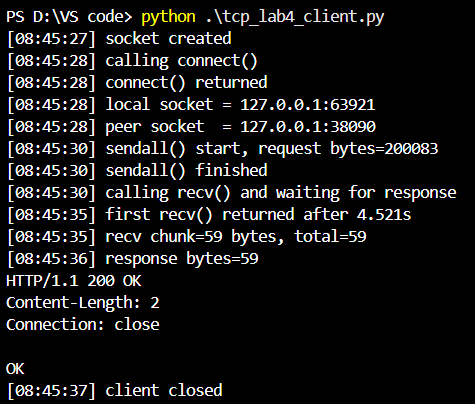
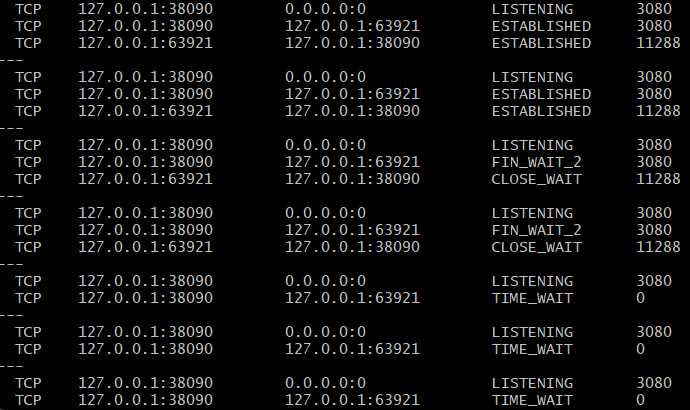
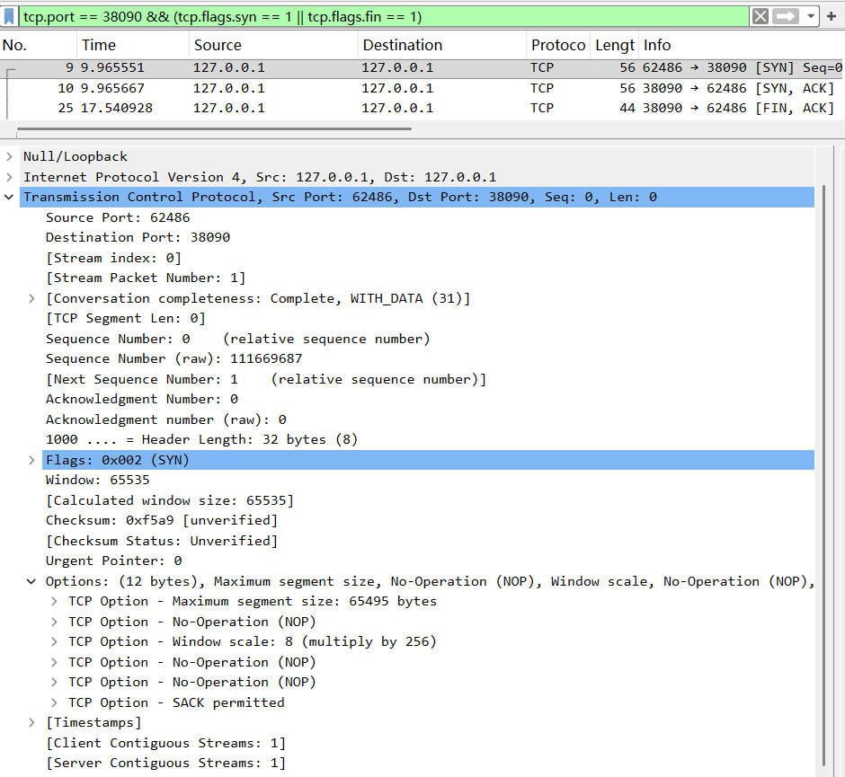
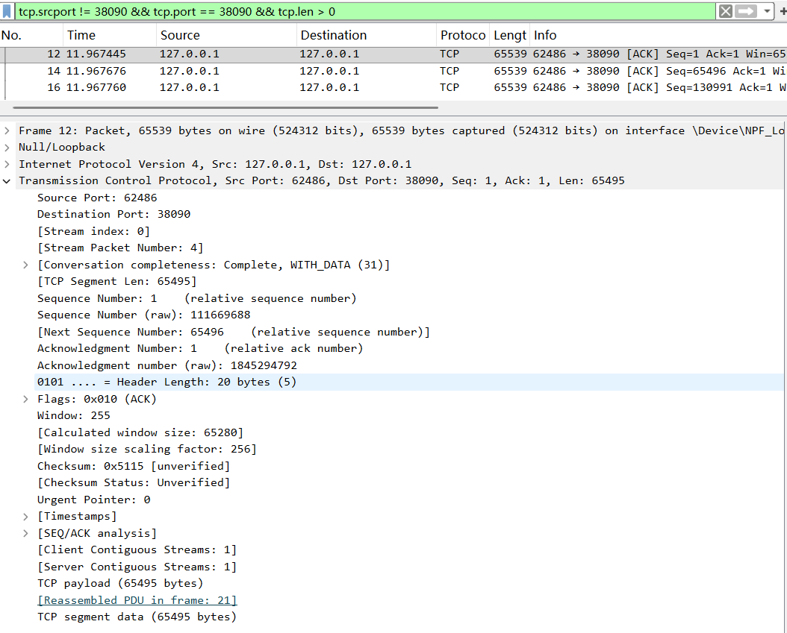
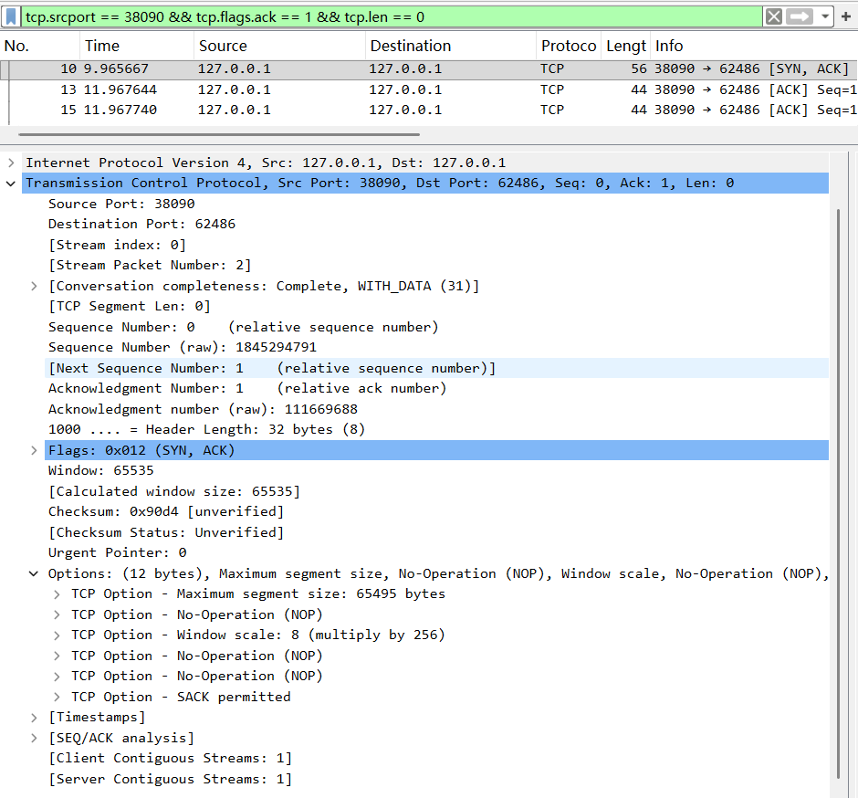
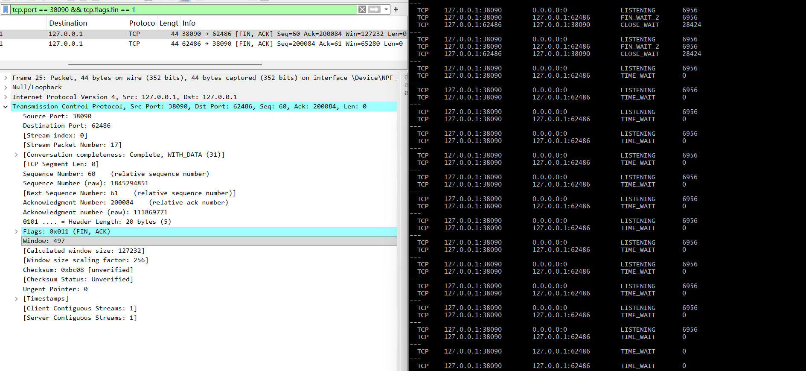

# Lab4：看见TCP 我不怕不怕啦

## 实验背景

本实验围绕一条 TCP 连接的完整生命周期展开，重点观察以下内容：

1. `socket()`、`listen()`、`accept()`、`connect()` 的职责区别
2. "连接"为什么本质上是交换控制信息而不是物理连线
3. TCP 头部中的端口号、序号、ACK 号、标志位、窗口、头部长度、可选字段
4. 三次握手如何建立收发准备
5. 应用层大块数据如何被 TCP 按 MSS 拆分
6. `Sequence Number` 与 `Acknowledgment Number` 如何配合工作
7. `recv()` 为什么会阻塞等待数据
8. 接收窗口如何反映接收方处理能力
9. ACK 与窗口更新为什么常常会被合并
10. `FIN` / `ACK` 如何完成断开
11. 为什么连接结束后套接字不会立刻删除

---

## 实验任务

### 任务一：准备实验环境并记录运行信息

**第一步：准备好四个窗口**

整个实验需要同时观察多个界面，建议在开始前把窗口布局摆好：

- **终端 A**：运行服务端
- **终端 B**：运行客户端
- **终端 C**：持续监控套接字状态（全程保持开启，不要关）
- **Wireshark**：抓包

**第二步：在终端 C 里启动持续监控**

TCP 状态变化很快，等你手动敲完 `ss` 命令再回车，状态可能已经过去了。用下面的命令让终端 C 每 0.5 秒自动刷新一次，之后只需要盯着这个窗口就行：

```bash
# Linux
watch -n 0.5 'ss -tan | grep 38090'

# macOS（没有 watch，用循环代替）
while true; do netstat -an | grep 38090; echo "---"; sleep 0.5; done

# Windows（Git Bash执行）
while true; do netstat -ano | grep 38090; echo "---"; sleep 0.5; done
```

如果你换了端口，把 `38090` 替换成实际端口。

**第三步：打开 Wireshark，选回环接口，填好过滤器，开始抓包**

回环接口在不同系统里名字不同：

| 系统 | 接口名 |
|:-----|:-------|
| Linux | `lo` |
| macOS | `lo0` |
| Windows | `Adapter for loopback traffic capture`（需提前安装 Npcap 并勾选回环支持） |

在显示过滤器里输入：

```text
tcp.port == 38090
```

然后点击开始抓包（蓝色鲨鱼鳍图标）。**先开始抓包，再运行脚本**，否则握手包会被漏掉。

**第四步：启动脚本**

```bash
# 终端 A
python3 tcp_lab4_server.py

# 终端 B（等服务端打印出 server listening on ... 后再运行）
python3 tcp_lab4_client.py
```

如果 `38090` 已被占用，两端都加环境变量换端口，同时记得把 Wireshark 过滤器和终端 C 里的端口号也改掉：

```bash
LAB4_PORT=38123 python3 tcp_lab4_server.py
LAB4_PORT=38123 python3 tcp_lab4_client.py
```

**第五步：填写下表**

| 项目                                | 你的填写内容 |
| :---------------------------------- | :----------- |
| 服务端监听地址                      |     127.0.0.1         |
| 服务端监听端口                      |           38090   |
| 客户端本地临时端口                  |    63921          |
| 客户端请求总字节数                  |         200083     |
| 服务端响应内容                      |        HTTP/1.1 200 OK\r\nContent-Length: 2\r\nConnection: close\r\n\r\nOK      |
| 客户端 `connect()` 返回前后的时间点 |      08:45:27 ~ 08:45:28        |
| 客户端首次收到响应前等待了多久      |      4.521 秒        |

各项数值均可直接从终端输出读取：服务端监听信息在 `server listening on ...`，客户端本地端口在 `local socket = ...`，请求字节数在 `sendall() start, request bytes=...`，等待时间在 `first recv() returned after ...s`。


---

### 任务二：观察套接字创建与连接建立

1. 服务端启动后，观察终端 C 出现 `LISTEN` 状态，截图留存。
2. 在终端 B 里启动客户端，观察它依次打印 `socket created`、`calling connect()`、`connect() returned`。
3. 客户端打印 `connect() returned` 之后，观察终端 C 出现 `ESTABLISHED`，截图留存。脚本在 `connect()` 返回后有 2 秒停顿，这段时间足够截图。

填写下表：

| 阶段                             | 你的填写内容 |
| :------------------------------- | :----------- |
| 服务端启动、客户端未连入时的状态 |          LISTENING    |
| `connect()` 返回后服务端状态     |        ESTABLISHED      |
| `connect()` 返回后客户端状态     |       ESTABLISHED       |

简答题：

1. 服务端在客户端连接前为什么处于 `LISTEN`？
服务端需通过 listen() 进入 LISTEN 状态，向系统声明该端口可接收连接请求，等待客户端发起三次握手。


2. 为什么这时还没有真正建立 TCP 连接？
LISTEN 仅为服务端单方面的监听准备状态，未完成三次握手，双方未同步序号、未确认收发能力，逻辑连接未建立。


3. `socket()` 与 `connect()` 的区别是什么？
socket() 仅创建通信端点（文件描述符），无网络连接；connect() 主动发起三次握手，完成后建立 TCP 连接。


4. 为什么 `connect()` 返回后才进入可稳定收发数据的状态？
connect() 阻塞直到三次握手完成，双方同步序号、确认收发能力，进入 ESTABLISHED 状态，此时才能可靠收发数据。


5. 为什么"网线一直连着"不等于"TCP 连接已经建立"？
网线连通仅代表物理链路正常，TCP 连接是传输层的逻辑连接，必须完成三次握手才能建立，二者完全解耦。


6. 这里的"连接"更准确地说是在做什么？
连接是双方内核通过三次握手，同步初始序号、确认收发能力、预留资源，维护一套状态机，保障后续数据可靠传输的逻辑过程。



---

### 任务三：观察三次握手与 TCP 头部字段

**定位握手包**：在 Wireshark 过滤器里输入下面的条件，可以屏蔽中间的数据包，只留下握手和断开阶段的控制包：

```text
tcp.port == 38090 && (tcp.flags.syn == 1 || tcp.flags.fin == 1)
```

包列表最前面的三个包就是三次握手（SYN → SYN-ACK → ACK）。

**找到各字段的位置**：点击某个握手包，在下方详情栏展开 `Transmission Control Protocol`。源端口、目的端口、Seq、Ack、Flags、Window、Header Length 都在这里。TCP 选项在最底部的 `Options` 子项里，展开后可以看到 MSS、Window Scale、SACK Permitted，注意这三项只出现在带 SYN 标志的包里，纯 ACK 包里没有。

**关于序号显示**：Wireshark 默认开启相对序号，会把每个方向的初始序号归零显示，所以 SYN 包的 Seq 看起来是 `0`，而不是真实的随机大数。这是正常现象，实验报告按 Wireshark 显示的值填写即可。如果你想看真实值，可以去 `Edit → Preferences → Protocols → TCP` 里取消勾选 `Relative sequence numbers`。

填写下表：

| 报文       | 源端口 | 目的端口 | Seq  | Ack  | Flags | Window | Header Length |
| :--------- | :----- | :------- | :--- | :--- | :---- | :----- | :------------ |
| 第一次握手 |     62486    |    38090    |    0  |  0   |  SYN  |     65535   |     32字节          |
| 第二次握手 |     38090   |   62486       |    0  |   1   |     SYN,ASK  |    65535    |     32          |
| 第三次握手 |   62486      |    38090      |    1  |     1 |    ASK   |  65535      |          20     |

第一次握手（SYN）的 Ack 字段在 Wireshark 里通常显示为空或 `0`，这是正常的，因为此时客户端还没有收到服务端的任何数据。Header Length 在没有选项时是 20 字节，握手包因为携带了 MSS 等选项通常是 28 或 32 字节。

| TCP 选项       | 你的填写内容 |
| :------------- | :----------- |
| MSS            |    65495 字节          |
| Window Scale   |     8         |
| SACK Permitted |       是       |

回环接口的 MSS 通常是 65495（因为回环 MTU 是 65536，比以太网的 1500 大得多），这会影响后续任务五里是否能观察到分段。

简答题：

1. 发送方和接收方端口号在连接阶段的作用是什么？
标识主机上的应用进程，实现传输层多路复用与多路分解。
与源 IP、目的 IP 一起构成四元组，唯一标识一条 TCP 连接。
在三次握手中明确通信双方，帮助操作系统建立、匹配套接字。

2. TCP 头部如何帮助找到目标套接字？
TCP 头部包含源端口号和目的端口号，与 IP 头部的源 IP、目的 IP 组合成四元组：
源 IP + 源端口 + 目的 IP + 目的端口
操作系统根据这个四元组在 TCP 连接表中查找对应的套接字，将报文交付给正确的应用程序。

3. 为什么初始序号不是简单固定从 1 开始？
防止旧连接的延迟报文干扰新连接，避免数据混乱。
提高安全性，防止攻击者预测序列号、伪造报文或劫持连接。
使每条 TCP 连接的序号空间相互独立，保证传输可靠性。


4. 为什么 TCP 可选字段更容易在连接阶段看到？
TCP 选项（MSS、窗口缩放、SACK 等）主要用于连接建立时的参数协商。
这些能力只需要在三次握手阶段交换一次，连接建立后不再需要。
数据报文通常只使用 20 字节固定头部，不携带选项，因此握手包更容易看到可选字段。




---

### 任务四：区分头部中的控制信息和套接字中的控制信息

用以下过滤器分别找到两类报文：

```text
# 纯控制报文（无应用数据）
tcp.port == 38090 && tcp.len == 0

# 携带应用数据的报文
tcp.port == 38090 && tcp.len > 0
```

从纯控制报文里选一个（SYN、纯 ACK 或 FIN-ACK 都可以），从数据报文里选一个（客户端发请求或服务端发响应的包）。

填写下表：

| 项目                   | 你的填写内容 |
| :--------------------- | :----------- |
| 纯控制报文的类型       |       SYN 报文（或 ACK 报文 / FIN-ACK 报文）       |
| 携带应用数据的报文类型 |   客户端请求数据报文（或服务端响应数据报文）           |
| 头部中的控制信息举例   |    SYN 标志位、ACK 标志位、序号 Seq、确认号 Ack、窗口大小 Window          |
| 套接字中的控制信息举例 |        连接状态（ESTABLISHED、SYN_SENT、LISTEN）、连接四元组、滑动窗口指针、重传计时器      |

简答题：

1. 为什么"头部中的控制信息"和"套接字中的控制信息"不是同一件事？
（1）所在位置不同
头部控制信息：在 TCP 报文头部里，是随报文在网络上传输的内容。
套接字控制信息：在内核的套接字结构体中，是主机本地维护的连接状态，不发送到网络上。
（2）作用范围不同
头部信息：用于通信双方交互，告诉对方当前报文的含义（如 SYN、ACK、FIN）。
套接字信息：用于本机操作系统管理连接，记录连接状态、窗口、计时器、队列等。
（3）生命周期不同
头部信息：只存在于单个报文，发完即结束。
套接字信息：贯穿整个 TCP 连接，从建立到断开一直存在并更新。
内容不同
头部：标志位、序号、确认号、窗口等。
套接字：连接状态、重传队列、接收发送缓存、RTT 估计、定时器等。


---

### 任务五：观察数据分段、序号与 ACK

客户端发送的请求体是 200000 字节，超过了回环接口 MSS（约 65495 字节），因此应该可以在 Wireshark 里看到多个连续的数据段。用下面的过滤器找到客户端发出的数据包：

```text
tcp.srcport != 38090 && tcp.port == 38090 && tcp.len > 0
```

在包列表里连续选几个数据段，对比它们的 Seq 值。相邻两段的关系是：后一段的 Seq = 前一段的 Seq + 前一段的 TCP Segment Len。

找服务端返回给客户端的纯 ACK 报文：

```text
tcp.srcport == 38090 && tcp.flags.ack == 1 && tcp.len == 0
```

填写下表：

| 数据段  | Seq  | Ack  | TCP Segment Len | Flags |
| :------ | :--- | :--- | :-------------- | :---- |
| 第 1 段 |   1   |  1    |      65496           |   0x010(ACK)    |
| 第 2 段 |    65496  |   1   |     1 65495          |     0x010(ACK)  |
| 第 3 段 |  130991    |   1   |     65496            |   0x010(ACK)    |

| ACK 报文 | Ack Number | Flags | Window |
| :------- | :--------- | :---- | :----- |
| 第 1 个  |     1       |    0x012(SYN,ACK)   |    65535    |
| 第 2 个  |     65496       |   0X010(ACK)    |    511    |
| 第 3 个  |       130991     |  0X010(ACK)     |     256   |

| 项目                         | 你的填写内容 |
| :--------------------------- | :----------- |
| 是否发生分段                 |   否           |
| 握手中观察到的 MSS           |     	65495 字节（回环接口 MSS）         |
| 单段长度与 MSS 的关系        |   单段数据长度（0 字节） < MSS（65495 字节），远小于 MSS 限制           |
| ACK 号大致确认到了第几个字节 |       累计确认号表示期望收到下一个字节的序号，例如 Ack=1 表示已确认第 0 字节       |

简答题：

1. 应用程序是否直接决定每个网络包的数据长度？为什么？
不是。原因：
应用层与传输层职责不同：应用程序调用 send() 发送数据，仅将数据交给操作系统内核。
TCP 的封装与分段：TCP 协议会根据滑动窗口、拥塞控制、MSS 最大分段大小等机制，将应用数据切割成多个分段，再封装成 TCP 报文段。
网络传输的优化：TCP 为了保证传输效率和可靠性，会动态调整每个报文段的长度，而不是由应用程序直接决定。


2. 大块应用数据为什么会被拆分？
遵守 MSS 限制：TCP 最大分段大小（MSS）限制了每个报文段的数据载荷，超过 MSS 的数据必须拆分。
避免 IP 分片：如果一个 TCP 报文段超过 MSS，封装成 IP 包后可能超过 MTU，导致 IP 层分片。分片会增加丢包风险和重组开销，拆分能避免 IP 层分片。
流量控制与拥塞控制：拆分后的数据段可以更灵活地进行滑动窗口传输和拥塞控制，避免一次性发送大量数据导致网络拥塞。


3. `MSS` 与 `MTU` 的关系是什么？
MSS 是 MTU 的 “净荷” 部分。
定义：
MTU (Maximum Transmission Unit)：数据链路层帧所能承载的最大 IP 数据包大小（通常为 1500 字节，回环接口为 65535 字节）。
MSS (Maximum Segment Size)：TCP 报文段中数据部分的最大大小，是 TCP 层的最大载荷。
MSS=MTU-IP头部长度-TCP头部长度
例如：以太网环境下，默认 IP 头部 20 字节 + TCP 头部 20 字节，故 MSS=1500−40=1460
本实验回环环境下，
MSS=65535−40=65495

4. "一次 `sendall()`"与"一个 TCP 包"之间是什么关系？
sendall()：应用层的一次完整数据发送请求，可能发送大块数据（如几 MB）。
TCP 包：传输层将大块数据拆分成的若干个较小的报文段。
关系：一次 sendall() 调用触发的应用数据，会被 TCP 协议拆分成多个符合 MSS 限制的 TCP 报文段，在网络中独立传输。


5. 为什么 ACK 体现的是累计确认？
TCP 使用累计确认（Cumulative Acknowledgment）机制。
确认逻辑：ACK 号表示 “期望收到的下一个字节的序号”。
原理：如果收到了序号为 N 之前的所有数据，只需发送 ACK=N 即可确认所有字节。
优势：只需一个 ACK 就能确认连续的多个字节，减少了控制报文的数量，降低了网络开销，提高了传输效率。


6. 如果中间某一段丢失，ACK 会出现什么变化？
ACK 号不变：接收方会持续发送重复的 ACK，确认号始终指向丢失段的起始序号。
触发重传：发送方收到 3 个重复的 ACK（Dup ACK）后，会触发快速重传机制，立即重传丢失的报文段，而无需等待超时计时器到期。
累计确认的体现：由于丢失段之后的数据无法按序交付，接收方无法确认新的序号，因此 ACK 号会一直停滞在丢失段之前。





---

### 任务六：观察 `recv()` 阻塞与窗口字段

`recv()` 的等待时间直接从客户端终端读取，`calling recv() and waiting for response` 到 `first recv() returned after ...s` 之间就是等待时长，脚本已经帮你计算好了。

在 Wireshark 里找窗口值：用过滤器 `tcp.port == 38090 && tcp.flags.ack == 1` 列出所有 ACK 包，点击其中一个，在详情栏 `Transmission Control Protocol` 里找 `Window` 字段。如果同时显示了 `Calculated window size`，优先看这个值，它已经把 Window Scale 的缩放算进去了，是对方实际能接收的字节数。

如果包列表的 Info 列出现了 `[TCP Window Update]` 标注，说明这个包的主要目的是通知对方窗口变化，重点观察它的 `Window` 字段。

填写下表：

| 项目                                   | 你的填写内容 |
| :------------------------------------- | :----------- |
| 客户端开始调用 `recv()` 的时间         |         [08:45:30]     |
| 客户端第一次收到响应的时间             |        [08:45:35]      |
| `recv()` 是否立刻返回                  |    否          |
| 首次收到响应前等待了多久               |      4.521 秒        |
| `recv()` 等待期间连接是否已经建立      |          是    |
| 第 1 个 ACK 报文的窗口值               |      65535        |
| 第 2 个 ACK 报文的窗口值               |         65535     |
| 第 3 个 ACK 报文的窗口值               |        127232     |
| 窗口值是否变化                         |       是       |
| 若变化，变化趋势                       |         先稳定，后随接收缓存变化动态调整，整体呈现先稳定后按需变化的趋势     |
| ACK 与窗口更新是否可以出现在同一个包中 |         是     |
| 是否看到 RTT 或 ACK 往返时间相关信息   |           是   |

简答题：

1. "连接建立"和"应用收到数据"之间是什么关系？
连接建立是应用收到数据的前提：TCP 三次握手完成后，连接进入ESTABLISHED状态，才具备数据传输的能力。
两者是异步的：连接建立完成后，应用层调用recv()进入阻塞等待，直到服务端发送的应用数据到达，recv()才会返回。
本实验中：客户端在08:45:28完成连接建立，08:45:30调用recv()，等待 4.521 秒后才收到数据，体现了连接建立与数据接收的异步性。


2. 为什么说 `read` / `recv` 在数据未到达时会被挂起？
阻塞 I/O 的默认行为：默认情况下，socket 工作在阻塞模式，recv()是一个阻塞系统调用。
内核的等待机制：当应用调用recv()时，若内核的 TCP 接收缓存中没有可读取的应用数据，内核会将该进程挂起（进入睡眠状态），直到有数据到达、连接关闭或发生错误，才会唤醒进程并返回数据。
本实验中：客户端调用recv()后，服务端延迟 4.521 秒才发送响应，因此进程被挂起，直到数据到达才返回。


3. 窗口字段反映了接收方哪方面的能力？
TCP 窗口字段（Window）反映了接收方的接收缓存容量（流量控制能力）：
窗口值 = 接收方当前可用的接收缓存大小，单位为字节。
它告诉发送方：「我最多还能接收这么多字节的数据，你不要发超过这个数量」。
窗口缩放（Window Scale）会进一步扩展窗口值，支持高速网络下的大窗口传输。


4. 为什么发送方不能无限制连续发送数据？
接收方缓存有限：接收方的 TCP 接收缓存大小是有限的，若发送方无限制发送，会导致接收方缓存溢出，数据丢失。
网络拥塞风险：无限制发送会导致网络链路拥塞，引发大量丢包、重传，降低整体传输效率。
TCP 的流量控制机制：通过窗口字段实现流量控制，发送方必须严格遵守接收方的窗口限制，不能发送超过窗口大小的数据。


5. 滑动窗口为什么既提高效率又避免压垮接收方？
避免压垮接收方（流量控制）
滑动窗口机制让接收方通过窗口字段，动态通知发送方自己的可用缓存大小。
发送方只能发送窗口内允许的字节数，当接收方缓存满时，窗口会缩小甚至为 0，强制发送方停止发送，避免接收方被压垮。
（2）提高传输效率
无需逐包确认：发送方可以连续发送多个报文段，无需等待每个段的 ACK，大幅减少了控制报文的开销。
流水线传输：利用 RTT 时间持续发送数据，充分利用网络带宽，提升吞吐量。
动态调整窗口：接收方处理完数据后，会更新窗口大小，通知发送方继续发送，实现「边接收、边确认、边发送」的高效传输。


---

### 任务七：观察响应返回与双向 `seq/ack`

TCP 的 Seq/Ack 是双向独立的，客户端有自己的发送序号，服务端有自己的发送序号。用下面的过滤器只看服务端发出的数据包（源端口是 38090，有应用数据）：

```text
tcp.srcport == 38090 && tcp.len > 0
```

紧跟在服务端数据包后面的、客户端发出的 ACK 包，其 Ack Number 确认的就是服务端的发送序号。

填写下表：

| 项目                     | 你的填写内容 |
| :----------------------- | :----------- |
| 服务端响应数据报文的 Seq |         1（相对序号，原始值：1845294792）     |
| 服务端响应数据报文的 Ack |        200084（相对序号，对应客户端 200083 字节数据的确认）      |
| 客户端确认报文的 Ack     |       60（相对序号，对应服务端 59 字节响应数据的确认，服务端Seq + 数据长度）       |

简答题：

1. 为什么 TCP 的 `seq/ack` 是双向分别计算的？
TCP 是全双工通信协议，通信双方可以同时发送和接收数据，因此需要两套独立的序号 / 确认号体系：
双向数据流独立：TCP 连接中存在两条独立的数据流：「客户端→服务端」和「服务端→客户端」，两条流的传输完全异步、互不干扰。
独立可靠性保障：每条流都需要独立的序号（Seq）来标记数据顺序，独立的确认号（Ack）来确认对方的数据是否到达，从而保证双向数据的可靠传输。
避免序号冲突：双向分别计算序号，确保两条流的序号空间完全独立，不会出现序号混淆、数据错乱的问题。


2. 为什么双方都需要各自的初始序号？
双向独立的序号空间：TCP 是全双工通信，客户端和服务端是两个独立的发送方，各自需要一个独立的初始序号（ISN），作为自己发送数据流的序号起点。
防止历史报文干扰：动态、独立的 ISN 可以避免旧连接的延迟报文被误判为新连接的有效数据，保证连接的可靠性。
安全性要求：独立的 ISN 可以防止攻击者预测序号、伪造报文或劫持连接，提升 TCP 连接的安全性。
三次握手的必要环节：双方通过 SYN 报文交换各自的 ISN，完成序号协商，是三次握手建立连接的核心步骤之一。


3. 为什么发送应用数据时报文通常仍然带 `ACK`？
捎带确认（piggybacking）优化：当发送方有应用数据要发送时，可以将对对方数据的 ACK「捎带」在数据报文中，无需单独发送纯 ACK 报文，大幅减少了网络中的控制报文数量，提升传输效率。
TCP 的全双工特性：发送应用数据的同时，接收方可能也在发送数据，因此发送方需要持续确认对方的数据流，捎带 ACK 是最经济的方式。
可靠性保障：即使携带数据，ACK 仍然是确认对方数据的必要手段，确保对方知道数据已被正确接收，避免不必要的重传。
窗口更新需求：ACK 报文同时携带窗口字段，用于通知发送方自己的接收缓存状态，实现流量控制，因此数据报文捎带 ACK 可以同步完成确认和流量控制。


---

### 任务八：观察连接断开与套接字延迟删除

用下面的过滤器精确定位所有带 FIN 的包：

```text
tcp.port == 38090 && tcp.flags.fin == 1
```

通常会看到两个 FIN 包（双方各一个）。看第一个 FIN 包的源端口，就能判断谁先发起断开。

**关于 TIME-WAIT**：TIME-WAIT 只出现在主动发起关闭的一方（先发 FIN 的那端）。服务端脚本在 `conn.close()` 之后会继续运行 10 秒再退出，这段时间可以在终端 C 里观察 TIME-WAIT。Linux 上 TIME-WAIT 通常持续约 60 秒，macOS 上可能较短，如果没有观察到请如实说明。

填写下表：

| 项目                                    | 你的填写内容 |
| :-------------------------------------- | :----------- |
| 谁先发送 FIN                            |    服务端（源端口 38090 先发 FIN，对应服务端执行 conn.close()）          |
| 关闭阶段共观察到几个带 FIN 的报文       |          2 个（服务端发 FIN+ACK，客户端响应 FIN+ACK，双向关闭）    |
| 最终 ACK 是否可见                       |          是   |
| 关闭后是否观察到 `TIME-WAIT` 或等价现象 |         是     |

简答题：

1. 为什么关闭连接不能只发一个结束通知？
因为 TCP 是全双工协议，连接两端存在两条独立的数据流：
单向结束不等于双向结束：发送 FIN 只是表示 “我这边没有数据要发了”，但不能保证对方已经发送完所有数据。如果只发一个 FIN 直接断开，可能导致对方还未发送完的数据被丢弃。
四次挥手的可靠性：需要双方各自发送 FIN并 ** 确认 ****，确保双向数据流都正常结束。
第一次挥手：主动方发 FIN（告诉对方：我说完了）。
第二次挥手：被动方发 ACK（确认收到：知道你说完了）。
第三次挥手：被动方发 FIN（告诉对方：我也说完了）。
第四次挥手：主动方发 ACK（确认收到：你也说完了）。
只有 4 次挥手完成，连接才真正彻底释放。


2. 为什么连接结束后套接字不会立刻删除？
主要是为了保证可靠性，核心原因在主动关闭方（处于 TIME_WAIT 的一端）：
确保对方收到最后的 ACK：如果主动方发完最后一个 ACK 后立即删除套接字，一旦 ACK 丢失，被动方会重传 FIN，此时主动方已无连接信息，无法重传 ACK，导致被动方连接断开异常。
等待旧报文消失（MSL）：需要等待 2MSL（最大报文生存时间），确保网络中所有该连接的旧报文、重复报文都从网络中消失，避免干扰新的连接。
释放端口资源的时机：TIME_WAIT 结束后，操作系统才会真正回收套接字和端口，允许该端口被重新使用。


3. 如果最后一个 ACK 丢失，而旧套接字已经立刻删除，可能带来什么问题？
被动关闭方连接异常断开：被动方没收到最后的 ACK，会认为 FIN 未送达，重传 FIN 多次。由于主动方已删除套接字，无法响应，被动方最终会超时重传失败，连接异常断开（RST 复位）。
资源泄漏与连接混乱：主动方错误释放了连接资源，若短时间内建立新连接，可能因为旧连接残留信息导致端口占用冲突或数据误交付。
数据传输不彻底：虽然双方都已经发送完数据，但缺乏最终确认，底层无法保证数据被可靠持久化，可能导致业务层数据丢失。




---

## 问答题

1. TCP 的"连接"到底意味着什么？它为什么不是"把网线连上"？
TCP 连接是逻辑连接，是双方内核维护的一套状态：四元组、序号、窗口、连接状态等。
不是物理连接：网线只是通道，同一物理链路上可同时有很多 TCP 连接；中间设备不感知连接，只转发报文。


2. 三次握手为什么能让双方进入可通信状态？
握手完成双向收发能力确认，并同步双方初始序号。
双方都确认：我能发、你能收；你能发、我能收，序号对齐，才能可靠传输。


3. TCP 头部中的控制字段如何支撑收发数据？
Seq：给数据编号，保证有序。
Ack：累计确认，判断是否丢包。
标志位：SYN/ACK/FIN 管理连接建立与关闭。
Window：控制发送速度，做流量控制。
校验和：检查数据是否出错。


4. ACK、窗口、等待时间为什么会共同影响 TCP 的可靠传输？
ACK：确认数据收到，没确认就重传。
窗口：限制发送量，防止接收方缓存溢出。
超时时间：丢包时自动重传，兜底可靠性。
三者配合实现可靠、不拥塞、不溢出的传输。


5. 断开连接为什么仍然需要严格的控制信息交换？
TCP 是全双工，两条独立数据流，必须各自关闭。
确保双方数据都发完、都确认，避免丢数据。
最后等待 2MSL，防止旧报文干扰新连接，安全释放资源。


6. 如果服务端根本没有启动，客户端调用 `connect()` 时会看到什么现象？
客户端发 SYN，服务器回复 RST 复位包。
connect () 直接报错：Connection refused。
网络不可达时则超时，报 Connection timed out。


7. 如果中途人为制造丢包，ACK、重传、窗口之间会出现什么变化？
ACK：出现重复 ACK，确认号卡住不动。
重传：3 个重复 ACK 触发快速重传，超时则超时重传。
窗口：拥塞窗口减小，发送变慢；丢包恢复后窗口慢慢回升。


8. 如果把客户端发送的数据改得更大，窗口字段和分段情况会如何变化？
分段：数据按 MSS 拆分，越大分段越多。
窗口：接收缓存被占用，窗口逐渐变小；接收方读完后发窗口更新，窗口恢复。


9. 如果把服务端读取速度改得更慢，是否更容易看到窗口更新甚至零窗口？
是。读得慢 → 接收缓存很快被填满 → 窗口不断缩小，甚至出现 零窗口 (Window=0)。等服务端读取后，会发 Window Update 通知窗口恢复。


---

## 截图要求

- 截图须清晰，终端文字和 Wireshark 字段可读。
- 所有截图与本 `Lab4.md` 放在同一目录下。
- 命名规范：

| 截图内容               | 文件名                  |
| :--------------------- | :---------------------- |
| 服务端与客户端运行结果 | `run.png`               |
| `ss` 状态变化          | `states.png`            |
| 三次握手与 TCP 选项    | `handshake_header.png`  |
| 大请求分段与 MSS       | `segmentation.png`      |
| ACK 与窗口观察         | `ack_window.png`        |
| 断开与最终状态         | `teardown_timewait.png` |

具体要求：

1. `run.png`：终端截图，至少能看到服务端 `server listening on ...`、客户端 `calling connect()`、`connect() returned`、`calling recv() and waiting for response`、`first recv() returned after ...s`。

2. `states.png`：终端截图，至少能看到 `LISTEN`、`ESTABLISHED`，以及 `TIME-WAIT`（若能观察到）。推荐截 `watch` 命令的持续输出画面，可以在一张截图里同时展示多个状态的变化过程。

3. `handshake_header.png`：Wireshark 截图，至少能看到三次握手中某个包的 `Source Port`、`Destination Port`、`Sequence Number`、`Acknowledgment Number`、`Flags`、`Window`，以及 `Options` 中的 `Maximum segment size`、`Window Scale`、`SACK Permitted`。

4. `segmentation.png`：Wireshark 截图，至少能看到客户端发送数据的 TCP 包的 `TCP Segment Len`、`Seq`、`Ack`。若能观察到分段，尽量截出多个连续数据段。

5. `ack_window.png`：Wireshark 截图，至少能看到一个或多个 ACK 报文的 `Acknowledgment Number`、`Window`，以及 `Calculated window size`（若显示）、`[TCP Window Update]`（若出现）。

6. `teardown_timewait.png`：Wireshark 截图或 Wireshark 与终端截图的拼图，至少能看到带 `FIN` 的包，以及 `TIME-WAIT` 状态（若能观察到）。

---

## 提交要求

在自己的文件夹下新建 `Lab4/` 目录，提交以下文件：

```text
学号姓名/
└── Lab4/
    ├── Lab4.md
    ├── tcp_lab4_server.py
    ├── tcp_lab4_client.py
    ├── run.png
    ├── states.png
    ├── handshake_header.png
    ├── segmentation.png
    ├── ack_window.png
    └── teardown_timewait.png
```

---

## 截止时间

2026-04-23，届时关于 Lab4 的 PR 请求将不会被合并。
