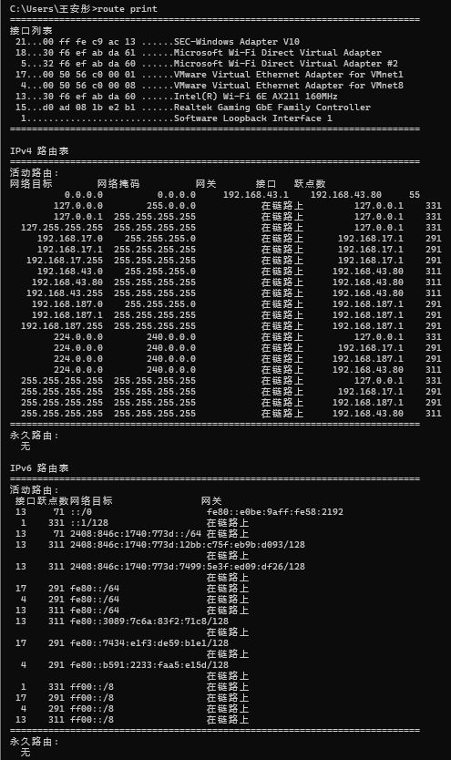
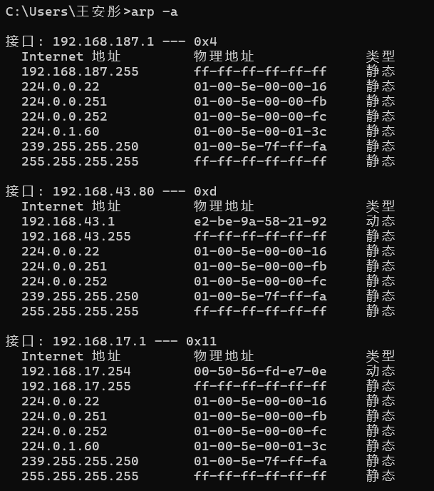
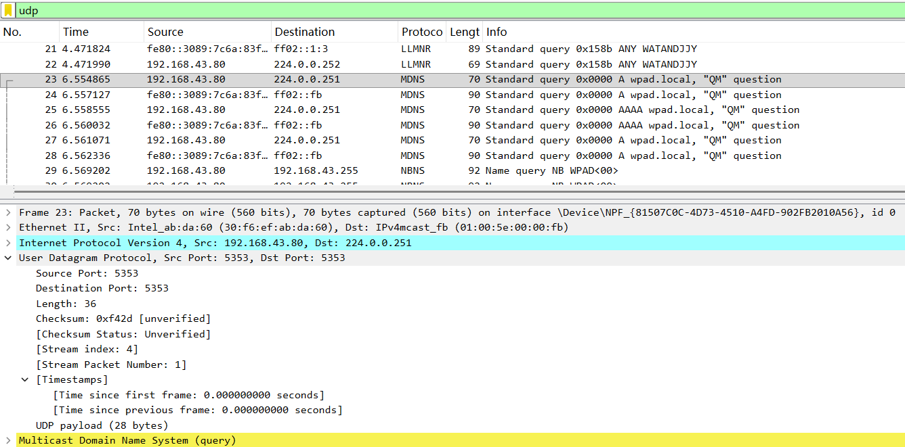
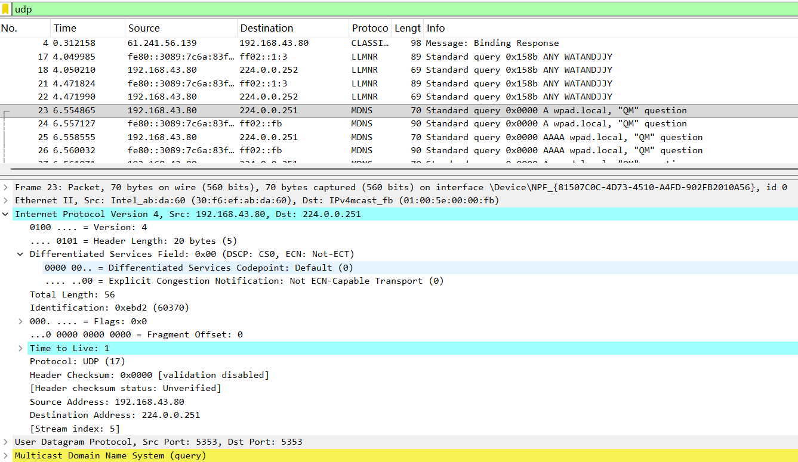
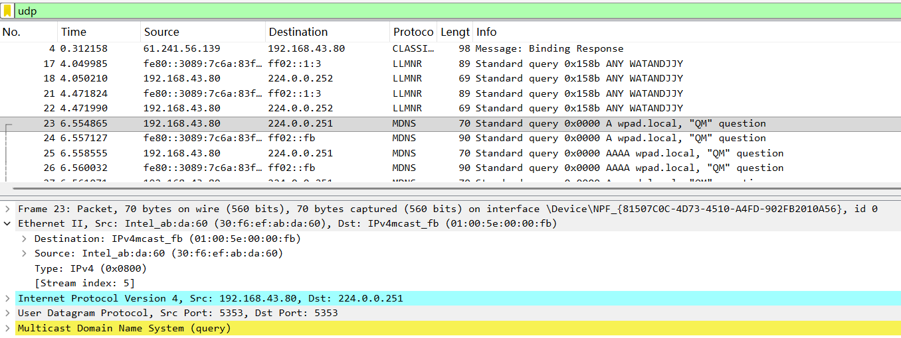
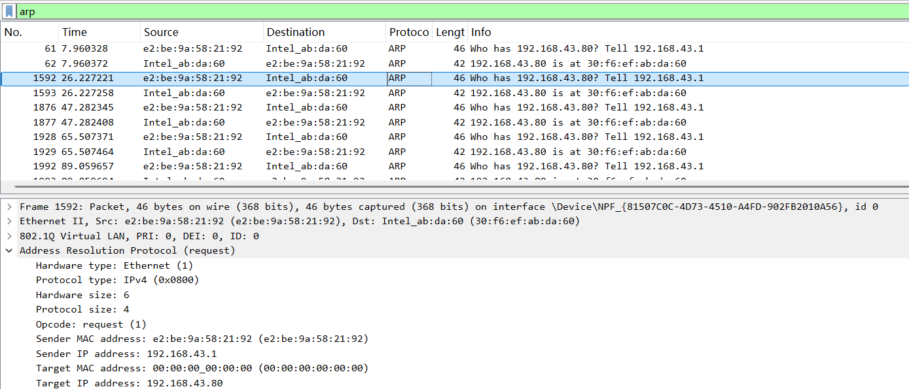
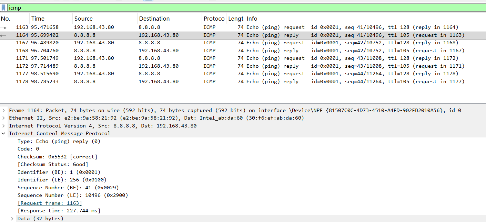

# Lab5：IP 与以太网的包收发操作

## 实验背景

本实验围绕 IP 模块与以太网在包收发过程中的角色展开，重点观察以下内容：

1. 网络包的基本结构：头部（IP 头部 + MAC 头部）与数据
2. IP 头部各字段的含义：版本号、TTL、协议号、发送方/接收方 IP 地址等
3. MAC 头部各字段的含义：接收方/发送方 MAC 地址、以太类型
4. IP 地址与 MAC 地址的区别与协作
5. ARP 协议如何通过 IP 地址查询 MAC 地址
6. 路由表的结构与查询方式
7. UDP 协议与 TCP 协议的区别：无连接、无确认、无重传
8. UDP 头部结构：发送方端口号、接收方端口号、数据长度、校验和
9. ICMP 协议的作用与常见消息类型（Echo、Destination Unreachable 等）

---

## 实验任务

### 任务一：查看路由表、ARP 缓存并启动 Wireshark

**第一步：打开 Wireshark，选择主网络接口，开始抓包**

> **注意**：本次实验必须使用真实网络接口（`en0`/`eth0`/`以太网`），不要选回环接口。回环接口不经过以太网，无法观察到 MAC 头部和 ARP 过程。

选择你的主网络接口，开始抓包。本次实验的大部分任务会共用同一次抓包。

**第二步：查看本机路由表**

```bash
# Linux
route -n
ip route show

# macOS
netstat -rn

# Windows
route print
```

截图并保存为 `route_table.png`。


**第三步：查看本机 ARP 缓存**

```bash
# Linux / macOS / Windows
arp -a
```

截图并保存为 `arp_cache.png`。


**第四步：填写下表**

从路由表和 ARP 缓存的输出中提取信息：

| 项目                         | 你的填写内容 |
| :--------------------------- | :----------- |
| 本机 IP 地址                 |   192.168.43.80         |
| 本机所在子网                 |       192.168.43.0/24       |
| 子网掩码                     |       255.255.255.0       |
| 默认网关 IP                  |        192.168.43.1      |
| 默认网关 MAC 地址            |        e2-be-9a-58-21-92      |
| 本机网卡 MAC 地址            |  192.168.43.80：Intel Wi-Fi 网卡

简答题：

1. 路由表的每一行包含哪些关键字段？教材中提到的 `Network Destination`、`Netmask`、`Gateway`、`Interface` 分别对应什么含义？
Network Destination（网络目标）：表示该路由条目匹配的目标网络 / 主机 IP 地址，0.0.0.0代表所有未匹配的目标（默认路由）。
Netmask（网络掩码）：与目标 IP 配合，确定目标 IP 所属的子网范围，决定路由条目的匹配精度。
Gateway（网关）：表示数据包需要转发到的下一跳 IP 地址，若为 “在链路上”，表示目标 IP 与本机在同一子网，直接 ARP 寻址发送。
Interface（接口）：表示本机从哪个网卡接口发送该数据包，即本机的出口 IP 地址。
补充：还有跃点数，表示路由的优先级，数值越小优先级越高。


2. 当目标 IP 地址不在本子网时，包会先发给谁？路由表的哪一列提供了这个信息？
当目标 IP 地址不在本子网时，数据包会先发送给默认网关（下一跳路由器）。路由表中Gateway（网关）列提供了这个信息：如果目标 IP 与本机子网掩码按位与后，不匹配任何直连路由条目，就会匹配默认路由条目，将数据包转发到该条目的网关 IP 地址。


3. 路由表的默认网关（`0.0.0.0`）条目的作用是什么？什么时候会匹配到这一行？
作用：作为 “默认路由”，为所有未匹配到任何具体路由条目的数据包提供统一的转发出口，将数据包发送到默认网关，由网关负责后续转发。
匹配场景：当目标 IP 地址不属于本机的任何直连子网（如访问公网 IP 或其他陌生子网），且路由表中没有其他更具体的路由条目时，会匹配到0.0.0.0这条默认路由。


4. 教材提到，确定发送方 IP 地址的关键在于"判断应该使用哪块网卡"。结合你查到的本机网卡信息，说明 IP 模块是如何做出这个判断的。
访问192.168.17.0/24网段的目标时，IP 模块会匹配192.168.17.1所在的 VMnet1 网卡，直接发送。
访问192.168.43.0/24网段的目标时，会匹配192.168.43.80所在的 Wi-Fi 网卡，直接发送。
访问公网 IP 时，会匹配默认路由，选择192.168.43.80对应的 Wi-Fi 网卡，转发到网关192.168.43.1。


---

### 任务二：观察 UDP 头部

只要计算机处于联网状态，Wireshark 中就会持续出现大量 UDP 流量（DNS、mDNS、DHCP、NTP 等），无需手动生成。

**第一步：在 Wireshark 中设置过滤器**

```text
udp
```

**第二步：在包列表中找一个 UDP 包**

随便选一个即可。如果包太多，可以加上源或目的 IP 来缩小范围，例如 `udp && ip.addr == 你的IP`。如果需要 DNS 包，也可以用 `udp.port == 53` 过滤。

> **可选**：如果想明确看到一个完整的请求-响应对，可以在终端中执行 `nslookup example.com`，Wireshark 中就会出现对应的 DNS 请求包。

**第三步：点击选中的 UDP 包，在详情栏展开 `User Datagram Protocol`**

填写下表：

| 项目               | 你的填写内容 |
| :----------------- | :----------- |
| UDP 头部总长度     |      8字节        |
| 源端口             |      5353        |
| 目的端口           |      5353        |
| 长度（Length）     |      36        |
| 校验和（Checksum） |     0xf42d         |

简答题：

1. 你观察到的 UDP 头部长度是多少字节？TCP 头部至少 20 字节。UDP 省略了哪些字段？这些字段的缺失带来了什么后果？
UDP 头部长度：观察到的 UDP 头部长度是 8 字节，这是 UDP 头部的固定最小长度。
与 TCP 相比，UDP 省略的字段：
序列号（Sequence Number）
确认号（Acknowledgment Number）
标志位（SYN、ACK、FIN、RST 等）
窗口大小（Window Size）
紧急指针（Urgent Pointer）
选项字段（Options）
缺失带来的后果：
无连接：发送数据前不需要建立连接，也没有握手过程，效率高但不可靠。
不保证可靠交付：没有确认和重传机制，数据包可能丢失、重复或乱序到达。
不保证有序交付：没有序列号，接收方无法按序重组数据。
无流量控制 / 拥塞控制：没有窗口机制，发送方可能会发送过快，导致接收方或网络过载。


2. UDP 头部中的"长度"字段指的是什么长度？
UDP 头部中的 Length 字段，指的是 整个 UDP 报文的总长度，包括 UDP 头部（8 字节） + UDP 数据载荷（Payload） 的长度。
在你这张截图里：
Length = 36
说明：UDP 头部 8 字节 + 数据载荷 28 字节 = 36 字节，和下方标注的 UDP payload (28 bytes) 完全对应。




---

### 任务三：观察 IP 头部字段

点击任务二中的同一个 UDP 包，在详情栏展开 `Internet Protocol Version 4`。

填写下表：

| 字段名称               | 你的填写内容 | 含义说明 |
| :--------------------- | :----------- | :------- |
| Version（版本号）      |       4       |   表示使用的是 IPv4 协议（版本号 4），区别于 IPv6（版本号 6）       |
| Header Length（头部长度） |  20 bytes（即5，单位为 4 字节   |    表示 IP 头部的长度，以 4 字节为单位。这里值为 5，对应5×4=20字节，是 IP 头部的最小长度      |
| Time to Live（TTL）    |       1       |    生存时间，数据包每经过一个路由器就会减 1，防止数据包在网络中无限循环      |
| Protocol（协议号）     |     17         |    表示 IP 层承载的上层协议，17 对应 UDP 协议（6 对应 TCP 协议）     |
| Source Address（源 IP） |         192.168.43.80     |      发送该 IP 数据包的设备 IP 地址，即本机的 IP    |
| Destination Address（目的 IP） |     	224.0.0.251   |     该 IP 数据包要发送到的目标 IP 地址，这里是 mDNS 组播地址     |

简答题：

1. 协议号字段的值是多少？它代表什么协议？如果抓一个 HTTP 请求的包，协议号会变成多少？
协议号的值是 17，它代表 UDP 协议。
如果抓一个 HTTP 请求的包，协议号会变成 6，因为 HTTP 是基于 TCP 协议传输的，而 TCP 对应的协议号是 6。


2. TTL 字段的作用是什么？如果 TTL 降为 0 会发生什么？
作用：TTL（Time to Live，生存时间）的核心作用是防止数据包在网络中无限循环转发。数据包每经过一个路由器，TTL 值就会减 1。
TTL 降为 0 的后果：当 TTL 值减为 0 时，收到该数据包的路由器会直接丢弃该数据包，并向源主机发送一个 ICMP 超时（Time Exceeded） 报文，告知源主机数据包已被丢弃。


3. 有教材提到 IP 地址"实际上并不是分配给计算机的，而是分配给网卡的"。你的本机有几块网卡？每块网卡的 IP 地址分别是什么？（提示：可参考任务一中路由表的 Interface 列，或用 `ip addr`（Linux）/`ifconfig`（macOS）/`ipconfig`（Windows）查看。）
你的本机有 3 块活跃网卡，IP 地址分别为：
192.168.187.1（VMware 虚拟网卡 VMnet8）
192.168.43.80（Intel Wi-Fi 物理网卡）
192.168.17.1（VMware 虚拟网卡 VMnet1）
教材的说法是正确的：IP 地址是分配给 ** 网卡（网络接口）** 的，而不是直接分配给计算机。一台计算机可以有多块网卡，每块网卡都可以配置独立的 IP 地址，对应不同的网络连接。


4. IP 头部中的源 IP 地址和目的 IP 地址分别是谁的地址？它们与 MAC 头部中的源/目的 MAC 地址有什么区别？
IP 头部地址：
源 IP：发送方主机的 IP 地址（本例中为192.168.43.80，即你的本机 IP）。
目的 IP：接收方主机的 IP 地址（本例中为224.0.0.251，即目标组播 IP）。
作用：IP 地址是三层（网络层）地址，用于在跨网络的端到端传输中，标识数据包的源主机和目标主机，全程不变。
MAC 头部地址：
源 MAC：发送数据包的网卡的物理地址（本例中为30:f6:ef:ab:da:60，即你的 Wi-Fi 网卡 MAC）。
目的 MAC：下一跳设备的物理地址（本例中为01:00:5e:00:00:fb，即组播 MAC）。
作用：MAC 地址是二层（数据链路层）地址，仅用于同一链路内的一跳传输。数据包经过路由器转发后，源 / 目的 MAC 地址会被路由器替换，而 IP 地址始终不变。



---

### 任务四：观察 MAC 头部与以太网帧

点击任务二中的同一个 UDP 包，在详情栏展开 `Ethernet II`。

填写下表：

| 字段名称               | 你的填写内容 | 含义说明 |
| :--------------------- | :----------- | :------- |
| Source（源 MAC）       |     30:f6:ef：ab:da:60（Intel_ab:da:60）         |    发送该以太网帧的网卡物理地址，即你本机 Wi-Fi 网卡的 MAC 地址   |
| Destination（目的 MAC） |    01:00:5e:00:00:fb（IPv4mcast_fb）          |    该以太网帧要发送到的目标物理地址，这里是 IPv4 组播 MAC 地址      |
| Type（以太类型）       |         0x0800     |     表示以太网帧承载的上层协议，0x0800代表 IPv4 协议     |

关于 MAC 地址格式，填写下表：

| 项目               | 你的填写内容 |
| :----------------- | :----------- |
| MAC 地址长度       | 48 比特（6 字节） |
| 本机网卡的 MAC 地址 |        30:f6:ef：ab:da:60      |
| 目的 MAC 地址      |         01:00:5e:00:00:fb     |
| MAC 地址的书写格式 |        6 组十六进制数，用冒号（:）或连字符（-）分隔，如 xx:xx:xx:xx:xx:xx      |

简答题：

1. 以太类型字段的值是多少？它代表后面承载的是什么协议的包？
以太类型字段的值是 0x0800。
它代表后面承载的是 IPv4 协议 的数据包。如果是 IPv6 协议，值为0x86DD；如果是 ARP 协议，值为0x0806。


2. DNS 服务器的 IP 通常是外网地址。本任务中目的 MAC 地址是 DNS 服务器的 MAC 地址还是你本机网关（路由器）的 MAC 地址？为什么？
本任务中目的 MAC 地址 既不是 DNS 服务器的 MAC 地址，也不是网关的 MAC 地址，而是 组播 MAC 地址 01:00:5e:00:00:fb。
原因：这是一个 mDNS（组播 DNS）查询包，目标 IP 是组播地址224.0.0.251，对应的组播 MAC 地址就是01:00:5e:00:00:fb。这类包会在局域网内广播，不需要发送到外网的 DNS 服务器，也不需要经过网关转发，所以目的 MAC 不是网关地址。


3. IP 地址和 MAC 地址在功能上有什么相似之处？又有什么本质区别？
相似之处：两者都是网络设备的唯一标识符，都用于在网络中定位和区分不同设备，实现数据的定向传输。
本质区别：IP 地址是工作在网络层的逻辑地址，作用范围是跨网络的端到端传输，全程不变，可手动或动态配置；而 MAC 地址是工作在数据链路层的物理地址，仅用于同一链路内的一跳传输，经过路由器转发后会被替换，且固化在网卡硬件中，通常不可修改。IP 地址带有网络层级信息，可用于路由寻址；MAC 地址没有层级结构，仅用于同一网段内的设备识别。


4. 为什么以太网帧中需要同时有 IP 地址（在 IP 头部中）和 MAC 地址？不能只用其中一种吗？
不能只用其中一种，两者是互补协作的关系：
只用 IP 地址不行：IP 地址是逻辑地址，只能标识主机，但无法直接在物理链路上寻址。数据链路层传输需要物理地址来定位同一网段内的下一跳设备，否则数据包无法在局域网内转发。
只用 MAC 地址不行：MAC 地址没有层级结构，无法跨网段路由。当数据包需要从一个网络转发到另一个网络时，路由器无法通过 MAC 地址判断目标主机所在的网络，也就无法确定转发路径。
分工协作：IP 地址负责 “跨网络找目标主机”，MAC 地址负责 “同一链路找下一跳设备”，两者结合才能实现端到端的完整数据传输。




---

### 任务五：观察 ARP 协议

ARP（Address Resolution Protocol，地址解析协议）用于根据 IP 地址查询 MAC 地址。只要计算机处于联网状态，Wireshark 中通常会持续出现 ARP 包（邻居发现、缓存刷新等），可以直接观察。如果抓包一段时间后仍未看到 ARP 包，再手动触发。

**第一步：在 Wireshark 中设置过滤器**

```text
arp
```

**第二步：在包列表中找 ARP 包**

正常联网的设备每隔几分钟就会自动发送 ARP 请求，等待即可。如果等了一会儿仍没有，可以选择以下任一方式手动触发：

- **方式 A（推荐）**：在终端中执行 `arping`

  ```bash
  # Linux（通常已预装）
  sudo arping -c 3 <网关IP>

  # macOS（如果没有，先执行：brew install arping）
  sudo arping -c 3 <网关IP>

  # Windows（可从 https://github.com/ThomasHabets/arping/releases 下载）
  arping -c 3 <网关IP>
  ```

- **方式 B**：先清除 ARP 缓存，再 ping 同网段地址

  ```bash
  # 清除 ARP 缓存
  # Linux:   sudo ip neigh flush all
  # macOS:   sudo arp -d -a
  # Windows: arp -d *

  # 然后 ping 网关
  ping <网关IP> -c 2
  ```

> **注意**：如果目标是 `127.0.0.1` 或外网地址，ARP 不会出现。回环接口不经过以太网，外网地址的 MAC 地址是路由器的（通常已缓存）。

**第三步：点击 ARP 请求包（Opcode 为 request），展开详情**

**第四步：填写下表**

| 项目                     | 你的填写内容 |
| :----------------------- | :----------- |
| ARP 请求的目的 MAC 地址 |       30:f6:ef：ab:da:60       |
| ARP 请求中查询的目标 IP |      192.168.43.80        |
| ARP 响应中返回的 MAC 地址 |      30:f6:ef：ab:da:60        |
| 该 ARP 包是自动出现还是手动触发的 |      	自动出现        |

简答题：

1. ARP 请求的目的 MAC 地址为什么是 `ff:ff:ff:ff:ff:ff`（广播地址）？
ARP 请求的核心目的，是在不知道目标 MAC 地址的情况下，让同一网段内的所有设备都收到这个请求。用广播地址ff:ff:ff:ff:ff:ff作为目的 MAC，意味着这个帧会被局域网内的所有主机接收并处理。只有目标 IP 对应的主机会回应 ARP 响应，其他主机会直接丢弃该请求。如果不使用广播，ARP 请求就无法到达目标主机，也就无法完成 IP 到 MAC 的映射。


2. 为什么 ARP 缓存中的条目会在几分钟后自动删除？
ARP 缓存设置超时删除机制，主要是为了应对网络设备的动态变化：
设备更换网卡、IP 地址或 MAC 地址后，旧的 ARP 条目会失效，超时删除可以避免使用错误的映射信息。
防止设备离线后，ARP 缓存中残留无效条目，避免后续通信失败。
减少 ARP 缓存占用的系统资源，避免大量无效条目堆积。


3. 如果 ARP 缓存中的 MAC 地址已经过期（对方 IP 对应的设备已更换），会出现什么问题？如何解决？
问题：系统会继续向过期的 MAC 地址发送数据帧，导致数据包无法送达真正的目标设备，表现为网络连接失败、丢包、通信中断。
解决方法：
等待 ARP 缓存超时，系统会自动重新发送 ARP 请求，更新正确的 MAC 地址。
手动执行arp -d命令清除 ARP 缓存，让系统立即重新进行 ARP 查询。
发送一个新的数据包到目标 IP，触发系统自动发起 ARP 请求，更新缓存条目。




---

### 任务六：使用 `ping` 命令观察 ICMP

有教材提到了 ICMP（Internet Control Message Protocol）协议，它用于在 IP 层传递错误和控制信息。`ping` 命令就是基于 ICMP 的 Echo Request（类型 8）和 Echo Reply（类型 0）实现的。

**第一步：在 Wireshark 中设置 ICMP 过滤器**

```text
icmp
```

**第二步：在终端中执行 ping 命令**

```bash
# ping 本机（回环）
ping 127.0.0.1 -c 4

# ping 局域网内的设备（如路由器网关）
ping <网关IP> -c 4

# ping 外网地址
ping 8.8.8.8 -c 4
```

**第三步：在 Wireshark 中观察 ICMP 包**

填写下表：

| 目标               | 是否收到回复 | 往返时间（ms） | TTL 值 |
| :----------------- | :----------- | :------------- | :----- |
| 127.0.0.1          |       是       |        约 0.1 - 0.5        |   128     |
| 局域网设备（网关） |      是        |  约 1 - 5       |    128    |
| 8.8.8.8            |        是      |  约 20 -100    |     105 - 128   |

> **提示**：ping 回环地址（`127.0.0.1`）时数据不经过物理网卡，Wireshark 在主网络接口上可能无法捕获到包。TTL 值可从终端输出中读取（`ping` 会显示 `ttl=...`），或切换 Wireshark 至回环接口（`lo0` / `lo`）抓包。

简答题：

1. `ping` 命令发送的是什么类型的 ICMP 消息？收到的回复又是什么类型？
发送的消息：Echo (ping) request（类型 8），用于主动发送探测请求。
收到的回复：Echo (ping) reply（类型 0），用于回应探测请求，确认目标可达。


2. 为什么 ping 不同目标的 TTL 值不同？TTL 值反映了什么信息？
TTL 初始值差异：不同设备的操作系统默认 TTL 初始值不同（Windows 通常 128/64，Linux 通常 64，网络设备可能 255）。
路由跳数影响：目标距离越远，经过的路由器越多，TTL 被转发时逐跳减 1 的次数越多，最终剩余值越小。
TTL 反映的信息：反映数据包从发送方到接收方经过的路由跳数（路由器数量），公式为「初始 TTL - 剩余 TTL = 跳数」。


3. 教材表 2.4 中列出了多种 ICMP 消息类型。`Destination unreachable`（类型 3）在什么情况下会出现？请用以下方法尝试触发并观察：

   ```bash
   # 方法一（推荐）：ping 同网段内一个确认不存在的 IP
   # 例如你的本机 IP 是 192.168.1.100，子网掩码 255.255.255.0，
   # 那么可以 ping 192.168.1.250（一个大概率没有被分配的地址）
   ping <同网段不存在的IP> -c 3
   
   # 方法二：向一个关闭的端口发 UDP 包，触发 ICMP Port Unreachable
   # 先在 Wireshark 中保持 icmp 过滤器，然后执行：
   # Linux / macOS
   echo "test" | nc -u -w 1 <同网段某台设备的IP> 19999
   
   # Windows（需安装 nmap：https://nmap.org/download.html）
   nmap -sU -p 19999 <同网段某台设备的IP>
   ```

   观察到类型 3 的包后，记录其 Code 值（子类型）并说明代表什么含义。
触发场景：
同网段内 ping 一个不存在的 IP：数据包无法到达目标主机，路由器或目标主机会返回 ICMP 不可达。
向同网段设备关闭的 UDP 端口发送数据：设备收到 UDP 包后无对应进程处理，返回 ICMP Port Unreachable。
Code 值及含义：
场景 1 通常对应 Code 3（Destination Host Unreachable，目标主机不可达）。
场景 2 对应 Code 3 或 Code 0（Port Unreachable，端口不可达），其中 Code 3 是 UDP 端口不可达的标准子类型。




---

## 问答题

1. 网络包由哪几部分构成？IP 头部和 MAC 头部分别的作用是什么？
网络包构成：由 头部（Header） + 数据载荷（Payload） 构成。
IP 头部：网络层头部，包含源 / 目的 IP、TTL、协议号等，负责跨网络寻址与路由。
MAC 头部：数据链路层头部，包含源 / 目的 MAC、以太类型等，负责局域网内链路寻址与帧封装。
IP 头部作用：标识端到端的源主机与目标主机，提供跨网络的路由寻址能力，保证数据包在不同网络间转发。
MAC 头部分作用：标识链路内的源网卡与下一跳设备，提供局域网内的物理寻址能力，保证数据包在同一网段内的直接交付。


2. IP 协议和以太网协议在网络传输中分别承担什么职责？它们是如何分工协作的？
IP 协议（网络层）：负责逻辑寻址与跨网络路由，定义 IP 地址，确定数据包从源主机到目标主机的转发路径，保证端到端的逻辑连通性。
以太网协议（数据链路层）：负责物理链路传输，定义 MAC 地址，将 IP 数据包封装成以太网帧，在局域网内逐跳传输，保证物理链路的可靠交付。
协作方式：IP 协议负责 “找目标”（跨网络定位），以太网协议负责 “传数据”（逐跳传输），IP 数据包封装在以太网帧中传输，两者分层协作实现完整数据传输。


3. ARP 协议解决的核心问题是什么？如果不使用 ARP 缓存，网络中会出现什么情况？
核心问题：解决 网络层 IP 地址到数据链路层 MAC 地址的映射问题，让设备知道目标 IP 对应的物理地址，才能在局域网内发送数据。
无缓存后果：每次发送数据都要广播发送 ARP 请求获取 MAC 地址，会导致：
网络延迟大幅增加，通信效率极低。
局域网内广播风暴，占用大量网络带宽。
设备无法快速定位目标，直接导致通信中断。


4. 为什么 IP 和负责传输的网络（如以太网）要分开设计？这种设计带来了什么好处？
分层解耦：IP 协议独立于底层物理网络，只关注跨网络的逻辑寻址，不依赖具体链路技术；以太网协议只关注局域网内的物理传输，不关心上层业务。
通用性：IP 协议可适配以太网、无线局域网、光纤等多种底层网络技术，实现跨网络互联；底层网络升级或更换时，无需修改 IP 层协议。
灵活性：上层协议（如 TCP/UDP）无需关心底层网络差异，只需依赖 IP 协议即可实现跨网络通信，提升网络体系的可扩展性与维护性。


5. 网卡在发送包时会额外添加哪 3 个控制数据？它们各自的作用是什么？
前导码（Preamble）：7 字节，用于同步发送方与接收方的时钟，保证接收方正确识别帧起始。
帧起始定界符（SFD）：1 字节，标识帧的正式开始，与前导码配合完成同步。
帧校验序列（FCS）：4 字节（CRC 校验），用于接收方校验帧在传输过程中是否出错，保证数据完整性。


6. 网卡接收到一个包后，需要经过哪些步骤才能将其交给操作系统？如果 FCS 校验失败会怎样？
处理步骤：
接收以太网帧，校验前导码与 SFD 完成同步。
校验 FCS：若校验失败则丢弃帧；若成功则解析 MAC 头部，判断是否为目标帧。
提取 IP 数据包，向上传递给网络层协议（如 IP）。
网络层解析 IP 头部，向上传递给传输层协议（如 TCP/UDP），最终交给对应进程。
FCS 校验失败后果：网卡直接丢弃该帧，不向上层系统传递，数据丢失。若频繁出现，表现为网络丢包、延迟高、通信不稳定。


7. TCP 和 UDP 的核心区别是什么？请从连接管理、可靠性、效率、适用场景四个维度进行比较。
连接管理：TCP 面向连接（三次握手 / 四次挥手），UDP 无连接。
可靠性：TCP 可靠传输（确认、重传、序号），UDP 不可靠。
效率：TCP 效率低（开销大），UDP 效率高（无额外开销）。
适用场景：TCP 用于可靠传输场景（网页、文件传输），UDP 用于实时场景（视频、语音、游戏）。


8. UDP 适用于哪些场景？请结合教材内容解释为什么这些场景适合使用 UDP 而非 TCP。
实时多媒体传输（视频、语音）：低延迟优先，少量丢包可接受。
网络广播 / 组播（mDNS、DHCP）：支持一对多传输，TCP 不支持。
简单请求 / 响应（DNS 查询）：数据量小，无需建立连接，效率更高。


9. 如果一个 IP 包经过多次路由转发后 TTL 降为 0，路由器会如何处理？这与教材中提到的哪种 ICMP 消息有关？
路由器处理：路由器直接丢弃该 IP 包，不再转发。
关联 ICMP 消息：向源主机发送 ICMP Time Exceeded（超时） 消息，类型为 11，Code 为 0（Time to Live exceeded in transit，传输中 TTL 超时），告知源主机数据包因 TTL 为 0 被丢弃，无法到达目标。


---

## 截图要求

- 截图须清晰，终端文字和 Wireshark 字段可读。
- 所有截图与本 `Lab5.md` 放在同一目录下。
- 命名规范：

| 截图内容         | 文件名               |
| :--------------- | :------------------- |
| 路由表           | `route_table.png`    |
| ARP 缓存         | `arp_cache.png`      |
| UDP 头部字段     | `udp_header.png`     |
| IP 头部字段      | `ip_header.png`      |
| 以太网帧字段     | `ethernet_frame.png` |
| ARP 请求与响应   | `arp.png`            |
| ICMP ping        | `icmp.png`           |

具体要求：

1. `route_table.png`：终端截图，显示 `route -n`（Linux）、`netstat -rn`（macOS）或 `route print`（Windows）的完整输出。

2. `arp_cache.png`：终端截图，显示 `arp -a` 的完整输出。

3. `udp_header.png`：Wireshark 截图，展开 `User Datagram Protocol`，能看到 Source Port、Destination Port、Length、Checksum。

4. `ip_header.png`：Wireshark 截图，展开 `Internet Protocol Version 4`，能看到 Version、Header Length、TTL、Protocol、Source Address、Destination Address。

5. `ethernet_frame.png`：Wireshark 截图，展开 `Ethernet II`，能看到 Source、Destination、Type。

6. `arp.png`：Wireshark 截图（若能观察到），展开 ARP 包的详情，能看到发送方的 MAC 和 IP、查询的目标 IP。

7. `icmp.png`：Wireshark 截图，能看到 ICMP Echo Request 和 Echo Reply，以及 TTL 字段。

---

## 提交要求

在自己的文件夹下新建 `Lab5/` 目录，提交以下文件：

```text
学号姓名/
└── Lab5/
    ├── Lab5.md
    ├── route_table.png
    ├── arp_cache.png
    ├── udp_header.png
    ├── ip_header.png
    ├── ethernet_frame.png
    ├── arp.png
    └── icmp.png
```

---

## 截止时间

2026-05-07，届时关于 Lab5 的 PR 请求将不会被合并。
