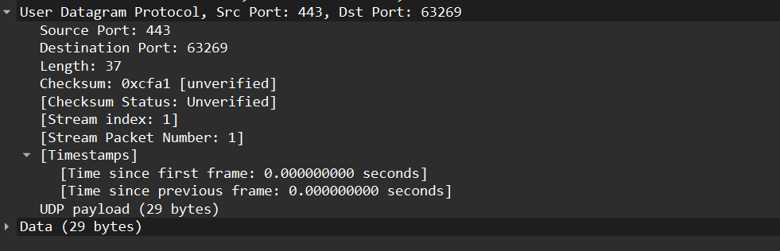
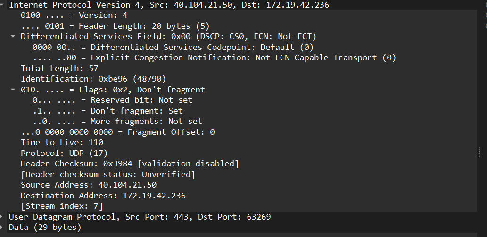
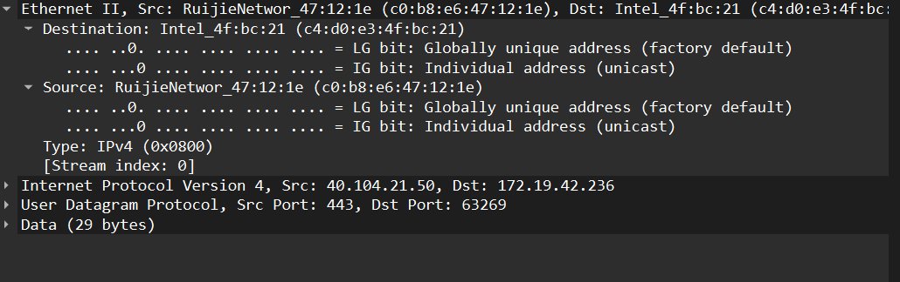
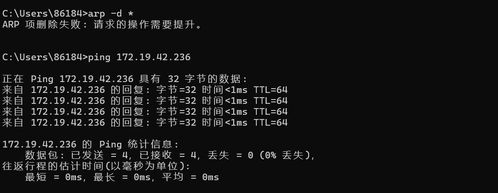
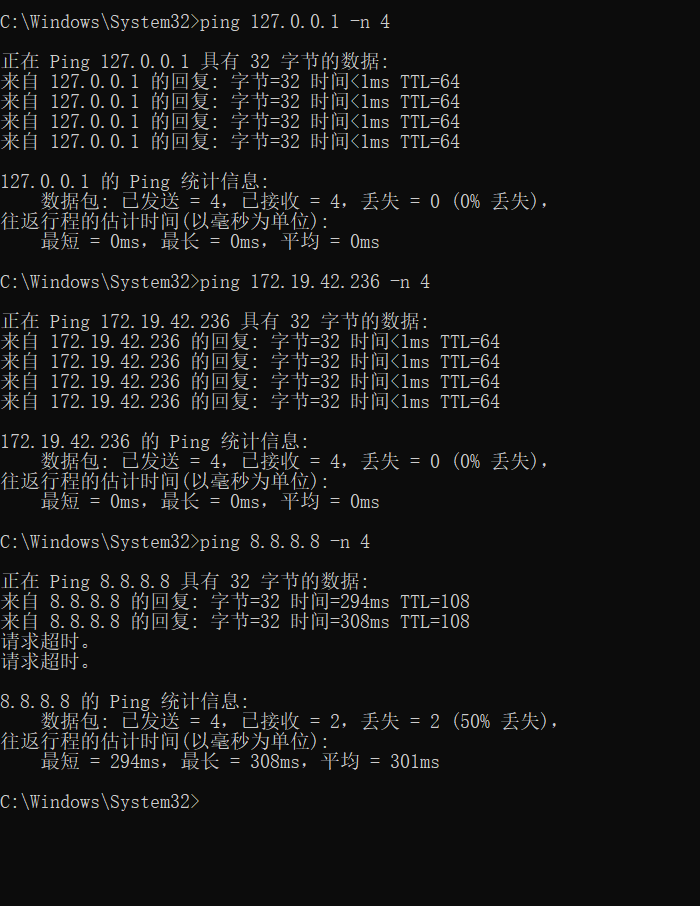

# Lab5：IP 与以太网的包收发操作

## 实验背景

本实验围绕 IP 模块与以太网在包收发过程中的角色展开，重点观察以下内容：

1. 网络包的基本结构：头部（IP 头部 + MAC 头部）与数据
2. IP 头部各字段的含义：版本号、TTL、协议号、发送方/接收方 IP 地址等
3. MAC 头部各字段的含义：接收方/发送方 MAC 地址、以太类型
4. IP 地址与 MAC 地址的区别与协作
5. ARP 协议如何通过 IP 地址查询 MAC 地址
6. 路由表的结构与查询方式
7. UDP 协议与 TCP 协议的区别：无连接、无确认、无重传
8. UDP 头部结构：发送方端口号、接收方端口号、数据长度、校验和
9. ICMP 协议的作用与常见消息类型（Echo、Destination Unreachable 等）

---

## 实验任务

### 任务一：查看路由表、ARP 缓存并启动 Wireshark

**第一步：打开 Wireshark，选择主网络接口，开始抓包**

> **注意**：本次实验必须使用真实网络接口（`en0`/`eth0`/`以太网`），不要选回环接口。回环接口不经过以太网，无法观察到 MAC 头部和 ARP 过程。

选择你的主网络接口，开始抓包。本次实验的大部分任务会共用同一次抓包。

**第二步：查看本机路由表**

```bash
# Linux
route -n
ip route show

# macOS
netstat -rn

# Windows
route print
```

截图并保存为 `route_table.png`。

**第三步：查看本机 ARP 缓存**

```bash
# Linux / macOS / Windows
arp -a
```

截图并保存为 `arp_cache.png`。

**第四步：填写下表**

从路由表和 ARP 缓存的输出中提取信息：

| 项目                         | 你的填写内容 |
| :--------------------------- | :----------- |
| 本机 IP 地址                 |      172.19.42.236        |
| 本机所在子网                 |      172.19.0.0/16        |
| 子网掩码                     |      255.255.0.0        |
| 默认网关 IP                  |      172.19.0.1        |
| 默认网关 MAC 地址            |      c0:b8:e6:47:12:1e        |
| 本机网卡 MAC 地址            |      c4:d0:e3:4f:bc:21        |

简答题：

1. 路由表的每一行包含哪些关键字段？教材中提到的 `Network Destination`、`Netmask`、`Gateway`、`Interface` 分别对应什么含义？
Network Destination：目标网络地址，代表这条路由规则能到达的网段。
Netmask：子网掩码，和目标网络地址一起确定网段范围。
Gateway：下一跳地址，即要把包发给哪个设备。如果是直连网段，会显示 “在链路上”。
Interface：出口网卡，指定包从本机的哪块网卡发出去。
额外的 Metric（跃点数）：路由优先级，数值越小优先级越高。


2. 当目标 IP 地址不在本子网时，包会先发给谁？路由表的哪一列提供了这个信息？
包会先发给默认网关（路由器），路由表的 Gateway 列提供了这个信息。当目标 IP 不在任何直连网段时，会匹配 0.0.0.0 这条默认路由，使用它的网关地址。


3. 路由表的默认网关（`0.0.0.0`）条目的作用是什么？什么时候会匹配到这一行？
作用：作为 “兜底路由”，处理所有不在本地路由表中的目标地址。
触发场景：当 IP 模块查询路由表时，发现目标 IP 不匹配任何直连网段或静态路由，就会匹配 0.0.0.0 这条默认路由，将包发给默认网关。


4. 教材提到，确定发送方 IP 地址的关键在于"判断应该使用哪块网卡"。结合你查到的本机网卡信息，说明 IP 模块是如何做出这个判断的。
IP 模块会按以下步骤判断：
先查询路由表，确定目标 IP 要走哪条路由，从而确定出口网卡（Interface 列）。
找到该网卡对应的 IP 地址，作为包的源 IP。
你的电脑有三块网卡：
VMnet1：192.168.142.1（虚拟机专用）
VMnet8：192.168.107.1（虚拟机专用）
WLAN：172.19.42.236（真实上网网卡）
访问外网时，会匹配 0.0.0.0 路由，出口是 172.19.42.236 对应的 WLAN 网卡，因此源 IP 就是这个地址。


---

### 任务二：观察 UDP 头部

只要计算机处于联网状态，Wireshark 中就会持续出现大量 UDP 流量（DNS、mDNS、DHCP、NTP 等），无需手动生成。

**第一步：在 Wireshark 中设置过滤器**

```text
udp
```

**第二步：在包列表中找一个 UDP 包**

随便选一个即可。如果包太多，可以加上源或目的 IP 来缩小范围，例如 `udp && ip.addr == 你的IP`。如果需要 DNS 包，也可以用 `udp.port == 53` 过滤。

> **可选**：如果想明确看到一个完整的请求-响应对，可以在终端中执行 `nslookup example.com`，Wireshark 中就会出现对应的 DNS 请求包。

**第三步：点击选中的 UDP 包，在详情栏展开 `User Datagram Protocol`**

填写下表：

| 项目               | 你的填写内容 |
| :----------------- | :----------- |
| UDP 头部总长度     |       8 字节       |
| 源端口             |       443       |
| 目的端口           |      63269        |
| 长度（Length）     |      37 字节（UDP 头部 8 字节 + 数据 29 字节）        |
| 校验和（Checksum） |      0xcfa1        |

简答题：

1. 你观察到的 UDP 头部长度是多少字节？TCP 头部至少 20 字节。UDP 省略了哪些字段？这些字段的缺失带来了什么后果？
UDP 头部固定为 8 字节，结构非常简单。
相比 TCP，UDP 省略了：序号、确认号、窗口大小、标志位、紧急指针等字段。
后果：
优点：无连接、无确认、无重传，开销小、延迟低，适合实时场景。
缺点：不保证可靠性，不保证包按序到达，也不保证不丢包，需要应用层自己处理这些问题。


2. UDP 头部中的"长度"字段指的是什么长度？
指整个 UDP 报文的长度，包括 UDP 头部（8 字节）和后面的数据部分，单位是字节。




---

### 任务三：观察 IP 头部字段

点击任务二中的同一个 UDP 包，在详情栏展开 `Internet Protocol Version 4`。

填写下表：

| 字段名称               | 你的填写内容 | 含义说明 |
| :--------------------- | :----------- | :------- |
| Version（版本号）      |      4        |    代表 IPv4 协议      |
| Header Length（头部长度） |     20 字节（值为 5，单位是 4 字节）       |     IP 头部的长度，IPv4 基本头部固定 20 字节     |
| Time to Live（TTL）    |      110        |    生存时间，每经过一个路由器减 1，防止包无限转发      |
| Protocol（协议号）     |      17        |     代表上层协议是 UDP（TCP 是 6，ICMP 是 1）     |
| Source Address（源 IP） |      40.104.21.50        |    发送方的 IP 地址      |
| Destination Address（目的 IP） |   172.19.42.236     |     接收方的 IP 地址     |

简答题：

1. 协议号字段的值是多少？它代表什么协议？如果抓一个 HTTP 请求的包，协议号会变成多少？
本次观察到的协议号是 17，代表 UDP 协议。
HTTP 是基于 TCP 的，所以 HTTP 请求包的 IP 头部协议号会是 6。


2. TTL 字段的作用是什么？如果 TTL 降为 0 会发生什么？
作用：限制 IP 包在网络中的转发次数，防止路由环路导致包无限转发。
当 TTL 减到 0 时，路由器会丢弃该包，并向源 IP 发送一个 ICMP Time Exceeded（类型 11） 消息。


3. 有教材提到 IP 地址"实际上并不是分配给计算机的，而是分配给网卡的"。你的本机有几块网卡？每块网卡的 IP 地址分别是什么？（提示：可参考任务一中路由表的 Interface 列，或用 `ip addr`（Linux）/`ifconfig`（macOS）/`ipconfig`（Windows）查看。）
你的电脑有 3 块活跃网卡：
VMware Network Adapter VMnet1：192.168.142.1
VMware Network Adapter VMnet8：192.168.107.1
WLAN（真实无线网卡）：172.19.42.236
还有蓝牙网卡（未连接）和回环网卡 127.0.0.1。


4. IP 头部中的源 IP 地址和目的 IP 地址分别是谁的地址？它们与 MAC 头部中的源/目的 MAC 地址有什么区别？
源 IP：40.104.21.50（外网服务器）；目的 IP：172.19.42.236（你的电脑）。
区别：
IP 地址：三层地址，标识端到端的通信双方，跨网络不变。
MAC 地址：二层地址，标识链路层的相邻设备，每经过一个路由器，源 / 目的 MAC 都会变化（你的包中，源 MAC 是网关的 c0:b8:e6:47:12:1e，目的 MAC 是你的网卡 c4:d0:e3:4f:bc:21）。




---

### 任务四：观察 MAC 头部与以太网帧

点击任务二中的同一个 UDP 包，在详情栏展开 `Ethernet II`。

填写下表：

| 字段名称               | 你的填写内容 | 含义说明 |
| :--------------------- | :----------- | :------- |
| Source（源 MAC）       |      c0:b8:e6:47:12:1e        |     发送方设备的 MAC 地址（网关）     |
| Destination（目的 MAC） |      c4:d0:e3:4f:bc:21        |     接收方设备的 MAC 地址（你的电脑）     |
| Type（以太类型）       |        0x0800      |     代表以太网帧承载的是 IPv4 协议     |

关于 MAC 地址格式，填写下表：

| 项目               | 你的填写内容 |
| :----------------- | :----------- |
| MAC 地址长度       | 48 比特（6 字节） |
| 本机网卡的 MAC 地址 |       48 比特（6 字节）       |
| 目的 MAC 地址      |     c4:d0:e3:4f:bc:21         |
| MAC 地址的书写格式 |      6 组十六进制数，用冒号或连字符分隔，如 c0:b8:e6:47:12:1e        |

简答题：

1. 以太类型字段的值是多少？它代表后面承载的是什么协议的包？
本次包的以太类型是 0x0800，代表后面承载的是 IPv4 协议 的包。
常见的还有 0x0806（ARP）、0x86DD（IPv6）。


2. DNS 服务器的 IP 通常是外网地址。本任务中目的 MAC 地址是 DNS 服务器的 MAC 地址还是你本机网关（路由器）的 MAC 地址？为什么？
因为当目标 IP 不在本地子网时，IP 包会先发给网关，由网关转发到外网。所以在你的局域网链路层，目的 MAC 始终是网关的地址，而不是远端服务器的 MAC 地址。


3. IP 地址和 MAC 地址在功能上有什么相似之处？又有什么本质区别？
相似点：都是用来标识网络中的设备，作为通信的目标地址。
本质区别：
表格
维度	IP 地址	MAC 地址
层级	三层（网络层）	二层（数据链路层）
作用范围	跨网络全局有效	仅在同一局域网内有效
可变性	可以动态分配、更换	通常固化在网卡中，出厂即固定
寻址逻辑	按网段路由	按物理链路直连寻址


4. 为什么以太网帧中需要同时有 IP 地址（在 IP 头部中）和 MAC 地址？不能只用其中一种吗？
两者分工不同，缺一不可：
只用 IP 地址：链路层无法直接根据 IP 地址在局域网内转发包，需要 MAC 地址来标识相邻设备。
只用 MAC 地址：MAC 地址没有路由功能，无法跨网络通信，只能在同一局域网内传输。
两者配合：IP 地址负责跨网络的 “端到端” 寻址，MAC 地址负责同一链路内的 “下一跳” 转发。




---

### 任务五：观察 ARP 协议

ARP（Address Resolution Protocol，地址解析协议）用于根据 IP 地址查询 MAC 地址。只要计算机处于联网状态，Wireshark 中通常会持续出现 ARP 包（邻居发现、缓存刷新等），可以直接观察。如果抓包一段时间后仍未看到 ARP 包，再手动触发。

**第一步：在 Wireshark 中设置过滤器**

```text
arp
```

**第二步：在包列表中找 ARP 包**

正常联网的设备每隔几分钟就会自动发送 ARP 请求，等待即可。如果等了一会儿仍没有，可以选择以下任一方式手动触发：

- **方式 A（推荐）**：在终端中执行 `arping`

  ```bash
  # Linux（通常已预装）
  sudo arping -c 3 <网关IP>

  # macOS（如果没有，先执行：brew install arping）
  sudo arping -c 3 <网关IP>

  # Windows（可从 https://github.com/ThomasHabets/arping/releases 下载）
  arping -c 3 <网关IP>
  ```

- **方式 B**：先清除 ARP 缓存，再 ping 同网段地址

  ```bash
  # 清除 ARP 缓存
  # Linux:   sudo ip neigh flush all
  # macOS:   sudo arp -d -a
  # Windows: arp -d *

  # 然后 ping 网关
  ping <网关IP> -c 2
  ```

> **注意**：如果目标是 `127.0.0.1` 或外网地址，ARP 不会出现。回环接口不经过以太网，外网地址的 MAC 地址是路由器的（通常已缓存）。

**第三步：点击 ARP 请求包（Opcode 为 request），展开详情**

**第四步：填写下表**

| 项目                     | 你的填写内容 |
| :----------------------- | :----------- |
| ARP 请求的目的 MAC 地址 |       ff:ff:ff:ff:ff:ff（广播地址）       |
| ARP 请求中查询的目标 IP |       172.19.0.1（网关 IP）       |
| ARP 响应中返回的 MAC 地址 |      c0:b8:e6:47:12:1e（网关 MAC）        |
| 该 ARP 包是自动出现还是手动触发的 |      自动出现（联网时系统会自动维护 ARP 缓存）        |

简答题：

1. ARP 请求的目的 MAC 地址为什么是 `ff:ff:ff:ff:ff:ff`（广播地址）？
ARP 请求是广播包，目的是让局域网内所有设备都收到这个请求。只有目标 IP 对应的设备会回复 ARP 响应，其他设备会直接丢弃。


2. 为什么 ARP 缓存中的条目会在几分钟后自动删除？
为了防止设备 IP 或 MAC 地址变化导致缓存失效。比如设备更换、IP 地址重新分配，如果缓存一直不更新，会导致通信失败。所以系统会定期刷新 ARP 缓存，过期条目会被删除。


3. 如果 ARP 缓存中的 MAC 地址已经过期（对方 IP 对应的设备已更换），会出现什么问题？如何解决？
问题：系统会把包发给一个错误的 MAC 地址，导致目标设备收不到包，通信失败。
解决方法：手动清除 ARP 缓存，触发新的 ARP 请求。Windows 用 arp -d *，Linux/macOS 用 sudo ip neigh flush all。




---

### 任务六：使用 `ping` 命令观察 ICMP

有教材提到了 ICMP（Internet Control Message Protocol）协议，它用于在 IP 层传递错误和控制信息。`ping` 命令就是基于 ICMP 的 Echo Request（类型 8）和 Echo Reply（类型 0）实现的。

**第一步：在 Wireshark 中设置 ICMP 过滤器**

```text
icmp
```

**第二步：在终端中执行 ping 命令**

```bash
# ping 本机（回环）
ping 127.0.0.1 -c 4

# ping 局域网内的设备（如路由器网关）
ping <网关IP> -c 4

# ping 外网地址
ping 8.8.8.8 -c 4
```

**第三步：在 Wireshark 中观察 ICMP 包**

填写下表：

| 目标               | 是否收到回复 | 往返时间（ms） | TTL 值 |
| :----------------- | :----------- | :------------- | :----- |
| 127.0.0.1          |       是       |        <1ms（0ms）        |    64    |
| 局域网设备（网关） |      是        |        <1ms（0ms）        |    64    |
| 8.8.8.8            |      部分收到（丢包 50%）        |        294~308ms        |    108    |

> **提示**：ping 回环地址（`127.0.0.1`）时数据不经过物理网卡，Wireshark 在主网络接口上可能无法捕获到包。TTL 值可从终端输出中读取（`ping` 会显示 `ttl=...`），或切换 Wireshark 至回环接口（`lo0` / `lo`）抓包。

简答题：

1. `ping` 命令发送的是什么类型的 ICMP 消息？收到的回复又是什么类型？
发送：ICMP Echo Request（类型 8，代码 0）。
回复：ICMP Echo Reply（类型 0，代码 0）。


2. 为什么 ping 不同目标的 TTL 值不同？TTL 值反映了什么信息？
原因：不同操作系统的默认 TTL 初始值不同（比如 Windows 通常是 128，Linux 是 64），包在传输过程中每经过一个路由器，TTL 就会减 1。
信息：TTL 值反映了包从源到目标经过的路由器跳数。比如 ping 127.0.0.1 的 TTL 是 64，说明没经过任何路由器；ping 8.8.8.8 的 TTL 是 108，说明它初始 TTL 是 128，经过了 20 跳路由器（128-20=108）。


3. 教材表 2.4 中列出了多种 ICMP 消息类型。`Destination unreachable`（类型 3）在什么情况下会出现？请用以下方法尝试触发并观察：

   ```bash
   # 方法一（推荐）：ping 同网段内一个确认不存在的 IP
   # 例如你的本机 IP 是 192.168.1.100，子网掩码 255.255.255.0，
   # 那么可以 ping 192.168.1.250（一个大概率没有被分配的地址）
   ping <同网段不存在的IP> -c 3
   
   # 方法二：向一个关闭的端口发 UDP 包，触发 ICMP Port Unreachable
   # 先在 Wireshark 中保持 icmp 过滤器，然后执行：
   # Linux / macOS
   echo "test" | nc -u -w 1 <同网段某台设备的IP> 19999
   
   # Windows（需安装 nmap：https://nmap.org/download.html）
   nmap -sU -p 19999 <同网段某台设备的IP>
   ```

   观察到类型 3 的包后，记录其 Code 值（子类型）并说明代表什么含义。
触发场景：
目标 IP 不存在，且无法通过 ARP 解析 MAC 地址。
目标主机存在，但对应的端口没有进程监听（Port Unreachable，代码 3）。
路由器找不到到达目标的路由（Net Unreachable，代码 0）。
观察到的类型 3 包的 Code 值通常是 3，代表 Port Unreachable，即目标端口未打开。




---

## 问答题

1. 网络包由哪几部分构成？IP 头部和 MAC 头部分别的作用是什么？
以太网帧整体结构：MAC 头部 + IP 头部 + 传输层头部（TCP/UDP） + 数据 + FCS 校验。
MAC 头部：负责链路层寻址，标识同一局域网内的发送方和接收方设备，让包能在链路中转发。
IP 头部：负责网络层寻址，标识端到端的源和目的 IP 地址，包含 TTL、协议号等路由控制信息，让包能跨网络传输。


2. IP 协议和以太网协议在网络传输中分别承担什么职责？它们是如何分工协作的？
以太网（二层）：负责同一链路内的帧传输，提供物理地址寻址、差错检测，保证包在局域网内的传输。
IP 协议（三层）：负责跨网络的路由寻址，提供端到端的地址标识，通过路由表选择转发路径，实现不同网络之间的通信。
协作：IP 包被封装在以太网帧中传输，IP 地址决定最终目标，MAC 地址决定下一跳的转发目标。


3. ARP 协议解决的核心问题是什么？如果不使用 ARP 缓存，网络中会出现什么情况？
核心问题：如何根据 IP 地址找到对应的 MAC 地址，实现三层地址到二层地址的映射。
无 ARP 缓存的后果：每次发送包都要广播 ARP 请求，会产生大量广播流量，严重影响局域网性能，通信延迟也会大幅增加。


4. 为什么 IP 和负责传输的网络（如以太网）要分开设计？这种设计带来了什么好处？
核心好处是解耦：IP 层不需要关心底层用的是以太网、Wi-Fi 还是 4G，链路层也不需要关心上层用的是什么应用。
具体优势：
IP 协议可以在不同的物理网络上运行，扩展性强。
物理网络升级（比如从以太网到 Wi-Fi）时，上层 IP 协议和应用无需修改。
不同网络层协议（IPv4/IPv6）也可以共用同一套链路层技术。


5. 网卡在发送包时会额外添加哪 3 个控制数据？它们各自的作用是什么？
网卡会添加以太网帧的前导码（Preamble）、帧起始定界符（SFD）和帧校验序列（FCS）：
前导码 + SFD：用于同步时钟，告诉接收方 “一个新的帧来了”。
FCS（32 位 CRC 校验）：用于检测帧在传输过程中是否发生比特错误。


6. 网卡接收到一个包后，需要经过哪些步骤才能将其交给操作系统？如果 FCS 校验失败会怎样？
网卡检查帧的目的 MAC 地址，如果不是本机 MAC 或广播 / 组播地址，直接丢弃。
对帧进行 FCS 校验，如果校验失败，直接丢弃该帧。
校验通过后，网卡剥掉以太网头部，将 payload（IP 包）交给操作系统的网络栈。
操作系统根据 IP 头部的协议号，交给对应的上层协议（TCP/UDP/ICMP）处理。


7. TCP 和 UDP 的核心区别是什么？请从连接管理、可靠性、效率、适用场景四个维度进行比较。
维度	TCP	UDP
连接管理	面向连接，三次握手建立连接，四次挥手断开	无连接，无需建立连接，直接发送数据
可靠性	可靠传输，序号、确认、重传、流量控制、拥塞控制	不可靠传输，不保证不丢包、不按序到达
效率	头部开销大，传输效率低，延迟高	头部开销小，传输效率高，延迟低
适用场景	对可靠性要求高的场景，如文件传输、网页浏览、邮件	对实时性要求高、可容忍少量丢包的场景，如视频通话、直播、游戏


8. UDP 适用于哪些场景？请结合教材内容解释为什么这些场景适合使用 UDP 而非 TCP。
适合场景：
实时音视频通话（视频会议、直播）：低延迟优先，丢一点包不影响整体体验。
在线游戏：快速响应优先，重传反而会导致卡顿。
DNS 查询：单次请求 - 响应，建立 TCP 连接的开销远大于数据本身。
原因：UDP 无连接、无确认、无重传，延迟低、开销小，能满足这些场景的实时性需求，而少量丢包可以通过应用层纠错或重传解决。


9. 如果一个 IP 包经过多次路由转发后 TTL 降为 0，路由器会如何处理？这与教材中提到的哪种 ICMP 消息有关？
路由器会直接丢弃该 IP 包，并向源 IP 地址发送一个 ICMP Time Exceeded（类型 11，代码 0） 消息，告知源主机包因 TTL 超时被丢弃。


---

## 截图要求

- 截图须清晰，终端文字和 Wireshark 字段可读。
- 所有截图与本 `Lab5.md` 放在同一目录下。
- 命名规范：

| 截图内容         | 文件名               |
| :--------------- | :------------------- |
| 路由表           | `route_table.png`    |
| ARP 缓存         | `arp_cache.png`      |
| UDP 头部字段     | `udp_header.png`     |
| IP 头部字段      | `ip_header.png`      |
| 以太网帧字段     | `ethernet_frame.png` |
| ARP 请求与响应   | `arp.png`            |
| ICMP ping        | `icmp.png`           |

具体要求：

1. `route_table.png`：终端截图，显示 `route -n`（Linux）、`netstat -rn`（macOS）或 `route print`（Windows）的完整输出。

2. `arp_cache.png`：终端截图，显示 `arp -a` 的完整输出。

3. `udp_header.png`：Wireshark 截图，展开 `User Datagram Protocol`，能看到 Source Port、Destination Port、Length、Checksum。

4. `ip_header.png`：Wireshark 截图，展开 `Internet Protocol Version 4`，能看到 Version、Header Length、TTL、Protocol、Source Address、Destination Address。

5. `ethernet_frame.png`：Wireshark 截图，展开 `Ethernet II`，能看到 Source、Destination、Type。

6. `arp.png`：Wireshark 截图（若能观察到），展开 ARP 包的详情，能看到发送方的 MAC 和 IP、查询的目标 IP。

7. `icmp.png`：Wireshark 截图，能看到 ICMP Echo Request 和 Echo Reply，以及 TTL 字段。

---

## 提交要求

在自己的文件夹下新建 `Lab5/` 目录，提交以下文件：

```text
学号姓名/
└── Lab5/
    ├── Lab5.md
    ├── route_table.png
    ├── arp_cache.png
    ├── udp_header.png
    ├── ip_header.png
    ├── ethernet_frame.png
    ├── arp.png
    └── icmp.png
```

---

## 截止时间

2026-05-07，届时关于 Lab5 的 PR 请求将不会被合并。
