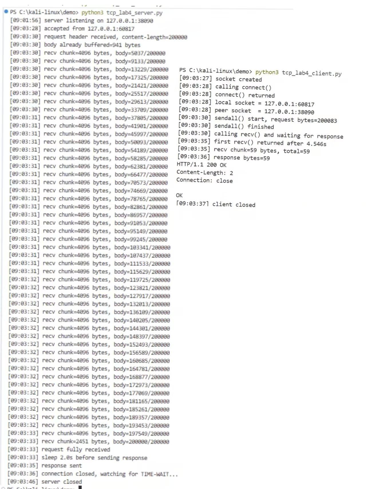
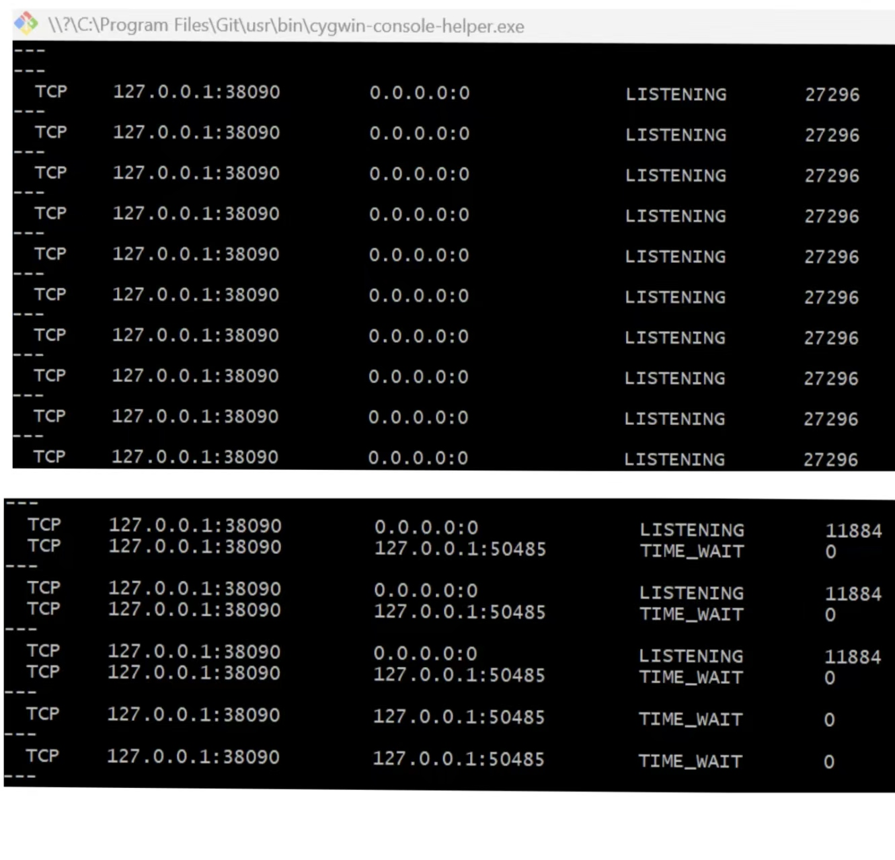
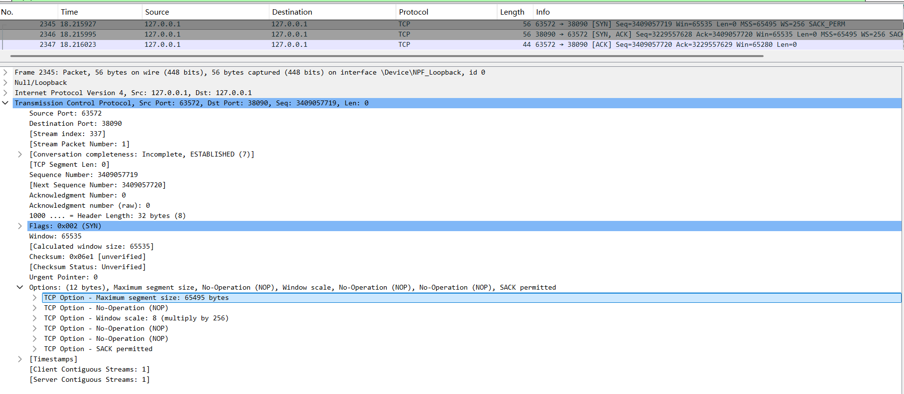
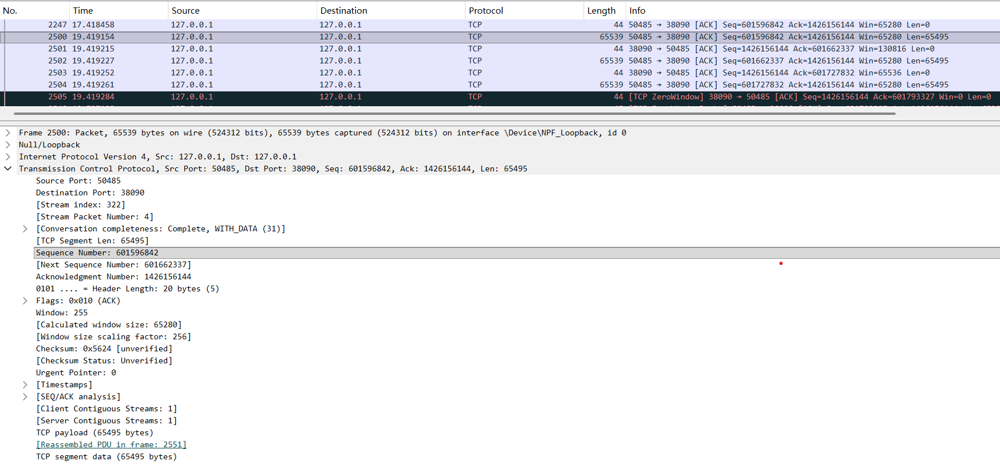
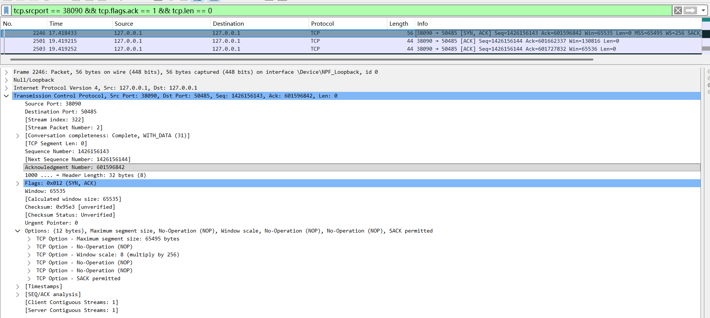
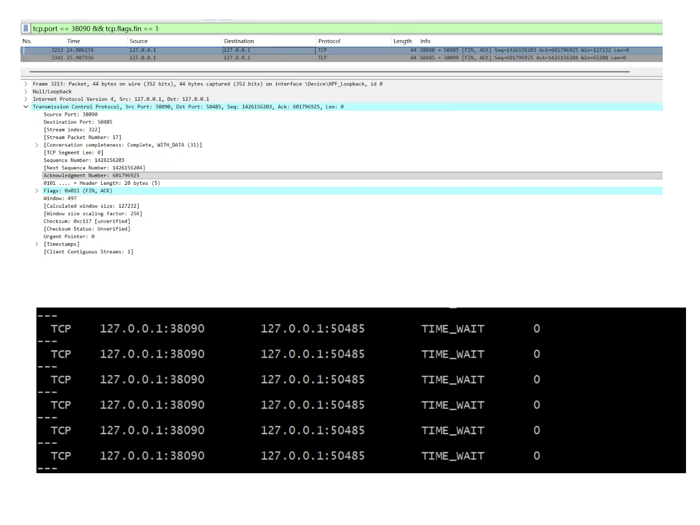

# Lab4：看见TCP 我不怕不怕啦

## 实验背景

本实验围绕一条 TCP 连接的完整生命周期展开，重点观察以下内容：

1. `socket()`、`listen()`、`accept()`、`connect()` 的职责区别
2. "连接"为什么本质上是交换控制信息而不是物理连线
3. TCP 头部中的端口号、序号、ACK 号、标志位、窗口、头部长度、可选字段
4. 三次握手如何建立收发准备
5. 应用层大块数据如何被 TCP 按 MSS 拆分
6. `Sequence Number` 与 `Acknowledgment Number` 如何配合工作
7. `recv()` 为什么会阻塞等待数据
8. 接收窗口如何反映接收方处理能力
9. ACK 与窗口更新为什么常常会被合并
10. `FIN` / `ACK` 如何完成断开
11. 为什么连接结束后套接字不会立刻删除

---

## 实验任务

### 任务一：准备实验环境并记录运行信息

**第一步：准备好四个窗口**

整个实验需要同时观察多个界面，建议在开始前把窗口布局摆好：

- **终端 A**：运行服务端
- **终端 B**：运行客户端
- **终端 C**：持续监控套接字状态（全程保持开启，不要关）
- **Wireshark**：抓包

**第二步：在终端 C 里启动持续监控**

TCP 状态变化很快，等你手动敲完 `ss` 命令再回车，状态可能已经过去了。用下面的命令让终端 C 每 0.5 秒自动刷新一次，之后只需要盯着这个窗口就行：

```bash
# Linux
watch -n 0.5 'ss -tan | grep 38090'

# macOS（没有 watch，用循环代替）
while true; do netstat -an | grep 38090; echo "---"; sleep 0.5; done

# Windows（Git Bash执行）
while true; do netstat -ano | grep 38090; echo "---"; sleep 0.5; done
```

如果你换了端口，把 `38090` 替换成实际端口。

**第三步：打开 Wireshark，选回环接口，填好过滤器，开始抓包**

回环接口在不同系统里名字不同：

| 系统 | 接口名 |
|:-----|:-------|
| Linux | `lo` |
| macOS | `lo0` |
| Windows | `Adapter for loopback traffic capture`（需提前安装 Npcap 并勾选回环支持） |

在显示过滤器里输入：

```text
tcp.port == 38090
```

然后点击开始抓包（蓝色鲨鱼鳍图标）。**先开始抓包，再运行脚本**，否则握手包会被漏掉。

**第四步：启动脚本**

```bash
# 终端 A
python3 tcp_lab4_server.py

# 终端 B（等服务端打印出 server listening on ... 后再运行）
python3 tcp_lab4_client.py
```

如果 `38090` 已被占用，两端都加环境变量换端口，同时记得把 Wireshark 过滤器和终端 C 里的端口号也改掉：

```bash
LAB4_PORT=38123 python3 tcp_lab4_server.py
LAB4_PORT=38123 python3 tcp_lab4_client.py
```

**第五步：填写下表**

| 项目                                | 你的填写内容 |
| :---------------------------------- | :----------- |
| 服务端监听地址                      |          127.0.0.1    |
| 服务端监听端口                      |            38090  |
| 客户端本地临时端口                  |             60817 |
| 客户端请求总字节数                  |             20000 |
| 服务端响应内容                      |           HTTP/1.1 200 OK\nContent-Length: 2\nConnection: close\n\nOK   |
| 客户端 `connect()` 返回前后的时间点 |调用前：[09:03:28] calling connect()返回后：[09:03:28] connect() returned              |
| 客户端首次收到响应前等待了多久      |  4.546s            |

各项数值均可直接从终端输出读取：服务端监听信息在 `server listening on ...`，客户端本地端口在 `local socket = ...`，请求字节数在 `sendall() start, request bytes=...`，等待时间在 `first recv() returned after ...s`。



---

### 任务二：观察套接字创建与连接建立

1. 服务端启动后，观察终端 C 出现 `LISTEN` 状态，截图留存。
2. 在终端 B 里启动客户端，观察它依次打印 `socket created`、`calling connect()`、`connect() returned`。
3. 客户端打印 `connect() returned` 之后，观察终端 C 出现 `ESTABLISHED`，截图留存。脚本在 `connect()` 返回后有 2 秒停顿，这段时间足够截图。

填写下表：

| 阶段                             | 你的填写内容 |
| :------------------------------- | :----------- |
| 服务端启动、客户端未连入时的状态 | LISTENING             |
| `connect()` 返回后服务端状态     | ESTABLISHED             |
| `connect()` 返回后客户端状态     |  ESTABLISHED            |

简答题：

1. 服务端在客户端连接前为什么处于 `LISTEN`？
答：服务端调用`listen()`后进入LISTEN状态，用于监听、等待客户端的连接请求。

 2. 为什么这时还没有真正建立 TCP 连接？
答：仅服务端监听，未完成三次握手，双方未协商参数、未建立逻辑连接。

 3. `socket()` 与 `connect()` 的区别是什么？
答：`socket()`仅本地创建套接字，无网络交互；`connect()`发起三次握手，完成TCP连接建立。

 4. 为什么 `connect()` 返回后才进入可稳定收发数据的状态？
答：`connect()`返回代表三次握手完成，双方参数协商一致，连接正式建立，可稳定收发数据。

5. 为什么"网线一直连着"不等于"TCP 连接已经建立"？
答：网线是物理层连通，TCP连接是传输层的逻辑连接，需三次握手协商建立，物理连通≠逻辑连接建立。

 6. 这里的"连接"更准确地说是在做什么？
答：是双方通过三次握手，完成状态同步、参数协商，建立双向可靠传输的逻辑连接。




---

### 任务三：观察三次握手与 TCP 头部字段

**定位握手包**：在 Wireshark 过滤器里输入下面的条件，可以屏蔽中间的数据包，只留下握手和断开阶段的控制包：

```text
tcp.port == 38090 && (tcp.flags.syn == 1 || tcp.flags.fin == 1)
```

包列表最前面的三个包就是三次握手（SYN → SYN-ACK → ACK）。

**找到各字段的位置**：点击某个握手包，在下方详情栏展开 `Transmission Control Protocol`。源端口、目的端口、Seq、Ack、Flags、Window、Header Length 都在这里。TCP 选项在最底部的 `Options` 子项里，展开后可以看到 MSS、Window Scale、SACK Permitted，注意这三项只出现在带 SYN 标志的包里，纯 ACK 包里没有。

**关于序号显示**：Wireshark 默认开启相对序号，会把每个方向的初始序号归零显示，所以 SYN 包的 Seq 看起来是 `0`，而不是真实的随机大数。这是正常现象，实验报告按 Wireshark 显示的值填写即可。如果你想看真实值，可以去 `Edit → Preferences → Protocols → TCP` 里取消勾选 `Relative sequence numbers`。

填写下表：

| 报文       | 源端口 | 目的端口 | Seq  | Ack  | Flags | Window | Header Length |
| :--------- | :----- | :------- | :--- | :--- | :---- | :----- | :------------ |
| 第一次握手 |63572        |   38090       | 3409057719     | 0     | SYN      |  65535      |    32           |
| 第二次握手 | 38090       | 63572         | 3229557628     | 3409057720     | SYN，ACK      |   65535     |  32             |
| 第三次握手 |   63572     |  38090        | 3409057720     |  3229557629    |   ACK    | 65280       |  20（或32）          |

第一次握手（SYN）的 Ack 字段在 Wireshark 里通常显示为空或 `0`，这是正常的，因为此时客户端还没有收到服务端的任何数据。Header Length 在没有选项时是 20 字节，握手包因为携带了 MSS 等选项通常是 28 或 32 字节。

| TCP 选项       | 你的填写内容 |
| :------------- | :----------- |
| MSS            |  65495字节            |
| Window Scale   | 8（乘256）             |
| SACK Permitted | 启用             |

回环接口的 MSS 通常是 65495（因为回环 MTU 是 65536，比以太网的 1500 大得多），这会影响后续任务五里是否能观察到分段。

简答题：

1. 发送方和接收方端口号在连接阶段的作用是什么？
答：端口号用于唯一标识主机上的应用进程，结合 IP 形成四元组，确保连接请求精准送达目标服务 / 客户端。

2. TCP 头部如何帮助找到目标套接字？
答：内核通过 TCP 头部的源 / 目的端口 + IP 层的源 / 目的 IP 组成四元组，匹配本地套接字，将报文交付对应进程。


3. 为什么初始序号不是简单固定从 1 开始？
答：防止旧连接延迟报文干扰新连接，同时降低序列号猜测攻击的风险，提升安全性。

4. 为什么 TCP 可选字段更容易在连接阶段看到？
答：可选字段（MSS、窗口缩放等）是连接建立阶段的协商参数，仅在 SYN/SYN-ACK 包中携带，数据传输阶段无需重复携带。




---

### 任务四：区分头部中的控制信息和套接字中的控制信息

用以下过滤器分别找到两类报文：

```text
# 纯控制报文（无应用数据）
tcp.port == 38090 && tcp.len == 0

# 携带应用数据的报文
tcp.port == 38090 && tcp.len > 0
```

从纯控制报文里选一个（SYN、纯 ACK 或 FIN-ACK 都可以），从数据报文里选一个（客户端发请求或服务端发响应的包）。

填写下表：

| 项目                   | 你的填写内容 |
| :--------------------- | :----------- |
| 纯控制报文的类型       | 纯 ACK 确认报文             |
| 携带应用数据的报文类型 |   客户端发送的 200000 字节请求数据分段           |
| 头部中的控制信息举例   |  TCP 标志位（SYN/ACK/FIN）、序号 (Seq)、确认号 (Ack)、窗口大小 (Window)、头部长度            |
| 套接字中的控制信息举例 | 套接字状态（LISTEN/ESTABLISHED/TIME-WAIT）、收发缓冲区大小、累计收发序号、本地 / 远端端口             |

简答题：

1. 为什么"头部中的控制信息"和"套接字中的控制信息"不是同一件事？
答：维度与生命周期不同：头部控制信息是单个 TCP 报文的临时属性，随报文在网络中传输，发送后即失效；套接字控制信息是内核中连接的持久状态，存储在本地，贯穿整个连接生命周期。
作用与范围不同：头部信息用于单次交互的控制（如确认数据、协商参数），是双方沟通的 "语言"；套接字信息用于维护整个连接的状态、累计收发进度、缓冲区资源，是可靠传输的 "账本"。
可见性不同：头部信息可通过 Wireshark 抓包看到；套接字信息仅存在于内核中，需通过netstat/ss等工具查看，不随报文传输。


---

### 任务五：观察数据分段、序号与 ACK

客户端发送的请求体是 200000 字节，超过了回环接口 MSS（约 65495 字节），因此应该可以在 Wireshark 里看到多个连续的数据段。用下面的过滤器找到客户端发出的数据包：

```text
tcp.srcport != 38090 && tcp.port == 38090 && tcp.len > 0
```

在包列表里连续选几个数据段，对比它们的 Seq 值。相邻两段的关系是：后一段的 Seq = 前一段的 Seq + 前一段的 TCP Segment Len。

找服务端返回给客户端的纯 ACK 报文：

```text
tcp.srcport == 38090 && tcp.flags.ack == 1 && tcp.len == 0
```

填写下表：

| 数据段  | Seq  | Ack  | TCP Segment Len | Flags |
| :------ | :--- | :--- | :-------------- | :---- |
| 第 1 段 | 601596842     | 1426156144     | 65495     |   ACK，PSH   |
| 第 2 段 | 701662337     |1426156144      | 65495                |  ACK,PSH     |
| 第 3 段 | 601727832     |  1426156144    |  69010               |  ACK,PSH     |

| ACK 报文 | Ack Number | Flags | Window |
| :------- | :--------- | :---- | :----- |
| 第 1 个  |  601662337          | ACK      |  130816      |
| 第 2 个  |  601727832          | ACK      | 65536       |
| 第 3 个  | 601793327           | ACK      |   0     |

| 项目                         | 你的填写内容 |
| :--------------------------- | :----------- |
| 是否发生分段                 | 是             |
| 握手中观察到的 MSS           |65495 字节              |
| 单段长度与 MSS 的关系        |前两段长度等于 MSS（65495 字节），最后一段长度小于 MSS（剩余字节）              |
| ACK 号大致确认到了第几个字节 | 第 1 个 ACK 确认到第 65496 字节，第 2 个确认到第 130991 字节，第 3 个确认到第 200001 字节             |

简答题：

1. 应用程序是否直接决定每个网络包的数据长度？为什么？
答：否。应用程序仅发送大块数据，单个包的长度由内核根据 MSS、接收窗口等自动拆分，应用层无法直接控制。

2. 大块应用数据为什么会被拆分？
答：受 MSS 限制（避免 IP 分片）、接收窗口限制（避免压垮接收方）、内核缓冲区限制，必须拆分为多个 TCP 分段传输。

3. `MSS` 与 `MTU` 的关系是什么？
答：MSS = MTU - IP头部长度(20字节) - TCP头部长度(20字节)，MSS 是 TCP 分段的最大数据长度，用于避免 IP 层分片。

4. "一次 `sendall()`"与"一个 TCP 包"之间是什么关系？
答：无一一对应关系：一次 sendall () 是应用层的一次发送请求，内核会将其拆分为多个 TCP 包（分段）完成传输。

5. 为什么 ACK 体现的是累计确认？
答：ACK 号表示「期望收到的下一个字节序号」，代表已成功接收「从初始序号到 ACK 号 - 1」的所有字节，无需逐个确认。

6. 如果中间某一段丢失，ACK 会出现什么变化？
答：接收方会持续回复「丢失分段的起始序号」（重复 ACK），发送方收到 3 个重复 ACK 后触发快速重传，重发丢失分段。





---

### 任务六：观察 `recv()` 阻塞与窗口字段

`recv()` 的等待时间直接从客户端终端读取，`calling recv() and waiting for response` 到 `first recv() returned after ...s` 之间就是等待时长，脚本已经帮你计算好了。

在 Wireshark 里找窗口值：用过滤器 `tcp.port == 38090 && tcp.flags.ack == 1` 列出所有 ACK 包，点击其中一个，在详情栏 `Transmission Control Protocol` 里找 `Window` 字段。如果同时显示了 `Calculated window size`，优先看这个值，它已经把 Window Scale 的缩放算进去了，是对方实际能接收的字节数。

如果包列表的 Info 列出现了 `[TCP Window Update]` 标注，说明这个包的主要目的是通知对方窗口变化，重点观察它的 `Window` 字段。

填写下表：

| 项目                                   | 你的填写内容 |
| :------------------------------------- | :----------- |
| 客户端开始调用 `recv()` 的时间         | [09:03:35]             |
| 客户端第一次收到响应的时间             |[09:03:35]              |
| `recv()` 是否立刻返回                  | 否             |
| 首次收到响应前等待了多久               |  4.546s            |
| `recv()` 等待期间连接是否已经建立      | 是             |
| 第 1 个 ACK 报文的窗口值               | 130816             |
| 第 2 个 ACK 报文的窗口值               | 65536             |
| 第 3 个 ACK 报文的窗口值               |0              |
| 窗口值是否变化                         |是              |
| 若变化，变化趋势                       | 从正常窗口（130816）→ 缩小（65536）→ 变为 0（零窗口），后随缓冲区释放恢复             |
| ACK 与窗口更新是否可以出现在同一个包中 |是              |
| 是否看到 RTT 或 ACK 往返时间相关信息   |是              |

简答题：

1. "连接建立"和"应用收到数据"之间是什么关系？
答：连接建立是应用收到数据的必要非充分条件：仅代表双方可传输数据，若对方未发送数据，recv()仍会阻塞，不会收到数据。

2. 为什么说 `read` / `recv` 在数据未到达时会被挂起？
答：recv()是同步阻塞调用：内核检查套接字接收缓冲区，若无数据则将进程置为睡眠状态，直到数据到达或连接关闭才唤醒，因此会被挂起。

3. 窗口字段反映了接收方哪方面的能力？
答：反映接收方剩余接收缓冲区大小，即当前还能接收的字节数，体现接收方的数据处理能力。

4. 为什么发送方不能无限制连续发送数据？
答：受接收方窗口限制（避免缓冲区溢出、数据丢失）、TCP 可靠传输机制（需等待 ACK 确认）、滑动窗口机制约束，发送量不能超过接收方处理能力。

5. 滑动窗口为什么既提高效率又避免压垮接收方？
答：提高效率：发送方可在收到 ACK 前连续发送窗口内的多个分段，实现流水线传输，提升吞吐量；
避免压垮接收方：接收方通过窗口字段告知发送方剩余缓冲区大小，发送量始终不超过接收方处理能力，防止缓冲区溢出。


---

### 任务七：观察响应返回与双向 `seq/ack`

TCP 的 Seq/Ack 是双向独立的，客户端有自己的发送序号，服务端有自己的发送序号。用下面的过滤器只看服务端发出的数据包（源端口是 38090，有应用数据）：

```text
tcp.srcport == 38090 && tcp.len > 0
```

紧跟在服务端数据包后面的、客户端发出的 ACK 包，其 Ack Number 确认的就是服务端的发送序号。

填写下表：

| 项目                     | 你的填写内容 |
| :----------------------- | :----------- |
| 服务端响应数据报文的 Seq |  1426156144            |
| 服务端响应数据报文的 Ack |  601796926            |
| 客户端确认报文的 Ack     |    1426156206          |

简答题：

1. 为什么 TCP 的 `seq/ack` 是双向分别计算的？
答：TCP 是全双工通信，两个方向的数据流相互独立，各自维护序号空间，分别确认，确保双向传输的可靠性。


2. 为什么双方都需要各自的初始序号？
答：初始序号（ISN）用于标识双向独立的数据流，防止旧连接的延迟报文干扰新连接，同时提升安全性，避免序列号猜测攻击。

3. 为什么发送应用数据时报文通常仍然带 `ACK`？
答：TCP 采用 捎带确认（piggybacking）机制：在发送数据的同时，捎带对对方数据的确认，无需单独发送纯 ACK 包，减少网络开销，提升传输效率。


---

### 任务八：观察连接断开与套接字延迟删除

用下面的过滤器精确定位所有带 FIN 的包：

```text
tcp.port == 38090 && tcp.flags.fin == 1
```

通常会看到两个 FIN 包（双方各一个）。看第一个 FIN 包的源端口，就能判断谁先发起断开。

**关于 TIME-WAIT**：TIME-WAIT 只出现在主动发起关闭的一方（先发 FIN 的那端）。服务端脚本在 `conn.close()` 之后会继续运行 10 秒再退出，这段时间可以在终端 C 里观察 TIME-WAIT。Linux 上 TIME-WAIT 通常持续约 60 秒，macOS 上可能较短，如果没有观察到请如实说明。

填写下表：

| 项目                                    | 你的填写内容 |
| :-------------------------------------- | :----------- |
| 谁先发送 FIN                            | 服务端             |
| 关闭阶段共观察到几个带 FIN 的报文       | 2个             |
| 最终 ACK 是否可见                       |        可见      |
| 关闭后是否观察到 `TIME-WAIT` 或等价现象 |   是           |

简答题：

1. 为什么关闭连接不能只发一个结束通知？
答：TCP 是全双工通信，双向数据流独立，需分别关闭：一方发 FIN 表示「本方不再发送数据」，但仍可接收数据，必须双方都发 FIN 并确认，才能彻底关闭连接。


2. 为什么连接结束后套接字不会立刻删除？
答：主动关闭方需进入TIME-WAIT 状态（通常 2MSL 时长），确保最后一个 ACK 能被对方收到，同时防止旧连接的延迟报文干扰新连接。

3. 如果最后一个 ACK 丢失，而旧套接字已经立刻删除，可能带来什么问题？
答：被动关闭方会因收不到 ACK，重发 FIN 报文；
旧套接字已删除，新连接可能复用相同端口 / 四元组，导致旧 FIN 被误判为新连接的报文，造成数据混乱、连接异常。




---

## 问答题

1. TCP 的"连接"到底意味着什么？它为什么不是"把网线连上"？
答：TCP 连接是传输层的逻辑连接，是双方通过三次握手协商参数、维护状态（序号、窗口、缓冲区）的虚拟链路；网线连通是物理层的硬件连通，仅代表物理通路可用，不代表双方建立了可稳定收发数据的逻辑连接。


2. 三次握手为什么能让双方进入可通信状态？
答：三次握手实现了双向确认：
客户端→服务端（SYN）：客户端确认自己的发送能力正常
服务端→客户端（SYN+ACK）：服务端确认自己的收发能力正常，同时确认客户端的发送能力
客户端→服务端（ACK）：客户端确认服务端的收发能力正常
最终双方都确认了彼此的收发能力，协商好序号、MSS 等参数，进入可通信状态。

3. TCP 头部中的控制字段如何支撑收发数据？
答：SYN/FIN：控制连接的建立与关闭
ACK：实现数据的可靠确认，确保对方收到数据
PSH：通知接收方立即将数据交付给应用层
窗口（Window）：实现流量控制，告知对方自己的接收能力
序号 / 确认号：实现数据的按序交付与丢包重传


4. ACK、窗口、等待时间为什么会共同影响 TCP 的可靠传输？
答：ACK：确认数据接收，触发重传机制，确保数据不丢失
窗口：实现流量控制，避免发送方压垮接收方
等待时间（超时重传时间、TIME-WAIT 等）：应对网络延迟、丢包，确保数据可靠交付，防止旧连接报文干扰新连接
三者协同，共同保障 TCP 的可靠性、流量控制与拥塞控制。


5. 断开连接为什么仍然需要严格的控制信息交换？
答：TCP 是全双工通信，双向数据流独立，需通过四次挥手分别关闭两个方向的连接：
双方需交换 FIN/ACK，确认本方不再发送数据、对方已收到所有数据
主动关闭方需进入 TIME-WAIT 状态，确保最后一个 ACK 被对方收到，防止旧连接报文干扰新连接
严格的控制交换是保障连接可靠关闭的核心。


6. 如果服务端根本没有启动，客户端调用 `connect()` 时会看到什么现象？
答：客户端发送 SYN 后，收不到服务端的 SYN+ACK 响应，会触发超时重传，最终connect()调用失败，返回连接超时 / 连接拒绝错误。


7. 如果中途人为制造丢包，ACK、重传、窗口之间会出现什么变化？
答：发送方收不到对应 ACK，会触发超时重传，重发丢失的分段
接收方窗口会因未收到完整数据而保持不变，甚至缩小
若丢包严重，发送方会启动拥塞控制，降低发送速率，窗口随之缩小


8. 如果把客户端发送的数据改得更大，窗口字段和分段情况会如何变化？
答：分段情况：数据量超过 MSS，会被拆分为更多的 TCP 分段，分段数量增加
窗口字段：若接收方处理能力不变，窗口会随数据接收逐渐缩小，甚至出现零窗口；若接收方处理能力足够，窗口会保持稳定


9. 如果把服务端读取速度改得更慢，是否更容易看到窗口更新甚至零窗口？
答：是。服务端读取速度变慢，接收缓冲区会被快速占满，窗口值会持续缩小，最终变为零窗口（ZeroWindow），通知客户端暂停发送；待缓冲区释放后，会发送窗口更新包，恢复发送。


---

## 截图要求

- 截图须清晰，终端文字和 Wireshark 字段可读。
- 所有截图与本 `Lab4.md` 放在同一目录下。
- 命名规范：

| 截图内容               | 文件名                  |
| :--------------------- | :---------------------- |
| 服务端与客户端运行结果 | `run.png`               |
| `ss` 状态变化          | `states.png`            |
| 三次握手与 TCP 选项    | `handshake_header.png`  |
| 大请求分段与 MSS       | `segmentation.png`      |
| ACK 与窗口观察         | `ack_window.png`        |
| 断开与最终状态         | `teardown_timewait.png` |

具体要求：

1. `run.png`：终端截图，至少能看到服务端 `server listening on ...`、客户端 `calling connect()`、`connect() returned`、`calling recv() and waiting for response`、`first recv() returned after ...s`。

2. `states.png`：终端截图，至少能看到 `LISTEN`、`ESTABLISHED`，以及 `TIME-WAIT`（若能观察到）。推荐截 `watch` 命令的持续输出画面，可以在一张截图里同时展示多个状态的变化过程。

3. `handshake_header.png`：Wireshark 截图，至少能看到三次握手中某个包的 `Source Port`、`Destination Port`、`Sequence Number`、`Acknowledgment Number`、`Flags`、`Window`，以及 `Options` 中的 `Maximum segment size`、`Window Scale`、`SACK Permitted`。

4. `segmentation.png`：Wireshark 截图，至少能看到客户端发送数据的 TCP 包的 `TCP Segment Len`、`Seq`、`Ack`。若能观察到分段，尽量截出多个连续数据段。

5. `ack_window.png`：Wireshark 截图，至少能看到一个或多个 ACK 报文的 `Acknowledgment Number`、`Window`，以及 `Calculated window size`（若显示）、`[TCP Window Update]`（若出现）。

6. `teardown_timewait.png`：Wireshark 截图或 Wireshark 与终端截图的拼图，至少能看到带 `FIN` 的包，以及 `TIME-WAIT` 状态（若能观察到）。

---

## 提交要求

在自己的文件夹下新建 `Lab4/` 目录，提交以下文件：

```text
学号姓名/
└── Lab4/
    ├── Lab4.md
    ├── tcp_lab4_server.py
    ├── tcp_lab4_client.py
    ├── run.png
    ├── states.png
    ├── handshake_header.png
    ├── segmentation.png
    ├── ack_window.png
    └── teardown_timewait.png
```

---

## 截止时间

2026-04-23，届时关于 Lab4 的 PR 请求将不会被合并。
