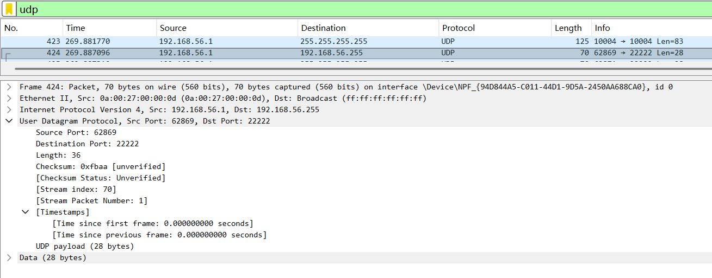
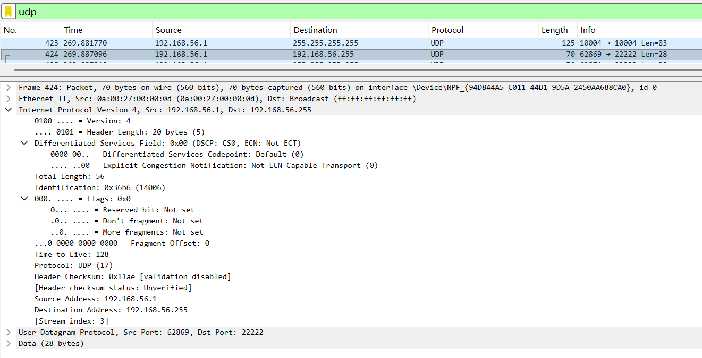
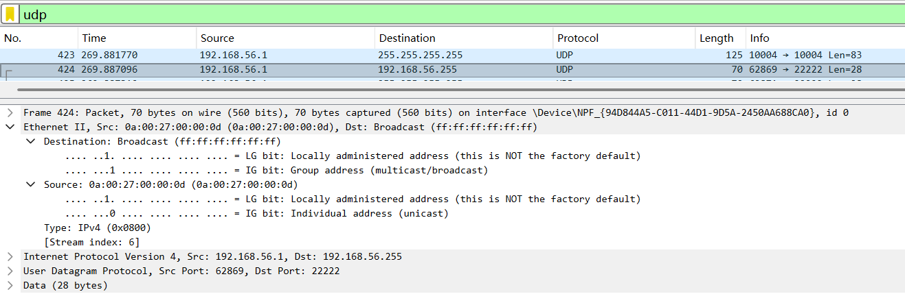
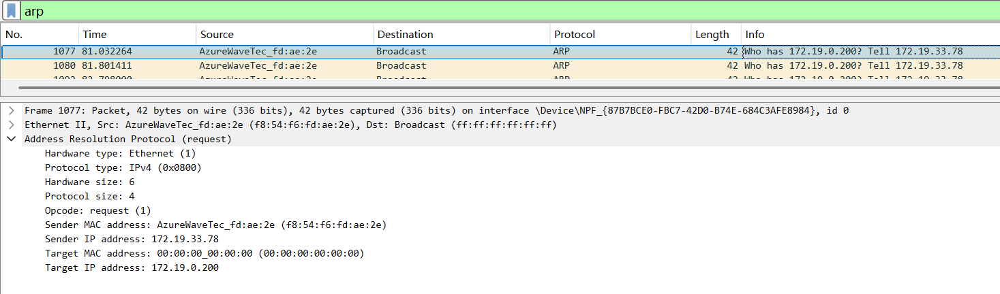
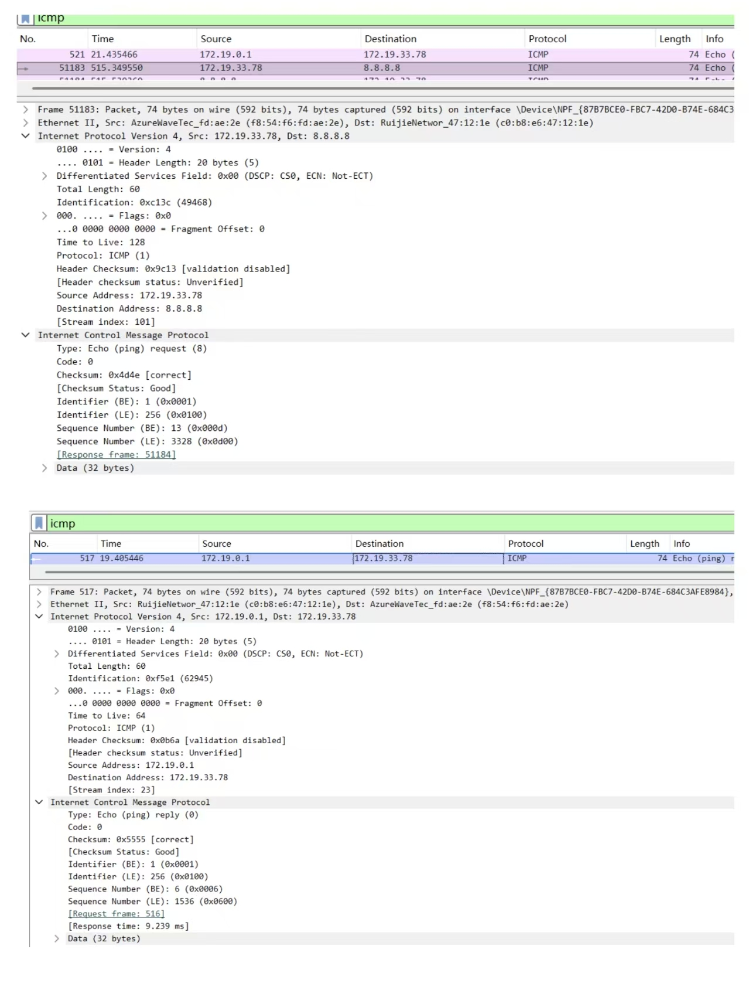

# Lab5：IP 与以太网的包收发操作

## 实验背景

本实验围绕 IP 模块与以太网在包收发过程中的角色展开，重点观察以下内容：

1. 网络包的基本结构：头部（IP 头部 + MAC 头部）与数据
2. IP 头部各字段的含义：版本号、TTL、协议号、发送方/接收方 IP 地址等
3. MAC 头部各字段的含义：接收方/发送方 MAC 地址、以太类型
4. IP 地址与 MAC 地址的区别与协作
5. ARP 协议如何通过 IP 地址查询 MAC 地址
6. 路由表的结构与查询方式
7. UDP 协议与 TCP 协议的区别：无连接、无确认、无重传
8. UDP 头部结构：发送方端口号、接收方端口号、数据长度、校验和
9. ICMP 协议的作用与常见消息类型（Echo、Destination Unreachable 等）

---

## 实验任务

### 任务一：查看路由表、ARP 缓存并启动 Wireshark

**第一步：打开 Wireshark，选择主网络接口，开始抓包**

> **注意**：本次实验必须使用真实网络接口（`en0`/`eth0`/`以太网`），不要选回环接口。回环接口不经过以太网，无法观察到 MAC 头部和 ARP 过程。

选择你的主网络接口，开始抓包。本次实验的大部分任务会共用同一次抓包。

**第二步：查看本机路由表**

```bash
# Linux
route -n
ip route show

# macOS
netstat -rn

# Windows
route print
```

截图并保存为 `route_table.png`。

**第三步：查看本机 ARP 缓存**

```bash
# Linux / macOS / Windows
arp -a
```

截图并保存为 `arp_cache.png`。

**第四步：填写下表**

从路由表和 ARP 缓存的输出中提取信息：

| 项目                         | 你的填写内容 |
| :--------------------------- | :----------- |
| 本机 IP 地址                 |  172.19.33.78            |
| 本机所在子网                 |172.19.0.0              |
| 子网掩码                     |255.255.0.0              |
| 默认网关 IP                  |172.19.0.1              |
| 默认网关 MAC 地址            | c0-b8-e6-47-12-1e             |
| 本机网卡 MAC 地址            |  FE-54-F6-FD-AE-2E             |

简答题：

1. 路由表的每一行包含哪些关键字段？教材中提到的 `Network Destination`、`Netmask`、`Gateway`、`Interface` 分别对应什么含义？
答：Network Destination：目标网络地址
Netmask：子网掩码，划分网络范围
Gateway：数据包转发的下一跳地址
Interface：本机发出数据包的网卡接口

2. 当目标 IP 地址不在本子网时，包会先发给谁？路由表的哪一列提供了这个信息？
答：目标 IP 不在本子网时，先发给默认网关；由 **Gateway（网关）** 列提供该信息。

3. 路由表的默认网关（`0.0.0.0`）条目的作用是什么？什么时候会匹配到这一行？
答：作用：路由兜底，未知网段流量统一转发给网关
匹配时机：所有路由条目都匹配不到目标地址时，命中本条

4. 教材提到，确定发送方 IP 地址的关键在于"判断应该使用哪块网卡"。结合你查到的本机网卡信息，说明 IP 模块是如何做出这个判断的。
答：IP 模块用目标 IP，和本机各网卡 IP + 子网掩码做网段比对：
目标和某网卡处于同一子网，就选用该网卡直接通信。全部不匹配，就选用配置默认网关的网卡，经网关转发

---

### 任务二：观察 UDP 头部

只要计算机处于联网状态，Wireshark 中就会持续出现大量 UDP 流量（DNS、mDNS、DHCP、NTP 等），无需手动生成。

**第一步：在 Wireshark 中设置过滤器**

```text
udp
```

**第二步：在包列表中找一个 UDP 包**

随便选一个即可。如果包太多，可以加上源或目的 IP 来缩小范围，例如 `udp && ip.addr == 你的IP`。如果需要 DNS 包，也可以用 `udp.port == 53` 过滤。

> **可选**：如果想明确看到一个完整的请求-响应对，可以在终端中执行 `nslookup example.com`，Wireshark 中就会出现对应的 DNS 请求包。

**第三步：点击选中的 UDP 包，在详情栏展开 `User Datagram Protocol`**

填写下表：

| 项目               | 你的填写内容 |
| :----------------- | :----------- |
| UDP 头部总长度     | 8 字节     |
| 源端口             | 62869    |
| 目的端口           | 22222    |
| 长度（Length）     | 36     |
| 校验和（Checksum） | 0xfbaa             |

简答题：

1. 你观察到的 UDP 头部长度是多少字节？TCP 头部至少 20 字节。UDP 省略了哪些字段？这些字段的缺失带来了什么后果？
答：8字节。UDP 省略了 TCP 的序号、确认号、窗口、标志位、重传 / 流控等字段；后果：无连接、不可靠传输，不保证顺序、不保证送达、无拥塞控制，但传输开销极小、速度快、延迟低。

2. UDP 头部中的"长度"字段指的是什么长度？
答：UDP 头部的「长度」字段：指整个 UDP 报文的总长度（UDP 头部 + UDP 数据载荷整体的字节数）。




---

### 任务三：观察 IP 头部字段

点击任务二中的同一个 UDP 包，在详情栏展开 `Internet Protocol Version 4`。

填写下表：

| 字段名称               | 你的填写内容 | 含义说明 |
| :--------------------- | :----------- | :------- |
| Version（版本号）      | 4表示             |   IPv4 协议版本        |
| Header Length（头部长度） |20 字节            | IP 头部固定基础长度，代表 5 个 32bit 字         |
| Time to Live（TTL）    | 128             |  数据包剩余可转发跳数，每经过一个路由器 TTL 减 1        |
| Protocol（协议号）     |17              |  上层承载协议，17 代表 UDP 协议        |
| Source Address（源 IP） | 192.168.56.1           |   发送该数据包的设备 IP 地址         |
| Destination Address（目的 IP） | 192.168.56.255       |     数据包要送达的目标 IP（本网段广播地址）     |

简答题：

1. 协议号字段的值是多少？它代表什么协议？如果抓一个 HTTP 请求的包，协议号会变成多少？
答：本次抓包协议号为17，代表UDP协议；HTTP 请求基于 TCP，对应 IP 协议号为6。

2. TTL 字段的作用是什么？如果 TTL 降为 0 会发生什么？
答：TTL 作用：限制数据包在网络中的最大转发跳数，防止 IP 包无限环路转发。TTL 降为 0 时，路由器会丢弃该数据包，并向源主机发送 ICMP 超时通知。

3. 有教材提到 IP 地址"实际上并不是分配给计算机的，而是分配给网卡的"。你的本机有几块网卡？每块网卡的 IP 地址分别是什么？（提示：可参考任务一中路由表的 Interface 列，或用 `ip addr`（Linux）/`ifconfig`（macOS）/`ipconfig`（Windows）查看。）
答：本机有多块网卡（物理无线网卡 + 多个虚拟网卡）；之前查到的网卡 IP：
主上网 WLAN 网卡：172.19.33.78
其他虚拟 / VM 网卡：192.168.116.1、192.168.56.1等；
IP 地址绑定在网卡接口上，而非整机，多网卡可同时拥有多个独立 IP。


4. IP 头部中的源 IP 地址和目的 IP 地址分别是谁的地址？它们与 MAC 头部中的源/目的 MAC 地址有什么区别？
答：IP 地址：源 IP = 发送主机逻辑地址，目的 IP = 最终接收主机逻辑 IP，全程端到端不变；MAC 地址：是链路层物理地址，仅用于当前一跳局域网转发，每经过一个路由器，源 / 目的 MAC 就会被重写，全程不断变化




---

### 任务四：观察 MAC 头部与以太网帧

点击任务二中的同一个 UDP 包，在详情栏展开 `Ethernet II`。

填写下表：

| 字段名称               | 你的填写内容 | 含义说明 |
| :--------------------- | :----------- | :------- |
| Source（源 MAC）       |  0a:00:27:00:00:0d           |  发送该数据帧的本机网卡物理地址         |
| Destination（目的 MAC） | ff:ff:ff:ff:ff:ff帧             |     广播地址，本网段内所有设备都会接收该     |
| Type（以太类型）       |  0x0800            |   标识上层承载的网络协议       |

关于 MAC 地址格式，填写下表：

| 项目               | 你的填写内容 |
| :----------------- | :----------- |
| MAC 地址长度       | 48 比特（6 字节） |
| 本机网卡的 MAC 地址 | 0a:00:27:00:00:0d             |
| 目的 MAC 地址      |ff:ff:ff:ff:ff:ff（广播地址）              |
| MAC 地址的书写格式 | 6 组十六进制数，冒号 / 连字符分隔，如 XX:XX:XX:XX:XX:XX             |

简答题：

1. 以太类型字段的值是多少？它代表后面承载的是什么协议的包？
答：本次抓包以太类型值为 0x0800，代表帧内承载的是 IPv4 协议的数据包。


2. DNS 服务器的 IP 通常是外网地址。本任务中目的 MAC 地址是 DNS 服务器的 MAC 地址还是你本机网关（路由器）的 MAC 地址？为什么？
答：是本机网关（路由器）的 MAC 地址。原因：DNS 服务器在外网，和本机不在同一局域网，跨网段数据包不能直接发给目标主机，必须先转发给网关，所以链路层目的 MAC 永远填写网关 MAC，而非远端 DNS 服务器 MAC。


3. IP 地址和 MAC 地址在功能上有什么相似之处？又有什么本质区别？
答：相似之处：都用来唯一标识网络中的一个网络接口，实现数据的定点投递。本质区别：
MAC 地址：数据链路层地址，固化在网卡硬件中，局域网内有效，全网不唯一；
IP 地址：网络层逻辑地址，可手动配置 / 动态分配，用于全球互联网跨网段寻址。
不能只用其中一种。


4. 为什么以太网帧中需要同时有 IP 地址（在 IP 头部中）和 MAC 地址？不能只用其中一种吗？
答：MAC 地址：负责同一局域网内、一跳之间的数据转发，仅本地链路生效；
IP 地址：负责端到端、跨路由器、跨网段的全局寻址，全程端到端保持不变。
二者工作层级不同、作用范围不同，缺一不可，共同完成端到端的全网数据传输。




---

### 任务五：观察 ARP 协议

ARP（Address Resolution Protocol，地址解析协议）用于根据 IP 地址查询 MAC 地址。只要计算机处于联网状态，Wireshark 中通常会持续出现 ARP 包（邻居发现、缓存刷新等），可以直接观察。如果抓包一段时间后仍未看到 ARP 包，再手动触发。

**第一步：在 Wireshark 中设置过滤器**

```text
arp
```

**第二步：在包列表中找 ARP 包**

正常联网的设备每隔几分钟就会自动发送 ARP 请求，等待即可。如果等了一会儿仍没有，可以选择以下任一方式手动触发：

- **方式 A（推荐）**：在终端中执行 `arping`

  ```bash
  # Linux（通常已预装）
  sudo arping -c 3 <网关IP>

  # macOS（如果没有，先执行：brew install arping）
  sudo arping -c 3 <网关IP>

  # Windows（可从 https://github.com/ThomasHabets/arping/releases 下载）
  arping -c 3 <网关IP>
  ```

- **方式 B**：先清除 ARP 缓存，再 ping 同网段地址

  ```bash
  # 清除 ARP 缓存
  # Linux:   sudo ip neigh flush all
  # macOS:   sudo arp -d -a
  # Windows: arp -d *

  # 然后 ping 网关
  ping <网关IP> -c 2
  ```

> **注意**：如果目标是 `127.0.0.1` 或外网地址，ARP 不会出现。回环接口不经过以太网，外网地址的 MAC 地址是路由器的（通常已缓存）。

**第三步：点击 ARP 请求包（Opcode 为 request），展开详情**

**第四步：填写下表**

| 项目                     | 你的填写内容 |
| :----------------------- | :----------- |
| ARP 请求的目的 MAC 地址 | ff:ff:ff:ff:ff:ff（广播地址）             |
| ARP 请求中查询的目标 IP | 172.19.0.200             |
| ARP 响应中返回的 MAC 地址 |     本次目标无回         |
| 该 ARP 包是自动出现还是手动触发的 |   手动触发           |

简答题：

1. ARP 请求的目的 MAC 地址为什么是 `ff:ff:ff:ff:ff:ff`（广播地址）？
答：ARP 发送时还不知道目标设备的 MAC 地址，只能通过广播发给局域网内所有设备，让目标 IP 对应的主机收到并单独回复 ARP 响应。

2. 为什么 ARP 缓存中的条目会在几分钟后自动删除？
答：ARP 缓存条目自动删除的原因防止网络设备变动、IP-MAC 映射过期；节省缓存空间，避免长期留存无效、错误的绑定信息，保证网络拓扑变化后通信仍然正常。


3. 如果 ARP 缓存中的 MAC 地址已经过期（对方 IP 对应的设备已更换），会出现什么问题？如何解决？
答：出现问题：本机仍向旧 MAC 地址发包，导致网络不通、丢包、无法通信。
解决方法：
手动清空本机 ARP 缓存，重新触发 ARP 自动学习；
等待原有缓存超时自动更新；
发送 ARP 请求重新获取最新 IP 与 MAC 的对应关系。




---

### 任务六：使用 `ping` 命令观察 ICMP

有教材提到了 ICMP（Internet Control Message Protocol）协议，它用于在 IP 层传递错误和控制信息。`ping` 命令就是基于 ICMP 的 Echo Request（类型 8）和 Echo Reply（类型 0）实现的。

**第一步：在 Wireshark 中设置 ICMP 过滤器**

```text
icmp
```

**第二步：在终端中执行 ping 命令**

```bash
# ping 本机（回环）
ping 127.0.0.1 -c 4

# ping 局域网内的设备（如路由器网关）
ping <网关IP> -c 4

# ping 外网地址
ping 8.8.8.8 -c 4
```

**第三步：在 Wireshark 中观察 ICMP 包**

填写下表：

| 目标               | 是否收到回复 | 往返时间（ms） | TTL 值 |
| :----------------- | :----------- | :------------- | :----- |
| 127.0.0.1          | 是            |  <1ms               |     128   |
| 局域网设备（网关） |     是       |     ~9.2ms           | 64         |
| 8.8.8.8            |   是         |          本次约 9ms 左右        |    128（请求）/64（回复）    |

> **提示**：ping 回环地址（`127.0.0.1`）时数据不经过物理网卡，Wireshark 在主网络接口上可能无法捕获到包。TTL 值可从终端输出中读取（`ping` 会显示 `ttl=...`），或切换 Wireshark 至回环接口（`lo0` / `lo`）抓包。

简答题：

1. `ping` 命令发送的是什么类型的 ICMP 消息？收到的回复又是什么类型？
答：发送端：ICMP Type 8（Echo Request，回显请求）
接收回复：ICMP Type 0（Echo Reply，回显应答）


2. 为什么 ping 不同目标的 TTL 值不同？TTL 值反映了什么信息？
答：TTL 不同的原因与含义
原因：TTL 每经过一个路由器（一跳）就会自动减 1；目标距离本机的网络跳数不同，最终剩余 TTL 就不同。
反映信息：TTL 可以大致判断数据包经过了多少个路由节点、网络传输距离远近，同时防止数据包在网络中无限环路转发。


3. 教材表 2.4 中列出了多种 ICMP 消息类型。`Destination unreachable`（类型 3）在什么情况下会出现？请用以下方法尝试触发并观察：

   ```bash
   # 方法一（推荐）：ping 同网段内一个确认不存在的 IP
   # 例如你的本机 IP 是 192.168.1.100，子网掩码 255.255.255.0，
   # 那么可以 ping 192.168.1.250（一个大概率没有被分配的地址）
   ping <同网段不存在的IP> -c 3
   
   # 方法二：向一个关闭的端口发 UDP 包，触发 ICMP Port Unreachable
   # 先在 Wireshark 中保持 icmp 过滤器，然后执行：
   # Linux / macOS
   echo "test" | nc -u -w 1 <同网段某台设备的IP> 19999
   
   # Windows（需安装 nmap：https://nmap.org/download.html）
   nmap -sU -p 19999 <同网段某台设备的IP>
   ```

   观察到类型 3 的包后，记录其 Code 值（子类型）并说明代表什么含义。
答：当以下情况发生时，路由器 / 主机会返回该 ICMP 报文：
目标 IP 地址不存在、主机未开机、不在网络中，目标端口未开放、端口不可达，路由表中没有去往目标网段的路由，防火墙拦截、禁止访问该地址
code值为0 、Network Unreachable目标网络不可达，code值为1、Host Unreachable目标主机不可达（ping 不存在 IP 常见），code值为3、Port Unreachable目标端口不可达（UDP 访问关闭端口常见）



---

## 问答题

1. 网络包由哪几部分构成？IP 头部和 MAC 头部分别的作用是什么？
答：网络包构成与头部作用网络包由 MAC 头部、IP 头部、传输层头部、数据、FCS 组成；MAC 头部负责局域网相邻节点转发，IP 头部负责跨网段端到端寻址路由。


2. IP 协议和以太网协议在网络传输中分别承担什么职责？它们是如何分工协作的？
答：IP 与以太网分工以太网负责局域网内链路传输、MAC 地址本地投递；IP 负责跨网逻辑寻址、路径规划。二者封装配合，一跳一跳完成全网传输。


3. ARP 协议解决的核心问题是什么？如果不使用 ARP 缓存，网络中会出现什么情况？
答：ARP 协议解决 IP 地址到 MAC 地址的映射问题；无缓存会频繁广播，造成网络拥堵、延迟暴涨。


4. 为什么 IP 和负责传输的网络（如以太网）要分开设计？这种设计带来了什么好处？
答：分层拆分设计解耦上层寻址与底层硬件，好处是 IP 可兼容各类物理网络，迭代灵活、通用性强、扩展性高。


5. 网卡在发送包时会额外添加哪 3 个控制数据？它们各自的作用是什么？
答：网卡发送附加数据前导码：时钟同步；帧起始符：标记数据开始；FCS：数据传输错误校验。


6. 网卡接收到一个包后，需要经过哪些步骤才能将其交给操作系统？如果 FCS 校验失败会怎样？
答：网卡接收流程与 FCS接收同步、校验 FCS、地址匹配、解封装上交系统；FCS 校验失败直接丢弃数据包。


7. TCP 和 UDP 的核心区别是什么？请从连接管理、可靠性、效率、适用场景四个维度进行比较。
答：TCP 与 UDP 对比
连接：TCP 面向连接；UDP 无连接
可靠：TCP 可靠、保序重传；UDP 不可靠
效率：TCP 开销大较慢；UDP 轻量化极速低延迟
场景：TCP 用于文件、网页；UDP 用于实时音视频、游戏


8. UDP 适用于哪些场景？请结合教材内容解释为什么这些场景适合使用 UDP 而非 TCP。
答：UDP 适用场景适合直播、语音通话、在线游戏等实时场景；可容忍少量丢包，优先保障低延迟，TCP 重传机制反而会造成卡顿。


9. 如果一个 IP 包经过多次路由转发后 TTL 降为 0，路由器会如何处理？这与教材中提到的哪种 ICMP 消息有关？
答：TTL 归 0 处理路由器直接丢弃该数据包，回复ICMP 超时报文（类型 11）。


---

## 截图要求

- 截图须清晰，终端文字和 Wireshark 字段可读。
- 所有截图与本 `Lab5.md` 放在同一目录下。
- 命名规范：

| 截图内容         | 文件名               |
| :--------------- | :------------------- |
| 路由表           | `route_table.png`    |
| ARP 缓存         | `arp_cache.png`      |
| UDP 头部字段     | `udp_header.png`     |
| IP 头部字段      | `ip_header.png`      |
| 以太网帧字段     | `ethernet_frame.png` |
| ARP 请求与响应   | `arp.png`            |
| ICMP ping        | `icmp.png`           |

具体要求：

1. `route_table.png`：终端截图，显示 `route -n`（Linux）、`netstat -rn`（macOS）或 `route print`（Windows）的完整输出。

2. `arp_cache.png`：终端截图，显示 `arp -a` 的完整输出。

3. `udp_header.png`：Wireshark 截图，展开 `User Datagram Protocol`，能看到 Source Port、Destination Port、Length、Checksum。

4. `ip_header.png`：Wireshark 截图，展开 `Internet Protocol Version 4`，能看到 Version、Header Length、TTL、Protocol、Source Address、Destination Address。

5. `ethernet_frame.png`：Wireshark 截图，展开 `Ethernet II`，能看到 Source、Destination、Type。

6. `arp.png`：Wireshark 截图（若能观察到），展开 ARP 包的详情，能看到发送方的 MAC 和 IP、查询的目标 IP。

7. `icmp.png`：Wireshark 截图，能看到 ICMP Echo Request 和 Echo Reply，以及 TTL 字段。

---

## 提交要求

在自己的文件夹下新建 `Lab5/` 目录，提交以下文件：

```text
学号姓名/
└── Lab5/
    ├── Lab5.md
    ├── route_table.png
    ├── arp_cache.png
    ├── udp_header.png
    ├── ip_header.png
    ├── ethernet_frame.png
    ├── arp.png
    └── icmp.png
```

---

## 截止时间

2026-05-07，届时关于 Lab5 的 PR 请求将不会被合并。
