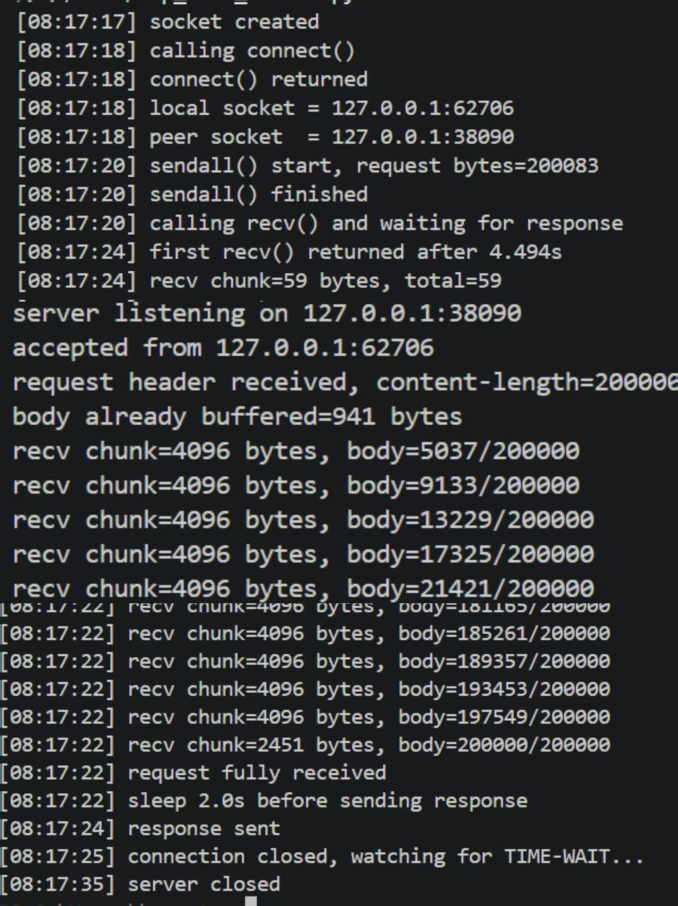
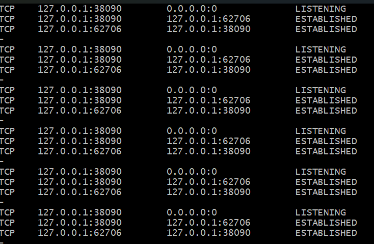
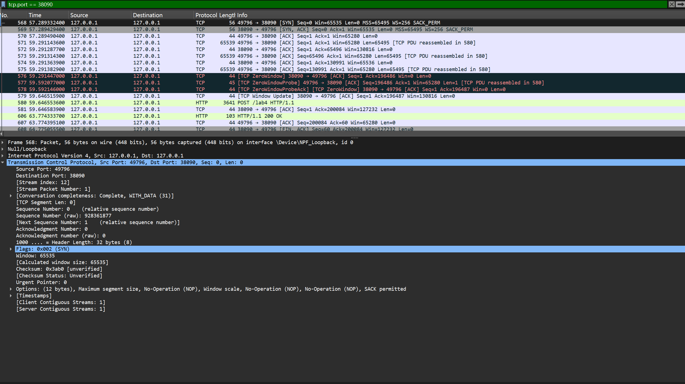
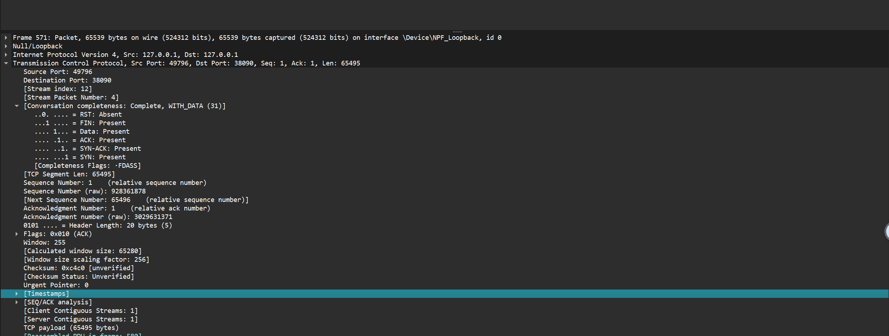
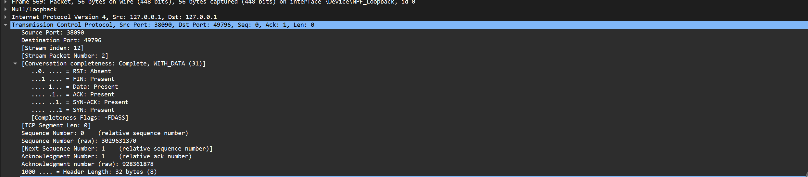
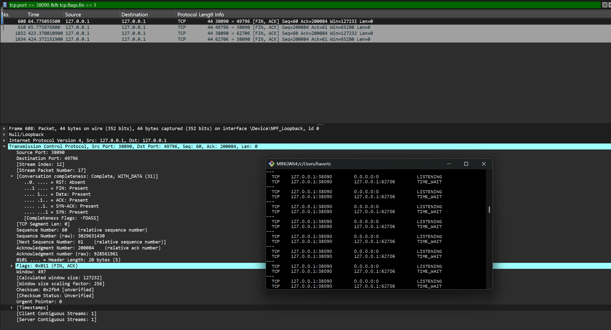

# Lab4：看见TCP 我不怕不怕啦

## 实验背景

本实验围绕一条 TCP 连接的完整生命周期展开，重点观察以下内容：

1. `socket()`、`listen()`、`accept()`、`connect()` 的职责区别
2. "连接"为什么本质上是交换控制信息而不是物理连线
3. TCP 头部中的端口号、序号、ACK 号、标志位、窗口、头部长度、可选字段
4. 三次握手如何建立收发准备
5. 应用层大块数据如何被 TCP 按 MSS 拆分
6. `Sequence Number` 与 `Acknowledgment Number` 如何配合工作
7. `recv()` 为什么会阻塞等待数据
8. 接收窗口如何反映接收方处理能力
9. ACK 与窗口更新为什么常常会被合并
10. `FIN` / `ACK` 如何完成断开
11. 为什么连接结束后套接字不会立刻删除

---

## 实验任务

### 任务一：准备实验环境并记录运行信息

**第一步：准备好四个窗口**

整个实验需要同时观察多个界面，建议在开始前把窗口布局摆好：

- **终端 A**：运行服务端
- **终端 B**：运行客户端
- **终端 C**：持续监控套接字状态（全程保持开启，不要关）
- **Wireshark**：抓包

**第二步：在终端 C 里启动持续监控**

TCP 状态变化很快，等你手动敲完 `ss` 命令再回车，状态可能已经过去了。用下面的命令让终端 C 每 0.5 秒自动刷新一次，之后只需要盯着这个窗口就行：

```bash
# Linux
watch -n 0.5 'ss -tan | grep 38090'

# macOS（没有 watch，用循环代替）
while true; do netstat -an | grep 38090; echo "---"; sleep 0.5; done

# Windows（Git Bash执行）
while true; do netstat -ano | grep 38090; echo "---"; sleep 0.5; done
```

如果你换了端口，把 `38090` 替换成实际端口。

**第三步：打开 Wireshark，选回环接口，填好过滤器，开始抓包**

回环接口在不同系统里名字不同：

| 系统 | 接口名 |
|:-----|:-------|
| Linux | `lo` |
| macOS | `lo0` |
| Windows | `Adapter for loopback traffic capture`（需提前安装 Npcap 并勾选回环支持） |

在显示过滤器里输入：

```text
tcp.port == 38090
```

然后点击开始抓包（蓝色鲨鱼鳍图标）。**先开始抓包，再运行脚本**，否则握手包会被漏掉。

**第四步：启动脚本**

```bash
# 终端 A
python3 tcp_lab4_server.py

# 终端 B（等服务端打印出 server listening on ... 后再运行）
python3 tcp_lab4_client.py
```

如果 `38090` 已被占用，两端都加环境变量换端口，同时记得把 Wireshark 过滤器和终端 C 里的端口号也改掉：

```bash
LAB4_PORT=38123 python3 tcp_lab4_server.py
LAB4_PORT=38123 python3 tcp_lab4_client.py
```

**第五步：填写下表**

| 项目                                | 你的填写内容 |
| :---------------------------------- | :----------- |
| 服务端监听地址                      |     127.0.0.1         |
| 服务端监听端口                      |           38090   |
| 客户端本地临时端口                  |        49796      |
| 客户端请求总字节数                  |     200084         |
| 服务端响应内容                      | HTTP/1.1 200 OK             |
| 客户端 `connect()` 返回前后的时间点 |   Wireshark 中 SYN 包时间为 57.28932400s，SYN-ACK 为 57.28945900s，ACK 为 57.28949040s           |
| 客户端首次收到响应前等待了多久      |     2s         |

各项数值均可直接从终端输出读取：服务端监听信息在 `server listening on ...`，客户端本地端口在 `local socket = ...`，请求字节数在 `sendall() start, request bytes=...`，等待时间在 `first recv() returned after ...s`。



---

### 任务二：观察套接字创建与连接建立

1. 服务端启动后，观察终端 C 出现 `LISTEN` 状态，截图留存。
2. 在终端 B 里启动客户端，观察它依次打印 `socket created`、`calling connect()`、`connect() returned`。
3. 客户端打印 `connect() returned` 之后，观察终端 C 出现 `ESTABLISHED`，截图留存。脚本在 `connect()` 返回后有 2 秒停顿，这段时间足够截图。

填写下表：

| 阶段                             | 你的填写内容 |
| :------------------------------- | :----------- |
| 服务端启动、客户端未连入时的状态 |          LISTENING    |
| `connect()` 返回后服务端状态     |  ESTABLISHED            |
| `connect()` 返回后客户端状态     |        ESTABLISHED      |

简答题：

1. 服务端在客户端连接前为什么处于 `LISTEN`？
服务端调用listen()后进入 LISTEN 状态，表示套接字已绑定端口并准备接受连接，但尚未有客户端发起三次握手，处于 “监听等待” 状态。


2. 为什么这时还没有真正建立 TCP 连接？
TCP 连接的核心是三次握手交换 Seq/Ack 等控制信息，LISTEN 阶段仅服务端单方面准备好，无客户端的 SYN 请求，未完成控制信息交换，因此无实际连接。


3. `socket()` 与 `connect()` 的区别是什么？
socket()：创建套接字（文件描述符），仅分配内核资源，无网络行为；
connect()：客户端向服务端发起三次握手，完成后返回，使套接字进入 ESTABLISHED 状态，具备收发数据能力。


4. 为什么 `connect()` 返回后才进入可稳定收发数据的状态？
connect()返回意味着三次握手完成，双方已协商好初始 Seq、MSS、窗口大小等关键参数，收发缓冲区就绪，可可靠传输数据。


5. 为什么"网线一直连着"不等于"TCP 连接已经建立"？
网线是物理层链路，TCP 连接是传输层基于 “控制信息交换” 的逻辑状态（三次握手），物理链路通不代表双方完成了 TCP 的连接协商。


6. 这里的"连接"更准确地说是在做什么？
是通信双方通过三次握手交换 SYN/ACK 等控制信息，协商初始序号、MSS、窗口大小等参数，同步收发状态，建立逻辑上的 “可靠传输通道”




---

### 任务三：观察三次握手与 TCP 头部字段

**定位握手包**：在 Wireshark 过滤器里输入下面的条件，可以屏蔽中间的数据包，只留下握手和断开阶段的控制包：

```text
tcp.port == 38090 && (tcp.flags.syn == 1 || tcp.flags.fin == 1)
```

包列表最前面的三个包就是三次握手（SYN → SYN-ACK → ACK）。

**找到各字段的位置**：点击某个握手包，在下方详情栏展开 `Transmission Control Protocol`。源端口、目的端口、Seq、Ack、Flags、Window、Header Length 都在这里。TCP 选项在最底部的 `Options` 子项里，展开后可以看到 MSS、Window Scale、SACK Permitted，注意这三项只出现在带 SYN 标志的包里，纯 ACK 包里没有。

**关于序号显示**：Wireshark 默认开启相对序号，会把每个方向的初始序号归零显示，所以 SYN 包的 Seq 看起来是 `0`，而不是真实的随机大数。这是正常现象，实验报告按 Wireshark 显示的值填写即可。如果你想看真实值，可以去 `Edit → Preferences → Protocols → TCP` 里取消勾选 `Relative sequence numbers`。

填写下表：

| 报文       | 源端口 | 目的端口 | Seq  | Ack  | Flags | Window | Header Length |
| :--------- | :----- | :------- | :--- | :--- | :---- | :----- | :------------ |
| 第一次握手 |  49796      |38090          |   0   |    0  |     SYN  | 65535      |        32 bytes      |
| 第二次握手 |     38090   |49796          | 0     | 1     |   SYN, ACK    |     65535   |        32 bytes       |
| 第三次握手 |    49796    | 38090         |     1 |    1  |    ACK   |     65280   |     32 bytes          |

第一次握手（SYN）的 Ack 字段在 Wireshark 里通常显示为空或 `0`，这是正常的，因为此时客户端还没有收到服务端的任何数据。Header Length 在没有选项时是 20 字节，握手包因为携带了 MSS 等选项通常是 28 或 32 字节。

| TCP 选项       | 你的填写内容 |
| :------------- | :----------- |
| MSS            |      65495        |
| Window Scale   |    256          |
| SACK Permitted |     1         |

回环接口的 MSS 通常是 65495（因为回环 MTU 是 65536，比以太网的 1500 大得多），这会影响后续任务五里是否能观察到分段。

简答题：

1. 发送方和接收方端口号在连接阶段的作用是什么？
端口号用于标识通信双方的应用进程，服务端端口（38090）定位监听的服务端程序，客户端临时端口（49796）定位客户端进程，确保控制信息能准确送达目标应用


2. TCP 头部如何帮助找到目标套接字？
通过 “源 IP + 源端口 + 目的 IP + 目的端口” 四元组唯一标识套接字，TCP 头部的源 / 目的端口结合 IP 层的源 / 目的 IP，内核可精准匹配到对应的套接字。


3. 为什么初始序号不是简单固定从 1 开始？
防止旧连接的延迟报文被误判为新连接的有效报文（序号复用问题），随机初始序号可降低报文混淆的概率，提升安全性。


4. 为什么 TCP 可选字段更容易在连接阶段看到？
可选字段（MSS、Window Scale 等）仅在 SYN 包中协商，用于初始化连接参数，数据传输阶段的纯 ACK / 数据报文无需携带这些初始化参数，因此连接阶段（SYN 包）是观察可选字段的最佳时机。




---

### 任务四：区分头部中的控制信息和套接字中的控制信息

用以下过滤器分别找到两类报文：

```text
# 纯控制报文（无应用数据）
tcp.port == 38090 && tcp.len == 0

# 携带应用数据的报文
tcp.port == 38090 && tcp.len > 0
```

从纯控制报文里选一个（SYN、纯 ACK 或 FIN-ACK 都可以），从数据报文里选一个（客户端发请求或服务端发响应的包）。

填写下表：

| 项目                   | 你的填写内容 |
| :--------------------- | :----------- |
| 纯控制报文的类型       |     SYN（第一次握手）、SYN-ACK（第二次握手）、ACK（第三次握手）、FIN-ACK（断开阶段         |
| 携带应用数据的报文类型 |    客户端 POST 请求包（Frame 571，Len=65495）、服务端 HTTP 响应包（Frame 580）          |
| 头部中的控制信息举例   |     SYN/ACK/FIN 标志位、Seq/Ack 序号、Window 窗口大小、MSS         |
| 套接字中的控制信息举例 |       套接字状态（LISTENING/ESTABLISHED/TIME_WAIT）、接收缓冲区大小、窗口缩放因子       |

简答题：

1. 为什么"头部中的控制信息"和"套接字中的控制信息"不是同一件事？
头部中的控制信息：是网络包层面的字段，用于报文在网络中传输时的控制（如 Seq/Ack 保证有序、Window 控制流量、Flags 标识报文类型），随每个包传输；
套接字中的控制信息：是内核层面的状态 / 配置（如套接字状态、缓冲区大小、超时时间），存在于主机内核中，不随报文传输，用于管理本地套接字的行为


---

### 任务五：观察数据分段、序号与 ACK

客户端发送的请求体是 200000 字节，超过了回环接口 MSS（约 65495 字节），因此应该可以在 Wireshark 里看到多个连续的数据段。用下面的过滤器找到客户端发出的数据包：

```text
tcp.srcport != 38090 && tcp.port == 38090 && tcp.len > 0
```

在包列表里连续选几个数据段，对比它们的 Seq 值。相邻两段的关系是：后一段的 Seq = 前一段的 Seq + 前一段的 TCP Segment Len。

找服务端返回给客户端的纯 ACK 报文：

```text
tcp.srcport == 38090 && tcp.flags.ack == 1 && tcp.len == 0
```

填写下表：

| 数据段  | Seq  | Ack  | TCP Segment Len | Flags |
| :------ | :--- | :--- | :-------------- | :---- |
| 第 1 段 |    1  |1      |65495                 |  PSH, ACK     |
| 第 2 段 |    65496  |    1  |         65495        |  PSH, ACK     |
| 第 3 段 |   130991   |     1 |   65495              | PSH, ACK      |

| ACK 报文 | Ack Number | Flags | Window |
| :------- | :--------- | :---- | :----- |
| 第 1 个  |      65496      |  ACK     | 65280       |
| 第 2 个  |     130991       |  ACK     |  65280      |
| 第 3 个  |  196486          |   ACK    | 65280      |

| 项目                         | 你的填写内容 |
| :--------------------------- | :----------- |
| 是否发生分段                 |        是      |
| 握手中观察到的 MSS           |      65495        |
| 单段长度与 MSS 的关系        |   单段长度≤MSS           |
| ACK 号大致确认到了第几个字节 |     第 1 个 ACK 确认到 65496 字节         |

简答题：

1. 应用程序是否直接决定每个网络包的数据长度？为什么？
否。应用程序仅调用sendall()提交数据，实际包长度由 TCP 层决定（基于 MSS、接收窗口、网络状况等），TCP 会按 MSS 拆分数据，应用层无感知。


2. 大块应用数据为什么会被拆分？
受 MSS（最大分段大小）限制，MSS 是 TCP 报文段中数据部分的最大长度（MTU-IP 头部 - TCP 头部），超过 MSS 的数据必须拆分，否则会被 IP 层分片（效率更低）。


3. `MSS` 与 `MTU` 的关系是什么？
MTU（最大传输单元）是链路层帧的数据部分最大长度；MSS = MTU - IP 头部长度（通常 20） - TCP 头部长度（通常 20），即 TCP 报文段中可承载的最大应用数据长度


4. "一次 `sendall()`"与"一个 TCP 包"之间是什么关系？
无直接对应关系。一次sendall()是应用层一次性提交所有数据，TCP 层会根据 MSS、窗口大小等拆分为多个 TCP 包发送，"一次 sendall ()" 可能对应多个 TCP 包


5. 为什么 ACK 体现的是累计确认？
ACK 号表示 “期望收到的下一个字节的序号”，即已成功接收所有小于该序号的字节，无论中间收到多少个分段，只需确认最后一个连续字节的下一个序号，体现 “累计确认”。


6. 如果中间某一段丢失，ACK 会出现什么变化？
ACK 号会停留在丢失分段的起始序号（重复确认），不会随后续分段前进；当重复确认达到阈值，发送方会触发快速重传。





---

### 任务六：观察 `recv()` 阻塞与窗口字段

`recv()` 的等待时间直接从客户端终端读取，`calling recv() and waiting for response` 到 `first recv() returned after ...s` 之间就是等待时长，脚本已经帮你计算好了。

在 Wireshark 里找窗口值：用过滤器 `tcp.port == 38090 && tcp.flags.ack == 1` 列出所有 ACK 包，点击其中一个，在详情栏 `Transmission Control Protocol` 里找 `Window` 字段。如果同时显示了 `Calculated window size`，优先看这个值，它已经把 Window Scale 的缩放算进去了，是对方实际能接收的字节数。

如果包列表的 Info 列出现了 `[TCP Window Update]` 标注，说明这个包的主要目的是通知对方窗口变化，重点观察它的 `Window` 字段。

填写下表：

| 项目                                   | 你的填写内容 |
| :------------------------------------- | :----------- |
| 客户端开始调用 `recv()` 的时间         |    08:17:17          |
| 客户端第一次收到响应的时间             |    08:17:22          |
| `recv()` 是否立刻返回                  |       否       |
| 首次收到响应前等待了多久               |       5s       |
| `recv()` 等待期间连接是否已经建立      |    是          |
| 第 1 个 ACK 报文的窗口值               |      65280        |
| 第 2 个 ACK 报文的窗口值               |      65280        |
| 第 3 个 ACK 报文的窗口值               |     65280         |
| 窗口值是否变化                         |    是          |
| 若变化，变化趋势                       |    先稳定，后因接收缓冲区满变为 0          |
| ACK 与窗口更新是否可以出现在同一个包中 |    是          |
| 是否看到 RTT 或 ACK 往返时间相关信息   |    是          |

简答题：

1. "连接建立"和"应用收到数据"之间是什么关系？
连接建立是应用收到数据的必要非充分条件：连接建立仅表示双方可传输数据，但应用数据是否到达、何时到达取决于服务端处理速度、网络传输等，因此连接建立后 recv () 仍可能阻塞。


2. 为什么说 `read` / `recv` 在数据未到达时会被挂起？
recv () 是阻塞调用，当套接字接收缓冲区无数据时，内核会将进程挂起（放入等待队列），直到有数据到达（服务端发送响应）或超时，才唤醒进程返回数据


3. 窗口字段反映了接收方哪方面的能力？
反映接收方剩余接收缓冲区大小（即还能接收多少字节），体现接收方的处理能力（缓冲区越大 / 处理越快，窗口值越大）。


4. 为什么发送方不能无限制连续发送数据？
接收方处理能力有限（缓冲区大小、CPU / 内存资源），无限制发送会导致接收方缓冲区溢出，数据丢失；TCP 通过窗口机制限制发送方的发送量，避免压垮接收方。


5. 滑动窗口为什么既提高效率又避免压垮接收方？
提高效率：发送方可在收到 ACK 前，连续发送窗口内的所有数据（流水线传输），无需等一个包确认再发下一个；
避免压垮接收方：窗口大小由接收方的剩余缓冲区决定，发送方仅能发送窗口内的数据，接收方处理完数据后更新窗口，发送方才可继续发送。


---

### 任务七：观察响应返回与双向 `seq/ack`

TCP 的 Seq/Ack 是双向独立的，客户端有自己的发送序号，服务端有自己的发送序号。用下面的过滤器只看服务端发出的数据包（源端口是 38090，有应用数据）：

```text
tcp.srcport == 38090 && tcp.len > 0
```

紧跟在服务端数据包后面的、客户端发出的 ACK 包，其 Ack Number 确认的就是服务端的发送序号。

填写下表：

| 项目                     | 你的填写内容 |
| :----------------------- | :----------- |
| 服务端响应数据报文的 Seq |    60          |
| 服务端响应数据报文的 Ack |     200084         |
| 客户端确认报文的 Ack     |     61         |

简答题：

1. 为什么 TCP 的 `seq/ack` 是双向分别计算的？
TCP 连接是全双工的，双方可同时收发数据，各自维护独立的发送序号（Seq）和确认序号（Ack），分别跟踪自己发送的数据和接收对方的数据，因此需要双向独立计算


2. 为什么双方都需要各自的初始序号？
全双工通信中，双方都是发送方和接收方，各自的初始序号用于标记自己发送数据的起始位置，确保双向数据都能被有序确认。


3. 为什么发送应用数据时报文通常仍然带 `ACK`？
TCP 的 ACK 是累计确认，无需单独发 ACK 包，在发送应用数据时携带 ACK 可减少报文数量（捎带确认），提升传输效率。


---

### 任务八：观察连接断开与套接字延迟删除

用下面的过滤器精确定位所有带 FIN 的包：

```text
tcp.port == 38090 && tcp.flags.fin == 1
```

通常会看到两个 FIN 包（双方各一个）。看第一个 FIN 包的源端口，就能判断谁先发起断开。

**关于 TIME-WAIT**：TIME-WAIT 只出现在主动发起关闭的一方（先发 FIN 的那端）。服务端脚本在 `conn.close()` 之后会继续运行 10 秒再退出，这段时间可以在终端 C 里观察 TIME-WAIT。Linux 上 TIME-WAIT 通常持续约 60 秒，macOS 上可能较短，如果没有观察到请如实说明。

填写下表：

| 项目                                    | 你的填写内容 |
| :-------------------------------------- | :----------- |
| 谁先发送 FIN                            |     服务端         |
| 关闭阶段共观察到几个带 FIN 的报文       |   2个           |
| 最终 ACK 是否可见                       |     是         |
| 关闭后是否观察到 `TIME-WAIT` 或等价现象 |    是          |

简答题：

1. 为什么关闭连接不能只发一个结束通知？
TCP 是全双工连接，关闭需要双向确认：一方发 FIN 表示 “我不再发送数据”，另一方发 FIN 表示 “我也不再发送数据”，最后 ACK 确认，确保双方都完成数据传输，无数据丢失。


2. 为什么连接结束后套接字不会立刻删除？
主动关闭方会进入 TIME-WAIT 状态（默认 60 秒），目的是：
确保最后一个 ACK 被对方收到，避免对方重传 FIN；
防止旧连接的延迟报文被新连接误接收。


3. 如果最后一个 ACK 丢失，而旧套接字已经立刻删除，可能带来什么问题？
对方会重传 FIN，此时若旧套接字已删除，新连接可能复用相同四元组，重传的 FIN 会被误判为新连接的报文，导致新连接被异常关闭。




---

## 问答题

1. TCP 的"连接"到底意味着什么？它为什么不是"把网线连上"？


2. 三次握手为什么能让双方进入可通信状态？


3. TCP 头部中的控制字段如何支撑收发数据？


4. ACK、窗口、等待时间为什么会共同影响 TCP 的可靠传输？


5. 断开连接为什么仍然需要严格的控制信息交换？


6. 如果服务端根本没有启动，客户端调用 `connect()` 时会看到什么现象？


7. 如果中途人为制造丢包，ACK、重传、窗口之间会出现什么变化？


8. 如果把客户端发送的数据改得更大，窗口字段和分段情况会如何变化？


9. 如果把服务端读取速度改得更慢，是否更容易看到窗口更新甚至零窗口？


---

## 截图要求

- 截图须清晰，终端文字和 Wireshark 字段可读。
- 所有截图与本 `Lab4.md` 放在同一目录下。
- 命名规范：

| 截图内容               | 文件名                  |
| :--------------------- | :---------------------- |
| 服务端与客户端运行结果 | `run.png`               |
| `ss` 状态变化          | `states.png`            |
| 三次握手与 TCP 选项    | `handshake_header.png`  |
| 大请求分段与 MSS       | `segmentation.png`      |
| ACK 与窗口观察         | `ack_window.png`        |
| 断开与最终状态         | `teardown_timewait.png` |

具体要求：

1. `run.png`：终端截图，至少能看到服务端 `server listening on ...`、客户端 `calling connect()`、`connect() returned`、`calling recv() and waiting for response`、`first recv() returned after ...s`。

2. `states.png`：终端截图，至少能看到 `LISTEN`、`ESTABLISHED`，以及 `TIME-WAIT`（若能观察到）。推荐截 `watch` 命令的持续输出画面，可以在一张截图里同时展示多个状态的变化过程。

3. `handshake_header.png`：Wireshark 截图，至少能看到三次握手中某个包的 `Source Port`、`Destination Port`、`Sequence Number`、`Acknowledgment Number`、`Flags`、`Window`，以及 `Options` 中的 `Maximum segment size`、`Window Scale`、`SACK Permitted`。

4. `segmentation.png`：Wireshark 截图，至少能看到客户端发送数据的 TCP 包的 `TCP Segment Len`、`Seq`、`Ack`。若能观察到分段，尽量截出多个连续数据段。

5. `ack_window.png`：Wireshark 截图，至少能看到一个或多个 ACK 报文的 `Acknowledgment Number`、`Window`，以及 `Calculated window size`（若显示）、`[TCP Window Update]`（若出现）。

6. `teardown_timewait.png`：Wireshark 截图或 Wireshark 与终端截图的拼图，至少能看到带 `FIN` 的包，以及 `TIME-WAIT` 状态（若能观察到）。

---

## 提交要求

在自己的文件夹下新建 `Lab4/` 目录，提交以下文件：

```text
学号姓名/
└── Lab4/
    ├── Lab4.md
    ├── tcp_lab4_server.py
    ├── tcp_lab4_client.py
    ├── run.png
    ├── states.png
    ├── handshake_header.png
    ├── segmentation.png
    ├── ack_window.png
    └── teardown_timewait.png
```

---

## 截止时间

2026-04-23，届时关于 Lab4 的 PR 请求将不会被合并。
