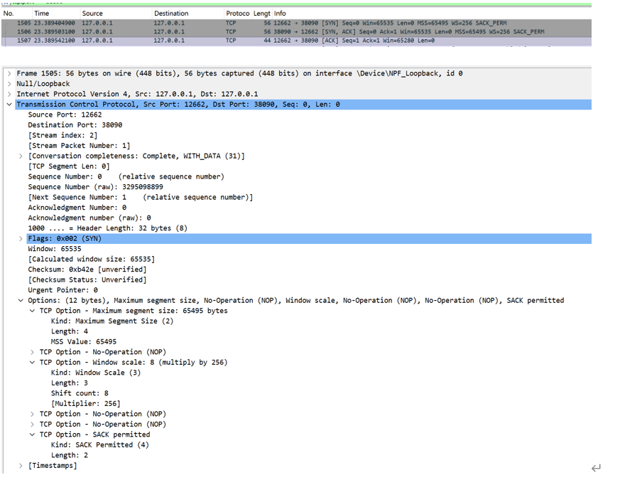
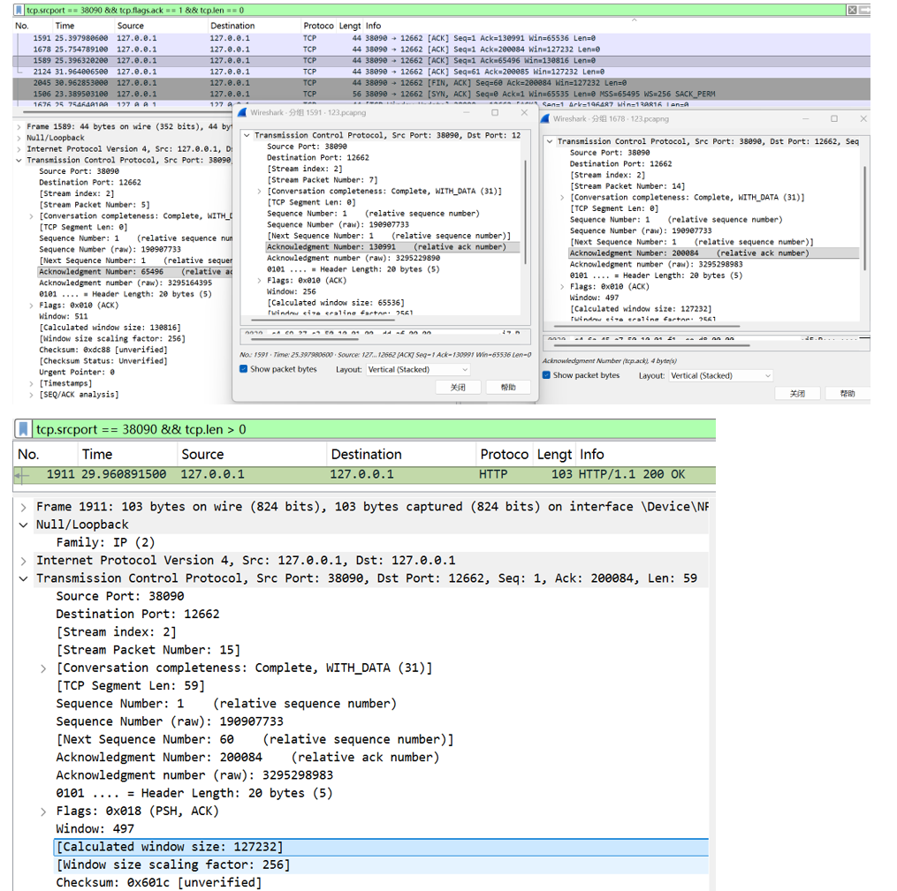
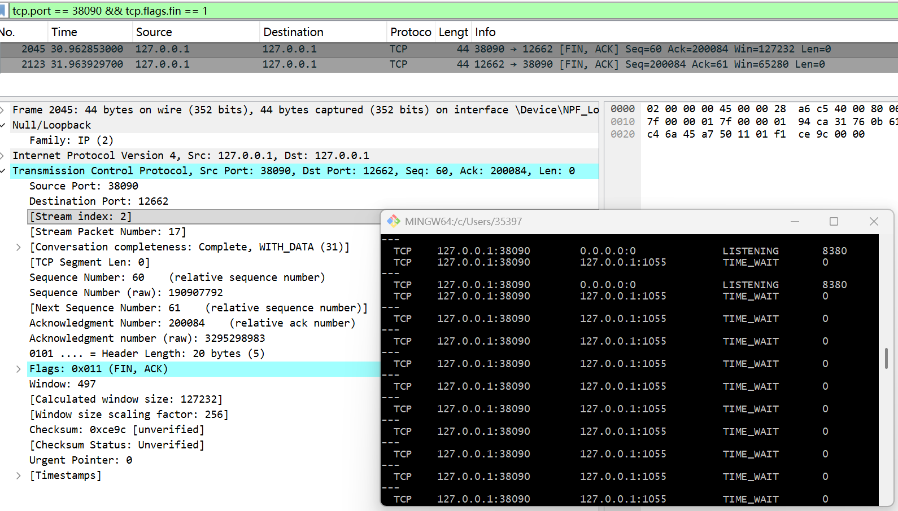

# Lab4：看见TCP 我不怕不怕啦

## 实验背景

本实验围绕一条 TCP 连接的完整生命周期展开，重点观察以下内容：

1. `socket()`、`listen()`、`accept()`、`connect()` 的职责区别
2. "连接"为什么本质上是交换控制信息而不是物理连线
3. TCP 头部中的端口号、序号、ACK 号、标志位、窗口、头部长度、可选字段
4. 三次握手如何建立收发准备
5. 应用层大块数据如何被 TCP 按 MSS 拆分
6. `Sequence Number` 与 `Acknowledgment Number` 如何配合工作
7. `recv()` 为什么会阻塞等待数据
8. 接收窗口如何反映接收方处理能力
9. ACK 与窗口更新为什么常常会被合并
10. `FIN` / `ACK` 如何完成断开
11. 为什么连接结束后套接字不会立刻删除

---

## 实验任务

### 任务一：准备实验环境并记录运行信息

**第一步：准备好四个窗口**

整个实验需要同时观察多个界面，建议在开始前把窗口布局摆好：

- **终端 A**：运行服务端
- **终端 B**：运行客户端
- **终端 C**：持续监控套接字状态（全程保持开启，不要关）
- **Wireshark**：抓包

**第二步：在终端 C 里启动持续监控**

TCP 状态变化很快，等你手动敲完 `ss` 命令再回车，状态可能已经过去了。用下面的命令让终端 C 每 0.5 秒自动刷新一次，之后只需要盯着这个窗口就行：

```bash
# Linux
watch -n 0.5 'ss -tan | grep 38090'

# macOS（没有 watch，用循环代替）
while true; do netstat -an | grep 38090; echo "---"; sleep 0.5; done

# Windows（Git Bash执行）
while true; do netstat -ano | grep 38090; echo "---"; sleep 0.5; done
```

如果你换了端口，把 `38090` 替换成实际端口。

**第三步：打开 Wireshark，选回环接口，填好过滤器，开始抓包**

回环接口在不同系统里名字不同：

| 系统 | 接口名 |
|:-----|:-------|
| Linux | `lo` |
| macOS | `lo0` |
| Windows | `Adapter for loopback traffic capture`（需提前安装 Npcap 并勾选回环支持） |

在显示过滤器里输入：

```text
tcp.port == 38090
```

然后点击开始抓包（蓝色鲨鱼鳍图标）。**先开始抓包，再运行脚本**，否则握手包会被漏掉。

**第四步：启动脚本**

```bash
# 终端 A
python3 tcp_lab4_server.py

# 终端 B（等服务端打印出 server listening on ... 后再运行）
python3 tcp_lab4_client.py
```

如果 `38090` 已被占用，两端都加环境变量换端口，同时记得把 Wireshark 过滤器和终端 C 里的端口号也改掉：

```bash
LAB4_PORT=38123 python3 tcp_lab4_server.py
LAB4_PORT=38123 python3 tcp_lab4_client.py
```

**第五步：填写下表**

| 项目                                | 你的填写内容 |
| :---------------------------------- | :----------- |
| 服务端监听地址                      |     127.0.0.1         |
| 服务端监听端口                      |    38090          |
| 客户端本地临时端口                  |      12662        |
| 客户端请求总字节数                  |     200083         |
| 服务端响应内容                      | HTTP/1.1 200 OK；Content-Length: 2；Connection: close；OK |
| 客户端 `connect()` 返回前后的时间点 |   09:04:50           |
| 客户端首次收到响应前等待了多久      |      4.563s        |

各项数值均可直接从终端输出读取：服务端监听信息在 `server listening on ...`，客户端本地端口在 `local socket = ...`，请求字节数在 `sendall() start, request bytes=...`，等待时间在 `first recv() returned after ...s`。


---

### 任务二：观察套接字创建与连接建立

1. 服务端启动后，观察终端 C 出现 `LISTEN` 状态，截图留存。
2. 在终端 B 里启动客户端，观察它依次打印 `socket created`、`calling connect()`、`connect() returned`。
3. 客户端打印 `connect() returned` 之后，观察终端 C 出现 `ESTABLISHED`，截图留存。脚本在 `connect()` 返回后有 2 秒停顿，这段时间足够截图。

填写下表：

| 阶段                             | 你的填写内容 |
| :------------------------------- | :----------- |
| 服务端启动、客户端未连入时的状态 |    LISTENING          |
| `connect()` 返回后服务端状态     |      ESTABLISHED        |
| `connect()` 返回后客户端状态     |    ESTABLISHED          |

简答题：

1. 服务端在客户端连接前为什么处于 `LISTEN`？
答：服务端调用listen()后进入 LISTEN 状态，表示服务端已在指定端口绑定并准备好接受客户端的连接请求，相当于在端口 "守候"，等待客户端发起三次握手。


2. 为什么这时还没有真正建立 TCP 连接？
答：TCP 连接的本质是双方完成三次握手交换控制信息，此时客户端尚未发起 SYN 请求，双方没有协商序号、窗口等参数，因此没有建立真正的逻辑连接。


3. `socket()` 与 `connect()` 的区别是什么？
答：socket()是创建一个通信端点（套接字），分配系统资源，但未绑定地址也未建立连接；connect()是主动向服务端发起 TCP 连接，触发三次握手，只有握手完成后才能收发数据。


4. 为什么 `connect()` 返回后才进入可稳定收发数据的状态？
答：connect()是阻塞调用，只有三次握手完成、双方确认对方收发能力并同步序号后才会返回，此时连接进入 ESTABLISHED 状态，数据传输的可靠性有保障。


5. 为什么"网线一直连着"不等于"TCP 连接已经建立"？
答：网线连通只是物理层和链路层的条件，TCP 连接是传输层的逻辑概念，需要双方协议栈完成三次握手、维护连接状态才能建立，物理连通只是前提。


6. 这里的"连接"更准确地说是在做什么？
答："连接" 是双方在内核中维护一个四元组（源 IP + 源端口 + 目的 IP + 目的端口）对应的状态机，通过三次握手建立、四次挥手关闭，全程跟踪序号、窗口、缓冲区等控制信息。


---

### 任务三：观察三次握手与 TCP 头部字段

**定位握手包**：在 Wireshark 过滤器里输入下面的条件，可以屏蔽中间的数据包，只留下握手和断开阶段的控制包：

```text
tcp.port == 38090 && (tcp.flags.syn == 1 || tcp.flags.fin == 1)
```

包列表最前面的三个包就是三次握手（SYN → SYN-ACK → ACK）。

**找到各字段的位置**：点击某个握手包，在下方详情栏展开 `Transmission Control Protocol`。源端口、目的端口、Seq、Ack、Flags、Window、Header Length 都在这里。TCP 选项在最底部的 `Options` 子项里，展开后可以看到 MSS、Window Scale、SACK Permitted，注意这三项只出现在带 SYN 标志的包里，纯 ACK 包里没有。

**关于序号显示**：Wireshark 默认开启相对序号，会把每个方向的初始序号归零显示，所以 SYN 包的 Seq 看起来是 `0`，而不是真实的随机大数。这是正常现象，实验报告按 Wireshark 显示的值填写即可。如果你想看真实值，可以去 `Edit → Preferences → Protocols → TCP` 里取消勾选 `Relative sequence numbers`。

填写下表：

| 报文       | 源端口 | 目的端口 | Seq  | Ack  | Flags | Window | Header Length |
| :--------- | :----- | :------- | :--- | :--- | :---- | :----- | :------------ |
| 第一次握手 |  12662      |     38090     |   0   |   0   |   0x002 (SYN)    |  65535      |  32 bytes (8)             |
| 第二次握手 |  38090	      |   12662	       |   0   |    1  |    0x012 (SYN,ACK)   |   65535     |    32 bytes (8)           |
| 第三次握手 |   12662     |   38090      |   1   |   1   |    0x010 (ACK)   |     65280   |    20 bytes (5)           |

第一次握手（SYN）的 Ack 字段在 Wireshark 里通常显示为空或 `0`，这是正常的，因为此时客户端还没有收到服务端的任何数据。Header Length 在没有选项时是 20 字节，握手包因为携带了 MSS 等选项通常是 28 或 32 字节。

| TCP 选项       | 你的填写内容 |
| :------------- | :----------- |
| MSS            |    65495 bytes          |
| Window Scale   |   8（乘数 256）           |
| SACK Permitted |     1（允许）         |

回环接口的 MSS 通常是 65495（因为回环 MTU 是 65536，比以太网的 1500 大得多），这会影响后续任务五里是否能观察到分段。

简答题：

1. 发送方和接收方端口号在连接阶段的作用是什么？
答：端口号是主机上应用进程的唯一标识，连接阶段通过源端口和目的端口，让操作系统将 TCP 报文准确交付给对应的实验程序。


2. TCP 头部如何帮助找到目标套接字？
答：TCP 通过源 IP + 源端口 + 目的 IP + 目的端口四元组唯一标识一个连接，操作系统内核通过这个四元组查找对应的套接字对象。


3. 为什么初始序号不是简单固定从 1 开始？
答：为了防止网络中延迟的旧连接数据包被新连接误接收，同时避免序号预测攻击，保证 TCP 连接的唯一性和安全性。


4. 为什么 TCP 可选字段更容易在连接阶段看到？
答：TCP 可选字段（MSS、窗口缩放、SACK）是连接级别的参数，只需要在三次握手时协商一次，后续数据传输阶段无需重复携带。




---

### 任务四：区分头部中的控制信息和套接字中的控制信息

用以下过滤器分别找到两类报文：

```text
# 纯控制报文（无应用数据）
tcp.port == 38090 && tcp.len == 0

# 携带应用数据的报文
tcp.port == 38090 && tcp.len > 0
```

从纯控制报文里选一个（SYN、纯 ACK 或 FIN-ACK 都可以），从数据报文里选一个（客户端发请求或服务端发响应的包）。

填写下表：

| 项目                   | 你的填写内容 |
| :--------------------- | :----------- |
| 纯控制报文的类型       |     ACK（确认报文）         |
| 携带应用数据的报文类型 |   HTTP POST 请求报文          |
| 头部中的控制信息举例   |    Seq、Ack、Flags、Window、Header Length          |
| 套接字中的控制信息举例 |   连接状态（LISTEN/ESTABLISHED）、接收缓冲区大小、超时时间          |

简答题：

1. 为什么"头部中的控制信息"和"套接字中的控制信息"不是同一件事？
答：头部控制信息是网络传输层的报文内容，随每个 TCP 包在网络中传输，用于指导对方协议栈处理；套接字控制信息是操作系统内核中维护的连接状态，仅在本地主机内核中存在，用于管理本地的通信端点。


---

### 任务五：观察数据分段、序号与 ACK

客户端发送的请求体是 200000 字节，超过了回环接口 MSS（约 65495 字节），因此应该可以在 Wireshark 里看到多个连续的数据段。用下面的过滤器找到客户端发出的数据包：

```text
tcp.srcport != 38090 && tcp.port == 38090 && tcp.len > 0
```

在包列表里连续选几个数据段，对比它们的 Seq 值。相邻两段的关系是：后一段的 Seq = 前一段的 Seq + 前一段的 TCP Segment Len。

找服务端返回给客户端的纯 ACK 报文：

```text
tcp.srcport == 38090 && tcp.flags.ack == 1 && tcp.len == 0
```

填写下表：

| 数据段  | Seq  | Ack  | TCP Segment Len | Flags |
| :------ | :--- | :--- | :-------------- | :---- |
| 第 1 段 |   1   |   1   |      65495           |  0x010 (ACK)     |
| 第 2 段 |   65496   |   1   |       65495          |  0x010 (ACK)    |
| 第 3 段 |   130991   |   1   |      65495           |   0x010 (ACK)    |

| ACK 报文 | Ack Number | Flags | Window |
| :------- | :--------- | :---- | :----- |
| 第 1 个  |    65496        | 0x010 (ACK)     |    255    |
| 第 2 个  |     130991       |   0x010 (ACK)    |   255     |
| 第 3 个  |      200084      |   0x010 (ACK)    |    255   |

| 项目                         | 你的填写内容 |
| :--------------------------- | :----------- |
| 是否发生分段                 |     是         |
| 握手中观察到的 MSS           |      65495        |
| 单段长度与 MSS 的关系        |      单段长度等于 MSS        |
| ACK 号大致确认到了第几个字节 |     65496、130991、200084         |

简答题：

1. 应用程序是否直接决定每个网络包的数据长度？为什么？
答：不能。应用层仅调用sendall()提交大块数据，具体分段由 TCP 协议栈根据 MSS、接收窗口、拥塞窗口自动完成。


2. 大块应用数据为什么会被拆分？
答：受 MSS 限制（单个 TCP 段不能超过 MSS），避免 IP 层分片，同时提高传输可靠性（丢包只需重传小段）。


3. `MSS` 与 `MTU` 的关系是什么？
答：MSS = MTU - IP 头部长度（20 字节）- TCP 头部长度（20 字节），回环接口 MTU 为 65536，因此 MSS 为 65495。


4. "一次 `sendall()`"与"一个 TCP 包"之间是什么关系？
答：一次sendall()会被 TCP 拆分为多个 TCP 段传输，两者是一对多的关系。


5. 为什么 ACK 体现的是累计确认？
答：ACK 号表示 "该序号之前的所有数据都已成功接收"，减少 ACK 包数量，提高传输效率。


6. 如果中间某一段丢失，ACK 会出现什么变化？
答：接收方会重复发送相同的 ACK 号（重复 ACK），触发发送方快速重传丢失的段。




---

### 任务六：观察 `recv()` 阻塞与窗口字段

`recv()` 的等待时间直接从客户端终端读取，`calling recv() and waiting for response` 到 `first recv() returned after ...s` 之间就是等待时长，脚本已经帮你计算好了。

在 Wireshark 里找窗口值：用过滤器 `tcp.port == 38090 && tcp.flags.ack == 1` 列出所有 ACK 包，点击其中一个，在详情栏 `Transmission Control Protocol` 里找 `Window` 字段。如果同时显示了 `Calculated window size`，优先看这个值，它已经把 Window Scale 的缩放算进去了，是对方实际能接收的字节数。

如果包列表的 Info 列出现了 `[TCP Window Update]` 标注，说明这个包的主要目的是通知对方窗口变化，重点观察它的 `Window` 字段。

填写下表：

| 项目                                   | 你的填写内容 |
| :------------------------------------- | :----------- |
| 客户端开始调用 `recv()` 的时间         |      09:04:52        |
| 客户端第一次收到响应的时间             |  09:04:57            |
| `recv()` 是否立刻返回                  |     否         |
| 首次收到响应前等待了多久               |      4.563s        |
| `recv()` 等待期间连接是否已经建立      |    是（ESTABLISHED）          |
| 第 1 个 ACK 报文的窗口值               |    65280       |
| 第 2 个 ACK 报文的窗口值               |    65280          |
| 第 3 个 ACK 报文的窗口值               |   127232       |
| 窗口值是否变化                         |   是        |
| 若变化，变化趋势                       |  先保持 255，后增大到 497         |
| ACK 与窗口更新是否可以出现在同一个包中 |   是        |
| 是否看到 RTT 或 ACK 往返时间相关信息   |    是         |

简答题：

1. "连接建立"和"应用收到数据"之间是什么关系？
答：连接建立只是说明双方逻辑链路通了，应用层数据需要服务端处理后发送，因此 recv () 会阻塞等待数据到达。


2. 为什么说 `read` / `recv` 在数据未到达时会被挂起？
答：默认是阻塞 I/O 模式，当套接字接收缓冲区没有数据时，recv () 会将线程挂起，直到有数据到达或连接关闭。


3. 窗口字段反映了接收方哪方面的能力？
答：反映接收方当前剩余的接收缓冲区空间大小，即还能接收多少字节的数据。


4. 为什么发送方不能无限制连续发送数据？
答：受接收方流量控制（窗口大小）和网络拥塞控制限制，防止接收方缓冲区溢出或网络拥塞。


5. 滑动窗口为什么既提高效率又避免压垮接收方？
答：允许发送方连续发送多个段（流水线传输）提高效率，同时根据接收方的窗口大小调整发送速率，避免压垮接收方。


---

### 任务七：观察响应返回与双向 `seq/ack`

TCP 的 Seq/Ack 是双向独立的，客户端有自己的发送序号，服务端有自己的发送序号。用下面的过滤器只看服务端发出的数据包（源端口是 38090，有应用数据）：

```text
tcp.srcport == 38090 && tcp.len > 0
```

紧跟在服务端数据包后面的、客户端发出的 ACK 包，其 Ack Number 确认的就是服务端的发送序号。

填写下表：

| 项目                     | 你的填写内容 |
| :----------------------- | :----------- |
| 服务端响应数据报文的 Seq |     1         |
| 服务端响应数据报文的 Ack |       200084       |
| 客户端确认报文的 Ack     |      60        |

简答题：

1. 为什么 TCP 的 `seq/ack` 是双向分别计算的？
答：TCP 是全双工通信，双方可以同时发送和接收数据，因此需要各自独立的发送序号和确认序号。


2. 为什么双方都需要各自的初始序号？
答：区分不同方向的数据流，防止序号冲突，保证双向数据传输的可靠性。


3. 为什么发送应用数据时报文通常仍然带 `ACK`？
答：TCP 支持捎带确认，在发送数据的同时顺便确认对方之前发送的数据，减少单独 ACK 包的开销。


---

### 任务八：观察连接断开与套接字延迟删除

用下面的过滤器精确定位所有带 FIN 的包：

```text
tcp.port == 38090 && tcp.flags.fin == 1
```

通常会看到两个 FIN 包（双方各一个）。看第一个 FIN 包的源端口，就能判断谁先发起断开。

**关于 TIME-WAIT**：TIME-WAIT 只出现在主动发起关闭的一方（先发 FIN 的那端）。服务端脚本在 `conn.close()` 之后会继续运行 10 秒再退出，这段时间可以在终端 C 里观察 TIME-WAIT。Linux 上 TIME-WAIT 通常持续约 60 秒，macOS 上可能较短，如果没有观察到请如实说明。

填写下表：

| 项目                                    | 你的填写内容 |
| :-------------------------------------- | :----------- |
| 谁先发送 FIN                            |    服务端（源端口 38090）          |
| 关闭阶段共观察到几个带 FIN 的报文       |    2 个          |
| 最终 ACK 是否可见                       |     是         |
| 关闭后是否观察到 `TIME-WAIT` 或等价现象 |     是         |

简答题：

1. 为什么关闭连接不能只发一个结束通知？
答：TCP 是全双工通信，一个 FIN 只能表示 "本方不再发送数据"，但仍可以接收对方的数据，因此需要双方各发一个 FIN，分别关闭两个方向的数据流。


2. 为什么连接结束后套接字不会立刻删除？
答：主动关闭方需要进入 TIME-WAIT 状态（约 60 秒），确保最后一个 ACK 能送达对方，同时防止网络中延迟的旧数据包被新连接误接收。


3. 如果最后一个 ACK 丢失，而旧套接字已经立刻删除，可能带来什么问题？
答：对方会重发 FIN 报文，此时本地没有对应的套接字，会返回 RST 报文导致对方异常关闭；同时延迟的旧数据包可能被新连接误接收，造成数据混乱。




---

## 问答题

1. TCP 的"连接"到底意味着什么？它为什么不是"把网线连上"？
答：TCP的"连接"本质是**通信双方在内核中共同维护的一个逻辑状态机**，通过四元组（源IP+源端口+目的IP+目的端口）唯一标识，包含序号、确认号、窗口大小、缓冲区状态等控制信息。
它不是"把网线连上"，因为：
 网线连通只是物理层和链路层的硬件条件，TCP连接是传输层的软件逻辑概念；
 网线连通不代表服务端在监听端口、不代表双方完成了三次握手协商；
 即使网线一直连着，只要双方没有维护连接状态，TCP连接就不存在。


2. 三次握手为什么能让双方进入可通信状态？
答：三次握手通过三次控制报文交换，让双方都确认了**对方具备发送和接收能力**，同时完成了初始序号的同步：
 第一次握手（SYN）：客户端告诉服务端"我要发起连接，我的初始序号是X"；
 第二次握手（SYN+ACK）：服务端回应"我收到了，同意连接，我的初始序号是Y，确认你的序号X+1"；
 第三次握手（ACK）：客户端回应"我收到了你的序号，确认Y+1"。
完成这三步后，双方都知道对方能收发数据，且序号同步完毕，因此进入稳定的ESTABLISHED可通信状态。


3. TCP 头部中的控制字段如何支撑收发数据？
答：TCP头部的各个控制字段分工明确，共同保障可靠传输：
 源/目的端口：定位通信双方的应用进程；
 序号（Seq）：标识数据字节的顺序，保证数据按序到达；
 确认号（Ack）：累计确认已收到的数据，告诉对方"我收到了X之前的所有字节"；
 标志位（Flags）：控制连接生命周期（SYN建连、ACK确认、FIN断连、PSH推送数据）；
 窗口（Window）：通知对方自己的接收缓冲区剩余空间，实现流量控制；
 头部长度：区分头部和数据部分，支持可选字段扩展。


4. ACK、窗口、等待时间为什么会共同影响 TCP 的可靠传输？
答：三者构成了TCP可靠传输的核心机制：
ACK：提供数据接收的反馈，发送方未收到ACK会触发超时重传，保证数据不丢失；
窗口：限制发送方的发送速率，防止接收方缓冲区溢出，避免数据被丢弃；
等待时间（超时重传时间）：决定发送方等待ACK的最长时间，超时后自动重传丢失的数据包，适配网络延迟变化。
三者配合，在不可靠的IP网络上实现了可靠、有序、可控的数据传输。

5. 断开连接为什么仍然需要严格的控制信息交换？
答：因为TCP是全双工通信，双方都可以独立发送和接收数据，断开连接需要分别关闭两个方向的数据流：
 一方发送FIN仅表示"我不再发送数据"，但仍可以接收对方的数据；
 只有双方都发送FIN并收到对方的ACK确认，才能确保所有数据都已传输完毕；
 严格的四次挥手（或合并的三次挥手）可以避免数据丢失、连接状态不一致的问题。


6. 如果服务端根本没有启动，客户端调用 `connect()` 时会看到什么现象？
答：客户端会立即抛出 `ConnectionRefusedError: [WinError 10061] 由于目标计算机积极拒绝，无法连接`（Windows）或 `Connection refused`（Linux/macOS）错误。
原因是服务端未启动时，目标端口38090没有进程监听，客户端发送的SYN握手包会被操作系统内核直接返回RST复位包，导致连接建立失败。


7. 如果中途人为制造丢包，ACK、重传、窗口之间会出现什么变化？
答：会出现以下典型现象：
ACK：接收方会重复发送相同的ACK号（重复ACK），确认到丢失段之前的所有数据；
重传：发送方收到3个及以上重复ACK，会触发快速重传，直接重传丢失的段，无需等待超时；
窗口：发送方会缩小拥塞窗口，降低发送速率，避免网络拥塞进一步恶化；如果超时重传，窗口会重置为初始值。


8. 如果把客户端发送的数据改得更大，窗口字段和分段情况会如何变化？
答：
分段情况：分段数量会显著增加，因为TCP会按照MSS（65495字节）拆分更大的应用数据，每段长度仍不超过MSS；
窗口字段：接收方的窗口会随着数据的接收和处理动态变化，数据量更大时，更容易观察到窗口先收缩（缓冲区被填满）、再逐渐增大（服务端处理完数据释放缓冲区）的过程。


9. 如果把服务端读取速度改得更慢，是否更容易看到窗口更新甚至零窗口？
答：是的，会非常容易观察到。
服务端读取速度变慢时，接收缓冲区会被客户端发送的数据快速填满，此时服务端会发送窗口值为0的ACK报文（零窗口），通知客户端暂停发送数据；当服务端处理完部分数据、释放缓冲区后，会发送窗口更新报文，通知客户端可以继续发送数据。


---

## 截图要求

- 截图须清晰，终端文字和 Wireshark 字段可读。
- 所有截图与本 `Lab4.md` 放在同一目录下。
- 命名规范：

| 截图内容               | 文件名                  |
| :--------------------- | :---------------------- |
| 服务端与客户端运行结果 | `run.png`               |
| `ss` 状态变化          | `states.png`            |
| 三次握手与 TCP 选项    | `handshake_header.png`  |
| 大请求分段与 MSS       | `segmentation.png`      |
| ACK 与窗口观察         | `ack_window.png`        |
| 断开与最终状态         | `teardown_timewait.png` |

具体要求：

1. `run.png`：终端截图，至少能看到服务端 `server listening on ...`、客户端 `calling connect()`、`connect() returned`、`calling recv() and waiting for response`、`first recv() returned after ...s`。

2. `states.png`：终端截图，至少能看到 `LISTEN`、`ESTABLISHED`，以及 `TIME-WAIT`（若能观察到）。推荐截 `watch` 命令的持续输出画面，可以在一张截图里同时展示多个状态的变化过程。

3. `handshake_header.png`：Wireshark 截图，至少能看到三次握手中某个包的 `Source Port`、`Destination Port`、`Sequence Number`、`Acknowledgment Number`、`Flags`、`Window`，以及 `Options` 中的 `Maximum segment size`、`Window Scale`、`SACK Permitted`。

4. `segmentation.png`：Wireshark 截图，至少能看到客户端发送数据的 TCP 包的 `TCP Segment Len`、`Seq`、`Ack`。若能观察到分段，尽量截出多个连续数据段。

5. `ack_window.png`：Wireshark 截图，至少能看到一个或多个 ACK 报文的 `Acknowledgment Number`、`Window`，以及 `Calculated window size`（若显示）、`[TCP Window Update]`（若出现）。

6. `teardown_timewait.png`：Wireshark 截图或 Wireshark 与终端截图的拼图，至少能看到带 `FIN` 的包，以及 `TIME-WAIT` 状态（若能观察到）。

---

## 提交要求

在自己的文件夹下新建 `Lab4/` 目录，提交以下文件：

```text
学号姓名/
└── Lab4/
    ├── Lab4.md
    ├── tcp_lab4_server.py
    ├── tcp_lab4_client.py
    ├── run.png
    ├── states.png
    ├── handshake_header.png
    ├── segmentation.png
    ├── ack_window.png
    └── teardown_timewait.png
```

---

## 截止时间

2026-04-23，届时关于 Lab4 的 PR 请求将不会被合并。
