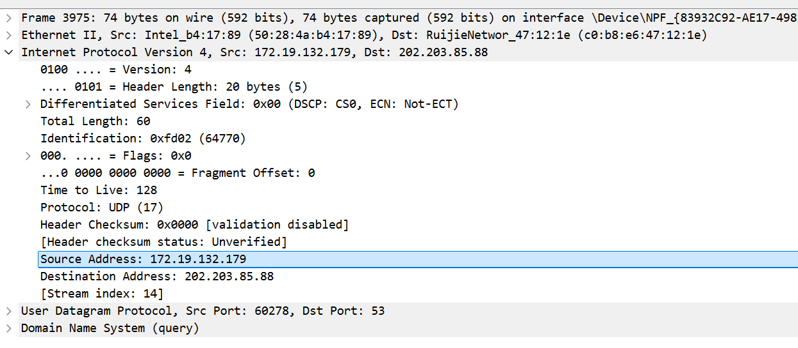

# Lab5：IP 与以太网的包收发操作

## 实验背景

本实验围绕 IP 模块与以太网在包收发过程中的角色展开，重点观察以下内容：

1. 网络包的基本结构：头部（IP 头部 + MAC 头部）与数据
2. IP 头部各字段的含义：版本号、TTL、协议号、发送方/接收方 IP 地址等
3. MAC 头部各字段的含义：接收方/发送方 MAC 地址、以太类型
4. IP 地址与 MAC 地址的区别与协作
5. ARP 协议如何通过 IP 地址查询 MAC 地址
6. 路由表的结构与查询方式
7. UDP 协议与 TCP 协议的区别：无连接、无确认、无重传
8. UDP 头部结构：发送方端口号、接收方端口号、数据长度、校验和
9. ICMP 协议的作用与常见消息类型（Echo、Destination Unreachable 等）

---

## 实验任务

### 任务一：查看路由表、ARP 缓存并启动 Wireshark

**第一步：打开 Wireshark，选择主网络接口，开始抓包**

> **注意**：本次实验必须使用真实网络接口（`en0`/`eth0`/`以太网`），不要选回环接口。回环接口不经过以太网，无法观察到 MAC 头部和 ARP 过程。

选择你的主网络接口，开始抓包。本次实验的大部分任务会共用同一次抓包。

**第二步：查看本机路由表**

```bash
# Linux
route -n
ip route show

# macOS
netstat -rn

# Windows
route print
```

截图并保存为 `route_table.png`。

**第三步：查看本机 ARP 缓存**

```bash
# Linux / macOS / Windows
arp -a
```

截图并保存为 `arp_cache.png`。

**第四步：填写下表**

从路由表和 ARP 缓存的输出中提取信息：

| 项目                         | 你的填写内容 |
| :--------------------------- | :----------- |
| 本机 IP 地址                 |       172.19.132.179       |
| 本机所在子网                 |      172.19.0.0/16        |
| 子网掩码                     |     255.255.0.0         |
| 默认网关 IP                  |     172.19.0.1         |
| 默认网关 MAC 地址            |      c0:b8:e6:47:12:1e        |
| 本机网卡 MAC 地址            |     50:28:4a:b4:17:89         |

简答题：

1. 路由表的每一行包含哪些关键字段？教材中提到的 `Network Destination`、`Netmask`、`Gateway`、`Interface` 分别对应什么含义？
答：本次实验 Windows 路由表中，每一行核心关键字段为：网络目标、网络掩码、网关、接口、跃点数。
Network Destination（网络目标）：数据包要送达的目标网络 / 主机 IP 地址，0.0.0.0 代表默认路由；
Netmask（网络掩码）：与网络目标配合，确定目标 IP 所属的子网范围；
Gateway（网关）：数据包要转发到的下一跳设备 IP 地址，在链路上表示目标与本机在同一子网，无需网关转发；
Interface（接口）：本机发送该目标数据包时使用的网卡 IP 地址，即出网接口。


2. 当目标 IP 地址不在本子网时，包会先发给谁？路由表的哪一列提供了这个信息？
答：当目标 IP 不在本子网时，数据包会先发给默认网关（本次实验为 172.19.0.1）；路由表的Gateway（网关）列提供了该信息，对应网络目标为 0.0.0.0 的默认路由条目。


3. 路由表的默认网关（`0.0.0.0`）条目的作用是什么？什么时候会匹配到这一行？
答：默认网关条目的作用是：当数据包的目标 IP 地址，无法匹配路由表中其他任何更具体的网络目标条目时，就会匹配该默认路由，将数据包转发到指定的默认网关，由网关负责后续的跨网段转发。匹配场景：访问外网地址（如本次实验的 8.8.8.8、202.203.85.88）时，目标 IP 不在本机 172.19.0.0/16 子网内，且无其他更精准的路由条目，就会匹配 0.0.0.0 的默认网关条目。


4. 教材提到，确定发送方 IP 地址的关键在于"判断应该使用哪块网卡"。结合你查到的本机网卡信息，说明 IP 模块是如何做出这个判断的。
答：本次实验本机有多块网卡（Wi-Fi、VMware 虚拟网卡、蓝牙网卡等），每块网卡对应一个独立的 IP 地址和子网。IP 模块的判断逻辑为：
先根据目标 IP 地址，查询路由表，找到匹配的路由条目；
路由条目中的Interface（接口）列，明确指定了该目标数据包应该使用的网卡 IP；
IP 模块就将该网卡的 IP 地址，作为数据包的源 IP 地址。
例如本次实验访问外网 DNS 服务器 202.203.85.88 时，路由表匹配到默认路由，接口为 172.19.132.179，因此 IP 模块将该地址作为源 IP。


---

### 任务二：观察 UDP 头部

只要计算机处于联网状态，Wireshark 中就会持续出现大量 UDP 流量（DNS、mDNS、DHCP、NTP 等），无需手动生成。

**第一步：在 Wireshark 中设置过滤器**

```text
udp
```

**第二步：在包列表中找一个 UDP 包**

随便选一个即可。如果包太多，可以加上源或目的 IP 来缩小范围，例如 `udp && ip.addr == 你的IP`。如果需要 DNS 包，也可以用 `udp.port == 53` 过滤。

> **可选**：如果想明确看到一个完整的请求-响应对，可以在终端中执行 `nslookup example.com`，Wireshark 中就会出现对应的 DNS 请求包。

**第三步：点击选中的 UDP 包，在详情栏展开 `User Datagram Protocol`**

填写下表：

| 项目               | 你的填写内容 |
| :----------------- | :----------- |
| UDP 头部总长度     |     8 字节         |
| 源端口             |     60278         |
| 目的端口           |      53        |
| 长度（Length）     |      40 字节        |
| 校验和（Checksum） |      0x5124        |

简答题：

1. 你观察到的 UDP 头部长度是多少字节？TCP 头部至少 20 字节。UDP 省略了哪些字段？这些字段的缺失带来了什么后果？
答：本次实验观察到的 UDP 头部长度为 8 字节。相比 TCP 头部，UDP 省略了序号、确认号、数据偏移、保留、控制位（URG/ACK/PSH/RST/SYN/FIN）、窗口、紧急指针这些字段，仅保留了源端口、目的端口、长度、校验和 4 个核心字段。带来的后果：① UDP 是无连接协议，无需三次握手建立连接、四次挥手断开连接，传输效率极高，但无法保证数据包的可靠送达；② 无序号和确认机制，无法处理丢包、乱序、重复包的问题，上层应用需要自行实现可靠性保障；③ 无流量控制和拥塞控制，发送方不会根据接收方的接收能力和网络拥塞情况调整发送速率，可能导致网络拥塞、数据包丢失。


2. UDP 头部中的"长度"字段指的是什么长度？
答：UDP 头部的 "长度" 字段，指的是UDP 头部 + UDP 数据载荷的总长度，单位为字节。本次实验中长度为 40 字节，其中 UDP 头部 8 字节，DNS 查询的载荷数据为 32 字节。


---

### 任务三：观察 IP 头部字段

点击任务二中的同一个 UDP 包，在详情栏展开 `Internet Protocol Version 4`。

填写下表：

| 字段名称               | 你的填写内容 | 含义说明 |
| :--------------------- | :----------- | :------- |
| Version（版本号）      |    4        |      标识 IP 协议的版本，此处为 IPv4 协议    |
| Header Length（头部长度） |     20 字节（5）       |       IP 头部的总长度，单位为 4 字节，5×4=20 字节，无可选字段   |
| Time to Live（TTL）    |      128        |    IP 包在网络中可转发的最大跳数，每经过一个路由器转发，该值减 1，防止数据包在网络中无限循环      |
| Protocol（协议号）     |       17       |     标识 IP 包上层承载的传输层协议，17 对应 UDP 协议     |
| Source Address（源 IP） |     172.19.132.179         |    发送该 IP 包的本机网卡 IP 地址      |
| Destination Address（目的 IP） |    202.203.85.88    |     该 IP 包要送达的目标 DNS 服务器 IP 地址     |

简答题：

1. 协议号字段的值是多少？它代表什么协议？如果抓一个 HTTP 请求的包，协议号会变成多少？
答：本次实验协议号字段的值为 17，代表 UDP 协议。如果抓取 HTTP 请求的包，HTTP 基于 TCP 协议传输，协议号会变成 6（TCP 协议对应的协议号为 6）。


2. TTL 字段的作用是什么？如果 TTL 降为 0 会发生什么？
答：TTL 字段的核心作用是限制 IP 数据包在网络中的生存时间，防止数据包因路由环路在网络中无限循环转发，占用网络资源。如果 TTL 降为 0，接收该数据包的路由器会直接丢弃这个数据包，同时会向数据包的源 IP 地址，发送一个 ICMP 超时（Time Exceeded）报文，告知源主机数据包已被丢弃。


3. 有教材提到 IP 地址"实际上并不是分配给计算机的，而是分配给网卡的"。你的本机有几块网卡？每块网卡的 IP 地址分别是什么？（提示：可参考任务一中路由表的 Interface 列，或用 `ip addr`（Linux）/`ifconfig`（macOS）/`ipconfig`（Windows）查看。）
答：IP 地址确实是分配给网卡的，而非计算机本身，每一块独立的网卡（物理 / 虚拟）都可以有独立的 IP 地址。本次实验本机共有 6 块网卡，对应 IP 地址分别为：
Intel (R) Wi-Fi 6 AX201 160MHz（主用物理网卡）：172.19.132.179
Microsoft Wi-Fi Direct Virtual Adapter #3：16.xx.xx.50
Microsoft Wi-Fi Direct Virtual Adapter #4：15.xx.xx.52
VMware Virtual Ethernet Adapter for VMnet1：192.168.95.1
VMware Virtual Ethernet Adapter for VMnet8：192.168.187.1
Bluetooth Device (Personal Area Network)：14.xx.xx.50


4. IP 头部中的源 IP 地址和目的 IP 地址分别是谁的地址？它们与 MAC 头部中的源/目的 MAC 地址有什么区别？
答：IP 头部的源 IP 是发送数据包的本机 IP（本次实验 172.19.132.179），目的 IP 是最终要送达的目标主机 IP（本次实验 202.203.85.88）。与 MAC 头部源 / 目的 MAC 的核心区别：
作用范围不同：IP 地址是逻辑地址，用于跨网段的广域网通信，在整个互联网范围内唯一标识一台主机；MAC 地址是物理地址，用于同一局域网内的以太网通信，仅在当前子网内有效。
转发中的变化不同：数据包在网络中转发时，源 IP 和目的 IP 全程保持不变（不经过 NAT 的情况下）；而源 MAC 和目的 MAC 会在每一跳转发时都发生变化，每经过一个路由器，都会替换成当前出网卡 MAC 和下一跳设备的 MAC。
寻址层级不同：IP 地址负责确定数据包从源主机到目标主机的端到端路径；MAC 地址负责确定数据包在当前子网内，从一个设备到下一个相邻设备的一跳传输。




---

### 任务四：观察 MAC 头部与以太网帧

点击任务二中的同一个 UDP 包，在详情栏展开 `Ethernet II`。

填写下表：

| 字段名称               | 你的填写内容 | 含义说明 |
| :--------------------- | :----------- | :------- |
| Source（源 MAC）       |     50:28:4a:b4:17:89         |    发送该以太网帧的本机物理网卡 MAC 地址      |
| Destination（目的 MAC） |     c0:b8:e6:47:12:1e         |   该以太网帧下一跳要送达的默认网关（路由器）的 MAC 地址       |
| Type（以太类型）       |      0x0800        |    标识以太网帧承载的上层协议类型，0x0800 对应 IPv4 协议      |

关于 MAC 地址格式，填写下表：

| 项目               | 你的填写内容 |
| :----------------- | :----------- |
| MAC 地址长度       | 48 比特（6 字节） |
| 本机网卡的 MAC 地址 |    50:28:4a:b4:17:89   |
| 目的 MAC 地址      |       c0:b8:e6:47:12:1e       |
| MAC 地址的书写格式 |     十六进制数，每 1 个字节为一组，共 6 组，组间用冒号:或连字符-分隔，标准格式为 XX:XX:XX:XX:XX:XX         |

简答题：

1. 以太类型字段的值是多少？它代表后面承载的是什么协议的包？
答：本次实验以太类型字段的值为 0x0800，代表以太网帧后面承载的是 IPv4 协议的数据包。常见的其他值还有 0x0806 对应 ARP 协议、0x86DD 对应 IPv6 协议。


2. DNS 服务器的 IP 通常是外网地址。本任务中目的 MAC 地址是 DNS 服务器的 MAC 地址还是你本机网关（路由器）的 MAC 地址？为什么？
答：本次实验中目的 MAC 地址是本机网关（路由器）的 MAC 地址（c0:b8:e6:47:12:1e），而非 DNS 服务器的 MAC 地址。原因：DNS 服务器 202.203.85.88 是外网地址，和本机不在同一个子网内，本机无法直接通过 ARP 协议获取 DNS 服务器的 MAC 地址。以太网帧只能在同一个局域网内传输，因此本机只能先将数据包发送给默认网关（路由器），由网关负责跨网段转发到 DNS 服务器，因此以太网帧的目的 MAC 地址是网关的 MAC 地址。


3. IP 地址和 MAC 地址在功能上有什么相似之处？又有什么本质区别？
答：相似之处：二者都是用于网络通信的地址标识，都用于确定数据包的发送方和接收方，保障数据包能准确送达目标设备。本质区别：
地址性质：IP 地址是逻辑地址，可根据网络环境手动修改、动态分配；MAC 地址是物理地址，是网卡出厂时烧录的，全球唯一，通常不可修改。
工作层级：IP 地址工作在 OSI 模型的网络层，负责跨网段的端到端寻址；MAC 地址工作在 OSI 模型的数据链路层，负责同一局域网内的一跳寻址。
寻址范围：IP 地址可在整个互联网范围内寻址，实现跨地域、跨网段的通信；MAC 地址仅在当前局域网内有效，无法跨子网寻址。
路由能力：IP 地址带有子网信息，路由器可根据 IP 地址进行路由转发；MAC 地址无子网信息，路由器不基于 MAC 地址进行跨网段路由。


4. 为什么以太网帧中需要同时有 IP 地址（在 IP 头部中）和 MAC 地址？不能只用其中一种吗？
答：必须同时使用两种地址，无法只用其中一种，核心原因是二者的分工完全不同，缺一不可：
只用 IP 地址，无法实现局域网内的数据包交付：以太网交换机是基于 MAC 地址进行数据帧转发的，交换机不识别 IP 地址，没有 MAC 地址，交换机无法确定将数据帧发送给局域网内的哪一台设备。
只用 MAC 地址，无法实现跨网段的互联网通信：MAC 地址无网络层级信息，全球数十亿台设备的 MAC 地址无法被路由器统一管理和路由，路由器无法基于 MAC 地址确定数据包的转发路径，只能在同一个局域网内传输，无法实现跨网段、跨地域的互联网通信。
二者配合，才能实现：IP 地址确定数据包从源主机到目标主机的端到端路径，MAC 地址负责每一跳局域网内的实际交付，共同完成完整的网络通信。


---

### 任务五：观察 ARP 协议

ARP（Address Resolution Protocol，地址解析协议）用于根据 IP 地址查询 MAC 地址。只要计算机处于联网状态，Wireshark 中通常会持续出现 ARP 包（邻居发现、缓存刷新等），可以直接观察。如果抓包一段时间后仍未看到 ARP 包，再手动触发。

**第一步：在 Wireshark 中设置过滤器**

```text
arp
```

**第二步：在包列表中找 ARP 包**

正常联网的设备每隔几分钟就会自动发送 ARP 请求，等待即可。如果等了一会儿仍没有，可以选择以下任一方式手动触发：

- **方式 A（推荐）**：在终端中执行 `arping`

  ```bash
  # Linux（通常已预装）
  sudo arping -c 3 <网关IP>

  # macOS（如果没有，先执行：brew install arping）
  sudo arping -c 3 <网关IP>

  # Windows（可从 https://github.com/ThomasHabets/arping/releases 下载）
  arping -c 3 <网关IP>
  ```

- **方式 B**：先清除 ARP 缓存，再 ping 同网段地址

  ```bash
  # 清除 ARP 缓存
  # Linux:   sudo ip neigh flush all
  # macOS:   sudo arp -d -a
  # Windows: arp -d *

  # 然后 ping 网关
  ping <网关IP> -c 2
  ```

> **注意**：如果目标是 `127.0.0.1` 或外网地址，ARP 不会出现。回环接口不经过以太网，外网地址的 MAC 地址是路由器的（通常已缓存）。

**第三步：点击 ARP 请求包（Opcode 为 request），展开详情**

**第四步：填写下表**

| 项目                     | 你的填写内容 |
| :----------------------- | :----------- |
| ARP 请求的目的 MAC 地址 |    ff:ff:ff:ff:ff:ff（广播地址）          |
| ARP 请求中查询的目标 IP |      172.19.0.1        |
| ARP 响应中返回的 MAC 地址 |     c0:b8:e6:47:12:1e        |
| 该 ARP 包是自动出现还是手动触发的 |     自动出现         |

简答题：

1. ARP 请求的目的 MAC 地址为什么是 `ff:ff:ff:ff:ff:ff`（广播地址）？
答：因为发送 ARP 请求时，本机不知道目标 IP 对应的 MAC 地址，无法进行单播通信。而广播地址ff:ff:ff:ff:ff:ff会让局域网内的所有设备都收到这个 ARP 请求，只有 IP 地址与请求中目标 IP 一致的设备，才会回复 ARP 响应，告知自己的 MAC 地址，这是在未知目标 MAC 的情况下，获取对应 MAC 地址的唯一方式。


2. 为什么 ARP 缓存中的条目会在几分钟后自动删除？
答：核心原因是保障地址映射的有效性，避免网络通信异常：
局域网内的设备 IP 与 MAC 的映射关系可能发生变化，比如设备重启、更换网卡、DHCP 重新分配 IP，若缓存条目永久保留，会导致本机使用过期的映射关系，无法正常通信；
减少本机的内存占用，避免 ARP 缓存条目无限累积，占用系统资源；
一定程度上降低 ARP 欺骗攻击的影响时长，过期的缓存条目会被自动清除，重新发起 ARP 请求获取正确的映射关系。


3. 如果 ARP 缓存中的 MAC 地址已经过期（对方 IP 对应的设备已更换），会出现什么问题？如何解决？
解决方法：
手动清除本机的 ARP 缓存，Windows 系统执行arp -d *命令，强制删除过期的缓存条目，本机会重新发起 ARP 请求，获取目标 IP 对应的最新 MAC 地址；
等待 ARP 缓存条目自动过期删除，过期后本机也会自动重新发起 ARP 请求，更新映射关系；
手动添加静态 ARP 条目，将目标 IP 与正确的 MAC 地址绑定，适用于 IP 与 MAC 固定不变的场景。


---

### 任务六：使用 `ping` 命令观察 ICMP

有教材提到了 ICMP（Internet Control Message Protocol）协议，它用于在 IP 层传递错误和控制信息。`ping` 命令就是基于 ICMP 的 Echo Request（类型 8）和 Echo Reply（类型 0）实现的。

**第一步：在 Wireshark 中设置 ICMP 过滤器**

```text
icmp
```

**第二步：在终端中执行 ping 命令**

```bash
# ping 本机（回环）
ping 127.0.0.1 -c 4

# ping 局域网内的设备（如路由器网关）
ping <网关IP> -c 4

# ping 外网地址
ping 8.8.8.8 -c 4
```

**第三步：在 Wireshark 中观察 ICMP 包**

填写下表：

| 目标               | 是否收到回复 | 往返时间（ms） | TTL 值 |
| :----------------- | :----------- | :------------- | :----- |
| 127.0.0.1          |       是       |    最短 < 1ms，最长 < 1ms，平均 0ms            |  128      |
| 局域网设备（网关） |     是         |   最短 12ms，最长 44ms，平均 22ms             |    64    |
| 8.8.8.8            |     是         |       最短 261ms，最长 296ms，平均 274ms         |     108   |

> **提示**：ping 回环地址（`127.0.0.1`）时数据不经过物理网卡，Wireshark 在主网络接口上可能无法捕获到包。TTL 值可从终端输出中读取（`ping` 会显示 `ttl=...`），或切换 Wireshark 至回环接口（`lo0` / `lo`）抓包。

简答题：

1. `ping` 命令发送的是什么类型的 ICMP 消息？收到的回复又是什么类型？
答：ping 命令发送的是ICMP Echo Request（回显请求）消息，类型号为 8；收到的回复是ICMP Echo Reply（回显应答）消息，类型号为 0。


2. 为什么 ping 不同目标的 TTL 值不同？TTL 值反映了什么信息？
答：ping 不同目标的 TTL 值不同，核心原因是：
不同操作系统的默认初始 TTL 值不同，Windows 系统默认初始 TTL 为 128，Linux / 路由器设备默认初始 TTL 为 64，公网服务器的初始 TTL 通常为 255 或 128；
数据包从源主机到目标主机，经过的路由器跳数不同，每经过一个路由器，TTL 值减 1，最终收到的回复中的 TTL 值，是目标主机的初始 TTL 减去往返的跳数。
TTL 值反映的信息：① 可以大致判断目标主机的操作系统类型；② 可以大致判断数据包从本机到目标主机，经过了多少跳路由设备，反映了网络的路径长度；③ TTL 值越小，说明数据包经过的跳数越多，网络路径越复杂。


3. 教材表 2.4 中列出了多种 ICMP 消息类型。`Destination unreachable`（类型 3）在什么情况下会出现？请用以下方法尝试触发并观察：
答：Destination unreachable（类型 3）ICMP 消息，在数据包无法送达目标 IP / 目标端口时出现，常见场景：① 目标 IP 地址不存在，或目标主机不可达；② 目标主机的指定端口未开放；③ 路由器中没有到达目标网络的路由；④ 防火墙禁止了数据包的转发。本次实验通过 ping 同网段不存在的 IP 172.19.1.250，触发了类型 3 的 ICMP 消息，Code 值为 1，代表主机不可达（Host unreachable），含义是：路由器或本机在局域网内无法找到该 IP 对应的主机，无法将数据包送达目标地址。

   ```bash
   # 方法一（推荐）：ping 同网段内一个确认不存在的 IP
   # 例如你的本机 IP 是 192.168.1.100，子网掩码 255.255.255.0，
   # 那么可以 ping 192.168.1.250（一个大概率没有被分配的地址）
   ping <同网段不存在的IP> -c 3
   
   # 方法二：向一个关闭的端口发 UDP 包，触发 ICMP Port Unreachable
   # 先在 Wireshark 中保持 icmp 过滤器，然后执行：
   # Linux / macOS
   echo "test" | nc -u -w 1 <同网段某台设备的IP> 19999
   
   # Windows（需安装 nmap：https://nmap.org/download.html）
   nmap -sU -p 19999 <同网段某台设备的IP>
   ```

   观察到类型 3 的包后，记录其 Code 值（子类型）并说明代表什么含义。


---

## 问答题

1. 网络包由哪几部分构成？IP 头部和 MAC 头部分别的作用是什么？
答：一个完整的以太网网络包，由以太网头部、IP 头部、传输层头部（TCP/UDP 头部）、数据载荷、以太网尾部（FCS 校验和） 构成。MAC 头部的作用：工作在数据链路层，负责同一局域网内的数据包一跳交付，通过源 MAC 和目的 MAC 地址，确定数据包在以太网内的发送方和接收方，同时通过以太类型字段，标识上层承载的协议（IPv4/ARP/IPv6）。IP 头部的作用：工作在网络层，负责数据包的端到端跨网段寻址，通过源 IP 和目的 IP 地址，确定数据包从源主机到目标主机的完整路径，同时通过 TTL、协议号、头部校验和等字段，保障数据包的可靠转发，标识上层传输层协议。


2. IP 协议和以太网协议在网络传输中分别承担什么职责？它们是如何分工协作的？
答：职责分工：
以太网协议（数据链路层）：负责局域网内的点对点数据传输，将 IP 包封装成以太网帧，通过 MAC 地址在同一个子网内的设备之间交付数据帧，同时通过 FCS 校验保障数据帧在传输过程中没有出错。
IP 协议（网络层）：负责跨网段的端到端路由寻址，为数据包添加 IP 头部，确定源和目标 IP 地址，通过路由表选择数据包的转发路径，处理数据包的分片与重组，保障数据包能跨越多个局域网、路由器，最终送达目标主机。
协作方式：
发送方：IP 层先封装好 IP 包，确定源和目的 IP，查询路由表确定下一跳 IP；然后通过 ARP 协议获取下一跳 IP 对应的 MAC 地址，交给以太网层，以太网层封装 MAC 头部，将帧发送到局域网内的下一跳设备。
转发过程：路由器收到以太网帧后，拆解 MAC 头部，读取 IP 包，根据目的 IP 查询路由表，确定新的下一跳，再重新封装 MAC 头部，转发到下一个局域网。
接收方：目标主机收到以太网帧后，拆解 MAC 头部，将 IP 包交给 IP 层，IP 层校验 IP 头部，确认目标 IP 是本机，再将上层数据交给对应的传输层协议处理。
二者配合，实现了数据包从源主机到目标主机的完整传输，以太网负责每一跳的本地交付，IP 负责全程的路径规划和端到端寻址。


3. ARP 协议解决的核心问题是什么？如果不使用 ARP 缓存，网络中会出现什么情况？
答：ARP 协议解决的核心问题是：在同一局域网内，已知目标设备的 IP 地址，获取其对应的 MAC 地址，因为以太网帧的传输必须依赖 MAC 地址，而 IP 层只知道目标 IP 地址，需要 ARP 协议完成 IP 到 MAC 的地址映射。如果不使用 ARP 缓存，会出现以下问题：
网络中会出现大量的 ARP 广播请求，每发送一个数据包都要重新发起 ARP 广播，占用大量的局域网带宽，造成网络广播风暴，降低网络传输效率。
数据包的传输延迟大幅增加，每次发送数据都要等待 ARP 请求 - 响应的过程，无法直接使用已有的地址映射关系，通信效率大幅下降。
局域网内的所有设备，都要频繁处理大量的 ARP 广播请求，占用设备的 CPU 和内存资源，影响设备的正常运行。


4. 为什么 IP 和负责传输的网络（如以太网）要分开设计？这种设计带来了什么好处？
答：核心原因是网络通信的分层架构设计思想，将网络层（IP）和数据链路层（以太网）解耦，分别负责不同层级的职责，二者相互独立、可替换。带来的好处：
极强的兼容性和扩展性：IP 协议可以承载在不同的底层传输网络上，除了以太网，还可以是 PPP、令牌环、WiFi、4G/5G 等，底层传输网络的变化，不会影响上层 IP 协议和应用层的逻辑，实现了不同类型网络的互联互通，这也是互联网能全球普及的核心基础。
分层解耦，便于维护和升级：底层传输网络的技术升级（比如从百兆以太网升级到万兆以太网），无需修改 IP 协议的逻辑；IP 协议的升级（从 IPv4 到 IPv6），也无需改动底层以太网的传输机制，各层独立演进、互不影响。
降低实现复杂度：应用开发者只需要关注 IP 层及以上的逻辑，无需关心底层是以太网还是其他传输网络；网络设备厂商可以独立优化底层传输网络的性能，无需关注上层 IP 协议的业务逻辑，大幅降低了开发和维护的复杂度。
提升网络的容错能力：某一层出现问题时，不会影响其他层级的正常运行，比如以太网出现局部故障时，IP 层可以重新选择路由路径，通过其他网络接口传输数据，保障通信的可靠性。


5. 网卡在发送包时会额外添加哪 3 个控制数据？它们各自的作用是什么？
答：网卡在发送数据包时，会在以太网帧的尾部额外添加 3 个控制数据（前导码 + 帧起始定界符、FCS 帧校验序列、帧间隙），核心的 3 个关键控制数据及作用：
前导码（Preamble）+ 帧起始定界符（SFD）：前导码是 7 个字节的 0x55，SFD 是 1 个字节的 0x5D，总长度 8 字节。作用是让接收方的网卡同步时钟频率，识别出以太网帧的起始位置，做好接收数据的准备。
FCS 帧校验序列（Frame Check Sequence）：4 字节的循环冗余校验码（CRC）。作用是接收方网卡收到帧后，会重新计算帧的 CRC 值，与 FCS 字段对比，若不一致，说明帧在传输过程中出现了数据损坏，直接丢弃该帧，保障数据传输的准确性。
帧间隙（Inter Frame Gap, IFG）：96 比特的空闲时间，在两个以太网帧之间发送。作用是让接收方的网卡有时间处理刚收到的帧，做好接收下一个帧的准备，同时避免网络中出现帧冲突，保障以太网的稳定传输。

6. 网卡接收到一个包后，需要经过哪些步骤才能将其交给操作系统？如果 FCS 校验失败会怎样？
答：网卡接收到包后，交给操作系统的步骤：
帧同步与识别：网卡通过前导码和 SFD 同步时钟，识别出以太网帧的起始和结束，接收完整的帧数据。
目的 MAC 地址校验：网卡检查以太网帧的目的 MAC 地址，是否与本机网卡的 MAC 地址匹配，或是广播地址、组播地址，若不匹配，直接丢弃该帧，不做后续处理。
FCS 校验：网卡计算帧的 CRC 值，与帧尾部的 FCS 字段对比，校验数据是否在传输中损坏。
帧拆解与缓存：校验通过后，网卡拆解掉以太网的头部和尾部，将中间的 IP 包（或其他协议包）缓存到网卡的缓冲区中。
中断通知：网卡向 CPU 发送硬件中断信号，告知操作系统有新的数据包到达，需要处理。
操作系统读取与处理：操作系统响应中断，调用网卡驱动程序，从网卡缓冲区中读取数据包，根据以太类型字段，交给对应的网络层协议（如 IP 协议）处理。
如果 FCS 校验失败：网卡会直接丢弃这个损坏的帧，不会向 CPU 发送中断通知，也不会将帧交给操作系统，同时会统计该错误帧的数量，不会对上层协议和操作系统产生任何影响，上层协议（如 TCP）会通过超时重传机制，处理数据包丢失的问题。


7. TCP 和 UDP 的核心区别是什么？请从连接管理、可靠性、效率、适用场景四个维度进行比较。
答：TCP 和 UDP 的核心区别是：TCP 是面向连接的、可靠的字节流传输协议；UDP 是无连接的、不可靠的数据报传输协议。四个维度的对比如下：
连接管理：TCP 是面向连接的协议，传输数据前必须通过三次握手建立连接，传输结束后通过四次挥手断开连接，只能进行一对一的端到端通信；UDP 是无连接的协议，传输数据前无需建立连接，随时可以发送数据，支持一对一、一对多、多对多的通信。
可靠性：TCP 提供可靠的传输服务，通过序号、确认号、超时重传、流量控制、拥塞控制机制，保障数据包无丢失、无重复、无乱序、按序送达；UDP 不提供任何可靠性保障，数据包发送后不确认、不重传，无法保障数据包的送达，也无法处理乱序、重复的问题，可靠性需要上层应用自行实现。
效率：TCP 传输效率低，头部最小 20 字节，最大可达 60 字节，建立和断开连接有额外的开销，重传、拥塞控制也会带来延迟；UDP 传输效率极高，头部固定 8 字节，无连接建立和断开的开销，无额外的控制机制，延迟极低，带宽占用小。
适用场景：TCP 适用于对数据可靠性要求高、对延迟不敏感的场景，比如网页浏览（HTTP/HTTPS）、文件传输（FTP）、邮件发送（SMTP）、远程登录（SSH）等；UDP 适用于对实时性要求高、可以容忍少量丢包的场景，比如直播、视频通话、语音通话、游戏、DNS 查询、NTP 时间同步等。


8. UDP 适用于哪些场景？请结合教材内容解释为什么这些场景适合使用 UDP 而非 TCP。
答：UDP 的核心适用场景及原因：
实时音视频通信（直播、视频通话、语音通话）：这类场景对实时性要求极高，延迟超过 200ms 就会出现明显的卡顿、音画不同步，而可以容忍少量的丢包（丢包只会出现短暂的花屏、杂音，不会影响整体通信）。TCP 的超时重传、拥塞控制会带来额外的延迟，丢包重传会导致过时的音视频数据到达，失去实时意义；而 UDP 的低延迟、无重传特性，完美适配这类场景。
DNS 域名解析：DNS 查询的数据包非常小，通常一个 UDP 包就能完成请求和响应，无需建立连接，单次通信即可完成。如果使用 TCP，需要三次握手建立连接、四次挥手断开连接，会带来大量的额外开销，大幅增加域名解析的延迟；而 UDP 无需建立连接，一次请求 - 响应即可完成解析，效率极高，是 DNS 的默认传输协议。
游戏（尤其是多人在线竞技游戏）：游戏需要实时同步玩家的操作数据，对延迟要求极高，操作指令的延迟超过 50ms 就会影响玩家的操作体验。TCP 的重传机制会导致过时的操作指令到达，反而影响游戏的同步逻辑，少量的丢包可以通过游戏的上层逻辑进行补偿；而 UDP 的低延迟、无连接特性，能最大程度降低操作同步的延迟，保障游戏的流畅性。
NTP 网络时间同步：时间同步需要获取精准的数据包往返时间，计算时间偏差。TCP 的连接建立、重传机制会导致往返时间的计算出现偏差，无法保障时间同步的精度；而 UDP 无额外的开销，能精准计算数据包的往返延迟，实现高精度的时间同步。


9. 如果一个 IP 包经过多次路由转发后 TTL 降为 0，路由器会如何处理？这与教材中提到的哪种 ICMP 消息有关？
答：当 IP 包的 TTL 降为 0 时，路由器会直接丢弃这个 IP 包，不会继续转发。同时，路由器会向该 IP 包的源 IP 地址，发送一个ICMP Time Exceeded（时间超时）消息，类型号为 11，Code 值为 0，告知源主机：数据包因 TTL 过期被丢弃，源主机收到该消息后，会根据情况调整传输策略，或重新发送数据包。我们常用的tracert（Windows）/traceroute（Linux）路由跟踪工具，就是基于这个原理实现的，通过发送 TTL 从 1 开始递增的 IP 包，获取每一跳路由器返回的 ICMP 超时消息，从而得到数据包到目标主机的完整路由路径。


---

## 截图要求

- 截图须清晰，终端文字和 Wireshark 字段可读。
- 所有截图与本 `Lab5.md` 放在同一目录下。
- 命名规范：

| 截图内容         | 文件名               |
| :--------------- | :------------------- |
| 路由表           | `route_table.png`    |
| ARP 缓存         | `arp_cache.png`      |
| UDP 头部字段     | `udp_header.png`     |
| IP 头部字段      | `ip_header.png`      |
| 以太网帧字段     | `ethernet_frame.png` |
| ARP 请求与响应   | `arp.png`            |
| ICMP ping        | `icmp.png`           |

具体要求：

1. `route_table.png`：终端截图，显示 `route -n`（Linux）、`netstat -rn`（macOS）或 `route print`（Windows）的完整输出。

2. `arp_cache.png`：终端截图，显示 `arp -a` 的完整输出。

3. `udp_header.png`：Wireshark 截图，展开 `User Datagram Protocol`，能看到 Source Port、Destination Port、Length、Checksum。

4. `ip_header.png`：Wireshark 截图，展开 `Internet Protocol Version 4`，能看到 Version、Header Length、TTL、Protocol、Source Address、Destination Address。

5. `ethernet_frame.png`：Wireshark 截图，展开 `Ethernet II`，能看到 Source、Destination、Type。

6. `arp.png`：Wireshark 截图（若能观察到），展开 ARP 包的详情，能看到发送方的 MAC 和 IP、查询的目标 IP。

7. `icmp.png`：Wireshark 截图，能看到 ICMP Echo Request 和 Echo Reply，以及 TTL 字段。

---

## 提交要求

在自己的文件夹下新建 `Lab5/` 目录，提交以下文件：

```text
学号姓名/
└── Lab5/
    ├── Lab5.md
    ├── route_table.png
    ├── arp_cache.png
    ├── udp_header.png
    ├── ip_header.png
    ├── ethernet_frame.png
    ├── arp.png
    └── icmp.png
```

---

## 截止时间

2026-05-07，届时关于 Lab5 的 PR 请求将不会被合并。
