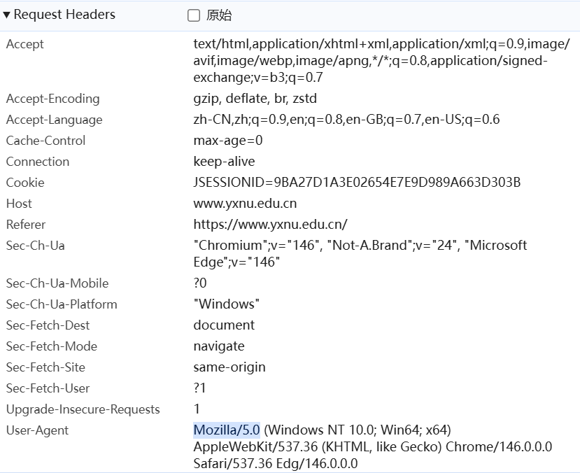
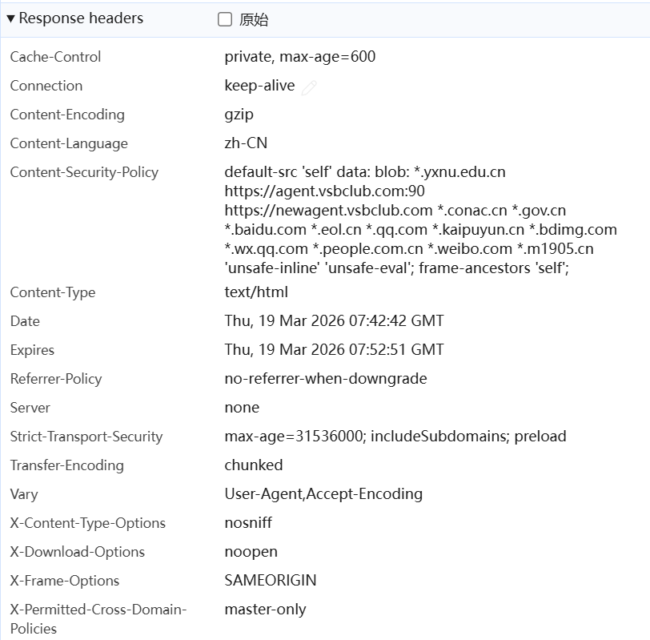

# Lab1：又见面了， HTTP/HTTPS！

## 实验背景

HTTP（HyperText Transfer Protocol，超文本传输协议）是应用层最核心的协议之一。每次打开网页，浏览器与服务器之间就在用 HTTP"对话"。

一次典型的 HTTP 交互分为两部分：

```
浏览器 ──── HTTP 请求 ────▶ 服务器
浏览器 ◀─── HTTP 响应 ──── 服务器
```

**请求报文**结构示例：

```http
GET /index.html HTTP/1.1
Host: www.example.com
User-Agent: Mozilla/5.0
Accept: text/html
```

**响应报文**结构示例：

```http
HTTP/1.1 200 OK
Content-Type: text/html
Content-Length: 1234

<html>...</html>
```

HTTPS 在 HTTP 基础上加入了 TLS 加密，报文内容在传输过程中无法被直接读取。但**浏览器开发者工具**运行在加密之前，可以看到完整的明文请求和响应，是分析 HTTP/HTTPS 协议最方便的入门工具。

---

## 实验任务

1. 用 Chrome 或 Edge 浏览器访问任意 **HTTPS** 站点，例如 `https://www.yxnu.edu.cn/`。
2. 按 `F12`（macOS 用 `Command + Option + I`）打开**开发者工具**，切换到 **Network（网络）** 面板。
3. 刷新页面，等待请求列表加载完成。
4. 点击列表中第一条请求（通常是页面本身），在右侧查看 **Headers** 标签页，找到 Request Headers 和 Response Headers。
5. 对请求头区域和响应头区域分别**截图**，并按规范命名（见下方截图要求）。
6. 根据截图，完成下方的知识填空。

> **提示**：开发者工具打开路径：浏览器右上角菜单 → 更多工具 → 开发者工具，或直接右键页面空白处 → 检查。

---

## 截图要求

- 截图须清晰显示开发者工具 Network 面板中的 **Headers** 区域，能看到具体字段名和值。
- 截图文件与本 `http.md` 放在**同一目录**下。
- 命名规范：

| 截图内容                       | 文件名                                 |
| :----------------------------- | :------------------------------------- |
| Request Headers（请求头）截图  | `req.png`    ( jpg 或 jpeg 格式也可以) |
| Response Headers（响应头）截图 | `resp.png`  ( jpg或 jpeg 格式也可以)   |

截图示例位置（填写时直接在下方嵌入）：

```markdown


```

---

## 知识填空

> 根据你的截图，填写以下空白处。不确定的字段请写"截图中未见"，**不得留空不填**。

### A. 请求头（Request Headers）

| 字段               | 你的截图中的值 |
| :----------------- | :------------- |
| 请求方法（Method） |        GET        |
| 请求路径（URI）    |         /info/1101/75183.htm       |
| 协议版本           |        HTTP/1.1        |
| Host               |         www.yxnu.edu.cn       |
| User-Agent         |        Mozilla/5.0        |

**嵌入截图：**


---

### B. 响应头（Response Headers）

| 字段                  | 你的截图中的值 |
| :-------------------- | :------------- |
| 状态码（Status Code） |        200 OK        |
| 状态描述              |        无        |
| Content-Type          |        text/html        |
| Server（若可见）      |        none        |

**嵌入截图：**


---

### C. 知识问答

1. HTTP 请求报文由哪几部分构成？请按顺序列出：

   > 答：请求行（Request Line）：包含请求方法、请求路径（URI）、协议版本，例如 GET / HTTP/1.1
         请求头（Request Headers）：多个键值对字段，用于传递客户端信息、缓存控制、认证等。
         空行：用于分隔请求头和请求体，必须存在
         请求体（Request Body）：可选部分，用于携带 POST/PUT 等方法提交的数据，GET 方法通常无请求体。

2. 状态码 `404` 代表什么含义？状态码 `500` 和 `503` 有什么区别？

   > 答：404 Not Found：服务器无法找到请求的资源，通常是路径错误或资源已被删除。
        500 Internal Server Error：服务器在处理请求时发生了未知错误，属于服务器端代码 / 配置异常。
        503 Service Unavailable：服务器当前无法处理请求（通常是过载、维护中或临时故障），属于临时不可用状态。

       区别：
          500 是服务器内部错误，问题出在代码或服务器配置；
          503 是服务暂时不可用，通常是负载或运维原因，理论上稍后可恢复。

3. GET 与 POST 方法的主要区别是什么？各适用于什么场景？

   > 答：数据传递方式：GET 将参数拼接在 URL 后，POST 将数据放在请求体中。
         数据长度限制：GET 受 URL 长度限制，POST 理论上无大小限制。
        缓存与历史：GET 请求会被浏览器缓存、保留在历史记录，POST 默认不缓存、不保留参数。
        安全性：GET 参数可见，安全性低；POST 参数不可见，相对更安全。
        幂等性：GET 是幂等的，多次请求结果一致；POST 非幂等，多次请求可能产生不同效果。
        编码类型：GET 仅支持 application/x-www-form-urlencoded，POST 支持多种编码格式。

        适用场景
           GET：用于查询、获取数据，如搜索、分页查询、获取详情等。
           POST：用于提交、修改数据，如登录、注册、上传文件、提交表单等。

4. HTTP 与 HTTPS 有什么区别？HTTPS 使用了什么机制来保护数据？

   > 答：端口：HTTP 默认 80 端口，HTTPS 默认 443 端口。
        数据传输：HTTP 明文传输，易被窃听、篡改；HTTPS 加密传输，数据不可直接读取。
        身份验证：HTTP 无身份验证，HTTPS 通过数字证书验证服务器身份。
        安全性：HTTP 安全性低，HTTPS 安全性高。
        SEO 与权重：搜索引擎通常优先收录 HTTPS 站点。

        HTTPS 安全机制HTTPS 并非新协议，而是HTTP + TLS/SSL 组合：非对称加密，对称加密，数字证书，消息摘要。

5. 既然 HTTPS 已经加密，为什么浏览器开发者工具仍然能看到请求和响应的明文内容？

   > 答：HTTPS 加密是浏览器与服务器之间的端到端加密，保护的是网络传输过程中的数据，防止第三方窃听。浏览器开发者工具是浏览器自身的功能，处于加密通道的客户端端点，在数据被加密发送前、解密接收后，工具可以直接获取明文内容，这并不违反 HTTPS 的加密机制。

---

## 提交要求

在自己的文件夹下新建 `Lab1/` 目录，提交以下文件：

```
学号姓名/
└── Lab1/
    ├── http.md     # 本文件（填写完整）
    ├── req.png       # HTTP 请求截图 (除 png 外，使用 jpg 或者 jpeg 格式也可以)
    └── resp.png      # HTTP 响应截图 (除 png 外，使用 jpg 或者 jpeg 格式也可以) 
```

---

## 截止时间

2026-3-26，届时关于 Lab1 的 PR 请求将不会被合并。

---

## 参考资料

- [HTTP - MDN Web Docs](https://developer.mozilla.org/zh-CN/docs/Web/HTTP)
- [HTTP 状态码列表 - MDN](https://developer.mozilla.org/zh-CN/docs/Web/HTTP/Status)

