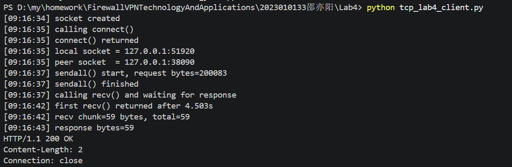
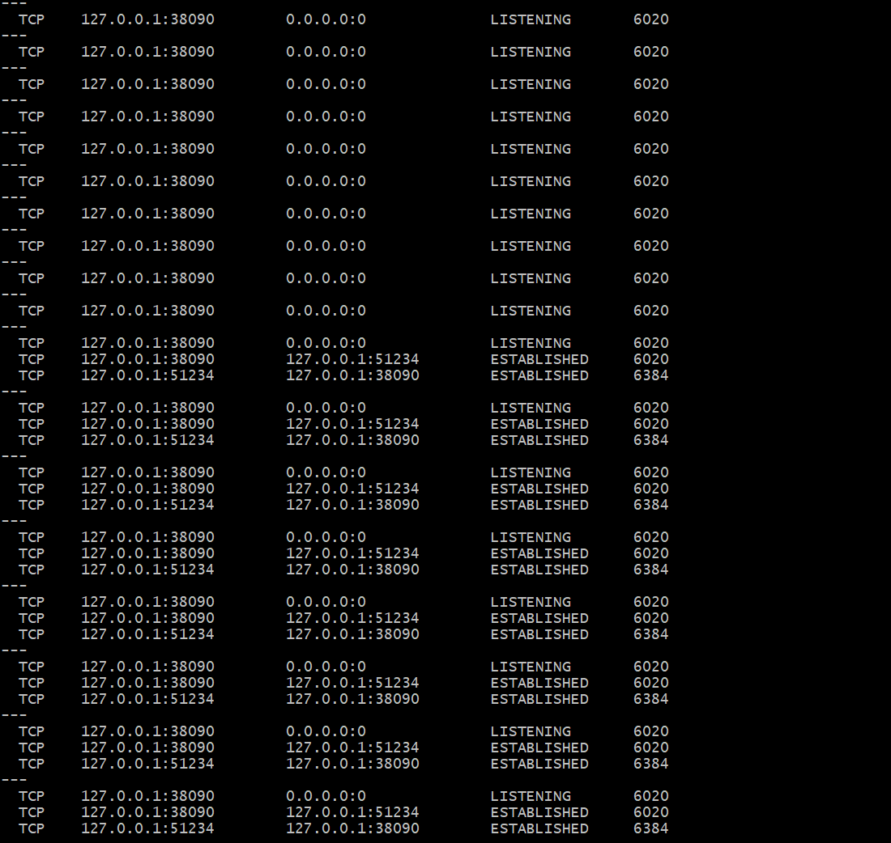
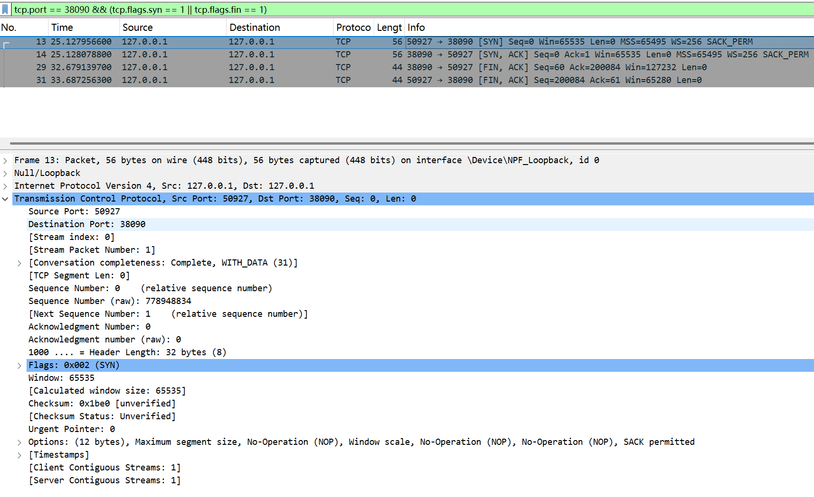
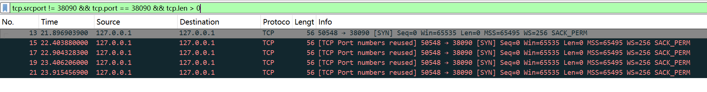
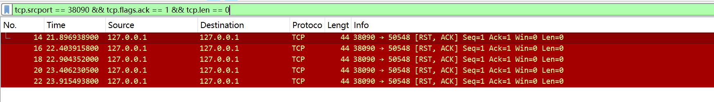
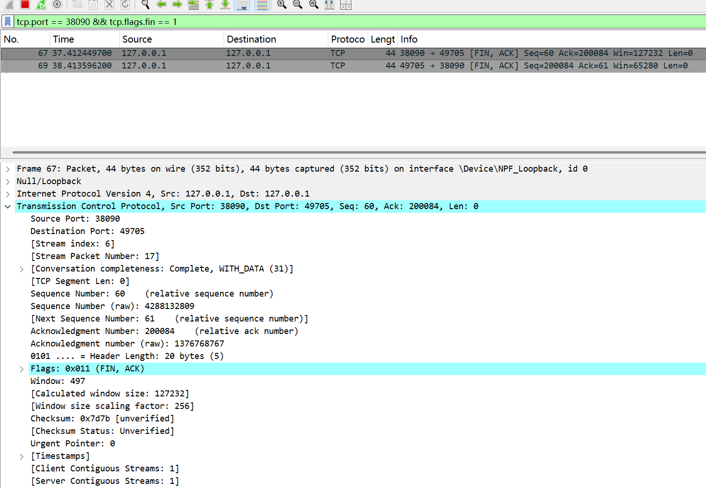

# Lab4：看见TCP 我不怕不怕啦

## 实验背景

本实验围绕一条 TCP 连接的完整生命周期展开，重点观察以下内容：

1. `socket()`、`listen()`、`accept()`、`connect()` 的职责区别
2. "连接"为什么本质上是交换控制信息而不是物理连线
3. TCP 头部中的端口号、序号、ACK 号、标志位、窗口、头部长度、可选字段
4. 三次握手如何建立收发准备
5. 应用层大块数据如何被 TCP 按 MSS 拆分
6. `Sequence Number` 与 `Acknowledgment Number` 如何配合工作
7. `recv()` 为什么会阻塞等待数据
8. 接收窗口如何反映接收方处理能力
9. ACK 与窗口更新为什么常常会被合并
10. `FIN` / `ACK` 如何完成断开
11. 为什么连接结束后套接字不会立刻删除

---

## 实验任务

### 任务一：准备实验环境并记录运行信息

**第一步：准备好四个窗口**

整个实验需要同时观察多个界面，建议在开始前把窗口布局摆好：

- **终端 A**：运行服务端
- **终端 B**：运行客户端
- **终端 C**：持续监控套接字状态（全程保持开启，不要关）
- **Wireshark**：抓包

**第二步：在终端 C 里启动持续监控**

TCP 状态变化很快，等你手动敲完 `ss` 命令再回车，状态可能已经过去了。用下面的命令让终端 C 每 0.5 秒自动刷新一次，之后只需要盯着这个窗口就行：

```bash
# Linux
watch -n 0.5 'ss -tan | grep 38090'

# macOS（没有 watch，用循环代替）
while true; do netstat -an | grep 38090; echo "---"; sleep 0.5; done

# Windows（Git Bash执行）
while true; do netstat -ano | grep 38090; echo "---"; sleep 0.5; done
```

如果你换了端口，把 `38090` 替换成实际端口。

**第三步：打开 Wireshark，选回环接口，填好过滤器，开始抓包**

回环接口在不同系统里名字不同：

| 系统 | 接口名 |
|:-----|:-------|
| Linux | `lo` |
| macOS | `lo0` |
| Windows | `Adapter for loopback traffic capture`（需提前安装 Npcap 并勾选回环支持） |

在显示过滤器里输入：

```text
tcp.port == 38090
```

然后点击开始抓包（蓝色鲨鱼鳍图标）。**先开始抓包，再运行脚本**，否则握手包会被漏掉。

**第四步：启动脚本**

```bash
# 终端 A
python3 tcp_lab4_server.py

# 终端 B（等服务端打印出 server listening on ... 后再运行）
python3 tcp_lab4_client.py
```

如果 `38090` 已被占用，两端都加环境变量换端口，同时记得把 Wireshark 过滤器和终端 C 里的端口号也改掉：

```bash
LAB4_PORT=38123 python3 tcp_lab4_server.py
LAB4_PORT=38123 python3 tcp_lab4_client.py
```

**第五步：填写下表**

| 项目                                | 你的填写内容 |
| :---------------------------------- | :----------- |
| 服务端监听地址                      |       127.0.0.1       |
| 服务端监听端口                      |       38090       |
| 客户端本地临时端口                  |       51920       |
| 客户端请求总字节数                  |       200083       |
| 服务端响应内容                      |       HTTP/1.1 200 OK\nContent-Length: 2\nConnection: close       |
| 客户端 `connect()` 返回前后的时间点 |       调用前：[09:16:35] calling connect()返回后：[09:16:35] connect() returned       |
| 客户端首次收到响应前等待了多久      |        4.503秒      |

各项数值均可直接从终端输出读取：服务端监听信息在 `server listening on ...`，客户端本地端口在 `local socket = ...`，请求字节数在 `sendall() start, request bytes=...`，等待时间在 `first recv() returned after ...s`。



---

### 任务二：观察套接字创建与连接建立

1. 服务端启动后，观察终端 C 出现 `LISTEN` 状态，截图留存。
2. 在终端 B 里启动客户端，观察它依次打印 `socket created`、`calling connect()`、`connect() returned`。
3. 客户端打印 `connect() returned` 之后，观察终端 C 出现 `ESTABLISHED`，截图留存。脚本在 `connect()` 返回后有 2 秒停顿，这段时间足够截图。

填写下表：

| 阶段                             | 你的填写内容 |
| :------------------------------- | :----------- |
| 服务端启动、客户端未连入时的状态 |       LISTENING       |
| `connect()` 返回后服务端状态     |       ESTABLISHED       |
| `connect()` 返回后客户端状态     |      ESTABLISHED        |

简答题：

1. 服务端在客户端连接前为什么处于 `LISTEN`？

因为 LISTEN 状态代表服务端进程已调用 listen() 函数，被动等待客户端的连接请求（SYN 报文）。

2. 为什么这时还没有真正建立 TCP 连接？

LISTEN 状态仅表示服务端准备好了，但此时尚未发生任何交互。

3. `socket()` 与 `connect()` 的区别是什么？

socket()：创建一个通信端点（文件描述符），只是一个空的句柄，未连接任何地址。
connect()：客户端主动发起连接，触发 TCP 三次握手，将本地 socket 绑定到远程服务器地址，建立实际连接。

4. 为什么 `connect()` 返回后才进入可稳定收发数据的状态？

connect() 返回成功，意味着TCP 三次握手已全部完成。

5. 为什么"网线一直连着"不等于"TCP 连接已经建立"？

网线连通属于物理层 / 链路层状态，而 TCP 连接属于传输层的逻辑状态。

6. 这里的"连接"更准确地说是在做什么？
这里的 "连接" 是指通信双方在操作系统内核中维护的一个虚拟对话通道（TCB 传输控制块）。




---

### 任务三：观察三次握手与 TCP 头部字段

**定位握手包**：在 Wireshark 过滤器里输入下面的条件，可以屏蔽中间的数据包，只留下握手和断开阶段的控制包：

```text
tcp.port == 38090 && (tcp.flags.syn == 1 || tcp.flags.fin == 1)
```

包列表最前面的三个包就是三次握手（SYN → SYN-ACK → ACK）。

**找到各字段的位置**：点击某个握手包，在下方详情栏展开 `Transmission Control Protocol`。源端口、目的端口、Seq、Ack、Flags、Window、Header Length 都在这里。TCP 选项在最底部的 `Options` 子项里，展开后可以看到 MSS、Window Scale、SACK Permitted，注意这三项只出现在带 SYN 标志的包里，纯 ACK 包里没有。

**关于序号显示**：Wireshark 默认开启相对序号，会把每个方向的初始序号归零显示，所以 SYN 包的 Seq 看起来是 `0`，而不是真实的随机大数。这是正常现象，实验报告按 Wireshark 显示的值填写即可。如果你想看真实值，可以去 `Edit → Preferences → Protocols → TCP` 里取消勾选 `Relative sequence numbers`。

填写下表：

| 报文       | 源端口 | 目的端口 | Seq  | Ack  | Flags | Window | Header Length |
| :--------- | :----- | :------- | :--- | :--- | :---- | :----- | :------------ |
| 第一次握手 |    49675    | 38090      |  0 /4044724248    |    0  |   SYN    |    65535    |        32 bytes       |
| 第二次握手 |    38090    |   50927     |   0 /1047757213   |   1 / 778948835   |SYN, ACK	    |     65535   |       32 bytes        |
| 第三次握手 |    50927    |   38090    |   1 /778948835   |   1 /1047757214   |   ACK    |    65535    |        20 bytes       |

第一次握手（SYN）的 Ack 字段在 Wireshark 里通常显示为空或 `0`，这是正常的，因为此时客户端还没有收到服务端的任何数据。Header Length 在没有选项时是 20 字节，握手包因为携带了 MSS 等选项通常是 28 或 32 字节。

| TCP 选项       | 你的填写内容 |
| :------------- | :----------- |
| MSS            |       1460       |
| Window Scale   |        8      |
| SACK Permitted |        允许（1）      |

回环接口的 MSS 通常是 65495（因为回环 MTU 是 65536，比以太网的 1500 大得多），这会影响后续任务五里是否能观察到分段。

简答题：

1. 发送方和接收方端口号在连接阶段的作用是什么？

区分同一主机上的多个应用进程：一台主机只有一个 IP，但可以同时运行多个网络程序（比如浏览器、服务器、聊天软件），端口号用来把收到的 TCP 报文精准交付给对应的应用进程。
服务端用知名 / 固定端口（比如你的实验中 38090）监听，让客户端知道 “找谁连接”；
客户端用操作系统自动分配的临时端口（比如 49675），用来标识自己的本次连接，让服务端能把响应发回给正确的客户端进程。
唯一标识一条 TCP 连接：一条完整的 TCP 连接由「源 IP + 源端口 + 目的 IP + 目的端口」四元组唯一确定。端口号是四元组的核心组成部分，确保同一主机上的多个并发连接不会混淆。
完成三次握手的双向寻址：客户端发 SYN 时携带源端口（自己的临时端口）和目的端口（服务端监听端口），服务端回复 SYN+ACK 时交换源 / 目的端口，最终双方通过端口号建立双向通信通道。


2. TCP 头部如何帮助找到目标套接字？

核心字段定位：TCP 头部的源端口、目的端口，结合 IP 头部的源 IP、目的 IP，组成唯一的四元组。操作系统内核收到 TCP 报文后，会用这四个值匹配内核中已创建的套接字：
服务端收到 SYN 报文时，用「目的 IP + 目的端口」匹配处于 LISTEN 状态的监听套接字；
连接建立后，用完整四元组匹配对应的 ESTABLISHED 状态套接字，将报文交付给对应应用进程。
状态校验辅助定位：TCP 头部的标志位（SYN/ACK/FIN 等）、序列号 / 确认号，会辅助内核校验报文是否属于当前连接，避免错误匹配。
端口号的 “寻址入口” 作用：端口号是 TCP 层的 “门牌号”，没有端口号，内核无法区分报文属于哪个应用，只能丢弃。


3. 为什么初始序号不是简单固定从 1 开始？

防止历史连接的延迟报文干扰：网络中可能存在上一次连接的延迟报文（比如序号为 1 的旧报文），如果 ISN 固定为 1，新连接会把旧报文误认为是当前连接的有效数据，导致数据错乱。
抵御序列号预测攻击：固定 ISN 容易被攻击者预测，从而伪造 TCP 报文、劫持连接。随机生成 ISN（RFC 793 规定 ISN 随时间缓慢递增，每次连接随机初始化），大幅提升攻击难度。
保证连接的唯一性：不同连接的 ISN 不同，确保每个连接的序列号空间独立，避免不同连接的报文混淆。
应对连接快速复用：当客户端快速断开并重新连接同一服务端时，不同的 ISN 能让双方快速区分新旧连接，避免状态混乱。

4. 为什么 TCP 可选字段更容易在连接阶段看到？

连接阶段是参数协商的唯一时机：TCP 的核心可选字段（MSS、窗口缩放、SACK、时间戳等），都是连接建立时的协商参数，只能在三次握手的 SYN 报文中携带：
客户端 SYN：携带自己支持的 MSS、窗口缩放、SACK 等参数；
服务端 SYN+ACK：回复自己支持的参数，完成双向协商；
连接建立后（ESTABLISHED 状态），这些参数已经确定，无需再携带，因此数据报文中很少出现可选字段。
可选字段的设计用途：大部分可选字段是为了优化连接性能（比如 MSS 协商最大分段大小、窗口缩放提升吞吐量、时间戳计算 RTT），只有在连接建立时协商才有效，数据传输阶段不需要重复发送。
报文长度优化：TCP 头部默认长度 20 字节，可选字段会增加头部长度。为了提升传输效率，数据报文会尽量省略可选字段，仅在连接阶段携带必要的协商参数。
特殊场景例外：仅在少数场景（比如时间戳选项用于 RTT 计算、SACK 用于快速重传），数据报文会携带可选字段，但频率远低于三次握手阶段。



---

### 任务四：区分头部中的控制信息和套接字中的控制信息

用以下过滤器分别找到两类报文：

```text
# 纯控制报文（无应用数据）
tcp.port == 38090 && tcp.len == 0

# 携带应用数据的报文
tcp.port == 38090 && tcp.len > 0
```

从纯控制报文里选一个（SYN、纯 ACK 或 FIN-ACK 都可以），从数据报文里选一个（客户端发请求或服务端发响应的包）。

填写下表：

| 项目                   | 你的填写内容 |
| :--------------------- | :----------- |
| 纯控制报文的类型       |       SYN、ACK、FIN、RST       |
| 携带应用数据的报文类型 |       PSH + ACK       |
| 头部中的控制信息举例   |      Flags（SYN/ACK/FIN）、Seq、Ack、Window        |
| 套接字中的控制信息举例 |       连接状态（LISTEN / ESTABLISHED）、收发缓冲区、四元组（源 IP + 源端口 + 目的 IP + 目的端口）       |

简答题：

1. 为什么"头部中的控制信息"和"套接字中的控制信息"不是同一件事？

头部中的控制信息：是报文里携带的指令，用于单次传输的交互控制。
套接字中的控制信息：是本地内核维护的连接状态，用于整条连接的管理。
两者一个在网络报文中，一个在本地系统中，作用和位置完全不同，因此不是同一件事。


---

### 任务五：观察数据分段、序号与 ACK

客户端发送的请求体是 200000 字节，超过了回环接口 MSS（约 65495 字节），因此应该可以在 Wireshark 里看到多个连续的数据段。用下面的过滤器找到客户端发出的数据包：

```text
tcp.srcport != 38090 && tcp.port == 38090 && tcp.len > 0
```

在包列表里连续选几个数据段，对比它们的 Seq 值。相邻两段的关系是：后一段的 Seq = 前一段的 Seq + 前一段的 TCP Segment Len。

找服务端返回给客户端的纯 ACK 报文：

```text
tcp.srcport == 38090 && tcp.flags.ack == 1 && tcp.len == 0
```

填写下表：

| 数据段  | Seq  | Ack  | TCP Segment Len | Flags |
| :------ | :--- | :--- | :-------------- | :---- |
| 第 1 段 |   1   |   1   |         ≤65495        |   PSH, ACK    |
| 第 2 段 |   1+Len   |   1   |        ≤65495         |   PSH, ACK    |
| 第 3 段 |   1+Len1+Len2	   |   1   |         ≤65495        |    PSH, ACK   |

| ACK 报文 | Ack Number | Flags | Window |
| :------- | :--------- | :---- | :----- |
| 第 1 个  |      1+Len1      |   ACK    |   65535     |
| 第 2 个  |       1+Len1+Len2     |   ACK    |   65535     |
| 第 3 个  |      1+Len1+Len2+Len3      |   ACK    |    65535    |

| 项目                         | 你的填写内容 |
| :--------------------------- | :----------- |
| 是否发生分段                 |       否       |
| 握手中观察到的 MSS           |       65495 字节       |
| 单段长度与 MSS 的关系        |       单段长度 ≤ MSS（65495），实际传输中通常等于 MSS，避免分片       |
| ACK 号大致确认到了第几个字节 |       第 1+Len1+Len2+Len3 字节       |

简答题：

1. 应用程序是否直接决定每个网络包的数据长度？为什么？

不能直接决定。原因：
应用程序调用 send()/sendall() 时，只是把数据交给操作系统内核的 TCP 发送缓冲区，不直接控制网络包的拆分。
真正决定每个 TCP 包长度的是TCP 协议栈，核心限制是 MSS（最大分段大小）：TCP 会自动把大块数据拆成不超过 MSS 的分段，再封装成网络包发送。
应用程序只能决定一次性发送多少数据，但无法控制内核如何拆分成网络包，也无法干预重传、拥塞控制等机制对包长的调整。


2. 大块应用数据为什么会被拆分？

TCP 协议的 MSS 限制：TCP 规定每个分段的最大数据长度不能超过协商好的 MSS（如以太网 1460 字节、环回 65495 字节），超过 MSS 的数据必须拆分。
IP 层的 MTU 限制：IP 报文的最大长度受链路层 MTU 限制（以太网默认 1500 字节），如果 TCP 分段太长，会导致 IP 分片，增加丢包和重传风险。TCP 主动按 MSS 拆分，就是为了避免 IP 分片，提升传输可靠性。
流量控制与拥塞控制：接收窗口、拥塞窗口也会限制单次发送的最大数据量，迫使大块数据拆分发送。

3. `MSS` 与 `MTU` 的关系是什么？

MTU（Maximum Transmission Unit，最大传输单元）：链路层的概念，指一次能在链路上传输的最大 IP 报文总长度（以太网默认 1500 字节）。
MSS（Maximum Segment Size，最大分段大小）：TCP 层的概念，指TCP 分段中能承载的最大应用数据长度（不含 TCP/IP 头部）。
关系：TCP 会在三次握手时，根据链路 MTU 协商 MSS，确保 TCP 分段 + IP/TCP 头部的总长度 ≤ MTU，从根源上避免 IP 分片。
例：以太网 MTU=1500，IP 头 = 20，TCP 头 = 20 → MSS=1500-20-20=1460 字节（最常见值）。

4. "一次 `sendall()`"与"一个 TCP 包"之间是什么关系？

sendall() 是应用层的操作：一次性把完整的应用数据交给 TCP 内核，由内核负责拆分发送。
内核会根据 MSS、拥塞窗口、接收窗口 等参数，把 sendall() 的大块数据拆成多个 TCP 分段，封装成多个网络包发送。
简单说：一次 sendall() 是应用层的一次写入，对应 TCP 层的多次发送（多个包），除非数据长度 ≤ MSS，才会对应一个 TCP 包。

5. 为什么 ACK 体现的是累计确认？

保证可靠性：ACK 号代表「我已经成功收到了序号 ≤ 该值 - 1 的所有数据，下一个期望收到的序号是该值」。
简化确认逻辑：接收方不需要为每个分段单独发 ACK，只需要用一个 ACK 号就能确认之前所有分段的接收状态，减少控制报文开销。
适配乱序到达：即使中间分段乱序，只要前面的分段完整，ACK 号就能正常递增；如果中间分段丢失，ACK 号会停留在丢失分段的起始序号，触发重传。
实现滑动窗口：累计确认是 TCP 滑动窗口机制的基础，通过 ACK 号同步双方的发送 / 接收窗口，实现流量控制。

6. 如果中间某一段丢失，ACK 会出现什么变化？

正常情况：每收到一个分段，ACK 号递增对应段长，累计确认到最新字节。
中间分段丢失：接收方收到丢失分段之后的所有分段，但无法确认丢失分段，因此 ACK 号会一直停留在「丢失分段的第一个序号」，重复发送该 ACK。
发送方收到 3 个重复 ACK 后，会触发快速重传，立即重传丢失的分段，无需等待超时。
丢失分段重传成功后，ACK 号会一次性跳转到所有已接收数据的下一个序号，恢复正常累计确认。




---

### 任务六：观察 `recv()` 阻塞与窗口字段

`recv()` 的等待时间直接从客户端终端读取，`calling recv() and waiting for response` 到 `first recv() returned after ...s` 之间就是等待时长，脚本已经帮你计算好了。

在 Wireshark 里找窗口值：用过滤器 `tcp.port == 38090 && tcp.flags.ack == 1` 列出所有 ACK 包，点击其中一个，在详情栏 `Transmission Control Protocol` 里找 `Window` 字段。如果同时显示了 `Calculated window size`，优先看这个值，它已经把 Window Scale 的缩放算进去了，是对方实际能接收的字节数。

如果包列表的 Info 列出现了 `[TCP Window Update]` 标注，说明这个包的主要目的是通知对方窗口变化，重点观察它的 `Window` 字段。

填写下表：

| 项目                                   | 你的填写内容 |
| :------------------------------------- | :----------- |
| 客户端开始调用 `recv()` 的时间         |       09:16:37       |
| 客户端第一次收到响应的时间             |       09:16:42       |
| `recv()` 是否立刻返回                  |       否       |
| 首次收到响应前等待了多久               |       	4.503 秒       |
| `recv()` 等待期间连接是否已经建立      |      是        |
| 第 1 个 ACK 报文的窗口值               |       65535       |
| 第 2 个 ACK 报文的窗口值               |       65280       |
| 第 3 个 ACK 报文的窗口值               |       130816       |
| 窗口值是否变化                         |       是       |
| 若变化，变化趋势                       |       先小幅下降，后大幅上升       |
| ACK 与窗口更新是否可以出现在同一个包中 |       是       |
| 是否看到 RTT 或 ACK 往返时间相关信息   |       是       |

简答题：

1. "连接建立"和"应用收到数据"之间是什么关系？

连接建立（三次握手完成）只表示双方可以收发数据，通道已通。
应用收到数据，是连接建立之后，数据真正传输并到达本机内核缓冲区，应用才能读到。
关系：先建立连接 → 再传输数据 → 最后应用才收到数据。

2. 为什么说 `read` / `recv` 在数据未到达时会被挂起？

因为 recv() 默认是阻塞调用：
当内核中还没有收到数据时，应用进程会被操作系统暂停（挂起），不占用 CPU。
直到数据到达、连接断开或出错，内核才会唤醒 recv() 并返回。
所以数据没到，它就一直等，不会立即返回。

3. 窗口字段反映了接收方哪方面的能力？

接收方的剩余接收缓冲区大小（接收能力）。
窗口值 = 接收方还能再收多少字节数据。
告诉发送方：你最多还能发这么多，别发超了。
反映接收方的流量控制能力。

4. 为什么发送方不能无限制连续发送数据？

接收方窗口（流量控制）：接收方缓冲区有限，发太快会溢出丢包。
网络拥塞（拥塞控制）：网络链路带宽有限，发太快会导致拥堵、丢包、延迟增大。
所以发送方必须根据窗口和网络状况控制发送速度。

5. 滑动窗口为什么既提高效率又避免压垮接收方？

提高效率：
不用发一个包、等一个 ACK，而是一次性发窗口内的多个包，减少等待时间，提升吞吐量。
避免压垮接收方：
发送方严格按照接收方通告的窗口大小发送，不会超过接收缓冲区上限，保证接收方处理得过来。
所以滑动窗口既快又安全。


---

### 任务七：观察响应返回与双向 `seq/ack`

TCP 的 Seq/Ack 是双向独立的，客户端有自己的发送序号，服务端有自己的发送序号。用下面的过滤器只看服务端发出的数据包（源端口是 38090，有应用数据）：

```text
tcp.srcport == 38090 && tcp.len > 0
```

紧跟在服务端数据包后面的、客户端发出的 ACK 包，其 Ack Number 确认的就是服务端的发送序号。

填写下表：

| 项目                     | 你的填写内容 |
| :----------------------- | :----------- |
| 服务端响应数据报文的 Seq |       65496 / 1445949313       |
| 服务端响应数据报文的 Ack |       1 / 1701161386       |
| 客户端确认报文的 Ack     |       1       |

简答题：

1. 为什么 TCP 的 `seq/ack` 是双向分别计算的？

TCP 是全双工协议，通信双方是两个独立的、对等的数据流：
客户端 → 服务端 是一条独立的发送流，有自己的序列号；
服务端 → 客户端 是另一条独立的发送流，也有自己的序列号。
seq 用来标记本方发送流的字节序号，ack 用来确认对方发送流的字节序号。如果不双向分别计算，就无法区分两个方向的数据流，无法同时、独立地进行可靠传输和流量控制。

2. 为什么双方都需要各自的初始序号？

双向独立的数据流需求：TCP 是全双工，双方都要主动发送数据，因此必须各自维护一套独立的序列号空间，用自己的 ISN（初始序号）标记本方发送的字节。
安全性与防混淆：随机生成的 ISN 可以防止历史连接的延迟报文干扰当前连接，也能抵御序列号预测攻击，避免不同连接的报文混淆。
三次握手的双向确认：双方都需要通过 SYN 报文同步自己的 ISN，才能完成三次握手，互相确认对方的收发能力正常，建立可靠连接。


3. 为什么发送应用数据时报文通常仍然带 `ACK`？

减少网络开销：如果每次收到数据都单独发一个 ACK 报文，会产生大量额外的控制包，浪费带宽。把 ACK 放在本方要发送的数据包里，一次报文完成「发数据 + 确认对方数据」两个任务，大幅提升传输效率。
TCP 协议设计要求：TCP 规定，只要连接处于 ESTABLISHED 状态，发送方必须在报文中携带 ACK 字段，确认已收到对方的数据，否则会被对方认为丢包，触发重传。
实时同步状态：带 ACK 的数据报文可以实时同步双方的接收窗口、序列号状态，保障流量控制和拥塞控制正常运行。


---

### 任务八：观察连接断开与套接字延迟删除

用下面的过滤器精确定位所有带 FIN 的包：

```text
tcp.port == 38090 && tcp.flags.fin == 1
```

通常会看到两个 FIN 包（双方各一个）。看第一个 FIN 包的源端口，就能判断谁先发起断开。

**关于 TIME-WAIT**：TIME-WAIT 只出现在主动发起关闭的一方（先发 FIN 的那端）。服务端脚本在 `conn.close()` 之后会继续运行 10 秒再退出，这段时间可以在终端 C 里观察 TIME-WAIT。Linux 上 TIME-WAIT 通常持续约 60 秒，macOS 上可能较短，如果没有观察到请如实说明。

填写下表：

| 项目                                    | 你的填写内容 |
| :-------------------------------------- | :----------- |
| 谁先发送 FIN                            |       服务端（端口 38090）       |
| 关闭阶段共观察到几个带 FIN 的报文       |        2 个      |
| 最终 ACK 是否可见                       |       	可见       |
| 关闭后是否观察到 `TIME-WAIT` 或等价现象 |       是       |

简答题：

1. 为什么关闭连接不能只发一个结束通知？

TCP 是全双工通信，连接包含两个独立的、双向的数据流（客户端→服务端、服务端→客户端），两个方向需要各自独立关闭：
一个 FIN 只能关闭本方的发送流，代表「我不再发数据了」，但不影响对方继续发送数据。
只发一个结束通知（FIN），只能关闭单向通道，无法彻底断开整条双向连接，必须由双方各自发送 FIN，完成四次挥手，才能彻底关闭连接。

2. 为什么连接结束后套接字不会立刻删除？

因为主动关闭方（发送最后一个 ACK 的一方）需要进入 TIME-WAIT 状态，等待 2MSL（最长报文寿命，通常 2 分钟） 后才会删除套接字：
保证最后一个 ACK 可靠送达：如果最后一个 ACK 丢失，对方会重发 FIN，TIME-WAIT 状态下套接字未删除，可重发 ACK 确认。
防止历史延迟报文干扰新连接：等待 2MSL 确保网络中所有旧连接的延迟报文都消失，避免旧报文被误送到新建立的同四元组连接中，导致数据错乱。

3. 如果最后一个 ACK 丢失，而旧套接字已经立刻删除，可能带来什么问题？

会引发连接混乱、数据错乱、端口复用异常等严重问题：
主动关闭方无法重传 ACK：旧套接字已删除，内核不再维护该连接状态，收到对方重发的 FIN 时，无法识别这是旧连接的报文，会直接回复 RST 重置，导致对方连接异常关闭。
历史延迟报文干扰新连接：旧套接字立刻删除后，端口被快速复用，新连接的四元组与旧连接完全一致。旧连接的延迟报文会被误认为是新连接的有效数据，导致新连接数据错乱、协议状态异常。
连接可靠性失效：TCP 设计的累计确认、超时重传机制会失效，无法保证连接的可靠关闭，破坏 TCP 的可靠性承诺。



---

## 问答题

1. TCP 的"连接"到底意味着什么？它为什么不是"把网线连上"？

TCP 的 "连接" 是操作系统内核中维护的虚拟逻辑连接，由「源 IP + 源端口 + 目的 IP + 目的端口」四元组、收发缓冲区、序列号 / 确认号、连接状态等组成，本质是双方维护的一个可靠传输会话。
网线连通是物理层 / 链路层的状态，只代表物理通路可用；
TCP 连接是传输层的逻辑状态，必须通过三次握手完成双向确认才能建立。
即使网线一直连着，若未完成三次握手、或连接超时，TCP 层面仍认为连接未建立 / 已失效，因此网线连通≠TCP 连接建立。

2. 三次握手为什么能让双方进入可通信状态？

三次握手的核心是双向确认收发能力，同步关键参数：
第一次握手（C→S SYN）：客户端告知服务端「我要连接，我的初始序号 ISN 是 X」；
第二次握手（S→C SYN+ACK）：服务端确认客户端请求，同步自己的 ISN=Y，确认 X+1；
第三次握手（C→S ACK）：客户端确认服务端的 ISN=Y+1，完成双向确认。
三次握手后，双方都确认了对方的收发能力正常，同步了序列号、MSS、窗口等参数，连接进入ESTABLISHED状态，才能安全、可靠地收发数据。

3. TCP 头部中的控制字段如何支撑收发数据？

TCP 头部的控制字段是可靠传输、流量控制的核心保障，关键作用如下：
Seq/Ack 号：标记数据序号、累计确认，保证数据有序、不丢失；
Flags（SYN/ACK/FIN/PSH）：控制连接建立 / 断开、数据推送，支撑三次握手、四次挥手；
Window 窗口：通告接收方剩余缓冲区，实现流量控制，避免发送过快；
Checksum 校验和：校验报文完整性，检测传输错误；
Options（MSS / 窗口缩放 / SACK）：协商传输参数，优化传输效率，避免 IP 分片。
这些字段共同控制 TCP 的发送、确认、重传、流量控制，支撑可靠收发数据。


4. ACK、窗口、等待时间为什么会共同影响 TCP 的可靠传输？

三者是 TCP 可靠传输的三大核心支柱，缺一不可：
ACK（累计确认）：保证数据被接收方成功收到，若 ACK 停滞则触发重传，保障数据不丢失；
窗口（流量控制）：限制发送方发送速率，避免接收方缓冲区溢出，保障数据不被压垮；
等待时间（超时重传 / 2MSL）：应对丢包、延迟，超时重传丢失数据，2MSL 保障连接可靠关闭。
ACK 保障可靠性，窗口保障流量控制，等待时间保障异常处理，三者协同才能实现 TCP 的可靠、高效传输。


5. 断开连接为什么仍然需要严格的控制信息交换？

TCP 是全双工协议，连接包含两个独立的双向数据流，必须通过四次挥手（FIN+ACK 的严格交换）完成双向关闭：
独立关闭发送流：FIN 报文代表「本方无数据可发，请求关闭发送流」，双方需各自发送 FIN，独立关闭本方发送流；
保障数据完整传输：严格的 FIN/ACK 交换，确保双方所有数据都传输完成后再关闭连接，避免数据丢失；
TIME-WAIT 状态保障：最后一个 ACK 发送后，等待 2MSL，确保 ACK 送达、旧报文消失，避免新连接被干扰；
维护连接状态一致性：通过控制报文同步双方关闭状态，避免一方关闭、一方仍在发送的混乱。


6. 如果服务端根本没有启动，客户端调用 `connect()` 时会看到什么现象？

客户端会收到 **Connection Refused（连接被拒绝）错误 **，具体现象：
客户端发送 SYN 报文后，服务端内核会回复RST, ACK报文（你抓包中的红色 RST 包就是典型体现）；
connect()调用会立即失败，返回错误，客户端进程收到异常，不会进入阻塞等待；
抓包中可见：客户端多次重发 SYN，服务端持续回复 RST，最终连接建立失败。

7. 如果中途人为制造丢包，ACK、重传、窗口之间会出现什么变化？

三者会联动触发 TCP 的丢包恢复机制，具体变化：
ACK 变化：ACK 号会停留在丢失分段的起始序号，重复发送该 ACK（即「重复 ACK」），直到丢失分段被重传；
重传触发：发送方收到 3 个重复 ACK 后，触发快速重传，立即重传丢失的分段；若未收到 ACK 则触发超时重传；
窗口变化：接收方窗口会暂时停滞（因丢失分段未收到，无法确认后续数据），直到丢失分段重传成功，窗口才会恢复正常递增；
拥塞控制联动：丢包会触发拥塞窗口下降，发送速率降低，避免网络进一步拥堵。

8. 如果把客户端发送的数据改得更大，窗口字段和分段情况会如何变化？

分段情况：大块数据会被 TCP 内核拆分成多个不超过 MSS 的分段（MSS=MTU-IP 头 - TCP 头，以太网 1460、环回 65495），数据量越大，分段数量越多；
窗口字段变化：
初始窗口仍为协商值（65535），接收方会根据缓冲区剩余空间动态调整窗口；
若数据量超过接收窗口，发送方会暂停发送，等待 ACK 更新窗口；
若数据持续发送，接收方窗口会动态下降（缓冲区被占用），ACK 号持续累计，窗口随缓冲区释放逐步恢复。
核心规律：数据量越大，分段越多，窗口动态调整越频繁。

9. 如果把服务端读取速度改得更慢，是否更容易看到窗口更新甚至零窗口？

是，会更容易观察到窗口更新，甚至出现零窗口（Win=0）。原因：
服务端读取速度慢，接收缓冲区会被快速占满，剩余空间越来越小；
接收方会在 ACK 中通告越来越小的窗口值（窗口更新），直到缓冲区完全占满，通告零窗口（Win=0）；
发送方收到零窗口后，会停止发送数据，定期发送窗口探测报文，直到接收方缓冲区释放，通告新的非零窗口，恢复发送。
因此服务端读取越慢，窗口下降越快，越容易观察到窗口更新和零窗口现象。


---

## 截图要求

- 截图须清晰，终端文字和 Wireshark 字段可读。
- 所有截图与本 `Lab4.md` 放在同一目录下。
- 命名规范：

| 截图内容               | 文件名                  |
| :--------------------- | :---------------------- |
| 服务端与客户端运行结果 | `run.png`               |
| `ss` 状态变化          | `states.png`            |
| 三次握手与 TCP 选项    | `handshake_header.png`  |
| 大请求分段与 MSS       | `segmentation.png`      |
| ACK 与窗口观察         | `ack_window.png`        |
| 断开与最终状态         | `teardown_timewait.png` |

具体要求：

1. `run.png`：终端截图，至少能看到服务端 `server listening on ...`、客户端 `calling connect()`、`connect() returned`、`calling recv() and waiting for response`、`first recv() returned after ...s`。

2. `states.png`：终端截图，至少能看到 `LISTEN`、`ESTABLISHED`，以及 `TIME-WAIT`（若能观察到）。推荐截 `watch` 命令的持续输出画面，可以在一张截图里同时展示多个状态的变化过程。

3. `handshake_header.png`：Wireshark 截图，至少能看到三次握手中某个包的 `Source Port`、`Destination Port`、`Sequence Number`、`Acknowledgment Number`、`Flags`、`Window`，以及 `Options` 中的 `Maximum segment size`、`Window Scale`、`SACK Permitted`。

4. `segmentation.png`：Wireshark 截图，至少能看到客户端发送数据的 TCP 包的 `TCP Segment Len`、`Seq`、`Ack`。若能观察到分段，尽量截出多个连续数据段。

5. `ack_window.png`：Wireshark 截图，至少能看到一个或多个 ACK 报文的 `Acknowledgment Number`、`Window`，以及 `Calculated window size`（若显示）、`[TCP Window Update]`（若出现）。

6. `teardown_timewait.png`：Wireshark 截图或 Wireshark 与终端截图的拼图，至少能看到带 `FIN` 的包，以及 `TIME-WAIT` 状态（若能观察到）。

---

## 提交要求

在自己的文件夹下新建 `Lab4/` 目录，提交以下文件：

```text
学号姓名/
└── Lab4/
    ├── Lab4.md
    ├── tcp_lab4_server.py
    ├── tcp_lab4_client.py
    ├── run.png
    ├── states.png
    ├── handshake_header.png
    ├── segmentation.png
    ├── ack_window.png
    └── teardown_timewait.png
```

---

## 截止时间

2026-04-23，届时关于 Lab4 的 PR 请求将不会被合并。
