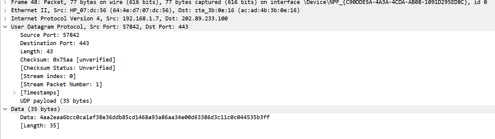
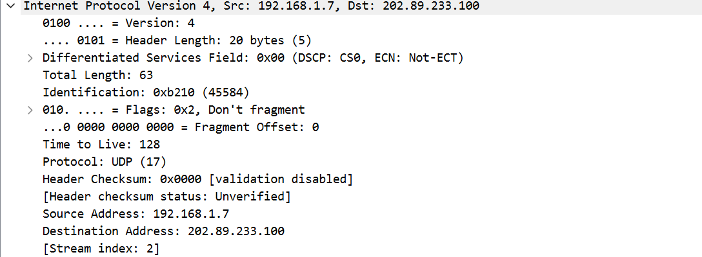
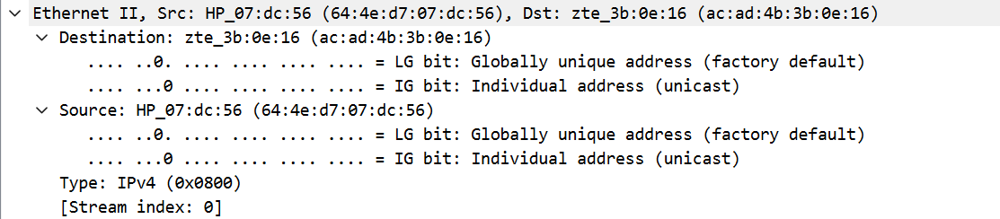
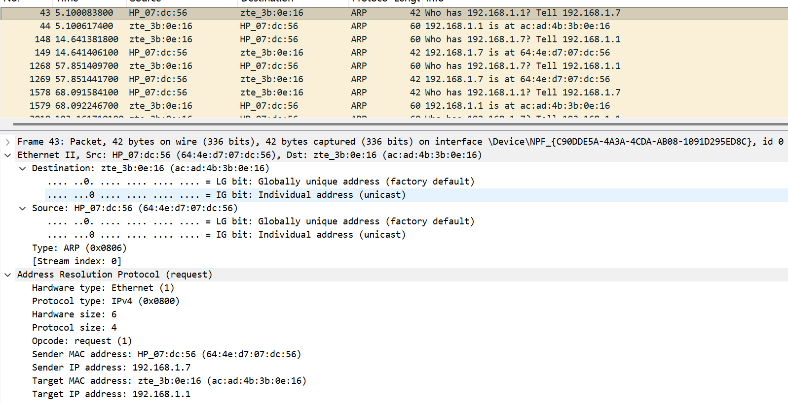
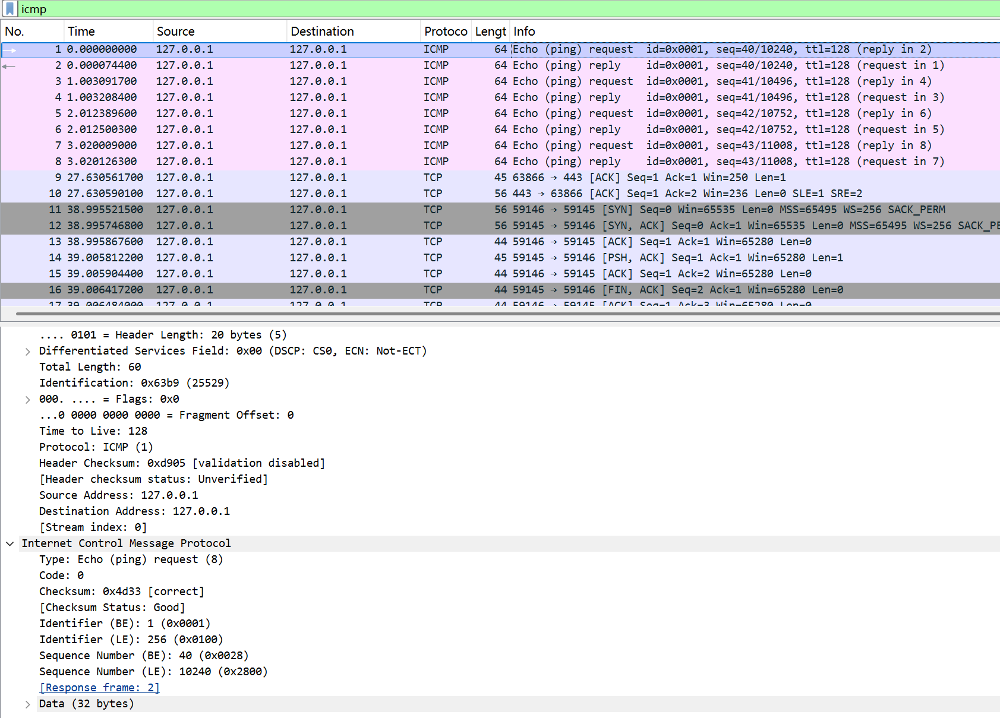

# Lab5：IP 与以太网的包收发操作

## 实验背景

本实验围绕 IP 模块与以太网在包收发过程中的角色展开，重点观察以下内容：

1. 网络包的基本结构：头部（IP 头部 + MAC 头部）与数据
2. IP 头部各字段的含义：版本号、TTL、协议号、发送方/接收方 IP 地址等
3. MAC 头部各字段的含义：接收方/发送方 MAC 地址、以太类型
4. IP 地址与 MAC 地址的区别与协作
5. ARP 协议如何通过 IP 地址查询 MAC 地址
6. 路由表的结构与查询方式
7. UDP 协议与 TCP 协议的区别：无连接、无确认、无重传
8. UDP 头部结构：发送方端口号、接收方端口号、数据长度、校验和
9. ICMP 协议的作用与常见消息类型（Echo、Destination Unreachable 等）

---

## 实验任务

### 任务一：查看路由表、ARP 缓存并启动 Wireshark

**第一步：打开 Wireshark，选择主网络接口，开始抓包**

> **注意**：本次实验必须使用真实网络接口（`en0`/`eth0`/`以太网`），不要选回环接口。回环接口不经过以太网，无法观察到 MAC 头部和 ARP 过程。

选择你的主网络接口，开始抓包。本次实验的大部分任务会共用同一次抓包。

**第二步：查看本机路由表**

```bash
# Linux
route -n
ip route show

# macOS
netstat -rn

# Windows
route print
```

截图并保存为 `route_table.png`。

**第三步：查看本机 ARP 缓存**

```bash
# Linux / macOS / Windows
arp -a
```

截图并保存为 `arp_cache.png`。

**第四步：填写下表**

从路由表和 ARP 缓存的输出中提取信息：

| 项目                         | 你的填写内容 |
| :--------------------------- | :----------- |
| 本机 IP 地址                 |        192.168.1.7      |
| 本机所在子网                 |       192.168.1.0/24       |
| 子网掩码                     |       	255.255.255.0       |
| 默认网关 IP                  |        	192.168.1.1      |
| 默认网关 MAC 地址            |       ac-ad-4b-3b-0e-16       |
| 本机网卡 MAC 地址            |       64-4E-D7-07-DC-56       |

简答题：

1. 路由表的每一行包含哪些关键字段？教材中提到的 `Network Destination`、`Netmask`、`Gateway`、`Interface` 分别对应什么含义？

      目标网络 / 主机的 IP 地址，对应目标网络的子网掩码，用于区分 IP 地址的网络位与主机位，到达目标网络时需转发的下一跳 IP 地址，本机发送数据包的网络接口 IP。


2. 当目标 IP 地址不在本子网时，包会先发给谁？路由表的哪一列提供了这个信息？

      当目标 IP 不在本子网时，数据包会先发给默认网关；路由表中通过 Gateway（网关） 字段提供下一跳地址，且默认路由的Network Destination为0.0.0.0（匹配所有非直连、非本地网段的数据包）。


3. 路由表的默认网关（`0.0.0.0`）条目的作用是什么？什么时候会匹配到这一行？

作用：作为 “兜底路由”，当数据包的目标 IP 不匹配路由表中任何具体网段（直连网络、特定子网）时，通过默认网关转发至外部网络（如互联网）。
匹配条件：仅当目标 IP 不在本机直连网段、且无其他更具体的路由条目匹配时，才会匹配0.0.0.0这一行。

4. 教材提到，确定发送方 IP 地址的关键在于"判断应该使用哪块网卡"。结合你查到的本机网卡信息，说明 IP 模块是如何做出这个判断的。

IP 模块选择发送方 IP（即对应网卡）的核心原则是 **“匹配直连网段 + 路由表接口绑定”**，具体步骤：
匹配目标网段与接口的直连关系：
路由表中Interface字段对应本机网卡 IP，需确保该网卡 IP 与目标网段（或网关所在网段）处于同一直连网络。
例如本机 IP 为192.168.1.7，子网掩码255.255.255.0，直连网段为192.168.1.0/24；若目标 IP 为192.168.1.2（同网段），则直接通过192.168.1.7对应的网卡发送，无需经过网关。
非直连网段的接口选择：
若目标 IP 不在直连网段（如8.8.8.8），路由表中0.0.0.0条目会指定网关 IP（192.168.1.1）和接口（192.168.1.7），此时 IP 模块强制选择192.168.1.7对应的网卡，将数据包转发至网关。
多网卡场景的补充：
若本机有多块网卡（如192.168.37.1、192.168.124.1），IP 模块会根据目标 IP 所属网段匹配路由表中对应的Interface，例如目标 IP 属于192.168.37.0/24，则选择192.168.37.1对应的网卡。

---

### 任务二：观察 UDP 头部

只要计算机处于联网状态，Wireshark 中就会持续出现大量 UDP 流量（DNS、mDNS、DHCP、NTP 等），无需手动生成。

**第一步：在 Wireshark 中设置过滤器**

```text
udp
```

**第二步：在包列表中找一个 UDP 包**

随便选一个即可。如果包太多，可以加上源或目的 IP 来缩小范围，例如 `udp && ip.addr == 你的IP`。如果需要 DNS 包，也可以用 `udp.port == 53` 过滤。

> **可选**：如果想明确看到一个完整的请求-响应对，可以在终端中执行 `nslookup example.com`，Wireshark 中就会出现对应的 DNS 请求包。

**第三步：点击选中的 UDP 包，在详情栏展开 `User Datagram Protocol`**

填写下表：

| 项目               | 你的填写内容 |
| :----------------- | :----------- |
| UDP 头部总长度     |       8 字节       |
| 源端口             |       57842       |
| 目的端口           |        443      |
| 长度（Length）     |       43 字节       |
| 校验和（Checksum） |       0x75aa       |

简答题：

1. 你观察到的 UDP 头部长度是多少字节？TCP 头部至少 20 字节。UDP 省略了哪些字段？这些字段的缺失带来了什么后果？
UDP 头部长度为 8 字节，且为固定长度，TCP 包含字段	，UDP 省略字段，字段缺失的后果
UDP 简化头部的设计核心是 “低延迟、高传输效率”，但牺牲了可靠性，具体后果：
无可靠交付：无确认机制，数据包丢失无法重传，可能导致数据丢失；
无序交付：无序号机制，UDP 报文到达顺序可能与发送顺序不一致；
无流量 / 拥塞控制：无窗口大小和拥塞避免机制，发送方无速率限制，可能导致网络拥塞；
无分片重组保障：UDP 自身无分片逻辑，若 IP 层分片后任意分片丢失，整个数据报无法重组，直接丢弃。


2. UDP 头部中的"长度"字段指的是什么长度？
UDP 头部中的 “长度”（Length）字段 指的是 整个 UDP 数据报的长度（单位：字节），包含两部分：
UDP 头部：固定 8 字节；
UDP 数据载荷（Payload）：应用层数据（如截图中 Len=35 字节的 DNS 数据）。




---

### 任务三：观察 IP 头部字段

点击任务二中的同一个 UDP 包，在详情栏展开 `Internet Protocol Version 4`。

填写下表：

| 字段名称               | 你的填写内容 | 含义说明 |
| :--------------------- | :----------- | :------- |
| Version（版本号）      |       4       |     表示这是 IPv4（网际协议第 4 版），是当前广泛使用的 IP 网络协议版本     |
| Header Length（头部长度） |      	20 字节（5）      |     IP 头部的总长度，数值 5 代表 5 个 4 字节，5×4=20 字节；代表当前为无额外选项的标准最小 IP 头部长度     |
| Time to Live（TTL）    |       	128       |      生存时间，数据包每经过一个路由器转发就会减 1，TTL 归 0 时数据包会被丢弃；作用是防止数据包在网络中无限环路转发    |
| Protocol（协议号）     |       	UDP（17）       |     标识 IP 层封装的上层传输层协议，17 为官方协议编号，代表上层承载的是 UDP 协议     |
| Source Address（源 IP） |       	192.168.1.7       |     发送该 IP 数据包的主机（本机）的 IPv4 地址     |
| Destination Address（目的 IP） |    202.89.233.100    |    该 IP 数据包要送达的目标主机的 IPv4 地址
      |

简答题：

1. 协议号字段的值是多少？它代表什么协议？如果抓一个 HTTP 请求的包，协议号会变成多少？

当前抓包里，IP 头部的协议号字段的值是17，这个编号代表上层承载的是UDP 传输层协议。HTTP 是基于 TCP 协议进行传输的，TCP 对应的官方 IP 协议固定编号为6，所以抓取 HTTP 请求的数据包时，协议号就会变成 6。

2. TTL 字段的作用是什么？如果 TTL 降为 0 会发生什么？

TTL 全称 Time to Live，也就是生存时间，它的核心作用是限制 IP 数据包在网络中的最大转发跳数，避免因为路由错误、环路故障，让数据包在网络里无限循环、一直占用网络资源。数据包每经过一台路由器转发，TTL 数值就会自动减 1。当 TTL 降为 0 的时候，当前处理数据包的路由器会直接丢弃这个数据包，同时会给数据包的原始发送主机，返回一个 ICMP 超时报文，告知发送方数据包传输超时、无法送达。


3. 有教材提到 IP 地址"实际上并不是分配给计算机的，而是分配给网卡的"。你的本机有几块网卡？每块网卡的 IP 地址分别是什么？（提示：可参考任务一中路由表的 Interface 列，或用 `ip addr`（Linux）/`ifconfig`（macOS）/`ipconfig`（Windows）查看。）

IP 地址不是绑定给整台电脑，而是绑定给单独的网卡设备，一台电脑可以有多块网卡、每块网卡可以拥有独立 IP。结合你之前 route print 和 ipconfig 的本机信息：本机一共配有4 块有效 IPv4 网卡：
有线 Realtek 以太网网卡：IP 地址为 192.168.1.7（当前上网、本次抓包的主网卡）
Intel 无线 Wi-Fi 6E 网卡
VMware 虚拟网卡 VMnet1：IP 地址 192.168.37.1
VMware 虚拟网卡 VMnet8：IP 地址 192.168.124.1


4. IP 头部中的源 IP 地址和目的 IP 地址分别是谁的地址？它们与 MAC 头部中的源/目的 MAC 地址有什么区别？

首先看本次抓包的 IP 头部：源 IP 地址是本机网卡地址 192.168.1.7，目的 IP 地址是最终要访问的远端服务器地址 202.89.233.100。
二者和 MAC 头部地址的核心区别：
层级与寻址范围不同
IP 地址属于网络层的逻辑地址，负责端到端的全局寻址，标记数据包的原始发送主机和最终目标主机，跨越整个互联网全程都不会发生改变。
MAC 地址属于数据链路层的物理硬件地址，只用于同一个局域网内、相邻两个设备之间的一跳一跳转发。
转发过程变化不同
数据包跨网络传输的全程，源 IP、目的 IP 始终保持原始值不变。
而源 MAC 地址和目的 MAC 地址，每经过一次路由器转发，就会被重新改写：源 MAC 会改为当前出站路由器接口的 MAC，目的 MAC 会改为下一跳设备的 MAC 地址，只负责当前一段链路的交付。
标识属性不同
IP 地址是可以手动配置、动态修改的逻辑网络标识；MAC 地址一般是网卡出厂固化的物理硬件编号，通常固定不变。



---

### 任务四：观察 MAC 头部与以太网帧

点击任务二中的同一个 UDP 包，在详情栏展开 `Ethernet II`。

填写下表：

| 字段名称               | 你的填写内容 | 含义说明 |
| :--------------------- | :----------- | :------- |
| Source（源 MAC）       |       64:4e:d7:07:dc:56       |     发送方（本机网卡）的物理硬件 MAC 地址，是本次以太网帧的发出设备     |
| Destination（目的 MAC） |       ac:ad:4b:3b:0e:16       |     链路层本次转发的下一跳接收设备的物理 MAC 地址     |
| Type（以太类型）       |      IPv4（0x0800）        |    标识以太网帧封装的上层网络层协议类型      |

关于 MAC 地址格式，填写下表：

| 项目               | 你的填写内容 |
| :----------------- | :----------- |
| MAC 地址长度       | 48 比特（6 字节） |
| 本机网卡的 MAC 地址 |       64:4e:d7:07:dc:56       |
| 目的 MAC 地址      |       ac:ad:4b:3b:0e:16       |
| MAC 地址的书写格式 |       十六进制、6 组 2 位字符，用冒号（或横杠）分隔       |

简答题：

1. 以太类型字段的值是多少？它代表后面承载的是什么协议的包？

以太类型字段的值为 0x0800，代表这个以太网帧内部承载的是 IPv4 协议的数据包。

2. DNS 服务器的 IP 通常是外网地址。本任务中目的 MAC 地址是 DNS 服务器的 MAC 地址还是你本机网关（路由器）的 MAC 地址？为什么？

这个目的 MAC 地址，是本机网关（路由器）的 MAC 地址，不是远端 DNS 服务器的 MAC 地址。原因：DNS 服务器是外网跨网段地址，和本机不在同一个局域网。MAC 地址仅能在同一局域网内生效、无法跨路由器转发。本机访问外网时，会先把数据包转发给网关，所以链路层的目的 MAC 填写网关 MAC，由网关负责把数据包转发到外网、最终送达 DNS 服务器。

3. IP 地址和 MAC 地址在功能上有什么相似之处？又有什么本质区别？

相似之处：
二者都是网络中设备的唯一地址标识，都可以用来定位、区分网络里的不同主机，完成数据包的寻址与投递。
本质区别：
MAC 地址是数据链路层的物理硬件地址，出厂固化、绑定网卡，仅在同一局域网内有效，传输全程每一跳都会改写。
IP 地址是网络层的逻辑网络地址，可手动配置修改，用于全网、跨网段的端到端寻址，数据包从源到目的全程不会发生改变。

4. 为什么以太网帧中需要同时有 IP 地址（在 IP 头部中）和 MAC 地址？不能只用其中一种吗？

二者工作层级、负责的范围完全不同，缺一不可：
只用 MAC 地址：MAC 无法跨路由器、无法在广域网路由寻址，只能局限在同一个小局域网内部，无法实现全球互联网的远距离通信。
只用 IP 地址：IP 地址是三层逻辑地址，底层物理局域网传输，必须依靠 MAC 地址来完成相邻设备之间的一跳一跳的物理交付，没有 MAC 地址，数据包无法在本地链路上传递。
简单来说：IP 地址负责规划 “从哪台电脑、送到全世界哪台电脑” 的全程路线；MAC 地址负责每一段局域网里，“下一个该传给哪个设备” 的短途交付，二者配合才能完成完整的网络通信。



---

### 任务五：观察 ARP 协议

ARP（Address Resolution Protocol，地址解析协议）用于根据 IP 地址查询 MAC 地址。只要计算机处于联网状态，Wireshark 中通常会持续出现 ARP 包（邻居发现、缓存刷新等），可以直接观察。如果抓包一段时间后仍未看到 ARP 包，再手动触发。

**第一步：在 Wireshark 中设置过滤器**

```text
arp
```

**第二步：在包列表中找 ARP 包**

正常联网的设备每隔几分钟就会自动发送 ARP 请求，等待即可。如果等了一会儿仍没有，可以选择以下任一方式手动触发：

- **方式 A（推荐）**：在终端中执行 `arping`

  ```bash
  # Linux（通常已预装）
  sudo arping -c 3 <网关IP>

  # macOS（如果没有，先执行：brew install arping）
  sudo arping -c 3 <网关IP>

  # Windows（可从 https://github.com/ThomasHabets/arping/releases 下载）
  arping -c 3 <网关IP>
  ```

- **方式 B**：先清除 ARP 缓存，再 ping 同网段地址

  ```bash
  # 清除 ARP 缓存
  # Linux:   sudo ip neigh flush all
  # macOS:   sudo arp -d -a
  # Windows: arp -d *

  # 然后 ping 网关
  ping <网关IP> -c 2
  ```

> **注意**：如果目标是 `127.0.0.1` 或外网地址，ARP 不会出现。回环接口不经过以太网，外网地址的 MAC 地址是路由器的（通常已缓存）。

**第三步：点击 ARP 请求包（Opcode 为 request），展开详情**

**第四步：填写下表**

| 项目                     | 你的填写内容 |
| :----------------------- | :----------- |
| ARP 请求的目的 MAC 地址 |       ff:ff:ff:ff:ff:ff       |
| ARP 请求中查询的目标 IP |      	192.168.1.1        |
| ARP 响应中返回的 MAC 地址 |      	ac:ad:4b:3b:0e:16        |
| 该 ARP 包是自动出现还是手动触发的 |      自动出现        |

简答题：

1. ARP 请求的目的 MAC 地址为什么是 `ff:ff:ff:ff:ff:ff`（广播地址）？

ARP 在不知道目标设备 MAC 地址的情况下，需要向整个局域网内所有设备广播发送请求。ff:ff:ff:ff:ff:ff是以太网二层广播地址，局域网内所有主机都会接收并解析这个 ARP 请求，只有目标 IP 对应的设备，才会单独回复 ARP 响应，其他设备会直接丢弃该请求。

2. 为什么 ARP 缓存中的条目会在几分钟后自动删除？

防止 ARP 缓存占用过多内存，提升系统资源利用率；
网络环境是动态变化的：设备更换网卡、IP 地址重新分配、设备下线、新设备接入等场景下，旧的 IP-MAC 映射会失效；
避免使用陈旧、错误的映射关系导致网络通信异常；
同时也可以降低 ARP 欺骗攻击的长期生效风险，提升网络安全性。

3. 如果 ARP 缓存中的 MAC 地址已经过期（对方 IP 对应的设备已更换），会出现什么问题？如何解决？

会出现的问题：
本机依然用旧的、错误的 MAC 地址封装数据包，导致数据包发送到错误的设备，网络无法连通、访问卡顿、丢包、上网失败，出现 IP 能 ping 通但业务无法正常通信的故障。
解决办法：
等待旧缓存条目自然超时自动更新；
手动执行命令清空 ARP 缓存：arp -d 清除全部缓存；
重新 ping 目标 IP，系统会立刻重新发送 ARP 广播，获取最新、正确的 IP 与 MAC 映射，自动更新 ARP 缓存。



---

### 任务六：使用 `ping` 命令观察 ICMP

有教材提到了 ICMP（Internet Control Message Protocol）协议，它用于在 IP 层传递错误和控制信息。`ping` 命令就是基于 ICMP 的 Echo Request（类型 8）和 Echo Reply（类型 0）实现的。

**第一步：在 Wireshark 中设置 ICMP 过滤器**

```text
icmp
```

**第二步：在终端中执行 ping 命令**

```bash
# ping 本机（回环）
ping 127.0.0.1 -c 4

# ping 局域网内的设备（如路由器网关）
ping <网关IP> -c 4

# ping 外网地址
ping 8.8.8.8 -c 4
```

**第三步：在 Wireshark 中观察 ICMP 包**

填写下表：

| 目标               | 是否收到回复 | 往返时间（ms） | TTL 值 |
| :----------------- | :----------- | :------------- | :----- |
| 127.0.0.1          |       是       |     最短 0ms，最长 0ms，平均 0ms       |     128   |
| 局域网设备（网关） |       是       |        最短 1ms，最长 2ms，平均 1ms        |     64   |
| 8.8.8.8            |      是        |        稳定约 56ms        |    112    |

> **提示**：ping 回环地址（`127.0.0.1`）时数据不经过物理网卡，Wireshark 在主网络接口上可能无法捕获到包。TTL 值可从终端输出中读取（`ping` 会显示 `ttl=...`），或切换 Wireshark 至回环接口（`lo0` / `lo`）抓包。

简答题：

1. `ping` 命令发送的是什么类型的 ICMP 消息？收到的回复又是什么类型？

ping 命令发送的是 ICMP 回显请求（Echo Request），类型为 8；收到的回复是 ICMP 回显应答（Echo Reply），类型为 0。

2. 为什么 ping 不同目标的 TTL 值不同？TTL 值反映了什么信息？

ping 不同目标 TTL 不同，是因为数据包每经过一个路由器，TTL 就会减 1。目标距离越远、经过的路由器越多，最终收到的 TTL 就越小。TTL 反映的是数据包从目标主机发出时的初始值，以及经过的路由跳数。

3. 教材表 2.4 中列出了多种 ICMP 消息类型。`Destination unreachable`（类型 3）在什么情况下会出现？请用以下方法尝试触发并观察：

   ```bash
   # 方法一（推荐）：ping 同网段内一个确认不存在的 IP
   # 例如你的本机 IP 是 192.168.1.100，子网掩码 255.255.255.0，
   # 那么可以 ping 192.168.1.250（一个大概率没有被分配的地址）
   ping <同网段不存在的IP> -c 3
   
   # 方法二：向一个关闭的端口发 UDP 包，触发 ICMP Port Unreachable
   # 先在 Wireshark 中保持 icmp 过滤器，然后执行：
   # Linux / macOS
   echo "test" | nc -u -w 1 <同网段某台设备的IP> 19999
   
   # Windows（需安装 nmap：https://nmap.org/download.html）
   nmap -sU -p 19999 <同网段某台设备的IP>
   ```

   观察到类型 3 的包后，记录其 Code 值（子类型）并说明代表什么含义。

Destination unreachable（ICMP 类型 3）表示目标不可达，在以下情况会出现：
目标 IP 不存在、设备关机或不在局域网内
目标端口未开放、服务未运行
路由不可达、被防火墙拦截
常见 Code 值：
Code 0：网络不可达
Code 1：主机不可达
Code 3：端口不可达



---

## 问答题

1. 网络包由哪几部分构成？IP 头部和 MAC 头部分别的作用是什么？

一个网络包通常由以太网头部（MAC 头）、IP 头部、传输层头部（TCP/UDP 头）、应用数据以及尾部的 FCS 校验字段构成。IP 头部的作用是标识数据包的源 IP 和目的 IP，负责跨网络的路由寻址。MAC 头部的作用是标识当前链路的源 MAC 和目的 MAC，负责局域网内的物理转发。

2. IP 协议和以太网协议在网络传输中分别承担什么职责？它们是如何分工协作的？

以太网协议工作在数据链路层，负责同一局域网内设备之间的物理传输，通过 MAC 地址实现点到点交付。IP 协议工作在网络层，负责跨网段、跨路由器的端到端寻址与路由转发。二者分工协作：以太网负责 “每一段链路怎么传”，IP 负责 “整个路径怎么走”，IP 包封装在以太网帧里传输，路由器根据 IP 地址转发，以太网负责相邻设备之间的实际发送。

3. ARP 协议解决的核心问题是什么？如果不使用 ARP 缓存，网络中会出现什么情况？

ARP 协议解决的核心问题是已知目标 IP，查询对应的 MAC 地址，建立 IP 与 MAC 的映射关系。如果不使用 ARP 缓存，每次发包都要重新广播 ARP 请求，会产生大量广播包，造成网络拥堵，通信效率极低，延迟明显增大。

4. 为什么 IP 和负责传输的网络（如以太网）要分开设计？这种设计带来了什么好处？

P 和底层网络（如以太网）分开设计，是为了实现网络层与链路层解耦。好处是：IP 协议可以运行在任何底层网络技术上（以太网、Wi‑Fi、光纤、移动通信网等），不需要为每种物理网络重新设计整套网络协议，让互联网可以统一、灵活、可扩展。


5. 网卡在发送包时会额外添加哪 3 个控制数据？它们各自的作用是什么？

网卡发送包时会额外添加前导码、帧开始定界符、FCS 校验和三个控制数据。前导码用于同步收发双方时钟；帧开始定界符标志一帧的开始；FCS 用于接收方校验帧在传输中是否出错。

6. 网卡接收到一个包后，需要经过哪些步骤才能将其交给操作系统？如果 FCS 校验失败会怎样？

网卡接收包后，先进行FCS 校验，校验通过后剥离前导码和帧尾，再判断目的 MAC 是否与本机匹配，符合条件就将数据包交给操作系统协议栈处理。如果 FCS 校验失败，网卡会直接丢弃该帧，不向上层传递，保证错误数据不会进入系统。

7. TCP 和 UDP 的核心区别是什么？请从连接管理、可靠性、效率、适用场景四个维度进行比较。

TCP 和 UDP 的核心区别：连接管理：TCP 是面向连接，需要三次握手建立连接；UDP 无连接，直接发送。可靠性：TCP 提供确认、重传、有序交付，可靠传输；UDP 不保证可靠，可能丢包、乱序。效率：TCP 头部大、机制复杂，开销大；UDP 头部小、速度快、延迟低。适用场景：TCP 用于文件传输、网页、邮件等要求可靠的场景；UDP 用于视频、语音、直播、游戏等追求实时性的场景。

8. UDP 适用于哪些场景？请结合教材内容解释为什么这些场景适合使用 UDP 而非 TCP。

UDP 适合视频通话、直播、在线游戏、DNS 查询、实时监控等场景。因为这些场景对延迟敏感，宁愿少量丢包也不希望等待重传，UDP 无连接、开销小、传输快，更符合实时性要求，而 TCP 的重传和拥塞控制会带来明显延迟。

9. 如果一个 IP 包经过多次路由转发后 TTL 降为 0，路由器会如何处理？这与教材中提到的哪种 ICMP 消息有关？

如果 IP 包的 TTL 降为 0，路由器会直接丢弃该数据包，并向源主机发送ICMP 超时消息（类型 11）。这对应教材中的ICMP Time Exceeded消息，用于防止数据包在网络中无限循环。


---

## 截图要求

- 截图须清晰，终端文字和 Wireshark 字段可读。
- 所有截图与本 `Lab5.md` 放在同一目录下。
- 命名规范：

| 截图内容         | 文件名               |
| :--------------- | :------------------- |
| 路由表           | `route_table.png`    |
| ARP 缓存         | `arp_cache.png`      |
| UDP 头部字段     | `udp_header.png`     |
| IP 头部字段      | `ip_header.png`      |
| 以太网帧字段     | `ethernet_frame.png` |
| ARP 请求与响应   | `arp.png`            |
| ICMP ping        | `icmp.png`           |

具体要求：

1. `route_table.png`：终端截图，显示 `route -n`（Linux）、`netstat -rn`（macOS）或 `route print`（Windows）的完整输出。

2. `arp_cache.png`：终端截图，显示 `arp -a` 的完整输出。

3. `udp_header.png`：Wireshark 截图，展开 `User Datagram Protocol`，能看到 Source Port、Destination Port、Length、Checksum。

4. `ip_header.png`：Wireshark 截图，展开 `Internet Protocol Version 4`，能看到 Version、Header Length、TTL、Protocol、Source Address、Destination Address。

5. `ethernet_frame.png`：Wireshark 截图，展开 `Ethernet II`，能看到 Source、Destination、Type。

6. `arp.png`：Wireshark 截图（若能观察到），展开 ARP 包的详情，能看到发送方的 MAC 和 IP、查询的目标 IP。

7. `icmp.png`：Wireshark 截图，能看到 ICMP Echo Request 和 Echo Reply，以及 TTL 字段。

---

## 提交要求

在自己的文件夹下新建 `Lab5/` 目录，提交以下文件：

```text
学号姓名/
└── Lab5/
    ├── Lab5.md
    ├── route_table.png
    ├── arp_cache.png
    ├── udp_header.png
    ├── ip_header.png
    ├── ethernet_frame.png
    ├── arp.png
    └── icmp.png
```

---

## 截止时间

2026-05-07，届时关于 Lab5 的 PR 请求将不会被合并。
