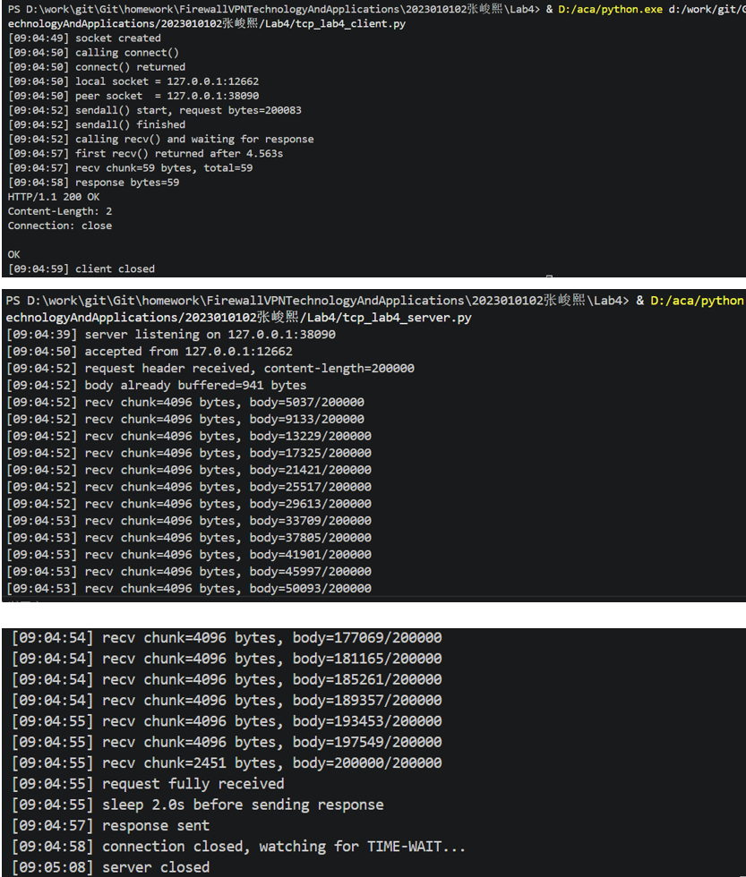

# Lab4：看见TCP 我不怕不怕啦

## 实验背景

本实验围绕一条 TCP 连接的完整生命周期展开，重点观察以下内容：

1. `socket()`、`listen()`、`accept()`、`connect()` 的职责区别
2. "连接"为什么本质上是交换控制信息而不是物理连线
3. TCP 头部中的端口号、序号、ACK 号、标志位、窗口、头部长度、可选字段
4. 三次握手如何建立收发准备
5. 应用层大块数据如何被 TCP 按 MSS 拆分
6. `Sequence Number` 与 `Acknowledgment Number` 如何配合工作
7. `recv()` 为什么会阻塞等待数据
8. 接收窗口如何反映接收方处理能力
9. ACK 与窗口更新为什么常常会被合并
10. `FIN` / `ACK` 如何完成断开
11. 为什么连接结束后套接字不会立刻删除

---

## 实验任务

### 任务一：准备实验环境并记录运行信息

**第一步：准备好四个窗口**

整个实验需要同时观察多个界面，建议在开始前把窗口布局摆好：

- **终端 A**：运行服务端
- **终端 B**：运行客户端
- **终端 C**：持续监控套接字状态（全程保持开启，不要关）
- **Wireshark**：抓包

**第二步：在终端 C 里启动持续监控**

TCP 状态变化很快，等你手动敲完 `ss` 命令再回车，状态可能已经过去了。用下面的命令让终端 C 每 0.5 秒自动刷新一次，之后只需要盯着这个窗口就行：

```bash
# Linux
watch -n 0.5 'ss -tan | grep 38090'

# macOS（没有 watch，用循环代替）
while true; do netstat -an | grep 38090; echo "---"; sleep 0.5; done

# Windows（Git Bash执行）
while true; do netstat -ano | grep 38090; echo "---"; sleep 0.5; done
```

如果你换了端口，把 `38090` 替换成实际端口。

**第三步：打开 Wireshark，选回环接口，填好过滤器，开始抓包**

回环接口在不同系统里名字不同：

| 系统 | 接口名 |
|:-----|:-------|
| Linux | `lo` |
| macOS | `lo0` |
| Windows | `Adapter for loopback traffic capture`（需提前安装 Npcap 并勾选回环支持） |

在显示过滤器里输入：

```text
tcp.port == 38090
```

然后点击开始抓包（蓝色鲨鱼鳍图标）。**先开始抓包，再运行脚本**，否则握手包会被漏掉。

**第四步：启动脚本**

```bash
# 终端 A
python3 tcp_lab4_server.py

# 终端 B（等服务端打印出 server listening on ... 后再运行）
python3 tcp_lab4_client.py
```

如果 `38090` 已被占用，两端都加环境变量换端口，同时记得把 Wireshark 过滤器和终端 C 里的端口号也改掉：

```bash
LAB4_PORT=38123 python3 tcp_lab4_server.py
LAB4_PORT=38123 python3 tcp_lab4_client.py
```

**第五步：填写下表**

| 项目                                | 你的填写内容 |
| :---------------------------------- | :----------- |
| 服务端监听地址                      |       127.0.0.1       |
| 服务端监听端口                      |      38090        |
| 客户端本地临时端口                  |   12662           |
| 客户端请求总字节数                  |   200083           |
| 服务端响应内容                      |   HTTP/1.1 200 OK    |
| 客户端 `connect()` 返回前后的时间点 |    09:04:50           |
| 客户端首次收到响应前等待了多久      |     4.563s         |

各项数值均可直接从终端输出读取：服务端监听信息在 `server listening on ...`，客户端本地端口在 `local socket = ...`，请求字节数在 `sendall() start, request bytes=...`，等待时间在 `first recv() returned after ...s`。



---

### 任务二：观察套接字创建与连接建立

1. 服务端启动后，观察终端 C 出现 `LISTEN` 状态，截图留存。
2. 在终端 B 里启动客户端，观察它依次打印 `socket created`、`calling connect()`、`connect() returned`。
3. 客户端打印 `connect() returned` 之后，观察终端 C 出现 `ESTABLISHED`，截图留存。脚本在 `connect()` 返回后有 2 秒停顿，这段时间足够截图。

填写下表：

| 阶段                             | 你的填写内容 |
| :------------------------------- | :----------- |
| 服务端启动、客户端未连入时的状态 |     LISTENING            |
| `connect()` 返回后服务端状态     |    ESTABLISHED           |
| `connect()` 返回后客户端状态     |    ESTABLISHED         |

简答题：

1. 服务端在客户端连接前为什么处于 `LISTEN`？

服务端调用 listen() 后进入 LISTEN 状态，表示服务端已准备好接受客户端连接请求。这相当于服务端在指定端口"守候"，等待客户端的连接请求到来，而不主动发起连接。

2. 为什么这时还没有真正建立 TCP 连接？

LISTEN 状态只是服务端准备接受连接的"半成品"状态。真正的 TCP 连接建立需要完成三次握手（SYN → SYN+ACK → ACK），只有三次握手完成后，连接状态才会变为 ESTABLISHED。在客户端连接之前，三次握手尚未开始，因此没有真正建立连接。

3. `socket()` 与 `connect()` 的区别是什么？

socket()作用是创建一个套接字（通信端点），分配系统资源，但此时套接字尚未绑定到任何地址或建立连接
connect()作用是主动向服务端发起 TCP 连接，触发三次握手过程，连接成功后套接字才能用于数据传输


4. 为什么 `connect()` 返回后才进入可稳定收发数据的状态？

connect() 是阻塞调用，它只有在三次握手完成后才返回。返回时意味着：客户端与服务端都已确认对方存在，双方的序列号已同步，TCP 连接已完全建立（ESTABLISHED 状态）。如果 connect() 未返回就发送数据，由于连接尚未建立，数据无法被正确接收。因此只有 connect() 返回后，才能稳定收发数据。

5. 为什么"网线一直连着"不等于"TCP 连接已经建立"？

网线连着"只是物理层和链路层的条件满足，而 TCP 连接是传输层的逻辑概念：网线连着不等于服务端在监听，网线连着不等于已完成三次握手，网线连着不等于双方序列号已同步。TCP 连接需要双方协议栈协同完成握手，网线连着只是前提条件之一，不等于逻辑连接已建立

6. 这里的"连接"更准确地说是在做什么？

"连接"本质上是在做：建立和维护一个四元组（源IP、源端口、目标IP、目标端口）对应的状态机转换。
从实验中中可以清晰看到状态转换过程：
初始状态：服务端 LISTEN（等待连接）
连接建立：connect() 返回后，出现两个 ESTABLISHED（客户端端口12662和服务端端口38090）
客户端关闭：客户端进入 CLOSE_WAIT，服务端进入 FIN_WAIT_2
服务端关闭：服务端进入 TIME_WAIT（持续约30-60秒）
最终：连接完全关闭，只剩服务端 LISTEN。所以"连接"更准确地说是在维护一个两端协议栈共同协作的状态机，通过三次握手建立、四次挥手关闭，并在 TIME_WAIT 状态等待可能的延迟报文。


---

### 任务三：观察三次握手与 TCP 头部字段

**定位握手包**：在 Wireshark 过滤器里输入下面的条件，可以屏蔽中间的数据包，只留下握手和断开阶段的控制包：

```text
tcp.port == 38090 && (tcp.flags.syn == 1 || tcp.flags.fin == 1)
```

包列表最前面的三个包就是三次握手（SYN → SYN-ACK → ACK）。

**找到各字段的位置**：点击某个握手包，在下方详情栏展开 `Transmission Control Protocol`。源端口、目的端口、Seq、Ack、Flags、Window、Header Length 都在这里。TCP 选项在最底部的 `Options` 子项里，展开后可以看到 MSS、Window Scale、SACK Permitted，注意这三项只出现在带 SYN 标志的包里，纯 ACK 包里没有。

**关于序号显示**：Wireshark 默认开启相对序号，会把每个方向的初始序号归零显示，所以 SYN 包的 Seq 看起来是 `0`，而不是真实的随机大数。这是正常现象，实验报告按 Wireshark 显示的值填写即可。如果你想看真实值，可以去 `Edit → Preferences → Protocols → TCP` 里取消勾选 `Relative sequence numbers`。

填写下表：

| 报文       | 源端口 | 目的端口 | Seq  | Ack  | Flags | Window | Header Length |
| :--------- | :----- | :------- | :--- | :--- | :---- | :----- | :------------ |
| 第一次握手 |   12662     |   38090       |   0   |   0   |   0x002 (SYN)    |   65535     |     32 bytes (8)          |
| 第二次握手 |   38090     |   12662       |   0   |   1   |   0x012 (SYN, ACK)    |   65535    |  32 bytes (8)         |
| 第三次握手 |   12662     |    38090      |   1  |    1   |    0x010 (ACK)    |   255     |    20 bytes (5)           |

第一次握手（SYN）的 Ack 字段在 Wireshark 里通常显示为空或 `0`，这是正常的，因为此时客户端还没有收到服务端的任何数据。Header Length 在没有选项时是 20 字节，握手包因为携带了 MSS 等选项通常是 28 或 32 字节。

| TCP 选项       | 你的填写内容 |
| :------------- | :----------- |
| MSS            |    65495          |
| Window Scale   |    8          |
| SACK Permitted |    1          |

回环接口的 MSS 通常是 65495（因为回环 MTU 是 65536，比以太网的 1500 大得多），这会影响后续任务五里是否能观察到分段。

简答题：

1. 发送方和接收方端口号在连接阶段的作用是什么？
端口号用于标识主机上的具体应用进程。在 TCP 连接建立阶段：源端口标识发送方的应用进程，目的端口标识接收方的应用进程
作用本质：实现 进程到进程（process-to-process）通信


2. TCP 头部如何帮助找到目标套接字？
TCP 通过以下四元组唯一标识一个连接：源 IP + 源端口 + 目的 IP + 目的端口，操作系统通过这个四元组查找对应的 socket，从而将数据交给正确的应用程序。


3. 为什么初始序号不是简单固定从 1 开始？
原因是为了安全性和可靠性：防止旧连接的延迟数据被误认为新连接的数据，防止序号预测攻击（提高安全性）。保证 TCP 连接的唯一性


4. 为什么 TCP 可选字段更容易在连接阶段看到？
因为 TCP 选项主要用于协商连接参数


---

### 任务四：区分头部中的控制信息和套接字中的控制信息

用以下过滤器分别找到两类报文：

```text
# 纯控制报文（无应用数据）
tcp.port == 38090 && tcp.len == 0

# 携带应用数据的报文
tcp.port == 38090 && tcp.len > 0
```

从纯控制报文里选一个（SYN、纯 ACK 或 FIN-ACK 都可以），从数据报文里选一个（客户端发请求或服务端发响应的包）。

填写下表：

| 项目                   | 你的填写内容 |
| :--------------------- | :----------- |
| 纯控制报文的类型       |    ACK（确认报文）                            |
| 携带应用数据的报文类型 |    数据报文（如客户端请求 / 服务端响应）      |
| 头部中的控制信息举例   |    Seq、Ack、Flags、Window                 |
| 套接字中的控制信息举例 |    源 IP、源端口、目的 IP、目的端口          |

简答题：

1. 为什么"头部中的控制信息"和"套接字中的控制信息"不是同一件事？
因为它们属于不同层次：头部中的控制信息（TCP Header）是网络传输层的数据随每个 TCP 报文发送。如：Seq、Ack、Flags、Window
套接字中的控制信息（Socket）是操作系统提供的接口信息是描述通信双方的端点。如：源 IP、源端口、目的 IP、目的端口
 


---

### 任务五：观察数据分段、序号与 ACK

客户端发送的请求体是 200000 字节，超过了回环接口 MSS（约 65495 字节），因此应该可以在 Wireshark 里看到多个连续的数据段。用下面的过滤器找到客户端发出的数据包：

```text
tcp.srcport != 38090 && tcp.port == 38090 && tcp.len > 0
```

在包列表里连续选几个数据段，对比它们的 Seq 值。相邻两段的关系是：后一段的 Seq = 前一段的 Seq + 前一段的 TCP Segment Len。

找服务端返回给客户端的纯 ACK 报文：

```text
tcp.srcport == 38090 && tcp.flags.ack == 1 && tcp.len == 0
```

填写下表：

| 数据段  | Seq  | Ack  | TCP Segment Len | Flags |
| :------ | :--- | :--- | :-------------- | :---- |
| 第 1 段 |  1         |  1   |   65495        |  0x010 (ACK)     |
| 第 2 段 |  65496     |  1    |   65495        |  0x010 (ACK)     |
| 第 3 段 |  130991    |  1    |   65495        |  0x010 (ACK)     |

| ACK 报文 | Ack Number | Flags | Window |
| :------- | :--------- | :---- | :----- |
| 第 1 个  |  65496       |  0x010 (ACK)     |   511     |
| 第 2 个  |  130991      |  0x010 (ACK)     |   256     |
| 第 3 个  |  200084      |  0x010 (ACK)     |   497     |

| 项目                         | 你的填写内容 |
| :--------------------------- | :----------- |
| 是否发生分段                 |     是                                 |
| 握手中观察到的 MSS           |     65495                              |
| 单段长度与 MSS 的关系        |     基本等于 MSS（每段约 65495 字节）    |
| ACK 号大致确认到了第几个字节 |      65496、130991、200084              |

简答题：

1. 应用程序是否直接决定每个网络包的数据长度？为什么？
不能直接决定。应用只调用 send() / sendall()实际分段由 TCP 协议栈完成TCP 会根据：MSS，拥塞控制，接收窗口来自动拆分数据。


2. 大块应用数据为什么会被拆分？
受 MSS 限制，单个 TCP 段不能超过 MSS。避免 IP 分片，分段比 IP 层分片更可靠。提高可靠性，丢包只需重传一小段。流量控制 + 拥塞控制，防止网络或接收方被压垮。


3. `MSS` 与 `MTU` 的关系是什么？
MSS = MTU - IP头 - TCP头


4. "一次 `sendall()`"与"一个 TCP 包"之间是什么关系？
一次 sendall()可能发送多个 TCP 段，一个 TCP 段也可能来自多次 send()。


5. 为什么 ACK 体现的是累计确认？
TCP 使用累计确认机制（Cumulative ACK）：

ACK 表示：“这个序号之前的数据我都收到了”好处是减少 ACK 数量，提高效率，简化协议。


6. 如果中间某一段丢失，ACK 会出现什么变化？
会出现重复 ACK（Duplicate ACK），触发快速重传（Fast Retransmit）。


---

### 任务六：观察 `recv()` 阻塞与窗口字段

`recv()` 的等待时间直接从客户端终端读取，`calling recv() and waiting for response` 到 `first recv() returned after ...s` 之间就是等待时长，脚本已经帮你计算好了。

在 Wireshark 里找窗口值：用过滤器 `tcp.port == 38090 && tcp.flags.ack == 1` 列出所有 ACK 包，点击其中一个，在详情栏 `Transmission Control Protocol` 里找 `Window` 字段。如果同时显示了 `Calculated window size`，优先看这个值，它已经把 Window Scale 的缩放算进去了，是对方实际能接收的字节数。

如果包列表的 Info 列出现了 `[TCP Window Update]` 标注，说明这个包的主要目的是通知对方窗口变化，重点观察它的 `Window` 字段。

填写下表：

| 项目                                   | 你的填写内容 |
| :------------------------------------- | :----------- |
| 客户端开始调用 `recv()` 的时间         |    09:04:52          |
| 客户端第一次收到响应的时间             |     09:04:57         |
| `recv()` 是否立刻返回                  |    否          |
| 首次收到响应前等待了多久               |     约4.56秒         |
| `recv()` 等待期间连接是否已经建立      |     是         |
| 第 1 个 ACK 报文的窗口值               |     511（Calculated ≈ 130816）         |
| 第 2 个 ACK 报文的窗口值               |     256（Calculated ≈ 65536）         |
| 第 3 个 ACK 报文的窗口值               |     497（Calculated ≈ 127232）         |
| 窗口值是否变化                         |     是         |
| 若变化，变化趋势                       |      先减小 → 再增大        |
| ACK 与窗口更新是否可以出现在同一个包中 |        可以      |
| 是否看到 RTT 或 ACK 往返时间相关信息   |        是      |

简答题：

1. "连接建立"和"应用收到数据"之间是什么关系？
TCP 三次握手完成 → 只是说明：网络通了双方可以通信，但应用数据什么时候发，完全取决于应用程序。


2. 为什么说 `read` / `recv` 在数据未到达时会被挂起？
因为默认是阻塞 I/O：当缓冲区没有数据：recv() 不返回，线程进入等待状态（sleep）直到有数据到达或连接关闭或超时（如果设置）


3. 窗口字段反映了接收方哪方面的能力？
接收缓冲区剩余容量


4. 为什么发送方不能无限制连续发送数据？
因为有两个限制：（1）接收方限制（流量控制）Window 限制发送量（2）网络限制（拥塞控制）防止网络爆炸


5. 滑动窗口为什么既提高效率又避免压垮接收方？
边发边确认模式，提高效率不用“发一个等一个”，可以连续发送多个段（流水线）。避免压垮，接收方通过 Window 告诉：“我还能收多少”发送方不会超过这个值


---

### 任务七：观察响应返回与双向 `seq/ack`

TCP 的 Seq/Ack 是双向独立的，客户端有自己的发送序号，服务端有自己的发送序号。用下面的过滤器只看服务端发出的数据包（源端口是 38090，有应用数据）：

```text
tcp.srcport == 38090 && tcp.len > 0
```

紧跟在服务端数据包后面的、客户端发出的 ACK 包，其 Ack Number 确认的就是服务端的发送序号。

填写下表：

| 项目                     | 你的填写内容 |
| :----------------------- | :----------- |
| 服务端响应数据报文的 Seq |      1             |
| 服务端响应数据报文的 Ack |      200084        |
| 客户端确认报文的 Ack     |      60            |

简答题：

1. 为什么 TCP 的 `seq/ack` 是双向分别计算的？
因为 TCP 是全双工通信（双方可以同时发送数据）。每一方都有：自己的发送序号（Seq），自己期望接收的序号（Ack）。


2. 为什么双方都需要各自的初始序号？
原因有三个核心点：区分不同连接，保证数据可靠性，安全性（防攻击）。


3. 为什么发送应用数据时报文通常仍然带 `ACK`？
因为 TCP 使用的是捎带确认（Piggybacking）机制，在发送数据的同时顺便确认对方的数据。


---

### 任务八：观察连接断开与套接字延迟删除

用下面的过滤器精确定位所有带 FIN 的包：

```text
tcp.port == 38090 && tcp.flags.fin == 1
```

通常会看到两个 FIN 包（双方各一个）。看第一个 FIN 包的源端口，就能判断谁先发起断开。

**关于 TIME-WAIT**：TIME-WAIT 只出现在主动发起关闭的一方（先发 FIN 的那端）。服务端脚本在 `conn.close()` 之后会继续运行 10 秒再退出，这段时间可以在终端 C 里观察 TIME-WAIT。Linux 上 TIME-WAIT 通常持续约 60 秒，macOS 上可能较短，如果没有观察到请如实说明。

填写下表：

| 项目                                    | 你的填写内容 |
| :-------------------------------------- | :----------- |
| 谁先发送 FIN                            |   客户端（38090）  |
| 关闭阶段共观察到几个带 FIN 的报文         |       2个         |
| 最终 ACK 是否可见                       |      可见          |
| 关闭后是否观察到 `TIME-WAIT` 或等价现象  |       是           |

简答题：

1. 为什么关闭连接不能只发一个结束通知？
TCP 是全双工通信，双方的数据发送是相互独立的，因此关闭连接也必须分别关闭两个方向的数据流，一个 FIN 只能表示“我这边不再发送数据了”，但仍然可以接收数据，所以需要双方各发送一次 FIN 来分别关闭两个方向，确保双方都明确对方的数据发送已经结束，从而避免数据丢失或连接状态不一致的问题。


2. 为什么连接结束后套接字不会立刻删除？
连接结束后不会立刻删除套接字，是因为需要进入 TIME-WAIT 状态来确保最后的 ACK 能够可靠送达，同时防止网络中延迟的旧报文影响新的连接，这段等待时间可以让所有可能滞留在网络中的数据包自然消失，从而保证后续连接的正确性和安全性。


3. 如果最后一个 ACK 丢失，而旧套接字已经立刻删除，可能带来什么问题？
如果最后一个 ACK 丢失，而旧连接立即删除，对方会因为没有收到确认而重发 FIN，此时本地已经没有对应的套接字，就可能返回 RST 导致连接异常关闭，同时还可能使延迟的旧数据被误认为是新连接的数据，造成数据混乱甚至协议错误。


---

## 问答题

1. TCP 的"连接"到底意味着什么？它为什么不是"把网线连上"？
TCP 的连接本质上是通信双方在内核中维护的一种状态关系，包括序号、确认号、窗口大小等控制信息，它是一种逻辑上的连接，而不是物理连接，因为底层网络只是发送数据包，TCP 通过这些状态信息来保证数据的有序、可靠传输，所以即使没有真实的“线”，也可以建立可靠通信。


2. 三次握手为什么能让双方进入可通信状态？
三次握手通过交换双方的初始序号并互相确认，使双方都知道对方具备发送和接收能力，同时建立起可靠的序号同步关系，第一次握手发起连接请求，第二次确认并回应，第三次再确认，从而保证双方都进入已建立状态，可以安全地开始数据传输。


3. TCP 头部中的控制字段如何支撑收发数据？
TCP 头部中的序号（Seq）用于标识数据位置，确认号（Ack）用于确认接收情况，窗口字段用于流量控制，标志位（如 SYN、ACK、FIN、PSH）用于控制连接建立、数据传输和断开，这些字段共同作用，使 TCP 能够实现可靠、有序、可控的数据传输。


4. ACK、窗口、等待时间为什么会共同影响 TCP 的可靠传输？
ACK 用于确认数据是否成功接收，窗口控制发送速率避免接收方溢出，而等待时间（如超时重传）决定何时重发丢失数据，这三者共同构成 TCP 的可靠机制：ACK 提供反馈，窗口调节流量，等待时间触发重传，从而在不可靠网络上实现可靠通信。


5. 断开连接为什么仍然需要严格的控制信息交换？
断开连接时仍需要严格的控制信息交换，是因为必须确保双方的数据都已经发送和接收完成，同时避免丢包和状态不一致，FIN 和 ACK 的多次交互可以确认双方都完成了通信，从而保证连接是“干净”关闭的，而不是突然中断。


6. 如果服务端根本没有启动，客户端调用 `connect()` 时会看到什么现象？
如果服务端没有启动，客户端调用 connect() 时通常会收到连接拒绝错误（Connection refused），因为目标端口没有进程监听，操作系统会返回 RST 报文，导致连接建立失败。


7. 如果中途人为制造丢包，ACK、重传、窗口之间会出现什么变化？
如果发生丢包，接收方不会确认丢失的数据，发送方会因为超时或收到重复 ACK 而触发重传，同时可能降低发送速率（窗口变小），以避免网络拥塞，从而体现出 TCP 的拥塞控制和可靠传输机制。


8. 如果把客户端发送的数据改得更大，窗口字段和分段情况会如何变化？
当发送数据变大时，TCP 会根据最大报文段长度（MSS）进行分段发送，产生更多数据包，同时窗口字段会限制一次能发送的数据量，如果窗口不足，发送方需要等待 ACK 后继续发送，因此分段数量增加，发送过程更加依赖窗口控制。


9. 如果把服务端读取速度改得更慢，是否更容易看到窗口更新甚至零窗口？
如果服务端读取数据变慢，接收缓冲区会逐渐被填满，导致通告窗口变小甚至变为零窗口，从而通知发送方暂停发送数据，直到缓冲区有空间后再发送窗口更新报文，因此更容易观察到窗口变化甚至零窗口现象。


---

## 截图要求

- 截图须清晰，终端文字和 Wireshark 字段可读。
- 所有截图与本 `Lab4.md` 放在同一目录下。
- 命名规范：

| 截图内容               | 文件名                  |
| :--------------------- | :---------------------- |
| 服务端与客户端运行结果 | `run.png`               |
| `ss` 状态变化          | `states.png`            |
| 三次握手与 TCP 选项    | `handshake_header.png`  |
| 大请求分段与 MSS       | `segmentation.png`      |
| ACK 与窗口观察         | `ack_window.png`        |
| 断开与最终状态         | `teardown_timewait.png` |

具体要求：

1. `run.png`：终端截图，至少能看到服务端 `server listening on ...`、客户端 `calling connect()`、`connect() returned`、`calling recv() and waiting for response`、`first recv() returned after ...s`。

2. `states.png`：终端截图，至少能看到 `LISTEN`、`ESTABLISHED`，以及 `TIME-WAIT`（若能观察到）。推荐截 `watch` 命令的持续输出画面，可以在一张截图里同时展示多个状态的变化过程。

3. `handshake_header.png`：Wireshark 截图，至少能看到三次握手中某个包的 `Source Port`、`Destination Port`、`Sequence Number`、`Acknowledgment Number`、`Flags`、`Window`，以及 `Options` 中的 `Maximum segment size`、`Window Scale`、`SACK Permitted`。

4. `segmentation.png`：Wireshark 截图，至少能看到客户端发送数据的 TCP 包的 `TCP Segment Len`、`Seq`、`Ack`。若能观察到分段，尽量截出多个连续数据段。

5. `ack_window.png`：Wireshark 截图，至少能看到一个或多个 ACK 报文的 `Acknowledgment Number`、`Window`，以及 `Calculated window size`（若显示）、`[TCP Window Update]`（若出现）。

6. `teardown_timewait.png`：Wireshark 截图或 Wireshark 与终端截图的拼图，至少能看到带 `FIN` 的包，以及 `TIME-WAIT` 状态（若能观察到）。

---

## 提交要求

在自己的文件夹下新建 `Lab4/` 目录，提交以下文件：

```text
学号姓名/
└── Lab4/
    ├── Lab4.md
    ├── tcp_lab4_server.py
    ├── tcp_lab4_client.py
    ├── run.png
    ├── states.png
    ├── handshake_header.png
    ├── segmentation.png
    ├── ack_window.png
    └── teardown_timewait.png
```

---

## 截止时间

2026-04-23，届时关于 Lab4 的 PR 请求将不会被合并。
