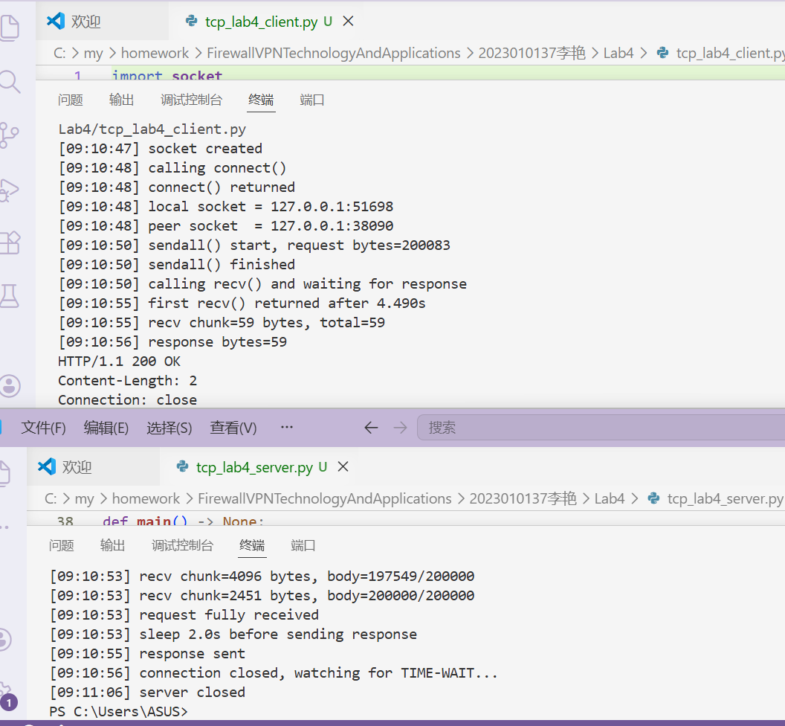
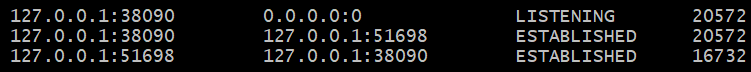
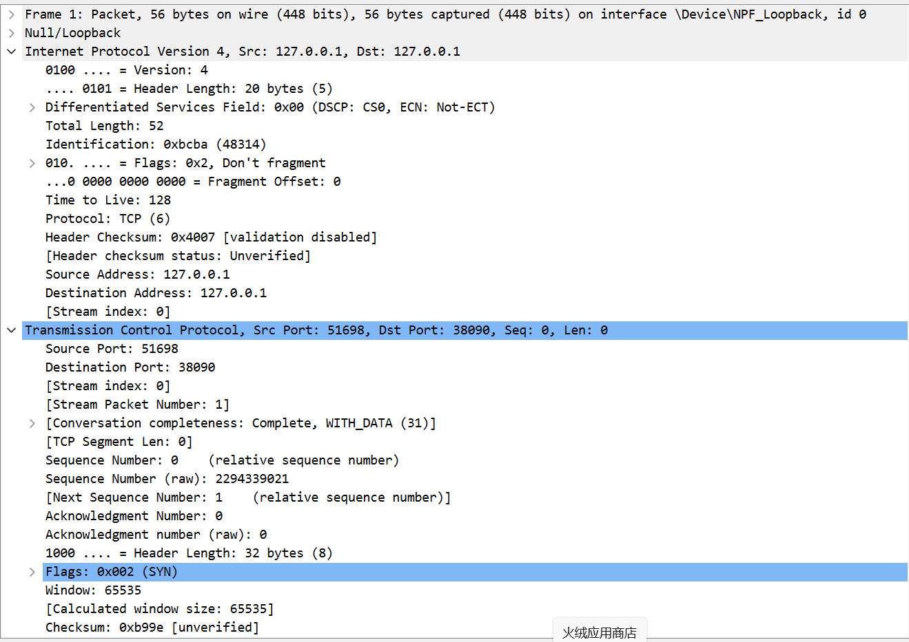
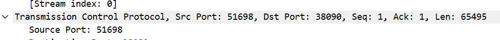
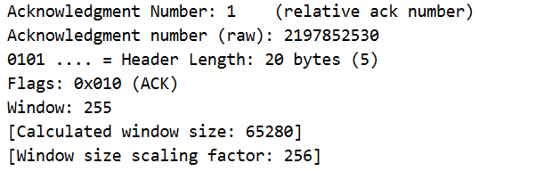
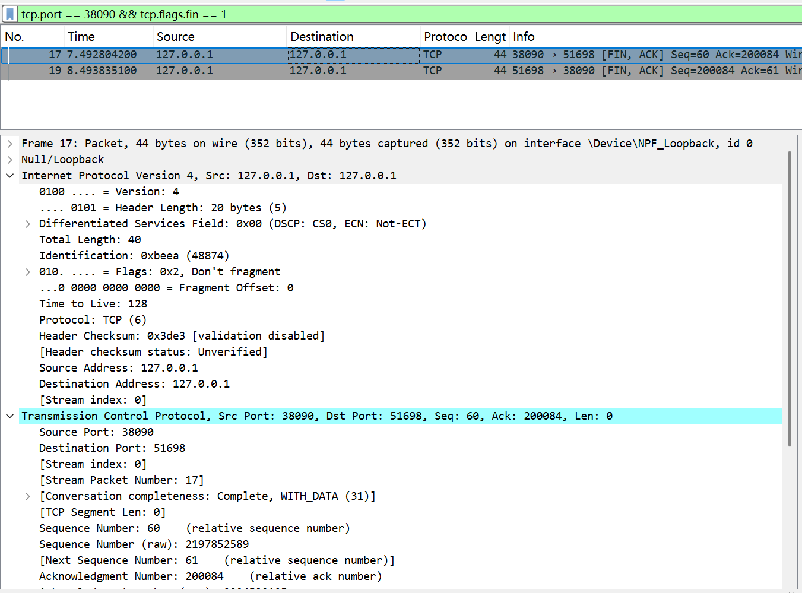

# Lab4：看见TCP 我不怕不怕啦

## 实验背景

本实验围绕一条 TCP 连接的完整生命周期展开，重点观察以下内容：

1. `socket()`、`listen()`、`accept()`、`connect()` 的职责区别
2. "连接"为什么本质上是交换控制信息而不是物理连线
3. TCP 头部中的端口号、序号、ACK 号、标志位、窗口、头部长度、可选字段
4. 三次握手如何建立收发准备
5. 应用层大块数据如何被 TCP 按 MSS 拆分
6. `Sequence Number` 与 `Acknowledgment Number` 如何配合工作
7. `recv()` 为什么会阻塞等待数据
8. 接收窗口如何反映接收方处理能力
9. ACK 与窗口更新为什么常常会被合并
10. `FIN` / `ACK` 如何完成断开
11. 为什么连接结束后套接字不会立刻删除

---

## 实验任务

### 任务一：准备实验环境并记录运行信息

**第一步：准备好四个窗口**

整个实验需要同时观察多个界面，建议在开始前把窗口布局摆好：

- **终端 A**：运行服务端
- **终端 B**：运行客户端
- **终端 C**：持续监控套接字状态（全程保持开启，不要关）
- **Wireshark**：抓包

**第二步：在终端 C 里启动持续监控**

TCP 状态变化很快，等你手动敲完 `ss` 命令再回车，状态可能已经过去了。用下面的命令让终端 C 每 0.5 秒自动刷新一次，之后只需要盯着这个窗口就行：

```bash
# Linux
watch -n 0.5 'ss -tan | grep 38090'

# macOS（没有 watch，用循环代替）
while true; do netstat -an | grep 38090; echo "---"; sleep 0.5; done

# Windows（Git Bash执行）
while true; do netstat -ano | grep 38090; echo "---"; sleep 0.5; done
```

如果你换了端口，把 `38090` 替换成实际端口。

**第三步：打开 Wireshark，选回环接口，填好过滤器，开始抓包**

回环接口在不同系统里名字不同：

| 系统 | 接口名 |
|:-----|:-------|
| Linux | `lo` |
| macOS | `lo0` |
| Windows | `Adapter for loopback traffic capture`（需提前安装 Npcap 并勾选回环支持） |

在显示过滤器里输入：

```text
tcp.port == 38090
```

然后点击开始抓包（蓝色鲨鱼鳍图标）。**先开始抓包，再运行脚本**，否则握手包会被漏掉。

**第四步：启动脚本**

```bash
# 终端 A
python3 tcp_lab4_server.py

# 终端 B（等服务端打印出 server listening on ... 后再运行）
python3 tcp_lab4_client.py
```

如果 `38090` 已被占用，两端都加环境变量换端口，同时记得把 Wireshark 过滤器和终端 C 里的端口号也改掉：

```bash
LAB4_PORT=38123 python3 tcp_lab4_server.py
LAB4_PORT=38123 python3 tcp_lab4_client.py
```

**第五步：填写下表**

| 项目                                | 你的填写内容 |
| :---------------------------------- | :----------- |
| 服务端监听地址                      | 	127.0.0.1             |
| 服务端监听端口                      |  	38090            |
| 客户端本地临时端口                  |  	51698            |
| 客户端请求总字节数                  |    200083 字节          |
| 服务端响应内容                      | HTTP/1.1 200 OK；Content-Length: 2；Connection: close             |
| 客户端 `connect()` 返回前后的时间点 | 	09:10:48（发起前）、09:10:48（返回后）             |
| 客户端首次收到响应前等待了多久      |  	4.490 秒            |

各项数值均可直接从终端输出读取：服务端监听信息在 `server listening on ...`，客户端本地端口在 `local socket = ...`，请求字节数在 `sendall() start, request bytes=...`，等待时间在 `first recv() returned after ...s`。



---

### 任务二：观察套接字创建与连接建立

1. 服务端启动后，观察终端 C 出现 `LISTEN` 状态，截图留存。
2. 在终端 B 里启动客户端，观察它依次打印 `socket created`、`calling connect()`、`connect() returned`。
3. 客户端打印 `connect() returned` 之后，观察终端 C 出现 `ESTABLISHED`，截图留存。脚本在 `connect()` 返回后有 2 秒停顿，这段时间足够截图。

填写下表：

| 阶段                             | 你的填写内容 |
| :------------------------------- | :----------- |
| 服务端启动、客户端未连入时的状态 |  LISTENING            |
| `connect()` 返回后服务端状态     |  ESTABLISHED            |
| `connect()` 返回后客户端状态     | ESTABLISHED             |

简答题：

1. 服务端在客户端连接前为什么处于 `LISTEN`？
服务端启动后，会调用 listen() 系统调用，将套接字设置为监听（LISTEN）状态。
该状态的核心作用是：让服务端在指定端口（如 38090）持续等待客户端的连接请求（SYN 包），随时准备响应连接，是 TCP 服务端的标准初始状态。
只有处于 LISTEN 状态，服务端才能接收客户端的连接请求，完成后续三次握手。


2. 为什么这时还没有真正建立 TCP 连接？
TCP 连接的建立需要完成三次握手（SYN→SYN+ACK→ACK），而 LISTEN 状态仅代表服务端做好了接收连接的准备：
此时服务端仅完成了套接字创建、端口绑定和监听，尚未收到客户端的连接请求，也未完成三次握手的交互，因此没有真正建立 TCP 连接。
只有当客户端发起连接、双方完成三次握手后，连接才正式建立，进入 ESTABLISHED 状态。


3. `socket()` 与 `connect()` 的区别是什么？
socket() 是创建套接字，不涉及网络交互；
connect() 是发起连接，触发三次握手，完成 TCP 连接的建立。


4. 为什么 `connect()` 返回后才进入可稳定收发数据的状态？
connect() 是客户端的阻塞式系统调用，只有当 TCP 三次握手完全完成后，该函数才会返回：
三次握手的本质是：客户端与服务端同步双方的序列号、确认窗口等参数，协商通信规则，确保双方都具备收发数据的能力。
connect() 返回，代表三次握手成功，连接已进入 ESTABLISHED 状态，此时双方的传输参数已同步，可稳定、可靠地收发数据，避免了数据丢失或乱序的问题。


5. 为什么"网线一直连着"不等于"TCP 连接已经建立"？
网线连接是物理层 / 数据链路层的连通性，仅代表硬件链路通畅，是 TCP 连接的基础，但不等同于应用层的 TCP 连接。
TCP 连接是传输层的逻辑连接，需要通过三次握手完成参数协商、状态同步，是应用程序之间的端到端逻辑链路。
即使网线连通，若应用程序未发起连接、未完成三次握手，TCP 连接依然不会建立；反之，TCP 连接建立后，若网线断开，连接也会失效。


6. 这里的"连接"更准确地说是在做什么？
这里的「连接」，本质是TCP 协议通过三次握手，在客户端与服务端的两个套接字之间，建立一条逻辑上的、可靠的端到端通信链路：
核心动作包括：同步双方的初始序列号（ISN）、协商窗口大小、确认通信参数，将双方的套接字状态从 LISTEN/SYN_SENT 切换为 ESTABLISHED，为后续可靠的数据传输提供保障。
它不是物理链路的连接，而是传输层的逻辑连接，用于保证数据的有序、可靠传输。




---

### 任务三：观察三次握手与 TCP 头部字段

**定位握手包**：在 Wireshark 过滤器里输入下面的条件，可以屏蔽中间的数据包，只留下握手和断开阶段的控制包：

```text
tcp.port == 38090 && (tcp.flags.syn == 1 || tcp.flags.fin == 1)
```

包列表最前面的三个包就是三次握手（SYN → SYN-ACK → ACK）。

**找到各字段的位置**：点击某个握手包，在下方详情栏展开 `Transmission Control Protocol`。源端口、目的端口、Seq、Ack、Flags、Window、Header Length 都在这里。TCP 选项在最底部的 `Options` 子项里，展开后可以看到 MSS、Window Scale、SACK Permitted，注意这三项只出现在带 SYN 标志的包里，纯 ACK 包里没有。

**关于序号显示**：Wireshark 默认开启相对序号，会把每个方向的初始序号归零显示，所以 SYN 包的 Seq 看起来是 `0`，而不是真实的随机大数。这是正常现象，实验报告按 Wireshark 显示的值填写即可。如果你想看真实值，可以去 `Edit → Preferences → Protocols → TCP` 里取消勾选 `Relative sequence numbers`。

填写下表：

| 报文       | 源端口 | 目的端口 | Seq  | Ack  | Flags | Window | Header Length |
| :--------- | :----- | :------- | :--- | :--- | :---- | :----- | :------------ |
| 第一次握手 |  	51698  | 38090         | 0     |  0    |   	SYN    |   	65535     |      32 字节         |
| 第二次握手 |   38090     | 51698         | 0     |  1    |   SYN, ACK    |  	65535      |   32 字节            |
| 第三次握手 |  51698      | 38090         | 1     |  1    |   	ACK    |   	65535     |     32 字节          |

第一次握手（SYN）的 Ack 字段在 Wireshark 里通常显示为空或 `0`，这是正常的，因为此时客户端还没有收到服务端的任何数据。Header Length 在没有选项时是 20 字节，握手包因为携带了 MSS 等选项通常是 28 或 32 字节。

| TCP 选项       | 你的填写内容 |
| :------------- | :----------- |
| MSS            |  65495            |
| Window Scale   |    8          |
| SACK Permitted |     是（1）         |

回环接口的 MSS 通常是 65495（因为回环 MTU 是 65536，比以太网的 1500 大得多），这会影响后续任务五里是否能观察到分段。

简答题：

1. 发送方和接收方端口号在连接阶段的作用是什么？
端口号是传输层用于区分同一主机上不同应用进程的逻辑标识。
服务端端口（如 38090）：用于标识服务端应用，让客户端知道向哪个进程发起连接请求，服务端通过该端口监听连接。
客户端端口（如 51698）：用于标识客户端应用，让服务端知道响应哪个客户端的连接请求，建立端到端的通信链路。
核心作用：在连接阶段，端口号用于唯一标识一条 TCP 连接（源 IP + 源端口 + 目的 IP + 目的端口四元组），确保数据能准确交付到对应应用进程。


2. TCP 头部如何帮助找到目标套接字？
TCP 头部通过源端口、目的端口、源 IP、目的 IP组成的四元组，在操作系统内核中定位目标套接字：
当主机收到 TCP 报文时，内核会提取报文的源 IP、源端口、目的 IP、目的端口，与内核中已创建的套接字四元组进行匹配。
匹配成功后，将报文交付给对应套接字，由应用进程处理；若匹配失败，则丢弃报文或返回复位。
同时，TCP 头部的序号、确认号等参数，也会同步到套接字的内核状态中，保障后续数据传输。


3. 为什么初始序号不是简单固定从 1 开始？
TCP 初始序号（ISN）采用随机生成的方式，而非固定从 1 开始，核心原因是安全性与可靠性：
安全性：防止攻击者预测序号，伪造报文劫持连接、注入恶意数据，保护连接的完整性。
可靠性：避免历史连接的序号干扰新连接。若固定从 1 开始，旧连接的延迟报文可能被新连接误判为有效数据，导致数据错乱。
随机 ISN 能确保每个 TCP 连接的序号空间独立，保证数据传输的有序性和可靠性。


4. 为什么 TCP 可选字段更容易在连接阶段看到？
TCP 可选字段（如 MSS、Window Scale、SACK Permitted）仅在携带 SYN 标志的握手包中出现，纯数据 / ACK 包通常不携带：
连接阶段（三次握手）的核心作用是协商通信参数，MSS（最大分段大小）、Window Scale（窗口扩大因子）、SACK（选择性确认）等选项，用于双方同步传输规则、优化通信性能。
数据传输阶段的报文以数据传输为核心，无需重复协商参数，因此通常不携带可选字段，仅在连接建立的 SYN 包中可见。
实验中提到的 “握手包因携带选项，Header Length 通常为 28/32 字节”，也印证了这一点。




---

### 任务四：区分头部中的控制信息和套接字中的控制信息

用以下过滤器分别找到两类报文：

```text
# 纯控制报文（无应用数据）
tcp.port == 38090 && tcp.len == 0

# 携带应用数据的报文
tcp.port == 38090 && tcp.len > 0
```

从纯控制报文里选一个（SYN、纯 ACK 或 FIN-ACK 都可以），从数据报文里选一个（客户端发请求或服务端发响应的包）。

填写下表：

| 项目                   | 你的填写内容 |
| :--------------------- | :----------- |
| 纯控制报文的类型       |  SYN + ACK 报文            |
| 携带应用数据的报文类型 |  HTTP POST 请求报文           |
| 头部中的控制信息举例   |  Seq（序号）、Ack（确认号）、Flags（控制位 SYN/ACK/FIN）、Window（窗口大小）、Header Length            |
| 套接字中的控制信息举例 |  连接状态（ESTABLISHED）、本地 / 对端端口号（127.0.0.1:51698 / 127.0.0.1:38090）、发送 / 接收缓冲区状态            |

简答题：

1. 为什么"头部中的控制信息"和"套接字中的控制信息"不是同一件事？
二者不是同一件事，核心区别如下：
载体与位置不同：头部控制信息是 TCP 报文里的静态字段，随报文在网络中传输；套接字控制信息是操作系统内核维护的动态状态，仅存储在本地。
作用不同：头部信息用于客户端与服务端跨主机交互、协商通信规则；套接字信息用于本地管理连接、维护传输状态。
更新方式不同：头部信息随报文一次性生成传输；套接字信息随连接生命周期动态更新，持续维护连接。


---

### 任务五：观察数据分段、序号与 ACK

客户端发送的请求体是 200000 字节，超过了回环接口 MSS（约 65495 字节），因此应该可以在 Wireshark 里看到多个连续的数据段。用下面的过滤器找到客户端发出的数据包：

```text
tcp.srcport != 38090 && tcp.port == 38090 && tcp.len > 0
```

在包列表里连续选几个数据段，对比它们的 Seq 值。相邻两段的关系是：后一段的 Seq = 前一段的 Seq + 前一段的 TCP Segment Len。

找服务端返回给客户端的纯 ACK 报文：

```text
tcp.srcport == 38090 && tcp.flags.ack == 1 && tcp.len == 0
```

填写下表：

| 数据段  | Seq  | Ack  | TCP Segment Len | Flags |
| :------ | :--- | :--- | :-------------- | :---- |
| 第 1 段 | 1     | 1     |   	65495              |   ACK, PSH    |
| 第 2 段 | 65496 | 1     |    	65495             |  ACK, PSH     |
| 第 3 段 | 130991|  1    |    	65495             |  ACK, PSH     |

| ACK 报文 | Ack Number | Flags | Window |
| :------- | :--------- | :---- | :----- |
| 第 1 个  | 	65496           |  ACK     |  65280      |
| 第 2 个  |  130991          |   ACK    |  65280      |
| 第 3 个  |  196486          |  ACK     |  65280      |

| 项目                         | 你的填写内容 |
| :--------------------------- | :----------- |
| 是否发生分段                 |    是          |
| 握手中观察到的 MSS           |   	65495           |
| 单段长度与 MSS 的关系        |    单段长度（TCP Segment Len）等于 MSS（65495 字节），不超过 MSS 限制          |
| ACK 号大致确认到了第几个字节 | 第 1 个 ACK 确认到 65496 字节，第 2 个到 130991 字节，第 3 个到 196486 字节，最终确认全部 200000 字节             |

简答题：

1. 应用程序是否直接决定每个网络包的数据长度？为什么？
不直接决定。
应用程序调用 send()/sendall() 是将数据写入发送缓冲区，网络包（TCP 报文段）的长度由操作系统内核决定，而非应用程序单次传入的数据量。
核心限制逻辑：
MSS（最大分段大小）：TCP 协议规定的单段数据最大长度，是网络包的直接 “数据长度上限”。
发送缓冲区大小：若缓冲区数据超过 MSS，内核会按 MSS 拆分成多个网络包；若不足，则按实际数据长度封装。
因此，应用程序只能决定 “发送的数据总量”，无法决定单个网络包的长度。


2. 大块应用数据为什么会被拆分？
核心原因是TCP 传输的底层规则限制，具体如下：
MSS 限制：TCP 协议规定单段数据不能超过 MSS（通常 1460 字节左右），若大块数据超过 MSS，必须拆分才能传输，否则会导致网络包无法通过链路传输。
网络传输可靠性：拆分后便于 TCP 按序号、确认号机制保证数据有序、可靠交付，若一次性传输大块数据，易出现丢包后无法精准重传的问题。
流量控制适配：拆分后的小段数据可匹配接收方窗口大小，避免因单次数据量过大导致接收方缓冲区溢出，实现流畅的流量控制。


3. `MSS` 与 `MTU` 的关系是什么？
MSS 是 MTU 在 TCP 层的 “可用最大值”，二者存在明确的数学关联，核心公式为：
MSS=MTU−IP 头部长度(20字节)−TCP 头部长度(20 60字节)
MTU（最大传输单元）：链路层（如以太网）规定的单个帧的最大承载长度（通常 1500 字节），是链路层的 “长度上限”。
本质区别：MTU 是链路层的整体上限，包含 IP 头、TCP 头、数据等所有内容；MSS 是 TCP 层仅用于数据传输的长度，需扣除 IP 头和 TCP 头的空间，因此 MSS 永远小于 MTU。
例：以太网 MTU=1500 字节，IP 头 = 20 字节，TCP 头 = 20 字节 → MSS=1500-20-20=1460 字节。


4. "一次 `sendall()`"与"一个 TCP 包"之间是什么关系？
二者无固定对应关系，核心区别如下：
本质层级不同：sendall() 是应用层的系统调用，作用是将应用数据写入内核发送缓冲区；TCP 包是传输层的报文段，由内核从缓冲区取数据封装而成。
一对多关系（实验场景）：你实验中 sendall() 发送 200000 字节数据，远大于回环接口 MSS（约 65495 字节），因此一次 sendall() 会被内核拆分为多个 TCP 包，每个包长度不超过 MSS。
一对一关系（小数据场景）：若 sendall() 发送的数据量小于等于 MSS，且无窗口限制，一次调用对应一个 TCP 包。
核心结论：sendall() 仅决定发送的数据总量，TCP 包的数量、长度由内核根据 MSS、对端窗口等协议规则决定，二者无一一对应关系。


5. 为什么 ACK 体现的是累计确认？
TCP 采用累计确认机制，核心目的是简化确认逻辑、提升传输效率，具体如下：
累计确认定义：ACK 号表示 “接收方已成功收到并确认了从字节 1 到 ACK 号 - 1 的所有数据”，无需对每一个字节、每一个 TCP 包都单独发送确认。
为什么需要累计确认：
若逐包确认，会产生大量 ACK 包，增加网络开销；累计确认可通过一个 ACK 覆盖连续的多个包，减少通信量。
便于保证数据有序性：接收方只需告知发送方 “我已收到到 XX 为止的所有数据”，发送方可据此推进发送进度，无需持续跟踪单包状态。


6. 如果中间某一段丢失，ACK 会出现什么变化？
ACK 不会前进，会持续重复确认 “未丢失段的最后一个连续字节”，具体逻辑如下：
核心原则：TCP 仅确认连续、完整收到的数据，若中间某段丢失，后续即使收到正常数据，也无法推进 ACK 号。
变化表现：
假设正常流程是：数据段 1（序号 1-100）→ 数据段 2（序号 101-200）→ 数据段 3（序号 201-300）。
若数据段 2 丢失，接收方收到数据段 3 后，仍会持续发送 ACK=101（即期望收到数据段 2 的起始序号），而非 ACK=201。
最终结果：直到发送方重传数据段 2 并接收成功，ACK 才会更新为 201，推进后续数据的确认。





---

### 任务六：观察 `recv()` 阻塞与窗口字段

`recv()` 的等待时间直接从客户端终端读取，`calling recv() and waiting for response` 到 `first recv() returned after ...s` 之间就是等待时长，脚本已经帮你计算好了。

在 Wireshark 里找窗口值：用过滤器 `tcp.port == 38090 && tcp.flags.ack == 1` 列出所有 ACK 包，点击其中一个，在详情栏 `Transmission Control Protocol` 里找 `Window` 字段。如果同时显示了 `Calculated window size`，优先看这个值，它已经把 Window Scale 的缩放算进去了，是对方实际能接收的字节数。

如果包列表的 Info 列出现了 `[TCP Window Update]` 标注，说明这个包的主要目的是通知对方窗口变化，重点观察它的 `Window` 字段。

填写下表：

| 项目                                   | 你的填写内容 |
| :------------------------------------- | :----------- |
| 客户端开始调用 `recv()` 的时间         |  	09:10:50            |
| 客户端第一次收到响应的时间             |  	09:10:55            |
| `recv()` 是否立刻返回                  |  	否            |
| 首次收到响应前等待了多久               |  	4.490s           |
| `recv()` 等待期间连接是否已经建立      |    是          |
| 第 1 个 ACK 报文的窗口值               |    65280          |
| 第 2 个 ACK 报文的窗口值               |   65280           |
| 第 3 个 ACK 报文的窗口值               |    65280          |
| 窗口值是否变化                         |    否          |
| 若变化，变化趋势                       |    	无变化          |
| ACK 与窗口更新是否可以出现在同一个包中 |   是           |
| 是否看到 RTT 或 ACK 往返时间相关信息   |    是          |

简答题：

1. "连接建立"和"应用收到数据"之间是什么关系？
连接建立是应用收到数据的前提。TCP 通过三次握手建立端到端连接后，才能进行可靠的数据传输；应用程序只有在连接建立完成后，才能通过recv()/read()接收对端发送的数据，无连接则无法完成数据的可靠交付。


2. 为什么说 `read` / `recv` 在数据未到达时会被挂起？
read()/recv()是阻塞型系统调用，其核心逻辑是等待应用层数据。当套接字接收缓冲区无有效数据时，调用会被操作系统挂起（进入阻塞状态），直到数据到达缓冲区并被读取，才会返回，以此保证应用程序能获取完整数据。


3. 窗口字段反映了接收方哪方面的能力？
窗口字段反映了接收方的接收缓冲区容量（流量控制能力），即接收方当前可接收的最大字节数，用于告知发送方 “我还能接收多少数据”，实现 TCP 的流量控制。


4. 为什么发送方不能无限制连续发送数据？
核心限制是接收方的滑动窗口大小：
发送方必须严格按照接收方通告的窗口大小发送数据，不能超过接收方的接收缓冲区容量，否则会导致接收方缓冲区溢出、数据丢失。
同时受拥塞控制、MSS 等协议规则限制，因此无法无限制发送。


5. 滑动窗口为什么既提高效率又避免压垮接收方？
提高效率：允许发送方在收到 ACK 前连续发送多个报文段，无需逐包等待确认，实现流水线式传输，大幅提升带宽利用率。
避免压垮接收方：窗口值限制了发送方的单次发送量，发送方必须匹配接收方的接收能力，防止接收方缓冲区溢出，实现可靠的流量控制。


---

### 任务七：观察响应返回与双向 `seq/ack`

TCP 的 Seq/Ack 是双向独立的，客户端有自己的发送序号，服务端有自己的发送序号。用下面的过滤器只看服务端发出的数据包（源端口是 38090，有应用数据）：

```text
tcp.srcport == 38090 && tcp.len > 0
```

紧跟在服务端数据包后面的、客户端发出的 ACK 包，其 Ack Number 确认的就是服务端的发送序号。

填写下表：

| 项目                     | 你的填写内容 |
| :----------------------- | :----------- |
| 服务端响应数据报文的 Seq |  1            |
| 服务端响应数据报文的 Ack |   2197852530           |
| 客户端确认报文的 Ack     |   2197852530           |

简答题：

1. 为什么 TCP 的 `seq/ack` 是双向分别计算的？
TCP 是全双工通信协议，客户端和服务端是两个独立的发送 / 接收实体，两个方向的数据流完全独立。双向分别计算序号，才能各自保证本方向数据传输的有序性、可靠性，互不干扰，实现双向同时可靠传输。


2. 为什么双方都需要各自的初始序号？
初始序号（ISN）用于标识每个 TCP 连接的独立序号空间，避免历史连接的延迟报文干扰新连接。
双方各自随机生成 ISN，可防止序号预测、提升连接安全性，同时保证双向数据传输的序号独立，互不影响。


3. 为什么发送应用数据时报文通常仍然带 `ACK`？
TCP 采用捎带 ACK 机制：发送应用数据时，可在同一个报文中携带 ACK 确认号，无需单独发送纯 ACK 包，减少网络开销、提升传输效率；同时 ACK 用于确认对端已发送的数据，保障连接的可靠传输，因此数据报文通常携带 ACK 标志。


---

### 任务八：观察连接断开与套接字延迟删除

用下面的过滤器精确定位所有带 FIN 的包：

```text
tcp.port == 38090 && tcp.flags.fin == 1
```

通常会看到两个 FIN 包（双方各一个）。看第一个 FIN 包的源端口，就能判断谁先发起断开。

**关于 TIME-WAIT**：TIME-WAIT 只出现在主动发起关闭的一方（先发 FIN 的那端）。服务端脚本在 `conn.close()` 之后会继续运行 10 秒再退出，这段时间可以在终端 C 里观察 TIME-WAIT。Linux 上 TIME-WAIT 通常持续约 60 秒，macOS 上可能较短，如果没有观察到请如实说明。

填写下表：

| 项目                                    | 你的填写内容 |
| :-------------------------------------- | :----------- |
| 谁先发送 FIN                            |  服务端            |
| 关闭阶段共观察到几个带 FIN 的报文       |   	2 个           |
| 最终 ACK 是否可见                       |   可见           |
| 关闭后是否观察到 `TIME-WAIT` 或等价现象 |    是          |

简答题：

1. 为什么关闭连接不能只发一个结束通知？
TCP 是全双工通信，连接的两个方向（客户端→服务端、服务端→客户端）是独立的。只发一个 FIN 只能关闭一个方向的数据流，无法保证双向都可靠关闭；必须双方各自发送 FIN、确认对方的 FIN，才能完整关闭整个连接，避免数据丢失或连接残留。


2. 为什么连接结束后套接字不会立刻删除？
为了进入TIME-WAIT 状态，保证最后一个 ACK 能被对端成功接收，同时防止历史连接的延迟报文干扰新连接。TIME-WAIT 会持续一段时间（通常 2MSL），确保网络中所有相关报文都已消失，再删除套接字，保障连接关闭的可靠性。


3. 如果最后一个 ACK 丢失，而旧套接字已经立刻删除，可能带来什么问题？
对端会因未收到 ACK，认为 FIN 丢失，持续重发 FIN 报文；
旧套接字已删除，无法响应重发的 FIN，会导致对端连接异常、数据重传失败；
同时可能导致历史 FIN 报文干扰新连接，破坏 TCP 连接的可靠性与安全性。




---

## 问答题

1. TCP 的"连接"到底意味着什么？它为什么不是"把网线连上"？
TCP 的连接是逻辑连接，本质是双方在内存中维护一套状态、序号、窗口等传输参数，用于保证数据的可靠、有序交付；而 “把网线连上” 是物理层的硬件连通，仅提供传输介质，无法保证数据的可靠性与有序性，因此二者完全不同。


2. 三次握手为什么能让双方进入可通信状态？
三次握手通过SYN/ACK 交互，让双方：
确认对方的接收能力、同步初始序号；
协商 MSS、窗口缩放等传输参数；
同步双向的发送 / 接收状态，确保双方都能独立、可靠地收发数据，因此握手完成后进入可通信状态。


3. TCP 头部中的控制字段如何支撑收发数据？
TCP 头部的SYN/ACK/FIN/RST 等控制字段，分别用于：
SYN：建立连接、同步初始序号；
ACK：确认对端数据、实现流量控制；
FIN：关闭连接、保证双向可靠关闭；
窗口字段：通告接收方接收能力、实现流量控制；
这些字段共同支撑了 TCP 的连接建立、数据传输、连接关闭全流程，保障收发数据的可靠性。


4. ACK、窗口、等待时间为什么会共同影响 TCP 的可靠传输？
ACK：累计确认已收到的数据，保证数据有序、不丢失；
窗口：限制发送方发送量，避免压垮接收方，实现流量控制；
等待时间（超时重传）：检测丢包、触发重传，保证数据最终送达；
三者协同，既保证传输效率，又保障接收方稳定性，共同实现 TCP 的可靠传输。


5. 断开连接为什么仍然需要严格的控制信息交换？
TCP 是全双工协议，断开连接需要双向独立关闭，通过 FIN/ACK 交互，确保双方都完成数据传输、确认所有数据已送达，避免数据丢失、连接残留；同时通过 TIME-WAIT 保证最后一个 ACK 送达，防止历史报文干扰新连接，因此需要严格的控制信息交换。


6. 如果服务端根本没有启动，客户端调用 `connect()` 时会看到什么现象？
客户端会发送 SYN 包，因无服务端响应，持续重传 SYN，最终connect()调用超时返回错误，连接建立失败，客户端进入 CLOSED 状态。


7. 如果中途人为制造丢包，ACK、重传、窗口之间会出现什么变化？
ACK：会持续重复确认丢失段的前一个连续字节，不前进；
重传：发送方检测到 ACK 重复，触发超时重传，重传丢失段；
窗口：接收方窗口会因未收到完整数据，保持不变或缩小，限制发送方发送量；
三者联动，实现丢包后的可靠重传与流量控制。


8. 如果把客户端发送的数据改得更大，窗口字段和分段情况会如何变化？
分段情况：数据量超过 MSS，会被拆分为更多 TCP 报文段，分段数量增加；
窗口字段：窗口值保持稳定（回环接口场景），发送方按窗口大小连续发送分段，窗口无明显变化；
若数据量极大，可能触发窗口动态调整，但核心分段逻辑不变。


9. 如果把服务端读取速度改得更慢，是否更容易看到窗口更新甚至零窗口？
是。服务端读取变慢，接收缓冲区占用率升高，会持续缩小窗口值，甚至通告零窗口（停止发送方发送），待缓冲区释放后再更新窗口，因此更容易观察到窗口更新、零窗口现象。


---

## 截图要求

- 截图须清晰，终端文字和 Wireshark 字段可读。
- 所有截图与本 `Lab4.md` 放在同一目录下。
- 命名规范：

| 截图内容               | 文件名                  |
| :--------------------- | :---------------------- |
| 服务端与客户端运行结果 | `run.png`               |
| `ss` 状态变化          | `states.png`            |
| 三次握手与 TCP 选项    | `handshake_header.png`  |
| 大请求分段与 MSS       | `segmentation.png`      |
| ACK 与窗口观察         | `ack_window.png`        |
| 断开与最终状态         | `teardown_timewait.png` |

具体要求：

1. `run.png`：终端截图，至少能看到服务端 `server listening on ...`、客户端 `calling connect()`、`connect() returned`、`calling recv() and waiting for response`、`first recv() returned after ...s`。

2. `states.png`：终端截图，至少能看到 `LISTEN`、`ESTABLISHED`，以及 `TIME-WAIT`（若能观察到）。推荐截 `watch` 命令的持续输出画面，可以在一张截图里同时展示多个状态的变化过程。

3. `handshake_header.png`：Wireshark 截图，至少能看到三次握手中某个包的 `Source Port`、`Destination Port`、`Sequence Number`、`Acknowledgment Number`、`Flags`、`Window`，以及 `Options` 中的 `Maximum segment size`、`Window Scale`、`SACK Permitted`。

4. `segmentation.png`：Wireshark 截图，至少能看到客户端发送数据的 TCP 包的 `TCP Segment Len`、`Seq`、`Ack`。若能观察到分段，尽量截出多个连续数据段。

5. `ack_window.png`：Wireshark 截图，至少能看到一个或多个 ACK 报文的 `Acknowledgment Number`、`Window`，以及 `Calculated window size`（若显示）、`[TCP Window Update]`（若出现）。

6. `teardown_timewait.png`：Wireshark 截图或 Wireshark 与终端截图的拼图，至少能看到带 `FIN` 的包，以及 `TIME-WAIT` 状态（若能观察到）。

---

## 提交要求

在自己的文件夹下新建 `Lab4/` 目录，提交以下文件：

```text
学号姓名/
└── Lab4/
    ├── Lab4.md
    ├── tcp_lab4_server.py
    ├── tcp_lab4_client.py
    ├── run.png
    ├── states.png
    ├── handshake_header.png
    ├── segmentation.png
    ├── ack_window.png
    └── teardown_timewait.png
```

---

## 截止时间

2026-04-23，届时关于 Lab4 的 PR 请求将不会被合并。
