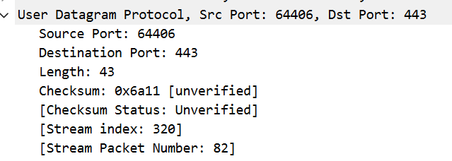
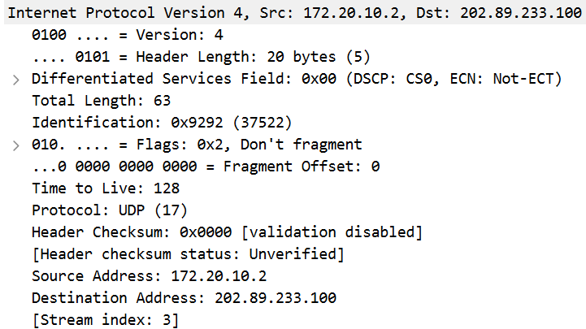
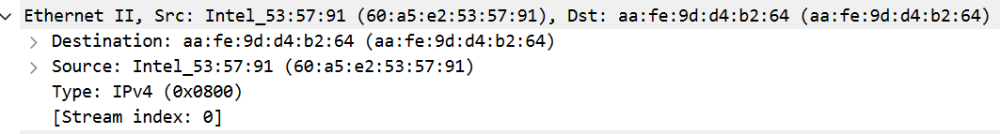
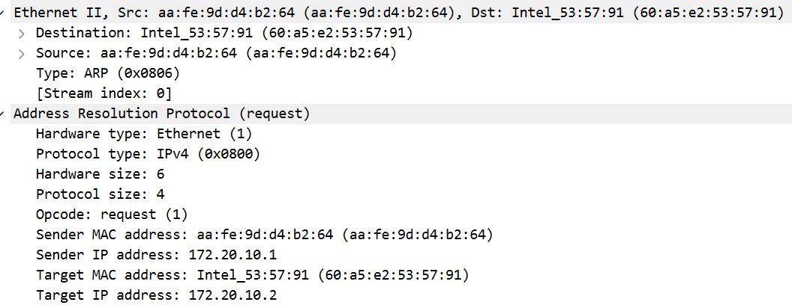
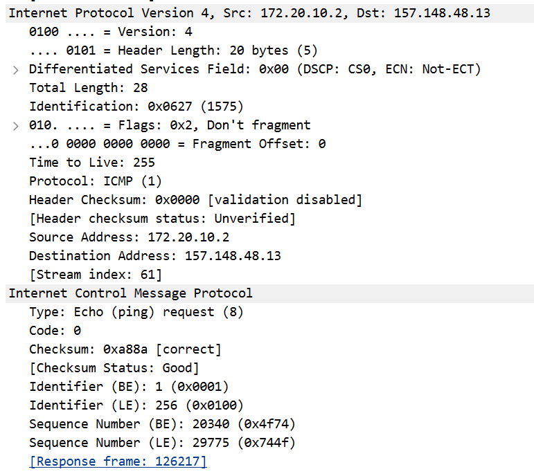

# Lab5：IP 与以太网的包收发操作

## 实验背景

本实验围绕 IP 模块与以太网在包收发过程中的角色展开，重点观察以下内容：

1. 网络包的基本结构：头部（IP 头部 + MAC 头部）与数据
2. IP 头部各字段的含义：版本号、TTL、协议号、发送方/接收方 IP 地址等
3. MAC 头部各字段的含义：接收方/发送方 MAC 地址、以太类型
4. IP 地址与 MAC 地址的区别与协作
5. ARP 协议如何通过 IP 地址查询 MAC 地址
6. 路由表的结构与查询方式
7. UDP 协议与 TCP 协议的区别：无连接、无确认、无重传
8. UDP 头部结构：发送方端口号、接收方端口号、数据长度、校验和
9. ICMP 协议的作用与常见消息类型（Echo、Destination Unreachable 等）

---

## 实验任务

### 任务一：查看路由表、ARP 缓存并启动 Wireshark

**第一步：打开 Wireshark，选择主网络接口，开始抓包**

> **注意**：本次实验必须使用真实网络接口（`en0`/`eth0`/`以太网`），不要选回环接口。回环接口不经过以太网，无法观察到 MAC 头部和 ARP 过程。

选择你的主网络接口，开始抓包。本次实验的大部分任务会共用同一次抓包。

**第二步：查看本机路由表**

```bash
# Linux
route -n
ip route show

# macOS
netstat -rn

# Windows
route print
```

截图并保存为 `route_table.png`。

**第三步：查看本机 ARP 缓存**

```bash
# Linux / macOS / Windows
arp -a
```

截图并保存为 `arp_cache.png`。

**第四步：填写下表**

从路由表和 ARP 缓存的输出中提取信息：

| 项目                         | 你的填写内容 |
| :--------------------------- | :----------- |
| 本机 IP 地址                 |172.20.10.2              |
| 本机所在子网                 | 172.20.10.0/28             |
| 子网掩码                     | 255.255.255.240             |
| 默认网关 IP                  | 172.20.10.1             |
| 默认网关 MAC 地址            |aa-fe-9d-d4-b2-64              |
| 本机网卡 MAC 地址            |60:a5:e2:53:57:91              |

简答题：

1. 路由表的每一行包含哪些关键字段？教材中提到的 `Network Destination`、`Netmask`、`Gateway`、`Interface` 分别对应什么含义？
路由表的每一行通常包含网络目标、子网掩码、网关、接口等关键字段。其中，Network Destination是该条路由对应的目标网络或主机地址；Netmask是子网掩码，用于和目标 IP 地址进行与运算，判断其是否属于该网段；Gateway是下一跳 IP 地址，即数据包要转发到的中间设备地址；Interface是本机用来发送该数据包的网卡接口 IP。


2. 当目标 IP 地址不在本子网时，包会先发给谁？路由表的哪一列提供了这个信息？
当目标 IP 地址不在本子网时，数据包会先发送给默认网关。路由表中的 “网关” 列提供了这个信息。


3. 路由表的默认网关（`0.0.0.0`）条目的作用是什么？什么时候会匹配到这一行？
默认网关（0.0.0.0）条目的作用是作为路由表的 “兜底” 路由，当没有其他更精确的路由条目匹配目标 IP 时，就会使用这条路由，将数据包转发给默认网关，实现跨网络通信。当目标 IP 地址与路由表中所有其他路由条目都不匹配时，就会匹配到这一行。


4. 教材提到，确定发送方 IP 地址的关键在于"判断应该使用哪块网卡"。结合你查到的本机网卡信息，说明 IP 模块是如何做出这个判断的。
IP 模块通过最长前缀匹配算法，根据目标 IP 地址在路由表中找到匹配的路由条目，该条目会指定对应的本机网卡接口。IP 模块会使用该网卡的 IP 地址作为源 IP，从该网卡发送数据包。例如，本机 IP 为172.20.10.2，访问同网段目标时，会匹配到本机子网的路由条目，使用172.20.10.2作为源 IP；访问外网时，会匹配到默认路由，同样使用172.20.10.2作为源 IP，通过该网卡发送给网关。


---

### 任务二：观察 UDP 头部

只要计算机处于联网状态，Wireshark 中就会持续出现大量 UDP 流量（DNS、mDNS、DHCP、NTP 等），无需手动生成。

**第一步：在 Wireshark 中设置过滤器**

```text
udp
```

**第二步：在包列表中找一个 UDP 包**

随便选一个即可。如果包太多，可以加上源或目的 IP 来缩小范围，例如 `udp && ip.addr == 你的IP`。如果需要 DNS 包，也可以用 `udp.port == 53` 过滤。

> **可选**：如果想明确看到一个完整的请求-响应对，可以在终端中执行 `nslookup example.com`，Wireshark 中就会出现对应的 DNS 请求包。

**第三步：点击选中的 UDP 包，在详情栏展开 `User Datagram Protocol`**

填写下表：

| 项目               | 你的填写内容 |
| :----------------- | :----------- |
| UDP 头部总长度     | 8 字节             |
| 源端口             |    64406          |
| 目的端口           | 443             |
| 长度（Length）     | 43             |
| 校验和（Checksum） |  0x6a11            |

简答题：

1. 你观察到的 UDP 头部长度是多少字节？TCP 头部至少 20 字节。UDP 省略了哪些字段？这些字段的缺失带来了什么后果？
我观察到的 UDP 头部长度是 8 字节。TCP 头部至少 20 字节，UDP 省略了序号、确认号、窗口大小、标志位、紧急指针等字段。这些字段的缺失，使得 UDP 是无连接的，不保证数据可靠交付，也不提供流量控制和拥塞控制，无法保证数据按序到达，也不处理丢包重传，但换来了更低的传输延迟和更高的传输效率。


2. UDP 头部中的"长度"字段指的是什么长度？
UDP 头部中的 “长度” 字段指的是整个 UDP 数据报的长度，包括 UDP 头部（8 字节）和后面的数据部分的总长度，单位是字节。




---

### 任务三：观察 IP 头部字段

点击任务二中的同一个 UDP 包，在详情栏展开 `Internet Protocol Version 4`。

填写下表：

| 字段名称               | 你的填写内容 | 含义说明 |
| :--------------------- | :----------- | :------- |
| Version（版本号）      | 4             |表示这是 IPv4 协议的数据包          |
| Header Length（头部长度） | 20 字节           | IP 头部的长度，最小值为 20 字节，最大值为 60 字节         |
| Time to Live（TTL）    | 128             |  数据包的生存时间，每经过一个路由器会减 1，防止数据包在网络中无限循环        |
| Protocol（协议号）     | 17             | 表示 IP 层承载的上层协议，17 代表 UDP 协议         |
| Source Address（源 IP） |   172.20.10.2           |  发送该数据包的主机 IP 地址，即你的本机 IP        |
| Destination Address（目的 IP） | 202.89.233.100	       | 该数据包要发往的目标主机 IP 地址         |

简答题：

1. 协议号字段的值是多少？它代表什么协议？如果抓一个 HTTP 请求的包，协议号会变成多少？
协议号字段的值是 17，它代表 UDP 协议。如果抓一个 HTTP 请求的包，协议号会变成 6，代表 TCP 协议。


2. TTL 字段的作用是什么？如果 TTL 降为 0 会发生什么？
TTL 字段的作用是限制数据包在网络中的生存时间，防止数据包在路由环路中无限转发。如果 TTL 降为 0，路由器会丢弃该数据包，并向源主机发送 ICMP 超时通知。


3. 有教材提到 IP 地址"实际上并不是分配给计算机的，而是分配给网卡的"。你的本机有几块网卡？每块网卡的 IP 地址分别是什么？（提示：可参考任务一中路由表的 Interface 列，或用 `ip addr`（Linux）/`ifconfig`（macOS）/`ipconfig`（Windows）查看。）
以你的电脑为例，本机有多块网卡：Wi-Fi 网卡（IP 为 172.20.10.2）、回环网卡（IP 为 127.0.0.1）、蓝牙网卡（无有效 IP）。IP 地址是分配给网卡的，而非计算机本身，因此一台主机的不同网卡可以拥有多个不同的 IP 地址。


4. IP 头部中的源 IP 地址和目的 IP 地址分别是谁的地址？它们与 MAC 头部中的源/目的 MAC 地址有什么区别？
IP 头部中的源 IP 和目的 IP 分别是发送方主机和接收方主机的 IP 地址，属于三层地址，在数据包从源到目的的传输过程中保持不变；MAC 头部中的源 / 目的 MAC 地址是当前链路的发送方和接收方网卡的物理地址，属于二层地址，数据包每经过一个路由器，MAC 地址都会更新为下一跳的 MAC 地址。




---

### 任务四：观察 MAC 头部与以太网帧

点击任务二中的同一个 UDP 包，在详情栏展开 `Ethernet II`。

填写下表：

| 字段名称               | 你的填写内容 | 含义说明 |
| :--------------------- | :----------- | :------- |
| Source（源 MAC）       |60:a5:e2:53:57:91              |  发送该帧的网卡物理地址，即本机无线网卡 MAC 地址        |
| Destination（目的 MAC） |aa:fe:9d:d4:b2:64              |该帧要发往的下一跳设备的物理地址，即网关 MAC 地址          |
| Type（以太类型）       |0x0800              | 表示该帧承载的上层协议为 IPv4         |

关于 MAC 地址格式，填写下表：

| 项目               | 你的填写内容 |
| :----------------- | :----------- |
| MAC 地址长度       | 48 比特（6 字节） |
| 本机网卡的 MAC 地址 | 60:a5:e2:53:57:91            |
| 目的 MAC 地址      |aa:fe:9d:d4:b2:64              |
| MAC 地址的书写格式 |十六进制表示，每两个十六进制位一组，用冒号分隔              |

简答题：

1. 以太类型字段的值是多少？它代表后面承载的是什么协议的包？
以太类型字段的值是 0x0800，它代表后面承载的是 IPv4 协议的数据包。


2. DNS 服务器的 IP 通常是外网地址。本任务中目的 MAC 地址是 DNS 服务器的 MAC 地址还是你本机网关（路由器）的 MAC 地址？为什么？
本任务中目的 MAC 地址是本机网关（路由器）的 MAC 地址。因为 DNS 服务器的 IP 是外网地址，与本机不在同一子网，根据路由规则，数据包需要先发送给默认网关，再由网关转发到外网，所以二层目的 MAC 地址是网关的 MAC 地址，而非 DNS 服务器的 MAC 地址。


3. IP 地址和 MAC 地址在功能上有什么相似之处？又有什么本质区别？
相似之处：IP 地址和 MAC 地址都用于标识网络中的设备，实现数据的寻址与转发。本质区别：IP 地址是三层逻辑地址，用于跨网络的端到端寻址，可动态分配；MAC 地址是二层物理地址，固化在网卡中，仅用于同一局域网内的链路寻址。


4. 为什么以太网帧中需要同时有 IP 地址（在 IP 头部中）和 MAC 地址？不能只用其中一种吗？
以太网帧中需要同时包含 IP 地址和 MAC 地址，不能只用其中一种。IP 地址用于跨网络的路由选择，在数据包从源主机到目的主机的传输过程中保持不变；MAC 地址用于同一链路内的直接交付，每经过一个路由器，二层 MAC 地址都会更新为下一跳设备的地址。二者分工不同，共同完成数据从源到目的的传输。




---

### 任务五：观察 ARP 协议

ARP（Address Resolution Protocol，地址解析协议）用于根据 IP 地址查询 MAC 地址。只要计算机处于联网状态，Wireshark 中通常会持续出现 ARP 包（邻居发现、缓存刷新等），可以直接观察。如果抓包一段时间后仍未看到 ARP 包，再手动触发。

**第一步：在 Wireshark 中设置过滤器**

```text
arp
```

**第二步：在包列表中找 ARP 包**

正常联网的设备每隔几分钟就会自动发送 ARP 请求，等待即可。如果等了一会儿仍没有，可以选择以下任一方式手动触发：

- **方式 A（推荐）**：在终端中执行 `arping`

  ```bash
  # Linux（通常已预装）
  sudo arping -c 3 <网关IP>

  # macOS（如果没有，先执行：brew install arping）
  sudo arping -c 3 <网关IP>

  # Windows（可从 https://github.com/ThomasHabets/arping/releases 下载）
  arping -c 3 <网关IP>
  ```

- **方式 B**：先清除 ARP 缓存，再 ping 同网段地址

  ```bash
  # 清除 ARP 缓存
  # Linux:   sudo ip neigh flush all
  # macOS:   sudo arp -d -a
  # Windows: arp -d *

  # 然后 ping 网关
  ping <网关IP> -c 2
  ```

> **注意**：如果目标是 `127.0.0.1` 或外网地址，ARP 不会出现。回环接口不经过以太网，外网地址的 MAC 地址是路由器的（通常已缓存）。

**第三步：点击 ARP 请求包（Opcode 为 request），展开详情**

**第四步：填写下表**

| 项目                     | 你的填写内容 |
| :----------------------- | :----------- |
| ARP 请求的目的 MAC 地址 | ff:ff:ff:ff:ff:ff             |
| ARP 请求中查询的目标 IP |172.20.10.2              |
| ARP 响应中返回的 MAC 地址 |60:a5:e2:53:57:91              |
| 该 ARP 包是自动出现还是手动触发的 |自动出现              |

简答题：

1. ARP 请求的目的 MAC 地址为什么是 `ff:ff:ff:ff:ff:ff`（广播地址）？
ARP 请求的目的 MAC 地址设为广播地址，是因为发送方不知道目标 IP 对应的 MAC 地址，需要通过广播的方式，将请求发送给局域网内的所有设备，让拥有目标 IP 的设备接收并回复 ARP 响应，从而获取对应的 MAC 地址。


2. 为什么 ARP 缓存中的条目会在几分钟后自动删除？
ARP 缓存条目设置超时自动删除，是为了保证网络中 IP 与 MAC 地址映射的实时性和准确性。如果设备更换了网卡、IP 地址或位置，旧的 ARP 条目会失效，自动删除可以避免使用过时的映射信息导致通信故障，同时也能减少缓存占用的系统资源。


3. 如果 ARP 缓存中的 MAC 地址已经过期（对方 IP 对应的设备已更换），会出现什么问题？如何解决？
问题：主机依然会将数据发送到旧的 MAC 地址，导致数据包无法到达新设备，出现网络通信异常、丢包或无法连接的问题。
解决方法：可以手动执行arp -d命令清除过期的 ARP 缓存条目，或者等待系统自动刷新缓存；也可以通过ping目标 IP 的方式触发新的 ARP 请求，重新获取正确的 MAC 地址映射。




---

### 任务六：使用 `ping` 命令观察 ICMP

有教材提到了 ICMP（Internet Control Message Protocol）协议，它用于在 IP 层传递错误和控制信息。`ping` 命令就是基于 ICMP 的 Echo Request（类型 8）和 Echo Reply（类型 0）实现的。

**第一步：在 Wireshark 中设置 ICMP 过滤器**

```text
icmp
```

**第二步：在终端中执行 ping 命令**

```bash
# ping 本机（回环）
ping 127.0.0.1 -c 4

# ping 局域网内的设备（如路由器网关）
ping <网关IP> -c 4

# ping 外网地址
ping 8.8.8.8 -c 4
```

**第三步：在 Wireshark 中观察 ICMP 包**

填写下表：

| 目标               | 是否收到回复 | 往返时间（ms） | TTL 值 |
| :----------------- | :----------- | :------------- | :----- |
| 127.0.0.1          |	是              |  0（或 <1）              |128        |
| 局域网设备（网关） |  	是            | <1               | 128       |
| 8.8.8.8            | 	是             | 20~50               | 105     |

> **提示**：ping 回环地址（`127.0.0.1`）时数据不经过物理网卡，Wireshark 在主网络接口上可能无法捕获到包。TTL 值可从终端输出中读取（`ping` 会显示 `ttl=...`），或切换 Wireshark 至回环接口（`lo0` / `lo`）抓包。

简答题：

1. `ping` 命令发送的是什么类型的 ICMP 消息？收到的回复又是什么类型？
ping 命令发送的是 ICMP 类型 8 的 “Echo Request（回显请求）” 消息；收到的回复是 ICMP 类型 0 的 “Echo Reply（回显应答）” 消息。


2. 为什么 ping 不同目标的 TTL 值不同？TTL 值反映了什么信息？
原因：TTL（生存时间）每经过一个路由器就会减 1，数据包经过的路由器跳数越多，到达目标时剩余的 TTL 值就越小。不同目标的网络路径不同，经过的路由器数量也不同，所以 ping 不同目标的 TTL 值会不一样。
反映的信息：TTL 值可以间接反映数据包从源主机到目标主机经过的跳数（跳数 = 初始 TTL - 剩余 TTL），也能帮助判断目标主机的操作系统类型（例如 Windows 初始 TTL 为 128，Linux 初始为 64）。


3. 教材表 2.4 中列出了多种 ICMP 消息类型。`Destination unreachable`（类型 3）在什么情况下会出现？请用以下方法尝试触发并观察：

   ```bash
   # 方法一（推荐）：ping 同网段内一个确认不存在的 IP
   # 例如你的本机 IP 是 192.168.1.100，子网掩码 255.255.255.0，
   # 那么可以 ping 192.168.1.250（一个大概率没有被分配的地址）
   ping <同网段不存在的IP> -c 3
   
   # 方法二：向一个关闭的端口发 UDP 包，触发 ICMP Port Unreachable
   # 先在 Wireshark 中保持 icmp 过滤器，然后执行：
   # Linux / macOS
   echo "test" | nc -u -w 1 <同网段某台设备的IP> 19999
   
   # Windows（需安装 nmap：https://nmap.org/download.html）
   nmap -sU -p 19999 <同网段某台设备的IP>
   ```

   观察到类型 3 的包后，记录其 Code 值（子类型）并说明代表什么含义。
出现场景：当目标网络 / 主机不可达、目标端口关闭、路由不存在，或数据包需要分片但设置了不分片标志（DF=1）时，路由器或目标主机会返回 ICMP 类型 3 的 “目标不可达” 消息。
常见 Code 值含义：
Code 0：网络不可达
Code 1：主机不可达
Code 3：端口不可达（UDP 端口未开放时常见）
Code 4：需要分片但设置了不分片标志（DF=1）




---

## 问答题

1. 网络包由哪几部分构成？IP 头部和 MAC 头部分别的作用是什么？
一个完整的网络包通常由三部分构成：以太网头部（MAC 头部）、IP 头部、数据载荷（传输层头部 + 应用层数据），尾部还有以太网 FCS 校验。
IP 头部：负责三层寻址与路由，包含源 / 目的 IP、TTL、协议号等，用于跨网络的端到端传输。
MAC 头部：负责二层链路寻址，包含源 / 目的 MAC、以太类型，用于同一局域网内的直接交付。


2. IP 协议和以太网协议在网络传输中分别承担什么职责？它们是如何分工协作的？
IP 协议（三层）：负责逻辑寻址、路由选择、分片重组，让数据包能跨多个网络传输到目标主机。
以太网协议（二层）：负责物理链路的帧封装、MAC 寻址、差错检测，让数据包能在同一网段内从一个设备传输到下一跳设备。
协作方式：IP 决定 “最终要去哪”，以太网决定 “当前一跳怎么去”。IP 数据包被封装在以太网帧中，每到一个新网段，IP 地址不变，但 MAC 地址会更新为下一跳设备的地址，通过这种接力方式完成跨网络传输。


3. ARP 协议解决的核心问题是什么？如果不使用 ARP 缓存，网络中会出现什么情况？
核心问题：将 IP 地址解析为对应的 MAC 地址，让主机知道如何将 IP 数据包封装成以太网帧。
不使用 ARP 缓存的后果：每次发送数据包都要发送一次 ARP 广播请求，导致网络中 ARP 广播泛滥，增加带宽占用和设备处理开销，严重时会造成网络拥塞。


4. 为什么 IP 和负责传输的网络（如以太网）要分开设计？这种设计带来了什么好处？
原因：为了实现网络层与数据链路层的解耦，让 IP 协议不依赖于底层的物理传输介质。
好处：IP 协议可以运行在以太网、Wi-Fi、PPP 等多种不同的链路层协议上，实现了网络的异构互联；同时底层传输技术升级（如从以太网到 5G）时，上层 IP 协议无需修改，大大提高了网络的灵活性和可扩展性。


5. 网卡在发送包时会额外添加哪 3 个控制数据？它们各自的作用是什么？
网卡会添加 前导码（Preamble）、帧起始定界符（SFD）、帧校验序列（FCS）：
前导码：用于接收方网卡同步时钟，让接收方做好接收准备。
帧起始定界符：标记以太网帧的开始，让接收方知道后面的数据是有效帧。
FCS：对整个帧进行 CRC 校验，检测传输过程中是否发生比特错误。


6. 网卡接收到一个包后，需要经过哪些步骤才能将其交给操作系统？如果 FCS 校验失败会怎样？
步骤：接收帧，同步时钟，通过前导码和 SFD 识别帧的开始。
检查目的 MAC 地址是否匹配（广播、组播或本机 MAC），不匹配则丢弃。
计算 CRC 并与 FCS 字段对比，校验帧的完整性。
校验通过后，剥除前导码、SFD 和 FCS，将有效载荷交给操作系统内核。

FCS 校验失败：说明帧在传输中出现了比特错误，网卡会直接丢弃该帧，不会交给操作系统处理。


7. TCP 和 UDP 的核心区别是什么？请从连接管理、可靠性、效率、适用场景四个维度进行比较。
连接管理：TCP 是面向连接的，通信前必须通过三次握手建立连接，通信结束后还要通过四次挥手释放连接；而 UDP 是无连接的，发送数据前不需要建立连接，直接发送数据包即可。
可靠性：TCP 提供可靠传输，通过确认应答、超时重传、流量控制和拥塞控制机制，保证数据按序、无差错、不丢失地到达；UDP 不提供任何可靠性保证，不确认、不重传，也不保证数据的顺序，数据可能丢失、乱序或重复。
效率：TCP 的首部开销较大（默认 20 字节），连接建立和维护会带来额外延迟，传输效率较低；UDP 的首部开销很小（仅 8 字节），没有连接建立和维护过程，传输延迟低、效率高。
适用场景：TCP 适合对可靠性要求高、能容忍一定延迟的场景，比如文件传输、网页浏览、邮件发送等；UDP 适合对实时性要求高、能容忍少量丢包的场景，比如视频通话、在线游戏、DNS 查询等。


8. UDP 适用于哪些场景？请结合教材内容解释为什么这些场景适合使用 UDP 而非 TCP。
UDP 适合对实时性要求高、能容忍少量丢包的场景，例如：
视频通话 / 直播：少量丢包只会造成短暂的卡顿，不会影响整体观看体验；TCP 的重传机制会导致延迟增加，反而影响实时性。
在线游戏：低延迟比 100% 可靠更重要，丢包可以通过游戏逻辑补偿；TCP 的重传和流量控制会导致操作响应延迟。
DNS 查询：单次请求响应，数据量小，建立 TCP 连接的开销远大于数据本身，UDP 更高效。
这些场景的核心需求是低延迟，而 TCP 的可靠传输机制会带来额外开销，因此 UDP 更合适。


9. 如果一个 IP 包经过多次路由转发后 TTL 降为 0，路由器会如何处理？这与教材中提到的哪种 ICMP 消息有关？
当 TTL 降为 0 时，路由器会丢弃该 IP 数据包，并向源主机发送一个 ICMP 超时消息（类型 11，Time Exceeded），通知源主机数据包因生存时间耗尽而被丢弃。


---

## 截图要求

- 截图须清晰，终端文字和 Wireshark 字段可读。
- 所有截图与本 `Lab5.md` 放在同一目录下。
- 命名规范：

| 截图内容         | 文件名               |
| :--------------- | :------------------- |
| 路由表           | `route_table.png`    |
| ARP 缓存         | `arp_cache.png`      |
| UDP 头部字段     | `udp_header.png`     |
| IP 头部字段      | `ip_header.png`      |
| 以太网帧字段     | `ethernet_frame.png` |
| ARP 请求与响应   | `arp.png`            |
| ICMP ping        | `icmp.png`           |

具体要求：

1. `route_table.png`：终端截图，显示 `route -n`（Linux）、`netstat -rn`（macOS）或 `route print`（Windows）的完整输出。

2. `arp_cache.png`：终端截图，显示 `arp -a` 的完整输出。

3. `udp_header.png`：Wireshark 截图，展开 `User Datagram Protocol`，能看到 Source Port、Destination Port、Length、Checksum。

4. `ip_header.png`：Wireshark 截图，展开 `Internet Protocol Version 4`，能看到 Version、Header Length、TTL、Protocol、Source Address、Destination Address。

5. `ethernet_frame.png`：Wireshark 截图，展开 `Ethernet II`，能看到 Source、Destination、Type。

6. `arp.png`：Wireshark 截图（若能观察到），展开 ARP 包的详情，能看到发送方的 MAC 和 IP、查询的目标 IP。

7. `icmp.png`：Wireshark 截图，能看到 ICMP Echo Request 和 Echo Reply，以及 TTL 字段。

---

## 提交要求

在自己的文件夹下新建 `Lab5/` 目录，提交以下文件：

```text
学号姓名/
└── Lab5/
    ├── Lab5.md
    ├── route_table.png
    ├── arp_cache.png
    ├── udp_header.png
    ├── ip_header.png
    ├── ethernet_frame.png
    ├── arp.png
    └── icmp.png
```

---

## 截止时间

2026-05-07，届时关于 Lab5 的 PR 请求将不会被合并。
