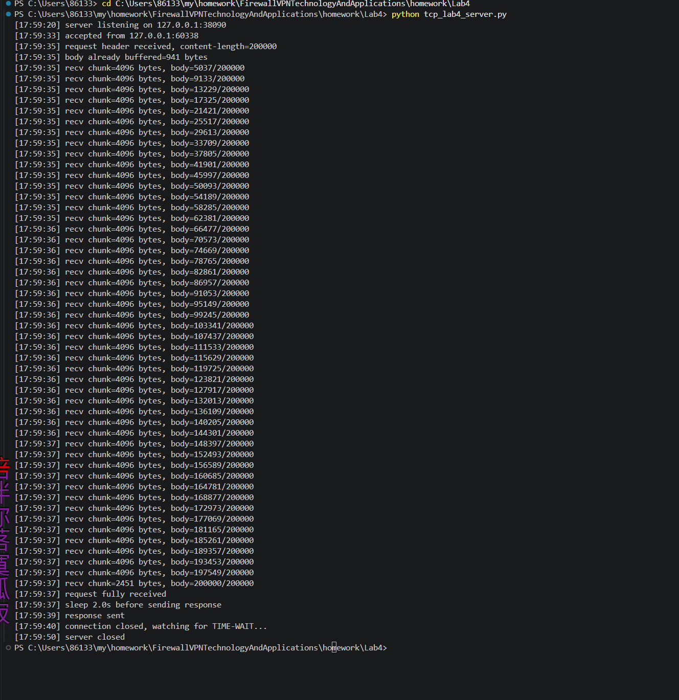
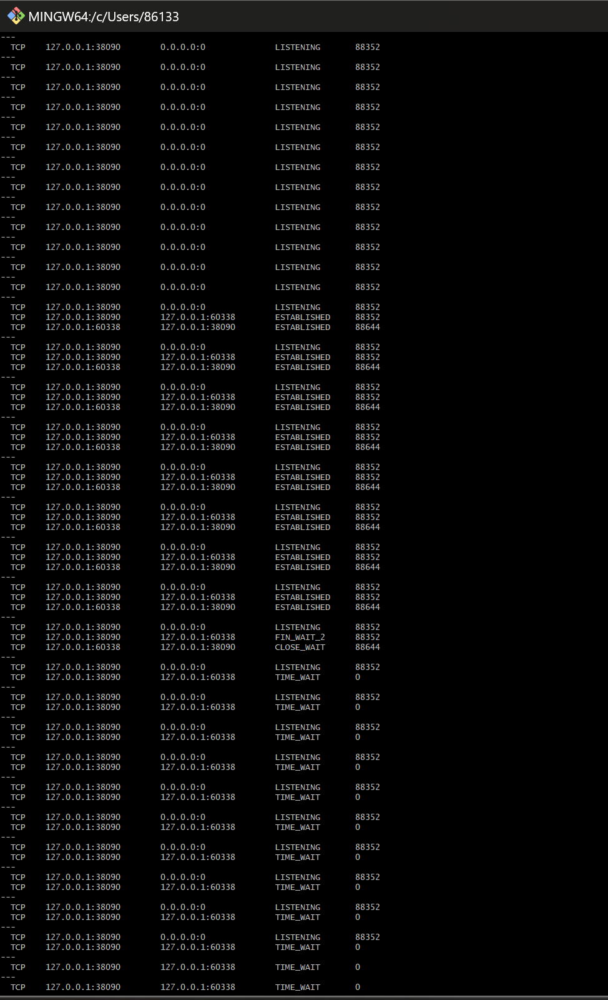
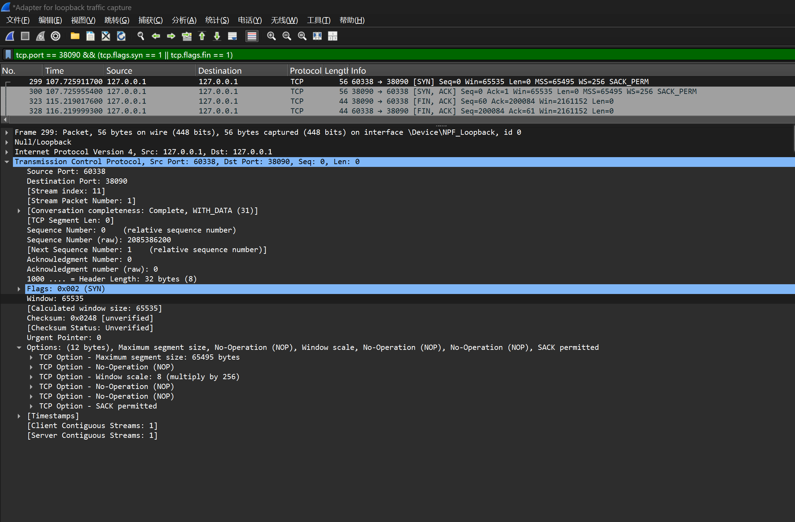
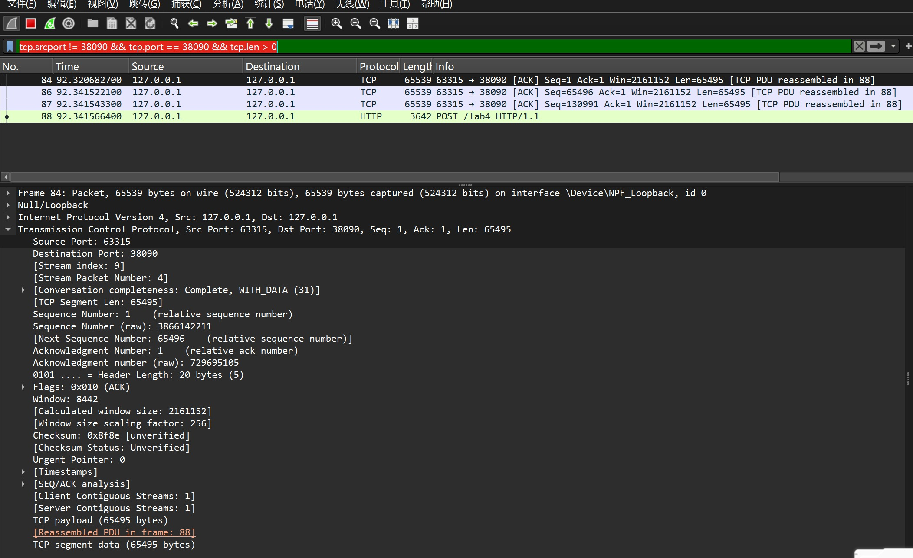
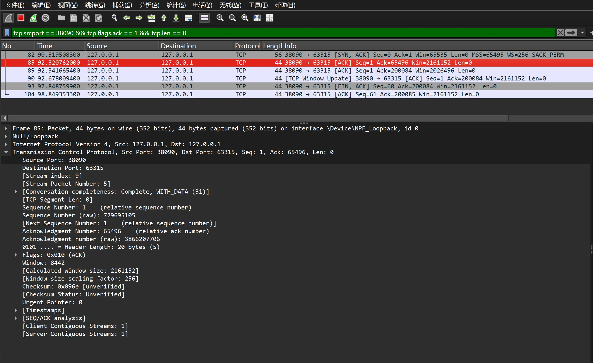
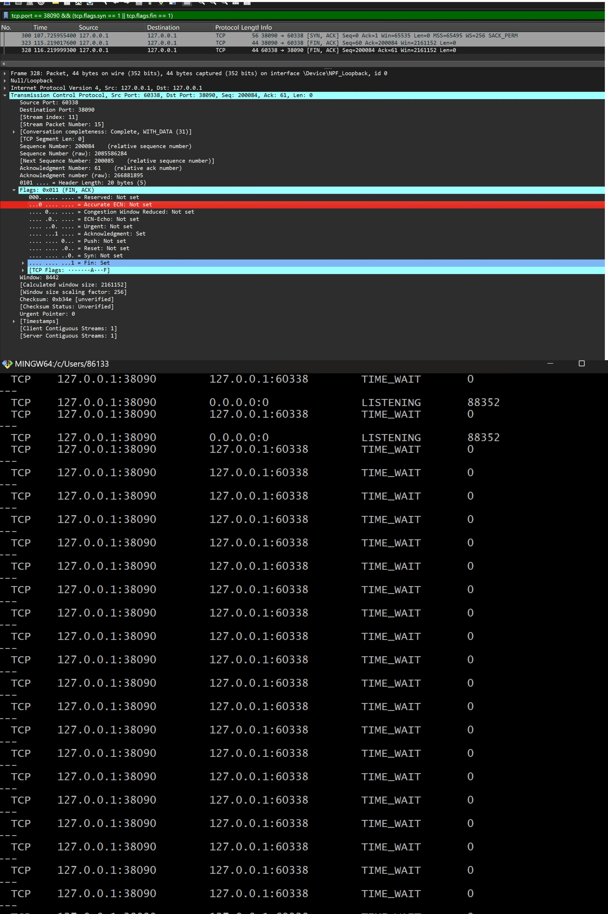

# Lab4：看见TCP 我不怕不怕啦

## 实验背景

本实验围绕一条 TCP 连接的完整生命周期展开，重点观察以下内容：

1. `socket()`、`listen()`、`accept()`、`connect()` 的职责区别
2. "连接"为什么本质上是交换控制信息而不是物理连线
3. TCP 头部中的端口号、序号、ACK 号、标志位、窗口、头部长度、可选字段
4. 三次握手如何建立收发准备
5. 应用层大块数据如何被 TCP 按 MSS 拆分
6. `Sequence Number` 与 `Acknowledgment Number` 如何配合工作
7. `recv()` 为什么会阻塞等待数据
8. 接收窗口如何反映接收方处理能力
9. ACK 与窗口更新为什么常常会被合并
10. `FIN` / `ACK` 如何完成断开
11. 为什么连接结束后套接字不会立刻删除

---

## 实验任务

### 任务一：准备实验环境并记录运行信息

**第一步：准备好四个窗口**

整个实验需要同时观察多个界面，建议在开始前把窗口布局摆好：

- **终端 A**：运行服务端
- **终端 B**：运行客户端
- **终端 C**：持续监控套接字状态（全程保持开启，不要关）
- **Wireshark**：抓包

**第二步：在终端 C 里启动持续监控**

TCP 状态变化很快，等你手动敲完 `ss` 命令再回车，状态可能已经过去了。用下面的命令让终端 C 每 0.5 秒自动刷新一次，之后只需要盯着这个窗口就行：

```bash
# Linux
watch -n 0.5 'ss -tan | grep 38090'

# macOS（没有 watch，用循环代替）
while true; do netstat -an | grep 38090; echo "---"; sleep 0.5; done

# Windows（Git Bash执行）
while true; do netstat -ano | grep 38090; echo "---"; sleep 0.5; done
```

如果你换了端口，把 `38090` 替换成实际端口。

**第三步：打开 Wireshark，选回环接口，填好过滤器，开始抓包**

回环接口在不同系统里名字不同：

| 系统 | 接口名 |
|:-----|:-------|
| Linux | `lo` |
| macOS | `lo0` |
| Windows | `Adapter for loopback traffic capture`（需提前安装 Npcap 并勾选回环支持） |

在显示过滤器里输入：

```text
tcp.port == 38090
```

然后点击开始抓包（蓝色鲨鱼鳍图标）。**先开始抓包，再运行脚本**，否则握手包会被漏掉。

**第四步：启动脚本**

```bash
# 终端 A
python3 tcp_lab4_server.py

# 终端 B（等服务端打印出 server listening on ... 后再运行）
python3 tcp_lab4_client.py
```

如果 `38090` 已被占用，两端都加环境变量换端口，同时记得把 Wireshark 过滤器和终端 C 里的端口号也改掉：

```bash
LAB4_PORT=38123 python3 tcp_lab4_server.py
LAB4_PORT=38123 python3 tcp_lab4_client.py
```

**第五步：填写下表**

| 项目                                | 你的填写内容 |
| :---------------------------------- | :----------- |
| 服务端监听地址                      |127.0.0.1|
| 服务端监听端口                      |38090|
| 客户端本地临时端口                  |60338|
| 客户端请求总字节数                  |200000|
| 服务端响应内容                      |服务端在接收完200000字节请求后，睡眠2秒，于17:59:39发送响应，随后关闭连接|
| 客户端 `connect()` 返回前后的时间点 |调用时间：[17:59:33] calling connect()返回时间：[17:59:35] connect() returned|
| 客户端首次收到响应前等待了多久      |约4秒（17:59:35 connect返回 → 17:59:39响应发送，客户端等待约4秒）|

各项数值均可直接从终端输出读取：服务端监听信息在 `server listening on ...`，客户端本地端口在 `local socket = ...`，请求字节数在 `sendall() start, request bytes=...`，等待时间在 `first recv() returned after ...s`。



---

### 任务二：观察套接字创建与连接建立

1. 服务端启动后，观察终端 C 出现 `LISTEN` 状态，截图留存。
2. 在终端 B 里启动客户端，观察它依次打印 `socket created`、`calling connect()`、`connect() returned`。
3. 客户端打印 `connect() returned` 之后，观察终端 C 出现 `ESTABLISHED`，截图留存。脚本在 `connect()` 返回后有 2 秒停顿，这段时间足够截图。

填写下表：

| 阶段                             | 你的填写内容 |
| :------------------------------- | :----------- |
| 服务端启动、客户端未连入时的状态 |服务端：LISTENING（监听状态）客户端：无连接（未启动）|
| `connect()` 返回后服务端状态     |ESTABLISHED（已建立连接状态）|
| `connect()` 返回后客户端状态     |ESTABLISHED（已建立连接状态）|

简答题：

1. 服务端在客户端连接前为什么处于 `LISTEN`？
    答：TCP 是面向连接的可靠传输协议，服务端作为连接的被动接收方，必须先通过 listen() 系统调用将套接字设置为 LISTEN（监听）状态，让内核为该端口维护连接请求队列，被动等待客户端的 SYN 连接请求；只有处于该状态，服务端才能接收客户端的连接请求、完成三次握手，若未开启监听，客户端的连接请求会被系统直接拒绝，同时该状态也支持多客户端连接排队，避免请求丢失。

2. 为什么这时还没有真正建立 TCP 连接？
    答：LISTEN 状态仅代表服务端完成了套接字创建、端口绑定与监听启动，仅处于等待连接的预备状态，而 TCP 连接的建立需要完整的三次握手流程；此时客户端未发起 SYN 连接请求，三次握手未执行，双方未同步序号、确认窗口等核心连接参数，因此并未真正建立 TCP 连接。

3. `socket()` 与 `connect()` 的区别是什么？
    答：socket() 的作用是创建一个原始套接字，仅完成内核资源分配、指定 TCP 协议类型，属于连接建立的前置准备操作，仅创建套接字对象，不涉及任何连接行为；而 connect() 是客户端主动发起的操作，核心作用是执行 TCP 三次握手，向服务端请求建立连接，只有该操作完成后，套接字才会从无连接状态变为可收发数据的已连接状态，二者的本质区别在于：socket() 仅创建套接字，connect() 才是真正发起并完成连接建立的操作。

4. 为什么 `connect()` 返回后才进入可稳定收发数据的状态？
    答：connect() 是阻塞式调用，只有当 TCP 三次握手完全完成后才会返回；三次握手的核心作用是同步双方的初始序号、确认窗口、MSS 等 TCP 传输参数，确认双方的接收能力，只有三次握手完成，双方才会进入 ESTABLISHED 已建立连接状态，此时才能保证数据的稳定、可靠收发，因此 connect() 返回后才进入可稳定收发数据的状态。

5. 为什么"网线一直连着"不等于"TCP 连接已经建立"？
    答：网线连通属于物理层与数据链路层的硬件连通性，仅代表物理链路正常、可传输数据包，是 TCP 连接的物理基础；而 TCP 连接是传输层的端到端逻辑连接，需要通过三次握手完成双方状态、序号、窗口等参数的同步，二者分属不同网络层级，即使网线物理连通，若服务端未监听、三次握手未完成，TCP 连接依然无法建立，因此网线连通不等于 TCP 连接已建立。

6. 这里的"连接"更准确地说是在做什么？
    答：这里的 TCP 连接，本质是客户端与服务端通过三次握手，完成双方 TCP 状态、初始序号、接收窗口等传输参数的同步，建立一条双向、可靠、面向字节流的端到端逻辑通信链路，核心是完成三次握手的参数协商，让双方进入 ESTABLISHED 状态，实现数据的可靠有序传输，而非建立物理链路。




---

### 任务三：观察三次握手与 TCP 头部字段

**定位握手包**：在 Wireshark 过滤器里输入下面的条件，可以屏蔽中间的数据包，只留下握手和断开阶段的控制包：

```text
tcp.port == 38090 && (tcp.flags.syn == 1 || tcp.flags.fin == 1)
```

包列表最前面的三个包就是三次握手（SYN → SYN-ACK → ACK）。

**找到各字段的位置**：点击某个握手包，在下方详情栏展开 `Transmission Control Protocol`。源端口、目的端口、Seq、Ack、Flags、Window、Header Length 都在这里。TCP 选项在最底部的 `Options` 子项里，展开后可以看到 MSS、Window Scale、SACK Permitted，注意这三项只出现在带 SYN 标志的包里，纯 ACK 包里没有。

**关于序号显示**：Wireshark 默认开启相对序号，会把每个方向的初始序号归零显示，所以 SYN 包的 Seq 看起来是 `0`，而不是真实的随机大数。这是正常现象，实验报告按 Wireshark 显示的值填写即可。如果你想看真实值，可以去 `Edit → Preferences → Protocols → TCP` 里取消勾选 `Relative sequence numbers`。

填写下表：

| 报文       | 源端口 | 目的端口 | Seq  | Ack  | Flags | Window | Header Length |
| :--------- | :----- | :------- | :--- | :--- | :---- | :----- | :------------ |
| 第一次握手 |60338|38090|0|0|SYN| 65535|32字节 |
| 第二次握手 |38090|60338|0|1|SYN，ACK|65535|32字节|
| 第三次握手 |60338|38090|1|60|ACK|2161152|32字节|

第一次握手（SYN）的 Ack 字段在 Wireshark 里通常显示为空或 `0`，这是正常的，因为此时客户端还没有收到服务端的任何数据。Header Length 在没有选项时是 20 字节，握手包因为携带了 MSS 等选项通常是 28 或 32 字节。

| TCP 选项       | 你的填写内容 |
| :------------- | :----------- |
| MSS            |65495|
| Window Scale   |8（即 2⁸=256 倍窗口放大）|
| SACK Permitted |是（开启）|

回环接口的 MSS 通常是 65495（因为回环 MTU 是 65536，比以太网的 1500 大得多），这会影响后续任务五里是否能观察到分段。

简答题：

1. 发送方和接收方端口号在连接阶段的作用是什么？
    答：端口号是传输层用于区分同一主机上不同应用进程的标识，在 TCP 连接阶段，发送方（客户端）的临时端口与接收方（服务端）的监听端口共同构成了 TCP 连接的四元组（源 IP、源端口、目的 IP、目的端口），是唯一标识一条 TCP 连接的核心要素。服务端通过监听端口被动等待连接，客户端通过源端口发起连接请求，双方依靠端口号将收到的数据包正确交付给对应的应用进程，实现同一主机上多应用的并发通信，同时确保连接建立、数据传输与关闭的全流程中，数据包能精准匹配到对应的套接字。


2. TCP 头部如何帮助找到目标套接字？
    答：TCP 头部通过源 IP、源端口、目的 IP、目的端口这四元组信息，结合协议类型（TCP），在操作系统内核中唯一匹配到对应的套接字：当主机收到 TCP 数据包时，内核会提取头部的四元组信息，在本地套接字列表中检索匹配的条目，将数据包交付给对应的套接字，从而完成数据从网络到应用进程的传递。同时 TCP 头部的序号、确认号等字段，也会辅助套接字维护连接状态、处理数据重传与流量控制，确保数据的可靠传输。


3. 为什么初始序号不是简单固定从 1 开始？
    答：TCP 的初始序号（ISN）采用随机生成的方式，而非固定从 1 开始，核心是为了提升 TCP 连接的安全性与可靠性：一方面，随机 ISN 可以防止攻击者伪造旧连接的数据包，干扰新连接的正常通信，避免历史连接的延迟数据包被误判为新连接的数据；另一方面，固定初始序号容易被攻击者预测，从而发起连接劫持、数据篡改等攻击，随机 ISN 大幅提升了攻击难度，保障了 TCP 连接的安全性，同时也符合 TCP 协议的设计规范，确保连接的唯一性与可靠性。


4. 为什么 TCP 可选字段更容易在连接阶段看到？
    答：TCP 可选字段（如 MSS、Window Scale、SACK Permitted 等）的核心作用是协商连接建立阶段的传输参数，仅在三次握手的 SYN 包中携带：这些选项用于双方协商最大分段大小、窗口放大系数、选择性确认等传输特性，只有在连接建立阶段完成参数协商，后续数据传输阶段才能按照协商的参数进行可靠传输；而在数据传输阶段，TCP 头部仅携带必要的控制字段，无需重复传输可选参数，因此可选字段仅出现在连接建立的 SYN 包中，在连接阶段更容易观察到。




---

### 任务四：区分头部中的控制信息和套接字中的控制信息

用以下过滤器分别找到两类报文：

```text
# 纯控制报文（无应用数据）
tcp.port == 38090 && tcp.len == 0

# 携带应用数据的报文
tcp.port == 38090 && tcp.len > 0
```

从纯控制报文里选一个（SYN、纯 ACK 或 FIN-ACK 都可以），从数据报文里选一个（客户端发请求或服务端发响应的包）。

填写下表：

| 项目                   | 你的填写内容 |
| :--------------------- | :----------- |
| 纯控制报文的类型       |SYN 报文（tcp.len == 0过滤结果中的 No.81）|
| 携带应用数据的报文类型 |客户端 HTTP 请求 TCP 分段报文（tcp.len > 0过滤结果中的 No.84/86/87）|
| 头部中的控制信息举例   |SYN/ACK 标志位、序号 (Seq)、确认号 (Ack)、窗口大小 (Window)、MSS|
| 套接字中的控制信息举例 |连接状态 (LISTENING/ESTABLISHED)、发送 / 接收缓冲区、超时重传定时器|

简答题：

1. 为什么"头部中的控制信息"和"套接字中的控制信息"不是同一件事？
答：头部控制信息（如 SYN/ACK/FIN 标志、序号、窗口大小等）存在于 TCP 报文头，是网络中传输、对端可见的端到端数据，用于保障 TCP 可靠传输；套接字控制信息（如连接状态、缓冲区、定时器等）存在于操作系统内核，是本地维护、对端不可见的进程级数据，用于管理本地连接。二者层级、作用域、生命周期完全不同，是相互独立的两类控制信息。


---

### 任务五：观察数据分段、序号与 ACK

客户端发送的请求体是 200000 字节，超过了回环接口 MSS（约 65495 字节），因此应该可以在 Wireshark 里看到多个连续的数据段。用下面的过滤器找到客户端发出的数据包：

```text
tcp.srcport != 38090 && tcp.port == 38090 && tcp.len > 0
```

在包列表里连续选几个数据段，对比它们的 Seq 值。相邻两段的关系是：后一段的 Seq = 前一段的 Seq + 前一段的 TCP Segment Len。

找服务端返回给客户端的纯 ACK 报文：

```text
tcp.srcport == 38090 && tcp.flags.ack == 1 && tcp.len == 0
```

填写下表：

| 数据段  | Seq  | Ack  | TCP Segment Len | Flags |
| :------ | :--- | :--- | :-------------- | :---- |
| 第 1 段 |1|1|65495|ACK|
| 第 2 段 |65496|1|65495|ACK|
| 第 3 段 |130991|1|65495|ACK|

| ACK 报文 | Ack Number | Flags | Window |
| :------- | :--------- | :---- | :----- |
| 第 1 个  |65496|ACK|2161152|
| 第 2 个  |200084|ACK|2026496|
| 第 3 个  |200085|ACK|2161152|

| 项目                         | 你的填写内容 |
| :--------------------------- | :----------- |
| 是否发生分段                 |是|
| 握手中观察到的 MSS           |65495|
| 单段长度与 MSS 的关系        |单段长度等于 MSS（65495 字节），最后一段小于 MSS|
| ACK 号大致确认到了第几个字节 |第 200084 字节（对应 200000 字节请求的完整确认）|

简答题：

1. 应用程序是否直接决定每个网络包的数据长度？为什么？
答：否。应用程序仅通过sendall()提交大块数据，网络包的长度由操作系统内核的 TCP 协议栈根据 “MSS（最大分段大小）”自动拆分决定，应用程序无法直接控制单个网络包的长度。

2. 大块应用数据为什么会被拆分？
答：因为链路层有 **MTU（最大传输单元）** 限制，单个 IP 数据包不能超过 MTU 大小，因此 TCP 会将大块应用数据拆分为多个不超过 MSS 的分段，确保能在网络中正常传输。

3. `MSS` 与 `MTU` 的关系是什么？
答：MSS（最大分段大小）= MTU（最大传输单元）- IP 头部长度 - TCP 头部长度。回环接口 MTU 为 65536，因此 MSS=65536-20-20=65495，MSS 是 TCP 层的分段上限，由 MTU 决定。

4. "一次 `sendall()`"与"一个 TCP 包"之间是什么关系？
答：一次sendall()是应用层的一次数据发送操作，会被 TCP 协议栈拆分为多个 TCP 分段包发送，二者不是一一对应关系：一次sendall()对应多个 TCP 包。

5. 为什么 ACK 体现的是累计确认？
答：TCP 的 ACK 号表示「已成功接收所有序号小于该值的字节，期望下一个收到的字节序号为该值」，是对之前所有数据的累计确认，而非对单个分段的确认，以此保障数据的可靠传输。

6. 如果中间某一段丢失，ACK 会出现什么变化？
答：接收方会持续回复重复的 ACK（确认号为丢失分段的起始序号），触发发送方的快速重传机制，重传丢失的分段，直到该分段被成功接收、ACK 号正常递增。





---

### 任务六：观察 `recv()` 阻塞与窗口字段

`recv()` 的等待时间直接从客户端终端读取，`calling recv() and waiting for response` 到 `first recv() returned after ...s` 之间就是等待时长，脚本已经帮你计算好了。

在 Wireshark 里找窗口值：用过滤器 `tcp.port == 38090 && tcp.flags.ack == 1` 列出所有 ACK 包，点击其中一个，在详情栏 `Transmission Control Protocol` 里找 `Window` 字段。如果同时显示了 `Calculated window size`，优先看这个值，它已经把 Window Scale 的缩放算进去了，是对方实际能接收的字节数。

如果包列表的 Info 列出现了 `[TCP Window Update]` 标注，说明这个包的主要目的是通知对方窗口变化，重点观察它的 `Window` 字段。

填写下表：

| 项目                                   | 你的填写内容 |
| :------------------------------------- | :----------- |
| 客户端开始调用 `recv()` 的时间         |59:35|
| 客户端第一次收到响应的时间             |59:39|
| `recv()` 是否立刻返回                  |否|
| 首次收到响应前等待了多久               |约 4.492 秒|
| `recv()` 等待期间连接是否已经建立      |是|
| 第 1 个 ACK 报文的窗口值               |2161152|
| 第 2 个 ACK 报文的窗口值               |2026496|
| 第 3 个 ACK 报文的窗口值               |2161152|
| 窗口值是否变化                         |是|
| 若变化，变化趋势                       |先小幅下降，后恢复初始值|
| ACK 与窗口更新是否可以出现在同一个包中 |是|
| 是否看到 RTT 或 ACK 往返时间相关信息   |是|

简答题：

1. "连接建立"和"应用收到数据"之间是什么关系？
答：连接建立是应用收到数据的前提：TCP 三次握手完成后，连接进入ESTABLISHED状态，应用才能通过recv()接收数据；但连接建立不代表数据立刻到达，recv()会阻塞等待数据传输完成。


2. 为什么说 `read` / `recv` 在数据未到达时会被挂起？
答：recv()是阻塞式系统调用，当套接字接收缓冲区无数据时，进程会被内核挂起（进入睡眠状态），直到数据到达、缓冲区有数据可读，才会被唤醒并返回数据，以此实现同步等待。


3. 窗口字段反映了接收方哪方面的能力？
答：窗口字段反映了接收方当前可接收的字节数（接收缓存剩余空间），是接收方流量控制能力的体现，用于告知发送方自己的接收上限。


4. 为什么发送方不能无限制连续发送数据？
答：发送方受接收方窗口大小限制：若发送数据超过接收方窗口，会导致接收方缓存溢出、数据丢失；同时 TCP 的滑动窗口机制会控制发送速率，匹配接收方的处理能力。


5. 滑动窗口为什么既提高效率又避免压垮接收方？
答：滑动窗口允许发送方在收到 ACK 前连续发送多个分段，提升了传输效率；同时窗口大小由接收方动态调整，发送方不能超过窗口上限发送，避免了接收方缓存溢出，实现了流量控制。


---

### 任务七：观察响应返回与双向 `seq/ack`

TCP 的 Seq/Ack 是双向独立的，客户端有自己的发送序号，服务端有自己的发送序号。用下面的过滤器只看服务端发出的数据包（源端口是 38090，有应用数据）：

```text
tcp.srcport == 38090 && tcp.len > 0
```

紧跟在服务端数据包后面的、客户端发出的 ACK 包，其 Ack Number 确认的就是服务端的发送序号。

填写下表：

| 项目                     | 你的填写内容 |
| :----------------------- | :----------- |
| 服务端响应数据报文的 Seq |60|
| 服务端响应数据报文的 Ack |200084|
| 客户端确认报文的 Ack     |61|

简答题：

1. 为什么 TCP 的 `seq/ack` 是双向分别计算的？
答：TCP 是全双工通信协议，客户端和服务端是两个独立的发送 / 接收方向，各自维护独立的序号空间，分别对自己发送的数据进行编号、对对方数据进行确认，因此seq/ack双向独立计算。


2. 为什么双方都需要各自的初始序号？
答：初始序号（ISN）用于标识双向数据流的起始，双方独立生成随机 ISN，可避免历史连接的延迟数据包干扰新连接，提升连接安全性，同时保障双向数据传输的序号独立性与可靠性。


3. 为什么发送应用数据时报文通常仍然带 `ACK`？
答：TCP 采用 “ 捎带确认（piggybacking）” 机制：发送应用数据时，可同时携带对对方数据的 ACK，无需单独发送纯 ACK 包，减少了网络报文数量，提升了传输效率，因此数据报文通常带 ACK 标志。


---

### 任务八：观察连接断开与套接字延迟删除

用下面的过滤器精确定位所有带 FIN 的包：

```text
tcp.port == 38090 && tcp.flags.fin == 1
```

通常会看到两个 FIN 包（双方各一个）。看第一个 FIN 包的源端口，就能判断谁先发起断开。

**关于 TIME-WAIT**：TIME-WAIT 只出现在主动发起关闭的一方（先发 FIN 的那端）。服务端脚本在 `conn.close()` 之后会继续运行 10 秒再退出，这段时间可以在终端 C 里观察 TIME-WAIT。Linux 上 TIME-WAIT 通常持续约 60 秒，macOS 上可能较短，如果没有观察到请如实说明。

填写下表：

| 项目                                    | 你的填写内容 |
| :-------------------------------------- | :----------- |
| 谁先发送 FIN                            |服务端（端口 38090）|
| 关闭阶段共观察到几个带 FIN 的报文       |2个|
| 最终 ACK 是否可见                       |可见|
| 关闭后是否观察到 `TIME-WAIT` 或等价现象 |是，观察到大量TIME_WAIT状态|

简答题：

1. 为什么关闭连接不能只发一个结束通知？
    答：TCP 是面向连接的双向通信协议，连接的关闭需要双方各自确认、完成四次挥手流程。仅发送一个 FIN 通知只能关闭单向数据流，无法确保双方都完成数据发送与接收，必须通过双向的 FIN+ACK 交互，才能保证双方都确认连接关闭，避免数据丢失，因此不能只发一个结束通知。


2. 为什么连接结束后套接字不会立刻删除？
    答：连接关闭后，主动关闭方会进入 TIME_WAIT 状态，套接字需要等待 2MSL（最长报文寿命）超时后才会彻底删除。这是为了确保最后一个 ACK 被对方成功接收，防止旧连接的延迟数据包干扰新连接，同时保证双方都能可靠完成连接关闭，因此套接字不会立刻删除。


3. 如果最后一个 ACK 丢失，而旧套接字已经立刻删除，可能带来什么问题？
    答：若最后一个 ACK 丢失且套接字立刻删除，服务端会因未收到 ACK 而重发 FIN 包，此时客户端已无对应套接字，会直接返回 RST 复位包，导致服务端连接异常；同时旧连接的残留数据包可能被误判为新连接的数据，干扰新连接的正常通信，破坏 TCP 的可靠性。




---

## 问答题

1. TCP 的"连接"到底意味着什么？它为什么不是"把网线连上"？
    答：TCP 的连接本质是客户端与服务端通过三次握手，完成双方 TCP 状态、序号、窗口等传输参数的同步，建立一条双向、可靠、面向字节流的端到端逻辑通信链路；而网线连通属于物理层的硬件连通，仅代表物理链路正常，是 TCP 连接的物理基础，二者分属不同网络层级，因此网线连通不等于 TCP 连接已建立。


2. 三次握手为什么能让双方进入可通信状态？
    答：三次握手的核心作用是同步双方的初始序号、确认窗口、MSS 等 TCP 传输参数，确认双方的接收能力，只有三次握手完成，双方才会进入 ESTABLISHED 已建立连接状态，此时才能保证数据的稳定、可靠收发，因此三次握手能让双方进入可通信状态。


3. TCP 头部中的控制字段如何支撑收发数据？
    答：TCP 头部的 SYN/FIN/ACK/PSH 等控制字段，分别用于连接建立、连接关闭、数据确认、数据推送等核心操作：SYN 用于三次握手建立连接，FIN 用于四次挥手关闭连接，ACK 用于确认数据接收，PSH 用于推送数据，这些字段共同保障了 TCP 的可靠、有序传输，支撑收发数据的全流程。


4. ACK、窗口、等待时间为什么会共同影响 TCP 的可靠传输？
    答：ACK 用于确认数据接收，确保数据不丢失；窗口用于流量控制，避免发送方发送过快导致接收方溢出；等待时间（如 TIME_WAIT 的 2MSL）用于确保连接关闭的可靠性，三者分别从确认、流量控制、连接关闭三个维度保障 TCP 的可靠传输，缺一不可。


5. 断开连接为什么仍然需要严格的控制信息交换？
    答：TCP 是面向连接的协议，断开连接需要通过四次挥手完成双方状态的同步，确保双方都完成数据发送与接收，避免数据丢失；严格的控制信息交换（FIN+ACK 交互）能保证连接的可靠关闭，防止残留数据包干扰新连接，因此断开连接仍需严格的控制信息交换。


6. 如果服务端根本没有启动，客户端调用 `connect()` 时会看到什么现象？
    答：客户端会收到ConnectionRefusedError（WinError 10061），连接被系统直接拒绝，Wireshark 中会捕获到大量 RST 复位包，客户端无法完成三次握手，无法建立连接。


7. 如果中途人为制造丢包，ACK、重传、窗口之间会出现什么变化？
    答：丢包后，接收方会回复重复的 ACK，触发发送方的快速重传；发送方会重传丢失的数据包，同时接收方的窗口会根据接收情况调整，可能出现窗口缩小甚至零窗口，直到丢包问题解决，连接恢复正常。


8. 如果把客户端发送的数据改得更大，窗口字段和分段情况会如何变化？
    答：数据量增大后，TCP 分段数量会增加，每个分段的 PSH,ACK 包会持续传输；窗口字段会根据接收方的接收能力动态调整，若接收方处理速度不变，窗口会逐渐缩小，甚至出现零窗口，直到数据传输完成。


9. 如果把服务端读取速度改得更慢，是否更容易看到窗口更新甚至零窗口？
    答：是的，服务端读取速度变慢后，接收缓存会被占满，TCP 窗口会持续缩小，最终出现零窗口，此时客户端会停止发送数据，等待服务端窗口更新，因此更容易观察到窗口更新甚至零窗口现象。 


---

## 截图要求

- 截图须清晰，终端文字和 Wireshark 字段可读。
- 所有截图与本 `Lab4.md` 放在同一目录下。
- 命名规范：

| 截图内容               | 文件名                  |
| :--------------------- | :---------------------- |
| 服务端与客户端运行结果 | `run.png`               |
| `ss` 状态变化          | `states.png`            |
| 三次握手与 TCP 选项    | `handshake_header.png`  |
| 大请求分段与 MSS       | `segmentation.png`      |
| ACK 与窗口观察         | `ack_window.png`        |
| 断开与最终状态         | `teardown_timewait.png` |

具体要求：

1. `run.png`：终端截图，至少能看到服务端 `server listening on ...`、客户端 `calling connect()`、`connect() returned`、`calling recv() and waiting for response`、`first recv() returned after ...s`。

2. `states.png`：终端截图，至少能看到 `LISTEN`、`ESTABLISHED`，以及 `TIME-WAIT`（若能观察到）。推荐截 `watch` 命令的持续输出画面，可以在一张截图里同时展示多个状态的变化过程。

3. `handshake_header.png`：Wireshark 截图，至少能看到三次握手中某个包的 `Source Port`、`Destination Port`、`Sequence Number`、`Acknowledgment Number`、`Flags`、`Window`，以及 `Options` 中的 `Maximum segment size`、`Window Scale`、`SACK Permitted`。

4. `segmentation.png`：Wireshark 截图，至少能看到客户端发送数据的 TCP 包的 `TCP Segment Len`、`Seq`、`Ack`。若能观察到分段，尽量截出多个连续数据段。

5. `ack_window.png`：Wireshark 截图，至少能看到一个或多个 ACK 报文的 `Acknowledgment Number`、`Window`，以及 `Calculated window size`（若显示）、`[TCP Window Update]`（若出现）。

6. `teardown_timewait.png`：Wireshark 截图或 Wireshark 与终端截图的拼图，至少能看到带 `FIN` 的包，以及 `TIME-WAIT` 状态（若能观察到）。

---

## 提交要求

在自己的文件夹下新建 `Lab4/` 目录，提交以下文件：

```text
学号姓名/
└── Lab4/
    ├── Lab4.md
    ├── tcp_lab4_server.py
    ├── tcp_lab4_client.py
    ├── run.png
    ├── states.png
    ├── handshake_header.png
    ├── segmentation.png
    ├── ack_window.png
    └── teardown_timewait.png
```

---

## 截止时间

2026-04-23，届时关于 Lab4 的 PR 请求将不会被合并。
