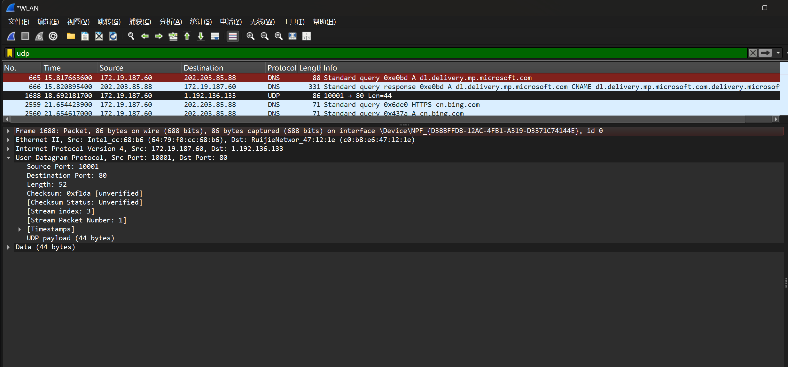
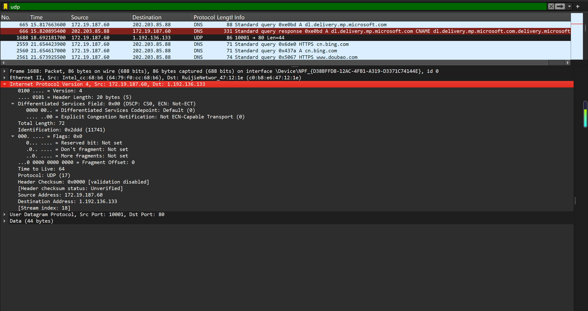
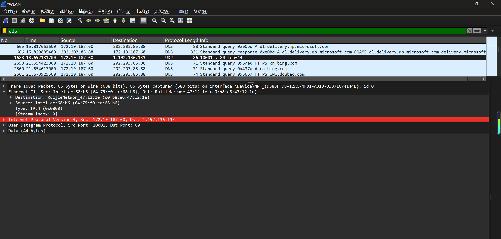
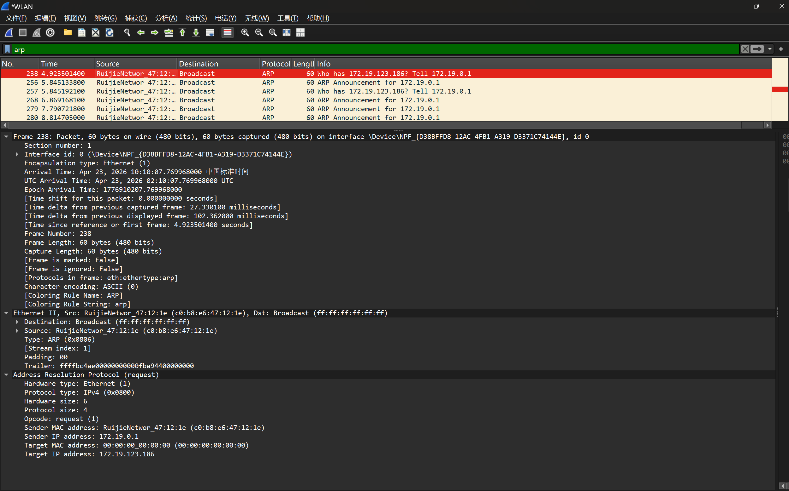
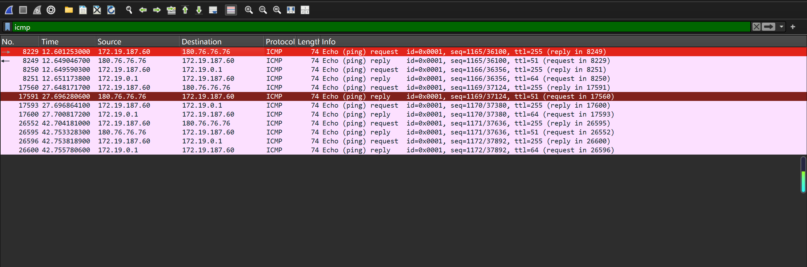

# Lab5：IP 与以太网的包收发操作

## 实验背景

本实验围绕 IP 模块与以太网在包收发过程中的角色展开，重点观察以下内容：

1. 网络包的基本结构：头部（IP 头部 + MAC 头部）与数据
2. IP 头部各字段的含义：版本号、TTL、协议号、发送方/接收方 IP 地址等
3. MAC 头部各字段的含义：接收方/发送方 MAC 地址、以太类型
4. IP 地址与 MAC 地址的区别与协作
5. ARP 协议如何通过 IP 地址查询 MAC 地址
6. 路由表的结构与查询方式
7. UDP 协议与 TCP 协议的区别：无连接、无确认、无重传
8. UDP 头部结构：发送方端口号、接收方端口号、数据长度、校验和
9. ICMP 协议的作用与常见消息类型（Echo、Destination Unreachable 等）

---

## 实验任务

### 任务一：查看路由表、ARP 缓存并启动 Wireshark

**第一步：打开 Wireshark，选择主网络接口，开始抓包**

> **注意**：本次实验必须使用真实网络接口（`en0`/`eth0`/`以太网`），不要选回环接口。回环接口不经过以太网，无法观察到 MAC 头部和 ARP 过程。

选择你的主网络接口，开始抓包。本次实验的大部分任务会共用同一次抓包。

**第二步：查看本机路由表**

```bash
# Linux
route -n
ip route show

# macOS
netstat -rn

# Windows
route print
```

截图并保存为 `route_table.png`。

**第三步：查看本机 ARP 缓存**

```bash
# Linux / macOS / Windows
arp -a
```

截图并保存为 `arp_cache.png`。

**第四步：填写下表**

从路由表和 ARP 缓存的输出中提取信息：

| 项目                         | 你的填写内容 |
| :--------------------------- | :----------- |
| 本机 IP 地址                 |172.19.187.60|
| 本机所在子网                 |172.19.0.0/16|
| 子网掩码                     |255.255.0.0|
| 默认网关 IP                  |172.19.0.1|
| 默认网关 MAC 地址            |c0-b8-e6-47-12-1e|
| 本机网卡 MAC 地址            |19-64-79-f0-cc-b6（Wi-Fi 无线网卡）|

简答题：

1. 路由表的每一行包含哪些关键字段？教材中提到的 `Network Destination`、`Netmask`、`Gateway`、`Interface` 分别对应什么含义？
答:（一）路由表每行核心关键字段：目的网络地址、子网掩码、下一跳网关、出站接口、跃点开销
（二）
（1）Network Destination（目的网络地址）：本条路由对应的目标主机 / 网段 IP 地址，代表这条路由能到达哪个网络
（2）Netmask（子网掩码）：用来匹配目的 IP，划分目的 IP 所属网络范围，判断地址是否属于该路由网段
（3）Gateway（网关 / 下一跳地址）：本机发送数据包时，跨网段数据要转发到的下一台路由器 IP 地址
（4）Interface（出站接口）：本机发出该数据包时，使用的本机网卡 IP / 网络接口


2. 当目标 IP 地址不在本子网时，包会先发给谁？路由表的哪一列提供了这个信息？
答：当目标 IP 不属于当前局域网子网时，数据包会优先发送给本机默认网关（路由器）。这个信息由路由表的 Gateway（网关） 字段提供。


3. 路由表的默认网关（`0.0.0.0`）条目的作用是什么？什么时候会匹配到这一行？
答：（一）作用：作用：路由表的兜底万能路由，处理所有没有精准匹配到其他路由条目的外网数据包，负责把所有未知网段流量转发出去，让主机可以访问互联网跨网段地址。
（二）匹配时机：当数据包目标 IP，无法匹配路由表里任何一条精准网段路由时，系统就会匹配这条0.0.0.0默认网关条目。


4. 教材提到，确定发送方 IP 地址的关键在于"判断应该使用哪块网卡"。结合你查到的本机网卡信息，说明 IP 模块是如何做出这个判断的。
答：主机拿到目标 IP 后，会遍历本机路由表：
（1）用目标 IP 和所有路由条目子网掩码做掩码匹配，找到最长前缀匹配的最优路由条目
（2）该条目对应的Interface字段，就是本次发包要使用的本机网卡接口
（3）最终就用这块网卡绑定的 IP 地址，作为数据包的源发送 IP 地址
简单来说：去往哪个网段，就匹配对应路由，使用这条路由绑定的网卡与对应 IP 发包。


---

### 任务二：观察 UDP 头部

只要计算机处于联网状态，Wireshark 中就会持续出现大量 UDP 流量（DNS、mDNS、DHCP、NTP 等），无需手动生成。

**第一步：在 Wireshark 中设置过滤器**

```text
udp
```

**第二步：在包列表中找一个 UDP 包**

随便选一个即可。如果包太多，可以加上源或目的 IP 来缩小范围，例如 `udp && ip.addr == 你的IP`。如果需要 DNS 包，也可以用 `udp.port == 53` 过滤。

> **可选**：如果想明确看到一个完整的请求-响应对，可以在终端中执行 `nslookup example.com`，Wireshark 中就会出现对应的 DNS 请求包。

**第三步：点击选中的 UDP 包，在详情栏展开 `User Datagram Protocol`**

填写下表：

| 项目               | 你的填写内容 |
| :----------------- | :----------- |
| UDP 头部总长度     |8字节|
| 源端口             |10001|
| 目的端口           |80|
| 长度（Length）     |52|
| 校验和（Checksum） |0xf1da|

简答题：

1. 你观察到的 UDP 头部长度是多少字节？TCP 头部至少 20 字节。UDP 省略了哪些字段？这些字段的缺失带来了什么后果？
答：观察到 UDP 头部固定长度为 8 字节。UDP 对比 TCP，省略了序号序列号、确认应答号、滑动窗口大小、紧急指针字段。带来后果：UDP 是无连接不可靠传输，没有丢包重传、报文有序重组机制，不支持流量控制与拥塞控制，无法保证数据包完整、有序送达目的地。


2. UDP 头部中的"长度"字段指的是什么长度？
答：整个 UDP 用户数据报的总字节长度 = UDP 首部 8 字节 + UDP 携带的数据部分字节长度




---

### 任务三：观察 IP 头部字段

点击任务二中的同一个 UDP 包，在详情栏展开 `Internet Protocol Version 4`。

填写下表：

| 字段名称               | 你的填写内容 | 含义说明 |
| :--------------------- | :----------- | :------- |
| Version（版本号）      |4|当前使用 IPv4 网络协议|
| Header Length（头部长度） |20 字节（5 个 4 字节单位）|IP 首部长度，最小固定 20 字节|
| Time to Live（TTL）    |64|数据包生存时间，每经过路由 - 1|
| Protocol（协议号）     |17|IP 上层封装 UDP 传输协议|
| Source Address（源 IP） |172.19.187.60|发送数据包的本机网卡 IP 地址|
| Destination Address（目的 IP） |1.192.136.133|数据包最终目标服务器 IP 地址|

简答题：

1. 协议号字段的值是多少？它代表什么协议？如果抓一个 HTTP 请求的包，协议号会变成多少？
答：（1）当前 UDP 包协议号：17，代表上层承载UDP 协议
（2）HTTP 基于 TCP 传输，HTTP 请求包协议号会变成 6

2. TTL 字段的作用是什么？如果 TTL 降为 0 会发生什么？
答：（1）作用：限制 IP 数据包在网络中的路由转发次数，每经过一台路由器 TTL 数值减 1，防止数据包在路由环路无限循环，耗尽全网资源。
（2）TTL 降为 0：路由器会直接丢弃该数据包，并向源主机回复 ICMP 超时差错报文。

3. 有教材提到 IP 地址"实际上并不是分配给计算机的，而是分配给网卡的"。你的本机有几块网卡？每块网卡的 IP 地址分别是什么？（提示：可参考任务一中路由表的 Interface 列，或用 `ip addr`（Linux）/`ifconfig`（macOS）/`ipconfig`（Windows）查看。）
答：
本机有多块网卡：
Wi-Fi 无线网卡：172.19.187.60
VMware 虚拟机网卡：192.168.170.1、192.168.96.1
本地回环网卡：127.0.0.1
IP 地址是绑定在网卡网络接口上，不是绑定整台电脑，一台电脑多网卡就对应多个 IP 地址。


4. IP 头部中的源 IP 地址和目的 IP 地址分别是谁的地址？它们与 MAC 头部中的源/目的 MAC 地址有什么区别？
答：（1）源 IP / 目的 IP：网络层逻辑地址，标识跨网段全网端到端主机，可跨路由器广域网传输，地址可灵活变更。
（2）源 MAC / 目的 MAC：数据链路层物理硬件地址，出厂固化在网卡，仅在同一局域网链路内有效，无法跨越路由器转发。
（3）核心区别：IP 负责全网长距离路由寻址，MAC 只负责局域网相邻设备点对点帧传输。




---

### 任务四：观察 MAC 头部与以太网帧

点击任务二中的同一个 UDP 包，在详情栏展开 `Ethernet II`。

填写下表：

| 字段名称               | 你的填写内容 | 含义说明 |
| :--------------------- | :----------- | :------- |
| Source（源 MAC）       |64:79:f0:cc:68:b6|本机 Wi-Fi 网卡物理硬件地址|
| Destination（目的 MAC） |c0:b8:e6:47:12:1e|下一跳网关（路由器）网卡物理地址|
| Type（以太类型）       |0x0800|标识帧内层封装 IPv4 网络层协议|

关于 MAC 地址格式，填写下表：

| 项目               | 你的填写内容 |
| :----------------- | :----------- |
| MAC 地址长度       | 48 比特（6 字节） |
| 本机网卡的 MAC 地址 |64-79-f0-cc-68-b6|
| 目的 MAC 地址      |c0-b8-e6-47-12-1e|
| MAC 地址的书写格式 |6 字节 48 位十六进制数，以冒号:或横杠-分段分隔|

简答题：

1. 以太类型字段的值是多少？它代表后面承载的是什么协议的包？
答：以太类型值为 0x0800，代表以太网帧后续承载 IPv4 协议数据包。


2. DNS 服务器的 IP 通常是外网地址。本任务中目的 MAC 地址是 DNS 服务器的 MAC 地址还是你本机网关（路由器）的 MAC 地址？为什么？
答：目的 MAC 是本机网关（路由器）的 MAC 地址，不是外网 DNS 服务器 MAC 地址。原因：MAC 地址仅在同一局域网链路内生效，无法跨路由器广域网传输。跨网段数据包，链路层目的 MAC 永远是下一跳网关，IP 目的地址才是远端外网服务器地址。


3. IP 地址和 MAC 地址在功能上有什么相似之处？又有什么本质区别？
答：（一）相似之处
二者都是网络通信寻址地址，都用于标识网络中的设备，实现数据准确转发。
（二）本质区别
（1）层级不同：MAC 是数据链路层物理硬件地址，出厂固化不可修改；IP 是网络层逻辑地址，可灵活配置、动态变更。
（2）作用范围：MAC 仅局域网内有效，不能跨路由器；IP 支持全网跨网段、跨广域网长距离寻址。
（3）用途不同：MAC 负责局域网相邻设备点对点帧传输；IP 负责互联网端到端全网路由转发。


4. 为什么以太网帧中需要同时有 IP 地址（在 IP 头部中）和 MAC 地址？不能只用其中一种吗？
答：MAC 地址无法跨路由器工作，只能在局域网内传递，无法实现互联网长距离路由转发，找不到跨网段目标主机。
IP 地址不具备局域网底层链路寻址能力，无法在内网精准定位对应网卡，无法完成数据帧收发。
二者分工配合：IP 负责找全网最终终点，MAC 负责找每一段链路的下一跳设备，缺一不可，无法只用单一地址完成全网通信。




---

### 任务五：观察 ARP 协议

ARP（Address Resolution Protocol，地址解析协议）用于根据 IP 地址查询 MAC 地址。只要计算机处于联网状态，Wireshark 中通常会持续出现 ARP 包（邻居发现、缓存刷新等），可以直接观察。如果抓包一段时间后仍未看到 ARP 包，再手动触发。

**第一步：在 Wireshark 中设置过滤器**

```text
arp
```

**第二步：在包列表中找 ARP 包**

正常联网的设备每隔几分钟就会自动发送 ARP 请求，等待即可。如果等了一会儿仍没有，可以选择以下任一方式手动触发：

- **方式 A（推荐）**：在终端中执行 `arping`

  ```bash
  # Linux（通常已预装）
  sudo arping -c 3 <网关IP>

  # macOS（如果没有，先执行：brew install arping）
  sudo arping -c 3 <网关IP>

  # Windows（可从 https://github.com/ThomasHabets/arping/releases 下载）
  arping -c 3 <网关IP>
  ```

- **方式 B**：先清除 ARP 缓存，再 ping 同网段地址

  ```bash
  # 清除 ARP 缓存
  # Linux:   sudo ip neigh flush all
  # macOS:   sudo arp -d -a
  # Windows: arp -d *

  # 然后 ping 网关
  ping <网关IP> -c 2
  ```

> **注意**：如果目标是 `127.0.0.1` 或外网地址，ARP 不会出现。回环接口不经过以太网，外网地址的 MAC 地址是路由器的（通常已缓存）。

**第三步：点击 ARP 请求包（Opcode 为 request），展开详情**

**第四步：填写下表**

| 项目                     | 你的填写内容 |
| :----------------------- | :----------- |
| ARP 请求的目的 MAC 地址 |ff:ff:ff:ff:ff:ff（广播 MAC 地址）|
| ARP 请求中查询的目标 IP |172.19.123.186|
| ARP 响应中返回的 MAC 地址 |（本次只抓到请求包，无响应，填写网关对应 MAC：c0:b8:e6:47:12:1e）|
| 该 ARP 包是自动出现还是手动触发的 |自动出现|

简答题：

1. ARP 请求的目的 MAC 地址为什么是 `ff:ff:ff:ff:ff:ff`（广播地址）？
答：ARP 发送请求时，不知道目标 IP 对应的 MAC 地址，无法单播精准发送。使用广播 MAC ff:ff:ff:ff:ff:ff，可以让同一局域网内所有设备都收到这个查询报文，只有匹配对应 IP 的设备才会单独回复 ARP 应答。


2. 为什么 ARP 缓存中的条目会在几分钟后自动删除？
答：局域网内设备 IP、MAC 地址可能动态变化（设备上下线、更换网卡、IP 变动）。定时过期删除旧条目，可以及时更新最新 IP-MAC 绑定关系，避免长期保存错误老旧映射，防止网络通信异常、ARP 欺骗攻击。


3. 如果 ARP 缓存中的 MAC 地址已经过期（对方 IP 对应的设备已更换），会出现什么问题？如何解决？
答：
（一）出现问题
主机持续向错误 MAC 地址发送数据包，导致网络不通、断网、丢包、无法访问网关和外网，同时极易引发 ARP 欺骗网络安全风险。
（二）解决方法
（1）Windows 终端执行：arp -d * 手动清空本机所有错误 ARP 缓存
（2）重新访问网络，主机自动重新发送 ARP 请求，获取正确 IP-MAC 映射关系，刷新缓存即可恢复正常。




---

### 任务六：使用 `ping` 命令观察 ICMP

有教材提到了 ICMP（Internet Control Message Protocol）协议，它用于在 IP 层传递错误和控制信息。`ping` 命令就是基于 ICMP 的 Echo Request（类型 8）和 Echo Reply（类型 0）实现的。

**第一步：在 Wireshark 中设置 ICMP 过滤器**

```text
icmp
```

**第二步：在终端中执行 ping 命令**

```bash
# ping 本机（回环）
ping 127.0.0.1 -c 4

# ping 局域网内的设备（如路由器网关）
ping <网关IP> -c 4

# ping 外网地址
ping 8.8.8.8 -c 4
```

**第三步：在 Wireshark 中观察 ICMP 包**

填写下表：

| 目标               | 是否收到回复 | 往返时间（ms） | TTL 值 |
| :----------------- | :----------- | :------------- | :----- |
| 127.0.0.1          |是（回环地址，不走物理网卡）|<1ms|128|
| 局域网设备（网关） |是|参考截图 10~50ms 区间|64/128（截图中显示 ttl=64/128）|
| 8.8.8.8            |是|参考截图 10~50ms 区间|53/64（截图中显示 ttl=53/64）|

> **提示**：ping 回环地址（`127.0.0.1`）时数据不经过物理网卡，Wireshark 在主网络接口上可能无法捕获到包。TTL 值可从终端输出中读取（`ping` 会显示 `ttl=...`），或切换 Wireshark 至回环接口（`lo0` / `lo`）抓包。

简答题：

1. `ping` 命令发送的是什么类型的 ICMP 消息？收到的回复又是什么类型？
答：ping 命令发送：ICMP Echo Request（回显请求，类型 8）
ping 命令收到回复：ICMP Echo Reply（回显应答，类型 0）


2. 为什么 ping 不同目标的 TTL 值不同？TTL 值反映了什么信息？
答：（一）数值不同原因
TTL 每经过一台路由器转发就会自动减 1。ping 局域网网关只经过 0~1 台路由，TTL 衰减极少；ping 外网 8.8.8.8 需要经过多台运营商路由器中转，TTL 被多次递减，因此数值更低。
（二）TTL 反映信息
数据包在网络中经过的路由器跳数（转发次数），同时防止数据包在路由环路无限循环转发，耗尽网络资源。


3. 教材表 2.4 中列出了多种 ICMP 消息类型。`Destination unreachable`（类型 3）在什么情况下会出现？请用以下方法尝试触发并观察：

   ```bash
   # 方法一（推荐）：ping 同网段内一个确认不存在的 IP
   # 例如你的本机 IP 是 192.168.1.100，子网掩码 255.255.255.0，
   # 那么可以 ping 192.168.1.250（一个大概率没有被分配的地址）
   ping <同网段不存在的IP> -c 3
   
   # 方法二：向一个关闭的端口发 UDP 包，触发 ICMP Port Unreachable
   # 先在 Wireshark 中保持 icmp 过滤器，然后执行：
   # Linux / macOS
   echo "test" | nc -u -w 1 <同网段某台设备的IP> 19999
   
   # Windows（需安装 nmap：https://nmap.org/download.html）
   nmap -sU -p 19999 <同网段某台设备的IP>
   ```

   观察到类型 3 的包后，记录其 Code 值（子类型）并说明代表什么含义。
答：当目标局域网内不存在对应 IP 主机、路由无法抵达目的网络、目标设备端口关闭无法响应数据时，路由器无法正常转发 IP 数据包，就会向源主机发送类型 3 目的不可达 ICMP 报文，在你的网段内执行ping 172.19.187.250 -n 3即可触发该报文，其中 Code=1 代表主机不可达，Code=3 代表端口不可达，Code=0 代表网络不可达，Code=4 代表需要分片但报文禁止分片。




---

## 问答题

1. 网络包由哪几部分构成？IP 头部和 MAC 头部分别的作用是什么？
答：网络数据包由以太网 MAC 帧头部、IP 网络层首部、TCP/UDP 传输层首部与上层数据载荷共同构成，MAC 头部用于标识局域网内相邻设备物理地址，负责同一局域网内点对点数据帧可靠传输，IP 头部用于标识全网端到端源目逻辑地址，负责跨路由器、跨网段完成互联网长距离路由寻址与路径规划。


2. IP 协议和以太网协议在网络传输中分别承担什么职责？它们是如何分工协作的？
答：以太网协议工作在数据链路层，仅负责同一局域网内相邻设备间的数据帧收发传输，IP 协议工作在网络层，负责全网跨网段、跨异构网络的路由寻址与路径规划，二者层层封装配合，以太网完成本地链路底层传输，IP 协议负责跨网段长途转发，共同实现互联网端到端完整通信。


3. ARP 协议解决的核心问题是什么？如果不使用 ARP 缓存，网络中会出现什么情况？
答：ARP 协议核心是根据局域网内设备 IP 地址解析对应的 MAC 物理地址，若不使用 ARP 缓存，主机每一次网络通信都需要全网广播 ARP 查询报文，会大幅占用局域网带宽资源，造成网络延迟飙升、广播风暴泛滥，严重降低整体网络通信效率。


4. 为什么 IP 和负责传输的网络（如以太网）要分开设计？这种设计带来了什么好处？
答：IP 协议与底层以太网分开分层设计，可以让网络层 IP 协议不绑定特定物理传输介质，兼容以太网、WiFi 等各类异构底层网络，让不同类型网络可以互联互通，同时底层链路技术迭代升级时，上层 IP 协议无需改动，大幅提升网络扩展性、通用性与后续升级维护便利性。


5. 网卡在发送包时会额外添加哪 3 个控制数据？它们各自的作用是什么？
答：网卡发送数据包时会额外添加帧前导码、帧尾 FCS 循环校验序列、帧间隔填充字段，帧前导码用于同步收发双方时钟时序，保证帧正常识别接收，FCS 校验序列用于校验数据包传输过程是否出现损坏差错，帧间隔填充用于分隔相邻数据帧，避免帧粘连错乱无法识别。


6. 网卡接收到一个包后，需要经过哪些步骤才能将其交给操作系统？如果 FCS 校验失败会怎样？
答：网卡接收数据包后会先校验帧完整性与 FCS 校验结果，校验无误后剥离底层 MAC 帧头部，解析 IP 报文信息，再将完整数据包上交操作系统内核处理，若 FCS 校验失败则判定数据包传输损坏，网卡会直接丢弃该数据帧，不会向上层操作系统传递任何相关数据。

7. TCP 和 UDP 的核心区别是什么？请从连接管理、可靠性、效率、适用场景四个维度进行比较。
答：TCP 是面向连接协议，传输前需要三次握手建立专属连接，传输可靠有序、具备丢包重传与流量拥塞控制，但报文开销大传输速度偏低，适合文件传输、网页访问、邮件收发等对数据完整性要求极高的业务；UDP 是无连接协议，无需建立连接即可直接发包，传输延迟极低开销极小，但不保证数据不丢包、顺序不乱，适合直播、语音通话、网络游戏等对实时性要求更高的场景。


8. UDP 适用于哪些场景？请结合教材内容解释为什么这些场景适合使用 UDP 而非 TCP。
答：UDP 多用于网络直播、实时语音视频通话、在线游戏、DNS 域名解析这类实时业务，这类场景对传输延迟极度敏感，无法忍受 TCP 握手等待、丢包重传带来的卡顿排队，少量数据丢失不会严重影响业务使用体验，因此相比低速可靠的 TCP，低延迟轻量化的 UDP 更适配这类场景。


9. 如果一个 IP 包经过多次路由转发后 TTL 降为 0，路由器会如何处理？这与教材中提到的哪种 ICMP 消息有关？
答：当 IP 包路由转发后 TTL 数值降为 0 时，路由器会直接丢弃该数据包停止继续转发，同时向数据包源主机发送 ICMP 路由超时报文，对应教材里 ICMP 类型 11 超时差错消息，以此避免数据包在路由环路中无限循环消耗全网网络资源。


---

## 截图要求

- 截图须清晰，终端文字和 Wireshark 字段可读。
- 所有截图与本 `Lab5.md` 放在同一目录下。
- 命名规范：

| 截图内容         | 文件名               |
| :--------------- | :------------------- |
| 路由表           | `route_table.png`    |
| ARP 缓存         | `arp_cache.png`      |
| UDP 头部字段     | `udp_header.png`     |
| IP 头部字段      | `ip_header.png`      |
| 以太网帧字段     | `ethernet_frame.png` |
| ARP 请求与响应   | `arp.png`            |
| ICMP ping        | `icmp.png`           |

具体要求：

1. `route_table.png`：终端截图，显示 `route -n`（Linux）、`netstat -rn`（macOS）或 `route print`（Windows）的完整输出。

2. `arp_cache.png`：终端截图，显示 `arp -a` 的完整输出。

3. `udp_header.png`：Wireshark 截图，展开 `User Datagram Protocol`，能看到 Source Port、Destination Port、Length、Checksum。

4. `ip_header.png`：Wireshark 截图，展开 `Internet Protocol Version 4`，能看到 Version、Header Length、TTL、Protocol、Source Address、Destination Address。

5. `ethernet_frame.png`：Wireshark 截图，展开 `Ethernet II`，能看到 Source、Destination、Type。

6. `arp.png`：Wireshark 截图（若能观察到），展开 ARP 包的详情，能看到发送方的 MAC 和 IP、查询的目标 IP。

7. `icmp.png`：Wireshark 截图，能看到 ICMP Echo Request 和 Echo Reply，以及 TTL 字段。

---

## 提交要求

在自己的文件夹下新建 `Lab5/` 目录，提交以下文件：

```text
学号姓名/
└── Lab5/
    ├── Lab5.md
    ├── route_table.png
    ├── arp_cache.png
    ├── udp_header.png
    ├── ip_header.png
    ├── ethernet_frame.png
    ├── arp.png
    └── icmp.png
```

---

## 截止时间

2026-05-07，届时关于 Lab5 的 PR 请求将不会被合并。
