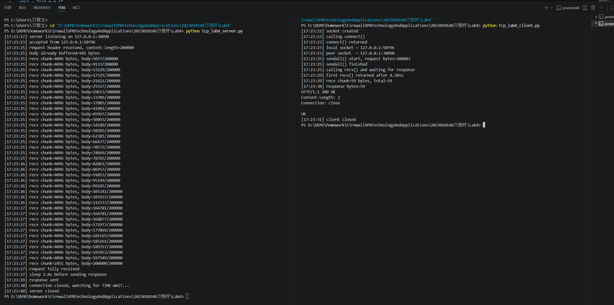
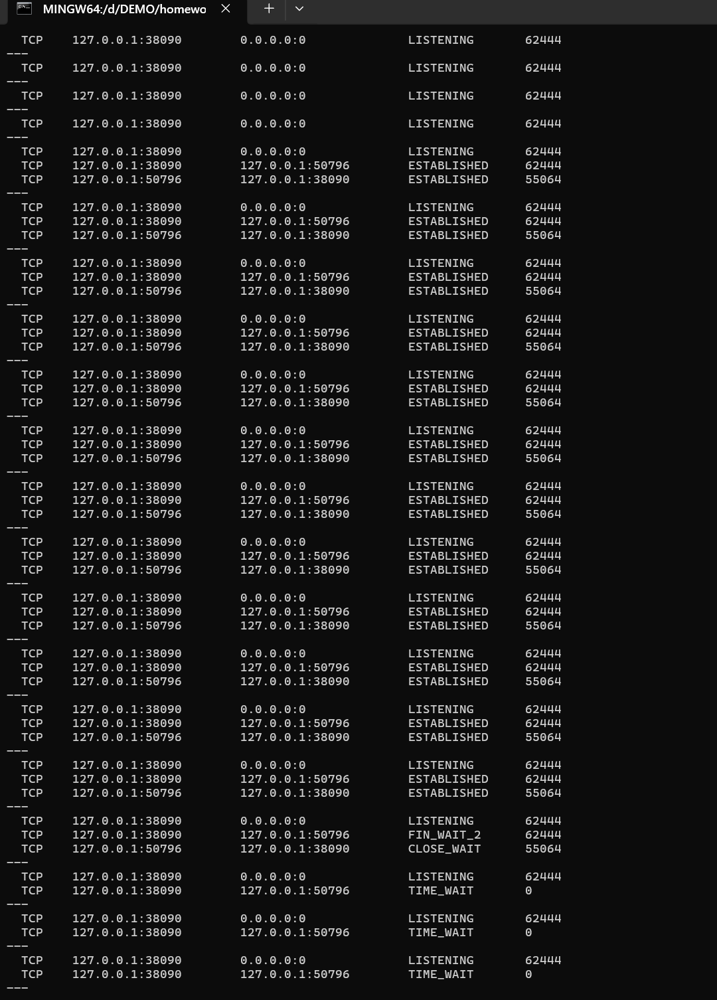
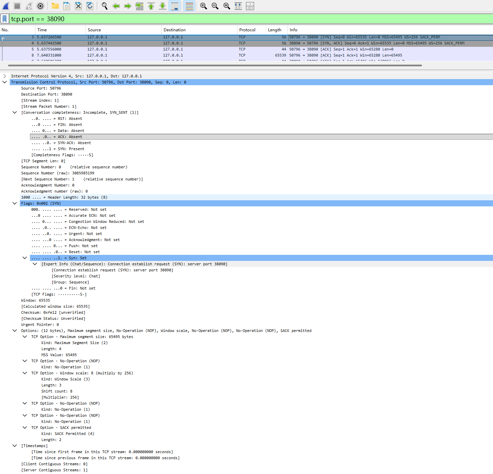
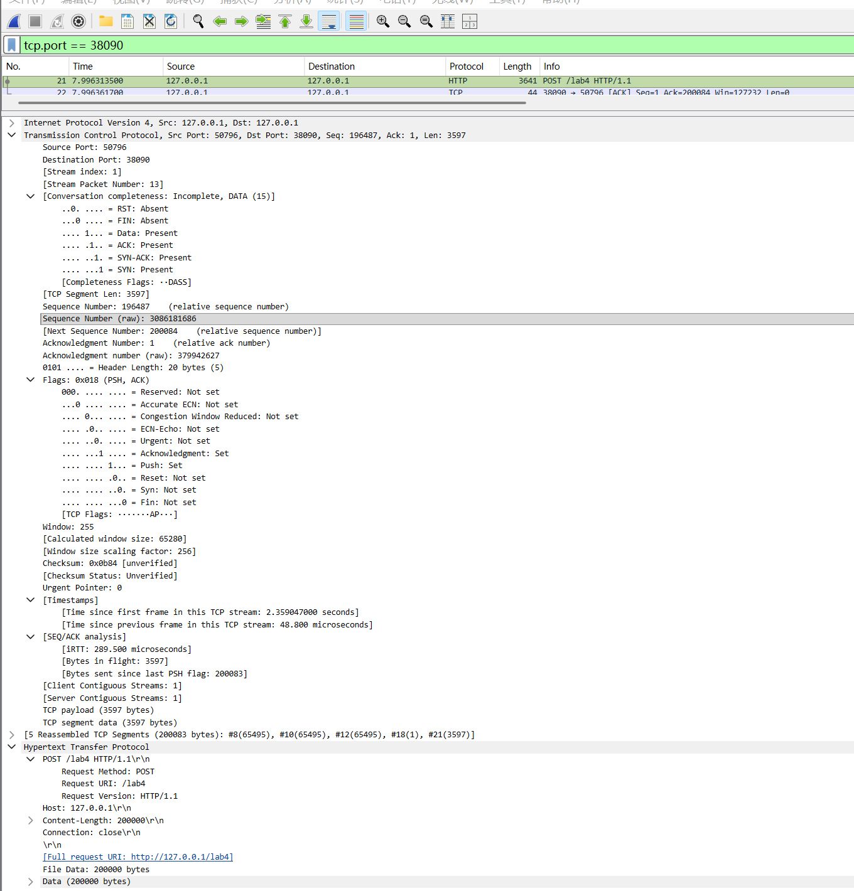
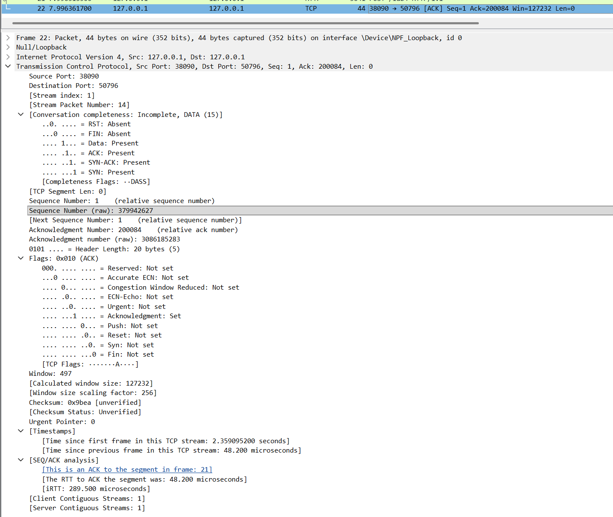
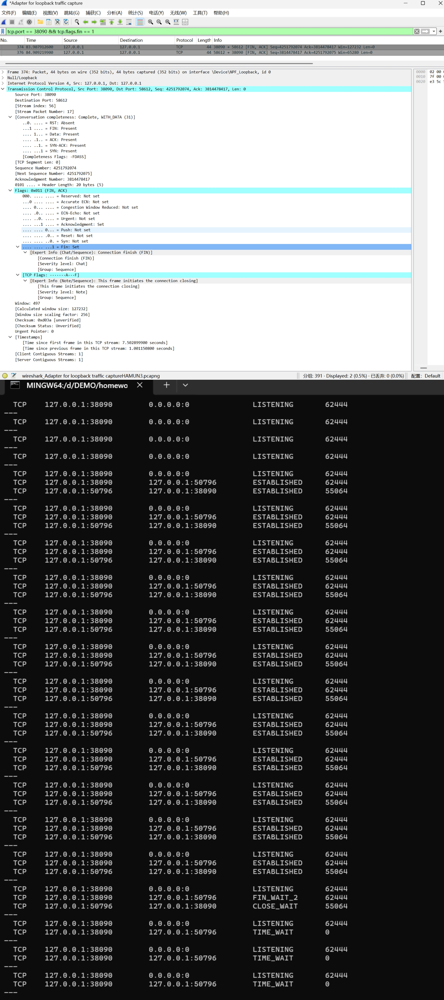

# Lab4：看见TCP 我不怕不怕啦

## 实验背景

本实验围绕一条 TCP 连接的完整生命周期展开，重点观察以下内容：

1. `socket()`、`listen()`、`accept()`、`connect()` 的职责区别
2. "连接"为什么本质上是交换控制信息而不是物理连线
3. TCP 头部中的端口号、序号、ACK 号、标志位、窗口、头部长度、可选字段
4. 三次握手如何建立收发准备
5. 应用层大块数据如何被 TCP 按 MSS 拆分
6. `Sequence Number` 与 `Acknowledgment Number` 如何配合工作
7. `recv()` 为什么会阻塞等待数据
8. 接收窗口如何反映接收方处理能力
9. ACK 与窗口更新为什么常常会被合并
10. `FIN` / `ACK` 如何完成断开
11. 为什么连接结束后套接字不会立刻删除

---

## 实验任务

### 任务一：准备实验环境并记录运行信息

**第一步：准备好四个窗口**

整个实验需要同时观察多个界面，建议在开始前把窗口布局摆好：

- **终端 A**：运行服务端
- **终端 B**：运行客户端
- **终端 C**：持续监控套接字状态（全程保持开启，不要关）
- **Wireshark**：抓包

**第二步：在终端 C 里启动持续监控**

TCP 状态变化很快，等你手动敲完 `ss` 命令再回车，状态可能已经过去了。用下面的命令让终端 C 每 0.5 秒自动刷新一次，之后只需要盯着这个窗口就行：

```bash
# Linux
watch -n 0.5 'ss -tan | grep 38090'

# macOS（没有 watch，用循环代替）
while true; do netstat -an | grep 38090; echo "---"; sleep 0.5; done

# Windows（Git Bash执行）
while true; do netstat -ano | grep 38090; echo "---"; sleep 0.5; done
```

如果你换了端口，把 `38090` 替换成实际端口。

**第三步：打开 Wireshark，选回环接口，填好过滤器，开始抓包**

回环接口在不同系统里名字不同：

| 系统 | 接口名 |
|:-----|:-------|
| Linux | `lo` |
| macOS | `lo0` |
| Windows | `Adapter for loopback traffic capture`（需提前安装 Npcap 并勾选回环支持） |

在显示过滤器里输入：

```text
tcp.port == 38090
```

然后点击开始抓包（蓝色鲨鱼鳍图标）。**先开始抓包，再运行脚本**，否则握手包会被漏掉。

**第四步：启动脚本**

```bash
# 终端 A
python3 tcp_lab4_server.py

# 终端 B（等服务端打印出 server listening on ... 后再运行）
python3 tcp_lab4_client.py
```

如果 `38090` 已被占用，两端都加环境变量换端口，同时记得把 Wireshark 过滤器和终端 C 里的端口号也改掉：

```bash
LAB4_PORT=38123 python3 tcp_lab4_server.py
LAB4_PORT=38123 python3 tcp_lab4_client.py
```

**第五步：填写下表**

| 项目                                | 你的填写内容 |
| :---------------------------------- | :----------- |
| 服务端监听地址                      |   127.0.0.1       |
| 服务端监听端口                      |   38090           |
| 客户端本地临时端口                  |   50796           |
| 客户端请求总字节数                  |   200083          |
| 服务端响应内容                      |   HTTP/1.1 200 OK\r\nContent-Length: 2\r\nConnection: close\r\n\r\nOK           |
| 客户端 `connect()` 返回前后的时间点 |   17:23:23 (calling connect()) → 17:23:23 (connect() returned)           |
| 客户端首次收到响应前等待了多久      |   4.501s           |

各项数值均可直接从终端输出读取：服务端监听信息在 `server listening on ...`，客户端本地端口在 `local socket = ...`，请求字节数在 `sendall() start, request bytes=...`，等待时间在 `first recv() returned after ...s`。



---

### 任务二：观察套接字创建与连接建立

1. 服务端启动后，观察终端 C 出现 `LISTEN` 状态，截图留存。
2. 在终端 B 里启动客户端，观察它依次打印 `socket created`、`calling connect()`、`connect() returned`。
3. 客户端打印 `connect() returned` 之后，观察终端 C 出现 `ESTABLISHED`，截图留存。脚本在 `connect()` 返回后有 2 秒停顿，这段时间足够截图。

填写下表：

| 阶段                             | 你的填写内容 |
| :------------------------------- | :----------- |
| 服务端启动、客户端未连入时的状态 |   LISTENING           |
| `connect()` 返回后服务端状态     |   ESTABLISHED           |
| `connect()` 返回后客户端状态     |   ESTABLISHED           |

简答题：

1. 服务端在客户端连接前为什么处于 `LISTEN`？

服务端调用listen()后进入 LISTEN 状态，用于监听客户端的连接请求，等待三次握手的 SYN 包。

2. 为什么这时还没有真正建立 TCP 连接？

LISTEN 是被动监听状态，仅完成了套接字的创建与绑定，尚未完成三次握手，TCP 连接未真正建立。

3. `socket()` 与 `connect()` 的区别是什么？

socket()仅创建套接字对象，分配资源，不发起网络交互；connect()主动向服务端发起连接，触发三次握手，完成 TCP 连接建立。socket()仅创建套接字对象，分配资源，不发起网络交互；connect()主动向服务端发起连接，触发三次握手，完成 TCP 连接建立。

4. 为什么 `connect()` 返回后才进入可稳定收发数据的状态？

connect()阻塞等待三次握手完成，返回时代表 TCP 连接已成功建立，双方可可靠收发数据。

5. 为什么"网线一直连着"不等于"TCP 连接已经建立"？

网线连通是物理层 / 数据链路层的连通，TCP 连接是传输层的逻辑连接，需要三次握手协商参数后才建立。

6. 这里的"连接"更准确地说是在做什么？

是 TCP 双方通过三次握手，协商序号、窗口大小、MSS 等参数，建立可靠的传输通道。



---

### 任务三：观察三次握手与 TCP 头部字段

**定位握手包**：在 Wireshark 过滤器里输入下面的条件，可以屏蔽中间的数据包，只留下握手和断开阶段的控制包：

```text
tcp.port == 38090 && (tcp.flags.syn == 1 || tcp.flags.fin == 1)
```

包列表最前面的三个包就是三次握手（SYN → SYN-ACK → ACK）。

**找到各字段的位置**：点击某个握手包，在下方详情栏展开 `Transmission Control Protocol`。源端口、目的端口、Seq、Ack、Flags、Window、Header Length 都在这里。TCP 选项在最底部的 `Options` 子项里，展开后可以看到 MSS、Window Scale、SACK Permitted，注意这三项只出现在带 SYN 标志的包里，纯 ACK 包里没有。

**关于序号显示**：Wireshark 默认开启相对序号，会把每个方向的初始序号归零显示，所以 SYN 包的 Seq 看起来是 `0`，而不是真实的随机大数。这是正常现象，实验报告按 Wireshark 显示的值填写即可。如果你想看真实值，可以去 `Edit → Preferences → Protocols → TCP` 里取消勾选 `Relative sequence numbers`。

填写下表：

| 报文       | 源端口 | 目的端口 | Seq  | Ack  | Flags | Window | Header Length |
| :--------- | :----- | :------- | :--- | :--- | :---- | :----- | :------------ |
| 第一次握手 |  50796      |   38090       |    0  |    0  |  SYN     |   65535     |     32字节          |
| 第二次握手 |   38090     |    50796      |    0  |    1  |   SYN，ACK    |  65535      |  32字节             |
| 第三次握手 |  50796      |    38090      |    1  |   1   |  ACK   |   65028     |        32字节       |

第一次握手（SYN）的 Ack 字段在 Wireshark 里通常显示为空或 `0`，这是正常的，因为此时客户端还没有收到服务端的任何数据。Header Length 在没有选项时是 20 字节，握手包因为携带了 MSS 等选项通常是 28 或 32 字节。

| TCP 选项       | 你的填写内容 |
| :------------- | :----------- |
| MSS            |    65495 bytes          |
| Window Scale   |       8       |
| SACK Permitted |       是       |

回环接口的 MSS 通常是 65495（因为回环 MTU 是 65536，比以太网的 1500 大得多），这会影响后续任务五里是否能观察到分段。

简答题：

1. 发送方和接收方端口号在连接阶段的作用是什么？

端口号（源 50796，目的 38090）结合 IP 组成四元组，唯一标识了这次通信连接，让 Wireshark 能通过 tcp.port == 38090 过滤出我们需要的流量。

2. TCP 头部如何帮助找到目标套接字？

通过头部的源 / 目的端口，操作系统内核匹配到对应的进程（服务端 38090 监听，客户端 50796 连接），将数据分发给正确的套接字。

3. 为什么初始序号不是简单固定从 1 开始？

为了防止旧连接的延迟数据包干扰新连接，Wireshark 中每次握手的 Seq 原始值（如 3805985199）都是动态随机的，保证唯一性。

4. 为什么 TCP 可选字段更容易在连接阶段看到？

因为只有 SYN 报文（第一次和第二次握手）用于协商 MSS、Window Scale 等选项，数据传输阶段的纯 ACK 通常无这些选项，所以在三次握手截图里能完整看到。



---

### 任务四：区分头部中的控制信息和套接字中的控制信息

用以下过滤器分别找到两类报文：

```text
# 纯控制报文（无应用数据）
tcp.port == 38090 && tcp.len == 0

# 携带应用数据的报文
tcp.port == 38090 && tcp.len > 0
```

从纯控制报文里选一个（SYN、纯 ACK 或 FIN-ACK 都可以），从数据报文里选一个（客户端发请求或服务端发响应的包）。

填写下表：

| 项目                   | 你的填写内容 |
| :--------------------- | :----------- |
| 纯控制报文的类型       |   SYN 报文   |
| 携带应用数据的报文类型 |HTTP POST 请求报文 |
| 头部中的控制信息举例   |Flags (SYN/ACK/FIN)、Seq、Ack、Window |
| 套接字中的控制信息举例 |ESTABLISHED 状态、LISTENING 状态 |

简答题：

1. 为什么"头部中的控制信息"和"套接字中的控制信息"不是同一件事？

头部信息是网络传输中的字段（如 Wireshark 里的 Seq/Ack），用于双方交互；套接字信息是本地内核维护的状态，用于管理本地连接。


---

### 任务五：观察数据分段、序号与 ACK

客户端发送的请求体是 200000 字节，超过了回环接口 MSS（约 65495 字节），因此应该可以在 Wireshark 里看到多个连续的数据段。用下面的过滤器找到客户端发出的数据包：

```text
tcp.srcport != 38090 && tcp.port == 38090 && tcp.len > 0
```

在包列表里连续选几个数据段，对比它们的 Seq 值。相邻两段的关系是：后一段的 Seq = 前一段的 Seq + 前一段的 TCP Segment Len。

找服务端返回给客户端的纯 ACK 报文：

```text
tcp.srcport == 38090 && tcp.flags.ack == 1 && tcp.len == 0
```

填写下表：

| 数据段  | Seq  | Ack  | TCP Segment Len | Flags |
| :------ | :--- | :--- | :-------------- | :---- |
| 第 1 段 |   1   |  1    |    3597       | PSH, ACK|
| 第 2 段 |  3598    |  1    |    65495     |    PSH, ACK   |
| 第 3 段 |  69093    |  1    |  65495   |   PSH, ACK    |

| ACK 报文 | Ack Number | Flags | Window |
| :------- | :--------- | :---- | :----- |
| 第 1 个  |  3598    |  ACK | 65280 |
| 第 2 个  |  69093   |  ACK|  130816  |
| 第 3 个  | 196487     |  ACK  | 127232 |

| 项目                         | 你的填写内容 |
| :--------------------------- | :----------- |
| 是否发生分段                 |    是          |
| 握手中观察到的 MSS           |   65495 bytes |
| 单段长度与 MSS 的关系        |  单段长度小于等于 MSS  |
| ACK 号大致确认到了第几个字节 |      200084        |

简答题：

1. 应用程序是否直接决定每个网络包的数据长度？为什么？

否。应用程序调用 sendall(200083)，但 TCP 协议栈根据 MSS（65495）自动将数据拆分为多个分段（如你的截图中分为 5 段），应用程序无法控制单个包的长度。

2. 大块应用数据为什么会被拆分？

因为链路 MTU 限制，超过 MSS 的数据无法在一个报文里传输，所以必须拆分。

1. `MSS` 与 `MTU` 的关系是什么？

MSS 是 MTU 减去 IP 和 TCP 头部长度后的最大数据部分，回环接口 MSS 为 65495，对应很大的 MTU。

4. "一次 `sendall()`"与"一个 TCP 包"之间是什么关系？

是一对多的关系。一次 sendall() 发送 20 万字节，最终变成了 Wireshark 里的多个 TCP 分段包。

5. 为什么 ACK 体现的是累计确认？

比如 Ack=200084 表示：我已经收到了到 200083 字节为止的所有数据，不需要逐个确认每一个分段。

6. 如果中间某一段丢失，ACK 会出现什么变化？

接收方会持续重复发送缺失段之前的 ACK（如重复 Ack=3598），通知发送方重传，直到该段收到。




---

### 任务六：观察 `recv()` 阻塞与窗口字段

`recv()` 的等待时间直接从客户端终端读取，`calling recv() and waiting for response` 到 `first recv() returned after ...s` 之间就是等待时长，脚本已经帮你计算好了。

在 Wireshark 里找窗口值：用过滤器 `tcp.port == 38090 && tcp.flags.ack == 1` 列出所有 ACK 包，点击其中一个，在详情栏 `Transmission Control Protocol` 里找 `Window` 字段。如果同时显示了 `Calculated window size`，优先看这个值，它已经把 Window Scale 的缩放算进去了，是对方实际能接收的字节数。

如果包列表的 Info 列出现了 `[TCP Window Update]` 标注，说明这个包的主要目的是通知对方窗口变化，重点观察它的 `Window` 字段。

填写下表：

| 项目                                   | 你的填写内容 |
| :------------------------------------- | :----------- |
| 客户端开始调用 `recv()` 的时间         |  17:23:25  |
| 客户端第一次收到响应的时间             | 17:23:29  |
| `recv()` 是否立刻返回                  |  否   |
| 首次收到响应前等待了多久               |   4.501s  |
| `recv()` 等待期间连接是否已经建立      |     是   |
| 第 1 个 ACK 报文的窗口值               |   65280    |
| 第 2 个 ACK 报文的窗口值               |  130816   |
| 第 3 个 ACK 报文的窗口值               |   127232     |
| 窗口值是否变化                         |   是     |
| 若变化，变化趋势                       |   动态变化  |
| ACK 与窗口更新是否可以出现在同一个包中 |   是     |
| 是否看到 RTT 或 ACK 往返时间相关信息   |  是    |

简答题：

1. "连接建立"和"应用收到数据"之间是什么关系？

连接建立是前提（进入 ESTABLISHED），但数据到达缓冲区需要时间。客户端在 17:23:25 调用 recv，但 17:23:29 才收到，说明连接建立不代表数据瞬间到达

2. 为什么说 `read` / `recv` 在数据未到达时会被挂起？

因为客户端日志显示 waiting for response 长达 4.5s，说明 recv() 阻塞了，直到数据从服务端发来。

3. 窗口字段反映了接收方哪方面的能力？

反映了接收方的接收缓冲区剩余容量。窗口越大，说明能接收的数据越多，限制了发送方的流量。

1. 为什么发送方不能无限制连续发送数据？

受窗口大小限制。如果发送太快，接收方缓冲区满了，窗口会变为 0，发送方必须停止。

1. 滑动窗口为什么既提高效率又避免压垮接收方？

滑动窗口允许发送方连续发送多个段（效率高），同时通过窗口大小动态限制发送速率（避免压垮接收方）。


---

### 任务七：观察响应返回与双向 `seq/ack`

TCP 的 Seq/Ack 是双向独立的，客户端有自己的发送序号，服务端有自己的发送序号。用下面的过滤器只看服务端发出的数据包（源端口是 38090，有应用数据）：

```text
tcp.srcport == 38090 && tcp.len > 0
```

紧跟在服务端数据包后面的、客户端发出的 ACK 包，其 Ack Number 确认的就是服务端的发送序号。

填写下表：

| 项目                     | 你的填写内容 |
| :----------------------- | :----------- |
| 服务端响应数据报文的 Seq |     1         |
| 服务端响应数据报文的 Ack |   200084      |
| 客户端确认报文的 Ack     |     2         |

简答题：

1. 为什么 TCP 的 `seq/ack` 是双向分别计算的？

因为 TCP 是全双工的，双向数据流独立。服务端有自己的发送 Seq（响应 Seq=1），客户端也有自己的发送 Seq（数据 Seq=1），互不干扰。

2. 为什么双方都需要各自的初始序号？

为了分别追踪各自方向的数据传输，确保双向数据的可靠传输，不会混淆。

3. 为什么发送应用数据时报文通常仍然带 `ACK`？

为了 “捎带确认”，在传输数据的同时确认收到的数据，减少网络中额外的纯 ACK 报文数量，提升效率。


---

### 任务八：观察连接断开与套接字延迟删除

用下面的过滤器精确定位所有带 FIN 的包：

```text
tcp.port == 38090 && tcp.flags.fin == 1
```

通常会看到两个 FIN 包（双方各一个）。看第一个 FIN 包的源端口，就能判断谁先发起断开。

**关于 TIME-WAIT**：TIME-WAIT 只出现在主动发起关闭的一方（先发 FIN 的那端）。服务端脚本在 `conn.close()` 之后会继续运行 10 秒再退出，这段时间可以在终端 C 里观察 TIME-WAIT。Linux 上 TIME-WAIT 通常持续约 60 秒，macOS 上可能较短，如果没有观察到请如实说明。

填写下表：

| 项目                                    | 你的填写内容 |
| :-------------------------------------- | :----------- |
| 谁先发送 FIN                            | 服务端（端口 38090）  |
| 关闭阶段共观察到几个带 FIN 的报文       |     2个      |
| 最终 ACK 是否可见                       |  是     |
| 关闭后是否观察到 `TIME-WAIT` 或等价现象 |   是    |

简答题：

1. 为什么关闭连接不能只发一个结束通知？

因为是全双工连接，需要四次挥手。你的 teardown 截图中可以看到服务端先发 FIN，之后还有客户端的 FIN 和 ACK，必须双向关闭才能保证数据传输结束。

2. 为什么连接结束后套接字不会立刻删除？

主动关闭方（服务端）会进入 TIME-WAIT 状态，从 states.png 可以看到，它会等待 2MSL，确保对方收到了最后的 ACK。

3. 如果最后一个 ACK 丢失，而旧套接字已经立刻删除，可能带来什么问题？

对方会重传 FIN，本机因无对应连接回复 RST 复位包，导致连接异常关闭，还可能干扰后续新连接。



---

## 问答题

1. TCP 的"连接"到底意味着什么？它为什么不是"把网线连上"？

TCP 的连接是传输层的逻辑双向可靠通道，需三次握手协商序号、窗口等参数；网线连通是物理层的物理通路，二者层级不同，物理连通不代表逻辑连接建立。

2. 三次握手为什么能让双方进入可通信状态？

三次握手完成三个核心目标：
确认双方收发能力正常
协商初始序号，保障数据可靠传输
协商 MSS、窗口等传输参数，为数据传输做好准备

3. TCP 头部中的控制字段如何支撑收发数据？

Seq/Ack：保证数据顺序与可靠性，实现重传机制
Window：实现流量控制，避免接收方缓冲区溢出
Flags：控制连接建立、断开、数据传输等状态
Checksum：校验数据完整性，防止传输错误

4. ACK、窗口、等待时间为什么会共同影响 TCP 的可靠传输？

ACK：确认数据接收，触发重传，保证数据不丢失
窗口：限制发送速率，避免压垮接收方，实现流量控制
等待时间：recv()阻塞等待数据，保障应用层有序交付，三者协同实现可靠传输

5. 断开连接为什么仍然需要严格的控制信息交换？

TCP 是全双工通信，需四次挥手分别关闭双向连接，同时通过 TIME-WAIT 状态保证最后一个 ACK 被接收，避免数据丢失和历史数据包干扰。

6. 如果服务端根本没有启动，客户端调用 `connect()` 时会看到什么现象？

客户端会收到 RST 复位报文，connect()调用失败，抛出连接拒绝错误，套接字直接进入 CLOSED 状态。

7. 如果中途人为制造丢包，ACK、重传、窗口之间会出现什么变化？

接收方重复发送丢包前序号的 ACK
发送方收到重复 ACK 后触发快速重传
接收方窗口动态减小，限制发送速率，直至丢包恢复

8. 如果把客户端发送的数据改得更大，窗口字段和分段情况会如何变化？

分段：分段数量显著增加，更多分段被传输
窗口：接收方窗口随缓冲区剩余容量动态调整，易出现窗口减小、零窗口，实现流量控制

9. 如果把服务端读取速度改得更慢，是否更容易看到窗口更新甚至零窗口？

是。服务端读取变慢，接收缓冲区剩余容量持续减小，窗口字段逐步缩小，最终出现零窗口；缓冲区释放后，会发送窗口更新报文恢复传输。

---

## 截图要求

- 截图须清晰，终端文字和 Wireshark 字段可读。
- 所有截图与本 `Lab4.md` 放在同一目录下。
- 命名规范：

| 截图内容               | 文件名                  |
| :--------------------- | :---------------------- |
| 服务端与客户端运行结果 | `run.png`               |
| `ss` 状态变化          | `states.png`            |
| 三次握手与 TCP 选项    | `handshake_header.png`  |
| 大请求分段与 MSS       | `segmentation.png`      |
| ACK 与窗口观察         | `ack_window.png`        |
| 断开与最终状态         | `teardown_timewait.png` |

具体要求：

1. `run.png`：终端截图，至少能看到服务端 `server listening on ...`、客户端 `calling connect()`、`connect() returned`、`calling recv() and waiting for response`、`first recv() returned after ...s`。

2. `states.png`：终端截图，至少能看到 `LISTEN`、`ESTABLISHED`，以及 `TIME-WAIT`（若能观察到）。推荐截 `watch` 命令的持续输出画面，可以在一张截图里同时展示多个状态的变化过程。

3. `handshake_header.png`：Wireshark 截图，至少能看到三次握手中某个包的 `Source Port`、`Destination Port`、`Sequence Number`、`Acknowledgment Number`、`Flags`、`Window`，以及 `Options` 中的 `Maximum segment size`、`Window Scale`、`SACK Permitted`。

4. `segmentation.png`：Wireshark 截图，至少能看到客户端发送数据的 TCP 包的 `TCP Segment Len`、`Seq`、`Ack`。若能观察到分段，尽量截出多个连续数据段。

5. `ack_window.png`：Wireshark 截图，至少能看到一个或多个 ACK 报文的 `Acknowledgment Number`、`Window`，以及 `Calculated window size`（若显示）、`[TCP Window Update]`（若出现）。

6. `teardown_timewait.png`：Wireshark 截图或 Wireshark 与终端截图的拼图，至少能看到带 `FIN` 的包，以及 `TIME-WAIT` 状态（若能观察到）。

---

## 提交要求

在自己的文件夹下新建 `Lab4/` 目录，提交以下文件：

```text
学号姓名/
└── Lab4/
    ├── Lab4.md
    ├── tcp_lab4_server.py
    ├── tcp_lab4_client.py
    ├── run.png
    ├── states.png
    ├── handshake_header.png
    ├── segmentation.png
    ├── ack_window.png
    └── teardown_timewait.png
```

---

## 截止时间

2026-04-23，届时关于 Lab4 的 PR 请求将不会被合并。
